## Factoryパターンの本質

Aggregateの生成は、時に複雑なビジネスルールを伴います。「注文には必ず顧客IDが必要」「商品は有効なカテゴリを持たなければならない」「複数の値の組み合わせが不変条件を満たすこと」——こうした生成時の制約をAggregateのコンストラクタに全て詰め込むと、コンストラクタが肥大化しテスタビリティも低下します。

Factoryパターンは、**複雑なオブジェクト生成の責務をカプセル化**するパターンです。生成する側（クライアント）は「どのように生成するか」を知る必要がなく、「何を生成したいか」だけを伝えればよくなります。

## Factoryが必要な3つのケース

1. **生成ロジックが複雑で、Aggregateのコンストラクタに書くと不自然なとき**（複数のAggregateや外部サービスの情報が必要な場合）
2. **生成のバリエーションが複数存在するとき**（「下書きから作成」「テンプレートから作成」「コピーから作成」など）
3. **DBからの復元（Reconstitution）と新規生成を明確に区別したいとき**

## FactoryメソッドvsFactoryクラスvsBuilderの使い分け

```mermaid
flowchart TD
    START([Aggregateを生成したい]) --> Q1{生成ロジックの<br/>複雑さは?}
    Q1 -->|シンプル: 引数数個| FM[静的ファクトリメソッド<br/>Order.Create&#40;...&#41;]
    Q1 -->|中程度: 外部依存なし| FM
    Q1 -->|複雑: 外部サービス・<br/>他Aggregateが必要| FC[Factoryクラス<br/>OrderFactory.CreateFromCart&#40;...&#41;]

    Q2{生成パラメータが<br/>多く省略可能なものも<br/>あるか?}
    FM --> Q2
    Q2 -->|Yes| BP[Builderパターン<br/>OrderBuilder.WithItems&#40;...&#41;.Build&#40;&#41;]
    Q2 -->|No| FM

    DB[(DBからの復元<br/>Reconstitution)] --> RF[Reconstitution Factory<br/>Order.Reconstitute&#40;snapshot&#41;]

    style FM fill:#e8f4f8,stroke:#2980b9
    style FC fill:#e8f8e8,stroke:#27ae60
    style BP fill:#f8f4e8,stroke:#e67e22
    style RF fill:#f8e8f8,stroke:#8e44ad
```



## Before/After: コンストラクタから静的ファクトリメソッドへ

### Before: 生成ロジックがコンストラクタに集中し、目的が不明

```csharp
// 悪い例: publicコンストラクタに全てを詰め込む
public class Order
{
    public Order(Guid id, Guid customerId, OrderStatus status,
                 DateTime createdAt, string? couponCode, decimal? discountAmount)
    {
        // 新規作成なのか、DBからの復元なのか、テスト用なのか区別できない
        Id = id;
        CustomerId = customerId;
        Status = status;
        CreatedAt = createdAt;
        // couponCodeとdiscountAmountの組み合わせが有効かのチェックが曖昧
    }
}

// 使う側: 引数の意味が分かりにくい
var order = new Order(Guid.NewGuid(), customerId, OrderStatus.Draft,
                      DateTime.UtcNow, null, null);
```

### After: 静的ファクトリメソッドで意図を明確に表現

```csharp
public class Order : AggregateRoot
{
    // privateコンストラクタ: 外部から直接newできない
    private Order() { }

    // 静的ファクトリメソッド1: 通常の新規注文作成
    public static Order Create(CustomerId customerId)
    {
        if (customerId == null)
            throw new DomainException("顧客IDは必須です。");

        var order = new Order
        {
            Id = new OrderId(Guid.NewGuid()),
            CustomerId = customerId,
            Status = OrderStatus.Draft,
            CreatedAt = DateTime.UtcNow,
            _items = new List<OrderItem>()
        };

        order.RaiseDomainEvent(new OrderCreated(order.Id, customerId));
        return order;
    }

    // 静的ファクトリメソッド2: クーポン適用済み注文の作成
    public static Order CreateWithCoupon(CustomerId customerId, Coupon coupon)
    {
        if (coupon.IsExpired)
            throw new DomainException("有効期限切れのクーポンは使用できません。");

        var order = Create(customerId);
        order.ApplyCoupon(coupon);
        return order;
    }

    // Reconstitution Factory: DBからの復元（ドメインイベントを発行しない）
    public static Order Reconstitute(OrderSnapshot snapshot)
    {
        var order = new Order
        {
            Id = new OrderId(snapshot.Id),
            CustomerId = new CustomerId(snapshot.CustomerId),
            Status = Enum.Parse<OrderStatus>(snapshot.Status),
            TotalAmount = Money.FromSnapshot(snapshot.TotalAmountSnapshot),
            CreatedAt = snapshot.CreatedAt,
            _items = snapshot.Items
                .Select(OrderItem.Reconstitute)
                .ToList()
        };
        // 注意: Reconstitutionはイベントを発行しない（既に発生した事実の復元）
        return order;
    }
}
```

## OrderFactory（別クラス）: 複雑な生成ケース

生成に他のAggregateのデータや外部サービスが必要な場合は、別クラスのFactoryを作成します。

```csharp
// 複雑な生成: カートの内容から注文を生成する
public class OrderFactory
{
    private readonly IProductRepository _productRepo;
    private readonly IInventoryChecker _inventoryChecker;

    public OrderFactory(IProductRepository productRepo,
                        IInventoryChecker inventoryChecker)
    {
        _productRepo = productRepo;
        _inventoryChecker = inventoryChecker;
    }

    // カート → 注文への変換（複数のAggregateにまたがる生成）
    public async Task<Order> CreateFromCartAsync(CustomerId customerId, Cart cart)
    {
        if (!cart.Items.Any())
            throw new DomainException("カートが空です。注文を作成できません。");

        var order = Order.Create(customerId);

        foreach (var cartItem in cart.Items)
        {
            // 商品情報を取得（別Aggregateへのアクセス）
            var product = await _productRepo.FindByIdAsync(cartItem.ProductId)
                ?? throw new ProductNotFoundException(cartItem.ProductId);

            // 在庫確認（外部サービスへのアクセス）
            var availability = await _inventoryChecker.CheckAsync(
                cartItem.ProductId, cartItem.Quantity);

            if (!availability.IsAvailable)
                throw new InsufficientInventoryException(
                    product.Name, cartItem.Quantity, availability.StockCount);

            // 注文に明細を追加（Aggregateのメソッドを呼ぶ）
            order.AddItem(product.Id, product.Name, product.Price, cartItem.Quantity);
        }

        return order;
    }

    // テンプレートから注文を複製する
    public Order CloneFromTemplate(Order template, CustomerId newCustomerId)
    {
        var order = Order.Create(newCustomerId);

        foreach (var item in template.Items)
        {
            order.AddItem(item.ProductId, item.ProductName, item.UnitPrice, item.Quantity);
        }

        return order;
    }
}
```

## コンストラクタとFactoryの使い分け基準

```csharp
// コンストラクタで十分なケース: 生成ロジックが単純なEntity
public class OrderItem
{
    // 引数が少なく、バリデーションも単純
    // Orderを通じてのみ生成されるので、publicである必要もない
    internal OrderItem(OrderId orderId, ProductId productId,
                       string productName, Money unitPrice, int quantity)
    {
        // シンプルなバリデーション
        if (quantity <= 0) throw new DomainException("数量は1以上である必要があります。");
        if (string.IsNullOrWhiteSpace(productName)) throw new DomainException("商品名は必須です。");

        OrderId = orderId;
        ProductId = productId;
        ProductName = productName;
        UnitPrice = unitPrice;
        Quantity = quantity;
    }

    // DBからの復元用（バリデーションなし・イベントなし）
    internal static OrderItem Reconstitute(OrderItemSnapshot snapshot)
    {
        return new OrderItem
        {
            OrderId = new OrderId(snapshot.OrderId),
            ProductId = new ProductId(snapshot.ProductId),
            ProductName = snapshot.ProductName,
            UnitPrice = Money.FromSnapshot(snapshot.UnitPriceSnapshot),
            Quantity = snapshot.Quantity
        };
    }
}
```

> **専門家の視点**
>
> Reconstitution（DBからの復元）のFactoryを通常の生成Factoryと明確に分けることは、非常に重要です。
>
> Reconstitutionでは「既に正当に生成されたデータをDBから読み戻している」という前提があるため、ビジネスバリデーションを再実行すべきではありません。仮にデータに不整合があったとしても、それはReconstituteの段階ではなく、データ書き込みの段階で防ぐべきです。
>
> また、`Order.Reconstitute()`をORMのマッピング設定で呼ぶか、Repositoryの実装で呼ぶかは設計の好みが分かれますが、筆者はRepository内で明示的に呼ぶアプローチを好みます。「DBからオブジェクトが復元された」というプロセスが明示的に見えるからです。
>
> 一方で、EF CoreのようなORMはリフレクションを使ってprivateセッターにアクセスできるため、Reconstitute専用のメソッドを設けず、privateコンストラクタ + ORMマッピングだけで完結させる設計も実用的です。プロジェクトの複雑さに応じて選択してください。

## まとめ

Factoryは「複雑な生成をカプセル化し、生成の意図を明確にする」パターンです。静的ファクトリメソッドは軽量で意図が明確、Factoryクラスは外部依存のある複雑な生成に適しています。そして新規生成とReconstituteを明示的に分けることで、データの整合性保証を生成段階に限定できます。

これでDDDの主要な戦術的パターン——Aggregate、Domain Event、Repository、Service、Factory——の解説が完了しました。これらのパターンは単独で存在するのではなく、互いに連携してドメインの複雑さを制御する「パターンの言語」を形成しています。
