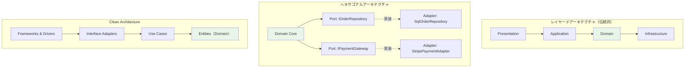

## ドメインは何にも依存しない

DDDの実践において最も重要な原則のひとつが「ドメイン層は外部の何にも依存しない」という鉄則です。ドメインモデルがデータベースのORMや、Webフレームワーク、外部APIクライアントに依存してしまうと、ビジネスロジックがインフラの都合に引きずられて汚染されます。この原則を守るために、3つの代表的なアーキテクチャパターンが活用されています。

---

## レイヤードアーキテクチャ（伝統的）

伝統的なレイヤードアーキテクチャは、システムを4層に分離します。Presentation（UI）→ Application（ユースケース）→ Domain（ビジネスロジック）→ Infrastructure（DB・外部サービス）という上から下への依存方向を規定します。シンプルで理解しやすい反面、Domainが下位のInfrastructureに依存しがちという問題があります。

---

## ヘキサゴナルアーキテクチャ（Ports & Adapters）

Alistair Cockburnが2005年に提唱したヘキサゴナルアーキテクチャは、アプリケーションを「内側」と「外側」に分け、その境界を「Port（インターフェース）」と「Adapter（実装）」で接続します。DBもUIもAPIも、すべて「外側」の Adapter として扱われます。ドメインはインターフェースだけに依存し、具体的な実装を知りません。

---

## Clean Architecture（Uncle Bob）

Robert C. Martinが提唱したClean Architectureは、ヘキサゴナルの考えを発展させ、Entities → Use Cases → Interface Adapters → Frameworks & Drivers という同心円で表現します。依存関係の矢印は常に「内側に向かう」のみ許可されます。最も内側のEntities層（ドメイン）は何にも依存しません。

---

## 3アーキテクチャの依存方向図



---

## Before（依存が逆転している悪い例）

```csharp
// ❌ Before: Domainクラスが直接EF Coreに依存
public class Order
{
    // EF CoreのDbContextを直接使用 → インフラ依存
    private readonly AppDbContext _db;

    public Order(AppDbContext db)
    {
        _db = db;
    }

    public void Complete()
    {
        var payment = _db.Payments.FirstOrDefault(p => p.OrderId == this.Id);
        if (payment == null) throw new Exception("Payment not found");
        // ビジネスロジックとORMが混在
    }
}
```

---

## After（依存性逆転の原則を適用したC#コード）

```csharp
// ✅ After: Domain層はインターフェースだけに依存

// --- Domain層（純粋なビジネスロジック） ---
public interface IOrderRepository  // Port（ドメイン層に定義）
{
    Order? FindById(OrderId id);
    void Save(Order order);
}

public class Order  // Entity（インフラへの依存ゼロ）
{
    public OrderId Id { get; private set; }
    public OrderStatus Status { get; private set; }
    private readonly List<OrderItem> _items = new();

    public void Complete()
    {
        if (!_items.Any())
            throw new DomainException("注文に商品が含まれていません");
        Status = OrderStatus.Completed;
        AddDomainEvent(new OrderCompletedEvent(Id));
    }
}

// --- Infrastructure層（Adapter）---
public class SqlOrderRepository : IOrderRepository  // Portの実装
{
    private readonly AppDbContext _db;

    public SqlOrderRepository(AppDbContext db) => _db = db;

    public Order? FindById(OrderId id)
        => _db.Orders.FirstOrDefault(o => o.Id == id.Value);

    public void Save(Order order)
    {
        _db.Orders.Update(order);
        _db.SaveChanges();
    }
}

// --- 依存性注入の設定（Program.cs） ---
builder.Services.AddScoped<IOrderRepository, SqlOrderRepository>();
builder.Services.AddScoped<CompleteOrderUseCase>();
```

このように、`IOrderRepository`はドメイン層に定義し、`SqlOrderRepository`はインフラ層で実装します。DIコンテナが「どの実装を使うか」を決定するため、ドメインは具体的なDBの存在を知りません。

---

> **専門家の視点**
>
> ヘキサゴナルアーキテクチャとClean Architectureは本質的に同じ思想を持ちます。両者の核心は「依存関係の方向性を制御する」ことです。よくある誤りは「フォルダ構造をレイヤーに合わせれば完了」と思うことです。重要なのは**コンパイル時の依存方向**です。`Domain`プロジェクトの`.csproj`ファイルを開いて、InfrastructureやWebへの`<ProjectReference>`が一切ないことを確認してください。それがドメイン独立性の唯一の証明です。また、テスト時にDBをモックできるかどうかが、アーキテクチャが正しく機能している最良の指標になります。

---

## まとめ

3つのアーキテクチャはいずれも「ドメインを中心に置き、外部への依存を反転させる」という目標を共有しています。DDDプロジェクトでは、ヘキサゴナルまたはClean Architectureの採用を強くお勧めします。依存性逆転の原則（DIP）とDIコンテナを組み合わせることで、ドメインロジックをテスト可能で変更に強い状態に保つことができます。
