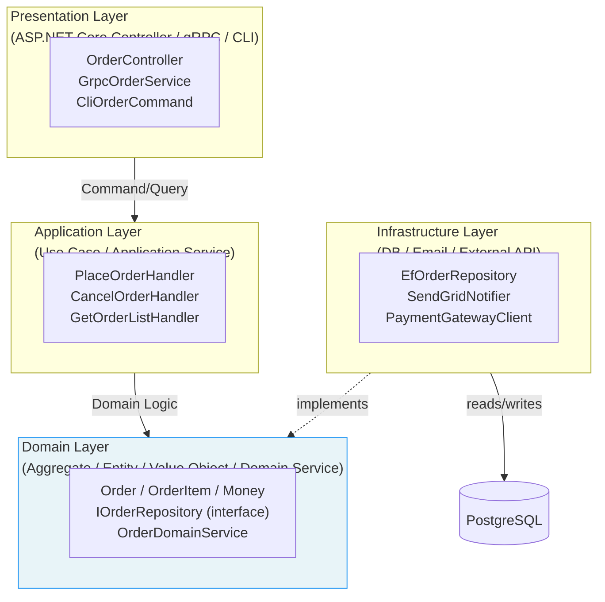
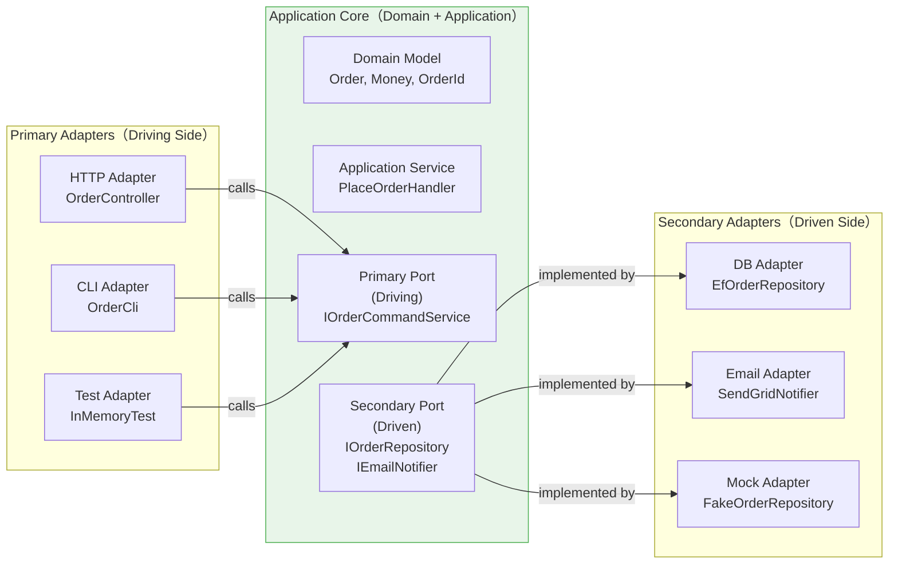
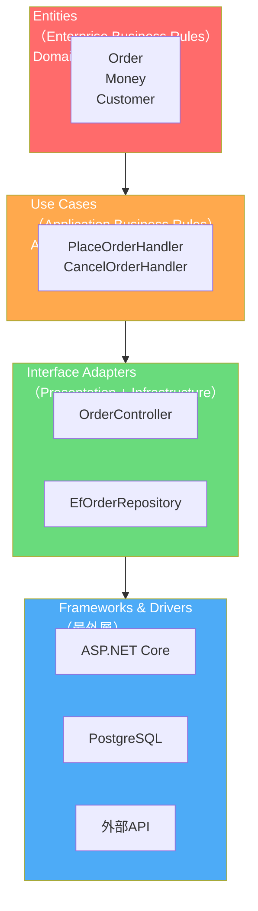
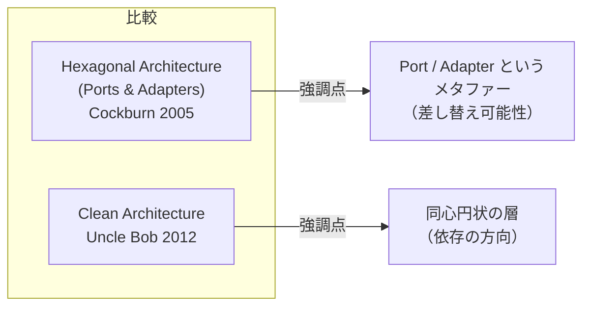

# 第 14 章: DDDを支えるアーキテクチャ — Layered・Hexagonal・Clean Architecture

## 0. TL;DR

DDD の「ドメインモデルがビジネスの核心」という思想を守るには、ドメイン層が外部（DB・フレームワーク・外部API）に依存しない構造が必要。Hexagonal Architecture（Ports & Adapters）と Clean Architecture は、依存方向を「外から中へ」に強制することでこれを実現する。どちらも本質は同じ — Domain Layer を守る絶縁層の設計。

---

## 1. なぜアーキテクチャがドメインを守るのか

### 1.1 アーキテクチャ不在のシステムが辿る道

DDD を学んでドメインモデルを設計しても、アーキテクチャを考えないと、数ヶ月でこうなります:

```csharp
// 「DDDっぽいコード」が退化した末路
public class Order
{
    private readonly AppDbContext _db;      // ← Domain がDBに依存
    private readonly IEmailSender _email;  // ← Domain が外部APIに依存
    private readonly ILogger _logger;      // ← Domain がロギングに依存

    public void Place()
    {
        // ビジネスロジック
        Status = OrderStatus.Placed;

        // ← DomainがDBを直接叩く（テスト不可能）
        _db.Orders.Update(this);
        _db.SaveChanges();

        // ← DomainがEmailを送信（副作用がカプセル化されていない）
        _email.SendConfirmation(CustomerId, TotalAmount);

        _logger.LogInformation("Order {Id} placed", Id);
    }
}
```

この設計の問題点:

1. **テストが困難**: `Order.Place()` のテストにデータベースとメールサーバーが必要
2. **インフラの変更がドメインを壊す**: MySQL → PostgreSQL 移行でドメインコードが変わる
3. **ドメインルールがインフラのコードと混在**: どこがビジネスロジックか分からない
4. **コンパイル依存が循環する**: Infrastructure が Domain に依存し、Domain も Infrastructure に依存

### 1.2 DIP（依存逆転の原則）の適用

解決策は **Dependency Inversion Principle（DIP）**です。

```
悪い依存:
Domain → Infrastructure

良い依存:
Infrastructure → Domain（インターフェース）
Domain → Infrastructure（コンクリートクラス）は禁止
```

Domain Layer がインターフェースを定義し、Infrastructure Layer がそれを実装する。この逆転が、Domain を守る構造の核心です。

```csharp
// Domain Layer に interface を定義（依存の矢印は外→中）
namespace MyApp.Domain.Orders
{
    public interface IOrderRepository  // ← Domain が定義
    {
        Task<Order?> FindByIdAsync(OrderId id);
        Task SaveAsync(Order order);
    }

    public interface IEmailNotifier   // ← Domain が定義
    {
        Task SendOrderConfirmationAsync(CustomerId customerId, Money amount);
    }
}

// Infrastructure Layer が implements（外が中に依存する）
namespace MyApp.Infrastructure.Persistence
{
    public class EfOrderRepository : IOrderRepository  // ← Infrastructure が実装
    {
        private readonly AppDbContext _ctx;
        // ...
    }
}

namespace MyApp.Infrastructure.Email
{
    public class SendGridEmailNotifier : IEmailNotifier  // ← Infrastructure が実装
    {
        private readonly SendGridClient _client;
        // ...
    }
}
```

これで `Domain` プロジェクトは `Infrastructure` プロジェクトを参照しません。逆方向のみです。

---

## 2. Layered Architecture（レイヤードアーキテクチャ）

### 2.1 4 層の構造



**各層の責務:**

| 層 | 責務 | 例 |
|----|------|-----|
| **Presentation** | HTTP/gRPC/CLIのリクエストをApplicationに転送 | Controller, gRpc Service |
| **Application** | ユースケースのオーケストレーション | CommandHandler, QueryHandler |
| **Domain** | ビジネスルール・不変条件・状態遷移 | Aggregate, Entity, Value Object |
| **Infrastructure** | 外部システムへの接続 | EFCore, HTTP Client |

**依存の方向: 外 → 内のみ**
- Presentation → Application → Domain ← Infrastructure

### 2.2 「参照の向き」をプロジェクト分割で強制する

```xml
<!-- MyApp.Domain.csproj: 外部依存ゼロ -->
<Project Sdk="Microsoft.NET.Sdk">
  <PropertyGroup>
    <TargetFramework>net9.0</TargetFramework>
  </PropertyGroup>
  <!-- 外部 NuGet パッケージへの参照なし -->
</Project>

<!-- MyApp.Application.csproj: Domain のみ参照 -->
<Project Sdk="Microsoft.NET.Sdk">
  <ItemGroup>
    <ProjectReference Include="..\MyApp.Domain\MyApp.Domain.csproj" />
    <!-- Infrastructure への参照なし -->
  </ItemGroup>
</Project>

<!-- MyApp.Infrastructure.csproj: Domain + Application を参照 -->
<Project Sdk="Microsoft.NET.Sdk">
  <ItemGroup>
    <ProjectReference Include="..\MyApp.Domain\MyApp.Domain.csproj" />
    <ProjectReference Include="..\MyApp.Application\MyApp.Application.csproj" />
    <PackageReference Include="Microsoft.EntityFrameworkCore.PostgreSQL" Version="9.0.0" />
    <PackageReference Include="SendGrid" Version="9.28.1" />
  </ItemGroup>
</Project>

<!-- MyApp.Api.csproj: 全層を参照（Composition Root） -->
<Project Sdk="Microsoft.NET.Sdk.Web">
  <ItemGroup>
    <ProjectReference Include="..\MyApp.Infrastructure\MyApp.Infrastructure.csproj" />
    <ProjectReference Include="..\MyApp.Application\MyApp.Application.csproj" />
    <ProjectReference Include="..\MyApp.Domain\MyApp.Domain.csproj" />
  </ItemGroup>
</Project>
```

**プロジェクト参照がコンパイル時に依存の向きを強制する**のが、このアーキテクチャの最大の武器です。`Domain` が `Infrastructure` を参照しようとすると、コンパイルエラーになります。

---

## 3. Hexagonal Architecture（ヘキサゴナルアーキテクチャ）

### 3.1 概念の由来

Alistair Cockburn が 2005 年に提唱した "Ports & Adapters" パターン。別名「ヘキサゴナルアーキテクチャ」は、六角形の図から命名されました（六角形に特別な意味はなく、多数の Adapter が接続できることを示す）。



### 3.2 2 種類の Port

**Primary Port（Driving Port）**: アプリケーションを「駆動する」インターフェース。外部（HTTPリクエスト、CLIコマンド）がアプリケーションを呼び出す入口。

```csharp
// Primary Port: Application が定義する、外から呼ばれる契約
public interface IOrderCommandService  // Application Layer に置く
{
    Task<PlaceOrderResult> PlaceOrderAsync(PlaceOrderCommand cmd);
    Task CancelOrderAsync(CancelOrderCommand cmd);
}

// Primary Adapter: HTTP 側から Port を呼び出す
[ApiController]
[Route("api/orders")]
public class OrderController : ControllerBase  // Presentation Layer
{
    private readonly IOrderCommandService _orderService;

    public OrderController(IOrderCommandService orderService)
        => _orderService = orderService;

    [HttpPost]
    public async Task<IActionResult> PlaceOrder([FromBody] PlaceOrderRequest req)
    {
        var cmd = MapToCommand(req);
        var result = await _orderService.PlaceOrderAsync(cmd);
        return result.IsSuccess
            ? Created($"/api/orders/{result.OrderId}", result)
            : BadRequest(new { result.ErrorMessage });
    }
}
```

**Secondary Port（Driven Port）**: アプリケーションが「駆動する」インターフェース。アプリケーションが外部（DB、メールサーバー）を呼び出す契約。

```csharp
// Secondary Port: Domain が定義する、外部を呼び出す契約
public interface IOrderRepository  // Domain Layer に置く
{
    Task<Order?> FindByIdAsync(OrderId id);
    Task SaveAsync(Order order);
}

public interface IEmailNotifier  // Domain または Application Layer
{
    Task SendOrderConfirmationAsync(CustomerId customerId, Money totalAmount);
}

// Secondary Adapter: Port を DB / メールで実装
public class EfOrderRepository : IOrderRepository  // Infrastructure Layer
{
    private readonly AppDbContext _ctx;

    public async Task<Order?> FindByIdAsync(OrderId id)
        => await _ctx.Orders
            .Include(o => o.Items)
            .FirstOrDefaultAsync(o => o.Id == id);

    public async Task SaveAsync(Order order)
    {
        _ctx.Orders.Update(order);
        await _ctx.SaveChangesAsync();
    }
}

// テスト用 Secondary Adapter（実DB 不要でテスト可能）
public class InMemoryOrderRepository : IOrderRepository
{
    private readonly Dictionary<OrderId, Order> _store = new();

    public Task<Order?> FindByIdAsync(OrderId id)
        => Task.FromResult(_store.GetValueOrDefault(id));

    public Task SaveAsync(Order order)
    {
        _store[order.Id] = order;
        return Task.CompletedTask;
    }
}
```

### 3.3 Hexagonal Architecture の本質

> **「Application Core の外側に Adapter を差し替え可能にすること」**

本番環境では `EfOrderRepository` と `SendGridNotifier` を使う。テスト環境では `InMemoryOrderRepository` と `FakeEmailNotifier` を使う。Application Core のコードは一切変えない。これが Hexagonal Architecture の目指す世界です。

```csharp
// テスト: 全て InMemory の Adapter で Application Core をテスト
public class PlaceOrderHandlerTests
{
    [Fact]
    public async Task PlaceOrder_WithValidData_ShouldSucceed()
    {
        // Arrange: テスト用 Adapter を注入
        var orderRepo = new InMemoryOrderRepository();    // DB 不要
        var customerRepo = new InMemoryCustomerRepository();
        var emailNotifier = new FakeEmailNotifier();      // メールサーバー不要
        var dispatcher = new FakeDomainEventDispatcher();

        // 顧客データの準備
        var customer = Customer.Create(
            CustomerId.New(), "テスト太郎",
            EmailAddress.Of("test@example.com")
        );
        await customerRepo.SaveAsync(customer);

        var handler = new PlaceOrderHandler(
            orderRepo, customerRepo,
            new OrderDomainService(orderRepo),
            dispatcher
        );

        var cmd = new PlaceOrderCommand(
            customer.Id.Value,
            "113-0001", "東京都", "文京区", "本郷1-1-1",
            [new OrderItemRequest(Guid.NewGuid(), "商品A", 1000m, "JPY", 2)]
        );

        // Act
        var result = await handler.HandleAsync(cmd);

        // Assert
        result.IsSuccess.Should().BeTrue();
        var savedOrder = await orderRepo.FindByIdAsync(OrderId.From(result.OrderId!.Value));
        savedOrder.Should().NotBeNull();
        savedOrder!.Status.Should().Be(OrderStatus.Placed);

        // DB もメールサーバーも不要で、完全なビジネスロジックのテストが完了
    }
}
```

---

## 4. Clean Architecture（クリーンアーキテクチャ）

### 4.1 Uncle Bob の提唱

Robert C. Martin（Uncle Bob）が 2012 年のブログ記事で提唱。Hexagonal Architecture・Onion Architecture・Screaming Architecture を統合した形です。



**The Dependency Rule**: 依存の矢印は、**外から内（中心）に向かってのみ許される**。内側の層は外側の層を知らない。

### 4.2 Use Case（Application Layer）の実装

```csharp
// Use Case: 「注文を確定する」というアプリケーションレベルのビジネスルール
public sealed class PlaceOrderUseCase  // Application Layer
{
    // 全て interface（Entities 層 / Domain Layer が定義した契約）
    private readonly IOrderRepository _orderRepo;
    private readonly ICustomerRepository _customerRepo;
    private readonly IDomainEventDispatcher _dispatcher;
    private readonly OrderDomainService _domainService;

    public PlaceOrderUseCase(
        IOrderRepository orderRepo,
        ICustomerRepository customerRepo,
        IDomainEventDispatcher dispatcher,
        OrderDomainService domainService)
    {
        _orderRepo = orderRepo;
        _customerRepo = customerRepo;
        _dispatcher = dispatcher;
        _domainService = domainService;
    }

    // Input DTO（Use Case の入力。フレームワーク非依存）
    public async Task<PlaceOrderOutput> ExecuteAsync(PlaceOrderInput input)
    {
        var customer = await _customerRepo.FindByIdAsync(CustomerId.From(input.CustomerId));
        if (customer is null)
            return PlaceOrderOutput.Failure("顧客が存在しません");

        var address = Address.Of(
            input.PostalCode, input.Prefecture, input.City, input.Street);
        var order = Order.Create(customer.Id, address);

        foreach (var item in input.Items)
        {
            order.AddItem(
                ProductId.From(item.ProductId),
                item.ProductName,
                Money.Of(item.UnitPrice, item.Currency),
                item.Quantity
            );
        }

        if (await _domainService.HasRecentDuplicateAsync(order, TimeSpan.FromMinutes(5)))
            return PlaceOrderOutput.Failure("重複注文の可能性があります");

        order.Place();

        await _orderRepo.SaveAsync(order);
        await _dispatcher.DispatchAsync(order.PopDomainEvents());

        return PlaceOrderOutput.Success(order.Id.Value);
    }
}

// Input / Output DTO（Use Case 内で定義、フレームワーク非依存）
public sealed record PlaceOrderInput(
    Guid CustomerId,
    string PostalCode,
    string Prefecture,
    string City,
    string Street,
    IReadOnlyList<OrderItemInput> Items
);

public sealed record OrderItemInput(
    Guid ProductId, string ProductName,
    decimal UnitPrice, string Currency, int Quantity
);

public sealed record PlaceOrderOutput
{
    public bool IsSuccess { get; }
    public Guid? OrderId { get; }
    public string? ErrorMessage { get; }

    private PlaceOrderOutput(bool isSuccess, Guid? orderId, string? errorMessage)
    {
        IsSuccess = isSuccess;
        OrderId = orderId;
        ErrorMessage = errorMessage;
    }

    public static PlaceOrderOutput Success(Guid orderId) => new(true, orderId, null);
    public static PlaceOrderOutput Failure(string msg) => new(false, null, msg);
}
```

### 4.3 Interface Adapter 層の実装

```csharp
// Interface Adapter: HTTP リクエストを Use Case Input に変換
[ApiController]
[Route("api/orders")]
public sealed class OrderController : ControllerBase
{
    private readonly PlaceOrderUseCase _placeOrderUseCase;
    private readonly CancelOrderUseCase _cancelOrderUseCase;

    public OrderController(
        PlaceOrderUseCase placeOrderUseCase,
        CancelOrderUseCase cancelOrderUseCase)
    {
        _placeOrderUseCase = placeOrderUseCase;
        _cancelOrderUseCase = cancelOrderUseCase;
    }

    [HttpPost]
    public async Task<IActionResult> PlaceOrder(
        [FromBody] PlaceOrderRequest request, CancellationToken ct)
    {
        // HTTP Request → Use Case Input へ変換（Controller の責務）
        var input = new PlaceOrderInput(
            request.CustomerId,
            request.PostalCode,
            request.Prefecture,
            request.City,
            request.Street,
            request.Items.Select(i => new OrderItemInput(
                i.ProductId, i.ProductName, i.UnitPrice, i.Currency, i.Quantity
            )).ToList()
        );

        var output = await _placeOrderUseCase.ExecuteAsync(input);

        // Use Case Output → HTTP Response へ変換（Controller の責務）
        return output.IsSuccess
            ? CreatedAtAction(nameof(GetOrder), new { orderId = output.OrderId },
                new { OrderId = output.OrderId })
            : BadRequest(new { Error = output.ErrorMessage });
    }

    [HttpGet("{orderId:guid}")]
    public async Task<IActionResult> GetOrder(Guid orderId)
    {
        // Query Use Case を呼び出す
        // ...
        return Ok();
    }
}
```

---

## 5. Hexagonal vs Clean Architecture — 違いと共通点



| 比較軸 | Hexagonal Architecture | Clean Architecture |
|--------|----------------------|-------------------|
| **提唱者・年** | Alistair Cockburn (2005) | Robert C. Martin (2012) |
| **構造の表現** | 六角形 + Port/Adapter | 同心円 |
| **差し替えへの強調** | 高い（Adapter の交換が主眼） | 中程度 |
| **層の数** | 2層（Core + 外側） | 4層（Entity/UseCase/Adapter/Framework） |
| **本質的な違い** | ほぼ同じ（依存逆転で Core を守る） | ほぼ同じ |

**実践的な結論**: 両者の本質は同じ。「Domain Layer（Core）が外部に依存しない構造を作る」ことです。どちらの名称・メタファーを使うかはチームの好みで選んでよいです。

---

## 6. DDD + Hexagonal Architecture の全体ディレクトリ構成

```
MyApp/
├── MyApp.Domain/                    # 外部依存ゼロ
│   ├── Orders/
│   │   ├── Order.cs                # Aggregate Root
│   │   ├── OrderItem.cs            # Entity
│   │   ├── OrderStatus.cs          # Enum
│   │   ├── IOrderRepository.cs     # Secondary Port (interface)
│   │   ├── OrderDomainService.cs   # Domain Service
│   │   └── Events/
│   │       ├── OrderPlacedEvent.cs
│   │       └── OrderShippedEvent.cs
│   ├── Customers/
│   │   ├── Customer.cs
│   │   └── ICustomerRepository.cs
│   └── Shared/
│       ├── ValueObject.cs           # 基底クラス
│       ├── Entity.cs
│       ├── IDomainEvent.cs
│       ├── DomainException.cs
│       └── ValueObjects/
│           ├── Money.cs
│           ├── EmailAddress.cs
│           └── Address.cs
│
├── MyApp.Application/               # Domain のみ参照
│   ├── Orders/
│   │   ├── Commands/
│   │   │   ├── PlaceOrderCommand.cs
│   │   │   ├── PlaceOrderHandler.cs
│   │   │   ├── CancelOrderCommand.cs
│   │   │   └── CancelOrderHandler.cs
│   │   └── Queries/
│   │       ├── GetOrderListQuery.cs
│   │       ├── GetOrderListQueryHandler.cs
│   │       └── Dtos/
│   │           ├── OrderListItemDto.cs
│   │           └── OrderDetailDto.cs
│   └── Shared/
│       ├── IDomainEventDispatcher.cs
│       └── DomainEventDispatcher.cs
│
├── MyApp.Infrastructure/            # Domain + Application を参照
│   ├── Persistence/
│   │   ├── AppDbContext.cs
│   │   ├── Orders/
│   │   │   ├── EfOrderRepository.cs
│   │   │   └── OrderEntityConfiguration.cs
│   │   └── Customers/
│   │       └── EfCustomerRepository.cs
│   ├── Email/
│   │   └── SendGridEmailNotifier.cs
│   └── Migrations/
│       └── ...
│
├── MyApp.Api/                       # 全層を参照（Composition Root）
│   ├── Controllers/
│   │   ├── OrderController.cs
│   │   └── CustomerController.cs
│   ├── Program.cs                  # DI 登録
│   └── appsettings.json
│
└── MyApp.Tests/
    ├── Domain/
    │   ├── Orders/
    │   │   └── OrderTests.cs
    │   └── ValueObjects/
    │       └── MoneyTests.cs
    ├── Application/
    │   └── Orders/
    │       └── PlaceOrderHandlerTests.cs
    └── Integration/
        └── Orders/
            └── EfOrderRepositoryTests.cs
```

### 6.1 フォルダ構成の原則

- **プロジェクトが依存の方向を強制する**: `Domain.csproj` に `Infrastructure` への参照を追加しようとするとビルドエラー
- **同一 Bounded Context のファイルは同じフォルダ**: `Orders/` の中に `Order.cs`, `IOrderRepository.cs`, `OrderDomainService.cs` がまとめてある
- **Shared は Bounded Context をまたぐ基底クラスのみ**: `ValueObject.cs`, `Entity.cs`, `Money.cs` など

---

## 7. Anti-Corruption Layer（ACL）の実装

外部システムの「言語」をドメインの「言語」から守るためのパターンです（第5章 Context Map で登場）。

```csharp
// 外部の決済APIの「言語」はドメインとは違う
// ChargeResult, ChargeStatus, AmountInCents はドメインの言語ではない
namespace MyApp.Infrastructure.ExternalPayment
{
    // ← 外部APIのレスポンス（ドメインと無関係な型）
    internal sealed record StripeChargeResult(
        string ChargeId,
        string Status,  // "succeeded" | "pending" | "failed"
        long AmountInCents,
        string Currency
    );

    // ACL: 外部の型 → ドメインの型 への変換層
    public sealed class StripePaymentGateway : IPaymentGateway  // Domain が定義した Secondary Port
    {
        private readonly StripeClient _stripe;

        public StripePaymentGateway(StripeClient stripe)
            => _stripe = stripe;

        public async Task<PaymentResult> ChargeAsync(
            Money amount, string paymentMethodId)
        {
            // Stripe の API を呼ぶ（外部の言語）
            var stripeResult = await _stripe.ChargeAsync(
                amountInCents: (long)(amount.Amount * 100),
                currency: amount.Currency.ToLower(),
                paymentMethodId: paymentMethodId
            );

            // ACL の本体: 外部の型 → ドメインの型に変換
            return stripeResult.Status switch
            {
                "succeeded" => PaymentResult.Success(
                    PaymentId.From(stripeResult.ChargeId),
                    amount
                ),
                "pending" => PaymentResult.Pending(
                    PaymentId.From(stripeResult.ChargeId)
                ),
                _ => PaymentResult.Failure(
                    $"Stripe charge failed: {stripeResult.Status}"
                )
            };
        }
    }
}

// Domain Layer が定義する Secondary Port（Stripe を知らない）
namespace MyApp.Domain.Payments
{
    public interface IPaymentGateway
    {
        Task<PaymentResult> ChargeAsync(Money amount, string paymentMethodId);
    }

    public sealed record PaymentResult
    {
        public bool IsSuccess { get; }
        public bool IsPending { get; }
        public PaymentId? PaymentId { get; }
        public string? ErrorMessage { get; }

        private PaymentResult(bool isSuccess, bool isPending,
            PaymentId? paymentId, string? errorMessage)
        {
            IsSuccess = isSuccess;
            IsPending = isPending;
            PaymentId = paymentId;
            ErrorMessage = errorMessage;
        }

        public static PaymentResult Success(PaymentId id, Money amount)
            => new(true, false, id, null);
        public static PaymentResult Pending(PaymentId id)
            => new(false, true, id, null);
        public static PaymentResult Failure(string msg)
            => new(false, false, null, msg);
    }
}
```

---

## 8. EF Core でのドメインモデル設定（完全版）

EF Core は ORM として強力ですが、デフォルト設定では DDD のドメインモデル（private setter、private コンストラクタ）と相性が悪い部分があります。正しく設定する方法を示します。

```csharp
// AppDbContext
public sealed class AppDbContext : DbContext
{
    public AppDbContext(DbContextOptions<AppDbContext> options) : base(options) { }

    public DbSet<Order> Orders => Set<Order>();
    public DbSet<Customer> Customers => Set<Customer>();
    public DbSet<Product> Products => Set<Product>();

    protected override void OnModelCreating(ModelBuilder modelBuilder)
    {
        modelBuilder.ApplyConfigurationsFromAssembly(typeof(AppDbContext).Assembly);
    }
}

// Order の設定
public sealed class OrderEntityConfiguration : IEntityTypeConfiguration<Order>
{
    public void Configure(EntityTypeBuilder<Order> builder)
    {
        builder.ToTable("orders");

        // OrderId（Value Object）の設定
        builder.HasKey(o => o.Id);
        builder.Property(o => o.Id)
            .HasConversion(
                id => id.Value,
                value => OrderId.From(value)
            )
            .HasColumnName("order_id");

        // CustomerId（ID参照）の設定
        builder.Property(o => o.CustomerId)
            .HasConversion(
                id => id.Value,
                value => CustomerId.From(value)
            )
            .HasColumnName("customer_id");

        // Status の設定（Enum → string）
        builder.Property(o => o.Status)
            .HasConversion<string>()
            .HasColumnName("status");

        // Money（Value Object）の設定（Owned Entity Type）
        builder.OwnsOne(o => o.TotalAmount, money =>
        {
            money.Property(m => m.Amount).HasColumnName("total_amount");
            money.Property(m => m.Currency).HasColumnName("currency").HasMaxLength(3);
        });

        // Address（Value Object）の設定
        builder.OwnsOne(o => o.ShippingAddress, addr =>
        {
            addr.Property(a => a.PostalCode).HasColumnName("postal_code").HasMaxLength(8);
            addr.Property(a => a.Prefecture).HasColumnName("prefecture").HasMaxLength(10);
            addr.Property(a => a.City).HasColumnName("city").HasMaxLength(50);
            addr.Property(a => a.Street).HasColumnName("street").HasMaxLength(200);
        });

        // OrderItems（内部 Entity）の設定
        builder.OwnsMany(o => o.Items, items =>
        {
            items.ToTable("order_items");

            items.WithOwner()
                .HasForeignKey("order_id");

            items.HasKey(i => i.Id);
            items.Property(i => i.Id)
                .HasConversion(
                    id => id.Value,
                    value => OrderItemId.From(value)
                )
                .HasColumnName("order_item_id");

            items.Property(i => i.ProductId)
                .HasConversion(
                    id => id.Value,
                    value => ProductId.From(value)
                )
                .HasColumnName("product_id");

            items.Property(i => i.ProductName).HasColumnName("product_name").HasMaxLength(200);
            items.Property(i => i.Quantity).HasColumnName("quantity");

            items.OwnsOne(i => i.UnitPrice, price =>
            {
                price.Property(m => m.Amount).HasColumnName("unit_price");
                price.Property(m => m.Currency).HasColumnName("currency").HasMaxLength(3);
            });

            items.OwnsOne(i => i.SubTotal, sub =>
            {
                sub.Property(m => m.Amount).HasColumnName("sub_total");
                sub.Property(m => m.Currency).HasColumnName("sub_total_currency").HasMaxLength(3);
            });

            // internal アクセスでもバッキングフィールドにアクセス
            items.UsePropertyAccessMode(PropertyAccessMode.Field);
        });

        // private フィールドへのアクセス（_items）
        builder.UsePropertyAccessMode(PropertyAccessMode.Field);

        // PlacedAt, ShippedAt
        builder.Property(o => o.PlacedAt).HasColumnName("placed_at");
        builder.Property(o => o.ShippedAt).HasColumnName("shipped_at");

        // 楽観的ロック
        builder.Property<byte[]>("RowVersion")
            .IsRowVersion()
            .HasColumnName("row_version");

        // インデックス
        builder.HasIndex(o => o.CustomerId).HasDatabaseName("idx_orders_customer_id");
        builder.HasIndex(o => o.Status).HasDatabaseName("idx_orders_status");
    }
}
```

---

## 9. よくある設計ミス TOP8

### ミス1: Domain が Infrastructure に依存する

```csharp
// NG: Domain が EF Core に依存
using Microsoft.EntityFrameworkCore;

public class Order
{
    [Key]  // ← EF Core の属性が Domain に入っている！
    public Guid Id { get; set; }

    [Required]  // ← Data Annotations が Domain に混入
    public string Status { get; set; }
}

// OK: EF Core の設定は EntityTypeConfiguration に分離
public class Order
{
    public OrderId Id { get; private set; }
    public OrderStatus Status { get; private set; }
    // EF Core の属性は一切不要
}
```

### ミス2: Application Service が Infrastructure を直接インスタンス化する

```csharp
// NG: Application が Infrastructure を直接 new する
public class PlaceOrderHandler
{
    public async Task HandleAsync(PlaceOrderCommand cmd)
    {
        var repo = new EfOrderRepository(new AppDbContext(...));  // NG: 直接インスタンス化
        // ...
    }
}

// OK: DI で注入（インターフェース経由）
public class PlaceOrderHandler
{
    private readonly IOrderRepository _repo;  // インターフェースに依存

    public PlaceOrderHandler(IOrderRepository repo)  // DI で注入
        => _repo = repo;
}
```

### ミス3: Controller に Domain / Business Logic を書く

```csharp
// NG: Controller にビジネスロジック
[HttpPost]
public async Task<IActionResult> PlaceOrder([FromBody] PlaceOrderRequest req)
{
    // NG: Domain ロジックが Controller に書かれている
    if (!req.Items.Any())
        return BadRequest("アイテムが必要");

    var order = new Order();
    order.Status = "Placed";  // 直接状態を変更
    order.TotalAmount = req.Items.Sum(i => i.Price * i.Quantity);  // 計算ロジック

    await _db.Orders.AddAsync(order);  // DB 直接アクセス
    await _db.SaveChangesAsync();
    // ...
}

// OK: Controller は薄く、全てを Application Service に委譲
[HttpPost]
public async Task<IActionResult> PlaceOrder([FromBody] PlaceOrderRequest req)
{
    var cmd = MapToCommand(req);  // 変換のみ
    var result = await _placeOrderHandler.HandleAsync(cmd);  // 委譲
    return result.IsSuccess ? Created(...) : BadRequest(...);  // 変換のみ
}
```

### ミス4: Repository を CRUD として使う（DAO の罠）

```csharp
// NG: Repository が DAO になっている（テーブル操作のラッパー）
public interface IOrderRepository
{
    Task<IList<Order>> GetAllAsync();
    Task<Order> GetByIdAsync(Guid id);
    Task AddAsync(Order order);
    Task UpdateAsync(Order order);  // ← Aggregate を Update する概念は不要
    Task DeleteAsync(Guid id);      // ← 物理削除より Domain のメソッドで論理削除
}

// OK: ドメイン語で表現
public interface IOrderRepository
{
    Task<Order?> FindByIdAsync(OrderId id);
    Task<IReadOnlyList<Order>> FindByCustomerAsync(CustomerId customerId);
    Task<IReadOnlyList<Order>> FindByStatusAsync(OrderStatus status);
    Task SaveAsync(Order order);    // Add / Update を区別しない（Aggregate が存在すれば Upsert）
}
```

### ミス5: Infrastructure 層のクラスを Domain で使う

```csharp
// NG: Domain が System.Data を参照
using System.Data;

public class Order
{
    public DataTable ToDataTable()  // NG: DB の型が Domain に漏れる
    {
        // ...
    }
}
```

### ミス6: Application Service が複数の Aggregate を1トランザクションで更新する

```csharp
// NG: 1トランザクションで複数 Aggregate を更新
public async Task HandleAsync(PlaceOrderCommand cmd)
{
    var order = await _orderRepo.FindByIdAsync(...);
    var product = await _productRepo.FindByIdAsync(...);

    order.Place();
    product.Reserve(order.Items);  // ← 別の Aggregate

    await _orderRepo.SaveAsync(order);
    await _productRepo.SaveAsync(product);  // ← 複数の Aggregate を同一トランザクションで
}

// OK: Domain Event で結果整合性
public async Task HandleAsync(PlaceOrderCommand cmd)
{
    var order = ...;
    order.Place();  // OrderPlacedEvent を Raise

    await _orderRepo.SaveAsync(order);

    // Domain Event を dispatch → ProductReservationHandler が別トランザクションで処理
    await _dispatcher.DispatchAsync(order.PopDomainEvents());
}
```

### ミス7: Domain を跨ぐ直接参照

```csharp
// NG: Order が Product オブジェクトを直接参照
public class OrderItem : Entity<OrderItemId>
{
    public Product Product { get; private set; }  // NG: 別 Aggregate への直接参照
}

// OK: ID のみで参照
public class OrderItem : Entity<OrderItemId>
{
    public ProductId ProductId { get; private set; }  // OK: ID のみ
}
```

### ミス8: テストで本番実装に依存する

```csharp
// NG: テストが EF Core / DB に直結している
public class OrderTests
{
    [Fact]
    public async Task PlaceOrder_ShouldWork()
    {
        var options = new DbContextOptionsBuilder<AppDbContext>()
            .UseInMemoryDatabase("TestDb").Options;  // EF InMemoryDB はあくまで仮

        var ctx = new AppDbContext(options);
        var repo = new EfOrderRepository(ctx);  // テストが Infrastructure に依存

        // ...
    }
}

// OK: InMemory Repository を使う（Domain のテストは Infrastructure 不要）
public class OrderTests
{
    [Fact]
    public async Task PlaceOrder_ShouldWork()
    {
        var repo = new InMemoryOrderRepository();  // テスト用の軽量実装
        // ... DB なしでビジネスロジックをテスト
    }
}
```

---

## 10. アーキテクチャのコードレビュー観点

**依存方向のチェック**
- [ ] Domain プロジェクトに `Infrastructure` への参照がないか
- [ ] Domain クラスに EF Core の属性（`[Key]`, `[Required]`）がないか
- [ ] Domain クラスに `System.Data` などのインフラ namespace が import されていないか
- [ ] Application Service が `new EfRepository(...)` のように Infrastructure を直接インスタンス化していないか

**Controller のチェック**
- [ ] Controller が Application Service のみを呼んでいるか（Repository を直接呼んでいないか）
- [ ] Controller にビジネスロジックが書かれていないか
- [ ] Controller の責務が「Request → Command/Query への変換」と「Output → Response への変換」のみか

**Port / Adapter のチェック**
- [ ] Secondary Port（`IOrderRepository` 等）が Domain Layer に置かれているか
- [ ] テスト用の InMemory Adapter が存在し、テストがそれを使っているか
- [ ] ACL（Anti-Corruption Layer）が外部API の型とドメインの型を分離しているか

---

## 11. アーキテクトの視点

### アーキテクチャは「何も入れない」ことで守られる

ヘキサゴナルアーキテクチャの真の価値は、「何ができるか」ではなく「何ができないか」にあります。プロジェクト構造で依存の向きを制約することで、誰がコードを書いても、疲れていても、締め切りが迫っていても、Domain に Infrastructure が混入することを防ぎます。

コードレビューで「ここに EF Core の属性を使わないでください」と指摘し続けるより、「そもそも `Domain.csproj` が `EntityFrameworkCore` を参照できない構造」にする方が確実です。

### Vertical Slice Architecture との比較

最近「Vertical Slice Architecture」という別のアプローチも注目されています。

```
Layered / Hexagonal:
  Domain → Application → Infrastructure（層で分割）

Vertical Slice:
  Feature（画面・機能）ごとに分割
  PlaceOrder/
    PlaceOrderCommand.cs
    PlaceOrderHandler.cs
    PlaceOrderValidator.cs
    PlaceOrderController.cs
    （全てが1フォルダに）
```

DDD と複雑なドメインロジックを持つ場合は Layered / Hexagonal が適切。CRUD 中心でドメインロジックが少ない場合は Vertical Slice が効率的です。

---

## 12. 演習問題

**問1: 設計分析**

以下のコードがどのアーキテクチャ原則に違反しているか指摘し、修正案を提示してください。

```csharp
// Application Layer
public class OrderService
{
    private readonly AppDbContext _db;  // ← 問題1

    public async Task<Order> PlaceOrderAsync(Guid customerId, List<OrderItem> items)
    {
        var customer = await _db.Customers.FindAsync(customerId);
        if (customer is null) throw new Exception("Not found");

        var order = new Order { CustomerId = customerId };
        order.Items = items;
        order.Status = "Placed";  // ← 問題2
        order.TotalAmount = items.Sum(i => i.Price * i.Qty);  // ← 問題3

        await _db.Orders.AddAsync(order);
        await _db.SaveChangesAsync();

        return order;  // ← 問題4
    }
}
```

**問2: ディレクトリ設計**

以下の機能を持つシステムのディレクトリ構成を設計してください。

- ユーザー管理（登録・認証・プロフィール更新）
- 商品管理（商品登録・在庫管理・価格変更）
- 注文管理（注文確定・キャンセル・発送管理）
- 決済（Stripe 連携）
- メール送信（SendGrid 連携）

**問3: ACL 設計**

EC サイトの外部在庫管理システム（外部SaaS）が返す以下のレスポンスを、ドメインの型に変換する ACL を設計してください。

```csharp
// 外部APIのレスポンス（ドメインとは無関係な型）
record InventoryApiResponse(
    string Sku,
    int QuantityOnHand,
    string WarehouseCode,
    bool IsAvailable,
    DateTimeOffset LastUpdated
);
```

---

## 参考文献と著者の解釈

Alistair Cockburn の「Hexagonal Architecture」論文（2005、alistair.cockburn.us）は、Ports & Adapters パターンの原典です。「アプリケーションが等しく、人間によってもプログラムによっても、テストスイートによっても駆動されるべきだ」という思想が、テスト容易性を重視する DDD の実践と深く合致しています。

Robert C. Martin の *Clean Architecture*（2017）は、Hexagonal Architecture の思想をより体系的に整理し、同心円という分かりやすい図で表現しました。「The Dependency Rule（依存は外から内にのみ向かう）」というシンプルな原則が、すべての設計判断の基準となります。

筆者の実務経験では、「プロジェクト参照でコンパイル時に依存を強制する」ことが最も効果的です。コードレビューで指摘するより、そもそもコンパイルできない構造にすることで、チームメンバーが疲れている日でも誤ったコードがマージされることを防げます。
