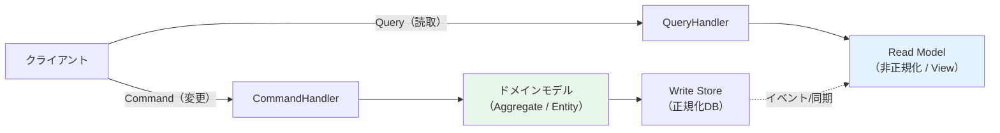

## Greg Youngが2010年に提唱したパターン

CQRS（Command Query Responsibility Segregation：コマンドクエリ責務分離）は、2010年にGreg Youngが体系化したアーキテクチャパターンです。その根底にある思想はシンプルです。「データを**変更する操作**と、データを**読み取る操作**は、まったく異なる関心事を持つ。それならば、モデルも分けてしまえ」という発想です。

CQRSはDDDを前提としない独立したパターンです。しかし、DDDと組み合わせると絶大な威力を発揮します。なぜなら、DDDのドメインモデルは「書き込み」に最適化されており（不変条件・ルールの強制）、「読み取り」には過剰に複雑なことが多いからです。

---

## なぜ読み取りと書き込みは違うのか

書き込みモデル（Write Model）は、ドメインルールを守ることが最優先です。Aggregateの境界・不変条件・ドメインイベントが重要で、データ構造はビジネスの都合で設計されます。

一方、読み取りモデル（Read Model）が必要とするのは「画面に表示したい形」です。複数テーブルをJOINした非正規化データ、ページネーション、ソートに最適化されたインデックス——これらは書き込みモデルとは根本的に異なります。



---

## Before（読み書きが混在した設計）

```csharp
// ❌ Before: RepositoryがCRUD全担当 → 読み取りの最適化が困難
public class OrderRepository
{
    public Order GetById(Guid id) { ... }
    public IEnumerable<Order> GetAll() { ... }  // 遅い・不要なデータまで取得
    public void Save(Order order) { ... }
    public void Delete(Order order) { ... }

    // 画面用の集計が必要になり、ドメインオブジェクトを無理やり使う
    public IEnumerable<Order> GetOrdersWithCustomerName()
    {
        // N+1クエリ問題が発生しやすい
        return _db.Orders.Include(o => o.Customer).ToList();
    }
}
```

---

## After（CQRS適用後のC#実装）

```csharp
// ✅ After: Command側（書き込み）

// Commandオブジェクト：意図を表す名詞+動詞
public record PlaceOrderCommand(
    Guid CustomerId,
    List<OrderItemDto> Items
);

// CommandHandler：ドメインロジックを呼び出す
public class PlaceOrderCommandHandler
{
    private readonly IOrderRepository _repository;
    private readonly ICustomerRepository _customerRepo;

    public PlaceOrderCommandHandler(
        IOrderRepository repository,
        ICustomerRepository customerRepo)
    {
        _repository = repository;
        _customerRepo = customerRepo;
    }

    public async Task Handle(PlaceOrderCommand command)
    {
        var customer = await _customerRepo.FindById(command.CustomerId)
            ?? throw new DomainException("顧客が存在しません");

        var order = Order.Place(customer, command.Items.Select(ToOrderItem));
        await _repository.Save(order);
    }
}

// ✅ Query側（読み取り）— ドメインモデルを経由しない

// QueryオブジェクトとReadModel
public record GetOrderSummaryQuery(Guid CustomerId, int Page, int PageSize);

public record OrderSummaryDto(
    Guid OrderId,
    string CustomerName,
    decimal TotalAmount,
    string Status,
    DateTime OrderedAt
);

// QueryHandler：直接SQLやViewを叩く（ドメインをスキップ）
public class GetOrderSummaryQueryHandler
{
    private readonly IDbConnection _db;

    public GetOrderSummaryQueryHandler(IDbConnection db) => _db = db;

    public async Task<IEnumerable<OrderSummaryDto>> Handle(GetOrderSummaryQuery query)
    {
        // 非正規化されたRead Modelに直接クエリ（高速）
        const string sql = """
            SELECT o.Id AS OrderId, c.Name AS CustomerName,
                   o.TotalAmount, o.Status, o.CreatedAt AS OrderedAt
            FROM OrderSummaryView o
            JOIN Customers c ON o.CustomerId = c.Id
            WHERE o.CustomerId = @CustomerId
            ORDER BY o.CreatedAt DESC
            OFFSET @Offset ROWS FETCH NEXT @PageSize ROWS ONLY
            """;

        return await _db.QueryAsync<OrderSummaryDto>(sql, new
        {
            query.CustomerId,
            Offset = (query.Page - 1) * query.PageSize,
            query.PageSize
        });
    }
}
```

---

## いつCQRSを使うか（トレードオフ）

CQRSは強力ですが、複雑さも伴います。以下のような場合に採用を検討してください。

- 読み取りと書き込みのスケール要件が大きく異なる（読み取りが圧倒的に多い）
- 書き込みはドメインの複雑なルールを持ち、読み取りは多様な集計が必要
- Event Sourcingと組み合わせて、Read Modelをイベントから再構築したい

一方、単純なCRUDアプリケーションや小規模なシステムでは、CQRSはオーバースペックです。「読み取りと書き込みのモデルが本当に違うか」を問いかけることが判断の起点になります。

---

> **専門家の視点**
>
> CQRSで最もよくある誤解は「ReadModelをWriteModelと同期させるのが難しい」という点です。最終的整合性（Eventual Consistency）を受け入れることが鍵です。ユーザーが注文を完了した直後に注文一覧を開いたとき、わずか数百ミリ秒の遅延でReadModelが更新されていなくても、多くのビジネスシナリオでは許容できます。重要なのは「どの程度の遅延が許容できるか」をドメインエキスパートと議論することです。銀行の残高表示と、ECサイトのレビュー件数表示では、求められる整合性のレベルがまったく異なります。

---

## まとめ

CQRSは「シンプルな概念、複雑な実装」です。読み取りと書き込みを明確に分離することで、それぞれに最適化されたモデルを持てます。DDDの書き込みモデル（Aggregate中心）と、クエリに特化したReadModelを組み合わせることで、ドメインの純粋性とシステムのパフォーマンスを両立できます。
