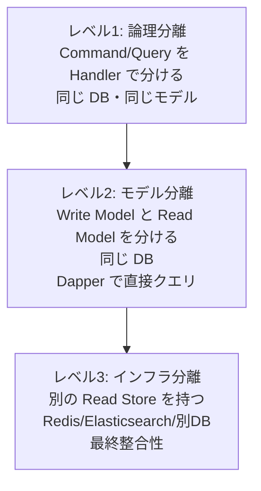
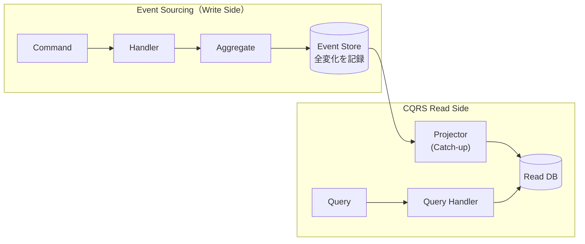

# 第 15 章: CQRS — コマンドとクエリを完全分離してシステムを解き放つ

## 0. TL;DR

CQRS（Command Query Responsibility Segregation）とは、「データを変更する操作（Command）」と「データを読み取る操作（Query）」を完全に分離するアーキテクチャパターン。同一のドメインモデルで読み書き両方を担うことをやめることで、それぞれを独立に最適化できる。Greg Young が 2010 年に体系化。DDD との相性が極めて高い。

---

## 1. CQRS が解決する問題

### 1.1 同一モデルで読み書きを担う弊害

多くのシステムは、当初こうした設計から始まります:

```csharp
// すべてを担う神様 Repository
public interface IOrderRepository
{
    Task<Order> FindByIdAsync(Guid orderId);
    Task<IList<Order>> FindByCustomerAsync(Guid customerId);
    Task<IList<Order>> FindByStatusAsync(OrderStatus status);
    Task<IList<Order>> FindByDateRangeAsync(DateTime from, DateTime to);
    // ...画面が増えるたびに検索メソッドが増殖する...
    Task<OrderSummaryDto> GetOrderSummaryAsync(Guid orderId);
    Task<CustomerOrderHistoryDto> GetCustomerHistoryAsync(Guid customerId, int page, int size);
    Task<IList<OrderWithCustomerDto>> GetOrdersWithCustomerInfoAsync(OrderStatus status);
    Task SaveAsync(Order order);
    Task DeleteAsync(Guid orderId);
}
```

この設計には **5 つの根本的な問題**があります:

**問題1: 読み取り要件に引っ張られて書き込みが複雑化する**

画面の要件が増えるたびに Repository に `JOIN` が必要なメソッドが追加されます。`Order` Aggregate は「注文の整合性を守る」責務のはずが、「画面に必要なデータを全部返す」責務まで負わされます。

**問題2: N+1 問題が構造的に発生する**

```csharp
// Order Aggregate を画面表示にそのまま使う場合
var orders = await _orderRepo.FindByCustomerAsync(customerId);
// orders は List<Order>
// 各 Order の Items を取得するたびに SQL が走る（N+1）
foreach (var order in orders)
{
    var count = order.Items.Count;  // ← 遅延ロードで N+1
}
```

**問題3: キャッシュが困難**

`Order` Aggregate は書き込みの整合性を守るためにトランザクションと結びついています。キャッシュしてしまうと、更新後のデータが見えなくなるリスクがあります。

**問題4: スケーリングの非対称性を無視している**

ほとんどのシステムで「読み取り」は「書き込み」の 10〜100 倍の頻度で発生します。なのに、同じモデル・同じインフラで両方を処理しようとするのは非効率です。

**問題5: ドメインモデルの保護が難しい**

読み取り専用のコントローラーが `Order` を受け取ると、そのコントローラーが `order.Cancel()` を呼べてしまいます。ドメインの操作を読み取りコードから守ることができません。

### 1.2 CQS（Command Query Separation）との違い

CQRS は Bertrand Meyer が1988年に提唱した CQS（Command Query Separation）を拡張したものです。

| | CQS | CQRS |
|--|-----|------|
| **提唱者** | Bertrand Meyer (1988) | Greg Young (2010) |
| **対象** | メソッドレベル | アーキテクチャレベル（モデル分離） |
| **原則** | メソッドは状態を変えるか返すかのどちらかのみ | Command / Query でモデルを完全分離 |
| **適用範囲** | 任意のコード | 主に DDD + 複雑なドメイン |

CQS: 「1つのメソッドが副作用（状態変化）と戻り値（データ返却）を同時に持つな」
CQRS: 「書き込み用モデルと読み取り用モデルを完全に分けろ」

---

## 2. CQRS の基本構造

```mermaid
flowchart LR
    subgraph WriteModel["Write Side（コマンド側）"]
        direction TB
        CMD["PlaceOrderCommand"] --> CH["CommandHandler"]
        CH --> AR["Order\nAggregate"]
        AR --> WDB[("Write DB\n正規化")]
        AR --> DE["Domain Events"]
    end

    subgraph ReadModel["Read Side（クエリ側）"]
        direction TB
        DE --> PROJ["Projector"]
        PROJ --> RDB[("Read DB\n非正規化")]
        QRY["GetOrderListQuery"] --> QH["QueryHandler"]
        QH --> RDB
        QH --> DTO["OrderListDto"]
    end

    CLIENT["クライアント"] -->|Command| CMD
    CLIENT -->|Query| QRY
    CLIENT <--|Result| DTO
```

**書き込み側（Write Model）の責務:**
- ビジネスルールの検証（Invariant）
- ドメインモデル（Aggregate）の操作
- Domain Events の発行
- 正規化された DB への書き込み

**読み取り側（Read Model）の責務:**
- 画面に最適化されたデータ構造の返却
- 非正規化データの高速提供
- Domain Layer を経由しない直接クエリ

---

## 3. Command 側の完全実装

### 3.1 Command の設計原則

Command は「意図を表現するオブジェクト」です。現在形の命令形で命名します。

```csharp
// Command: 意図を表現する（現在形・命令形）
public sealed record PlaceOrderCommand(
    Guid CustomerId,
    string PostalCode,
    string Prefecture,
    string City,
    string Street,
    IReadOnlyList<OrderItemRequest> Items
);

public sealed record OrderItemRequest(
    Guid ProductId,
    string ProductName,
    decimal UnitPrice,
    string Currency,
    int Quantity
);

public sealed record CancelOrderCommand(
    Guid OrderId,
    string Reason
);

public sealed record ShipOrderCommand(
    Guid OrderId,
    string TrackingNumber
);

public sealed record UpdateShippingAddressCommand(
    Guid OrderId,
    string NewPostalCode,
    string NewPrefecture,
    string NewCity,
    string NewStreet
);
```

### 3.2 CommandHandler の実装

```csharp
// CommandHandler: Application Service としての役割
public sealed class PlaceOrderHandler
{
    private readonly IOrderRepository _orderRepo;
    private readonly ICustomerRepository _customerRepo;
    private readonly OrderDomainService _domainService;
    private readonly IDomainEventDispatcher _dispatcher;

    public PlaceOrderHandler(
        IOrderRepository orderRepo,
        ICustomerRepository customerRepo,
        OrderDomainService domainService,
        IDomainEventDispatcher dispatcher)
    {
        _orderRepo = orderRepo;
        _customerRepo = customerRepo;
        _domainService = domainService;
        _dispatcher = dispatcher;
    }

    public async Task<PlaceOrderResult> HandleAsync(
        PlaceOrderCommand cmd, CancellationToken ct = default)
    {
        // 1. 顧客存在確認
        var customer = await _customerRepo.FindByIdAsync(CustomerId.From(cmd.CustomerId));
        if (customer is null)
            return PlaceOrderResult.Failure("顧客が存在しません");

        // 2. ドメインオブジェクトを組み立て
        var address = Address.Of(cmd.PostalCode, cmd.Prefecture, cmd.City, cmd.Street);
        var order = Order.Create(customer.Id, address);

        foreach (var item in cmd.Items)
        {
            order.AddItem(
                ProductId.From(item.ProductId),
                item.ProductName,
                Money.Of(item.UnitPrice, item.Currency),
                item.Quantity
            );
        }

        // 3. Domain Service でビジネスルールチェック
        if (await _domainService.HasRecentDuplicateAsync(order, TimeSpan.FromMinutes(5)))
            return PlaceOrderResult.Failure("重複注文の可能性があります");

        // 4. 状態変更（ドメインロジックは Aggregate が持つ）
        order.Place();

        // 5. 永続化
        await _orderRepo.SaveAsync(order, ct);

        // 6. Domain Events を dispatch（保存後）
        var events = order.PopDomainEvents();
        await _dispatcher.DispatchAsync(events, ct);

        return PlaceOrderResult.Success(order.Id.Value);
    }
}

// 結果型（成功・失敗を明示）
public sealed record PlaceOrderResult
{
    public bool IsSuccess { get; }
    public Guid? OrderId { get; }
    public string? ErrorMessage { get; }

    private PlaceOrderResult(bool isSuccess, Guid? orderId, string? errorMessage)
    {
        IsSuccess = isSuccess;
        OrderId = orderId;
        ErrorMessage = errorMessage;
    }

    public static PlaceOrderResult Success(Guid orderId) => new(true, orderId, null);
    public static PlaceOrderResult Failure(string msg) => new(false, null, msg);
}
```

### 3.3 他の CommandHandler の実装

```csharp
// キャンセル
public sealed class CancelOrderHandler
{
    private readonly IOrderRepository _orderRepo;
    private readonly IDomainEventDispatcher _dispatcher;

    public async Task HandleAsync(CancelOrderCommand cmd, CancellationToken ct = default)
    {
        var order = await _orderRepo.FindByIdAsync(OrderId.From(cmd.OrderId));
        if (order is null)
            throw new NotFoundException($"注文 {cmd.OrderId} が見つかりません");

        order.Cancel(cmd.Reason);

        await _orderRepo.SaveAsync(order, ct);
        await _dispatcher.DispatchAsync(order.PopDomainEvents(), ct);
    }
}

// 発送
public sealed class ShipOrderHandler
{
    private readonly IOrderRepository _orderRepo;
    private readonly IDomainEventDispatcher _dispatcher;

    public async Task HandleAsync(ShipOrderCommand cmd, CancellationToken ct = default)
    {
        var order = await _orderRepo.FindByIdAsync(OrderId.From(cmd.OrderId));
        if (order is null)
            throw new NotFoundException($"注文 {cmd.OrderId} が見つかりません");

        order.Ship();

        await _orderRepo.SaveAsync(order, ct);
        await _dispatcher.DispatchAsync(order.PopDomainEvents(), ct);
    }
}
```

---

## 4. Query 側の完全実装

### 4.1 Query の設計原則

Query は「何が欲しいか」を表現するオブジェクトです。Handler は Domain Layer を経由せず、直接 DB / Read Store からデータを取得します。

```csharp
// Query オブジェクト
public sealed record GetOrderQuery(Guid OrderId);

public sealed record GetOrderListQuery(
    Guid? CustomerId = null,
    OrderStatus? Status = null,
    DateTime? From = null,
    DateTime? To = null,
    int Page = 1,
    int PageSize = 20,
    string SortBy = "PlacedAt",
    bool Descending = true
);

public sealed record GetOrderSummaryQuery(Guid OrderId);

public sealed record GetCustomerOrderHistoryQuery(
    Guid CustomerId,
    int Page = 1,
    int PageSize = 10
);

// Read Model DTO（画面に最適化された flat な構造）
public sealed record OrderListItemDto(
    Guid OrderId,
    string CustomerName,
    string CustomerEmail,
    string Status,
    decimal TotalAmount,
    string Currency,
    int ItemCount,
    DateTime PlacedAt,
    DateTime? ShippedAt
);

public sealed record OrderDetailDto(
    Guid OrderId,
    string CustomerName,
    string Status,
    string ShippingAddress,
    decimal TotalAmount,
    string Currency,
    IReadOnlyList<OrderItemDetailDto> Items,
    DateTime PlacedAt,
    DateTime? ShippedAt,
    DateTime? CancelledAt,
    string? CancelReason
);

public sealed record OrderItemDetailDto(
    Guid ProductId,
    string ProductName,
    int Quantity,
    decimal UnitPrice,
    decimal SubTotal,
    string Currency
);
```

### 4.2 QueryHandler — Dapper で直接 DB を叩く

```csharp
// QueryHandler: Domain Layer を経由しない直接クエリ
public sealed class GetOrderListQueryHandler
{
    private readonly IDbConnection _readDb;

    public GetOrderListQueryHandler(IDbConnection readDb)
        => _readDb = readDb;

    public async Task<PagedResult<OrderListItemDto>> HandleAsync(
        GetOrderListQuery query, CancellationToken ct = default)
    {
        // Total count
        var countSql = BuildCountSql(query);
        var total = await _readDb.ExecuteScalarAsync<int>(
            new CommandDefinition(countSql.Sql, countSql.Params, cancellationToken: ct));

        // Data
        var dataSql = BuildDataSql(query);
        var items = await _readDb.QueryAsync<OrderListItemDto>(
            new CommandDefinition(dataSql.Sql, dataSql.Params, cancellationToken: ct));

        return new PagedResult<OrderListItemDto>(
            items.ToList(),
            total,
            query.Page,
            query.PageSize
        );
    }

    private (string Sql, DynamicParameters Params) BuildCountSql(GetOrderListQuery q)
    {
        var sb = new StringBuilder("""
            SELECT COUNT(1)
            FROM order_summaries os
            WHERE 1=1
            """);
        var p = new DynamicParameters();

        if (q.CustomerId.HasValue)
        {
            sb.AppendLine(" AND os.customer_id = @CustomerId");
            p.Add("CustomerId", q.CustomerId.Value);
        }
        if (q.Status.HasValue)
        {
            sb.AppendLine(" AND os.status = @Status");
            p.Add("Status", q.Status.Value.ToString());
        }
        if (q.From.HasValue)
        {
            sb.AppendLine(" AND os.placed_at >= @From");
            p.Add("From", q.From.Value);
        }
        if (q.To.HasValue)
        {
            sb.AppendLine(" AND os.placed_at <= @To");
            p.Add("To", q.To.Value);
        }

        return (sb.ToString(), p);
    }

    private (string Sql, DynamicParameters Params) BuildDataSql(GetOrderListQuery q)
    {
        var sortColumn = q.SortBy switch
        {
            "PlacedAt" => "os.placed_at",
            "TotalAmount" => "os.total_amount",
            "Status" => "os.status",
            _ => "os.placed_at"
        };
        var sortDir = q.Descending ? "DESC" : "ASC";

        var sb = new StringBuilder($"""
            SELECT
                os.order_id AS OrderId,
                os.customer_name AS CustomerName,
                os.customer_email AS CustomerEmail,
                os.status AS Status,
                os.total_amount AS TotalAmount,
                os.currency AS Currency,
                os.item_count AS ItemCount,
                os.placed_at AS PlacedAt,
                os.shipped_at AS ShippedAt
            FROM order_summaries os
            WHERE 1=1
            """);

        var p = new DynamicParameters();

        if (q.CustomerId.HasValue)
        {
            sb.AppendLine(" AND os.customer_id = @CustomerId");
            p.Add("CustomerId", q.CustomerId.Value);
        }
        if (q.Status.HasValue)
        {
            sb.AppendLine(" AND os.status = @Status");
            p.Add("Status", q.Status.Value.ToString());
        }
        if (q.From.HasValue)
        {
            sb.AppendLine(" AND os.placed_at >= @From");
            p.Add("From", q.From.Value);
        }
        if (q.To.HasValue)
        {
            sb.AppendLine(" AND os.placed_at <= @To");
            p.Add("To", q.To.Value);
        }

        sb.AppendLine($" ORDER BY {sortColumn} {sortDir}");
        sb.AppendLine(" LIMIT @PageSize OFFSET @Offset");
        p.Add("PageSize", q.PageSize);
        p.Add("Offset", (q.Page - 1) * q.PageSize);

        return (sb.ToString(), p);
    }
}

// ページネーション結果
public sealed record PagedResult<T>(
    IReadOnlyList<T> Items,
    int TotalCount,
    int Page,
    int PageSize
)
{
    public int TotalPages => (int)Math.Ceiling((double)TotalCount / PageSize);
    public bool HasNextPage => Page < TotalPages;
    public bool HasPreviousPage => Page > 1;
}
```

### 4.3 詳細クエリの実装

```csharp
public sealed class GetOrderDetailQueryHandler
{
    private readonly IDbConnection _readDb;

    public async Task<OrderDetailDto?> HandleAsync(
        GetOrderQuery query, CancellationToken ct = default)
    {
        // 1回の SQL でヘッダーとアイテムを取得（Dapper Multi-mapping）
        const string sql = """
            SELECT
                o.order_id,
                o.customer_name,
                o.status,
                o.shipping_address,
                o.total_amount,
                o.currency,
                o.placed_at,
                o.shipped_at,
                o.cancelled_at,
                o.cancel_reason,
                oi.product_id,
                oi.product_name,
                oi.quantity,
                oi.unit_price,
                oi.sub_total
            FROM order_read_models o
            LEFT JOIN order_item_read_models oi ON o.order_id = oi.order_id
            WHERE o.order_id = @OrderId
            ORDER BY oi.product_name
            """;

        OrderDetailDto? result = null;
        var items = new List<OrderItemDetailDto>();

        await _readDb.QueryAsync<dynamic>(
            new CommandDefinition(sql, new { OrderId = query.OrderId }, cancellationToken: ct),
            reader =>
            {
                // 最初の行でヘッダーを構築
                if (result is null)
                {
                    result = new OrderDetailDto(
                        OrderId: reader.order_id,
                        CustomerName: reader.customer_name,
                        Status: reader.status,
                        ShippingAddress: reader.shipping_address,
                        TotalAmount: reader.total_amount,
                        Currency: reader.currency,
                        Items: items,
                        PlacedAt: reader.placed_at,
                        ShippedAt: reader.shipped_at,
                        CancelledAt: reader.cancelled_at,
                        CancelReason: reader.cancel_reason
                    );
                }

                // アイテムを追加
                if (reader.product_id is not null)
                {
                    items.Add(new OrderItemDetailDto(
                        ProductId: reader.product_id,
                        ProductName: reader.product_name,
                        Quantity: reader.quantity,
                        UnitPrice: reader.unit_price,
                        SubTotal: reader.sub_total,
                        Currency: reader.currency
                    ));
                }
            }
        );

        return result;
    }
}
```

---

## 5. Read Model（Projection）の構築

### 5.1 Projector の設計

Domain Event を受けて Read Model を構築・更新する Projector を実装します。

```csharp
// order_summaries テーブル用の Read Model
public sealed class OrderSummaryProjector :
    IDomainEventHandler<OrderCreatedEvent>,
    IDomainEventHandler<OrderPlacedEvent>,
    IDomainEventHandler<OrderShippedEvent>,
    IDomainEventHandler<OrderCancelledEvent>
{
    private readonly IDbConnection _writeToReadDb;
    private readonly ICustomerRepository _customerRepo;

    public OrderSummaryProjector(
        IDbConnection writeToReadDb,
        ICustomerRepository customerRepo)
    {
        _writeToReadDb = writeToReadDb;
        _customerRepo = customerRepo;
    }

    public async Task HandleAsync(OrderCreatedEvent evt, CancellationToken ct = default)
    {
        // 注文作成時点では顧客名を取得してキャッシュ（非正規化）
        var customer = await _customerRepo.FindByIdAsync(evt.CustomerId);

        const string sql = """
            INSERT INTO order_summaries (
                order_id, customer_id, customer_name, customer_email,
                status, total_amount, currency, item_count, placed_at
            ) VALUES (
                @OrderId, @CustomerId, @CustomerName, @CustomerEmail,
                @Status, 0, 'JPY', 0, NULL
            )
            ON CONFLICT (order_id) DO NOTHING
            """;

        await _writeToReadDb.ExecuteAsync(sql, new
        {
            OrderId = evt.OrderId.Value,
            CustomerId = evt.CustomerId.Value,
            CustomerName = customer?.Name ?? "Unknown",
            CustomerEmail = customer?.Email.Value ?? "",
            Status = "Draft"
        });
    }

    public async Task HandleAsync(OrderPlacedEvent evt, CancellationToken ct = default)
    {
        const string sql = """
            UPDATE order_summaries
            SET status = 'Placed',
                total_amount = @TotalAmount,
                currency = @Currency,
                item_count = @ItemCount,
                placed_at = @PlacedAt
            WHERE order_id = @OrderId
            """;

        await _writeToReadDb.ExecuteAsync(sql, new
        {
            OrderId = evt.OrderId.Value,
            TotalAmount = evt.TotalAmount.Amount,
            Currency = evt.TotalAmount.Currency,
            ItemCount = evt.Items.Count,
            PlacedAt = evt.OccurredAt
        });

        // アイテムを非正規化して保存
        foreach (var item in evt.Items)
        {
            const string itemSql = """
                INSERT INTO order_item_read_models (
                    order_id, product_id, product_name, quantity, unit_price, sub_total
                ) VALUES (
                    @OrderId, @ProductId, @ProductName, @Quantity, @UnitPrice, @SubTotal
                )
                """;

            await _writeToReadDb.ExecuteAsync(itemSql, new
            {
                OrderId = evt.OrderId.Value,
                item.ProductId,
                item.ProductName,
                item.Quantity,
                item.UnitPrice,
                SubTotal = item.UnitPrice * item.Quantity
            });
        }
    }

    public async Task HandleAsync(OrderShippedEvent evt, CancellationToken ct = default)
    {
        const string sql = """
            UPDATE order_summaries
            SET status = 'Shipped', shipped_at = @ShippedAt
            WHERE order_id = @OrderId
            """;

        await _writeToReadDb.ExecuteAsync(sql, new
        {
            OrderId = evt.OrderId.Value,
            ShippedAt = evt.ShippedAt
        });
    }

    public async Task HandleAsync(OrderCancelledEvent evt, CancellationToken ct = default)
    {
        const string sql = """
            UPDATE order_summaries
            SET status = 'Cancelled', cancelled_at = @CancelledAt, cancel_reason = @Reason
            WHERE order_id = @OrderId
            """;

        await _writeToReadDb.ExecuteAsync(sql, new
        {
            OrderId = evt.OrderId.Value,
            CancelledAt = evt.OccurredAt,
            Reason = evt.Reason
        });
    }
}
```

### 5.2 Read Model のスキーマ設計

```sql
-- 注文サマリー Read Model（高速検索・一覧表示用）
CREATE TABLE order_summaries (
    order_id        UUID PRIMARY KEY,
    customer_id     UUID NOT NULL,
    customer_name   VARCHAR(100) NOT NULL,   -- 非正規化（Customer から）
    customer_email  VARCHAR(200) NOT NULL,   -- 非正規化
    status          VARCHAR(20) NOT NULL,
    total_amount    DECIMAL(15, 2) NOT NULL DEFAULT 0,
    currency        VARCHAR(3) NOT NULL DEFAULT 'JPY',
    item_count      INT NOT NULL DEFAULT 0,
    placed_at       TIMESTAMPTZ,
    shipped_at      TIMESTAMPTZ,
    cancelled_at    TIMESTAMPTZ,
    cancel_reason   TEXT,
    updated_at      TIMESTAMPTZ NOT NULL DEFAULT NOW()
);

-- 検索用インデックス
CREATE INDEX idx_order_summaries_customer_id ON order_summaries(customer_id);
CREATE INDEX idx_order_summaries_status ON order_summaries(status);
CREATE INDEX idx_order_summaries_placed_at ON order_summaries(placed_at DESC);
CREATE INDEX idx_order_summaries_customer_status
    ON order_summaries(customer_id, status, placed_at DESC);

-- 注文アイテム Read Model（詳細画面用）
CREATE TABLE order_item_read_models (
    id           UUID PRIMARY KEY DEFAULT gen_random_uuid(),
    order_id     UUID NOT NULL REFERENCES order_summaries(order_id),
    product_id   UUID NOT NULL,
    product_name VARCHAR(200) NOT NULL,
    quantity     INT NOT NULL,
    unit_price   DECIMAL(15, 2) NOT NULL,
    sub_total    DECIMAL(15, 2) NOT NULL
);

CREATE INDEX idx_order_items_order_id ON order_item_read_models(order_id);
```

---

## 6. ASP.NET Core Controller での統合

```csharp
[ApiController]
[Route("api/orders")]
public sealed class OrderController : ControllerBase
{
    private readonly PlaceOrderHandler _placeOrderHandler;
    private readonly CancelOrderHandler _cancelOrderHandler;
    private readonly GetOrderListQueryHandler _getOrderListHandler;
    private readonly GetOrderDetailQueryHandler _getOrderDetailHandler;

    public OrderController(
        PlaceOrderHandler placeOrderHandler,
        CancelOrderHandler cancelOrderHandler,
        GetOrderListQueryHandler getOrderListHandler,
        GetOrderDetailQueryHandler getOrderDetailHandler)
    {
        _placeOrderHandler = placeOrderHandler;
        _cancelOrderHandler = cancelOrderHandler;
        _getOrderListHandler = getOrderListHandler;
        _getOrderDetailHandler = getOrderDetailHandler;
    }

    // Command エンドポイント: 変更 → 202 Accepted（処理結果は非同期）
    [HttpPost]
    public async Task<IActionResult> PlaceOrder(
        [FromBody] PlaceOrderRequest request,
        CancellationToken ct)
    {
        var cmd = new PlaceOrderCommand(
            request.CustomerId,
            request.PostalCode,
            request.Prefecture,
            request.City,
            request.Street,
            request.Items.Select(i => new OrderItemRequest(
                i.ProductId, i.ProductName, i.UnitPrice, i.Currency, i.Quantity
            )).ToList()
        );

        var result = await _placeOrderHandler.HandleAsync(cmd, ct);

        if (!result.IsSuccess)
            return BadRequest(new { Error = result.ErrorMessage });

        return CreatedAtAction(
            nameof(GetOrderDetail),
            new { orderId = result.OrderId },
            new { OrderId = result.OrderId }
        );
    }

    [HttpDelete("{orderId:guid}")]
    public async Task<IActionResult> CancelOrder(
        Guid orderId,
        [FromBody] CancelOrderRequest request,
        CancellationToken ct)
    {
        var cmd = new CancelOrderCommand(orderId, request.Reason);
        await _cancelOrderHandler.HandleAsync(cmd, ct);
        return NoContent();
    }

    // Query エンドポイント: 読み取り → 200 OK（キャッシュ可能）
    [HttpGet]
    [ResponseCache(Duration = 5)] // 5秒キャッシュ（Read Model は結果整合性）
    public async Task<IActionResult> GetOrderList(
        [FromQuery] Guid? customerId,
        [FromQuery] string? status,
        [FromQuery] DateTime? from,
        [FromQuery] DateTime? to,
        [FromQuery] int page = 1,
        [FromQuery] int pageSize = 20,
        CancellationToken ct = default)
    {
        var query = new GetOrderListQuery(
            CustomerId: customerId,
            Status: Enum.TryParse<OrderStatus>(status, out var s) ? s : null,
            From: from,
            To: to,
            Page: page,
            PageSize: pageSize
        );

        var result = await _getOrderListHandler.HandleAsync(query, ct);
        return Ok(result);
    }

    [HttpGet("{orderId:guid}")]
    public async Task<IActionResult> GetOrderDetail(Guid orderId, CancellationToken ct)
    {
        var dto = await _getOrderDetailHandler.HandleAsync(
            new GetOrderQuery(orderId), ct);

        return dto is null ? NotFound() : Ok(dto);
    }
}
```

---

## 7. CQRS の 3 つの実装レベル

CQRS は「すべてか無か」ではありません。段階的に導入できます。



**レベル1: 論理分離（最も単純）**
```csharp
// Command Handler と Query Handler を別クラスにするだけ
// ただし同じ Repository を使う
public class GetOrderQueryHandler
{
    private readonly IOrderRepository _repo; // Write と同じ Repository

    public async Task<OrderDto> HandleAsync(GetOrderQuery q)
    {
        var order = await _repo.FindByIdAsync(OrderId.From(q.OrderId));
        return Map(order); // 変換だけ
    }
}
```

**レベル2: モデル分離（推奨スタート地点）**
- Write: EF Core + Aggregate → 正規化 DB
- Read: Dapper + DTO → 同じ DB の非正規化 View / テーブル
- Projector が Domain Event を受けて Read Model テーブルを更新

**レベル3: インフラ分離（高負荷・複雑な検索要件がある場合）**
- Write: PostgreSQL（正規化）
- Read: Redis（高速キャッシュ）+ Elasticsearch（全文検索）
- 結果整合性（1〜数秒の遅延）を受け入れる設計が必要

---

## 8. CQRS と Event Sourcing の組み合わせ

CQRS と Event Sourcing はよく一緒に使われますが、独立したパターンです。



Event Sourcing は「Aggregate の状態変化をイベントとして保存する」パターン。CQRS の Write Side に Event Sourcing を採用すると:
- Aggregate の現在状態 = イベントを最初から再生した結果
- Read Model = Projector がイベントストリームを読んで構築

この組み合わせを「CQRS + ES」と呼びます。詳細は第16章で扱います。

---

## 9. よくある設計ミス TOP8

### ミス1: Query Handler が Domain Layer を経由する

```csharp
// NG: Repository でAggregate を取得してから変換
public async Task<OrderListItemDto> HandleAsync(GetOrderQuery q)
{
    var order = await _orderRepo.FindByIdAsync(OrderId.From(q.OrderId));
    // order は全フィールドをロード済み（コスト高）
    return new OrderListItemDto(order.Id.Value, order.CustomerId.Value, ...);
}

// OK: Dapper で直接 DTO にマッピング
public async Task<OrderListItemDto> HandleAsync(GetOrderQuery q)
{
    const string sql = "SELECT order_id, customer_name, ... FROM order_summaries WHERE order_id = @Id";
    return await _readDb.QuerySingleOrDefaultAsync<OrderListItemDto>(sql, new { Id = q.OrderId });
}
```

### ミス2: Command が戻り値を返す

```csharp
// NG: Command が大量のデータを返す
public Task<Order> PlaceOrderAsync(PlaceOrderCommand cmd) { ... }

// OK: Command は最小限の結果のみ返す（ID や成否）
public Task<PlaceOrderResult> HandleAsync(PlaceOrderCommand cmd) { ... }
// PlaceOrderResult は { IsSuccess, OrderId?, ErrorMessage? } だけ
```

Command は副作用を起こし、最小限の情報（成否・生成されたIDのみ）を返します。「注文確定して注文詳細を返してほしい」場合は、Command 後に別途 Query を実行します。

### ミス3: Read Model を更新せず Write DB に直接クエリする

```csharp
// NG: Write DB（正規化テーブル）に複雑な JOIN クエリを書く
const string sql = """
    SELECT o.*, c.name, c.email, oi.product_id, oi.quantity
    FROM orders o
    JOIN customers c ON o.customer_id = c.id
    JOIN order_items oi ON o.id = oi.order_id
    WHERE o.customer_id = @CustomerId
    """;
// → 正規化 DB への重い JOIN、ロック競合のリスク
```

### ミス4: Command と Query の境界を曖昧にする

```csharp
// NG: Command が検索機能を持つ
public class OrderCommandService
{
    // Command と Query が同居している
    public Task PlaceOrderAsync(PlaceOrderCommand cmd) { ... }
    public Task<List<OrderDto>> GetOrdersAsync(Guid customerId) { ... } // NG
}
```

### ミス5: Read Model の更新を同期（インプロセス）にこだわる

```csharp
// NG: Command Handler 内で Read Model も更新する
public async Task HandleAsync(PlaceOrderCommand cmd)
{
    order.Place();
    await _orderRepo.SaveAsync(order);

    // NG: Command Handler が Read Model も直接更新
    await _readDb.ExecuteAsync("UPDATE order_summaries SET ...", ...);
}

// OK: Domain Event で Projector が更新する（非同期 or Outbox Pattern）
```

### ミス6: 全てに CQRS を適用しようとする

```
CRUD 中心のシンプルなシステムに CQRS を適用するのは過剰設計。
CQRS が効果を発揮するのは:
- 読み書きの負荷が著しく非対称
- ドメインロジックが複雑
- 画面の要件が多様で、単一モデルで対応困難
```

### ミス7: Projection の冪等性を考慮しない

```csharp
// NG: 冪等でない Projection（同じイベントが2回来たら重複する）
public async Task HandleAsync(OrderPlacedEvent evt)
{
    await _readDb.ExecuteAsync(
        "INSERT INTO order_summaries ...", // 2回実行すると重複エラー
        new { ... }
    );
}

// OK: UPSERT で冪等にする
public async Task HandleAsync(OrderPlacedEvent evt)
{
    await _readDb.ExecuteAsync(
        "INSERT INTO order_summaries ... ON CONFLICT (order_id) DO UPDATE SET ...",
        new { ... }
    );
}
```

### ミス8: Read Model のスキーマを Write DB に依存させる

```csharp
// NG: Write DB のスキーマを Read Model にそのまま使う
// Read DB も正規化されている → JOIN が必要
// → CQRS の恩恵（非正規化・高速クエリ）が得られない
```

---

## 10. CQRS のコードレビュー観点

**Command 側チェックリスト**
- [ ] CommandHandler が Domain Layer（Aggregate / Repository）を経由しているか
- [ ] Command が `void` or `{id, isSuccess}` のみを返しているか（大量データを返していないか）
- [ ] Command の実行後に Domain Events が dispatch されているか
- [ ] ビジネスルールが Application Service（Handler）ではなく Aggregate に書かれているか

**Query 側チェックリスト**
- [ ] QueryHandler が Domain Layer（Aggregate / Repository）を経由していないか
- [ ] Dapper または直接 SQL で DTO に直接マッピングしているか
- [ ] Join が Read Model（非正規化テーブル）内で解決されているか
- [ ] QueryHandler が Aggregate の変更メソッドを呼んでいないか

**Read Model チェックリスト**
- [ ] Projector の Projection が冪等性を持つか（UPSERT 等）
- [ ] Read Model のスキーマが非正規化（JOIN 不要）になっているか
- [ ] Domain Event を受けて Read Model が更新されるパスが存在するか

---

## 11. アーキテクトの視点

### CQRS 導入のタイミング

「どのタイミングで CQRS を導入すべきか」は、アーキテクトにとって重要な判断です。経験則として:

**導入を検討するサイン:**
1. `IOrderRepository` に検索メソッドが 5 個以上になった
2. 画面の要件で N+1 が頻発するようになった
3. 読み書きでモデルが「2つの要求をどちらも中途半端に満たす」状態になった
4. パフォーマンス計測で読み取りが書き込みの 5 倍以上遅い

**まず「レベル2: モデル分離」から始める**

いきなり別 DB（Redis / Elasticsearch）を入れる必要はありません。まず Dapper + DTO の QueryHandler で直接クエリする（同じ DB に非正規化テーブルを用意）から始めて、パフォーマンス計測で必要性が出たら Read Store を分離します。

### Read Model の結果整合性をユーザーに見せる方法

CQRS + Projection で Read Model が非同期更新される場合、ユーザーが注文を確定した直後に一覧を見ると「さっき確定した注文が見えない」ことがあります。これを解消する実践的パターン:

```
1. Command 完了後にクライアントが数秒待ってからポーリング
2. 注文確定後は「確定しました」画面を表示（一覧を即座に表示しない）
3. 「ローカルキャッシュ」: クライアントサイドで作成した注文を即座に追加表示
4. WebSocket でサーバーから「Read Model 更新完了」を push
```

---

## 12. 演習問題

**問1: CQRS の設計**

以下の要件を CQRS で設計してください。

要件: 管理者が「日付範囲・ステータス・顧客名（前方一致）」で注文を絞り込み、CSV でエクスポートしたい。

解答のポイント:
- `ExportOrderCsvQuery` を設計する
- Read Model のスキーマに `customer_name` カラムが必要（非正規化済みが前提）
- 前方一致検索に `LIKE @CustomerName%` または全文検索インデックスが必要
- CSV はストリーミング（`yield return` + `StreamWriter`）で大量データに対応

**問2: コードレビュー**

以下のコードの問題を指摘してください。

```csharp
public class OrderQueryService
{
    private readonly IOrderRepository _repo;

    public async Task<OrderDto> GetOrderAsync(Guid orderId)
    {
        var order = await _repo.FindByIdAsync(OrderId.From(orderId));
        if (order is null) throw new NotFoundException();
        // EF Core の遅延ロードで Items を取得
        return new OrderDto(order.Id.Value, order.Status.ToString(),
            order.Items.Sum(i => i.SubTotal.Amount));  // N+1 発生
    }
}
```

**問3: Projection のテスト**

`OrderSummaryProjector.HandleAsync(OrderPlacedEvent)` のユニットテストを書いてください。

---

## 参考文献と著者の解釈

Greg Young は 2010 年のブログ記事「CQRS Documents」でこのパターンを体系化しました。元々 Bertrand Meyer の CQS（Command Query Separation）をアーキテクチャレベルに昇格させたものです。

Vaughn Vernon は *Implementing Domain-Driven Design*（2013）第4章で、CQRS を DDD の文脈で解説しています。「ドメインモデルはコマンド側（状態変化）に集中させ、クエリ側は軽量な DTO を直接返す」という設計方針は、本章の実装とも一致します。

筆者の解釈では、CQRS の本質的な価値は「モデルの責務の分離」にあります。「読み書きで同じモデルを使う」ことへの強制力がなくなった結果、Command 側はドメインルールの純化に集中でき、Query 側は画面要件への最適化に集中できます。この分離が、長期的なシステムの保守性を大きく向上させます。

Martin Fowler は bliki の「CQRS」記事で「CQRS は適切なケースでは強力だが、複雑さのコストがある。慎重に使うべき」と述べています。筆者も同意します。シンプルな CRUD が十分なケースに CQRS を適用するのは過剰設計です。ドメインの複雑さと読み書きの非対称性が共に大きい場合に真価を発揮します。
