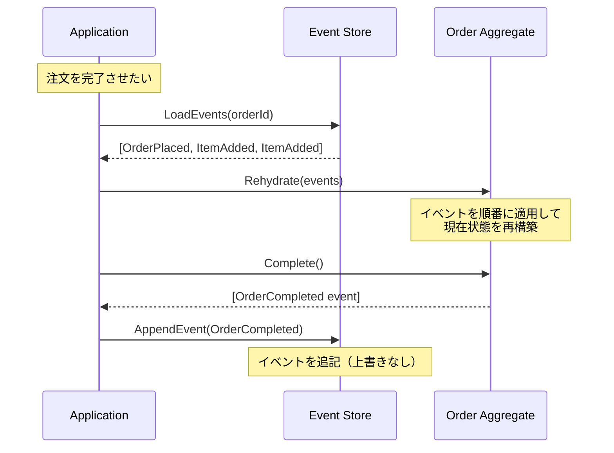

## 状態ではなく「出来事」を保存する

通常のCRUDシステムでは、現在の状態をDBに上書き保存します。注文の状態が「処理中」から「完了」に変わると、レコードのStatusカラムを更新するだけです。過去に何が起きたかは消えてしまいます。

Event Sourcingはこの発想を根本から覆します。現在の状態を保存するのではなく、**「何が起きたか」というイベントの履歴をすべて保存する**パターンです。Greg Youngが体系化したこの手法では、現在の状態が知りたければ、過去のイベントを順番に再生（リハイドレーション）して導き出します。

---

## 通常のCRUD vs Event Sourcing

| 観点 | CRUD | Event Sourcing |
|------|------|---------------|
| 保存するもの | 現在の状態 | イベントの履歴 |
| 更新操作 | UPDATE文 | 新しいイベントをAppend |
| 過去の状態 | 失われる | いつでも再現可能 |
| 監査ログ | 別途実装が必要 | 本質的に内蔵 |
| デバッグ | 困難（状態が上書き） | 容易（イベントを追える） |

---

## イベントストアとリハイドレーション



---

## Before（通常のCRUDによる状態管理）

```csharp
// ❌ Before: 状態を直接更新 → 過去が消える
public class Order
{
    public Guid Id { get; set; }
    public string Status { get; set; } = "Pending";
    public decimal TotalAmount { get; set; }

    public void Complete()
    {
        Status = "Completed";  // 過去の状態は消滅
        // いつ・なぜ完了したかは記録されない
    }
}

// DBには「現在の状態」だけが残る
// UPDATE Orders SET Status='Completed' WHERE Id=@id
```

---

## After（Event Sourcingによる実装）

```csharp
// ✅ After: Event Sourcing

// イベントの定義（起きた事実を表すクラス）
public abstract record DomainEvent(Guid AggregateId, DateTime OccurredAt);

public record OrderPlaced(
    Guid AggregateId,
    Guid CustomerId,
    DateTime OccurredAt
) : DomainEvent(AggregateId, OccurredAt);

public record OrderItemAdded(
    Guid AggregateId,
    Guid ProductId,
    int Quantity,
    decimal UnitPrice,
    DateTime OccurredAt
) : DomainEvent(AggregateId, OccurredAt);

public record OrderCompleted(
    Guid AggregateId,
    DateTime OccurredAt
) : DomainEvent(AggregateId, OccurredAt);

// Aggregateの基底クラス（イベント駆動）
public abstract class AggregateRoot
{
    private readonly List<DomainEvent> _uncommittedEvents = new();
    public IReadOnlyList<DomainEvent> UncommittedEvents => _uncommittedEvents;
    public int Version { get; private set; }

    // イベントを発生させ、かつ自分自身に適用する
    protected void RaiseEvent(DomainEvent @event)
    {
        ApplyEvent(@event);
        _uncommittedEvents.Add(@event);
    }

    // イベントを再生してリハイドレーション
    public void LoadFromHistory(IEnumerable<DomainEvent> history)
    {
        foreach (var @event in history)
        {
            ApplyEvent(@event);
            Version++;
        }
    }

    protected abstract void ApplyEvent(DomainEvent @event);
}

// Orderの実装
public class Order : AggregateRoot
{
    public Guid CustomerId { get; private set; }
    public OrderStatus Status { get; private set; }
    private readonly List<OrderItem> _items = new();

    private Order() { }  // リハイドレーション用

    // Factoryメソッド（新規作成）
    public static Order Place(Guid customerId)
    {
        var order = new Order();
        order.RaiseEvent(new OrderPlaced(Guid.NewGuid(), customerId, DateTime.UtcNow));
        return order;
    }

    public void AddItem(Guid productId, int quantity, decimal unitPrice)
    {
        if (Status != OrderStatus.Pending)
            throw new DomainException("処理中の注文にのみ商品を追加できます");

        RaiseEvent(new OrderItemAdded(Id, productId, quantity, unitPrice, DateTime.UtcNow));
    }

    public void Complete()
    {
        if (!_items.Any())
            throw new DomainException("商品がありません");
        RaiseEvent(new OrderCompleted(Id, DateTime.UtcNow));
    }

    // イベントを自身の状態に適用（リハイドレーションでも使用）
    protected override void ApplyEvent(DomainEvent @event)
    {
        switch (@event)
        {
            case OrderPlaced e:
                CustomerId = e.CustomerId;
                Status = OrderStatus.Pending;
                break;
            case OrderItemAdded e:
                _items.Add(new OrderItem(e.ProductId, e.Quantity, e.UnitPrice));
                break;
            case OrderCompleted:
                Status = OrderStatus.Completed;
                break;
        }
    }
}

// スナップショットパターン（パフォーマンス最適化）
public class SnapshotStore
{
    // イベント数が多い場合、定期的にスナップショットを保存
    // 次回読み込み時はスナップショットから再開する
    public async Task SaveSnapshot(Guid aggregateId, object state, int version) { ... }
    public async Task<(object? State, int Version)> LoadLatest(Guid aggregateId) { ... }
}
```

---

## Event Sourcing ≠ CQRS（ただし相性が良い）

Event SourcingとCQRSは独立したパターンです。Event SourcingなしでCQRSは実装できますし、その逆も然りです。ただし組み合わせると強力です。イベントストアに保存されたイベントを購読し、Read Model（CQRS）を非同期に更新するパターンは、スケーラビリティと監査性を両立します。

---

## いつEvent Sourcingを使うか

Event Sourcingはすべてのシステムに適切ではありません。「変化の履歴そのものがビジネス価値を持つ」場合に採用を検討してください。会計システム（仕訳の履歴）、医療記録（処置の履歴）、Eコマースの注文管理などが典型例です。一方、ユーザーのプロフィール変更や設定管理など、履歴に価値がないシステムでは不要な複雑さを招きます。

---

> **専門家の視点**
>
> Event Sourcingの最大の落とし穴は「イベントスキーマの進化」です。一度保存したイベントは変更できません。6か月後にイベントの構造を変えたい場合、古いイベントと新しいイベントの両方を解釈できる「アップキャスター」が必要になります。これは計画的に設計しておかないと、後から非常に辛くなります。Event Sourcing導入前に「このイベント定義は5年後も意味をなすか」を問い続けることが重要です。Ubiquitous Languageでイベントを命名することが、その答えになります。

---

## まとめ

Event Sourcingは「過去のすべての出来事」をシステムの真実の源泉（Single Source of Truth）とします。現在の状態はイベントの関数として導き出されます。この設計により、監査ログ・タイムトラベルデバッグ・RebuildによるRead Model再生成など、通常のCRUDでは困難な機能が自然に実現します。
