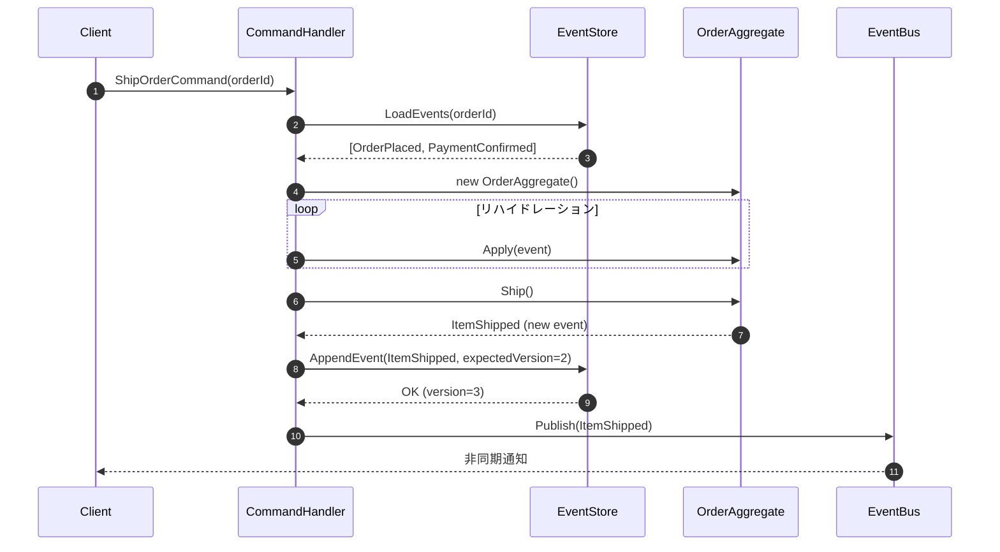
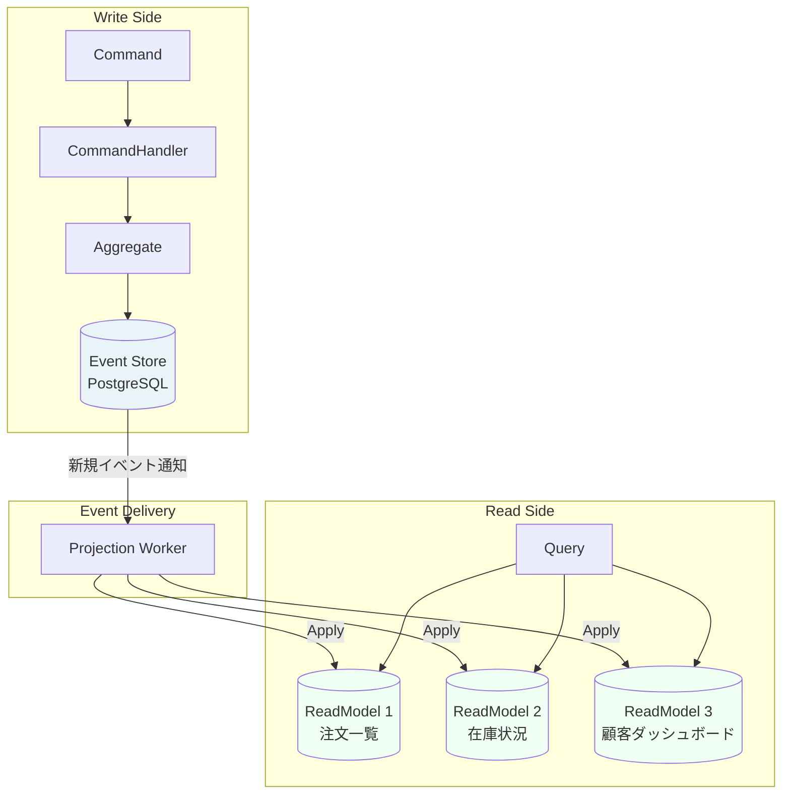
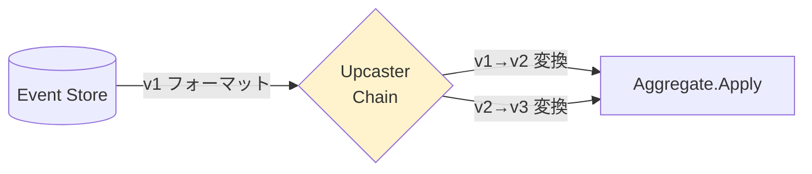

# 第16章: Event Sourcing — 出来事の履歴で状態を再構築する

---

## 0. TL;DR（3行）

Event Sourcing とは「現在の状態」ではなく「起きた出来事（イベント）の連鎖」を永続化するパターンです。Aggregate の現在状態はイベントを順番に再生（リハイドレーション）して導き出し、過去のすべての状態を任意の時点で再現できます。CQRS と組み合わせることで、監査・デバッグ・バグ再現・複数 Read Model の並行維持が劇的に容易になります。

---

## 1. なぜ Event Sourcing が生まれたか

### 1.1 通常 CRUD の限界：「いつ何が起きたか」が分からない

現代のほとんどのシステムは CRUD（Create/Read/Update/Delete）モデルで設計されています。注文管理システムを例に取ると、注文テーブルには以下のような行が存在します。

```sql
-- 典型的な CRUD テーブル
SELECT * FROM orders WHERE order_id = '550e8400-e29b-41d4-a716-446655440000';

-- 結果
order_id | status    | total_amount | updated_at
---------|-----------|--------------|-------------------
550e...  | SHIPPED   | 15000        | 2024-01-15 14:32:00
```

この結果から分かることは「現時点では SHIPPED 状態で合計 15,000 円」だけです。次の問いには一切答えられません。

- この注文は最初いつ作られたか？
- 途中でキャンセルされてから再注文されたか？
- 金額は変更されたか？それはなぜか？
- 誰がいつどの操作を行ったか？

監査担当者が「この取引の経緯を追跡してください」と要求してきたとき、CRUD システムは現在の状態しか持っていないため原理的に答えられません。

### 1.2 銀行口座の実例：残高を上書きするとトランザクション履歴が消える

銀行システムがもし CRUD で実装されていたら、銀行は「残高」だけを持つことになります。

```sql
-- CRUD 版（実際の銀行ではあり得ない設計）
UPDATE accounts SET balance = 95000 WHERE account_id = 'ACC-001';
```

これでは「なぜ 95,000 円になったのか」が分かりません。実際の銀行は最初から「取引履歴」をすべて記録し、残高はその集計結果に過ぎないという設計を採用しています。

```
取引履歴:
2024-01-01  入金   +100,000
2024-01-10  出金    -20,000
2024-01-12  利息      +500
2024-01-15  出金    -30,000
─────────────────────────
現在残高     50,500
```

銀行の設計こそが Event Sourcing の本質的なアイデアです。**「現在の状態は過去の出来事の累積結果に過ぎない」**。

### 1.3 監査要件・デバッグ・バグ再現の問題

CRUD システムが抱える実務的な苦痛を整理すると次のようになります。

**監査ログの問題**: 多くのシステムでは「誰が何を変更したか」を記録するために、メインのビジネスロジックとは別に監査ログテーブルを維持します。これは二重管理であり、バグが混入しやすく、監査ログが欠落するリスクが常にあります。

**バグ再現の問題**: 本番環境でバグが発生したとき、「その時点でどのような状態だったか」を再現することが極めて困難です。現在の状態しかないため、バグが起きた瞬間の状態を復元できません。

**デバッグの問題**: ステート・マシンのある複雑なビジネスプロセスで問題が発生した場合、どの遷移で問題が起きたかを追跡する手段がありません。

Event Sourcing はこれらすべてを「監査ログが本質」という設計で根本的に解決します。

### 1.4 Greg Young が 2006 年に体系化した経緯

Greg Young は 2006 年〜2010 年にかけて CQRS（Command Query Responsibility Segregation）と Event Sourcing を体系化しました。彼の洞察は単純ながら革命的でした。

> "Current state is a left-fold of previous behaviours."
> 現在の状態とは、過去の振る舞いの左からの畳み込みに過ぎない。
> — Greg Young (2010)

彼は Domain-Driven Design の Aggregate と組み合わせることで、ドメインイベントを Aggregate の状態変更の唯一の記録手段として使う設計パターンを確立しました。この思想は Martin Fowler の「Enterprise Application Architecture パターン」にも取り込まれ、今日のマイクロサービスアーキテクチャの基盤の一つとなっています。

---

## 2. Event Sourcing の基本概念

### 2.1 Append-only Event Store への書き込み

Event Sourcing の最重要制約は「**イベントは書き込んだら変更も削除もしない**」ことです。

```
Event Store (Append-only)
┌──────────────────────────────────────────────────────┐
│ stream_id: order-550e8400...                         │
├──────┬────────────────────┬──────────┬───────────────┤
│ ver  │ event_type         │ occurred │ payload       │
├──────┼────────────────────┼──────────┼───────────────┤
│  1   │ OrderPlaced        │ 01-01T10 │ {items:[...]} │
│  2   │ PaymentConfirmed   │ 01-01T10 │ {amount:15000}│
│  3   │ ItemShipped        │ 01-02T14 │ {tracking:..} │
│  4   │ OrderCompleted     │ 01-03T09 │ {}            │
└──────┴────────────────────┴──────────┴───────────────┘
        ↑ 追記のみ。UPDATE/DELETE 禁止
```

この Append-only の特性により次のことが実現します。

- **監査ログが本質**: 別途監査テーブルを作る必要がない
- **時間を遡れる**: version 3 までのイベントを再生すれば「配送直後の状態」を得られる
- **並行性の安全性**: version を楽観的ロックとして利用できる

### 2.2 Aggregate の再構築（イベントを再生して現在状態を得る）

Aggregate は「現在の状態を持つオブジェクト」ではなく「イベントを受け取って状態を更新するオブジェクト」として設計します。

```
リハイドレーション（再構築）の手順:

  new OrderAggregate()          // 空のオブジェクト
       ↓
  Apply(OrderPlaced)            // version 1 を適用
       ↓ state: { status: Placed, items: [...] }
  Apply(PaymentConfirmed)       // version 2 を適用
       ↓ state: { status: Paid, amount: 15000 }
  Apply(ItemShipped)            // version 3 を適用
       ↓ state: { status: Shipped, tracking: "TRK..." }
  Apply(OrderCompleted)         // version 4 を適用
       ↓ state: { status: Completed }

  ← これが「現在の状態」
```

### 2.3 Snapshot による再生の高速化

大量のイベントが蓄積した Aggregate（例：10 万件のイベントを持つユーザーアカウント）をリハイドレーションするたびに全件再生するのは非効率です。Snapshot は定期的に現在の状態をシリアライズして保存し、そのスナップショット以降のイベントのみを再生します。

```
Snapshot あり:
  Load Snapshot (version 95000)  // ← ここから開始
       ↓
  Apply(event ver 95001)
  Apply(event ver 95002)
  ...
  Apply(event ver 100000)        // 5000 件のみ再生
```

### 2.4 Mermaid シーケンス図：コマンドからイベント保存までの全フロー



---

## 3. Event Store の設計と実装

### 3.1 Event Store の基本スキーマ（PostgreSQL）

```sql
-- Event Stream（Aggregate 1 本 = 1 ストリーム）
CREATE TABLE event_streams (
    stream_id    UUID         NOT NULL PRIMARY KEY,
    stream_type  VARCHAR(200) NOT NULL,  -- "Order", "User" 等
    created_at   TIMESTAMPTZ  NOT NULL DEFAULT NOW()
);

-- Events テーブル（Append-only）
CREATE TABLE events (
    id           BIGSERIAL    PRIMARY KEY,
    stream_id    UUID         NOT NULL REFERENCES event_streams(stream_id),
    event_type   VARCHAR(200) NOT NULL,
    payload      JSONB        NOT NULL,
    metadata     JSONB,                  -- correlation_id, causation_id, user_id 等
    version      INT          NOT NULL,
    occurred_at  TIMESTAMPTZ  NOT NULL DEFAULT NOW()
);

-- 楽観的ロック：同一ストリームの同一バージョンは 1 件のみ
CREATE UNIQUE INDEX uix_events_stream_version ON events(stream_id, version);

-- ストリームIDでの高速検索
CREATE INDEX idx_events_stream_id ON events(stream_id, version ASC);

-- Snapshot テーブル
CREATE TABLE snapshots (
    id           BIGSERIAL    PRIMARY KEY,
    stream_id    UUID         NOT NULL REFERENCES event_streams(stream_id),
    snapshot_type VARCHAR(200) NOT NULL,
    payload      JSONB        NOT NULL,
    version      INT          NOT NULL,
    created_at   TIMESTAMPTZ  NOT NULL DEFAULT NOW(),
    UNIQUE (stream_id, version)
);
```

### 3.2 IEventStore インターフェースと完全実装

```csharp
// ============================================================
// Domain Layer: Event Store の抽象（インターフェース）
// ============================================================

namespace CreaNest.Domain.EventSourcing;

/// <summary>
/// イベントストアへの書き込み・読み込みを抽象化するインターフェース。
/// Domain Layer に置き、インフラ実装に依存しない。
/// </summary>
public interface IEventStore
{
    /// <summary>
    /// ストリームの全イベントを読み込む。Snapshot がある場合はそれ以降のみ返す。
    /// </summary>
    Task<IReadOnlyList<StoredEvent>> LoadEventsAsync(
        Guid streamId,
        CancellationToken ct = default);

    /// <summary>
    /// 指定バージョン以降のイベントを読み込む（Snapshot 利用時）。
    /// </summary>
    Task<IReadOnlyList<StoredEvent>> LoadEventsFromVersionAsync(
        Guid streamId,
        int fromVersion,
        CancellationToken ct = default);

    /// <summary>
    /// イベントを Append する。expectedVersion と実際の最終バージョンが
    /// 一致しない場合は OptimisticConcurrencyException をスローする。
    /// </summary>
    Task AppendEventsAsync(
        Guid streamId,
        IReadOnlyList<UncommittedEvent> events,
        int expectedVersion,
        CancellationToken ct = default);

    /// <summary>
    /// Snapshot を保存する。
    /// </summary>
    Task SaveSnapshotAsync(
        Guid streamId,
        SnapshotData snapshot,
        CancellationToken ct = default);

    /// <summary>
    /// 最新の Snapshot を取得する。存在しない場合は null を返す。
    /// </summary>
    Task<SnapshotData?> GetLatestSnapshotAsync(
        Guid streamId,
        CancellationToken ct = default);
}

/// <summary>
/// ストアから取得したイベント（永続化済み）
/// </summary>
public sealed record StoredEvent(
    Guid StreamId,
    string EventType,
    string PayloadJson,
    string? MetadataJson,
    int Version,
    DateTimeOffset OccurredAt);

/// <summary>
/// まだ永続化されていないイベント（コミット前）
/// </summary>
public sealed record UncommittedEvent(
    string EventType,
    object Payload,
    Dictionary<string, string>? Metadata = null);

/// <summary>
/// スナップショットデータ
/// </summary>
public sealed record SnapshotData(
    Guid StreamId,
    string SnapshotType,
    string PayloadJson,
    int Version,
    DateTimeOffset CreatedAt);

/// <summary>
/// 楽観的ロック競合時の例外
/// </summary>
public sealed class OptimisticConcurrencyException(Guid streamId, int expected, int actual)
    : Exception($"Stream {streamId}: expected version {expected}, actual {actual}.")
{
    public Guid StreamId { get; } = streamId;
    public int ExpectedVersion { get; } = expected;
    public int ActualVersion { get; } = actual;
}

// ============================================================
// Infrastructure Layer: PostgreSQL による IEventStore 実装
// ============================================================

namespace CreaNest.Infrastructure.EventSourcing;

using System.Text.Json;
using Dapper;
using Npgsql;

/// <summary>
/// PostgreSQL + Dapper による IEventStore 実装。
/// Npgsql の NpgsqlConnection を使用し、接続プーリングを活用する。
/// </summary>
public sealed class PostgresEventStore(
    string connectionString,
    JsonSerializerOptions jsonOptions) : IEventStore
{
    private readonly JsonSerializerOptions _jsonOptions = jsonOptions;

    // ── Load ──────────────────────────────────────────────────

    public async Task<IReadOnlyList<StoredEvent>> LoadEventsAsync(
        Guid streamId,
        CancellationToken ct = default)
    {
        const string sql = """
            SELECT stream_id, event_type, payload::text, metadata::text,
                   version, occurred_at
            FROM   events
            WHERE  stream_id = @StreamId
            ORDER  BY version ASC
            """;

        await using var conn = new NpgsqlConnection(connectionString);
        var rows = await conn.QueryAsync<EventRow>(
            new CommandDefinition(sql, new { StreamId = streamId }, cancellationToken: ct));

        return rows.Select(ToStoredEvent).ToList().AsReadOnly();
    }

    public async Task<IReadOnlyList<StoredEvent>> LoadEventsFromVersionAsync(
        Guid streamId,
        int fromVersion,
        CancellationToken ct = default)
    {
        const string sql = """
            SELECT stream_id, event_type, payload::text, metadata::text,
                   version, occurred_at
            FROM   events
            WHERE  stream_id = @StreamId
              AND  version  > @FromVersion
            ORDER  BY version ASC
            """;

        await using var conn = new NpgsqlConnection(connectionString);
        var rows = await conn.QueryAsync<EventRow>(
            new CommandDefinition(sql, new { StreamId = streamId, FromVersion = fromVersion },
                cancellationToken: ct));

        return rows.Select(ToStoredEvent).ToList().AsReadOnly();
    }

    // ── Append ────────────────────────────────────────────────

    public async Task AppendEventsAsync(
        Guid streamId,
        IReadOnlyList<UncommittedEvent> events,
        int expectedVersion,
        CancellationToken ct = default)
    {
        if (events.Count == 0) return;

        await using var conn = new NpgsqlConnection(connectionString);
        await conn.OpenAsync(ct);
        await using var tx = await conn.BeginTransactionAsync(ct);

        try
        {
            // 1. 現在の最終バージョンを悲観的ロックで確認
            var currentVersion = await GetCurrentVersionAsync(conn, tx, streamId, ct);
            if (currentVersion != expectedVersion)
                throw new OptimisticConcurrencyException(streamId, expectedVersion, currentVersion);

            // 2. ストリームが存在しなければ作成
            if (currentVersion == -1)
                await EnsureStreamExistsAsync(conn, tx, streamId, events, ct);

            // 3. イベントを Append
            var nextVersion = expectedVersion + 1;
            foreach (var ev in events)
            {
                await InsertEventAsync(conn, tx, streamId, ev, nextVersion++, ct);
            }

            await tx.CommitAsync(ct);
        }
        catch
        {
            await tx.RollbackAsync(ct);
            throw;
        }
    }

    private static async Task<int> GetCurrentVersionAsync(
        NpgsqlConnection conn, NpgsqlTransaction tx, Guid streamId, CancellationToken ct)
    {
        const string sql = """
            SELECT COALESCE(MAX(version), -1)
            FROM   events
            WHERE  stream_id = @StreamId
            FOR UPDATE  -- 行レベルロックで競合を検出
            """;

        return await conn.ExecuteScalarAsync<int>(
            new CommandDefinition(sql, new { StreamId = streamId },
                transaction: tx, cancellationToken: ct));
    }

    private static async Task EnsureStreamExistsAsync(
        NpgsqlConnection conn, NpgsqlTransaction tx, Guid streamId,
        IReadOnlyList<UncommittedEvent> events, CancellationToken ct)
    {
        // EventType の名前から StreamType を推測（例: OrderPlaced → Order）
        var streamType = events[0].EventType.Replace("Placed", "")
                                             .Replace("Created", "")
                                             .TrimEnd();

        const string sql = """
            INSERT INTO event_streams (stream_id, stream_type, created_at)
            VALUES (@StreamId, @StreamType, NOW())
            ON CONFLICT (stream_id) DO NOTHING
            """;

        await conn.ExecuteAsync(
            new CommandDefinition(sql, new { StreamId = streamId, StreamType = streamType },
                transaction: tx, cancellationToken: ct));
    }

    private async Task InsertEventAsync(
        NpgsqlConnection conn, NpgsqlTransaction tx,
        Guid streamId, UncommittedEvent ev, int version, CancellationToken ct)
    {
        const string sql = """
            INSERT INTO events (stream_id, event_type, payload, metadata, version, occurred_at)
            VALUES (@StreamId, @EventType, @Payload::jsonb, @Metadata::jsonb, @Version, NOW())
            """;

        var payloadJson = JsonSerializer.Serialize(ev.Payload, _jsonOptions);
        var metadataJson = ev.Metadata is not null
            ? JsonSerializer.Serialize(ev.Metadata, _jsonOptions)
            : null;

        await conn.ExecuteAsync(
            new CommandDefinition(sql, new
            {
                StreamId = streamId,
                ev.EventType,
                Payload = payloadJson,
                Metadata = metadataJson,
                Version = version
            }, transaction: tx, cancellationToken: ct));
    }

    // ── Snapshot ──────────────────────────────────────────────

    public async Task SaveSnapshotAsync(
        Guid streamId, SnapshotData snapshot, CancellationToken ct = default)
    {
        const string sql = """
            INSERT INTO snapshots (stream_id, snapshot_type, payload, version, created_at)
            VALUES (@StreamId, @SnapshotType, @Payload::jsonb, @Version, NOW())
            ON CONFLICT (stream_id, version) DO UPDATE
            SET payload = EXCLUDED.payload
            """;

        await using var conn = new NpgsqlConnection(connectionString);
        await conn.ExecuteAsync(new CommandDefinition(sql, new
        {
            snapshot.StreamId,
            snapshot.SnapshotType,
            snapshot.PayloadJson,
            snapshot.Version
        }, cancellationToken: ct));
    }

    public async Task<SnapshotData?> GetLatestSnapshotAsync(
        Guid streamId, CancellationToken ct = default)
    {
        const string sql = """
            SELECT stream_id, snapshot_type, payload::text, version, created_at
            FROM   snapshots
            WHERE  stream_id = @StreamId
            ORDER  BY version DESC
            LIMIT  1
            """;

        await using var conn = new NpgsqlConnection(connectionString);
        var row = await conn.QueryFirstOrDefaultAsync<SnapshotRow>(
            new CommandDefinition(sql, new { StreamId = streamId }, cancellationToken: ct));

        return row is null ? null : new SnapshotData(
            row.StreamId, row.SnapshotType, row.Payload, row.Version, row.CreatedAt);
    }

    // ── Private helpers ───────────────────────────────────────

    private static StoredEvent ToStoredEvent(EventRow r) =>
        new(r.StreamId, r.EventType, r.Payload, r.Metadata, r.Version, r.OccurredAt);

    private sealed record EventRow(
        Guid StreamId, string EventType, string Payload,
        string? Metadata, int Version, DateTimeOffset OccurredAt);

    private sealed record SnapshotRow(
        Guid StreamId, string SnapshotType, string Payload,
        int Version, DateTimeOffset CreatedAt);
}
```

### 3.3 楽観的ロック（同時書き込み検出）

楽観的ロックは「書き込む前に最終バージョンを確認し、期待と異なれば失敗させる」仕組みです。

```
Thread A:                          Thread B:
  Load events (version=3)            Load events (version=3)
  Process command                    Process command
  Append(expectedVersion=3)
    → DB: version=3 OK → 4 書き込み
                                     Append(expectedVersion=3)
                                       → DB: version=4 ≠ 3 → 例外!
                                     → リトライ or エラー返却
```

`CREATE UNIQUE INDEX uix_events_stream_version ON events(stream_id, version)` がデータベースレベルで同一バージョンの二重書き込みを防ぎます。上位の `FOR UPDATE` によるロックと組み合わせることで競合を確実に検出できます。

---

## 4. Event-Sourced Aggregate の実装

### 4.1 基底クラスの設計

```csharp
// ============================================================
// Event-Sourced Aggregate の基底クラス
// ============================================================

namespace CreaNest.Domain.EventSourcing;

/// <summary>
/// Event Sourcing を使う Aggregate の基底クラス。
/// 状態変更はすべて DomainEvent 経由で行い、
/// Apply メソッドで状態を復元する。
/// </summary>
public abstract class EventSourcedAggregate
{
    private readonly List<DomainEvent> _uncommittedEvents = [];

    /// <summary>現在のバージョン（最後に適用されたイベントの version）</summary>
    public int Version { get; private set; } = -1;

    /// <summary>まだ永続化されていない新規イベント</summary>
    public IReadOnlyList<DomainEvent> UncommittedEvents => _uncommittedEvents.AsReadOnly();

    /// <summary>
    /// 既存のイベント列から Aggregate を再構築する（リハイドレーション）。
    /// コマンドハンドラがイベントストアから読み込んで呼ぶ。
    /// </summary>
    public void Rehydrate(IEnumerable<StoredEvent> events, IEventDeserializer deserializer)
    {
        foreach (var stored in events)
        {
            var domainEvent = deserializer.Deserialize(stored);
            ApplyInternal(domainEvent);
            Version = stored.Version;
        }
    }

    /// <summary>
    /// Snapshot から状態を復元した後、残りのイベントを適用する際にも使用する。
    /// </summary>
    public void ApplyStoredEvent(StoredEvent stored, IEventDeserializer deserializer)
    {
        var domainEvent = deserializer.Deserialize(stored);
        ApplyInternal(domainEvent);
        Version = stored.Version;
    }

    /// <summary>
    /// 新しいドメインイベントを発行する。
    /// このメソッド経由でのみ状態変更を行う。
    /// </summary>
    protected void Raise(DomainEvent @event)
    {
        ApplyInternal(@event);         // ← 即座に状態に適用
        _uncommittedEvents.Add(@event); // ← 永続化待ちリストに追加
    }

    /// <summary>
    /// サブクラスで実装。イベントに応じて状態フィールドを更新する。
    /// 副作用（外部呼び出し等）は絶対に入れない。
    /// </summary>
    protected abstract void Apply(DomainEvent @event);

    private void ApplyInternal(DomainEvent @event) => Apply(@event);

    /// <summary>コミット後に呼ぶ。未コミットリストをクリアする。</summary>
    public void ClearUncommittedEvents() => _uncommittedEvents.Clear();
}

/// <summary>全ドメインイベントの基底</summary>
public abstract record DomainEvent(DateTimeOffset OccurredAt);

/// <summary>イベントの逆シリアライズを担う</summary>
public interface IEventDeserializer
{
    DomainEvent Deserialize(StoredEvent stored);
}
```

### 4.2 Order Aggregate の完全実装（ES 版）

```csharp
// ============================================================
// Order Aggregate（Event Sourcing 版）
// ============================================================

namespace CreaNest.Domain.Orders;

// ──── Domain Events ───────────────────────────────────────────

public sealed record OrderPlaced(
    Guid OrderId,
    Guid CustomerId,
    IReadOnlyList<OrderItemData> Items,
    decimal TotalAmount,
    DateTimeOffset OccurredAt) : DomainEvent(OccurredAt);

public sealed record PaymentConfirmed(
    Guid OrderId,
    string PaymentId,
    decimal Amount,
    DateTimeOffset OccurredAt) : DomainEvent(OccurredAt);

public sealed record ItemShipped(
    Guid OrderId,
    string TrackingNumber,
    string Carrier,
    DateTimeOffset OccurredAt) : DomainEvent(OccurredAt);

public sealed record OrderCancelled(
    Guid OrderId,
    string Reason,
    DateTimeOffset OccurredAt) : DomainEvent(OccurredAt);

public sealed record OrderCompleted(
    Guid OrderId,
    DateTimeOffset OccurredAt) : DomainEvent(OccurredAt);

public sealed record RefundRequested(
    Guid OrderId,
    decimal RefundAmount,
    string Reason,
    DateTimeOffset OccurredAt) : DomainEvent(OccurredAt);

public sealed record OrderItemData(
    string ProductId, string ProductName, int Quantity, decimal UnitPrice);

// ──── Value Objects ───────────────────────────────────────────

public enum OrderStatus
{
    Placed, Paid, Shipped, Completed, Cancelled, RefundRequested
}

// ──── Aggregate ───────────────────────────────────────────────

/// <summary>
/// 注文 Aggregate（Event Sourced 版）。
/// 状態変更はすべて DomainEvent として記録し、Apply で状態を更新する。
/// </summary>
public sealed class OrderAggregate : EventSourcedAggregate
{
    // ── プライベートな状態フィールド ────────────────────────
    // これらは Apply メソッドからのみ変更する
    private Guid _orderId;
    private Guid _customerId;
    private OrderStatus _status;
    private decimal _totalAmount;
    private List<OrderItemData> _items = [];
    private string? _paymentId;
    private string? _trackingNumber;
    private string? _carrier;
    private int _cancelCount; // キャンセル回数（不正チェックに使用）

    // ── 外部から読むプロパティ ──────────────────────────────
    public Guid OrderId => _orderId;
    public Guid CustomerId => _customerId;
    public OrderStatus Status => _status;
    public decimal TotalAmount => _totalAmount;
    public IReadOnlyList<OrderItemData> Items => _items.AsReadOnly();

    // ── コンストラクタ（リハイドレーション用）───────────────
    private OrderAggregate() { }

    // ── ファクトリメソッド（初回作成）───────────────────────

    /// <summary>
    /// 新しい注文を作成する。When パターン。
    /// リハイドレーションではなく、最初のコマンド処理時に使う。
    /// </summary>
    public static OrderAggregate Place(
        Guid orderId,
        Guid customerId,
        IReadOnlyList<OrderItemData> items)
    {
        if (items.Count == 0)
            throw new DomainException("注文には最低1つの商品が必要です。");

        var totalAmount = items.Sum(i => i.UnitPrice * i.Quantity);
        if (totalAmount <= 0)
            throw new DomainException("合計金額が不正です。");

        var aggregate = new OrderAggregate();
        aggregate.Raise(new OrderPlaced(
            orderId, customerId, items, totalAmount, DateTimeOffset.UtcNow));

        return aggregate;
    }

    /// <summary>
    /// イベントストアからリハイドレーションするためのファクトリ。
    /// </summary>
    public static OrderAggregate Empty() => new();

    // ── コマンドメソッド ────────────────────────────────────

    /// <summary>支払い確認</summary>
    public void ConfirmPayment(string paymentId, decimal amount)
    {
        if (_status != OrderStatus.Placed)
            throw new DomainException($"支払い確認できる状態ではありません: {_status}");
        if (amount != _totalAmount)
            throw new DomainException($"支払い金額が不一致: expected {_totalAmount}, got {amount}");

        Raise(new PaymentConfirmed(_orderId, paymentId, amount, DateTimeOffset.UtcNow));
    }

    /// <summary>配送開始</summary>
    public void Ship(string trackingNumber, string carrier)
    {
        if (_status != OrderStatus.Paid)
            throw new DomainException($"配送開始できる状態ではありません: {_status}");
        if (string.IsNullOrWhiteSpace(trackingNumber))
            throw new DomainException("追跡番号は必須です。");

        Raise(new ItemShipped(_orderId, trackingNumber, carrier, DateTimeOffset.UtcNow));
    }

    /// <summary>注文キャンセル</summary>
    public void Cancel(string reason)
    {
        if (_status is OrderStatus.Shipped or OrderStatus.Completed)
            throw new DomainException("配送済・完了済の注文はキャンセルできません。");
        if (_cancelCount >= 3)
            throw new DomainException("キャンセル試行が上限に達しています。");

        Raise(new OrderCancelled(_orderId, reason, DateTimeOffset.UtcNow));
    }

    /// <summary>注文完了</summary>
    public void Complete()
    {
        if (_status != OrderStatus.Shipped)
            throw new DomainException($"完了にできる状態ではありません: {_status}");

        Raise(new OrderCompleted(_orderId, DateTimeOffset.UtcNow));
    }

    /// <summary>返金申請</summary>
    public void RequestRefund(decimal refundAmount, string reason)
    {
        if (_status != OrderStatus.Completed)
            throw new DomainException("完了済みの注文のみ返金申請できます。");
        if (refundAmount > _totalAmount)
            throw new DomainException("返金額が注文金額を超えています。");

        Raise(new RefundRequested(_orderId, refundAmount, reason, DateTimeOffset.UtcNow));
    }

    // ── Apply: イベントから状態を復元（副作用厳禁）─────────

    protected override void Apply(DomainEvent @event)
    {
        switch (@event)
        {
            case OrderPlaced e:
                _orderId     = e.OrderId;
                _customerId  = e.CustomerId;
                _items       = [..e.Items];
                _totalAmount = e.TotalAmount;
                _status      = OrderStatus.Placed;
                break;

            case PaymentConfirmed e:
                _paymentId   = e.PaymentId;
                _status      = OrderStatus.Paid;
                break;

            case ItemShipped e:
                _trackingNumber = e.TrackingNumber;
                _carrier        = e.Carrier;
                _status         = OrderStatus.Shipped;
                break;

            case OrderCompleted:
                _status = OrderStatus.Completed;
                break;

            case OrderCancelled:
                _status = OrderStatus.Cancelled;
                _cancelCount++;
                break;

            case RefundRequested:
                _status = OrderStatus.RefundRequested;
                break;

            default:
                // 知らないイベントは無視（将来の後方互換性のため）
                break;
        }
    }
}
```

### 4.3 When（初回作成）vs Apply（再構築）の違い

| 観点 | When / Place (コマンドメソッド) | Apply |
|------|-------------------------------|-------|
| 呼び出しタイミング | 初回コマンド処理時 | 常に（新規・リハイドレーション両方） |
| ドメインロジック | 入れる（バリデーション） | 入れない（状態代入のみ） |
| 副作用 | 可（Raise でイベントを生成） | 絶対禁止 |
| 外部呼び出し | 禁止（Aggregate の純粋性を守る） | 絶対禁止 |

**重要**: Apply に `if` 文でビジネスロジックを書いてはいけません。Apply はリハイドレーション中にも呼ばれるため、バリデーションを入れると「正しくない履歴を持つ Aggregate は再構築できない」という矛盾が生じます。

---

## 5. Snapshot パターン

### 5.1 なぜ必要か（100 万イベントを再生したくない）

長期運用のシステムでは、活発な Aggregate に何十万ものイベントが蓄積します。毎回全件再生するとレイテンシが急増します。

```
イベント数     再生時間（概算）
─────────────────────────────
     100       < 1ms
   1,000       ~ 5ms
  10,000       ~ 50ms
 100,000       ~ 500ms   ← ユーザー体験が悪化
1,000,000      ~ 5,000ms ← 使い物にならない
```

### 5.2 Snapshot 付き EventSourcedAggregate

```csharp
// ── Snapshot 対応の拡張 ──────────────────────────────────────

namespace CreaNest.Domain.Orders;

/// <summary>
/// Snapshot の取得・復元をサポートする Mixin インターフェース。
/// </summary>
public interface ISnapshotable<TSnapshot>
{
    TSnapshot TakeSnapshot();
    void RestoreFromSnapshot(TSnapshot snapshot, int version);
}

/// <summary>注文スナップショットの DTO</summary>
public sealed record OrderSnapshot(
    Guid OrderId,
    Guid CustomerId,
    OrderStatus Status,
    decimal TotalAmount,
    List<OrderItemData> Items,
    string? PaymentId,
    string? TrackingNumber,
    string? Carrier,
    int CancelCount);

// OrderAggregate に ISnapshotable を実装
public sealed partial class OrderAggregate : ISnapshotable<OrderSnapshot>
{
    // Snapshot 取得間隔（イベント 200 件ごと）
    public const int SnapshotThreshold = 200;

    public bool ShouldTakeSnapshot =>
        Version > 0 && Version % SnapshotThreshold == 0;

    public OrderSnapshot TakeSnapshot() => new(
        _orderId, _customerId, _status, _totalAmount,
        [.._items], _paymentId, _trackingNumber, _carrier, _cancelCount);

    public void RestoreFromSnapshot(OrderSnapshot snapshot, int version)
    {
        _orderId        = snapshot.OrderId;
        _customerId     = snapshot.CustomerId;
        _status         = snapshot.Status;
        _totalAmount    = snapshot.TotalAmount;
        _items          = [..snapshot.Items];
        _paymentId      = snapshot.PaymentId;
        _trackingNumber = snapshot.TrackingNumber;
        _carrier        = snapshot.Carrier;
        _cancelCount    = snapshot.CancelCount;
        // Version は Rehydrate 時に EventStore 側からセットされる
    }
}

// ── Snapshot を使うリポジトリ実装 ───────────────────────────

public sealed class OrderRepository(
    IEventStore eventStore,
    IEventDeserializer deserializer,
    ISnapshotSerializer<OrderSnapshot> snapshotSerializer)
{
    public async Task<OrderAggregate> GetAsync(Guid orderId, CancellationToken ct = default)
    {
        var aggregate = OrderAggregate.Empty();

        // 1. Snapshot を確認
        var snapshotData = await eventStore.GetLatestSnapshotAsync(orderId, ct);

        if (snapshotData is not null)
        {
            // 2. Snapshot から状態を復元
            var snapshot = snapshotSerializer.Deserialize(snapshotData.PayloadJson);
            aggregate.RestoreFromSnapshot(snapshot, snapshotData.Version);

            // 3. Snapshot 以降のイベントのみ再生
            var deltaEvents = await eventStore
                .LoadEventsFromVersionAsync(orderId, snapshotData.Version, ct);

            foreach (var ev in deltaEvents)
                aggregate.ApplyStoredEvent(ev, deserializer);
        }
        else
        {
            // Snapshot なし: 全イベントを再生
            var allEvents = await eventStore.LoadEventsAsync(orderId, ct);
            aggregate.Rehydrate(allEvents, deserializer);
        }

        return aggregate;
    }

    public async Task SaveAsync(OrderAggregate aggregate, CancellationToken ct = default)
    {
        var uncommitted = aggregate.UncommittedEvents
            .Select(e => new UncommittedEvent(e.GetType().Name, e))
            .ToList();

        await eventStore.AppendEventsAsync(
            aggregate.OrderId, uncommitted, aggregate.Version, ct);

        aggregate.ClearUncommittedEvents();

        // Snapshot が必要なら自動的に取得・保存
        if (aggregate.ShouldTakeSnapshot)
        {
            var snapshot    = aggregate.TakeSnapshot();
            var payloadJson = snapshotSerializer.Serialize(snapshot);
            var snapshotData = new SnapshotData(
                aggregate.OrderId, nameof(OrderSnapshot),
                payloadJson, aggregate.Version, DateTimeOffset.UtcNow);

            await eventStore.SaveSnapshotAsync(aggregate.OrderId, snapshotData, ct);
        }
    }
}
```

---

## 6. Read Model（Projection）との組み合わせ（CQRS + ES）

Event Sourcing 単体では「現在の状態を読む」のに毎回リハイドレーションが必要です。実用的なシステムでは CQRS と組み合わせ、Read Model（Projection）を別途構築します。

### 6.1 アーキテクチャ全体図



### 6.2 Catch-up Projection（全件再生）

Catch-up Projection は「ゼロから Read Model を構築する」ために全イベントを先頭から再生します。スキーマ変更時や新しい Read Model を追加した際に使います。

```csharp
// ============================================================
// Projection: 注文一覧 Read Model
// ============================================================

namespace CreaNest.Infrastructure.Projections;

/// <summary>
/// 注文一覧用の Read Model Projector。
/// イベントを受け取って ReadModel に反映する（べき等に実装する）。
/// </summary>
public sealed class OrderListProjector(OrderListReadModelRepository readModel)
{
    /// <summary>
    /// Catch-up: イベントストアの全イベントを処理して Read Model を初期構築する。
    /// </summary>
    public async Task CatchUpAsync(
        IEventStore eventStore,
        IEventDeserializer deserializer,
        CancellationToken ct = default)
    {
        // チェックポイント（どこまで処理済みか）を取得
        var checkpoint = await readModel.GetCheckpointAsync(ct);
        long processedCount = 0;

        await foreach (var batch in eventStore.ReadAllEventsAsync(checkpoint, ct))
        {
            foreach (var stored in batch)
            {
                var @event = deserializer.Deserialize(stored);
                await ApplyAsync(@event, stored.Version, ct);
                checkpoint = stored.Id;
                processedCount++;
            }

            // バッチごとにチェックポイントを保存（再起動時に途中から再開可能）
            await readModel.SaveCheckpointAsync(checkpoint, ct);
        }
    }

    /// <summary>
    /// Streaming: 新規イベントをリアルタイムに反映する。
    /// </summary>
    public async Task HandleAsync(StoredEvent stored, IEventDeserializer deserializer,
        CancellationToken ct = default)
    {
        var @event = deserializer.Deserialize(stored);
        await ApplyAsync(@event, stored.Version, ct);
    }

    // ── Apply: べき等（同じイベントを 2 回処理しても結果が同じ）────

    private async Task ApplyAsync(DomainEvent @event, int version, CancellationToken ct)
    {
        switch (@event)
        {
            case OrderPlaced e:
                await readModel.UpsertAsync(new OrderListItem(
                    e.OrderId, e.CustomerId, OrderStatus.Placed,
                    e.TotalAmount, e.OccurredAt, null), ct);
                break;

            case PaymentConfirmed e:
                await readModel.UpdateStatusAsync(e.OrderId, OrderStatus.Paid, ct);
                break;

            case ItemShipped e:
                await readModel.UpdateStatusAsync(e.OrderId, OrderStatus.Shipped, ct);
                await readModel.SetTrackingAsync(e.OrderId, e.TrackingNumber, ct);
                break;

            case OrderCompleted e:
                await readModel.UpdateStatusAsync(e.OrderId, OrderStatus.Completed, ct);
                break;

            case OrderCancelled e:
                await readModel.UpdateStatusAsync(e.OrderId, OrderStatus.Cancelled, ct);
                break;
        }
    }
}
```

### 6.3 Projection のリセット（スキーマ変更時）

```csharp
/// <summary>
/// Projection を破棄してゼロから再構築するユーティリティ。
/// スキーマ変更・バグ修正後に使用する。
/// </summary>
public sealed class ProjectionRebuilder(
    IEventStore eventStore,
    IEventDeserializer deserializer,
    OrderListProjector projector,
    OrderListReadModelRepository readModel)
{
    public async Task RebuildAsync(CancellationToken ct = default)
    {
        // 1. Read Model を全削除
        await readModel.TruncateAsync(ct);
        await readModel.ResetCheckpointAsync(ct);

        // 2. Catch-up で全件再生
        await projector.CatchUpAsync(eventStore, deserializer, ct);
    }
}
```

---

## 7. イベントのスキーマ進化（Schema Evolution）

イベントは永続化された歴史であり「変更できない」のが原則です。しかし時間とともにビジネス要件は変わります。過去のイベントを変えずに新しい解釈を与える仕組みが Upcaster パターンです。

### 7.1 Upcaster パターンの全体像



### 7.2 C# での Upcaster 実装

```csharp
// ============================================================
// イベントのスキーマ進化: Upcaster パターン
// ============================================================

namespace CreaNest.Infrastructure.EventSourcing;

/// <summary>
/// イベントの旧バージョン → 新バージョンへの変換を担う。
/// </summary>
public interface IEventUpcaster
{
    string TargetEventType { get; }
    int FromVersion { get; }
    JsonNode Upcast(JsonNode oldPayload);
}

/// <summary>
/// Upcaster チェーンを管理し、イベントを最新バージョンに変換する。
/// </summary>
public sealed class UpcasterChain(IEnumerable<IEventUpcaster> upcasters)
{
    private readonly ILookup<string, IEventUpcaster> _upcasters =
        upcasters.ToLookup(u => u.TargetEventType);

    public JsonNode ApplyUpcasters(string eventType, JsonNode payload)
    {
        var current = payload;
        foreach (var upcaster in _upcasters[eventType].OrderBy(u => u.FromVersion))
        {
            current = upcaster.Upcast(current);
        }
        return current;
    }
}

// ── 実例: OrderPlaced v1 → v2（配送先住所フィールドを追加）───

/// <summary>
/// OrderPlaced_v1 には ShippingAddress がなかった。
/// v2 では ShippingAddress を必須にしたため、v1 を v2 に変換する。
/// </summary>
public sealed class OrderPlacedV1ToV2Upcaster : IEventUpcaster
{
    public string TargetEventType => "OrderPlaced";
    public int FromVersion => 1;

    public JsonNode Upcast(JsonNode old)
    {
        var obj = old.AsObject();

        // v1 に ShippingAddress がなければデフォルト値を補完
        if (!obj.ContainsKey("shippingAddress"))
        {
            obj["shippingAddress"] = JsonNode.Parse("""
                {
                    "postalCode": "000-0000",
                    "prefecture": "UNKNOWN",
                    "city": "UNKNOWN",
                    "street": "UNKNOWN"
                }
                """)!;
            obj["schemaVersion"] = 2;
        }

        return obj;
    }
}

/// <summary>
/// OrderPlaced_v2 → v3: CustomerId が string → Guid に変わった場合の変換。
/// </summary>
public sealed class OrderPlacedV2ToV3Upcaster : IEventUpcaster
{
    public string TargetEventType => "OrderPlaced";
    public int FromVersion => 2;

    public JsonNode Upcast(JsonNode old)
    {
        var obj = old.AsObject();

        // string 形式の customerId を Guid 形式に変換
        if (obj["customerId"] is JsonValue val && val.TryGetValue<string>(out var str))
        {
            if (Guid.TryParse(str, out var guid))
                obj["customerId"] = guid.ToString();
            else
                obj["customerId"] = Guid.Empty.ToString();

            obj["schemaVersion"] = 3;
        }

        return obj;
    }
}
```

### 7.3 バージョニング戦略の比較

| 戦略 | 説明 | 適用場面 |
|------|------|---------|
| **Upcaster** | 読み込み時に古いイベントを変換 | フィールド追加・型変更 |
| **Weak Schema** | 全フィールドを Optional にし、欠如は無視 | 頻繁な小変更 |
| **Event Type 変更** | `OrderPlaced_v2` と別名にする | 大規模なセマンティクス変更 |
| **Copy-Transform** | 全イベントをコピーしながら変換して新 Stream に書き直す | 名称変更・構造刷新 |

---

## 8. Event Sourcing のテスト戦略

### 8.1 Given-When-Then スタイルのテスト

Event Sourcing のテストは「過去のイベント（Given）を与えてコマンドを実行し（When）、生成されたイベントを検証する（Then）」という形式が自然に合います。

```csharp
// ============================================================
// xUnit + FluentAssertions による ES テスト
// ============================================================

namespace CreaNest.Domain.Orders.Tests;

public sealed class OrderAggregateTests
{
    // ── ヘルパー: Given イベントから Aggregate を構築 ────────

    private static OrderAggregate Given(params DomainEvent[] events)
    {
        var aggregate = OrderAggregate.Empty();
        var deserializer = new StubEventDeserializer(events);
        var stored = events.Select((e, i) => new StoredEvent(
            Guid.NewGuid(), e.GetType().Name,
            "{}", null, i + 1, e.OccurredAt)).ToList();
        aggregate.Rehydrate(stored, deserializer);
        return aggregate;
    }

    // ── テスト: 支払い確認 ────────────────────────────────────

    [Fact]
    public void 注文確定後に支払い確認するとPaymentConfirmedイベントが発行される()
    {
        // Arrange (Given)
        var orderId    = Guid.NewGuid();
        var customerId = Guid.NewGuid();
        var items      = new[] { new OrderItemData("P-001", "商品A", 2, 5000m) };

        var aggregate = Given(
            new OrderPlaced(orderId, customerId, items, 10000m, DateTimeOffset.UtcNow));

        // Act (When)
        aggregate.ConfirmPayment("PAY-12345", 10000m);

        // Assert (Then)
        var events = aggregate.UncommittedEvents;
        events.Should().HaveCount(1);
        events[0].Should().BeOfType<PaymentConfirmed>()
            .Which.PaymentId.Should().Be("PAY-12345");
    }

    [Fact]
    public void 配送済み注文をキャンセルしようとすると例外が発生する()
    {
        // Given: 注文済み → 支払い済み → 配送済みの状態
        var orderId = Guid.NewGuid();
        var items   = new[] { new OrderItemData("P-001", "商品A", 1, 5000m) };

        var aggregate = Given(
            new OrderPlaced(orderId, Guid.NewGuid(), items, 5000m, DateTimeOffset.UtcNow),
            new PaymentConfirmed(orderId, "PAY-001", 5000m, DateTimeOffset.UtcNow),
            new ItemShipped(orderId, "TRK-001", "ヤマト", DateTimeOffset.UtcNow));

        // When & Then
        var act = () => aggregate.Cancel("気が変わった");
        act.Should().Throw<DomainException>()
            .WithMessage("*配送済*");
    }

    [Fact]
    public void Snapshot_から復元後も状態が正しい()
    {
        // 1. 多数のイベントを発行
        var aggregate = OrderAggregate.Place(
            Guid.NewGuid(), Guid.NewGuid(),
            [new OrderItemData("P-001", "商品A", 1, 5000m)]);

        aggregate.ConfirmPayment("PAY-001", 5000m);
        aggregate.Ship("TRK-001", "佐川");

        var expectedStatus   = aggregate.Status;
        var expectedVersion  = aggregate.Version;

        // 2. Snapshot を取得
        var snapshot = aggregate.TakeSnapshot();

        // 3. 別の Aggregate インスタンスに復元
        var restored = OrderAggregate.Empty();
        restored.RestoreFromSnapshot(snapshot, expectedVersion);

        // 4. 状態が一致することを検証
        restored.Status.Should().Be(expectedStatus);
        restored.OrderId.Should().Be(aggregate.OrderId);
    }

    // ── テスト用スタブ ──────────────────────────────────────

    private sealed class StubEventDeserializer(DomainEvent[] events) : IEventDeserializer
    {
        private int _index;

        public DomainEvent Deserialize(StoredEvent stored) =>
            _index < events.Length ? events[_index++] : throw new InvalidOperationException();
    }
}
```

---

## 9. よくある設計ミス TOP7（Before/After コード）

### ミス1: イベントが粗すぎる（OrderUpdated だけ）

**Before（悪い例）**:
```csharp
// すべての変更を 1 つのイベントで表す
public sealed record OrderUpdated(
    Guid OrderId,
    OrderStatus? NewStatus,
    decimal? NewAmount,
    string? NewTrackingNumber,
    DateTimeOffset OccurredAt) : DomainEvent(OccurredAt);
```

何が変わったのかが不明瞭。Projection 側で `NewStatus == null` を判定する分岐が氾濫します。

**After（良い例）**:
```csharp
// 各出来事ごとに固有のイベント
public sealed record PaymentConfirmed(...) : DomainEvent(...);
public sealed record ItemShipped(...) : DomainEvent(...);
public sealed record PriceAdjusted(...) : DomainEvent(...);
```

### ミス2: ドメインロジックが Apply に入る

**Before（悪い例）**:
```csharp
protected override void Apply(DomainEvent @event)
{
    if (@event is OrderCancelled e)
    {
        if (_status == OrderStatus.Shipped)  // ← Apply にバリデーションは禁止！
            throw new DomainException("配送済はキャンセル不可");
        _status = OrderStatus.Cancelled;
    }
}
```

Apply は「過去のイベントを再生するとき」にも呼ばれます。過去の正しいイベントに対してバリデーションが走ると例外が発生し、Aggregate を再構築できなくなります。

**After（良い例）**:
```csharp
// バリデーションはコマンドメソッドに
public void Cancel(string reason)
{
    if (_status == OrderStatus.Shipped)
        throw new DomainException("配送済はキャンセル不可");
    Raise(new OrderCancelled(_orderId, reason, DateTimeOffset.UtcNow));
}

// Apply は純粋な状態代入のみ
protected override void Apply(DomainEvent @event)
{
    if (@event is OrderCancelled)
        _status = OrderStatus.Cancelled;
}
```

### ミス3: 外部システム呼び出しを Apply の中でやる

**Before（悪い例）**:
```csharp
protected override void Apply(DomainEvent @event)
{
    if (@event is PaymentConfirmed e)
    {
        _emailService.SendConfirmationEmail(e.CustomerId);  // ← 絶対禁止！
        _inventoryService.ReserveStock(e.Items);            // ← 絶対禁止！
        _status = OrderStatus.Paid;
    }
}
```

リハイドレーションのたびにメール送信やストック確保が走ります。

**After（良い例）**:
```csharp
// Apply は純粋。副作用はドメインイベントをサブスクライブする別コンポーネントが担う
protected override void Apply(DomainEvent @event)
{
    if (@event is PaymentConfirmed)
        _status = OrderStatus.Paid;
}

// 外部連携はイベントハンドラ（Application Layer）で
public sealed class SendConfirmationEmailWhenPaid(IEmailService emailService)
    : IEventHandler<PaymentConfirmed>
{
    public async Task HandleAsync(PaymentConfirmed @event, CancellationToken ct)
        => await emailService.SendAsync(@event.CustomerId, "支払い完了", ct);
}
```

### ミス4: Snapshot を間違ったタイミングで取る

**Before（悪い例）**:
```csharp
// コマンドメソッド内で Snapshot を取ろうとする
public void ConfirmPayment(string paymentId, decimal amount)
{
    Raise(new PaymentConfirmed(...));
    _snapshotRepository.Save(TakeSnapshot()); // ← コマンドメソッドに副作用を入れてはいけない
}
```

**After（良い例）**:
```csharp
// Snapshot は Repository.Save の後に判断する（Application Layer の責務）
public async Task SaveAsync(OrderAggregate aggregate, CancellationToken ct)
{
    await eventStore.AppendEventsAsync(...);
    aggregate.ClearUncommittedEvents();

    if (aggregate.ShouldTakeSnapshot)
        await eventStore.SaveSnapshotAsync(aggregate.OrderId, ..., ct);
}
```

### ミス5: Projection がべき等でない

**Before（悪い例）**:
```csharp
public async Task HandleAsync(OrderPlaced @event, CancellationToken ct)
{
    await db.InsertAsync(new OrderRow { ... }); // 2 回処理すると重複エラー
}
```

**After（良い例）**:
```csharp
public async Task HandleAsync(OrderPlaced @event, CancellationToken ct)
{
    // UPSERT でべき等を保証
    await db.UpsertAsync(new OrderRow { OrderId = @event.OrderId, ... }, ct);
}
```

### ミス6: Event Sourcing を全エンティティに使う

設定マスターや参照データなど、履歴が不要なデータに Event Sourcing を適用すると複雑度だけが増します。`ReadOnly な参照データは CRUD で十分`です。Event Sourcing は「出来事の履歴が価値を持つドメイン」にのみ適用してください。

### ミス7: CQRS なしで Event Sourcing を使う

```csharp
// Before（悪い例）: リハイドレーションしてから一覧表示
var orders = await repository.GetAllAsync();  // 全注文をリハイドレーション！
return orders.Select(o => new OrderSummaryDto(o.OrderId, o.Status, o.TotalAmount));
```

Event Sourcing 単体で「一覧取得」をすると全 Aggregate をリハイドレーションするため致命的に遅くなります。必ず CQRS と組み合わせ、Read Side には Projection で構築した Read Model を使ってください。

---

## 10. コードレビュー観点チェックリスト

### Event 設計

- [ ] 各イベントが「ビジネス上の出来事」を 1 つだけ表しているか（粒度の確認）
- [ ] イベント名が過去形であるか（Placed, Confirmed, Shipped...）
- [ ] イベントペイロードに「なぜ」を示す情報が含まれているか（Reason フィールド等）
- [ ] 将来の Upcaster に備え、`SchemaVersion` フィールドを持っているか
- [ ] イベントが `sealed record` で不変であるか

### Aggregate

- [ ] `Apply` メソッドに `if` や外部呼び出しが入っていないか
- [ ] コマンドメソッドがドメインロジックとバリデーションのみを持つか
- [ ] `Raise` 以外で状態フィールドを変更していないか
- [ ] 未知のイベントを `Apply` で無視しているか（後方互換性）
- [ ] `ClearUncommittedEvents` が `SaveAsync` の後に呼ばれているか

### Event Store / Projection

- [ ] Append 時に `expectedVersion` を必ず渡しているか（楽観的ロック）
- [ ] Projection の `Apply` がべき等であるか（同じイベントを 2 回処理しても安全か）
- [ ] Checkpoint が保存されているか（再起動後に途中から再開可能か）
- [ ] Snapshot のトリガー条件が適切か（頻度が高すぎないか）

### テスト

- [ ] Given-When-Then パターンでテストが書かれているか
- [ ] 境界値のイベント列（空・1 件・大量）でテストしているか
- [ ] Projection のリセット・リビルドのテストがあるか

---

## 11. アーキテクトの視点

### 11.1 Event Sourcing を使うべきケース・使わないべきケース

**使うべきケース**:

| シナリオ | 理由 |
|---------|------|
| 金融・決済システム | トランザクション履歴が法規制上の要件 |
| 在庫・ロジスティクス | 「なぜこの数字になったか」の追跡が重要 |
| 複雑な状態遷移を持つドメイン | イベント列でロジックのデバッグが容易 |
| 複数の Read Model が必要 | Projection を後から追加・変更できる |
| バグの事後再現が重要 | 任意時点の状態を再現できる |
| イベント駆動マイクロサービス | 他サービスへのドメインイベント配信が自然 |

**使わないべきケース**:

| シナリオ | 代替手段 |
|---------|---------|
| シンプルな CRUD アプリ | 通常の Repository + ORM |
| 参照データ・マスターデータ | CRUD |
| バッチ処理の中間状態 | ファイル・テーブルに一時保存 |
| チームが ES を理解していない | 学習コスト > 便益になりやすい |

### 11.2 マイクロサービスでの Event Sourcing

マイクロサービスでは各サービスが独立した Event Store を持ち、ドメインイベントを Message Broker（Apache Kafka, Azure Event Hub, AWS Kinesis）経由でパブリッシュするパターンが一般的です。

```
Service A (Order)          Service B (Inventory)
┌──────────────┐            ┌──────────────────┐
│ Event Store  │ ──Publish→ │ Event Consumer   │
│ (PostgreSQL) │            │ (Catch-up Proj.) │
└──────────────┘            └──────────────────┘
        ↑                           ↓
   CommandHandler           InventoryReadModel
```

**注意点**: Outbox パターンを使ってイベント書き込みとメッセージ送信をアトミックにしないと、「イベントストアには書かれたがメッセージが届かない」という問題が発生します。

### 11.3 EventStoreDB vs PostgreSQL の選択

| 観点 | EventStoreDB | PostgreSQL |
|------|-------------|-----------|
| 目的特化 | Event Sourcing 専用 | 汎用 RDBMS |
| Stream の管理 | ネイティブ対応 | 自前で実装 |
| Catch-up Subscription | 標準機能 | pg_notify や Polling で代替 |
| 運用コスト | 専用インフラ追加 | 既存 PG に相乗り可能 |
| グローバル順序保証 | 強力 | 工夫が必要 |
| チームの習熟度 | 学習コスト高 | 習熟済みが多い |
| **推奨シナリオ** | ES が中核の大規模システム | 既存 PG あり・小〜中規模 |

チームが PostgreSQL に慣れているなら、最初は PostgreSQL ベースで実装し、ボトルネックが生じたら EventStoreDB に移行するのが現実的です。

---

## 12. 演習問題（3問、解答付き）

### 問題 1（基礎）

銀行口座 Aggregate を Event Sourcing で設計してください。以下のビジネスルールに従ってください。

- 残高がマイナスになる出金は禁止
- 口座凍結中は入出金不可
- 凍結・解除イベントが必要

**解答**:

```csharp
// Events
public sealed record AccountOpened(Guid AccountId, Guid OwnerId, decimal InitialDeposit, DateTimeOffset OccurredAt) : DomainEvent(OccurredAt);
public sealed record MoneyDeposited(Guid AccountId, decimal Amount, string Reference, DateTimeOffset OccurredAt) : DomainEvent(OccurredAt);
public sealed record MoneyWithdrawn(Guid AccountId, decimal Amount, string Reference, DateTimeOffset OccurredAt) : DomainEvent(OccurredAt);
public sealed record AccountFrozen(Guid AccountId, string Reason, DateTimeOffset OccurredAt) : DomainEvent(OccurredAt);
public sealed record AccountUnfrozen(Guid AccountId, DateTimeOffset OccurredAt) : DomainEvent(OccurredAt);

public sealed class BankAccountAggregate : EventSourcedAggregate
{
    private Guid _accountId;
    private decimal _balance;
    private bool _isFrozen;

    public static BankAccountAggregate Open(Guid accountId, Guid ownerId, decimal initialDeposit)
    {
        if (initialDeposit < 0) throw new DomainException("初期入金額は 0 以上である必要があります。");
        var agg = new BankAccountAggregate();
        agg.Raise(new AccountOpened(accountId, ownerId, initialDeposit, DateTimeOffset.UtcNow));
        return agg;
    }

    public void Deposit(decimal amount, string reference)
    {
        if (_isFrozen) throw new DomainException("口座が凍結されています。");
        if (amount <= 0)  throw new DomainException("入金額は正の値である必要があります。");
        Raise(new MoneyDeposited(_accountId, amount, reference, DateTimeOffset.UtcNow));
    }

    public void Withdraw(decimal amount, string reference)
    {
        if (_isFrozen)        throw new DomainException("口座が凍結されています。");
        if (amount <= 0)      throw new DomainException("出金額は正の値である必要があります。");
        if (_balance < amount) throw new DomainException("残高が不足しています。");
        Raise(new MoneyWithdrawn(_accountId, amount, reference, DateTimeOffset.UtcNow));
    }

    protected override void Apply(DomainEvent @event)
    {
        switch (@event)
        {
            case AccountOpened e:    _accountId = e.AccountId; _balance = e.InitialDeposit; break;
            case MoneyDeposited e:   _balance += e.Amount; break;
            case MoneyWithdrawn e:   _balance -= e.Amount; break;
            case AccountFrozen:      _isFrozen = true;  break;
            case AccountUnfrozen:    _isFrozen = false; break;
        }
    }
}
```

### 問題 2（中級）

以下のコードの問題点を 3 つ指摘し、修正してください。

```csharp
protected override void Apply(DomainEvent @event)
{
    if (@event is ProductRestocked e)
    {
        if (e.Quantity <= 0)
            throw new DomainException("数量は正の値である必要があります");

        _stock += e.Quantity;
        _warehouseService.NotifyRestock(e.ProductId, e.Quantity); // 外部通知
        _lastRestockedAt = DateTime.Now; // ローカル時刻
    }
}
```

**解答**:

1. **Apply にバリデーションを入れている**: リハイドレーション時に過去の正しいイベントに対して例外が発生する可能性があります。バリデーションはコマンドメソッドに移動してください。

2. **Apply の中で外部サービスを呼んでいる**: `_warehouseService.NotifyRestock` はリハイドレーションのたびに実行されます。副作用は Application Layer のイベントハンドラに分離してください。

3. **`DateTime.Now`（ローカル時刻）を使っている**: イベントは `OccurredAt` フィールドを持つべきであり、Apply では `_lastRestockedAt = e.OccurredAt` とすることで、リハイドレーション後も正確な時刻が復元できます。

修正後:
```csharp
public void Restock(int quantity)
{
    if (quantity <= 0) throw new DomainException("数量は正の値である必要があります");
    Raise(new ProductRestocked(_productId, quantity, DateTimeOffset.UtcNow));
}

protected override void Apply(DomainEvent @event)
{
    if (@event is ProductRestocked e)
    {
        _stock += e.Quantity;
        _lastRestockedAt = e.OccurredAt; // イベントの時刻を使う
    }
}
```

### 問題 3（上級）

100 万件のイベントを持つ Aggregate を効率的に扱うためのシステム設計を述べてください。Snapshot の戦略、Projection の管理、およびテスト方法を含めること。

**解答**:

**Snapshot 戦略**: `version % 1000 == 0` でスナップショットを取得します。これにより最大 1,000 件のイベント再生で済みます。スナップショット形式は JSON + 圧縮（gzip）で保存し、ストレージコストを削減します。

**Projection 管理**: Catch-up Subscription でイベントをバッチ処理（1,000 件/バッチ）し、バッチごとにチェックポイントを保存します。Projection のリビルドは業務時間外に実行し、旧 Projection テーブルはリネームして残します（障害時のフォールバック用）。

**テスト方法**: `EventArchiveBuilder` ヘルパーを作り、テスト用にイベントシーケンスをプログラマティックに構築します。スナップショットテストでは「Snapshot 保存前後でリハイドレーション結果が同一か」を検証します。100 万件のパフォーマンステストは nightly CI でのみ実行し、通常のユニットテストから分離します。

---

## 参考文献と著者の解釈

### 一次資料

- **Greg Young (2010)** — "CQRS Documents" および "Event Sourcing" — Greg Young の公式 blog および CQRS カンファレンス資料。Event Sourcing の用語定義と CQRS との関係を確立した一次資料です。特に「Current state is a left-fold of previous behaviours」という定義は本章全体の出発点となっています。

- **Martin Fowler (2005)** — "Event Sourcing" (martinfowler.com) — Enterprise Application Architecture パターンとして Event Sourcing を解説。Fowler の視点では、Event Store はアプリケーションの完全なロギングシステムであり、監査・デバッグ・バグ再現の問題を一挙に解決します。

- **Vaughn Vernon (2013)** — "Implementing Domain-Driven Design" — DDD の Aggregate と Event Sourcing の組み合わせを実装レベルで解説。特に `Apply` パターンの命名規約と、Aggregate がイベントから自身を再構築する仕組みは本章の実装の基礎となっています。

- **Eric Evans (2003)** — "Domain-Driven Design: Tackling Complexity in the Heart of Software" — DDD の基礎概念を確立。Event Sourcing はこの思想の自然な延長線上にあります。

### 著者の解釈と現場適用について

Event Sourcing は「銀の弾丸」ではありません。著者がさまざまな実プロジェクトで観察した典型的な失敗パターンは「ドメインへの理解が不十分なまま Event Sourcing を導入し、イベントの粒度を誤る」ことです。

Event Storming（第6章）で十分なドメイン探索を行ってから Event Sourcing を設計してください。どのビジネス出来事が Aggregate の状態変更を引き起こすかが明確になっていれば、イベントの粒度は自然に定まります。

また、Event Sourcing と CQRS は「組み合わせるのが標準」と解説した本が多いですが、著者はあくまで「Event Sourcing は Write Side の設計パターン、CQRS は Read/Write の分離パターン」として独立した概念と捉えることを推奨します。両者を組み合わせる理由は「リハイドレーションのコストを Read Side に持ち込まないため」という明確な根拠があります。その根拠を理解した上で組み合わせる場合にのみ、複雑度に見合った恩恵が得られます。

---

*次章: 第17章「テスト戦略 — DDD を生きたドキュメントとして維持する」*
