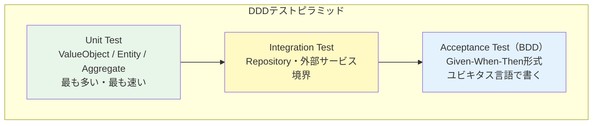

## テストはドメインの仕様書である

DDDにおけるテストは、単なる品質保証ツールではありません。ユビキタス言語で書かれたテストは、ドメインエキスパートが読んでも理解できる「生きたドキュメント」です。コードとドキュメントが乖離するという慢性的な問題を、テスト自体をドキュメントにすることで解決します。

DDDのテスト戦略は3層で構成されます。



---

## Unit Test：ドメインオブジェクトのテスト

Unit TestはValue Object・Entity・Aggregateのビジネスルールを検証します。外部依存（DB・API）は一切使いません。これらのテストが最も数が多く、最も速く実行できます。

```csharp
// xUnit + FluentAssertionsによるUnit Test

public class OrderTests
{
    // ✅ Given-When-Then形式 + ユビキタス言語で命名
    [Fact]
    public void 注文に商品が含まれていない場合_完了操作はドメイン例外を投げる()
    {
        // Given（前提条件）
        var order = Order.Place(CustomerId.New());

        // When（操作）
        var act = () => order.Complete();

        // Then（期待結果）
        act.Should().Throw<DomainException>()
           .WithMessage("商品がありません");
    }

    [Fact]
    public void 商品が追加された注文は完了操作で完了状態になる()
    {
        // Given
        var order = Order.Place(CustomerId.New());
        order.AddItem(ProductId.New(), quantity: 2, unitPrice: 1500m);

        // When
        order.Complete();

        // Then
        order.Status.Should().Be(OrderStatus.Completed);
        order.DomainEvents.Should().ContainSingle(e => e is OrderCompletedEvent);
    }

    [Theory]
    [InlineData(0)]
    [InlineData(-1)]
    public void 無効な数量での商品追加はドメイン例外を投げる(int invalidQuantity)
    {
        // Given
        var order = Order.Place(CustomerId.New());

        // When / Then
        var act = () => order.AddItem(ProductId.New(), invalidQuantity, 1000m);

        act.Should().Throw<DomainException>()
           .WithMessage("数量は1以上でなければなりません");
    }
}

// Value Objectのテスト
public class MoneyTests
{
    [Fact]
    public void 同じ金額と通貨のMoneyは等しい()
    {
        var money1 = Money.Of(1000m, Currency.JPY);
        var money2 = Money.Of(1000m, Currency.JPY);

        money1.Should().Be(money2);
    }

    [Fact]
    public void 異なる通貨のMoneyの加算はドメイン例外を投げる()
    {
        var jpy = Money.Of(1000m, Currency.JPY);
        var usd = Money.Of(10m, Currency.USD);

        var act = () => jpy.Add(usd);

        act.Should().Throw<DomainException>()
           .WithMessage("異なる通貨間の計算はできません");
    }
}
```

---

## Integration Test：Repositoryのテスト

Integration TestはRepositoryの実装を検証します。実際のDB（テスト用インメモリDBまたはTestcontainers）を使い、永続化と復元が正しく動作するかを確認します。

```csharp
public class SqlOrderRepositoryTests : IAsyncLifetime
{
    private AppDbContext _db = null!;
    private SqlOrderRepository _repository = null!;

    public async Task InitializeAsync()
    {
        // テスト用インメモリDBを使用
        var options = new DbContextOptionsBuilder<AppDbContext>()
            .UseInMemoryDatabase(Guid.NewGuid().ToString())
            .Options;
        _db = new AppDbContext(options);
        _repository = new SqlOrderRepository(_db);
    }

    [Fact]
    public async Task 保存した注文はIDで取得できる()
    {
        // Given
        var order = Order.Place(CustomerId.New());
        order.AddItem(ProductId.New(), 1, 3000m);

        // When
        await _repository.Save(order);
        var loaded = await _repository.FindById(order.Id);

        // Then
        loaded.Should().NotBeNull();
        loaded!.Id.Should().Be(order.Id);
        loaded.Status.Should().Be(OrderStatus.Pending);
    }

    public async Task DisposeAsync() => await _db.DisposeAsync();
}
```

---

## Acceptance Test（BDD）：ユビキタス言語でテストを書く

```csharp
// Acceptance TestはビジネスシナリオをUbiquitous Languageで表現する
public class OrderCompletionAcceptanceTests
{
    private readonly OrderService _service;

    public OrderCompletionAcceptanceTests()
    {
        // モックを使った軽量な構成
        var repo = new InMemoryOrderRepository();
        _service = new OrderService(repo, new FakeEmailNotifier());
    }

    [Fact]
    public async Task 顧客が注文を完了すると確認メールが送信される()
    {
        // Given: 顧客が商品をカートに入れた状態
        var command = new PlaceOrderCommand(
            CustomerId: Guid.NewGuid(),
            Items: new[] { new OrderItemDto(ProductId: Guid.NewGuid(), Quantity: 1, UnitPrice: 5000m) }
        );
        var orderId = await _service.PlaceOrder(command);

        // When: 顧客が注文を確定する
        await _service.CompleteOrder(new CompleteOrderCommand(orderId));

        // Then: 注文は完了状態となり、確認メールが送信される
        var order = await _service.GetOrder(orderId);
        order.Status.Should().Be(OrderStatus.Completed);
        _service.SentEmails.Should().ContainSingle(m => m.Subject.Contains("注文確認"));
    }
}
```

---

## Before（テスト名が技術的で意味不明）

```csharp
// ❌ Before: テストがドキュメントとして機能しない
[Fact]
public void TestOrder_Complete_ThrowsException()
{
    var o = new Order();
    Assert.Throws<Exception>(() => o.Complete());  // なぜ例外?条件不明
}
```

---

> **専門家の視点**
>
> テストメソッド名に日本語（Ubiquitous Language）を使うことを推奨します。`注文に商品が含まれていない場合_完了操作はドメイン例外を投げる`という名前は、ドメインエキスパートが読んでも「そうあるべきだ」と確認できます。これが「テストがドキュメントになる」ということです。また、xUnitの`[Theory]`と`[InlineData]`を組み合わせて境界値をテストすることで、ビジネスルールの全ケースを網羅的に表現できます。FluentAssertionsの`.Should()`チェーンは、アサーションを英語（または日本語）の自然文に近い形で書けるため、テストの可読性を大幅に向上させます。

---

## まとめ

DDDのテストは3層構造で設計します。Unit TestでドメインルールをAggregateレベルで検証し、Integration TestでRepositoryの永続化を確認し、Acceptance TestでビジネスシナリオをGiven-When-Then形式で記述します。ユビキタス言語でテストを命名することで、テストスイートはシステムの生きた仕様書になります。
