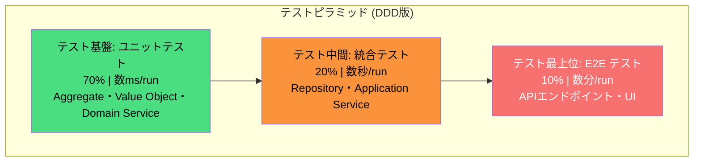
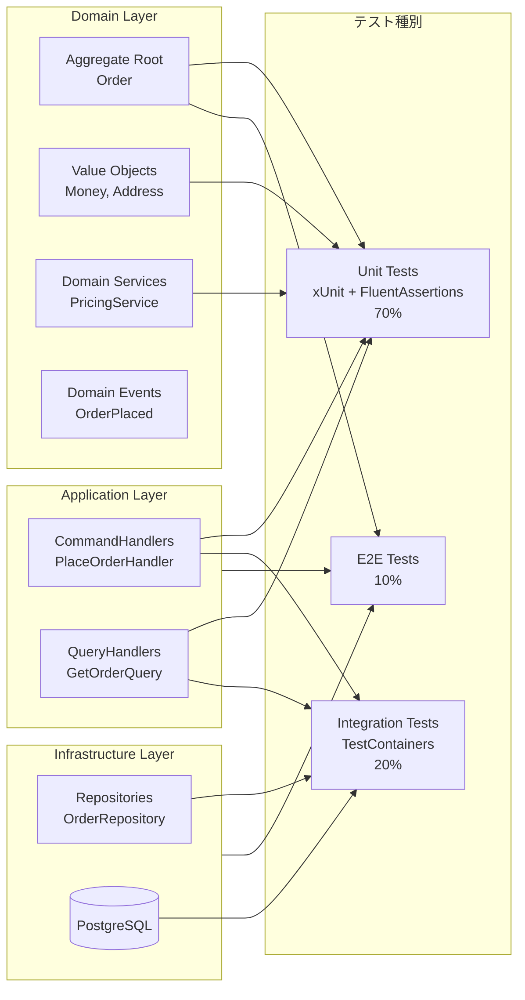

# 第17章: テスト戦略

> ドメインモデルの品質は、テストの質によって証明されます。コードが「動く」ことを示すのではなく、ビジネスルールが「守られている」ことを示すのがDDDのテスト戦略です。

---

## 0. TL;DR

- **DDDのテストピラミッドは70/20/10が基本**: Domain Layer（Aggregate・Value Object）のユニットテストを最多にし、高速・安定・安価なフィードバックループを確立します。
- **テスト名はビジネス語で書く**: `Given_OrderHasItems_When_PlaceOrder_Then_StatusBecomesPlaced` のような形式により、テストがドキュメントとして機能します。
- **モックは境界（Repository・外部サービス）のみに限定する**: Domain Logicをモックする設計は「実装詳細に依存したテスト」というアンチパターンです。
- **統合テストにはTestContainersで本物のDBを使う**: インメモリDBでは検出できない楽観的ロック競合・トランザクション境界のバグを本番同等の環境で発見できます。
- **テストはビジネスシナリオとして読める**: Given-When-Then構造により、エンジニアでない関係者もテストの意図を理解できます。

---

## 1. DDDシステムのテストピラミッド

### 1.1 なぜピラミッド形なのか

テストには「速度・安定性・メンテナンスコスト・検出力」のトレードオフがあります。ユニットテストは実行が数ミリ秒で完了し、CI/CDの度に数百本を走らせても数十秒で終わります。一方でE2Eテストは実際のブラウザやAPIサーバを起動するため数分かかり、ネットワーク遅延や外部サービスの不安定さに影響されます。

DDDにおいてこのトレードオフが特に有利に働くのが、**ドメインロジックがドメイン層に集中している**という設計原則です。Domain Layerは純粋な.NETのクラスであり、DBもHTTPも依存しません。したがってユニットテストで最大の価値のある検証が完結します。

| テスト種別       | 割合 | 速度    | 対象                              |
|----------------|------|---------|-----------------------------------|
| Unit           | 70%  | 数ms    | Aggregate / Value Object / Domain Service |
| Integration    | 20%  | 数秒    | Repository / Application Service  |
| E2E            | 10%  | 数分    | API エンドポイント / UI フロー     |

### 1.2 テストピラミッド図



### 1.3 DDD固有のテスト対象マッピング



### 1.4 なぜUnit比率を高くするのか

**理由1: フィードバック速度**

1000本のユニットテストが10秒で完了すれば、開発者はコミットのたびに全体品質を確認できます。E2Eが1000本あれば数時間かかり、実質的にCIが形骸化します。

**理由2: テスト失敗の局所化**

ユニットテストはAggregateの単一メソッドを対象とするため、失敗時に原因がすぐ特定できます。E2Eテスト失敗はDBの問題かネットワークの問題かAPIの問題か特定に時間がかかります。

**理由3: DDDのドメインロジック集中という設計上の恩恵**

DDDでは「重要なビジネスルールはすべてドメイン層に置く」という原則があります。この原則が守られていれば、ユニットテストだけでビジネスルールの90%以上を検証できます。逆に言えば、Application Layerや Infrastructure Layerのテストカバレッジが低くても、ドメイン層さえしっかりテストされていれば致命的なビジネスロジックのバグはほぼ防げます。

---

## 2. Domain Layerのユニットテスト（Given-When-Then）

### 2.1 テスト構造の設計思想

Given-When-Thenはテストを「前提条件・操作・期待結果」の3ステップで構造化します。DDDにおいて重要なのは、**テスト名とコードがビジネス語で書かれていること**です。

```csharp
// 悪い例 (実装語)
[Fact]
public void Test_SetStatus_After_AddItem()

// 良い例 (ビジネス語)
[Fact]
public void Given_EmptyOrder_When_ItemAdded_Then_OrderContainsOneLineItem()
```

このようにテスト名をビジネス語にすることで、テストスイートがそのまま「ユーザーストーリーの仕様書」として機能します。ドメインエキスパートがテスト名の一覧を読んでも、システムがどのようなビジネスルールを持っているかが把握できるようになります。

### 2.2 プロジェクト構成

```
tests/
├── Domain.Tests/
│   ├── Aggregates/
│   │   ├── OrderAggregateTests.cs
│   │   └── OrderAggregateExceptionTests.cs
│   ├── ValueObjects/
│   │   ├── MoneyTests.cs
│   │   └── AddressTests.cs
│   └── DomainServices/
│       └── PricingServiceTests.cs
├── Application.Tests/
│   ├── Commands/
│   │   └── PlaceOrderHandlerTests.cs
│   └── Queries/
│       └── GetOrderQueryHandlerTests.cs
└── Infrastructure.Tests/
    └── Repositories/
        └── OrderRepositoryIntegrationTests.cs
```

### 2.3 ドメインモデルの定義（テスト対象）

```csharp
// src/Domain/Orders/Order.cs
namespace ECommerce.Domain.Orders;

public sealed class Order : AggregateRoot<OrderId>
{
    private readonly List<OrderLine> _lines = [];
    private readonly List<IDomainEvent> _domainEvents = [];

    public CustomerId CustomerId { get; private set; }
    public OrderStatus Status { get; private set; }
    public Money TotalAmount { get; private set; }
    public Address? ShippingAddress { get; private set; }
    public DateTimeOffset CreatedAt { get; private set; }
    public DateTimeOffset? PlacedAt { get; private set; }
    public IReadOnlyList<OrderLine> Lines => _lines.AsReadOnly();
    public IReadOnlyList<IDomainEvent> DomainEvents => _domainEvents.AsReadOnly();

    private Order() { } // EF Core用プライベートコンストラクタ

    public static Order Create(CustomerId customerId, DateTimeOffset createdAt)
    {
        var order = new Order
        {
            Id = OrderId.New(),
            CustomerId = customerId,
            Status = OrderStatus.Draft,
            TotalAmount = Money.Zero("JPY"),
            CreatedAt = createdAt
        };
        order._domainEvents.Add(new OrderCreatedEvent(order.Id, customerId, createdAt));
        return order;
    }

    public void AddItem(ProductId productId, ProductName productName, Money unitPrice, Quantity quantity)
    {
        if (Status != OrderStatus.Draft)
            throw new OrderNotEditableException(Id, Status);

        if (unitPrice.Amount <= 0)
            throw new InvalidProductPriceException(productId, unitPrice);

        var existingLine = _lines.FirstOrDefault(l => l.ProductId == productId);
        if (existingLine is not null)
        {
            var newQuantity = existingLine.Quantity + quantity;
            _lines.Remove(existingLine);
            _lines.Add(existingLine with { Quantity = newQuantity, SubTotal = unitPrice * newQuantity });
        }
        else
        {
            _lines.Add(new OrderLine(OrderLineId.New(), productId, productName, unitPrice, quantity, unitPrice * quantity));
        }

        RecalculateTotal();
        _domainEvents.Add(new OrderItemAddedEvent(Id, productId, quantity, unitPrice));
    }

    public void RemoveItem(ProductId productId)
    {
        if (Status != OrderStatus.Draft)
            throw new OrderNotEditableException(Id, Status);

        var line = _lines.FirstOrDefault(l => l.ProductId == productId)
            ?? throw new OrderLineNotFoundException(Id, productId);

        _lines.Remove(line);
        RecalculateTotal();
    }

    public void SetShippingAddress(Address address)
    {
        if (Status != OrderStatus.Draft)
            throw new OrderNotEditableException(Id, Status);

        ShippingAddress = address;
    }

    public void Place(DateTimeOffset placedAt)
    {
        if (Status != OrderStatus.Draft)
            throw new InvalidOrderStateTransitionException(Id, Status, OrderStatus.Placed);

        if (_lines.Count == 0)
            throw new CannotPlaceEmptyOrderException(Id);

        if (ShippingAddress is null)
            throw new ShippingAddressRequiredException(Id);

        Status = OrderStatus.Placed;
        PlacedAt = placedAt;
        _domainEvents.Add(new OrderPlacedEvent(Id, CustomerId, TotalAmount, placedAt));
    }

    public void Cancel(string reason)
    {
        if (Status == OrderStatus.Shipped || Status == OrderStatus.Delivered)
            throw new CannotCancelShippedOrderException(Id, Status);

        if (Status == OrderStatus.Cancelled)
            throw new OrderAlreadyCancelledException(Id);

        Status = OrderStatus.Cancelled;
        _domainEvents.Add(new OrderCancelledEvent(Id, reason, DateTimeOffset.UtcNow));
    }

    public void ClearDomainEvents() => _domainEvents.Clear();

    private void RecalculateTotal()
    {
        TotalAmount = _lines.Aggregate(Money.Zero("JPY"), (acc, line) => acc + line.SubTotal);
    }
}
```

### 2.4 OrderAggregateのユニットテスト（完全実装・22本）

```csharp
// tests/Domain.Tests/Aggregates/OrderAggregateTests.cs
namespace ECommerce.Domain.Tests.Aggregates;

using ECommerce.Domain.Orders;
using ECommerce.Domain.Orders.Events;
using ECommerce.Domain.Orders.Exceptions;
using ECommerce.Domain.Tests.TestHelpers;
using FluentAssertions;
using Xunit;

public sealed class OrderAggregateTests
{
    // ─────────────────────────────────────────────────────────
    // Order.Create のテスト群（4本）
    // ─────────────────────────────────────────────────────────

    [Fact]
    public void Given_ValidCustomerId_When_OrderCreated_Then_StatusIsDraft()
    {
        // Arrange
        var customerId = CustomerId.New();
        var now = DateTimeOffset.UtcNow;

        // Act
        var order = Order.Create(customerId, now);

        // Assert
        order.Status.Should().Be(OrderStatus.Draft);
    }

    [Fact]
    public void Given_ValidCustomerId_When_OrderCreated_Then_TotalAmountIsZero()
    {
        // Arrange
        var customerId = CustomerId.New();

        // Act
        var order = Order.Create(customerId, DateTimeOffset.UtcNow);

        // Assert
        order.TotalAmount.Should().Be(Money.Zero("JPY"));
    }

    [Fact]
    public void Given_ValidCustomerId_When_OrderCreated_Then_LinesAreEmpty()
    {
        // Arrange & Act
        var order = Order.Create(CustomerId.New(), DateTimeOffset.UtcNow);

        // Assert
        order.Lines.Should().BeEmpty();
    }

    [Fact]
    public void Given_ValidCustomerId_When_OrderCreated_Then_OrderCreatedEventIsRaised()
    {
        // Arrange
        var customerId = CustomerId.New();
        var now = DateTimeOffset.UtcNow;

        // Act
        var order = Order.Create(customerId, now);

        // Assert
        order.DomainEvents.Should().ContainSingle()
            .Which.Should().BeOfType<OrderCreatedEvent>()
            .Which.CustomerId.Should().Be(customerId);
    }

    // ─────────────────────────────────────────────────────────
    // AddItem のテスト群（8本）
    // ─────────────────────────────────────────────────────────

    [Fact]
    public void Given_EmptyDraftOrder_When_ItemAdded_Then_LineCountIsOne()
    {
        // Arrange
        var order = OrderBuilder.ANewDraftOrder().Build();
        var (productId, name, price) = ProductBuilder.AProduct().WithPrice(new Money(1000, "JPY")).Build();

        // Act
        order.AddItem(productId, name, price, Quantity.Of(1));

        // Assert
        order.Lines.Should().HaveCount(1);
    }

    [Fact]
    public void Given_DraftOrderWithItem_When_SameProductAdded_Then_QuantityIsAggregated()
    {
        // Arrange
        var (productId, name, price) = ProductBuilder.AProduct().WithPrice(new Money(500, "JPY")).Build();
        var order = OrderBuilder.ANewDraftOrder()
            .WithItem(productId, name, price, Quantity.Of(2))
            .Build();

        // Act
        order.AddItem(productId, name, price, Quantity.Of(3));

        // Assert
        order.Lines.Should().ContainSingle()
            .Which.Quantity.Should().Be(Quantity.Of(5));
    }

    [Fact]
    public void Given_DraftOrderWithItem_When_ItemAdded_Then_TotalAmountIsCorrect()
    {
        // Arrange
        var order = OrderBuilder.ANewDraftOrder().Build();
        var unitPrice = new Money(1500, "JPY");

        // Act
        order.AddItem(ProductId.New(), new ProductName("テスト商品"), unitPrice, Quantity.Of(3));

        // Assert
        order.TotalAmount.Should().Be(new Money(4500, "JPY"));
    }

    [Fact]
    public void Given_DraftOrderWithTwoProducts_When_BothItemsAdded_Then_TotalIsSumOfBoth()
    {
        // Arrange
        var order = OrderBuilder.ANewDraftOrder().Build();

        // Act
        order.AddItem(ProductId.New(), new ProductName("商品A"), new Money(1000, "JPY"), Quantity.Of(2));
        order.AddItem(ProductId.New(), new ProductName("商品B"), new Money(500, "JPY"), Quantity.Of(4));

        // Assert
        order.TotalAmount.Should().Be(new Money(4000, "JPY")); // 1000×2 + 500×4
    }

    [Fact]
    public void Given_DraftOrder_When_ItemWithZeroPriceAdded_Then_ThrowsInvalidProductPriceException()
    {
        // Arrange
        var order = OrderBuilder.ANewDraftOrder().Build();

        // Act
        var act = () => order.AddItem(ProductId.New(), new ProductName("商品"), Money.Zero("JPY"), Quantity.Of(1));

        // Assert
        act.Should().Throw<InvalidProductPriceException>();
    }

    [Fact]
    public void Given_PlacedOrder_When_ItemAdded_Then_ThrowsOrderNotEditableException()
    {
        // Arrange
        var order = OrderBuilder.APlacedOrder().Build();

        // Act
        var act = () => order.AddItem(ProductId.New(), new ProductName("商品"), new Money(1000, "JPY"), Quantity.Of(1));

        // Assert
        act.Should().Throw<OrderNotEditableException>()
            .Which.CurrentStatus.Should().Be(OrderStatus.Placed);
    }

    [Fact]
    public void Given_DraftOrder_When_ItemAdded_Then_OrderItemAddedEventIsRaised()
    {
        // Arrange
        var order = OrderBuilder.ANewDraftOrder().Build();
        var productId = ProductId.New();
        order.ClearDomainEvents();

        // Act
        order.AddItem(productId, new ProductName("商品"), new Money(1000, "JPY"), Quantity.Of(2));

        // Assert
        order.DomainEvents.Should().ContainSingle()
            .Which.Should().BeOfType<OrderItemAddedEvent>()
            .Which.ProductId.Should().Be(productId);
    }

    [Fact]
    public void Given_OrderWithExistingProduct_When_SameProductAddedAgain_Then_LineCountRemainsOne()
    {
        // Arrange
        var productId = ProductId.New();
        var order = OrderBuilder.ANewDraftOrder()
            .WithItem(productId, new ProductName("商品"), new Money(500, "JPY"), Quantity.Of(1))
            .Build();

        // Act
        order.AddItem(productId, new ProductName("商品"), new Money(500, "JPY"), Quantity.Of(2));

        // Assert
        order.Lines.Should().ContainSingle(); // 行数は増えない（同一商品は合算）
    }

    // ─────────────────────────────────────────────────────────
    // RemoveItem のテスト群（3本）
    // ─────────────────────────────────────────────────────────

    [Fact]
    public void Given_OrderWithOneItem_When_ItemRemoved_Then_LinesAreEmpty()
    {
        // Arrange
        var productId = ProductId.New();
        var order = OrderBuilder.ANewDraftOrder()
            .WithItem(productId, new ProductName("商品"), new Money(1000, "JPY"), Quantity.Of(1))
            .Build();

        // Act
        order.RemoveItem(productId);

        // Assert
        order.Lines.Should().BeEmpty();
    }

    [Fact]
    public void Given_OrderWithItem_When_ItemRemoved_Then_TotalAmountIsZero()
    {
        // Arrange
        var productId = ProductId.New();
        var order = OrderBuilder.ANewDraftOrder()
            .WithItem(productId, new ProductName("商品"), new Money(2000, "JPY"), Quantity.Of(3))
            .Build();

        // Act
        order.RemoveItem(productId);

        // Assert
        order.TotalAmount.Should().Be(Money.Zero("JPY"));
    }

    [Fact]
    public void Given_Order_When_NonExistentItemRemoved_Then_ThrowsOrderLineNotFoundException()
    {
        // Arrange
        var order = OrderBuilder.ANewDraftOrder().Build();

        // Act
        var act = () => order.RemoveItem(ProductId.New());

        // Assert
        act.Should().Throw<OrderLineNotFoundException>();
    }

    // ─────────────────────────────────────────────────────────
    // Place のテスト群（4本）
    // ─────────────────────────────────────────────────────────

    [Fact]
    public void Given_DraftOrderWithItemsAndAddress_When_Placed_Then_StatusIsPlaced()
    {
        // Arrange
        var order = OrderBuilder.ANewDraftOrder()
            .WithItem(ProductId.New(), new ProductName("商品"), new Money(1000, "JPY"), Quantity.Of(1))
            .WithShippingAddress(AddressBuilder.AValidAddress().Build())
            .Build();

        // Act
        order.Place(DateTimeOffset.UtcNow);

        // Assert
        order.Status.Should().Be(OrderStatus.Placed);
    }

    [Fact]
    public void Given_DraftOrderWithItemsAndAddress_When_Placed_Then_PlacedAtIsSet()
    {
        // Arrange
        var order = OrderBuilder.ANewDraftOrder()
            .WithItem(ProductId.New(), new ProductName("商品"), new Money(1000, "JPY"), Quantity.Of(1))
            .WithShippingAddress(AddressBuilder.AValidAddress().Build())
            .Build();
        var placedAt = new DateTimeOffset(2026, 7, 11, 10, 0, 0, TimeSpan.Zero);

        // Act
        order.Place(placedAt);

        // Assert
        order.PlacedAt.Should().Be(placedAt);
    }

    [Fact]
    public void Given_DraftOrderWithItemsAndAddress_When_Placed_Then_OrderPlacedEventIsRaised()
    {
        // Arrange
        var order = OrderBuilder.ANewDraftOrder()
            .WithItem(ProductId.New(), new ProductName("商品"), new Money(3000, "JPY"), Quantity.Of(2))
            .WithShippingAddress(AddressBuilder.AValidAddress().Build())
            .Build();
        order.ClearDomainEvents();

        // Act
        order.Place(DateTimeOffset.UtcNow);

        // Assert
        var placedEvent = order.DomainEvents.Should().ContainSingle()
            .Which.Should().BeOfType<OrderPlacedEvent>().Subject;
        placedEvent.TotalAmount.Should().Be(new Money(6000, "JPY"));
    }

    [Fact]
    public void Given_EmptyDraftOrder_When_Placed_Then_ThrowsCannotPlaceEmptyOrderException()
    {
        // Arrange
        var order = OrderBuilder.ANewDraftOrder().Build();

        // Act
        var act = () => order.Place(DateTimeOffset.UtcNow);

        // Assert
        act.Should().Throw<CannotPlaceEmptyOrderException>();
    }

    [Fact]
    public void Given_DraftOrderWithItemsButNoAddress_When_Placed_Then_ThrowsShippingAddressRequiredException()
    {
        // Arrange
        var order = OrderBuilder.ANewDraftOrder()
            .WithItem(ProductId.New(), new ProductName("商品"), new Money(1000, "JPY"), Quantity.Of(1))
            .Build();

        // Act
        var act = () => order.Place(DateTimeOffset.UtcNow);

        // Assert
        act.Should().Throw<ShippingAddressRequiredException>();
    }

    [Fact]
    public void Given_PlacedOrder_When_PlacedAgain_Then_ThrowsInvalidOrderStateTransitionException()
    {
        // Arrange
        var order = OrderBuilder.APlacedOrder().Build();

        // Act
        var act = () => order.Place(DateTimeOffset.UtcNow);

        // Assert
        act.Should().Throw<InvalidOrderStateTransitionException>();
    }

    // ─────────────────────────────────────────────────────────
    // Cancel のテスト群（3本）
    // ─────────────────────────────────────────────────────────

    [Fact]
    public void Given_PlacedOrder_When_Cancelled_Then_StatusIsCancelled()
    {
        // Arrange
        var order = OrderBuilder.APlacedOrder().Build();

        // Act
        order.Cancel("顧客都合");

        // Assert
        order.Status.Should().Be(OrderStatus.Cancelled);
    }

    [Fact]
    public void Given_ShippedOrder_When_Cancelled_Then_ThrowsCannotCancelShippedOrderException()
    {
        // Arrange
        var order = OrderBuilder.AShippedOrder().Build();

        // Act
        var act = () => order.Cancel("キャンセル試行");

        // Assert
        act.Should().Throw<CannotCancelShippedOrderException>()
            .Which.CurrentStatus.Should().Be(OrderStatus.Shipped);
    }

    [Fact]
    public void Given_CancelledOrder_When_CancelledAgain_Then_ThrowsOrderAlreadyCancelledException()
    {
        // Arrange
        var order = OrderBuilder.ACancelledOrder().Build();

        // Act
        var act = () => order.Cancel("再度キャンセル");

        // Assert
        act.Should().Throw<OrderAlreadyCancelledException>();
    }
}
```

### 2.5 Value Objectのテスト（Money・Address）

Value Objectのテストで最も重要なのは「等値性（Equality）のテスト」と「バリデーションのテスト」の2種類です。Value Objectはrecordで実装されている場合が多いため、構造的等値性が自動で保証されますが、カスタム等値比較を実装する場合は特に念入りにテストする必要があります。

```csharp
// tests/Domain.Tests/ValueObjects/MoneyTests.cs
namespace ECommerce.Domain.Tests.ValueObjects;

using FluentAssertions;
using Xunit;

public sealed class MoneyTests
{
    [Fact]
    public void Given_SameAmountAndCurrency_When_Compared_Then_AreEqual()
    {
        // Arrange
        var money1 = new Money(1000, "JPY");
        var money2 = new Money(1000, "JPY");

        // Assert
        money1.Should().Be(money2);
    }

    [Fact]
    public void Given_DifferentAmounts_When_Compared_Then_AreNotEqual()
    {
        var money1 = new Money(1000, "JPY");
        var money2 = new Money(2000, "JPY");
        money1.Should().NotBe(money2);
    }

    [Fact]
    public void Given_DifferentCurrencies_When_Compared_Then_AreNotEqual()
    {
        var jpy = new Money(1000, "JPY");
        var usd = new Money(1000, "USD");
        jpy.Should().NotBe(usd);
    }

    [Theory]
    [InlineData(1000, "JPY", 500, "JPY", 1500, "JPY")]
    [InlineData(100, "USD", 200, "USD", 300, "USD")]
    [InlineData(0, "JPY", 500, "JPY", 500, "JPY")]
    public void Given_TwoMoneyValues_When_Added_Then_SumIsCorrect(
        decimal amount1, string currency1,
        decimal amount2, string currency2,
        decimal expectedAmount, string expectedCurrency)
    {
        var money1 = new Money(amount1, currency1);
        var money2 = new Money(amount2, currency2);

        var result = money1 + money2;

        result.Should().Be(new Money(expectedAmount, expectedCurrency));
    }

    [Fact]
    public void Given_MoneyInJPY_When_AddedWithUSD_Then_ThrowsCurrencyMismatchException()
    {
        var jpy = new Money(1000, "JPY");
        var usd = new Money(100, "USD");

        var act = () => { var _ = jpy + usd; };

        act.Should().Throw<CurrencyMismatchException>();
    }

    [Fact]
    public void Given_Money_When_MultipliedByQuantity_Then_AmountIsMultiplied()
    {
        var price = new Money(500, "JPY");

        var result = price * Quantity.Of(3);

        result.Should().Be(new Money(1500, "JPY"));
    }

    [Theory]
    [InlineData(-1, "JPY")]
    [InlineData(100, "")]
    [InlineData(100, "INVALID_CURRENCY_CODE")]
    public void Given_InvalidParameters_When_MoneyCreated_Then_ThrowsArgumentException(
        decimal amount, string currency)
    {
        var act = () => new Money(amount, currency);
        act.Should().Throw<ArgumentException>();
    }

    [Fact]
    public void Given_ZeroMoney_When_MultipliedByQuantity_Then_RemainsZero()
    {
        var zero = Money.Zero("JPY");

        var result = zero * Quantity.Of(100);

        result.Should().Be(Money.Zero("JPY"));
    }

    [Fact]
    public void Given_Money_When_UsedAsHashSetKey_Then_DuplicatesAreEliminated()
    {
        // Value Object はハッシュセットで正しく重複排除される
        var set = new HashSet<Money>
        {
            new Money(1000, "JPY"),
            new Money(1000, "JPY"), // 重複
            new Money(2000, "JPY")
        };

        set.Should().HaveCount(2);
    }
}
```

### 2.6 Domain Serviceのテスト

```csharp
// tests/Domain.Tests/DomainServices/PricingServiceTests.cs
namespace ECommerce.Domain.Tests.DomainServices;

public sealed class PricingServiceTests
{
    private readonly PricingService _sut = new(new TaxCalculator(taxRate: 0.10m));

    [Fact]
    public void Given_OrderWithItems_When_CalculateTotalWithTax_Then_TaxIsApplied()
    {
        // Arrange
        var order = OrderBuilder.ANewDraftOrder()
            .WithItem(ProductId.New(), new ProductName("商品"), new Money(1000, "JPY"), Quantity.Of(1))
            .Build();

        // Act
        var total = _sut.CalculateTotalWithTax(order);

        // Assert
        total.Should().Be(new Money(1100, "JPY")); // 1000 + 10%税
    }

    [Fact]
    public void Given_OrderWithMultipleItems_When_CalculateTotalWithTax_Then_TaxIsAppliedOnSum()
    {
        // Arrange
        var order = OrderBuilder.ANewDraftOrder()
            .WithItem(ProductId.New(), new ProductName("商品A"), new Money(1000, "JPY"), Quantity.Of(2))
            .WithItem(ProductId.New(), new ProductName("商品B"), new Money(500, "JPY"), Quantity.Of(2))
            .Build();

        // Act
        var total = _sut.CalculateTotalWithTax(order);

        // Assert: (1000×2 + 500×2) × 1.1 = 3300円
        total.Should().Be(new Money(3300, "JPY"));
    }

    [Fact]
    public void Given_EmptyOrder_When_CalculateTotalWithTax_Then_TotalIsZero()
    {
        var order = OrderBuilder.ANewDraftOrder().Build();

        var total = _sut.CalculateTotalWithTax(order);

        total.Should().Be(Money.Zero("JPY"));
    }
}
```

---

## 3. Application Serviceのテスト

### 3.1 何をモックすべきか

Application Serviceのテストでモックするのは**インフラ依存の境界**のみです。Repository・外部APIクライアント・メッセージキュー・時刻プロバイダはモックします。Domain Serviceをモックするのはアンチパターンです。その理由は、Domain Serviceをモックしてしまうと、「ドメインロジックが正しく呼び出されるか」ではなく「モックが正しく設定されているか」をテストすることになり、テストの価値が著しく低下するからです。

```
モックすべき              |  モックすべきでない
─────────────────────────|──────────────────────────
IOrderRepository         |  PricingService（Domain Service）
IPaymentGateway          |  OrderAggregate
IEmailService            |  Value Objects
IDateTimeProvider        |  ビジネスルールの計算処理
IUnitOfWork              |  Domain Eventの発行ロジック
```

### 3.2 CommandHandlerのテスト（PlaceOrderHandler完全実装）

```csharp
// src/Application/Orders/Commands/PlaceOrderCommand.cs
namespace ECommerce.Application.Orders.Commands;

public sealed record PlaceOrderCommand(Guid OrderId) : ICommand;

public sealed class PlaceOrderHandler(
    IOrderRepository orderRepository,
    IDateTimeProvider dateTime,
    IUnitOfWork unitOfWork) : ICommandHandler<PlaceOrderCommand>
{
    public async Task HandleAsync(PlaceOrderCommand command, CancellationToken ct)
    {
        var orderId = new OrderId(command.OrderId);
        var order = await orderRepository.GetByIdAsync(orderId, ct)
            ?? throw new OrderNotFoundException(orderId);

        order.Place(dateTime.UtcNow);

        await unitOfWork.SaveChangesAsync(ct);
    }
}
```

```csharp
// tests/Application.Tests/Commands/PlaceOrderHandlerTests.cs
namespace ECommerce.Application.Tests.Commands;

using NSubstitute;
using NSubstitute.ExceptionExtensions;
using FluentAssertions;
using Xunit;

public sealed class PlaceOrderHandlerTests
{
    private readonly IOrderRepository _orderRepository = Substitute.For<IOrderRepository>();
    private readonly IDateTimeProvider _dateTime = Substitute.For<IDateTimeProvider>();
    private readonly IUnitOfWork _unitOfWork = Substitute.For<IUnitOfWork>();
    private readonly PlaceOrderHandler _sut;

    public PlaceOrderHandlerTests()
    {
        _sut = new PlaceOrderHandler(_orderRepository, _dateTime, _unitOfWork);
        _dateTime.UtcNow.Returns(new DateTimeOffset(2026, 7, 11, 9, 0, 0, TimeSpan.Zero));
    }

    [Fact]
    public async Task Given_ValidOrder_When_PlaceOrderCommandHandled_Then_OrderStatusBecomesPlaced()
    {
        // Arrange
        var order = OrderBuilder.ANewDraftOrder()
            .WithItem(ProductId.New(), new ProductName("商品"), new Money(1000, "JPY"), Quantity.Of(1))
            .WithShippingAddress(AddressBuilder.AValidAddress().Build())
            .Build();
        _orderRepository.GetByIdAsync(order.Id, Arg.Any<CancellationToken>()).Returns(order);
        var command = new PlaceOrderCommand(order.Id.Value);

        // Act
        await _sut.HandleAsync(command, CancellationToken.None);

        // Assert
        order.Status.Should().Be(OrderStatus.Placed);
    }

    [Fact]
    public async Task Given_ValidOrder_When_PlaceOrderCommandHandled_Then_UnitOfWorkSaveChangesIsCalled()
    {
        // Arrange
        var order = OrderBuilder.ANewDraftOrder()
            .WithItem(ProductId.New(), new ProductName("商品"), new Money(1000, "JPY"), Quantity.Of(1))
            .WithShippingAddress(AddressBuilder.AValidAddress().Build())
            .Build();
        _orderRepository.GetByIdAsync(order.Id, Arg.Any<CancellationToken>()).Returns(order);

        // Act
        await _sut.HandleAsync(new PlaceOrderCommand(order.Id.Value), CancellationToken.None);

        // Assert: SaveChanges が正確に1回呼ばれたことを確認（永続化の副作用）
        await _unitOfWork.Received(1).SaveChangesAsync(Arg.Any<CancellationToken>());
    }

    [Fact]
    public async Task Given_NonExistentOrder_When_PlaceOrderCommandHandled_Then_ThrowsOrderNotFoundException()
    {
        // Arrange
        var nonExistentOrderId = Guid.NewGuid();
        _orderRepository.GetByIdAsync(Arg.Any<OrderId>(), Arg.Any<CancellationToken>())
            .Returns((Order?)null);

        // Act
        var act = () => _sut.HandleAsync(new PlaceOrderCommand(nonExistentOrderId), CancellationToken.None);

        // Assert
        await act.Should().ThrowAsync<OrderNotFoundException>();
    }

    [Fact]
    public async Task Given_NonExistentOrder_When_PlaceOrderCommandHandled_Then_SaveChangesIsNotCalled()
    {
        // Arrange
        _orderRepository.GetByIdAsync(Arg.Any<OrderId>(), Arg.Any<CancellationToken>())
            .Returns((Order?)null);

        // Act
        try { await _sut.HandleAsync(new PlaceOrderCommand(Guid.NewGuid()), CancellationToken.None); }
        catch { /* 例外は期待内 */ }

        // Assert: 注文が見つからない場合はDBへの書き込みは起きない
        await _unitOfWork.DidNotReceive().SaveChangesAsync(Arg.Any<CancellationToken>());
    }

    [Fact]
    public async Task Given_EmptyDraftOrder_When_PlaceOrderCommandHandled_Then_ThrowsCannotPlaceEmptyOrderException()
    {
        // Arrange
        var order = OrderBuilder.ANewDraftOrder().Build(); // アイテムなし
        _orderRepository.GetByIdAsync(order.Id, Arg.Any<CancellationToken>()).Returns(order);

        // Act
        var act = () => _sut.HandleAsync(new PlaceOrderCommand(order.Id.Value), CancellationToken.None);

        // Assert
        await act.Should().ThrowAsync<CannotPlaceEmptyOrderException>();
        await _unitOfWork.DidNotReceive().SaveChangesAsync(Arg.Any<CancellationToken>());
    }

    [Fact]
    public async Task Given_ValidOrder_When_PlaceOrderCommandHandled_Then_PlacedAtMatchesDateTimeProvider()
    {
        // Arrange
        var expectedPlacedAt = new DateTimeOffset(2026, 7, 11, 15, 30, 0, TimeSpan.Zero);
        _dateTime.UtcNow.Returns(expectedPlacedAt);

        var order = OrderBuilder.ANewDraftOrder()
            .WithItem(ProductId.New(), new ProductName("商品"), new Money(1000, "JPY"), Quantity.Of(1))
            .WithShippingAddress(AddressBuilder.AValidAddress().Build())
            .Build();
        _orderRepository.GetByIdAsync(order.Id, Arg.Any<CancellationToken>()).Returns(order);

        // Act
        await _sut.HandleAsync(new PlaceOrderCommand(order.Id.Value), CancellationToken.None);

        // Assert: 時刻はIDateTimeProviderから取得されること（固定可能・テスタブル）
        order.PlacedAt.Should().Be(expectedPlacedAt);
    }

    [Fact]
    public async Task Given_RepositoryThrowsException_When_HandleAsync_Then_ExceptionIsPropagatedAndSaveChangesNotCalled()
    {
        // Arrange
        _orderRepository.GetByIdAsync(Arg.Any<OrderId>(), Arg.Any<CancellationToken>())
            .ThrowsAsync(new RepositoryException("DB接続エラー"));

        // Act
        var act = () => _sut.HandleAsync(new PlaceOrderCommand(Guid.NewGuid()), CancellationToken.None);

        // Assert
        await act.Should().ThrowAsync<RepositoryException>();
        await _unitOfWork.DidNotReceive().SaveChangesAsync(Arg.Any<CancellationToken>());
    }
}
```

### 3.3 QueryHandlerのテスト

QueryHandlerはReadモデル（DTO）を返すだけのため、テストは「正しいパラメータでRepositoryが呼ばれること」と「返り値がそのままマッピングされること」の2点を確認します。

```csharp
// tests/Application.Tests/Queries/GetOrderQueryHandlerTests.cs
namespace ECommerce.Application.Tests.Queries;

public sealed class GetOrderQueryHandlerTests
{
    private readonly IOrderReadRepository _readRepository = Substitute.For<IOrderReadRepository>();
    private readonly GetOrderQueryHandler _sut;

    public GetOrderQueryHandlerTests()
    {
        _sut = new GetOrderQueryHandler(_readRepository);
    }

    [Fact]
    public async Task Given_ExistingOrder_When_QueryHandled_Then_ReturnsOrderDto()
    {
        // Arrange
        var orderId = Guid.NewGuid();
        var expectedDto = new OrderDto(orderId, "DRAFT", 3000m, []);
        _readRepository.FindByIdAsync(new OrderId(orderId), Arg.Any<CancellationToken>())
            .Returns(expectedDto);

        // Act
        var result = await _sut.HandleAsync(new GetOrderQuery(orderId), CancellationToken.None);

        // Assert
        result.Should().NotBeNull();
        result!.OrderId.Should().Be(orderId);
        result.Status.Should().Be("DRAFT");
    }

    [Fact]
    public async Task Given_NonExistentOrder_When_QueryHandled_Then_ReturnsNull()
    {
        // Arrange
        _readRepository.FindByIdAsync(Arg.Any<OrderId>(), Arg.Any<CancellationToken>())
            .Returns((OrderDto?)null);

        // Act
        var result = await _sut.HandleAsync(new GetOrderQuery(Guid.NewGuid()), CancellationToken.None);

        // Assert
        result.Should().BeNull();
    }

    [Fact]
    public async Task Given_ValidQuery_When_Handled_Then_RepositoryIsCalledWithCorrectOrderId()
    {
        // Arrange
        var orderId = Guid.NewGuid();
        _readRepository.FindByIdAsync(Arg.Any<OrderId>(), Arg.Any<CancellationToken>())
            .Returns((OrderDto?)null);

        // Act
        await _sut.HandleAsync(new GetOrderQuery(orderId), CancellationToken.None);

        // Assert: 正しいIDでRepositoryが呼び出されていることを確認
        await _readRepository.Received(1)
            .FindByIdAsync(new OrderId(orderId), Arg.Any<CancellationToken>());
    }
}
```

---

## 4. Repositoryの統合テスト

### 4.1 TestContainersの思想

統合テストにインメモリDBを使うと「本番で動かない」バグが発生します。例えば以下のケースがあります。

- PostgreSQLの楽観的ロック（`xmin`列やRowVersion）はインメモリDBには存在しない
- 文字列のcollation差異によるソート順の違い
- トランザクション分離レベルの動作の違い（PostgreSQL vs SQLite）
- JSONBカラム・配列型など PostgreSQL固有型のマッピング

TestContainersはDocker上に本物のPostgreSQLコンテナを起動し、テスト終了後に自動で破棄します。これにより「本番と同じDB」で統合テストが実行され、環境差異によるバグを事前に検出できます。

### 4.2 統合テストの設定クラス

```csharp
// tests/Infrastructure.Tests/Fixtures/PostgreSqlTestFixture.cs
namespace ECommerce.Infrastructure.Tests.Fixtures;

using Testcontainers.PostgreSql;
using Microsoft.EntityFrameworkCore;

/// <summary>
/// xUnit の IAsyncLifetime を実装することで、テストクラスの初期化・後片付けを
/// async で行えるようにします。コンテナの起動はTestごとに行うとコストが高いため、
/// IClassFixture で共有するパターンが有効です。
/// </summary>
public sealed class PostgreSqlTestFixture : IAsyncLifetime
{
    private readonly PostgreSqlContainer _postgres = new PostgreSqlBuilder()
        .WithImage("postgres:16-alpine")
        .WithDatabase("ecommerce_test")
        .WithUsername("test_user")
        .WithPassword("test_password")
        .Build();

    public string ConnectionString => _postgres.GetConnectionString();

    public async Task InitializeAsync()
    {
        await _postgres.StartAsync();

        // マイグレーション適用
        var options = CreateDbContextOptions();
        await using var context = new ECommerceDbContext(options);
        await context.Database.MigrateAsync();
    }

    public async Task DisposeAsync()
    {
        await _postgres.DisposeAsync();
    }

    public DbContextOptions<ECommerceDbContext> CreateDbContextOptions() =>
        new DbContextOptionsBuilder<ECommerceDbContext>()
            .UseNpgsql(ConnectionString)
            .Options;
}
```

### 4.3 OrderRepositoryの統合テスト完全実装

```csharp
// tests/Infrastructure.Tests/Repositories/OrderRepositoryIntegrationTests.cs
namespace ECommerce.Infrastructure.Tests.Repositories;

using ECommerce.Infrastructure.Tests.Fixtures;
using Xunit;
using FluentAssertions;
using Microsoft.EntityFrameworkCore;

[Collection("PostgreSQL")]
public sealed class OrderRepositoryIntegrationTests : IAsyncLifetime
{
    private readonly PostgreSqlTestFixture _fixture;
    private ECommerceDbContext _context = null!;
    private OrderRepository _sut = null!;

    public OrderRepositoryIntegrationTests(PostgreSqlTestFixture fixture)
    {
        _fixture = fixture;
    }

    public async Task InitializeAsync()
    {
        // 各テスト前に新しいDbContextを作成（テスト間の独立性を保証）
        _context = new ECommerceDbContext(_fixture.CreateDbContextOptions());
        _sut = new OrderRepository(_context);

        // 各テスト前にテーブルをクリア
        await _context.Database.ExecuteSqlRawAsync("TRUNCATE TABLE orders CASCADE");
    }

    public async Task DisposeAsync()
    {
        await _context.DisposeAsync();
    }

    // ─────────────────────────────────────────────────────────
    // Save / FindById テスト
    // ─────────────────────────────────────────────────────────

    [Fact]
    public async Task Given_NewOrder_When_Saved_Then_CanBeRetrievedById()
    {
        // Arrange
        var order = Order.Create(CustomerId.New(), DateTimeOffset.UtcNow);

        // Act
        await _sut.AddAsync(order, CancellationToken.None);
        await _context.SaveChangesAsync();

        _context.ChangeTracker.Clear(); // キャッシュをクリア（真のDB往復を確認）
        var retrieved = await _sut.GetByIdAsync(order.Id, CancellationToken.None);

        // Assert
        retrieved.Should().NotBeNull();
        retrieved!.Id.Should().Be(order.Id);
        retrieved.Status.Should().Be(OrderStatus.Draft);
    }

    [Fact]
    public async Task Given_OrderWithLines_When_Saved_Then_LinesArePersisted()
    {
        // Arrange
        var order = Order.Create(CustomerId.New(), DateTimeOffset.UtcNow);
        var productId = ProductId.New();
        order.AddItem(productId, new ProductName("テスト商品"), new Money(2000, "JPY"), Quantity.Of(3));

        // Act
        await _sut.AddAsync(order, CancellationToken.None);
        await _context.SaveChangesAsync();
        _context.ChangeTracker.Clear();

        var retrieved = await _sut.GetByIdAsync(order.Id, CancellationToken.None);

        // Assert
        retrieved!.Lines.Should().HaveCount(1);
        retrieved.Lines[0].ProductId.Should().Be(productId);
        retrieved.Lines[0].Quantity.Should().Be(Quantity.Of(3));
        retrieved.TotalAmount.Should().Be(new Money(6000, "JPY"));
    }

    [Fact]
    public async Task Given_NonExistentId_When_GetByIdAsync_Then_ReturnsNull()
    {
        // Act
        var result = await _sut.GetByIdAsync(OrderId.New(), CancellationToken.None);

        // Assert
        result.Should().BeNull();
    }

    // ─────────────────────────────────────────────────────────
    // 楽観的ロック競合テスト
    // ─────────────────────────────────────────────────────────

    [Fact]
    public async Task Given_TwoConcurrentUpdates_When_SecondCommits_Then_ThrowsOptimisticConcurrencyException()
    {
        // Arrange: 注文を作成してDBに保存
        var order = Order.Create(CustomerId.New(), DateTimeOffset.UtcNow);
        await _sut.AddAsync(order, CancellationToken.None);
        await _context.SaveChangesAsync();
        var orderId = order.Id;

        // Arrange: 2つの独立したDbContextで同じ注文を取得（同時並行を模擬）
        var options = _fixture.CreateDbContextOptions();
        await using var context1 = new ECommerceDbContext(options);
        await using var context2 = new ECommerceDbContext(options);

        var order1 = await new OrderRepository(context1).GetByIdAsync(orderId, CancellationToken.None);
        var order2 = await new OrderRepository(context2).GetByIdAsync(orderId, CancellationToken.None);

        // Act: context1 が先にキャンセル（コミット成功）
        order1!.Cancel("コンテキスト1からキャンセル");
        await context1.SaveChangesAsync();

        // Act: context2 も同じ注文をキャンセルしようとする
        order2!.Cancel("コンテキスト2からキャンセル");
        var act = () => context2.SaveChangesAsync();

        // Assert: 楽観的ロック例外が発生する（インメモリDBでは検出できない）
        await act.Should().ThrowAsync<DbUpdateConcurrencyException>(
            because: "同一レコードを2つのコンテキストが同時に更新しようとした場合、楽観的ロックで弾かれるべき");
    }

    // ─────────────────────────────────────────────────────────
    // トランザクションテスト
    // ─────────────────────────────────────────────────────────

    [Fact]
    public async Task Given_ExceptionDuringTransaction_When_SaveAttempted_Then_NothingIsPersisted()
    {
        // Arrange
        var createdOrderId = OrderId.New();

        // Act: トランザクション内で例外を発生させてロールバック
        await using var transaction = await _context.Database.BeginTransactionAsync();
        try
        {
            var order = Order.Create(CustomerId.New(), DateTimeOffset.UtcNow);
            await _sut.AddAsync(order, CancellationToken.None);
            await _context.SaveChangesAsync();

            // 意図的に例外を発生させてロールバックを確認
            throw new InvalidOperationException("ロールバック確認用の例外");
        }
        catch (InvalidOperationException)
        {
            await transaction.RollbackAsync();
        }

        // Assert: ロールバックにより何も保存されていない
        _context.ChangeTracker.Clear();
        var retrieved = await _sut.GetByIdAsync(createdOrderId, CancellationToken.None);
        retrieved.Should().BeNull();
    }

    [Fact]
    public async Task Given_MultipleOrders_When_FindByCustomerId_Then_ReturnsOnlyMatchingOrders()
    {
        // Arrange
        var targetCustomerId = CustomerId.New();
        var otherCustomerId = CustomerId.New();

        var targetOrder1 = Order.Create(targetCustomerId, DateTimeOffset.UtcNow);
        var targetOrder2 = Order.Create(targetCustomerId, DateTimeOffset.UtcNow);
        var otherOrder = Order.Create(otherCustomerId, DateTimeOffset.UtcNow);

        await _sut.AddAsync(targetOrder1, CancellationToken.None);
        await _sut.AddAsync(targetOrder2, CancellationToken.None);
        await _sut.AddAsync(otherOrder, CancellationToken.None);
        await _context.SaveChangesAsync();
        _context.ChangeTracker.Clear();

        // Act
        var results = await _sut.FindByCustomerIdAsync(targetCustomerId, CancellationToken.None);

        // Assert
        results.Should().HaveCount(2);
        results.Should().AllSatisfy(o => o.CustomerId.Should().Be(targetCustomerId));
    }
}
```

---

## 5. BDD（Behavior-Driven Development）

### 5.1 BDDの目的

BDDはテストをビジネスシナリオとして記述することで、エンジニアとビジネスサイドの共通言語を作ります。DDDのユビキタス言語をそのままテスト名に使えるため、特に相性が良いアプローチです。BDDのテストを読めば、そのシステムがどのようなビジネスシナリオをサポートしているかが一目で分かります。

### 5.2 xUnitのTheory + InlineDataで複数シナリオ

```csharp
// tests/Domain.Tests/BDD/OrderPlacementScenarios.cs
namespace ECommerce.Domain.Tests.BDD;

/// <summary>
/// ビジネスシナリオ: 注文の確定
/// ステークホルダー: 購買担当者
/// 目的: 商品をカートに入れた後、配送先を設定すれば注文を確定できる
/// このテストクラスはドメインエキスパートが読んでも理解できることを意識している
/// </summary>
public sealed class OrderPlacementScenarios
{
    [Theory]
    [InlineData(1, 1000, 1000)]     // 1点購入
    [InlineData(3, 500, 1500)]      // 3点購入（単価×数量）
    [InlineData(10, 100, 1000)]     // まとめ買い
    public void Given_DraftOrderWithItems_When_CustomerConfirmsOrder_Then_TotalAmountIsUnitPriceTimesQuantity(
        int quantity, decimal unitPriceAmount, decimal expectedTotalAmount)
    {
        // Given: 顧客がカートに商品を入れた
        var order = OrderBuilder.ANewDraftOrder().Build();
        order.AddItem(
            ProductId.New(),
            new ProductName("テスト商品"),
            new Money(unitPriceAmount, "JPY"),
            Quantity.Of(quantity));
        order.SetShippingAddress(AddressBuilder.AValidAddress().Build());

        // When: 注文を確定する
        order.Place(DateTimeOffset.UtcNow);

        // Then: 合計金額は数量×単価
        order.TotalAmount.Should().Be(new Money(expectedTotalAmount, "JPY"));
    }

    public static IEnumerable<object[]> CancellableStatuses =>
    [
        [OrderStatus.Draft, "ドラフト中のキャンセル"],
        [OrderStatus.Placed, "注文確定後のキャンセル"],
        [OrderStatus.Processing, "処理中のキャンセル"],
    ];

    [Theory]
    [MemberData(nameof(CancellableStatuses))]
    public void Given_OrderInCancellableStatus_When_CustomerCancels_Then_OrderStatusIsCancelled(
        OrderStatus initialStatus, string scenario)
    {
        // Given: 対象ステータスの注文
        var order = OrderBuilder.AnOrderWithStatus(initialStatus).Build();

        // When: 顧客がキャンセルする
        order.Cancel($"テストシナリオ: {scenario}");

        // Then: キャンセル済みになる
        order.Status.Should().Be(OrderStatus.Cancelled,
            because: $"シナリオ「{scenario}」ではキャンセル可能なはず");
    }

    public static IEnumerable<object[]> NonCancellableStatuses =>
    [
        [OrderStatus.Shipped],
        [OrderStatus.Delivered],
        [OrderStatus.Cancelled],
    ];

    [Theory]
    [MemberData(nameof(NonCancellableStatuses))]
    public void Given_OrderInNonCancellableStatus_When_CancelAttempted_Then_BusinessRuleViolationIsThrown(
        OrderStatus nonCancellableStatus)
    {
        // Given: キャンセル不可ステータスの注文
        var order = OrderBuilder.AnOrderWithStatus(nonCancellableStatus).Build();

        // When/Then: キャンセルしようとするとビジネスルール違反
        var act = () => order.Cancel("キャンセル試行");
        act.Should().Throw<Exception>(
            because: $"ステータス {nonCancellableStatus} はビジネスルール上キャンセルできない");
    }

    /// <summary>
    /// シナリオ: 同一商品を複数回追加した場合は数量が合算される
    /// ユーザーストーリー: 顧客がカート画面で同じ商品を複数回追加しても、行数が増えず正しく合算されること
    /// </summary>
    [Fact]
    public void Given_CartWithExistingProduct_When_CustomerAddsSameProductAgain_Then_QuantityMergesNotDuplicatesLine()
    {
        // Given: 顧客が商品Aを2個カートに入れた
        var productId = ProductId.New();
        var order = OrderBuilder.ANewDraftOrder().Build();
        order.AddItem(productId, new ProductName("商品A"), new Money(300, "JPY"), Quantity.Of(2));

        // When: 同じ商品Aをさらに3個追加した
        order.AddItem(productId, new ProductName("商品A"), new Money(300, "JPY"), Quantity.Of(3));

        // Then: カートのラインは1行のまま、数量は合算5個
        order.Lines.Should().ContainSingle(
            because: "同一商品の重複ラインはユーザー体験を損なう");
        order.Lines[0].Quantity.Should().Be(Quantity.Of(5));
        order.TotalAmount.Should().Be(new Money(1500, "JPY")); // 300 × 5
    }
}
```

### 5.3 SpecFlowを使ったBDD（参考実装）

SpecFlowを使うと、Gherkin記法（自然言語に近い記述）でシナリオを書くことができ、非エンジニアのステークホルダーでもレビューに参加できます。

```gherkin
# features/OrderPlacement.feature
Feature: 注文の確定
  ビジネス価値: 顧客が商品を正しく購入できること

  Background:
    Given 顧客がログインしている

  Scenario: 商品を1つカートに入れて注文を確定する
    Given 注文がドラフト状態である
    And 商品「テスト商品」を単価1000円で1個カートに入れた
    And 配送先住所を設定した
    When 注文を確定する
    Then 注文ステータスは「Placed」である
    And 合計金額は1000円である

  Scenario Outline: 複数個注文の合計金額確認
    Given 注文がドラフト状態である
    And 商品を単価<unit_price>円で<quantity>個カートに入れた
    And 配送先住所を設定した
    When 注文を確定する
    Then 合計金額は<total>円である

    Examples:
      | unit_price | quantity | total |
      | 1000       | 1        | 1000  |
      | 500        | 3        | 1500  |
      | 100        | 10       | 1000  |
```

```csharp
// features/steps/OrderPlacementSteps.cs
namespace ECommerce.Domain.Tests.BDD.Steps;

[Binding]
public sealed class OrderPlacementSteps(ScenarioContext context)
{
    [Given(@"注文がドラフト状態である")]
    public void GivenOrderIsDraft()
    {
        var order = Order.Create(CustomerId.New(), DateTimeOffset.UtcNow);
        context["order"] = order;
    }

    [Given(@"商品「(.+)」を単価(\d+)円で(\d+)個カートに入れた")]
    public void GivenItemAddedToCart(string productName, decimal unitPrice, int quantity)
    {
        var order = (Order)context["order"];
        order.AddItem(
            ProductId.New(),
            new ProductName(productName),
            new Money(unitPrice, "JPY"),
            Quantity.Of(quantity));
    }

    [Given(@"配送先住所を設定した")]
    public void GivenShippingAddressSet()
    {
        var order = (Order)context["order"];
        order.SetShippingAddress(AddressBuilder.AValidAddress().Build());
    }

    [When(@"注文を確定する")]
    public void WhenOrderPlaced()
    {
        var order = (Order)context["order"];
        order.Place(DateTimeOffset.UtcNow);
    }

    [Then(@"注文ステータスは「(.+)」である")]
    public void ThenOrderStatusIs(string expectedStatus)
    {
        var order = (Order)context["order"];
        var expected = Enum.Parse<OrderStatus>(expectedStatus);
        order.Status.Should().Be(expected);
    }

    [Then(@"合計金額は(\d+)円である")]
    public void ThenTotalAmountIs(decimal expectedAmount)
    {
        var order = (Order)context["order"];
        order.TotalAmount.Should().Be(new Money(expectedAmount, "JPY"));
    }
}
```

---
