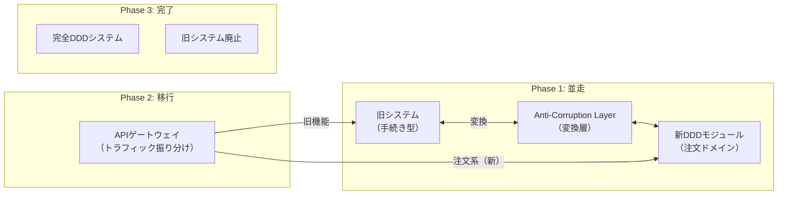

## Big Bangリファクタリングは禁物

「今のコードを全部捨てて、DDDで書き直そう」——この発想は非常に危険です。実際のビジネスは止まりません。既存システムには、長年かけて発見・修正された無数のエッジケース対応が埋まっています。それらを失いながら書き直すと、必ず退行バグが発生します。DDDへの移行は**段階的**でなければなりません。

---

## ストラングラーフィグパターン

マーティン・ファウラーが提唱したストラングラーフィグパターンは、自然界のイチジク（Strangler Fig）が古い木を包み込みながら成長し、やがて置き換えるプロセスにたとえています。新しいDDDコードで古いコードを少しずつ包み込み、安全に移行します。



---

## Anti-Corruption Layer（ACL）の役割

既存システムの「旧モデル」と新しいDDDモデルを橋渡しするのがACLです。翻訳者として機能し、旧システムの概念が新ドメインを汚染しないよう守ります。

---

## Before（貧血ドメインモデル）

```csharp
// ❌ Before: Anemic Domain Model（貧血ドメインモデル）
// データだけ持つ「ただのデータ構造」。ロジックはサービス層に散在。

public class Order  // データホルダーに過ぎない
{
    public int Id { get; set; }
    public int CustomerId { get; set; }
    public string Status { get; set; } = "";
    public decimal TotalAmount { get; set; }
    public List<OrderItem> Items { get; set; } = new();
    public DateTime CreatedAt { get; set; }
    // メソッドが何もない。すべての操作は外のサービスが担う。
}

// ビジネスロジックがサービス層に散在（手続き型）
public class OrderService
{
    public void CompleteOrder(int orderId)
    {
        var order = _db.Orders.Find(orderId);

        // バリデーションがサービスに漏れ出す
        if (order.Status != "Pending")
            throw new Exception("Invalid status");
        if (!order.Items.Any())
            throw new Exception("No items");

        order.Status = "Completed";  // 外部からステータスを書き換える
        order.TotalAmount = order.Items.Sum(i => i.Price * i.Quantity);
        _db.SaveChanges();

        _emailService.Send(order.CustomerId, "注文確認");
    }
}
```

---

## After（豊かなドメインモデルへの変換）

```csharp
// ✅ After: Rich Domain Model（豊かなドメインモデル）
// ビジネスルールはドメインオブジェクト自身が守る。

public class Order
{
    public OrderId Id { get; private set; }
    public CustomerId CustomerId { get; private set; }
    public OrderStatus Status { get; private set; }
    private readonly List<OrderItem> _items = new();
    public IReadOnlyList<OrderItem> Items => _items.AsReadOnly();
    private readonly List<IDomainEvent> _events = new();

    private Order() { }

    // ファクトリメソッド（生成ルールをカプセル化）
    public static Order Place(CustomerId customerId)
    {
        if (customerId == default)
            throw new DomainException("顧客IDが無効です");

        var order = new Order
        {
            Id = OrderId.New(),
            CustomerId = customerId,
            Status = OrderStatus.Pending
        };
        order._events.Add(new OrderPlacedEvent(order.Id));
        return order;
    }

    // ドメイン操作（ビジネスルールがここに集約）
    public void AddItem(ProductId productId, int quantity, Money unitPrice)
    {
        if (Status != OrderStatus.Pending)
            throw new DomainException("処理中の注文にのみ商品を追加できます");
        if (quantity <= 0)
            throw new DomainException("数量は1以上でなければなりません");

        _items.Add(new OrderItem(productId, quantity, unitPrice));
    }

    public void Complete()
    {
        if (Status != OrderStatus.Pending)
            throw new DomainException("処理待ち状態の注文のみ完了できます");
        if (!_items.Any())
            throw new DomainException("商品がありません");

        Status = OrderStatus.Completed;
        _events.Add(new OrderCompletedEvent(Id, DateTime.UtcNow));
    }

    public Money CalculateTotal()
        => _items.Aggregate(Money.Zero, (acc, item) => acc.Add(item.TotalPrice));
}

// Anti-Corruption Layer: 旧システムのOrderModelをDDDのOrderに変換
public class LegacyOrderTranslator
{
    public Order Translate(LegacyOrderRecord legacy)
    {
        // 旧システムの文字列StatusをDDDのValue Objectに変換
        var status = legacy.StatusCode switch
        {
            "P" => OrderStatus.Pending,
            "C" => OrderStatus.Completed,
            "X" => OrderStatus.Cancelled,
            _ => throw new DomainException($"未知のステータス: {legacy.StatusCode}")
        };

        return Order.Reconstruct(
            new OrderId(legacy.Id),
            new CustomerId(legacy.CustNo),
            status,
            legacy.Lines.Select(l => new OrderItem(
                new ProductId(l.ProdCode),
                l.Qty,
                Money.Of(l.Price, Currency.JPY)
            ))
        );
    }
}
```

---

## リファクタリングのチェックリスト

- [ ] 対象ドメインのユビキタス言語を定義したか（ドメインエキスパートと確認）
- [ ] 貧血ドメインモデルのメソッドをEntityに移動したか
- [ ] セッターを`private set`または排除してカプセル化したか
- [ ] ビジネスルールの違反を`DomainException`で表現したか
- [ ] ACLを用意して旧システムの概念が新ドメインに侵入しないようにしたか
- [ ] ドメインモデルのUnit Testを書いたか（テストが仕様書になるか確認）
- [ ] ストラングラーフィグで段階的にトラフィックを移行しているか

---

> **専門家の視点**
>
> リファクタリングの最大の障壁は「技術的な難しさ」ではなく「どこから始めるか」です。お勧めは「最も頻繁に変更され、最もバグが多い箇所」から着手することです。変更頻度の高いコードはドメインルールが密集している証拠であり、DDDの恩恵が最も大きい場所です。`git log --follow -p <file>`で変更頻度を確認し、最初のBounded Contextを選定してください。完璧を目指さず、まずひとつのAggregate（例：Order）を完全にリッチにすることが成功への近道です。

---

## まとめ

DDDへのリファクタリングは長期戦です。ストラングラーフィグパターンで少しずつ新ドメインを育て、ACLで旧システムとの境界を守り、貧血ドメインモデルを豊かなドメインモデルへと変換します。各ステップでテストを書くことで、退行を防ぎながら安全に移行できます。
