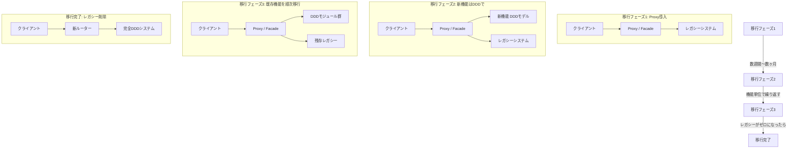
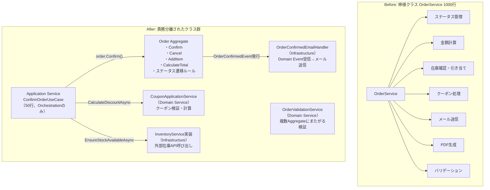
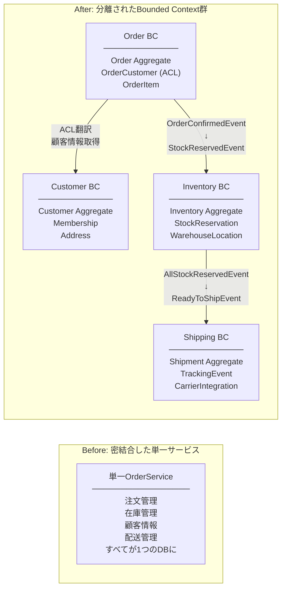

# 第18章 DDDリファクタリング

> 「動いているコードを変えるな」という本能と、「腐ったコードは必ず崩壊する」という現実の間で、エンジニアは毎日戦っている。DDDリファクタリングはその戦いに秩序をもたらす技法です。

---

## 0. TL;DR

- **Anemic Domain Model**（貧血ドメインモデル）とは、ドメインオブジェクトにデータしかなくロジックがServiceに散らばった状態のことで、DDDリファクタリングの最初のターゲットになります
- **Strangler Figパターン**を使うことで、既存システムを止めずに少しずつDDDへ移行できます。一気に書き換える「ビッグバンリファクタリング」は高確率で失敗します
- **Transaction ScriptからDomain Modelへの移行**は5ステップで体系化できます。テストを先に書いてリファクタリング前後の動作等価性を保証するのが鉄則です
- **Bounded Contextの境界が間違っていた**と後から気づいた場合、Anti-Corruption Layerを使って段階的に境界を修正できます。一度引いた境界は固定ではありません
- リファクタリングは**機能追加と同時に行わない**こと、**テストなしで行わない**こと、**ビッグバンで一気にやらない**ことの三原則を守ることが成功の鍵です

---

## 1. なぜDDDリファクタリングが難しいか

### 1.1 既存コードの慣性

「動いているものを変えるな」——この言葉は、エンジニアの世界で半ば格言として語られています。実際、プロダクションで稼働しているシステムを触ることには、正当なリスクがあります。バグを混入させる可能性、デプロイで障害を起こす可能性、そしてなにより「なぜそのコードがそうなっているのか」を完全に把握していないことへの恐怖です。

この慣性こそが、DDDリファクタリングを難しくする最初の壁です。既存コードには、数年分のバグ修正、特殊ケース対応、パフォーマンスチューニングが折り重なって堆積しています。それを「美しいDDDに変えよう」と手を入れた瞬間、表面に現れていなかった隠れた依存関係が牙を剥くことがあります。

しかしながら、変えないことのリスクも無視できません。ビジネス要件の変化についていけないモデルは、時間とともに「機能を追加するたびにコストが指数関数的に増加する」状態になります。これをDDDでは「モデルの腐敗（Model Rot）」と呼びます。

### 1.2 ビジネス要件の変化についていけないモデル

ECサイトを例に考えてみましょう。最初は「注文を受けて配送する」だけだったシステムが、数年後には以下のような要件を抱えることになります。

- サブスクリプション注文（定期購入）
- BtoB向けの見積もり・承認フロー
- マーケットプレイス（複数の出品者）
- 国際配送と通関処理
- ポイント・クーポンの組み合わせ

最初に設計した `Order` クラスは、これらすべてを収容しようとして肥大化します。あるいは逆に、それぞれの要件に対応するたびに `Order` を無視した別のテーブル・別のサービスが生まれ、システム全体が分裂します。どちらの方向に腐敗が進んでも、DDDリファクタリングの必要性は同じです。

### 1.3 Strangler Figパターン：少しずつ置き換える

Martin Fowlerが名付けた**Strangler Figパターン**は、既存システムを一気に書き換えるのではなく、新しいシステムを既存システムの周囲に育てていく戦略です。名前の由来は、ホストとなる木に絡みつきながら成長し、最終的にはホストを包み込んで枯らしてしまう「絞め殺しイチジク（Strangler Fig）」という植物です。

このパターンの本質は、**段階的な移行**にあります。全機能を一度にDDDに移行するのではなく、最もビジネス価値が高く、かつ変更頻度が高い部分から着手し、少しずつ新しいモデルに置き換えていきます。



### 1.4 リファクタリングの三原則をDDD文脈で解釈する

Martin Fowlerの「リファクタリング」（第2版）では、リファクタリングを成功させるための原則が示されています。これをDDD文脈で解釈すると以下のようになります。

**原則1：動作を変えずに内部構造を変える**

DDDリファクタリングにおいて、これは「ユビキタス言語を変えない段階では、ドメインロジックの結果も変えない」という意味になります。ServiceからAggregateにロジックを移動させるとき、入力と出力は完全に等価でなければなりません。テストがこれを保証します。

**原則2：テストがあることが前提**

DDDへの移行を始める前に、まず既存コードに対するキャラクタリゼーションテスト（現状の動作を記述するテスト）を書きます。これは「良い設計のテスト」ではなく「現在の動作を記録するテスト」です。リファクタリング後もこのテストが通ることを確認することで、動作の等価性を保証します。

**原則3：小さなステップで進む**

1回のコミットで変えるのは、1つのリファクタリング操作だけです。「Serviceのメソッドを2つAggregateに移した」のような単位でコミットします。大きな変更を一度にしようとすると、どこで問題が起きたかわからなくなります。

---

## 2. Anemic Domain Modelからの脱出

### 2.1 Anemic Domain Modelとは

Martin Fowlerは2003年のブログ記事で、**Anemic Domain Model（貧血ドメインモデル）**をアンチパターンとして定義しました。その特徴は以下の通りです。

- ドメインオブジェクト（エンティティ）はデータ（プロパティ）のみを持つ
- ビジネスロジックはすべてServiceクラスに書かれている
- エンティティはただのデータ転送オブジェクト（DTO）と変わらない
- Service同士が互いに呼び合い、依存関係が複雑に絡み合う

これは表面上「分離されている」ように見えますが、実際にはドメインの知識がServiceに散乱しており、同じルールが複数のServiceに重複して書かれたり、ルールが変わったときに修正漏れが発生したりします。

### 2.2 検出方法：コード症状チェックリスト

以下の症状が複数あてはまれば、Anemic Domain Modelである可能性が高いです。

```
□ エンティティクラスのパブリックプロパティがすべてgetとsetを持っている
□ エンティティクラスのメソッドがGetXxx / SetXxx形式のものしかない
□ OrderServiceに「注文の検証」「注文の計算」「注文のステータス変更」が混在している
□ 同じビジネスルール（例：「割引は合計額の20%まで」）が複数のServiceに書かれている
□ OrderRepositoryとOrderServiceが密結合しており、テストが書きにくい
□ エンティティをnewしたあと、10行以上のセッターチェーンが必要になる
□ 「ドメインオブジェクトを触るなら必ずServiceを経由しろ」というルールがある
□ ビジネスの人に「注文確定のロジックはどこにあるか？」と聞かれても即答できない
```

### 2.3 Service に散らばったロジックを Aggregate に移す手順

移行手順は以下の5ステップです。

1. **現状把握**：Serviceのメソッドを列挙し、どのドメイン概念に属するかタグ付けする
2. **キャラクタリゼーションテスト作成**：既存Serviceのメソッドに対して現状の動作を記録するテストを書く
3. **Aggregateにメソッドを追加**：Aggregateに新しいメソッドを追加し、Serviceの実装をそこにコピーする
4. **Serviceからの呼び出しに変更**：ServiceはAggregateのメソッドを呼ぶだけにする
5. **テスト通過確認後、Serviceのコードを削除**：Serviceが薄くなり、Aggregateが充実する

### 2.4 Before/After コード：Order エンティティをアネミック→リッチに変換

以下は、典型的なAnemic Domain Modelのコードです。

```csharp
// ===== BEFORE: Anemic Domain Model =====
// ファイル: Anemic/Order.cs

namespace ECommerce.Anemic;

// これは「データ袋」。ロジックは一切ない。
// セッターが全部publicなので外から何でも書き換えられる。
// TODO: いつか直す（2年前のコメント）
public class Order
{
    public Guid Id { get; set; }
    public Guid CustomerId { get; set; }
    public List<OrderItem> Items { get; set; } = new();
    public decimal TotalAmount { get; set; }
    public decimal DiscountAmount { get; set; }
    public string Status { get; set; } = "Pending"; // "Pending","Confirmed","Shipped","Cancelled"
    public DateTime CreatedAt { get; set; }
    public DateTime? ConfirmedAt { get; set; }
    public string? CancelReason { get; set; }
    public bool IsPremiumCustomer { get; set; }
    public string ShippingAddress { get; set; } = "";
    public string? CouponCode { get; set; }
    public decimal CouponDiscountAmount { get; set; }
}

public class OrderItem
{
    public Guid Id { get; set; }
    public Guid ProductId { get; set; }
    public string ProductName { get; set; } = "";
    public decimal UnitPrice { get; set; }
    public int Quantity { get; set; }
    public decimal SubTotal { get; set; }
}
```

```csharp
// ===== BEFORE: OrderServiceが肥大化している例 =====
// ファイル: Anemic/OrderService.cs

namespace ECommerce.Anemic;

// 1000行を超えるServiceクラス。ここに全ビジネスロジックが詰まっている。
// 「神様クラス」とも呼ばれる。このクラスがないと何もできない。
public class OrderService
{
    private readonly IOrderRepository _orderRepository;
    private readonly IProductRepository _productRepository;
    private readonly ICouponRepository _couponRepository;
    private readonly ICustomerRepository _customerRepository;
    private readonly IEmailService _emailService;
    private readonly IInventoryService _inventoryService;

    public OrderService(
        IOrderRepository orderRepository,
        IProductRepository productRepository,
        ICouponRepository couponRepository,
        ICustomerRepository customerRepository,
        IEmailService emailService,
        IInventoryService inventoryService)
    {
        _orderRepository = orderRepository;
        _productRepository = productRepository;
        _couponRepository = couponRepository;
        _customerRepository = customerRepository;
        _emailService = emailService;
        _inventoryService = inventoryService;
    }

    // 注文を確定する。300行のメソッド。
    public async Task<bool> ConfirmOrderAsync(Guid orderId, string? couponCode)
    {
        var order = await _orderRepository.GetByIdAsync(orderId)
            ?? throw new InvalidOperationException("注文が見つかりません");

        // ステータスチェック（本来はOrderが知っているべき）
        if (order.Status != "Pending")
            throw new InvalidOperationException("確定できる状態ではありません");

        // 在庫チェック（本来は在庫Aggregateが知っているべき）
        foreach (var item in order.Items)
        {
            var stock = await _inventoryService.GetStockAsync(item.ProductId);
            if (stock < item.Quantity)
                throw new InvalidOperationException($"商品 {item.ProductName} の在庫が不足しています");
        }

        // 合計金額計算（本来はOrderが知っているべき）
        decimal total = 0;
        foreach (var item in order.Items)
        {
            item.SubTotal = item.UnitPrice * item.Quantity;
            total += item.SubTotal;
        }
        order.TotalAmount = total;

        // プレミアム顧客割引（本来はOrderが知っているべき）
        var customer = await _customerRepository.GetByIdAsync(order.CustomerId);
        if (customer != null && customer.IsPremium)
        {
            order.IsPremiumCustomer = true;
            order.DiscountAmount = total * 0.1m; // プレミアムは10%割引
        }

        // クーポン処理（本来はクーポンDomain Serviceが知っているべき）
        if (!string.IsNullOrEmpty(couponCode))
        {
            var coupon = await _couponRepository.GetByCodeAsync(couponCode);
            if (coupon == null)
                throw new InvalidOperationException("クーポンが存在しません");
            if (coupon.ExpiresAt < DateTime.UtcNow)
                throw new InvalidOperationException("クーポンの有効期限が切れています");
            if (coupon.MinimumOrderAmount > total)
                throw new InvalidOperationException("クーポン適用の最低注文金額に達していません");

            // クーポンの種別によって計算方法が違う（条件分岐が増え続ける）
            if (coupon.Type == "Percentage")
                order.CouponDiscountAmount = total * (coupon.DiscountValue / 100m);
            else if (coupon.Type == "Fixed")
                order.CouponDiscountAmount = coupon.DiscountValue;
            else if (coupon.Type == "FreeShipping")
                order.CouponDiscountAmount = 500; // 送料固定500円

            order.CouponCode = couponCode;
        }

        // 最終金額（割引適用）
        order.TotalAmount = total - order.DiscountAmount - order.CouponDiscountAmount;
        if (order.TotalAmount < 0) order.TotalAmount = 0; // マイナスにはならない

        // ステータス変更
        order.Status = "Confirmed";
        order.ConfirmedAt = DateTime.UtcNow;

        // 在庫引き当て
        foreach (var item in order.Items)
            await _inventoryService.ReserveStockAsync(item.ProductId, item.Quantity);

        await _orderRepository.SaveAsync(order);

        // メール送信（副作用、本来はDomain Eventで分離すべき）
        await _emailService.SendOrderConfirmationAsync(
            customer?.Email ?? "",
            order.Id,
            order.TotalAmount);

        return true;
    }

    // キャンセル処理（Orderのステータスルールがここにもある）
    public async Task<bool> CancelOrderAsync(Guid orderId, string reason)
    {
        var order = await _orderRepository.GetByIdAsync(orderId)
            ?? throw new InvalidOperationException("注文が見つかりません");

        // ステータスチェックが再び登場（OrderServiceとOrderConfirmServiceで重複している）
        if (order.Status == "Shipped")
            throw new InvalidOperationException("配送済みの注文はキャンセルできません");
        if (order.Status == "Cancelled")
            throw new InvalidOperationException("既にキャンセル済みです");

        order.Status = "Cancelled";
        order.CancelReason = reason;

        // 在庫戻し
        if (order.ConfirmedAt.HasValue)
        {
            foreach (var item in order.Items)
                await _inventoryService.ReleaseStockAsync(item.ProductId, item.Quantity);
        }

        await _orderRepository.SaveAsync(order);
        return true;
    }
}
```

これに対して、DDDリッチドメインモデルへの変換を見てみましょう。

```csharp
// ===== AFTER: Rich Domain Model =====
// ファイル: Domain/Money.cs

namespace ECommerce.Domain;

// Value Object: 金額
public sealed record Money(decimal Amount, string Currency = "JPY")
{
    public static readonly Money Zero = new(0);

    public static Money operator +(Money a, Money b)
    {
        if (a.Currency != b.Currency)
            throw new InvalidOperationException("通貨が異なります");
        return new Money(a.Amount + b.Amount, a.Currency);
    }

    public static Money operator *(Money money, decimal factor)
        => new(money.Amount * factor, money.Currency);

    public Money Subtract(Money other)
    {
        if (Currency != other.Currency)
            throw new InvalidOperationException("通貨が異なります");
        var result = Amount - other.Amount;
        return new Money(result < 0 ? 0 : result, Currency); // マイナスは0に丸める
    }

    public bool IsGreaterThan(Money other) => Amount > other.Amount;
    public bool IsZero() => Amount == 0;

    public override string ToString() => $"{Amount:N0} {Currency}";
}
```

```csharp
// ===== AFTER: Value Object: 注文ステータス =====
// ファイル: Domain/OrderStatus.cs

namespace ECommerce.Domain;

// ステータス遷移のルールをValue Objectが完全に管理する
public sealed class OrderStatus
{
    public static readonly OrderStatus Pending   = new("Pending");
    public static readonly OrderStatus Confirmed = new("Confirmed");
    public static readonly OrderStatus Shipped   = new("Shipped");
    public static readonly OrderStatus Cancelled = new("Cancelled");

    private static readonly HashSet<(string from, string to)> AllowedTransitions = new()
    {
        (Pending.Value,   Confirmed.Value),
        (Pending.Value,   Cancelled.Value),
        (Confirmed.Value, Shipped.Value),
        (Confirmed.Value, Cancelled.Value),
    };

    public string Value { get; }
    private OrderStatus(string value) => Value = value;

    public bool CanTransitionTo(OrderStatus next)
        => AllowedTransitions.Contains((Value, next.Value));

    public static OrderStatus From(string value) => value switch
    {
        "Pending"   => Pending,
        "Confirmed" => Confirmed,
        "Shipped"   => Shipped,
        "Cancelled" => Cancelled,
        _ => throw new ArgumentException($"不明なステータス: {value}")
    };

    public override string ToString() => Value;
}
```

```csharp
// ===== AFTER: Entity & Aggregate Root =====
// ファイル: Domain/Order.cs

namespace ECommerce.Domain;

// Entity: 注文明細
public class OrderItem
{
    public Guid Id { get; private set; }
    public Guid ProductId { get; private set; }
    public string ProductName { get; private set; } = "";
    public Money UnitPrice { get; private set; } = Money.Zero;
    public int Quantity { get; private set; }

    // 計算はエンティティ自身が知っている
    public Money SubTotal => UnitPrice * Quantity;

    private OrderItem() { } // ORM用プライベートコンストラクタ

    public static OrderItem Create(Guid productId, string productName, Money unitPrice, int quantity)
    {
        if (quantity <= 0)
            throw new ArgumentException("数量は1以上でなければなりません");
        if (unitPrice.IsZero())
            throw new ArgumentException("単価は0より大きくなければなりません");
        if (string.IsNullOrWhiteSpace(productName))
            throw new ArgumentException("商品名は必須です");

        return new OrderItem
        {
            Id = Guid.NewGuid(),
            ProductId = productId,
            ProductName = productName,
            UnitPrice = unitPrice,
            Quantity = quantity
        };
    }
}

// Aggregate Root: 注文
public class Order
{
    public Guid Id { get; private set; }
    public Guid CustomerId { get; private set; }
    public string ShippingAddress { get; private set; } = "";

    private readonly List<OrderItem> _items = new();
    public IReadOnlyList<OrderItem> Items => _items.AsReadOnly();

    public OrderStatus Status { get; private set; } = OrderStatus.Pending;
    public DateTime CreatedAt { get; private set; }
    public DateTime? ConfirmedAt { get; private set; }
    public string? CancelReason { get; private set; }

    // 割引情報（Value Object）
    public Money PremiumDiscount { get; private set; } = Money.Zero;
    public Money CouponDiscount { get; private set; } = Money.Zero;
    public string? AppliedCouponCode { get; private set; }

    // ドメインイベント
    private readonly List<IDomainEvent> _domainEvents = new();
    public IReadOnlyList<IDomainEvent> DomainEvents => _domainEvents.AsReadOnly();

    private Order() { } // ORM用プライベートコンストラクタ

    // ファクトリメソッド（不変条件の保証）
    public static Order Create(Guid customerId, string shippingAddress)
    {
        if (customerId == Guid.Empty)
            throw new ArgumentException("顧客IDは必須です");
        if (string.IsNullOrWhiteSpace(shippingAddress))
            throw new ArgumentException("配送先住所は必須です");

        var order = new Order
        {
            Id = Guid.NewGuid(),
            CustomerId = customerId,
            ShippingAddress = shippingAddress,
            CreatedAt = DateTime.UtcNow,
        };

        order._domainEvents.Add(new OrderCreatedEvent(order.Id, customerId));
        return order;
    }

    // 商品追加（ビジネスルール：確定前のみ）
    public void AddItem(OrderItem item)
    {
        if (Status != OrderStatus.Pending)
            throw new InvalidOperationException("確定前の注文にのみ商品を追加できます");

        _items.Add(item);
    }

    // 小計の計算もAggregateが知っている
    public Money CalculateSubTotal()
        => _items.Aggregate(Money.Zero, (acc, item) => acc + item.SubTotal);

    // プレミアム割引の適用（ルール：合計の10%）
    public void ApplyPremiumDiscount()
    {
        if (Status != OrderStatus.Pending)
            throw new InvalidOperationException("確定前の注文にのみ割引を適用できます");

        var subTotal = CalculateSubTotal();
        PremiumDiscount = subTotal * 0.1m;
    }

    // クーポン割引の適用（重複適用禁止ルール）
    public void ApplyCouponDiscount(string couponCode, Money discountAmount)
    {
        if (Status != OrderStatus.Pending)
            throw new InvalidOperationException("確定前の注文にのみクーポンを適用できます");
        if (AppliedCouponCode != null)
            throw new InvalidOperationException("クーポンは1枚しか適用できません");

        CouponDiscount = discountAmount;
        AppliedCouponCode = couponCode;
    }

    // 最終金額の計算（ルールはここに集約）
    public Money CalculateTotalAmount()
    {
        var subTotal = CalculateSubTotal();
        return subTotal.Subtract(PremiumDiscount).Subtract(CouponDiscount);
    }

    // 注文確定（ステータス遷移ルールはOrderStatusが管理）
    public void Confirm()
    {
        if (!Status.CanTransitionTo(OrderStatus.Confirmed))
            throw new InvalidOperationException($"{Status}の状態から確定できません");
        if (!_items.Any())
            throw new InvalidOperationException("商品がない注文は確定できません");

        Status = OrderStatus.Confirmed;
        ConfirmedAt = DateTime.UtcNow;

        _domainEvents.Add(new OrderConfirmedEvent(Id, CustomerId, CalculateTotalAmount()));
    }

    // キャンセル（ルールはAggregateが持つ）
    public void Cancel(string reason)
    {
        if (!Status.CanTransitionTo(OrderStatus.Cancelled))
            throw new InvalidOperationException($"{Status}の状態からキャンセルできません");
        if (string.IsNullOrWhiteSpace(reason))
            throw new ArgumentException("キャンセル理由は必須です");

        var wasConfirmed = ConfirmedAt.HasValue;
        Status = OrderStatus.Cancelled;
        CancelReason = reason;

        _domainEvents.Add(new OrderCancelledEvent(Id, CustomerId, wasConfirmed));
    }

    public void ClearDomainEvents() => _domainEvents.Clear();
}
```

```csharp
// ===== AFTER: 薄くなったApplicationService =====
// ファイル: Application/ConfirmOrderUseCase.cs

namespace ECommerce.Application;

public record ConfirmOrderCommand(Guid OrderId, string? CouponCode);

public class ConfirmOrderUseCase(
    IOrderRepository orderRepository,
    ICustomerRepository customerRepository,
    ICouponApplicationService couponService,
    IInventoryService inventoryService,
    IEventPublisher eventPublisher)
{
    public async Task ExecuteAsync(ConfirmOrderCommand command)
    {
        var order = await orderRepository.GetByIdAsync(command.OrderId)
            ?? throw new NotFoundException("注文が見つかりません");

        // 在庫確認（Domain Serviceが担当）
        await inventoryService.EnsureStockAvailableAsync(order.Items);

        // プレミアム顧客の確認とAggregateへの委譲
        var customer = await customerRepository.GetByIdAsync(order.CustomerId);
        if (customer?.IsPremium == true)
            order.ApplyPremiumDiscount(); // ロジックはAggregateに

        // クーポン処理（Domain Serviceが検証、適用はAggregateに）
        if (!string.IsNullOrEmpty(command.CouponCode))
        {
            var discount = await couponService.CalculateDiscountAsync(
                command.CouponCode, order.CalculateSubTotal());
            order.ApplyCouponDiscount(command.CouponCode, discount);
        }

        // 注文確定（ステータス遷移はAggregateが制御）
        order.Confirm();

        // 在庫引き当て
        await inventoryService.ReserveStockAsync(order.Items);

        await orderRepository.SaveAsync(order);

        // Domain Eventをパブリッシュ（メール送信はEvent Handlerが担当）
        foreach (var domainEvent in order.DomainEvents)
            await eventPublisher.PublishAsync(domainEvent);

        order.ClearDomainEvents();
    }
}
```

---

## 3. 神様クラスの分割

### 3.1 1000行のOrderServiceをDDDで分割する手順

「神様クラス（God Class）」とは、あまりにも多くの責務を持ちすぎて、システムのほぼすべての機能がそのクラスを通るようになってしまったクラスです。`OrderService`が典型例です。

以下の責務の分割マップを使って、どのロジックをどこに移動させるかを決定します。

| 責務の種類 | 移動先 | 判断基準 |
|-----------|-------|---------|
| 単一のAggregateの状態変更 | Aggregateのメソッド | そのAggregateだけで完結するか？ |
| 複数のAggregateをまたぐ整合性 | Domain Service | 複数のAggregateが関与するか？ |
| 外部システムとの連携 | Infrastructure / Application Service | I/O操作を伴うか？ |
| ユースケースの調整 | Application Service（UseCase） | 上記を組み合わせるだけか？ |

### 3.2 段階的リファクタリングの手順（5ステップ）

**ステップ1：メソッドの責務分類**

まず、`OrderService`の全メソッドをリストアップし、上記のマトリクスで分類します。

```csharp
// ステップ1の作業例（コメントで分類を記録）

// OrderService内の各メソッドに移動先をコメントで注記する
public class OrderService
{
    // ★ 移動先 → Aggregate: Order.Confirm() に移動予定
    public async Task ConfirmOrderAsync(Guid orderId) { ... }

    // ★ 移動先 → Domain Service: PricingService.CalculateDiscount() に移動予定
    public decimal CalculateDiscount(Order order, Customer customer) { ... }

    // ★ 移動先 → Application Service: ShipOrderUseCase に移動予定
    public async Task ShipOrderAsync(Guid orderId, string trackingNumber) { ... }

    // ★ 移動先 → Aggregate: Order.Cancel() に移動予定
    public async Task CancelOrderAsync(Guid orderId, string reason) { ... }

    // ★ 移動先 → Domain Service: OrderValidationService.Validate() に移動予定
    public bool ValidateOrder(Order order) { ... }
}
```

**ステップ2：キャラクタリゼーションテストを書く**

```csharp
// ステップ2: 現状の動作を記録するテスト
// これは「良い設計のテスト」ではなく「現在の動作の記録」

public class OrderServiceCharacterizationTests
{
    [Fact]
    public async Task ConfirmOrder_WithValidPendingOrder_ShouldReturnTrue()
    {
        // Arrange: 既存のServiceをそのまま使う（リファクタリング前）
        var sut = CreateOrderService();
        var orderId = await CreatePendingOrderAsync();

        // Act
        var result = await sut.ConfirmOrderAsync(orderId, couponCode: null);

        // Assert: 現在の動作を記録（良い設計かどうかではなく、動作を記録）
        Assert.True(result);
        var order = await GetOrderAsync(orderId);
        Assert.Equal("Confirmed", order.Status);
        Assert.NotNull(order.ConfirmedAt);
    }

    [Fact]
    public async Task ConfirmOrder_WithAlreadyConfirmedOrder_ShouldThrowInvalidOperationException()
    {
        // Arrange
        var sut = CreateOrderService();
        var orderId = await CreateConfirmedOrderAsync();

        // Act & Assert: 現在の例外型を記録（メッセージも含めて）
        var ex = await Assert.ThrowsAsync<InvalidOperationException>(
            () => sut.ConfirmOrderAsync(orderId, couponCode: null));
        Assert.Contains("確定できる状態ではありません", ex.Message);
    }

    [Theory]
    [InlineData(10000, true, null, 9000)]    // プレミアム10%割引
    [InlineData(10000, false, null, 10000)]   // 通常
    [InlineData(10000, false, "SAVE10", 9000)] // クーポン10%
    public async Task ConfirmOrder_Discount_ShouldCalculateCorrectly(
        decimal itemTotal, bool isPremium, string? coupon, decimal expectedTotal)
    {
        // 現在の割引計算ロジックを記録するテスト
        // これが通り続ける限り、リファクタリングで計算ロジックを壊していない
        var sut = CreateOrderService();
        var orderId = await CreatePendingOrderWithAmountAsync(itemTotal, isPremium);

        await sut.ConfirmOrderAsync(orderId, coupon);

        var order = await GetOrderAsync(orderId);
        Assert.Equal(expectedTotal, order.TotalAmount);
    }
}
```

**ステップ3：移動先のクラスを作成し、ロジックをコピー（Serviceはまだ触らない）**

```csharp
// ステップ3: AggregateにConfirmメソッドを追加
// 重要：この段階でServiceを変更しない。並行して動くようにする。

public class Order
{
    // ... 既存のプロパティ（Anemicなままで良い）...

    // 新しく追加するメソッド（Serviceのロジックを整理してコピー）
    public void Confirm()
    {
        if (Status != OrderStatus.Pending)
            throw new InvalidOperationException($"{Status}の状態から確定できません");
        if (!Items.Any())
            throw new InvalidOperationException("商品がない注文は確定できません");

        Status = OrderStatus.Confirmed;
        ConfirmedAt = DateTime.UtcNow;
    }

    // 既存のsetterはこの段階ではまだ残す
    // （Serviceが依存しているため）
}
```

**ステップ4：ServiceがAggregateのメソッドを呼ぶように変更**

```csharp
// ステップ4: ServiceはAggregateに委譲するだけに変更
// キャラクタリゼーションテストがすべて通ることを確認してから次のステップへ

public class OrderService
{
    public async Task<bool> ConfirmOrderAsync(Guid orderId, string? couponCode)
    {
        var order = await _orderRepository.GetByIdAsync(orderId)
            ?? throw new InvalidOperationException("注文が見つかりません");

        // ★ 在庫確認はまだここに残る（次のリファクタリングで移動）
        foreach (var item in order.Items)
        {
            var stock = await _inventoryService.GetStockAsync(item.ProductId);
            if (stock < item.Quantity)
                throw new InvalidOperationException($"商品 {item.ProductName} の在庫が不足しています");
        }

        // 割引計算（次のリファクタリングで移動）
        // ... （省略）

        // ★ ステータス変更はAggregateに委譲
        order.Confirm();

        await _orderRepository.SaveAsync(order);
        return true;
    }
}
```

**ステップ5：テストが通ることを確認してServiceのコードを段階的に削除**

各ステップでコミットを作成し、CIがパスすることを確認してから次へ進みます。

### 3.3 責務分割のビフォーアフター図



---

## 4. Transaction Script → Domain Model への移行

### 4.1 既存の手続き的コード（Transaction Script）を発見する

Transaction Scriptは、1つのビジネストランザクションを上から下へ手続き的に記述するパターンです。小規模システムでは問題ありませんが、ビジネスが複雑になるにつれて管理不能になります。

以下がTransaction Scriptの「コードの臭い」リストです。

```
□ メソッドが100行を超え、SQLクエリと計算ロジックと条件分岐が混在している
□ フラグ変数（isDiscountApplied, hasCouponBeenUsed）が多用されている
□ 同じビジネスルールが複数のメソッドにコピペされている
□ try-catchが深くネストしており、エラーハンドリングが複雑
□ 「この順番で呼ばないと壊れる」という暗黙の依存関係がある
□ テストを書こうとするとデータベース接続が必須になる
□ メソッド名に「And」が含まれる（ValidateAndCalculateAndSave）
□ ドメインオブジェクトがraw SQLやORMのレコードに直接依存している
□ ローカル変数でステートを管理し、最後にまとめてDBに保存している
```

### 4.2 具体的なBefore（手続き型）→ After（DDD）の変換コード

以下は、典型的なTransaction Scriptです。

```csharp
// ===== BEFORE: Transaction Script =====
// ファイル: Legacy/OrderProcessor.cs

namespace ECommerce.Legacy;

// 全ロジックが1メソッドに詰まった手続き型コード
// テスト不可能、変更困難、理解困難
public class OrderProcessor
{
    private readonly SqlConnection _connection;

    public OrderProcessor(SqlConnection connection) => _connection = connection;

    // 警告：このメソッドは150行ある。責務が多すぎる。
    public async Task<int> ProcessOrderAsync(
        int customerId,
        List<(int productId, int quantity)> items,
        string? couponCode,
        string shippingAddress)
    {
        await using var tx = await _connection.BeginTransactionAsync();

        try
        {
            // 顧客情報取得（ビジネスロジックとデータアクセスが混在）
            var isPremium = false;
            var customerEmail = "";
            await using (var cmd = new SqlCommand(
                "SELECT IsPremium, Email FROM Customers WHERE Id = @id", _connection, tx))
            {
                cmd.Parameters.AddWithValue("@id", customerId);
                await using var reader = await cmd.ExecuteReaderAsync();
                if (await reader.ReadAsync())
                {
                    isPremium = reader.GetBoolean(0);
                    customerEmail = reader.GetString(1);
                }
            }

            // 商品情報と在庫確認（ループの中でSQL）
            var orderItems = new List<(int productId, string name, decimal price, int qty)>();
            var totalAmount = 0m;

            foreach (var (productId, quantity) in items)
            {
                int stock;
                string productName;
                decimal unitPrice;

                await using (var cmd = new SqlCommand(
                    "SELECT Name, Price, Stock FROM Products WHERE Id = @id", _connection, tx))
                {
                    cmd.Parameters.AddWithValue("@id", productId);
                    await using var reader = await cmd.ExecuteReaderAsync();
                    if (!await reader.ReadAsync())
                        throw new Exception($"商品 {productId} が見つかりません");

                    productName = reader.GetString(0);
                    unitPrice = reader.GetDecimal(1);
                    stock = reader.GetInt32(2);
                }

                if (stock < quantity)
                    throw new Exception($"在庫不足: {productName}（要求: {quantity}、在庫: {stock}）");

                orderItems.Add((productId, productName, unitPrice, quantity));
                totalAmount += unitPrice * quantity;
            }

            // 割引計算（フラグで制御）
            var discountAmount = 0m;
            var discountApplied = false;

            if (isPremium)
            {
                discountAmount = totalAmount * 0.1m;
                discountApplied = true;
            }

            // クーポン処理（条件分岐が深くなる）
            var couponDiscount = 0m;
            var couponApplied = false;

            if (!string.IsNullOrEmpty(couponCode))
            {
                decimal minAmount;
                decimal discountValue;
                string discountType;
                DateTime expiresAt;

                await using (var cmd = new SqlCommand(
                    "SELECT MinAmount, DiscountValue, Type, ExpiresAt FROM Coupons WHERE Code = @code",
                    _connection, tx))
                {
                    cmd.Parameters.AddWithValue("@code", couponCode);
                    await using var reader = await cmd.ExecuteReaderAsync();
                    if (!await reader.ReadAsync())
                        throw new Exception("クーポンが存在しません");

                    minAmount = reader.GetDecimal(0);
                    discountValue = reader.GetDecimal(1);
                    discountType = reader.GetString(2);
                    expiresAt = reader.GetDateTime(3);
                }

                if (expiresAt < DateTime.UtcNow)
                    throw new Exception("クーポンの有効期限切れ");
                if (totalAmount < minAmount)
                    throw new Exception("最低注文金額に達していません");

                couponDiscount = discountType switch
                {
                    "Percentage" => totalAmount * (discountValue / 100m),
                    "Fixed"      => discountValue,
                    "FreeShipping" => 500m,
                    _ => throw new Exception($"不明なクーポン種別: {discountType}")
                };
                couponApplied = true;
            }

            var finalAmount = totalAmount - discountAmount - couponDiscount;
            if (finalAmount < 0) finalAmount = 0;

            // 注文の保存
            int orderId;
            await using (var cmd = new SqlCommand(
                @"INSERT INTO Orders (CustomerId, TotalAmount, Status, CreatedAt, ShippingAddress)
                  VALUES (@customerId, @total, 'Confirmed', @now, @address);
                  SELECT SCOPE_IDENTITY();",
                _connection, tx))
            {
                cmd.Parameters.AddWithValue("@customerId", customerId);
                cmd.Parameters.AddWithValue("@total", finalAmount);
                cmd.Parameters.AddWithValue("@now", DateTime.UtcNow);
                cmd.Parameters.AddWithValue("@address", shippingAddress);
                orderId = Convert.ToInt32(await cmd.ExecuteScalarAsync());
            }

            // 注文明細の保存 & 在庫減算
            foreach (var (productId, name, price, qty) in orderItems)
            {
                await using var itemCmd = new SqlCommand(
                    @"INSERT INTO OrderItems (OrderId, ProductId, ProductName, UnitPrice, Quantity)
                      VALUES (@oid, @pid, @name, @price, @qty)",
                    _connection, tx);
                itemCmd.Parameters.AddWithValue("@oid", orderId);
                itemCmd.Parameters.AddWithValue("@pid", productId);
                itemCmd.Parameters.AddWithValue("@name", name);
                itemCmd.Parameters.AddWithValue("@price", price);
                itemCmd.Parameters.AddWithValue("@qty", qty);
                await itemCmd.ExecuteNonQueryAsync();

                await using var stockCmd = new SqlCommand(
                    "UPDATE Products SET Stock = Stock - @qty WHERE Id = @id",
                    _connection, tx);
                stockCmd.Parameters.AddWithValue("@qty", qty);
                stockCmd.Parameters.AddWithValue("@id", productId);
                await stockCmd.ExecuteNonQueryAsync();
            }

            await tx.CommitAsync();

            // メール送信（トランザクション後に副作用）
            // 本当はここでエラーが起きるとメールが送れない問題がある
            Console.WriteLine($"注文確認メール送信: {customerEmail}, 注文ID: {orderId}");

            return orderId;
        }
        catch
        {
            await tx.RollbackAsync();
            throw;
        }
    }
}
```

### 4.3 テストを先に書く（TDDによるリファクタリング保護）

```csharp
// ===== STEP 1: キャラクタリゼーションテスト =====
// 現在の動作を記録するテスト。移行後もこれが通ることを確認する。
// TestcontainersでSQL Serverを起動してテスト。

namespace ECommerce.Tests.Migration;

public class OrderProcessorMigrationTests : IAsyncLifetime
{
    private SqlConnection _connection = null!;
    private TestDatabase _db = null!;

    public async Task InitializeAsync()
    {
        _db = await TestDatabase.CreateAsync(); // Testcontainersでin-memory DB
        _connection = _db.Connection;
    }

    public async Task DisposeAsync() => await _db.DisposeAsync();

    [Fact]
    public async Task ProcessOrder_WithPremiumCustomerAndCoupon_ShouldApplyBothDiscounts()
    {
        // Arrange
        var customerId = await _db.InsertCustomerAsync(isPremium: true, email: "test@example.com");
        var productId = await _db.InsertProductAsync(name: "テスト商品", price: 10000m, stock: 5);
        await _db.InsertCouponAsync(
            code: "SAVE10",
            type: "Percentage",
            value: 10m,
            minAmount: 5000m,
            expiresAt: DateTime.UtcNow.AddDays(30));

        var sut = new OrderProcessor(_connection);

        // Act
        var orderId = await sut.ProcessOrderAsync(
            customerId,
            new List<(int, int)> { (productId, 2) },
            couponCode: "SAVE10",
            shippingAddress: "東京都渋谷区1-1-1");

        // Assert: 現在の動作を記録
        // 商品: 10000 × 2 = 20000
        // プレミアム割引: 20000 × 10% = 2000
        // クーポン割引: 20000 × 10% = 2000
        // 合計: 20000 - 2000 - 2000 = 16000
        Assert.True(orderId > 0);
        var order = await _db.GetOrderAsync(orderId);
        Assert.Equal(16000m, order.TotalAmount);
        Assert.Equal("Confirmed", order.Status);

        // 在庫が減っていることも確認
        var stock = await _db.GetProductStockAsync(productId);
        Assert.Equal(3, stock); // 5 - 2 = 3
    }

    [Fact]
    public async Task ProcessOrder_WithExpiredCoupon_ShouldThrowException()
    {
        var customerId = await _db.InsertCustomerAsync(isPremium: false);
        var productId = await _db.InsertProductAsync(price: 10000m, stock: 5);
        await _db.InsertCouponAsync(
            code: "EXPIRED",
            type: "Percentage",
            value: 10m,
            minAmount: 0m,
            expiresAt: DateTime.UtcNow.AddDays(-1)); // 期限切れ

        var sut = new OrderProcessor(_connection);

        var ex = await Assert.ThrowsAsync<Exception>(
            () => sut.ProcessOrderAsync(customerId, new() { (productId, 1) }, "EXPIRED", "住所"));
        Assert.Contains("有効期限切れ", ex.Message);
    }
}
```

### 4.4 Aggregate / Entity / Value Object に変換する5ステップ

移行は以下の5ステップで行います。各ステップでキャラクタリゼーションテストがパスすることを確認します。

```csharp
// ===== STEP 2: Value Objectの抽出（まずここから） =====

namespace ECommerce.Domain;

// クーポンのロジックをValue Objectに抽出
// これはドメインの概念を整理する作業
public sealed record CouponDiscount
{
    public string Code { get; }
    public CouponDiscountType Type { get; }
    public decimal Value { get; }
    public decimal MinimumOrderAmount { get; }
    public DateTime ExpiresAt { get; }

    public CouponDiscount(
        string code, CouponDiscountType type, decimal value,
        decimal minimumOrderAmount, DateTime expiresAt)
    {
        Code = !string.IsNullOrWhiteSpace(code) ? code
            : throw new ArgumentException("クーポンコードは必須です");
        Type = type;
        Value = value >= 0 ? value
            : throw new ArgumentException("割引額は0以上でなければなりません");
        MinimumOrderAmount = minimumOrderAmount >= 0 ? minimumOrderAmount
            : throw new ArgumentException("最低注文金額は0以上でなければなりません");
        ExpiresAt = expiresAt;
    }

    // ビジネスルールはValue Objectが持つ
    public bool IsExpired(DateTime? now = null)
        => (now ?? DateTime.UtcNow) > ExpiresAt;

    public bool IsApplicableTo(Money orderAmount, DateTime? now = null)
        => !IsExpired(now) && orderAmount.Amount >= MinimumOrderAmount;

    public Money CalculateDiscount(Money orderAmount, DateTime? now = null)
    {
        if (!IsApplicableTo(orderAmount, now))
        {
            if (IsExpired(now))
                throw new DomainException("クーポンの有効期限が切れています");
            throw new DomainException(
                $"クーポン適用には{MinimumOrderAmount:N0}円以上のご注文が必要です");
        }

        return Type switch
        {
            CouponDiscountType.Percentage => orderAmount * (Value / 100m),
            CouponDiscountType.Fixed => new Money(Math.Min(Value, orderAmount.Amount)),
            CouponDiscountType.FreeShipping => new Money(500m), // 送料固定500円
            _ => throw new ArgumentException($"不明なクーポン種別: {Type}")
        };
    }
}

public enum CouponDiscountType { Percentage, Fixed, FreeShipping }
```

```csharp
// ===== STEP 3: Domain Service の抽出 =====

namespace ECommerce.Domain.Services;

// クーポン検証と適用のDomain Service
// インターフェースを通じてApplicationServiceから呼び出される
public class CouponApplicationService(ICouponRepository couponRepository)
    : ICouponApplicationService
{
    public async Task<Money> CalculateDiscountAsync(string couponCode, Money orderSubTotal)
    {
        var coupon = await couponRepository.GetByCodeAsync(couponCode)
            ?? throw new DomainException($"クーポン '{couponCode}' が存在しません");

        return coupon.CalculateDiscount(orderSubTotal);
    }
}

public interface ICouponApplicationService
{
    Task<Money> CalculateDiscountAsync(string couponCode, Money orderSubTotal);
}
```

```csharp
// ===== STEP 4 & 5: Application Service（UseCase）で組み立て =====
// Transaction Scriptと等価な動作をDDDモデルで実現する

namespace ECommerce.Application;

public record CreateOrderCommand(
    Guid CustomerId,
    List<OrderItemRequest> Items,
    string? CouponCode,
    string ShippingAddress);

public record OrderItemRequest(Guid ProductId, int Quantity);

public class CreateOrderUseCase(
    IOrderRepository orderRepository,
    IProductRepository productRepository,
    ICustomerRepository customerRepository,
    ICouponApplicationService couponService,
    IInventoryService inventoryService,
    IEventPublisher eventPublisher)
{
    public async Task<Guid> ExecuteAsync(CreateOrderCommand command)
    {
        // 顧客の取得
        var customer = await customerRepository.GetByIdAsync(command.CustomerId)
            ?? throw new NotFoundException("顧客が見つかりません");

        // 在庫確認（Domain Service）- まとめて確認することで効率化
        var stockChecks = command.Items
            .Select(i => (i.ProductId, i.Quantity))
            .ToList();
        await inventoryService.EnsureStockAvailableAsync(stockChecks);

        // 注文Aggregateの生成
        var order = Order.Create(command.CustomerId, command.ShippingAddress);

        // 注文明細の追加
        foreach (var req in command.Items)
        {
            var product = await productRepository.GetByIdAsync(req.ProductId)
                ?? throw new NotFoundException($"商品 {req.ProductId} が見つかりません");

            var item = OrderItem.Create(
                req.ProductId,
                product.Name,
                new Money(product.Price),
                req.Quantity);
            order.AddItem(item);
        }

        // プレミアム割引（Aggregateが適用を制御）
        if (customer.IsPremium)
            order.ApplyPremiumDiscount();

        // クーポン割引（Domain Serviceが計算、Aggregateが適用）
        if (!string.IsNullOrEmpty(command.CouponCode))
        {
            var discount = await couponService.CalculateDiscountAsync(
                command.CouponCode, order.CalculateSubTotal());
            order.ApplyCouponDiscount(command.CouponCode, discount);
        }

        // 注文確定（ステータス遷移はAggregateが制御）
        order.Confirm();

        // 在庫引き当て（Aggregate確定後に実行）
        await inventoryService.ReserveStockAsync(
            order.Items.Select(i => (i.ProductId, i.Quantity)).ToList());

        // 永続化
        await orderRepository.SaveAsync(order);

        // Domain Eventのパブリッシュ（メール送信はEvent Handlerが担当）
        foreach (var domainEvent in order.DomainEvents)
            await eventPublisher.PublishAsync(domainEvent);

        order.ClearDomainEvents();

        return order.Id;
    }
}
```

---

## 5. Bounded Contextの境界を修正する

### 5.1 境界が間違っていたと気づいたサイン

Bounded Contextの境界を最初から完璧に引くことはほぼ不可能です。プロダクトが成熟するにつれて、最初の設計の誤りが露わになってきます。以下が境界の問題を示す具体的な症状です。

```
□ 2つのサービスが常にセットでデプロイされる（実質的に1つのサービス）
□ あるサービスのモデルが他のサービスのモデルとほぼ同じ定義になっている
□ サービス間のAPIコールが1つのユースケースで10回以上発生する
□ 「〇〇サービスが落ちると△△サービスも動かない」が常態化している
□ 一方のサービスのスキーマ変更が必ず他方の変更を引き起こす
□ 「OrderとCustomerはどちらのContextで管理するか」で定期的に論争が起きる
□ 共通のValue Objectを複数のContextでコピペしている
□ イベントのペイロードが肥大化し続け、受信側が不要なデータを大量に受け取っている
□ あるContextの内部概念（例：Member等級）が別のContextに露出している
```

### 5.2 Anti-Corruption Layerを使った段階的分離

Anti-Corruption Layer（ACL）は、2つのBounded Contextの間に置く翻訳層です。これを使うことで、片方のContextの概念が他方に「漏れる」ことを防ぎます。

```csharp
// ===== 問題のある設計: OrderContextがCustomerContextに直依存 =====

// OrderContext側でCustomerContextのエンティティを直接参照している
namespace ECommerce.Order.Problematic;

public class Order
{
    // NG: CustomerContextの型をそのまま使っている
    // CustomerContextのモデルが変わると注文コードも壊れる
    public CustomerContext.Customer Customer { get; set; } = null!;

    // NG: InventoryContextの型も直接参照
    public List<InventoryContext.Product> Products { get; set; } = new();
}
```

```csharp
// ===== Anti-Corruption Layer の実装 =====

// OrderContext内で「注文における顧客」を独自に定義する
// この概念はCustomerContextの「顧客」とは別物
namespace ECommerce.Order.Domain;

// OrderContextから見た「顧客」の概念
// 注文に必要な情報だけを持つ（CustomerContextの全情報は不要）
public sealed record OrderCustomer
{
    public Guid CustomerId { get; }
    public string DisplayName { get; }
    public bool IsPremiumMember { get; }  // 注文の割引判定に使う
    public ContactInfo PrimaryContact { get; }

    public OrderCustomer(
        Guid customerId, string displayName,
        bool isPremiumMember, ContactInfo primaryContact)
    {
        CustomerId = customerId;
        DisplayName = !string.IsNullOrWhiteSpace(displayName) ? displayName
            : throw new ArgumentException("顧客名は必須です");
        IsPremiumMember = isPremiumMember;
        PrimaryContact = primaryContact;
    }
}

public sealed record ContactInfo(string Email, string? Phone);
```

```csharp
// ===== ACL: CustomerContextへのアダプター =====

namespace ECommerce.Order.Infrastructure.Adapters;

// Anti-Corruption Layerの実装
// OrderContextはこのアダプターを通じてCustomerContextにアクセスする
// CustomerContextのAPIが変わっても、ここだけ修正すれば良い
public class CustomerContextAdapter(ICustomerApiClient customerApiClient)
    : IOrderCustomerRepository
{
    public async Task<OrderCustomer?> GetByIdAsync(Guid customerId)
    {
        // CustomerContextのAPIを呼び出す
        var response = await customerApiClient.GetCustomerAsync(customerId);
        if (response is null) return null;

        // ACLがCustomerContextの概念をOrderContextの概念に翻訳する
        // ここに翻訳ロジックを集約することで、変更の影響を最小化
        return new OrderCustomer(
            response.Id,
            $"{response.LastName} {response.FirstName}",
            // CustomerContextの "GOLD" と "PLATINUM" がプレミアムという判断
            response.MembershipTier is "GOLD" or "PLATINUM",
            new ContactInfo(
                response.Emails.FirstOrDefault() ?? "",
                response.MobilePhone));
    }
}

// OrderContextが使うインターフェース
// CustomerContextのAPIインターフェースとは完全に独立
public interface IOrderCustomerRepository
{
    Task<OrderCustomer?> GetByIdAsync(Guid customerId);
}
```

### 5.3 実際のプロジェクトでの境界修正ケーススタディ（ECサイト例）

あるECサイトで、「注文管理」と「在庫管理」が1つのサービスに入っていた状況を考えます。

**フェーズ1：問題の認識**

- 注文確定と在庫引き当てが同一トランザクションで処理されている
- 注文サービスが在庫のエンティティを直接操作している
- 在庫の緊急補充処理が注文サービスのコードに影響を与えている

**フェーズ2：ACLの挿入（Strangler Figの開始）**

在庫操作をインターフェース経由に変更し、注文サービス内での直接参照を排除します。

```csharp
// フェーズ2: 在庫操作をインターフェースで抽象化
namespace ECommerce.Order.Application;

// OrderContextから見た在庫操作のインターフェース
// InventoryContextの内部実装には依存しない
public interface IInventoryService
{
    Task EnsureStockAvailableAsync(IEnumerable<(Guid ProductId, int Quantity)> items);
    Task ReserveStockAsync(IEnumerable<(Guid ProductId, int Quantity)> items);
    Task ReleaseStockAsync(IEnumerable<(Guid ProductId, int Quantity)> items);
}
```

**フェーズ3：イベントの導入**

注文確定時に `OrderConfirmedEvent` を発行し、在庫サービスがそれを受信して引き当てを行うように変更します。

```csharp
// フェーズ3: 在庫引き当てをEvent Handlerに分離

namespace ECommerce.Inventory.Application;

public class OrderConfirmedEventHandler(
    IInventoryRepository inventoryRepository,
    IEventPublisher eventPublisher)
    : IEventHandler<OrderConfirmedEvent>
{
    public async Task HandleAsync(OrderConfirmedEvent @event)
    {
        var reservedItems = new List<ReservedItem>();

        foreach (var item in @event.Items)
        {
            var inventory = await inventoryRepository.GetByProductIdAsync(item.ProductId)
                ?? throw new DomainException($"在庫情報が見つかりません: {item.ProductId}");

            // 在庫引き当て（InventoryContextのAggregateが制御）
            inventory.Reserve(item.Quantity, @event.OrderId);
            await inventoryRepository.SaveAsync(inventory);

            reservedItems.Add(new ReservedItem(item.ProductId, item.Quantity));
        }

        // 成功をOrderContextに通知（非同期結果整合）
        await eventPublisher.PublishAsync(
            new StockReservedEvent(@event.OrderId, reservedItems));
    }
}
```

### 5.4 Context Mapのビフォーアフター



---

## 6. よくある落とし穴

### 6.1 ビッグバンリファクタリング

**症状：** 「今月中にシステム全体をDDDに書き換える」という計画が立てられる。チームメンバーが全員リファクタリング専属になり、新機能開発が止まる。

**なぜ失敗するか：**
- リファクタリング中に新機能要求が来る（必ず来る）
- 数週間後にはリファクタリングブランチと本番ブランチの乖離が巨大になる
- マージコンフリクトの解消に時間を取られ、本来の作業が進まない
- ビジネスにとって見えないリスクが積み上がり続ける
- チームが疲弊し、「DDDは面倒だ」という印象だけが残る

**対処法：** Strangler Figパターン + 機能単位の移行を徹底する

```
// コミット戦略の比較

// NG: ビッグバンリファクタリングのブランチ戦略
git checkout -b refactoring-to-ddd-complete
// このブランチが3週間生き続け、マージできない地獄へ

// OK: Strangler Figの小さなステップ
git checkout -b refactor/extract-order-status-value-object  // 1日以内
git checkout -b refactor/extract-order-confirm-to-aggregate // 2日以内
git checkout -b refactor/extract-coupon-domain-service      // 3日以内
// 各ブランチは独立してマージ可能
```

### 6.2 テストなしでリファクタリングする

**症状：** 「コードを移動するだけだから大丈夫」という油断。「移動するだけだから時間をかけてテストを書く必要はない」という判断。

**実際に起きること：**

```csharp
// Before (OrderService内): 端数処理が「切り捨て」
public decimal CalculatePremiumDiscount(decimal total)
{
    return Math.Floor(total * 0.1m); // 切り捨て
}

// After (Order Aggregate内): 移動のつもりが、端数処理が変わっている
public Money ApplyPremiumDiscount()
{
    var subTotal = CalculateSubTotal();
    var discount = subTotal * 0.1m; // 切り捨てていない！小数点以下が残る
    PremiumDiscount = discount;
    return discount;
}

// 差異の例：
// total = 9999円の場合
// Before: Math.Floor(9999 * 0.1) = Math.Floor(999.9) = 999円
// After:  9999 * 0.1 = 999.9円（小数点が残る）
// DB保存で丸められる場合もあるが、丸め方次第で1円の差が出る
// 大量注文では積み重なって重大な会計不一致になる
```

**対処法：** キャラクタリゼーションテストで端数処理まで含めて記録する

```csharp
[Theory]
[InlineData(9999,  999)]  // 9999 × 10% = 999.9 → 切り捨て999
[InlineData(10000, 1000)] // 10000 × 10% = 1000（端数なし）
[InlineData(1,     0)]    // 1 × 10% = 0.1 → 切り捨て0
public async Task CalculatePremiumDiscount_ShouldMatchLegacyBehavior(
    decimal total, decimal expectedDiscount)
{
    // キャラクタリゼーションテスト：端数処理の動作を記録
    var sut = CreateLegacyService();
    var result = sut.CalculatePremiumDiscount(total);
    Assert.Equal(expectedDiscount, result);
}
```

### 6.3 リファクタリングと機能追加を同時にやる

**症状：** 「どうせ触るから一緒に新機能も入れよう」という効率化の試み。PRのdiffが巨大になり、レビュアーが疲弊する。

**なぜ危険か：**
- 変更の理由が2つになり、問題が起きたときに原因が特定できない
- レビュアーが「この変更は元々あったコードの移動なのか、新しいロジックなのか」を判断できない
- テストが失敗したとき、リファクタリングが原因か新機能が原因かわからない

```
// コミット履歴の悪い例（原因追跡が不可能）
a1b2c3d feat(order): refactor confirm logic + add bulk discount feature + fix coupon bug

// コミット履歴の良い例（原因追跡が容易）
a1b2c3d test: add characterization tests for Order.Confirm() flow
e4f5g6h refactor: extract Order.Confirm() from OrderService (no logic change, tests pass)
h7i8j9k refactor: extract OrderStatus value object (no logic change, tests pass)
i9j0k1l feat: add bulk discount for orders over 100,000 yen
m2n3o4p fix: coupon minimum amount check was using tax-excluded amount
```

### 6.4 各落とし穴の対処法まとめ

| 落とし穴 | 具体的な対処法 |
|---------|-------------|
| ビッグバンリファクタリング | 1回のPRは1つのAggregateまたは1つのDomain Serviceの移行のみ。1週間以内でマージ |
| テストなし | 移行前にキャラクタリゼーションテスト必須。端数処理・null処理・例外型まで記録 |
| 機能追加との混在 | git のブランチを分ける。「refactor/」プレフィックスと「feat/」プレフィックスを厳密に使い分ける |
| 完璧主義 | 80%のリファクタリングで十分なビジネス価値がある。残り20%は次のスプリントに |
| ACLの肥大化 | ACLは翻訳のみ行い、ビジネスロジックは含めない。ACL自体の単体テストを書く |
| 過度な抽象化 | 「今必要なもの」だけをモデリング。YAGNI（You Ain't Gonna Need It）原則を守る |
| Repositoryの肥大化 | 1つのRepositoryインターフェースは1つのAggregateのみ。クエリはCQRSのReadModelへ |

---

## 7. 演習問題（3問、解答付き）

### 演習問題1：Anemic Domain Modelの検出と修正

以下のコードを読んで、Anemic Domain Modelの問題点を3つ以上指摘し、リッチドメインモデルに変換してください。

**問題コード：**

```csharp
public class Article
{
    public Guid Id { get; set; }
    public string Title { get; set; } = "";
    public string Content { get; set; } = "";
    public string Status { get; set; } = "Draft"; // "Draft","Published","Archived"
    public DateTime CreatedAt { get; set; }
    public DateTime? PublishedAt { get; set; }
    public int ViewCount { get; set; }
    public List<string> Tags { get; set; } = new();
}

public class ArticleService
{
    public void Publish(Article article)
    {
        if (article.Status != "Draft")
            throw new InvalidOperationException("下書きのみ公開できます");
        if (string.IsNullOrEmpty(article.Title))
            throw new InvalidOperationException("タイトルは必須です");
        if (article.Content.Length < 100)
            throw new InvalidOperationException("本文は100文字以上必要です");

        article.Status = "Published";
        article.PublishedAt = DateTime.UtcNow;
    }

    public void Archive(Article article)
    {
        if (article.Status == "Archived")
            throw new InvalidOperationException("既にアーカイブ済みです");
        article.Status = "Archived";
    }

    public void IncrementView(Article article)
    {
        article.ViewCount++;
    }
}
```

**解答：**

**問題点のリスト：**

1. **パブリックセッターによる不変条件の破壊**：`Article`のすべてのプロパティがパブリックなsetterを持つため、`article.Status = "NonExistent"` などの不正な値でも代入できてしまいます
2. **ステータス遷移ルールがServiceに散逸**：`Draft → Published`、`Published → Archived` という遷移ルールが `ArticleService` にあり、`Article` 自体は自分の有効な状態を知りません。同じルールが別のServiceに重複する可能性があります
3. **マジックストリングによる型安全性の欠如**：`Status` が `string` 型で `"Draft"`, `"Published"`, `"Archived"` の3値しか許容しないのに、コンパイラがそれを保証できません
4. **バリデーションルールがServiceに散逸**：「タイトル必須」「本文100文字以上」というルールが `ArticleService.Publish()` にあり、`Article` 自身が知りません

```csharp
// ===== 解答: リッチドメインモデルへの変換 =====

namespace BlogDomain;

// Value Object: ステータス（型安全な遷移管理）
public sealed class ArticleStatus
{
    public static readonly ArticleStatus Draft     = new("Draft");
    public static readonly ArticleStatus Published = new("Published");
    public static readonly ArticleStatus Archived  = new("Archived");

    private static readonly Dictionary<string, HashSet<string>> AllowedTransitions = new()
    {
        [Draft.Value]     = [Published.Value],
        [Published.Value] = [Archived.Value],
        [Archived.Value]  = [],
    };

    public string Value { get; }
    private ArticleStatus(string value) => Value = value;

    public bool CanTransitionTo(ArticleStatus next)
        => AllowedTransitions.TryGetValue(Value, out var allowed)
           && allowed.Contains(next.Value);

    public static ArticleStatus From(string value) => value switch
    {
        "Draft"     => Draft,
        "Published" => Published,
        "Archived"  => Archived,
        _ => throw new ArgumentException($"不明なステータス: {value}")
    };

    public override string ToString() => Value;
}

// Domain Event: 記事が公開された
public record ArticlePublishedEvent(Guid ArticleId, string Title, DateTime PublishedAt)
    : IDomainEvent;

// Domain Event: 記事がアーカイブされた
public record ArticleArchivedEvent(Guid ArticleId) : IDomainEvent;

// Aggregate Root: 記事（ロジックを持つリッチドメインモデル）
public class Article
{
    public Guid Id { get; private set; }
    public string Title { get; private set; } = "";
    public string Content { get; private set; } = "";
    public ArticleStatus Status { get; private set; } = ArticleStatus.Draft;
    public DateTime CreatedAt { get; private set; }
    public DateTime? PublishedAt { get; private set; }
    public int ViewCount { get; private set; }

    private readonly List<string> _tags = new();
    public IReadOnlyList<string> Tags => _tags.AsReadOnly();

    private readonly List<IDomainEvent> _domainEvents = new();
    public IReadOnlyList<IDomainEvent> DomainEvents => _domainEvents.AsReadOnly();

    private Article() { } // ORM用

    // ファクトリメソッド：生成時の不変条件チェック
    public static Article Create(string title, string content, IEnumerable<string>? tags = null)
    {
        if (string.IsNullOrWhiteSpace(title))
            throw new DomainException("タイトルは必須です");

        return new Article
        {
            Id = Guid.NewGuid(),
            Title = title,
            Content = content ?? "",
            CreatedAt = DateTime.UtcNow,
            _tags = tags?.ToList() ?? []
        };
    }

    // ビジネスメソッドはAggregateが持つ
    public void Publish()
    {
        if (!Status.CanTransitionTo(ArticleStatus.Published))
            throw new DomainException($"{Status}の状態から公開できません");

        // バリデーションルールもAggregateが持つ
        if (string.IsNullOrWhiteSpace(Title))
            throw new DomainException("タイトルは必須です");
        if (Content.Length < 100)
            throw new DomainException("本文は100文字以上必要です");

        Status = ArticleStatus.Published;
        PublishedAt = DateTime.UtcNow;

        _domainEvents.Add(new ArticlePublishedEvent(Id, Title, PublishedAt.Value));
    }

    public void Archive()
    {
        if (!Status.CanTransitionTo(ArticleStatus.Archived))
            throw new DomainException($"{Status}の状態からアーカイブできません");

        Status = ArticleStatus.Archived;
        _domainEvents.Add(new ArticleArchivedEvent(Id));
    }

    // ビジネスルール：アーカイブされた記事の閲覧はカウントしない
    public void RecordView()
    {
        if (Status != ArticleStatus.Archived)
            ViewCount++;
    }

    public void ClearDomainEvents() => _domainEvents.Clear();
}
```

---

### 演習問題2：神様クラスの責務分割

以下の `InvoiceService` を、DDD原則に従って適切なクラスに分割してください。各メソッドをどのクラスに移動するか、理由とともに説明してください。

**問題コード（抜粋）：**

```csharp
public class InvoiceService
{
    public Invoice CreateInvoice(Order order, Customer customer) { /* 50行 */ }
    public decimal CalculateTax(List<InvoiceItem> items) { /* 税率8%と10%の混在処理 */ }
    public void ApproveInvoice(Invoice invoice, string approverName) { /* 承認処理 */ }
    public byte[] GeneratePdf(Invoice invoice) { /* PDF生成 */ }
    public Task SendInvoiceAsync(Invoice invoice, string email) { /* メール送信 */ }
    public DateTime CalculateDueDate(Invoice invoice, PaymentTerms terms) { /* 期限計算 */ }
    public bool IsOverpaid(Invoice invoice) { /* 過払いチェック */ }
}
```

**解答：**

**責務分割の方針：**

| メソッド | 移動先 | 理由 |
|---------|-------|------|
| `CreateInvoice` | `CreateInvoiceUseCase`（Application Service） | 複数のAggregateを使うオーケストレーション |
| `CalculateTax` | `TaxCalculationService`（Domain Service） | 複数商品をまたぐ税率計算ルール（単一のAggregateに収まらない） |
| `ApproveInvoice` | `Invoice.Approve()`（Aggregate） | InvoiceのAggregateの状態変更 |
| `GeneratePdf` | `InvoicePdfGenerator`（Infrastructure） | 外部ライブラリ依存のI/O操作 |
| `SendInvoiceAsync` | `InvoiceApprovedEmailHandler`（Infrastructure） | 外部I/O（メール送信）、Domain Eventで分離 |
| `CalculateDueDate` | `PaymentTerms.CalculateDueDate()`（Value Object） | PaymentTermsが知っているべき計算ルール |
| `IsOverpaid` | `Invoice.IsOverpaid()`（Aggregate） | Invoiceの金額情報から判断できる |

```csharp
// ===== 解答: 主要クラスの実装 =====

namespace InvoiceDomain;

// Value Object: 支払い条件（計算ルールを持つ）
public sealed record PaymentTerms
{
    public static readonly PaymentTerms Net30     = new("NET30", 30);
    public static readonly PaymentTerms Net60     = new("NET60", 60);
    public static readonly PaymentTerms Immediate = new("IMMEDIATE", 0);

    public string Code { get; }
    public int DaysUntilDue { get; }

    private PaymentTerms(string code, int daysUntilDue)
    {
        Code = code;
        DaysUntilDue = daysUntilDue;
    }

    // 支払い期限の計算ロジックはValue Objectが持つ
    public DateTime CalculateDueDate(DateTime issueDate)
        => issueDate.AddDays(DaysUntilDue);

    public static PaymentTerms From(string code) => code switch
    {
        "NET30"     => Net30,
        "NET60"     => Net60,
        "IMMEDIATE" => Immediate,
        _ => throw new ArgumentException($"不明な支払い条件: {code}")
    };
}

// Domain Service: 税額計算（複数商品・複数税率の処理）
public class TaxCalculationService
{
    private const decimal StandardTaxRate = 0.10m; // 標準税率10%
    private const decimal ReducedTaxRate  = 0.08m; // 軽減税率8%（食品等）

    public record TaxBreakdown(
        decimal TaxableAmount,
        decimal TaxRate,
        decimal TaxAmount,
        bool IsReducedRate);

    public IReadOnlyList<TaxBreakdown> Calculate(IEnumerable<InvoiceItem> items)
    {
        // 軽減税率対象（食品等）と標準税率対象にグループ分け
        var groups = items.GroupBy(item => item.IsReducedTaxRate).ToList();
        var result = new List<TaxBreakdown>();

        foreach (var group in groups)
        {
            var taxableAmount = group.Sum(i => i.SubTotal.Amount);
            var rate = group.Key ? ReducedTaxRate : StandardTaxRate;
            var taxAmount = Math.Floor(taxableAmount * rate); // 1円未満切り捨て（課税計算標準）

            result.Add(new TaxBreakdown(taxableAmount, rate, taxAmount, group.Key));
        }

        return result;
    }
}

// Domain Event
public record InvoiceApprovedEvent(
    Guid InvoiceId,
    string ApproverName,
    Money TotalAmount,
    string CustomerEmail) : IDomainEvent;

public enum InvoiceStatus { Draft, Approved, Paid, Cancelled }

// Aggregate Root: 請求書
public class Invoice
{
    public Guid Id { get; private set; }
    public Guid OrderId { get; private set; }
    public string CustomerEmail { get; private set; } = "";
    public Money SubTotal { get; private set; } = Money.Zero;
    public Money TaxAmount { get; private set; } = Money.Zero;
    public Money TotalAmount { get; private set; } = Money.Zero;
    public Money PaidAmount { get; private set; } = Money.Zero;
    public InvoiceStatus Status { get; private set; } = InvoiceStatus.Draft;
    public DateTime IssuedAt { get; private set; }
    public DateTime DueDate { get; private set; }
    public string? ApprovedBy { get; private set; }

    private readonly List<IDomainEvent> _events = new();
    public IReadOnlyList<IDomainEvent> DomainEvents => _events.AsReadOnly();

    // 過払いかどうかの判定（Aggregateが知っている）
    public bool IsOverpaid() => PaidAmount.Amount > TotalAmount.Amount;

    // 未払い残高（Aggregateが計算する）
    public Money OutstandingBalance
        => new(Math.Max(0, TotalAmount.Amount - PaidAmount.Amount));

    private Invoice() { }

    public static Invoice Create(
        Guid orderId,
        string customerEmail,
        Money subTotal,
        Money taxAmount,
        PaymentTerms paymentTerms)
    {
        var totalAmount = subTotal + taxAmount;
        var issuedAt = DateTime.UtcNow;

        return new Invoice
        {
            Id = Guid.NewGuid(),
            OrderId = orderId,
            CustomerEmail = customerEmail,
            SubTotal = subTotal,
            TaxAmount = taxAmount,
            TotalAmount = totalAmount,
            IssuedAt = issuedAt,
            DueDate = paymentTerms.CalculateDueDate(issuedAt), // Value Objectが計算
        };
    }

    // 承認（ステータス変更はAggregateが制御）
    public void Approve(string approverName)
    {
        if (Status != InvoiceStatus.Draft)
            throw new DomainException("下書き状態の請求書のみ承認できます");
        if (string.IsNullOrWhiteSpace(approverName))
            throw new DomainException("承認者名は必須です");

        ApprovedBy = approverName;
        Status = InvoiceStatus.Approved;

        _events.Add(new InvoiceApprovedEvent(Id, approverName, TotalAmount, CustomerEmail));
    }

    // 支払い記録
    public void RecordPayment(Money paymentAmount)
    {
        if (Status != InvoiceStatus.Approved)
            throw new DomainException("承認済みの請求書にのみ支払いを記録できます");
        if (paymentAmount.Amount <= 0)
            throw new DomainException("支払い金額は0より大きくなければなりません");

        PaidAmount = new Money(PaidAmount.Amount + paymentAmount.Amount);

        if (PaidAmount.Amount >= TotalAmount.Amount)
            Status = InvoiceStatus.Paid;
    }

    public void ClearDomainEvents() => _events.Clear();
}

// Application Service: 請求書作成のオーケストレーション
public class CreateInvoiceUseCase(
    IOrderRepository orderRepository,
    IInvoiceRepository invoiceRepository,
    TaxCalculationService taxService,
    IEventPublisher eventPublisher)
{
    public async Task<Guid> ExecuteAsync(Guid orderId, string paymentTermsCode)
    {
        var order = await orderRepository.GetByIdAsync(orderId)
            ?? throw new NotFoundException("注文が見つかりません");

        if (order.Status != OrderStatus.Confirmed)
            throw new DomainException("確定済みの注文のみ請求書を作成できます");

        // 税額計算はDomain Serviceが担当
        var invoiceItems = order.Items
            .Select(i => new InvoiceItem(i.ProductId, new Money(i.SubTotal), i.IsFood))
            .ToList();

        var taxBreakdowns = taxService.Calculate(invoiceItems);
        var subTotal  = new Money(invoiceItems.Sum(i => i.SubTotal.Amount));
        var taxAmount = new Money(taxBreakdowns.Sum(t => t.TaxAmount));
        var terms     = PaymentTerms.From(paymentTermsCode);

        // 請求書の生成（Aggregateが期限を計算）
        var invoice = Invoice.Create(orderId, order.CustomerEmail, subTotal, taxAmount, terms);

        await invoiceRepository.SaveAsync(invoice);

        foreach (var @event in invoice.DomainEvents)
            await eventPublisher.PublishAsync(@event);
        invoice.ClearDomainEvents();

        return invoice.Id;
    }
}
```

---

### 演習問題3：Bounded Contextの境界問題の診断と修正

以下のシナリオを読んで、Bounded Contextの境界問題を3つ診断し、Anti-Corruption Layerを使った修正コードを示してください。

**シナリオ：**
ECサイトの「商品カタログBC」と「注文BC」が存在します。「注文BC」の`Order`エンティティが`Catalog.Product`型を直接持っており、商品のカタログ情報が変わるたびに注文データも更新されています。また、「注文BC」の`OrderService`が`Catalog.ProductRepository`を直接呼び出しています。

**解答：**

**診断した問題点：**

**問題1：注文時点の確定情報と現在のカタログ情報の混同**

注文時点での商品名・価格は「確定した過去の事実」ですが、現在のカタログ情報は「変化する現在の状態」です。商品名が後から変わっても、過去の注文に記録された商品名は変わってはいけません。

**問題2：BCをまたぐ直接依存**

`Order` エンティティが `Catalog.Product` 型を直接持つことで、CatalogBCの内部変更がOrderBCに影響します。CatalogBCのモデル変更のたびにOrderBCのコンパイルエラーが発生します。

**問題3：リポジトリの境界越え**

`OrderService` が `Catalog.ProductRepository` を直接呼ぶことで、データアクセスの境界が崩れています。CatalogBCのデータストアを変更する際にOrderBCのコードも変更が必要になります。

```csharp
// ===== 修正コード =====

// OrderBC内での「注文時点の商品スナップショット」
namespace ECommerce.Order.Domain;

// Value Object: 注文時点の商品情報（不変のスナップショット）
// CatalogBCの「Product」とは別の概念
// 注文確定時に商品情報をスナップショットとして保存するため
// カタログの後続変更の影響を受けない
public sealed record OrderedProduct
{
    public Guid ProductId { get; }
    public string Name { get; }         // 注文時点での名前（以降変わっても影響なし）
    public Money Price { get; }         // 注文時点での確定価格
    public string? Sku { get; }         // 注文時点でのSKU

    public OrderedProduct(Guid productId, string name, Money price, string? sku = null)
    {
        ProductId = productId;
        Name = !string.IsNullOrWhiteSpace(name) ? name
            : throw new ArgumentException("商品名は必須です");
        Price = price.Amount > 0 ? price
            : throw new ArgumentException("価格は0より大きくなければなりません");
        Sku = sku;
    }
}

// OrderContextで使うProductの取得インターフェース（ACLの入口）
// CatalogBCのインターフェースとは完全に独立
namespace ECommerce.Order.Domain.Ports;

public interface IProductSnapshotProvider
{
    Task<OrderedProduct> GetSnapshotAsync(Guid productId);
}

// ACL: CatalogContextからOrderedProductへの翻訳
// ここに翻訳ロジックを集約することで、CatalogBCの変更の影響を最小化
namespace ECommerce.Order.Infrastructure.Adapters;

public class ProductCatalogAdapter(ICatalogApiClient catalogApiClient)
    : IProductSnapshotProvider
{
    public async Task<OrderedProduct> GetSnapshotAsync(Guid productId)
    {
        // CatalogContextの現在の情報を取得
        var catalogProduct = await catalogApiClient.GetProductAsync(productId)
            ?? throw new NotFoundException($"商品 {productId} がカタログに存在しません");

        // ビジネスルール: 販売停止商品は注文不可
        if (!catalogProduct.IsAvailableForSale)
            throw new DomainException($"商品 '{catalogProduct.DisplayName}' は現在販売停止中です");

        // ACLがCatalogBCの概念をOrderBCの概念（スナップショット）に翻訳する
        // この翻訳がCatalogBCとOrderBCの結合を遮断する
        return new OrderedProduct(
            catalogProduct.Id,
            catalogProduct.DisplayName,      // 注文時点の名前として固定
            new Money(catalogProduct.CurrentPrice), // 注文時点の価格として固定
            catalogProduct.Sku);
    }
}

// Application Service: スナップショットを使って注文明細を追加
namespace ECommerce.Order.Application;

public class AddItemToOrderUseCase(
    IOrderRepository orderRepository,
    IProductSnapshotProvider productSnapshotProvider, // ACL経由でCatalogBCにアクセス
    IEventPublisher eventPublisher)
{
    public async Task ExecuteAsync(Guid orderId, Guid productId, int quantity)
    {
        var order = await orderRepository.GetByIdAsync(orderId)
            ?? throw new NotFoundException("注文が見つかりません");

        // ACLを通じて商品情報を取得（スナップショットとして固定される）
        var product = await productSnapshotProvider.GetSnapshotAsync(productId);

        // OrderItemにはOrderedProductのスナップショットを使う
        // CatalogBCの後続変更は注文データに影響しない
        var item = OrderItem.Create(
            product.ProductId,
            product.Name,  // 注文時点の名前
            product.Price, // 注文時点の価格
            quantity);

        order.AddItem(item);
        await orderRepository.SaveAsync(order);
    }
}
```

この設計により達成できることを確認します。

- カタログの商品名が後から変わっても、過去の注文に記録された商品名は変わりません
- `OrderBC`は`CatalogBC`のインターフェース（`ICatalogApiClient`）にのみ依存し、内部実装には依存しません
- `ProductCatalogAdapter`が翻訳の責任を一箇所に集約するため、CatalogBCのモデル変更の影響を最小化できます

---

## 参考文献と著者の解釈

### 参考文献

1. **Martin Fowler「リファクタリング 既存のコードを安全に改善する（第2版）」（オーム社）**
   - リファクタリングの基本手順と小さなステップの重要性
   - キャラクタリゼーションテストの概念（レガシーコードに対するテスト技法）

2. **Martin Fowler「エンタープライズアプリケーションアーキテクチャパターン」（翔泳社）**
   - Anemic Domain ModelとRich Domain Modelの定義（原典はFowlerのブログ2003年）
   - Transaction Scriptパターンの詳細とDomain Modelとの比較

3. **Eric Evans「ドメイン駆動設計」（翔泳社）**
   - Aggregate、Bounded Context、Anti-Corruption Layerの原典定義
   - 継続的リファクタリングとモデリングの関係（第14章）

4. **Vaughn Vernon「実践ドメイン駆動設計」（翔泳社）**
   - Aggregateの設計原則（4原則：ルール境界・小さな単位・整合性・結果整合）
   - Context Mapの実践的な活用法とパターン（Partnership / Customer-Supplier / ACL など）

5. **Martin Fowler「Strangler Fig Application」（martinfowler.com、2004年）**
   - Strangler Figパターンの原典ブログ記事
   - 段階的な移行戦略の概念的な枠組み

6. **Michael Feathers「レガシーコード改善ガイド」（翔泳社）**
   - テストなしのコードを安全にリファクタリングする技法
   - キャラクタリゼーションテストの実践的な書き方

### 著者の解釈と補足

DDDリファクタリングで最も大切なことは、**「完璧なモデルを目指すより、少しずつ良くする習慣を持つ」**ことだと筆者は考えています。

Eric Evansは「ドメイン駆動設計」の中で「継続的なリファクタリングはDDDの中核にある」と述べていますが、現場ではこの原則が守られないことが多いです。理由は「時間がない」「変えたら壊れる」「誰かがそのコードを書いた理由がわからない」といった、組織的・心理的障壁です。

本章で紹介したStrangler Figパターンは、そのような障壁を乗り越えるための現実的なアプローチです。全体を一度に変えようとせず、最も痛みが大きい部分から着手し、テストで動作を保証しながら少しずつ前進することで、チームの信頼と技術的負債の両方に向き合うことができます。

また、Anemic Domain Modelからの脱出は、単なる「コードの美化」ではありません。ドメインロジックをAggregateに戻すことで、**ビジネス専門家とエンジニアが同じモデルについて話せる状態（ユビキタス言語）**を取り戻す作業です。「注文を確定する」という言葉が、コード上では `orderService.ConfirmOrder(orderId)` ではなく `order.Confirm()` として表現される——この小さな違いが、長期的なコードの保守性と、ドメイン専門家との対話の質を大きく変えます。

Bounded Contextの境界修正については、「最初から正しい境界を引く必要はない」というのが筆者の立場です。システムへの理解は開発が進むにつれて深まります。6ヶ月後の自分のほうが、今の自分より良い境界を知っているでしょう。Anti-Corruption Layerを使ってその変化を吸収できる設計にしておくことが、長期的な生産性を保つ鍵となります。

DDDリファクタリングは終わりのない旅です。しかし、その旅を続けることで、コードはビジネスの言語を話せるようになり、変化への適応コストが下がり、エンジニアとビジネス専門家の間の壁が薄くなっていきます。それこそが、DDDがソフトウェア開発にもたらす最大の価値です。

---

*次章（第19章）では、DDDの概念をマイクロサービスアーキテクチャに適用する方法について詳しく解説します。Bounded Contextとマイクロサービスの関係、サービス間通信の設計、分散トランザクションの処理方法などを扱います。*
