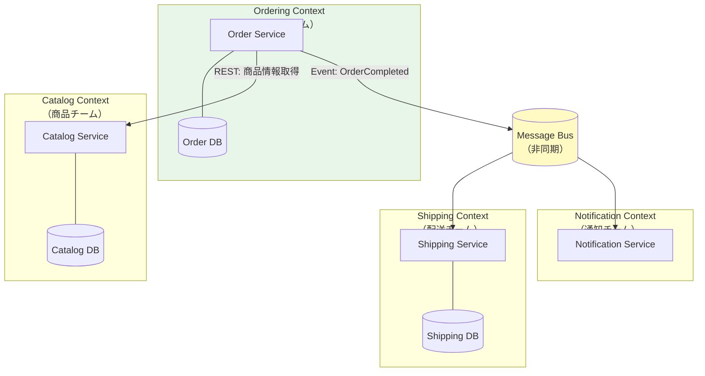

## Bounded Context ≈ Microservice

「どこでマイクロサービスを分割するか」——これはマイクロサービス移行で最も難しい問いです。DDDはその答えを持っています。**Bounded Context**の境界が、そのままマイクロサービスの境界になります。

一つのBounded Context内では、用語（Ubiquitous Language）が一貫しており、チームとモデルが整合しています。この境界をサービスの境界にすることで、サービスが「何に責任を持つか」が明確になります。

---

## コンウェイの法則との関係

メルヴィン・コンウェイは1968年に「システムのアーキテクチャは、それを設計した組織の構造を模倣する」と述べました。マイクロサービスの境界をBounded Contextに合わせるということは、**チームの境界もBounded Contextに合わせる**ということを意味します。OrderingチームはOrdering Contextを、ShippingチームはShipping Contextを所有します。



---

## サービス間通信：同期 vs 非同期

同期通信（REST/gRPC）は「即座に結果が必要」な場合に使います。商品情報の参照、在庫確認など。しかし強結合を生む危険があります。一方のサービスがダウンすると、呼び出し元も失敗します。

非同期通信（メッセージキュー・イベント）は「別サービスへの通知」に使います。「注文が完了した」というイベントをPublishするだけで、ShippingサービスやNotificationサービスは独立して反応します。この疎結合こそがマイクロサービスの真価です。

---

## Sagaパターン（分散トランザクション）

マイクロサービス間には共有DBがないため、複数サービスにまたがるトランザクションが難しくなります。Sagaパターンはこれを解決します。各ステップが成功か失敗かに応じて、次のコマンドまたは補償トランザクション（ロールバック相当）を実行します。

```csharp
// Choreography Sagaの例（イベント駆動）
// OrderService → イベント発行
public class Order
{
    public void Complete()
    {
        // Sagaの最初のステップ: 注文完了イベントを発行
        RaiseEvent(new OrderCompletedEvent(Id, CustomerId, Items));
    }
}

// PaymentService → OrderCompletedEventを受信して決済
public class PaymentSagaHandler
{
    public async Task Handle(OrderCompletedEvent @event)
    {
        var result = await _paymentGateway.Charge(@event.CustomerId, @event.TotalAmount);

        if (result.IsSuccess)
            await _bus.Publish(new PaymentProcessedEvent(@event.OrderId));
        else
            // 補償トランザクション: 注文をキャンセルに戻す
            await _bus.Publish(new PaymentFailedEvent(@event.OrderId, result.Reason));
    }
}

// ShippingService → PaymentProcessedEventを受信して出荷指示
public class ShippingSagaHandler
{
    public async Task Handle(PaymentProcessedEvent @event)
    {
        var shipment = Shipment.Schedule(@event.OrderId);
        await _shipmentRepo.Save(shipment);
        await _bus.Publish(new ShipmentScheduledEvent(@event.OrderId));
    }
}
```

---

## DDDなしのマイクロサービスは分散モノリス

よくある失敗パターンが「分散モノリス」です。マイクロサービスに分割したように見えながら、実はサービス間が密に結合している状態です。典型的な症状は「サービスAを変更すると、サービスBとCも同時に変更が必要になる」という状況です。これはBounded Contextの境界を正しく引けていない証拠です。

---

## いつモノリス、いつマイクロサービスか

```csharp
// 判断基準をコメントで表現

// ✅ モノリスが適切なケース
// - チームが3〜5人以下
// - ドメインがまだ十分に理解されていない（Bounded Contextが不明確）
// - 「Modular Monolith」として始め、境界を模索する
// → DDDのBounded Contextをモジュールとして実装し、API境界はない状態

// ✅ マイクロサービスが適切なケース
// - 異なるチームが独立してデプロイする必要がある
// - スケール要件が大きく異なるサービスが存在する
// - ドメインが十分に成熟し、Bounded Contextの境界が安定している
// → 「まずモノリスで作り、境界が見えてから分割」がベストプラクティス
```

---

> **専門家の視点**
>
> Sam Newmanは「Build Microservices」の中で「まずモノリスで始めよ」と述べています。ドメインが十分に理解されていない段階でマイクロサービスに分割すると、境界を間違えた場合のコストが爆発的に大きくなります。DDDのEvent Stormingを先に行い、Bounded Contextの境界が明確になってからサービス分割を検討することを強く推奨します。Bounded Contextの数がそのままマイクロサービスの数の目安になります。コンウェイの法則は現実です——チームを先に整理してから、サービスを分割してください。

---

## まとめ

DDDのBounded ContextはマイクロサービスのService境界と自然に対応します。コンウェイの法則を逆用し、チーム構造とサービス境界を一致させることで、組織とシステムが整合します。サービス間通信は可能な限り非同期（イベント駆動）を選び、分散トランザクションにはSagaパターンを活用します。そして何よりも、「モノリスファースト」で始め、ドメインが成熟したタイミングで段階的に分割することが成功への道です。
