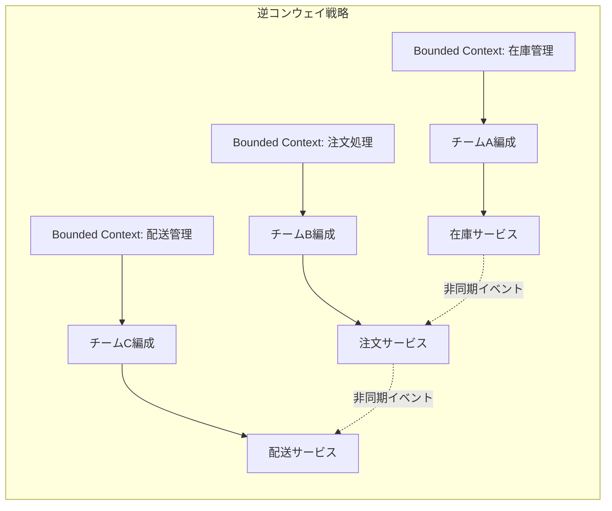
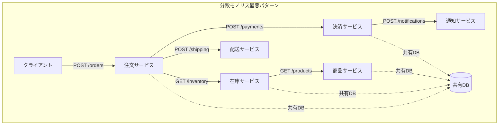
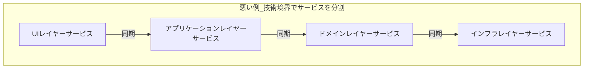
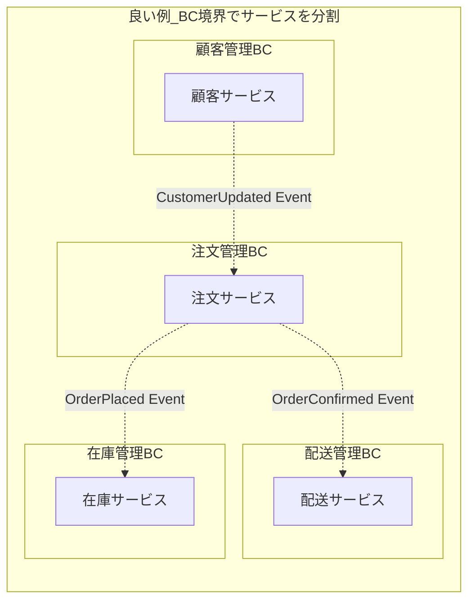
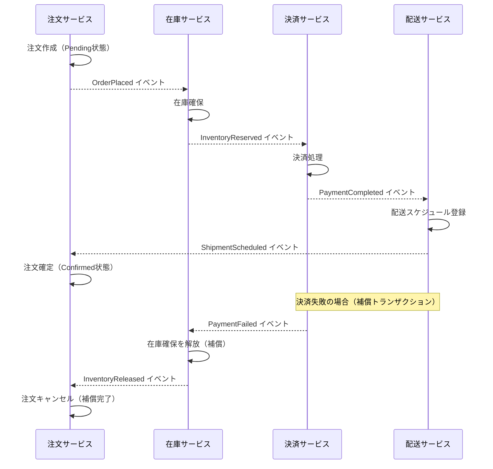
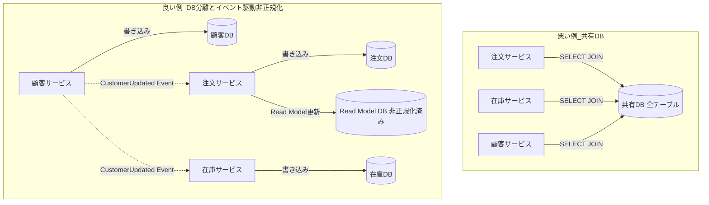
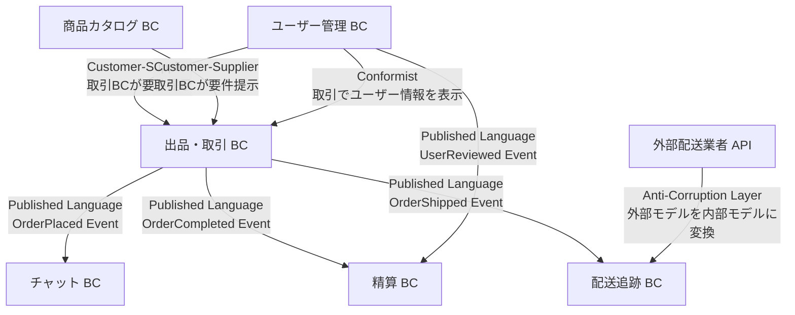

# 第19章: DDD × マイクロサービス

---

## 0. TL;DR（3行）

マイクロサービスの境界は Bounded Context が決めます。チームの認知負荷と組織構造を先に設計し、コンウェイの法則を意図的に活用することで、アーキテクチャは自然にサービス境界と一致します。サービスを分割する前に必ずモジュラーモノリスで Bounded Context を確立し、スケール・チームサイズ・リリース頻度の3条件を満たしてから初めて分割を検討してください。

---

## 1. マイクロサービスと DDD の関係

### コンウェイの法則（Conway's Law）とは

1968年、Melvin Conway はシステム設計についての論文でこう述べました。

> 「システムを設計する組織は、その組織のコミュニケーション構造を模したシステムを生み出す宿命にある。」

これがコンウェイの法則です。この法則は「気をつけよう」という教訓ではありません。むしろ、重力のような不変の自然法則です。チームの境界は、意図せずともシステムのモジュール境界になります。チーム間のコミュニケーションが増えれば増えるほど、その間の結合度は高まります。逆に、チームが明確に分かれていれば、そのシステムも自然と分離されていきます。

マイクロサービスにおいて、コンウェイの法則は特に重要な意味を持ちます。組織を先に設計せず、技術的な分割だけ行った場合、何が起きるでしょうか。データモデルはサービス間で共有され、API が密結合になり、最終的に「分散モノリス」が誕生します。分散モノリスとは、モノリスのデプロイ複雑性を残しつつ、分散システムの複雑性まで加わった最悪の状態です。

**逆コンウェイ戦略（Inverse Conway Maneuver）**とは、この法則を逆用するアプローチです。欲しいアーキテクチャを先に決め、そのアーキテクチャに合った組織構造を設計します。具体的には次の手順を踏みます。

1. ビジネスドメインを Bounded Context に分解する（DDD の戦略的設計）
2. 各 Bounded Context に対応したチームを編成する
3. チーム間の API 境界を明確に定義する
4. 各チームに完全な開発・デプロイ・運用の自律性を与える

チームが独立して意思決定できる範囲こそが、サービスの自律性の範囲です。この原則を忘れた設計は、いくら技術的に美しくても実用上失敗します。



### 「1Bounded Context = 1マイクロサービス」は正しいか

多くの書籍やブログ記事が「1つの Bounded Context は1つのマイクロサービスに対応する」と説明しています。しかし、これは正確ではありません。より正確な関係性は次の通りです。

**正しいマッピング**:
- 1つのマイクロサービスは、1つの Bounded Context（またはそのサブセット）を実装する
- 1つの Bounded Context を複数のマイクロサービスに分割してはいけない
- ただし、複数の小さな Bounded Context を1つのサービスにまとめることは許容される（条件付き）

「1BC = 1サービス」が正しくない理由は、Bounded Context はビジネスドメインの概念的な境界であり、サービスはデプロイと運用の単位だからです。この2つは直交する概念です。

たとえば、EC サイトの「商品カタログ」Bounded Context を考えます。このコンテキストには商品マスタ、カテゴリ管理、価格管理、在庫数の参照（注意: 在庫管理 BC の読み取り専用コピー）が含まれています。この BC は1つのサービスとして実装することが自然です。しかし、将来的に価格管理だけ独立したチームが担当することになった場合、価格管理を別サービスに分割する必要が出るかもしれません。その時点で「商品カタログ」BC は2つのサービスにまたがってしまうように見えますが、実際には価格管理はサブドメインとして分離され、独自の Bounded Context（「価格決定コンテキスト」）となるのが正解です。

**分割の判断軸**は次の3つです。
1. **チームの独立性**: 別々のチームが別々のペースでリリースする必要があるか
2. **スケール要件**: 特定の機能だけ高負荷で、独立してスケールする必要があるか
3. **技術スタックの差異**: 特定の機能だけ別の言語・DB が最適か

この3条件のどれも当てはまらない場合、分割は複雑性を増やすだけです。

### なぜ DDD 設計前にマイクロサービスに分割するのが危険か

「最初からマイクロサービスで作ろう」という誘惑は非常に強力です。しかし、DDD の戦略的設計（Bounded Context の特定）を行う前に分割を行うと、深刻な問題が発生します。

**分散モノリスの誕生**: Bounded Context を定義していない状態でサービスを分割すると、サービス境界はビジネスの境界と一致しません。結果として、1つのビジネス操作（例: 注文確定）が5つのサービスに同期 HTTP 呼び出しを連鎖させる「分散モノリス」が生まれます。

分散モノリスの特徴は次の通りです。
- デプロイに全サービスの協調が必要（独立デプロイの失敗）
- サービス間の DB スキーマが共有されていたり、API が密結合していたりする
- 1つのサービスが落ちると連鎖障害が起きる
- テストに全サービスの起動が必要



**知識なき分割のリスク**: ドメインの深い理解なしに分割すると、「本当の境界」がわからないため、後から修正するコストが極めて高くなります。マイクロサービスのリファクタリングは、モノリスのリファクタリングよりも何倍も困難です。サービス間の契約（API）を変更するには、複数チームの協調と段階的な移行が必要です。

### モジュラーモノリス → マイクロサービスの段階的移行

Sam Newman（「Building Microservices」著者）が推奨するアプローチは、**モジュラーモノリスを経由した段階的移行**です。

**Stage 1: モジュラーモノリスの構築**

まず、モノリスの中で Bounded Context を明確に分離します。各モジュールは：
- 独自の名前空間（C# なら namespace）を持つ
- 他モジュールの内部型を参照しない（internal modifier で制御）
- モジュール間の通信はインターフェース経由のみ

この段階では、同一プロセス・同一 DB ですが、コードレベルでの境界は明確です。

**Stage 2: DB の分離**

次に、共有 DB を分離します。各 Bounded Context が自分のスキーマ（または DB インスタンス）を持ちます。この段階で「テーブル結合ができなくなる」という痛みを経験します。この痛みは、設計上の問題を早期に発見する貴重なフィードバックです。

**Stage 3: 非同期通信の導入**

DB が分離できたら、モジュール間の通信をイベントベースに移行します。同一プロセスでも、将来的な分散化を見越してメッセージバスを経由した通信にします。

**Stage 4: サービスとしての切り出し**

チームサイズ・リリース頻度・スケール要件の条件が揃ったモジュールから、独立したサービスとして切り出します。この時点ですでに境界とイベント定義は確立されているため、移行コストは最小化されています。

---

## 2. Bounded Context とマイクロサービスの境界

### BC の境界がサービス境界を決める（Context Map の活用）

DDD の Context Map は、Bounded Context 間の関係を視覚化するツールです。マイクロサービス設計において、Context Map は「どのサービスがどう通信すべきか」を決定するための必須の出発点です。

Context Map には次のパターンがあります。

| パターン | 意味 | サービス間通信への影響 |
|---------|------|-------------------|
| **Partnership** | 2つの BC が協調して進化する | 密接な API 設計が必要。同じチームが望ましい |
| **Shared Kernel** | BC が一部のモデルを共有する | 共有ライブラリで管理。変更は両者の合意が必要 |
| **Customer/Supplier** | 下流が上流に要件を提示できる | 上流サービスが下流のニーズを優先する |
| **Conformist** | 下流が上流のモデルに従う | Anti-Corruption Layer なしで受け入れる |
| **Anti-Corruption Layer** | 下流が上流のモデルを変換する | ACL を実装してモデルを保護する |
| **Open Host Service** | 上流が公開プロトコルを提供する | REST/gRPC の公式 API として設計する |
| **Published Language** | 共通の言語を定義する | OpenAPI や Protocol Buffers で形式化する |
| **Separate Ways** | 統合せずそれぞれ独立する | サービス間通信なし |

Context Map を作成すると、どの BC 間に強い依存があり、どの BC が独立できるかが明確になります。強い依存関係にある BC は、同一チームが担当するか、同一サービスにまとめることを検討します。

### 同じ BC を複数サービスに分割してはいけない理由

1つの Bounded Context を複数のサービスに分割すると、Ubiquitous Language（ユビキタス言語）が破壊されます。

例として「注文管理」Bounded Context を考えます。この BC の Ubiquitous Language には「注文」「注文明細」「顧客」「配送先」「合計金額」「注文状態」といった概念が含まれています。これらは同じ言語の中で意味が定義されており、互いに整合しています。

この BC を「注文ヘッダーサービス」と「注文明細サービス」に分割した場合、何が起きるでしょうか。

- 「注文」という概念がサービスをまたいで分裂する
- 注文の状態変更が2つのサービスにまたがる
- 合計金額の計算が分散する（どちらが正とするか不明）
- 結果整合性の問題が BC 内部に持ち込まれる

BC 内部は強い整合性（ACID）を維持すべき範囲です。その範囲に分散システムの複雑性を持ち込むことは、ドメインモデルの整合性を根本から破壊します。

### 複数 BC を1サービスにまとめることが許容されるケース

初期フェーズや小規模チームでは、複数の Bounded Context を1つのサービスにまとめることが合理的な選択です。許容される条件を示します。

**許容条件**:
1. **チームサイズ**: 同一チーム（2〜5人）が両方の BC を担当している
2. **リリース頻度**: 両方の BC のリリースサイクルが同じ
3. **スケール要件**: 両方の BC のトラフィックパターンが同じ
4. **技術スタック**: 同じ技術スタックで実装できる

ただし、この場合でも**コードレベルの分離は必須**です。名前空間・モジュール・データスキーマは BC ごとに分離します。これにより、将来的な分割コストを最小化できます。

### BC とサービス境界の良い例・悪い例





---

## 3. サービス間通信の設計パターン

### 同期通信（REST / gRPC）: いつ使うか・危険なケース

同期通信は、呼び出し側が結果を待ち続ける通信方式です。REST（HTTP）と gRPC（HTTP/2 + Protocol Buffers）が代表的です。

**同期通信を使うべき場面**:
- クライアントがレスポンスを即座に必要とする（例: 商品詳細の表示）
- 処理結果の成否をリアルタイムで知る必要がある（例: 決済処理の結果）
- データの一貫性が重要で、非同期の結果整合性を受け入れられない場面

**同期通信の危険なケース: 同期連鎖（Synchronous Call Chain）**

サービス A が B を呼び、B が C を呼び、C が D を呼ぶというチェーンが発生した場合、全体の可用性は各サービスの可用性の積になります。

例: サービスA(99.9%) × B(99.9%) × C(99.9%) × D(99.9%) = 99.6%

さらに、レイテンシも加算されます。各サービスが 50ms であれば、4段階のチェーンで 200ms になります。D がタイムアウトした場合、C も待機し、B も待機し、A のリクエストがすべてスタックします。スレッドプールが枯渇し、カスケード障害が発生します。

**gRPC vs REST の選択**:
- gRPC: サービス間通信（S2S）、高スループット、型安全性が重要な場合
- REST: パブリック API、ブラウザからのアクセス、シンプルな CRUD

### 非同期通信（Message Bus）: RabbitMQ / Kafka の使い分け

**RabbitMQ**（AMQP プロトコル）:
- メッセージを永続化して確実に届ける「キュー」が主目的
- メッセージ数が比較的少ない（数千万/日程度）
- 複雑なルーティング（Exchange パターン）が必要な場合
- メッセージは消費後に削除される（ストリームではなくキュー）

**Apache Kafka**（Event Streaming Platform）:
- 大量のイベントをストリームとして保持（数十億/日）
- メッセージを時系列で保持し、再生（リプレイ）が可能
- 複数の Consumer が同じイベントを独立して処理する（Consumer Group）
- Event Sourcing のイベントストアとして利用可能

一般的には、**RabbitMQ はコマンドとジョブ、Kafka はイベントストリーム**に向いています。マイクロサービスの Integration Event を流す場合は、再生可能な Kafka が有利です。ただし、小規模システムでは Kafka の運用コストが高いため、RabbitMQ から始めることを推奨します。

### Integration Event の設計（Domain Event との明確な区別）

**Domain Event（ドメインイベント）**は、Bounded Context 内部の出来事を表します。

```csharp
// Domain Event - BC内部のみ
public sealed record OrderPlacedDomainEvent(
    OrderId OrderId,
    CustomerId CustomerId,
    IReadOnlyList<OrderItem> Items,
    Money TotalAmount,
    DateTime OccurredAt
) : IDomainEvent;
```

**Integration Event（統合イベント）**は、BC 間をまたいで公開されるイベントです。Domain Event とは**明確に別の型**として定義します。

```csharp
// Integration Event - BC間の契約
public sealed record OrderPlacedIntegrationEvent(
    Guid EventId,
    Guid OrderId,
    Guid CustomerId,
    IReadOnlyList<OrderLineDto> Lines,
    decimal TotalAmount,
    string Currency,
    DateTime PlacedAt
) : IIntegrationEvent;
```

なぜ別々にするのか。Domain Event は BC 内部の rich model（Value Object、Entity）を使えますが、Integration Event はそれが使えません。Integration Event は公開 API の契約であり、すべての Consumer が理解できるプリミティブ型または DTO である必要があります。また、Integration Event はバージョニングが必要です（後方互換性の維持）。

### べき等性（Idempotency）の実装（Outbox パターンと Inbox パターン）

**Outbox パターン**: メッセージの「少なくとも1回の配信」を保証するパターンです。

DB への書き込みとメッセージの発行を同一トランザクションで行うことで、「DB には書けたがメッセージは送れなかった」「メッセージは送れたが DB への書き込みが失敗した」という不整合を防ぎます。

仕組み:
1. ドメインロジックを実行して DB を更新する（同一トランザクション内で outbox テーブルにもレコードを書く）
2. バックグラウンドプロセスが outbox テーブルを監視し、未送信のメッセージをメッセージバスに発行する
3. 発行成功後、outbox のレコードを「送信済み」としてマーク

**Inbox パターン**: Consumer 側でメッセージの重複処理を防ぐパターンです。

同じメッセージが2回届いた場合でも、1回しか処理しないことを保証します。

仕組み:
1. メッセージを受信したら、まず inbox テーブルに EventId を記録する（一意制約付き）
2. 既に処理済みの EventId なら処理をスキップする
3. 新しい EventId なら処理を実行し、inbox にステータスを記録する

### C#: Integration Event + MassTransit 完全実装

```csharp
// =====================================================================
// Integration Events の定義
// =====================================================================

namespace OrderService.Contracts.IntegrationEvents;

public interface IIntegrationEvent
{
    Guid EventId { get; }
    DateTime OccurredAt { get; }
    int Version { get; }
}

public sealed record OrderPlacedIntegrationEvent : IIntegrationEvent
{
    public Guid EventId { get; init; } = Guid.NewGuid();
    public DateTime OccurredAt { get; init; } = DateTime.UtcNow;
    public int Version { get; init; } = 1;

    public required Guid OrderId { get; init; }
    public required Guid CustomerId { get; init; }
    public required IReadOnlyList<OrderLineDto> Lines { get; init; }
    public required decimal TotalAmount { get; init; }
    public required string Currency { get; init; }
    public required string ShippingAddress { get; init; }
}

public sealed record OrderLineDto
{
    public required Guid ProductId { get; init; }
    public required string ProductName { get; init; }
    public required int Quantity { get; init; }
    public required decimal UnitPrice { get; init; }
}

// =====================================================================
// Outbox Entity（送信待ちメッセージの永続化）
// =====================================================================

namespace OrderService.Infrastructure.Outbox;

public sealed class OutboxMessage
{
    public Guid Id { get; private set; } = Guid.NewGuid();
    public string EventType { get; private set; } = default!;
    public string EventPayload { get; private set; } = default!;
    public DateTime CreatedAt { get; private set; } = DateTime.UtcNow;
    public DateTime? ProcessedAt { get; private set; }
    public int RetryCount { get; private set; }
    public string? Error { get; private set; }

    private OutboxMessage() { }

    public static OutboxMessage Create(IIntegrationEvent @event)
    {
        return new OutboxMessage
        {
            EventType = @event.GetType().AssemblyQualifiedName!,
            EventPayload = System.Text.Json.JsonSerializer.Serialize(
                @event,
                @event.GetType(),
                new System.Text.Json.JsonSerializerOptions { WriteIndented = false })
        };
    }

    public void MarkAsProcessed() => ProcessedAt = DateTime.UtcNow;

    public void RecordFailure(string error)
    {
        RetryCount++;
        Error = error;
    }
}

// =====================================================================
// Outbox Publisher（バックグラウンドサービス）
// =====================================================================

namespace OrderService.Infrastructure.Outbox;

using MassTransit;
using Microsoft.EntityFrameworkCore;
using Microsoft.Extensions.DependencyInjection;
using Microsoft.Extensions.Hosting;
using Microsoft.Extensions.Logging;

public sealed class OutboxPublisher : BackgroundService
{
    private static readonly TimeSpan PollingInterval = TimeSpan.FromSeconds(5);
    private readonly IServiceScopeFactory _scopeFactory;
    private readonly ILogger<OutboxPublisher> _logger;

    public OutboxPublisher(
        IServiceScopeFactory scopeFactory,
        ILogger<OutboxPublisher> logger)
    {
        _scopeFactory = scopeFactory;
        _logger = logger;
    }

    protected override async Task ExecuteAsync(CancellationToken stoppingToken)
    {
        while (!stoppingToken.IsCancellationRequested)
        {
            try
            {
                await ProcessPendingMessagesAsync(stoppingToken);
            }
            catch (Exception ex)
            {
                _logger.LogError(ex, "Outbox processing failed.");
            }

            await Task.Delay(PollingInterval, stoppingToken);
        }
    }

    private async Task ProcessPendingMessagesAsync(CancellationToken ct)
    {
        await using var scope = _scopeFactory.CreateAsyncScope();
        var db = scope.ServiceProvider.GetRequiredService<OrderDbContext>();
        var publishEndpoint = scope.ServiceProvider
            .GetRequiredService<IPublishEndpoint>();

        // 未処理かつリトライ上限未満のメッセージを100件取得
        var pending = await db.OutboxMessages
            .Where(m => m.ProcessedAt == null && m.RetryCount < 5)
            .OrderBy(m => m.CreatedAt)
            .Take(100)
            .ToListAsync(ct);

        foreach (var message in pending)
        {
            try
            {
                var eventType = Type.GetType(message.EventType)
                    ?? throw new InvalidOperationException(
                        $"Type not found: {message.EventType}");

                var @event = System.Text.Json.JsonSerializer.Deserialize(
                    message.EventPayload,
                    eventType)
                    ?? throw new InvalidOperationException("Deserialization failed.");

                await publishEndpoint.Publish(@event, eventType, ct);

                message.MarkAsProcessed();
                _logger.LogInformation(
                    "Published integration event {EventType} {EventId}",
                    eventType.Name,
                    message.Id);
            }
            catch (Exception ex)
            {
                message.RecordFailure(ex.Message);
                _logger.LogWarning(ex,
                    "Failed to publish outbox message {MessageId}", message.Id);
            }
        }

        await db.SaveChangesAsync(ct);
    }
}

// =====================================================================
// Inbox Consumer（Consumer側のべき等性保証）
// =====================================================================

namespace InventoryService.Infrastructure.Consumers;

using MassTransit;
using Microsoft.EntityFrameworkCore;
using OrderService.Contracts.IntegrationEvents;

public sealed class OrderPlacedConsumer : IConsumer<OrderPlacedIntegrationEvent>
{
    private readonly InventoryDbContext _db;
    private readonly ILogger<OrderPlacedConsumer> _logger;

    public OrderPlacedConsumer(
        InventoryDbContext db,
        ILogger<OrderPlacedConsumer> logger)
    {
        _db = db;
        _logger = logger;
    }

    public async Task Consume(ConsumeContext<OrderPlacedIntegrationEvent> context)
    {
        var eventId = context.Message.EventId;

        // べき等性チェック（Inboxパターン）
        var alreadyProcessed = await _db.InboxMessages
            .AnyAsync(m => m.EventId == eventId, context.CancellationToken);

        if (alreadyProcessed)
        {
            _logger.LogInformation("Skipping duplicate event {EventId}", eventId);
            return;
        }

        // ビジネスロジックの実行（在庫確保）
        foreach (var line in context.Message.Lines)
        {
            var inventory = await _db.Inventories
                .FirstOrDefaultAsync(
                    i => i.ProductId == line.ProductId,
                    context.CancellationToken)
                ?? throw new InvalidOperationException(
                    $"Inventory not found for product {line.ProductId}");

            inventory.Reserve(line.Quantity);
        }

        // 処理済みとしてInboxに記録（一意制約で重複防止）
        _db.InboxMessages.Add(new InboxMessage
        {
            EventId = eventId,
            EventType = nameof(OrderPlacedIntegrationEvent),
            ProcessedAt = DateTime.UtcNow
        });

        await _db.SaveChangesAsync(context.CancellationToken);

        _logger.LogInformation(
            "Processed OrderPlaced event {EventId}", eventId);
    }
}

// =====================================================================
// MassTransit 設定（各サービスの Program.cs）
// =====================================================================

// ---- 注文サービス側 ----
builder.Services.AddMassTransit(x =>
{
    x.UsingRabbitMq((context, cfg) =>
    {
        cfg.Host("rabbitmq://localhost", h =>
        {
            h.Username("guest");
            h.Password("guest");
        });
        cfg.ConfigureEndpoints(context);
    });
});

// ---- 在庫サービス側 ----
builder.Services.AddMassTransit(x =>
{
    x.AddConsumer<OrderPlacedConsumer>();

    x.UsingRabbitMq((context, cfg) =>
    {
        cfg.Host("rabbitmq://localhost", h =>
        {
            h.Username("guest");
            h.Password("guest");
        });

        cfg.ReceiveEndpoint("inventory-order-placed", e =>
        {
            e.ConfigureConsumer<OrderPlacedConsumer>(context);
            // 指数バックオフでリトライ（同一間隔の無限リトライは禁止）
            e.UseMessageRetry(r =>
            {
                r.Exponential(
                    retryLimit: 5,
                    minInterval: TimeSpan.FromSeconds(1),
                    maxInterval: TimeSpan.FromSeconds(30),
                    intervalDelta: TimeSpan.FromSeconds(2));
            });
        });
    });
});
```

---

## 4. サービス間のデータ整合性

### 結果整合性の受け入れ（BASE vs ACID の使い分け）

**ACID**（Atomicity, Consistency, Isolation, Durability）は、単一サービス内・単一 DB 内での強い整合性保証です。同一 Bounded Context 内のトランザクションはこれを維持すべきです。

**BASE**（Basically Available, Soft state, Eventually consistent）は、分散システムにおける緩やかな整合性モデルです。「今この瞬間は不整合でも、最終的には整合する」という考え方です。

マイクロサービスでは、**BC 内は ACID、BC 間は BASE**という原則が基本です。

結果整合性を受け入れる際に重要なのは、「どれくらいの時間、どれくらいの不整合を許容できるか」をビジネス担当者と合意することです。技術者が独断で「数秒の遅延は問題ない」と決めてはいけません。

### Saga パターンによる分散トランザクション（Choreography vs Orchestration）

複数のサービスにまたがるビジネストランザクションを、2フェーズコミット（2PC）なしに完了させるパターンです。

**Choreography（コレオグラフィ）**:
各サービスが自律的にイベントを受け取り、処理し、次のイベントを発行します。中央制御なし。

特徴:
- サービス間が疎結合
- 中央のオーケストレーターが存在しない（SPOF がない）
- 処理の全体フローが把握しにくい（各サービスのコードを見ないとわからない）
- デバッグが困難

**Orchestration（オーケストレーション）**:
オーケストレーター（Saga コーディネーター）が各サービスを順次・条件分岐しながら呼び出します。

特徴:
- 全体フローが一箇所（オーケストレーター）で把握できる
- デバッグが容易
- オーケストレーターが SPOF になる
- オーケストレーターが複数サービスの知識を持つため結合度が上がる

**補償トランザクション（Compensating Transaction）**:
Saga の途中で失敗した場合、既に完了したステップを「元に戻す」補償処理を実行します。これは SQL のロールバックとは異なり、新たなビジネス操作（例: 「注文キャンセルイベントの発行」）として実装します。



### API Composition パターン（複数サービスのデータ結合）

複数のサービスにまたがるデータを1つのレスポンスとして返す必要がある場合、API Gateway または BFF（Backend for Frontend）が各サービスからデータを集約して返します。

### C#: API Composition QueryHandler の実装

```csharp
namespace OrderManagement.Application.Queries;

// 注文・顧客・配送状況を1つのDTOに集約するクエリ

public sealed record GetOrderDashboardQuery(Guid OrderId)
    : IQuery<OrderDashboardDto>;

public sealed record OrderDashboardDto
{
    public required Guid OrderId { get; init; }
    public required string OrderStatus { get; init; }
    public required CustomerSummaryDto Customer { get; init; }
    public required IReadOnlyList<OrderLineSummaryDto> Lines { get; init; }
    public required ShipmentStatusDto? Shipment { get; init; }
    public required decimal TotalAmount { get; init; }
}

public sealed record CustomerSummaryDto(
    Guid CustomerId, string Name, string Email);

public sealed record OrderLineSummaryDto(
    Guid ProductId, string ProductName, int Qty, decimal Price);

public sealed record ShipmentStatusDto(
    string TrackingNumber, string Status, DateTime? EstimatedDelivery);

// API Composition Handler（並列取得で最速化）
public sealed class GetOrderDashboardQueryHandler
    : IQueryHandler<GetOrderDashboardQuery, OrderDashboardDto>
{
    private readonly IOrderReadRepository _orderRepo;
    private readonly ICustomerServiceClient _customerClient;
    private readonly IShipmentServiceClient _shipmentClient;
    private readonly ILogger<GetOrderDashboardQueryHandler> _logger;

    public GetOrderDashboardQueryHandler(
        IOrderReadRepository orderRepo,
        ICustomerServiceClient customerClient,
        IShipmentServiceClient shipmentClient,
        ILogger<GetOrderDashboardQueryHandler> logger)
    {
        _orderRepo = orderRepo;
        _customerClient = customerClient;
        _shipmentClient = shipmentClient;
        _logger = logger;
    }

    public async Task<OrderDashboardDto> Handle(
        GetOrderDashboardQuery query,
        CancellationToken ct)
    {
        // まず注文を取得（顧客IDと注文IDが必要）
        var order = await _orderRepo.FindByIdAsync(query.OrderId, ct)
            ?? throw new OrderNotFoundException(query.OrderId);

        // 顧客情報と配送状況は並列取得（互いに依存がない）
        var customerTask = _customerClient
            .GetCustomerSummaryAsync(order.CustomerId, ct);
        var shipmentTask = _shipmentClient
            .GetShipmentByOrderIdAsync(order.Id, ct);

        await Task.WhenAll(customerTask, shipmentTask);

        var customer = await customerTask;
        var shipment = await shipmentTask; // null許容（未配送の可能性）

        return new OrderDashboardDto
        {
            OrderId = order.Id,
            OrderStatus = order.Status.ToString(),
            Customer = customer is not null
                ? new CustomerSummaryDto(customer.Id, customer.Name, customer.Email)
                : new CustomerSummaryDto(order.CustomerId, "不明", ""),
            Lines = order.Lines
                .Select(l => new OrderLineSummaryDto(
                    l.ProductId, l.ProductName, l.Quantity, l.UnitPrice))
                .ToList(),
            Shipment = shipment is not null
                ? new ShipmentStatusDto(
                    shipment.TrackingNumber,
                    shipment.Status,
                    shipment.EstimatedDelivery)
                : null,
            TotalAmount = order.TotalAmount
        };
    }
}

// 外部サービスクライアントのインターフェース
public interface ICustomerServiceClient
{
    Task<CustomerDto?> GetCustomerSummaryAsync(
        Guid customerId, CancellationToken ct);
}

public interface IShipmentServiceClient
{
    Task<ShipmentDto?> GetShipmentByOrderIdAsync(
        Guid orderId, CancellationToken ct);
}
```

---

## 5. 共有データベースの禁止

### なぜサービス間でDBを共有してはいけないか

共有データベースはマイクロサービスアーキテクチャにおける最も致命的なアンチパターンです。その理由を3つの観点から説明します。

**1. 結合度の問題**

DB を共有するということは、テーブルスキーマを共有するということです。スキーマを変更するには、そのテーブルを参照するすべてのサービスの協調が必要になります。「独立したデプロイ」という目標は根本から失われます。

**2. デプロイ独立性の喪失**

サービス A がスキーマを変更したい場合、サービス B が対応できるまで待たなければなりません。結果として、すべてのサービスのリリースが同期されてしまい、モノリスと同じデプロイ課題が残ります。

**3. スキーマ変更の困難さ**

「このカラムを参照しているのはどのサービスか？」が管理できなくなります。カラムを削除すると、どこかのサービスが壊れます。追加しても、どのサービスが対応済みかが追跡できません。

### テーブル結合が必要な場合の代替手段



**イベント駆動の非正規化（Event-driven Denormalization）**:

顧客サービスが `CustomerNameUpdated` イベントを発行すると、注文サービスがそれを受け取り、自分の Read Model に顧客名をコピーします。これにより、注文の一覧表示で顧客名を表示する際に、顧客サービスへの問い合わせが不要になります。

トレードオフ: 顧客名の変更が注文サービスの Read Model に反映されるまでに数秒のラグがある（結果整合性）。しかし多くのビジネスシナリオでは、このラグは許容可能です。

---

## 6. サービスメッシュと認証

### Service-to-Service 認証（mTLS / JWT）

**mTLS（相互TLS）**:
クライアントもサーバーも証明書を持ち、双方の正当性を検証します。PKI（Public Key Infrastructure）ベースの認証で、証明書の管理が必要ですが、最も強力なセキュリティを提供します。Istio や Linkerd などのサービスメッシュを使用すると、mTLS の設定がサイドカープロキシで自動化されます。

**JWT（JSON Web Token）**:
ユーザーの認証情報を含む署名済みトークンです。サービス間では、元のユーザーリクエストの JWT をそのまま伝播（propagation）する方法と、サービス固有のサービスアカウントトークンを使う方法があります。

### サービスメッシュ（Istio / Linkerd）の役割

サービスメッシュは、サービス間通信の横断的関心事（cross-cutting concerns）をアプリケーションコードから分離するインフラ層です。

| 機能 | 詳細 |
|------|------|
| **mTLS** | サービス間の全通信を自動で暗号化・認証 |
| **Circuit Breaker** | 障害サービスへの呼び出しを自動で遮断 |
| **Retry** | 失敗した呼び出しを自動でリトライ |
| **Load Balancing** | ヘルスチェックベースの動的ロードバランシング |
| **Observability** | 全通信のメトリクス・トレース・ログを自動収集 |
| **Traffic Management** | カナリアデプロイ・A/Bテストのトラフィック分割 |

アプリケーションコードは「ビジネスロジック」だけに集中でき、リトライ・タイムアウト・サーキットブレーカーはメッシュが面倒を見ます。

### C#: JWT Propagation の実装例

```csharp
// =====================================================================
// JWT Propagation Middleware
// =====================================================================

namespace ApiGateway.Infrastructure.Middleware;

public sealed class JwtPropagationMiddleware
{
    private readonly RequestDelegate _next;
    private const string AuthorizationHeader = "Authorization";

    public JwtPropagationMiddleware(RequestDelegate next) => _next = next;

    public async Task InvokeAsync(HttpContext context)
    {
        if (context.Request.Headers.TryGetValue(
            AuthorizationHeader, out var authHeader))
        {
            context.Items["jwt_token"] = authHeader.ToString();
        }

        await _next(context);
    }
}

// =====================================================================
// Typed HttpClient with JWT Propagation + Polly
// =====================================================================

namespace OrderService.Infrastructure.HttpClients;

using System.Net.Http.Headers;
using Polly;
using Polly.Extensions.Http;

public sealed class CustomerServiceHttpClient : ICustomerServiceClient
{
    private readonly HttpClient _httpClient;
    private readonly IHttpContextAccessor _httpContextAccessor;
    private readonly ILogger<CustomerServiceHttpClient> _logger;

    public CustomerServiceHttpClient(
        HttpClient httpClient,
        IHttpContextAccessor httpContextAccessor,
        ILogger<CustomerServiceHttpClient> logger)
    {
        _httpClient = httpClient;
        _httpContextAccessor = httpContextAccessor;
        _logger = logger;
    }

    public async Task<CustomerDto?> GetCustomerSummaryAsync(
        Guid customerId, CancellationToken ct)
    {
        // 上流の JWT をダウンストリームに伝播
        var jwtToken = _httpContextAccessor.HttpContext?
            .Items["jwt_token"]?.ToString();

        if (!string.IsNullOrEmpty(jwtToken))
        {
            _httpClient.DefaultRequestHeaders.Authorization =
                AuthenticationHeaderValue.Parse(jwtToken);
        }

        try
        {
            var response = await _httpClient
                .GetAsync($"api/customers/{customerId}/summary", ct);

            if (response.StatusCode == System.Net.HttpStatusCode.NotFound)
                return null;

            response.EnsureSuccessStatusCode();

            return await response.Content
                .ReadFromJsonAsync<CustomerDto>(cancellationToken: ct);
        }
        catch (HttpRequestException ex)
        {
            _logger.LogError(ex,
                "Failed to call customer service for {CustomerId}", customerId);
            throw;
        }
    }
}

// Program.cs での登録（Polly リトライ + サーキットブレーカー）
builder.Services
    .AddHttpClient<ICustomerServiceClient, CustomerServiceHttpClient>(client =>
    {
        client.BaseAddress = new Uri(
            builder.Configuration["Services:CustomerService:BaseUrl"]!);
        client.Timeout = TimeSpan.FromSeconds(5);
    })
    .AddPolicyHandler(HttpPolicyExtensions
        .HandleTransientHttpError()
        .WaitAndRetryAsync(
            retryCount: 3,
            sleepDurationProvider: attempt =>
                TimeSpan.FromSeconds(Math.Pow(2, attempt))))
    .AddPolicyHandler(HttpPolicyExtensions
        .HandleTransientHttpError()
        .CircuitBreakerAsync(
            handledEventsAllowedBeforeBreaking: 5,
            durationOfBreak: TimeSpan.FromSeconds(30)));
```

---

## 7. よくある設計ミス TOP6（Before/After 各完全実装）

### ミス1: BC を決めずに技術境界でサービスを分割する

**Before（悪い例）**:

```csharp
// NG: 技術レイヤーでサービスを分割している（これは分散モノリスそのもの）
// "APIサービス" + "DBアクセスサービス" + "ビジネスロジックサービス"

// DBアクセスサービス（生のDBエンティティを返す）
[ApiController]
[Route("api/data")]
public class DataAccessController : ControllerBase
{
    private readonly DbContext _db;

    [HttpGet("orders/{id}")]
    public async Task<IActionResult> GetOrderRaw(Guid id)
        // 生のDBエンティティを外部に公開してしまっている
        => Ok(await _db.Orders.FindAsync(id));
}

// ビジネスロジックサービス（APIサービスが呼び出す）
[ApiController]
[Route("api/logic")]
public class BusinessLogicController : ControllerBase
{
    private readonly IHttpClientFactory _factory;

    [HttpGet("order-total/{orderId}")]
    public async Task<IActionResult> CalculateTotal(Guid orderId)
    {
        // 別サービスからDBの生データを取得してビジネスロジックを実行
        var client = _factory.CreateClient("DataService");
        var order = await client.GetFromJsonAsync<Order>(
            $"api/data/orders/{orderId}");
        return Ok(order!.Lines.Sum(l => l.Price * l.Qty));
    }
}
```

**After（良い例）**:

```csharp
// OK: Bounded Context でサービスを分割
// 「注文管理」という1つのビジネスドメインが1つのサービス内に完結

[ApiController]
[Route("api/orders")]
public class OrdersController : ControllerBase
{
    private readonly ISender _mediator;

    public OrdersController(ISender mediator) => _mediator = mediator;

    [HttpPost]
    public async Task<IActionResult> PlaceOrder(
        [FromBody] PlaceOrderRequest request,
        CancellationToken ct)
    {
        var command = new PlaceOrderCommand(
            request.CustomerId,
            request.Lines.Select(l =>
                new OrderLineInput(l.ProductId, l.Quantity)).ToList(),
            request.ShippingAddress);

        var result = await _mediator.Send(command, ct);

        return result.Match(
            success => CreatedAtAction(
                nameof(GetOrder), new { id = success.OrderId }, success),
            error => Problem(error.Message));
    }

    [HttpGet("{id:guid}")]
    public async Task<IActionResult> GetOrder(Guid id, CancellationToken ct)
    {
        var result = await _mediator.Send(new GetOrderQuery(id), ct);
        return result is not null ? Ok(result) : NotFound();
    }
}
```

### ミス2: 共有データベース

**Before（悪い例）**:

```csharp
// NG: 複数サービスが同じDbContextを参照
// OrderService と InventoryService が同じ SharedDbContext を使用

public class OrderService
{
    private readonly SharedDbContext _db; // 共有DBへの直接アクセス

    public async Task PlaceOrder(OrderInput input)
    {
        // 在庫テーブルに直接JOINしている
        var products = await _db.Products
            .Join(_db.Inventories,
                p => p.Id, i => i.ProductId,
                (p, i) => new { p.Name, i.Stock })
            .Where(x => x.Stock > 0)
            .ToListAsync();
        // スキーマ変更で即壊れる、デプロイを同期する必要がある
    }
}
```

**After（良い例）**:

```csharp
// OK: 各サービスが独自のDBを持ち、API経由でデータを取得

public class PlaceOrderCommandHandler
    : ICommandHandler<PlaceOrderCommand>
{
    private readonly OrderDbContext _db;           // 注文専用DB
    private readonly IInventoryServiceClient _inventoryClient; // API経由

    public async Task<Result<OrderId>> Handle(
        PlaceOrderCommand command, CancellationToken ct)
    {
        // 在庫確認は在庫サービスのAPIを呼び出す（DB直接参照禁止）
        var availability = await _inventoryClient.CheckAvailabilityAsync(
            command.Lines.Select(l =>
                new AvailabilityRequest(l.ProductId, l.Quantity)).ToList(),
            ct);

        if (!availability.IsAvailable)
            return Result.Failure<OrderId>(
                new InsufficientInventoryError(availability.UnavailableProducts));

        var order = Order.Place(
            command.CustomerId,
            command.Lines,
            command.ShippingAddress);

        _db.Orders.Add(order);
        await _db.SaveChangesAsync(ct);

        return Result.Success(order.Id);
    }
}
```

### ミス3: 同期呼び出しの連鎖（Synchronous Call Chain）

**Before（悪い例）**:

```csharp
// NG: 同期チェーンが4段階（可用性: 99.6%、レイテンシ: 200ms+）
[HttpPost("checkout")]
public async Task<IActionResult> Checkout(CheckoutRequest request)
{
    // チェーン1: 商品情報取得
    var product = await _productClient.GetAsync(request.ProductId);
    // チェーン2: 在庫確認（商品サービスが内部でプロダクトDBを呼ぶ）
    var inventory = await _inventoryClient.CheckAsync(request.ProductId);
    // チェーン3: 価格計算（別サービスを呼ぶ）
    var price = await _pricingClient.CalculateAsync(request.ProductId, request.Qty);
    // チェーン4: 注文作成
    var order = await _orderClient.CreateAsync(product, inventory, price);
    return Ok(order);
}
```

**After（良い例）**:

```csharp
// OK: Read Model で事前に非正規化されたデータを活用（同期連鎖ゼロ）
[HttpPost("checkout")]
public async Task<IActionResult> Checkout(
    CheckoutRequest request, CancellationToken ct)
{
    // 注文サービスの Read Model から商品情報・価格・在庫数を参照
    // （イベント駆動で他サービスから事前に同期済み）
    var snapshot = await _productSnapshotRepo
        .GetAsync(request.ProductId, ct);

    if (snapshot is null)
        return NotFound("Product not found.");

    if (snapshot.AvailableStock < request.Quantity)
        return BadRequest("Insufficient stock.");

    var command = new PlaceOrderCommand(
        request.CustomerId,
        request.ProductId,
        request.Quantity,
        snapshot.CurrentPrice); // Read Modelから価格を取得（外部呼び出し不要）

    var result = await _mediator.Send(command, ct);
    return result.Match(
        success => Accepted(success),
        error => Problem(error.Message));
}
```

### ミス4: 分散モノリス（全サービスが結合している）

**Before（悪い例）**:

```csharp
// NG: 注文サービスが7つのサービスに同期依存
// 7つのうち1つでも落ちると注文作成が失敗する
public class OrderService
{
    private readonly ICustomerService _customer;
    private readonly IInventoryService _inventory;
    private readonly IProductService _product;
    private readonly IPricingService _pricing;
    private readonly IPaymentService _payment;
    private readonly IShippingService _shipping;
    private readonly INotificationService _notification;

    public async Task CreateOrderAsync(CreateOrderCommand cmd)
    {
        var customer = await _customer.ValidateAsync(cmd.CustomerId);
        var product = await _product.GetAsync(cmd.ProductId);
        var price = await _pricing.CalculateAsync(cmd.ProductId, cmd.Quantity);
        var inventory = await _inventory.ReserveAsync(cmd.ProductId, cmd.Quantity);
        var payment = await _payment.ChargeAsync(customer.PaymentMethodId, price);
        var shipment = await _shipping.ScheduleAsync(customer.Address, cmd.ProductId);
        await _notification.SendConfirmationAsync(customer.Email);
    }
}
```

**After（良い例）**:

```csharp
// OK: 注文サービスは自分のDBとRead Modelだけに依存
// 他サービスとの連携はイベント駆動（非同期）

public sealed class PlaceOrderCommandHandler
    : ICommandHandler<PlaceOrderCommand>
{
    private readonly IOrderRepository _orderRepo;
    private readonly IProductSnapshotRepository _productSnapshot;
    // 依存: 自分のDB + Read Model のみ

    public async Task<Result<OrderId>> Handle(
        PlaceOrderCommand command, CancellationToken ct)
    {
        // Read Modelから必要情報を取得（他サービスへのリアルタイム呼び出し不要）
        var snapshot = await _productSnapshot.GetAsync(command.ProductId, ct)
            ?? throw new ProductNotFoundException(command.ProductId);

        if (snapshot.Stock < command.Quantity)
            return Result.Failure<OrderId>(new InsufficientStockError());

        var order = Order.Place(
            command.CustomerId,
            command.ProductId,
            command.Quantity,
            snapshot.Price);

        await _orderRepo.SaveAsync(order, ct);

        // Domain EventがOutbox経由でIntegration Eventに変換され発行される
        // 在庫確保・決済・配送・通知は各サービスがイベントを受けて自律的に処理
        return Result.Success(order.Id);
    }
}
```

### ミス5: Integration Event に Domain 型を入れる

**Before（悪い例）**:

```csharp
// NG: Domain型をIntegration Eventに入れる
// ConsumerはOrderService の Domain型（Order, Money等）に依存してしまう

public sealed record OrderPlacedEvent(
    Order Order,          // Domain Entity を直接入れている
    Money TotalAmount,    // Value Object も入れている
    CustomerId CustomerId // Strongly Typed ID も入れている
);
// Consumer は OrderService の Domain 型ライブラリへの参照が必要になる
// → ライブラリが共有され、BC間の意図しない結合が生まれる
```

**After（良い例）**:

```csharp
// OK: プリミティブ型のみを使ったIntegration Event
// 外部ライブラリへの依存ゼロ、バージョニング可能

public sealed record OrderPlacedIntegrationEvent : IIntegrationEvent
{
    public Guid EventId { get; init; } = Guid.NewGuid();
    public DateTime OccurredAt { get; init; } = DateTime.UtcNow;
    public int Version { get; init; } = 1;

    // すべてプリミティブ型または DTO（外部ライブラリ依存なし）
    public required Guid OrderId { get; init; }
    public required Guid CustomerId { get; init; }
    public required IReadOnlyList<OrderLineDto> Lines { get; init; }
    public required decimal TotalAmount { get; init; }
    public required string Currency { get; init; }    // "JPY", "USD" など
    public required string Status { get; init; }      // "Placed", "Confirmed" など
    public required string ShippingAddressJson { get; init; }
}
```

### ミス6: サービス間で直接 DB を参照する

**Before（悪い例）**:

```csharp
// NG: 注文サービスが顧客サービスのDBに直接接続
public class OrderReportService
{
    private readonly OrderDbContext _orderDb;
    private readonly CustomerDbContext _customerDb; // 別サービスのDBコンテキスト！

    public async Task<OrderReportDto> GenerateReport(Guid orderId)
    {
        var order = await _orderDb.Orders.FindAsync(orderId);
        // 顧客サービスのDBスキーマが変わったら注文サービスも壊れる
        var customer = await _customerDb.Customers.FindAsync(order!.CustomerId);
        return new OrderReportDto(order, customer!.Name, customer.Email);
    }
}
```

**After（良い例）**:

```csharp
// OK: 顧客情報はAPIまたはRead Modelから取得（DB直接参照禁止）
public class OrderReportService
{
    private readonly IOrderReadRepository _orderRepo;
    private readonly ICustomerServiceClient _customerClient;

    public async Task<OrderReportDto> GenerateReportAsync(
        Guid orderId, CancellationToken ct)
    {
        var order = await _orderRepo.FindByIdAsync(orderId, ct)
            ?? throw new OrderNotFoundException(orderId);

        // 顧客情報は顧客サービスのAPI経由で取得
        var customer = await _customerClient
            .GetCustomerSummaryAsync(order.CustomerId, ct);

        return new OrderReportDto(
            OrderId: order.Id,
            CustomerName: customer?.Name ?? "不明",
            CustomerEmail: customer?.Email ?? "",
            TotalAmount: order.TotalAmount,
            Lines: order.Lines
                .Select(l => new OrderLineSummaryDto(
                    l.ProductId, l.ProductName, l.Quantity, l.UnitPrice))
                .ToList());
    }
}
```

---

## 8. コードレビュー観点チェックリスト（20項目以上）

以下のチェックリストは、マイクロサービスと DDD の設計レビューで確認すべき項目です。

### BC・サービス境界

- [ ] **BC-01**: 新しいサービスは既存の Bounded Context の Context Map に追加されているか
- [ ] **BC-02**: 1つのサービスが複数の Bounded Context をまたいでいないか（Ubiquitous Language の混在がないか）
- [ ] **BC-03**: サービスの境界はビジネスドメインの境界と一致しているか（技術レイヤーでの分割になっていないか）
- [ ] **BC-04**: 同じ概念（例: "注文"）が複数のサービスで異なる意味を持っていないか（Context Map で確認）

### サービス間通信

- [ ] **COM-01**: 同期 HTTP 呼び出しが3段階以上チェーンしていないか（同期連鎖の禁止）
- [ ] **COM-02**: Integration Event はプリミティブ型または DTO のみを使用しているか（Domain 型の混入がないか）
- [ ] **COM-03**: Integration Event と Domain Event が明確に分かれた別の型として定義されているか
- [ ] **COM-04**: Integration Event に一意の `EventId`（Guid）と `Version` が含まれているか
- [ ] **COM-05**: Consumer 側で Idempotency（Inbox パターン等）が実装されているか
- [ ] **COM-06**: Integration Event のスキーマ変更は後方互換性を維持しているか（フィールドの削除・リネームがないか）

### データ管理

- [ ] **DATA-01**: 複数のサービスが同じ DB・同じスキーマを参照していないか（共有 DB の禁止）
- [ ] **DATA-02**: あるサービスが別サービスの DB に直接接続する `DbContext` を持っていないか
- [ ] **DATA-03**: テーブル JOIN が必要な場合、API Composition または Read Model で代替しているか
- [ ] **DATA-04**: Read Model が Event-driven に更新されており、ポーリングで他サービスの DB を参照していないか

### Outbox / Inbox パターン

- [ ] **MSG-01**: ドメイン変更とメッセージ発行が同一トランザクション（Outbox パターン）で処理されているか
- [ ] **MSG-02**: Outbox の処理失敗時にリトライ回数の上限が設定されているか
- [ ] **MSG-03**: 配信失敗したメッセージが Dead Letter Queue に送られているか
- [ ] **MSG-04**: Outbox のバックグラウンドプロセスに障害が発生した場合のアラートが設定されているか

### 可用性・障害対策

- [ ] **RES-01**: 外部サービス呼び出しにタイムアウトが設定されているか
- [ ] **RES-02**: Retry ポリシーに指数バックオフが設定されているか（同じ間隔での無限リトライ禁止）
- [ ] **RES-03**: Circuit Breaker が実装されているか（障害サービスへの呼び出しを遮断できるか）
- [ ] **RES-04**: サービスが他サービスの障害時にも最低限の機能（Graceful Degradation）を提供できるか

### Saga・補償トランザクション

- [ ] **SAGA-01**: 分散トランザクションに Saga パターンが使用されているか（2PC の禁止）
- [ ] **SAGA-02**: Saga の各ステップに補償トランザクション（Compensating Transaction）が定義されているか
- [ ] **SAGA-03**: Saga の途中失敗時に部分的な状態が残らないよう補償処理が必ず実行される保証があるか

### セキュリティ

- [ ] **SEC-01**: サービス間認証に mTLS または JWT が使用されているか（匿名アクセスがないか）
- [ ] **SEC-02**: JWT の伝播時に期限切れトークンが適切に拒否されているか
- [ ] **SEC-03**: 内部サービスのエンドポイントが外部ネットワークから直接アクセスできない設定になっているか

---

## 9. アーキテクトの視点

### マイクロサービスは「組織の問題」を解決するもの

Sam Newman はその著書「Building Microservices（第2版）」の中で繰り返し強調しています。

> 「マイクロサービスは技術的な問題の解決策ではなく、組織的な問題の解決策である。」

マイクロサービスが解決する本質的な問題は次の通りです。

**スケーリング組織の問題**: チームが増えると、1つのコードベースでの協調コストが爆発的に増加します。マイクロサービスにより、チームが独立して動けるようになります。

**独立リリースの問題**: 機能Aのリリースが機能Bの完成を待たなければならない状況を解消します。

**技術選択の問題**: 特定の機能に最適な技術スタックを独立して選択できます。

逆に言えば、これらの問題がない組織（小さなチーム、緊密な協調が必要なドメイン）では、マイクロサービスは純粋に複雑性を増やすだけです。

マイクロサービスの採用を検討する際に、アーキテクトが最初に問うべきことは「この組織は何人のエンジニアがいて、何チームに分かれているか」です。技術的な議論の前に、組織の問題から始めることが正しい順序です。

### モジュラーモノリスから始めることを推奨する理由

2024年以降、業界のコンセンサスは「最初からマイクロサービスは避けよ」に傾いています。その理由は実際の失敗事例が蓄積されたからです。

**モジュラーモノリスの利点**:

1. **デバッグの容易さ**: 単一プロセスなので、スタックトレースで全処理が追跡できます。分散トレーシングのインフラが不要です。

2. **ローカル開発の簡潔さ**: 1コマンドで全機能が動きます。マイクロサービスでは Docker Compose で多数のコンテナを起動する必要があります。

3. **リファクタリングの容易さ**: モジュール境界の修正がコードレベルで行えます。サービス間 API の変更は複数チームの協調が必要です。

4. **コスト効率**: 単一インスタンスで動くため、Kubernetes クラスタの運用コストが不要です。

5. **境界の発見**: ドメインを深く理解してから正しい境界を発見できます。最初から「正しい」分割を知ることは不可能です。

**移行のタイミング**: モジュラーモノリスで始めて、特定のモジュールだけが「マイクロサービスが必要な条件」を満たしたときに、そのモジュールだけを切り出します。残りはモノリスのままで問題ありません。「すべてをマイクロサービスに」という思考は捨てましょう。

### サービスを分割するタイミングの経験則

**チームサイズ**: 同じサービスを担当するチームが 8〜10 人を超えたら分割を検討します（2ピザルール）。

**リリース頻度**: 異なるチームが異なるペースでリリースしたいのに、同一サービスへの依存で足を引っ張り合っている場合に分割を検討します。

**スケール要件**: 特定の機能だけ CPU/メモリ/ネットワークの使用量が突出していて、独立してスケールする必要がある場合に分割します。

**障害分離要件**: 特定の機能の障害が他の機能に影響を与えてはいけない場合です（例: 決済は他の機能がダウンしても動く必要がある）。

**技術スタックの差異**: 特定の機能だけ別の言語・ランタイム・DB が最適な場合です（例: 機械学習推論は Python、トランザクション処理は C#）。

この条件のどれか1つでも満たす場合に初めて分割を検討します。「マイクロサービスはかっこいいから」は理由になりません。

---

## 10. 演習問題（3問、詳細解答付き）

### 演習問題1: Context Map の作成

**問題**:

あなたは中規模のフリマアプリを設計しています。アプリの主な機能は次の通りです。

- 商品の出品・検索・購入
- 出品者・購入者間のチャット
- 売上の精算と振込
- ユーザーの評価・レビュー
- 商品の配送追跡

これらの機能を Bounded Context に分解し、Context Map を作成してください。また、各 BC 間の関係パターン（Partnership / Customer-Supplier / Anti-Corruption Layer 等）を明示してください。

**解答**:

Bounded Context の特定:

1. **商品カタログ BC**: 商品マスタ、カテゴリ、検索インデックス
2. **出品・取引 BC**: 出品、価格交渉、購入フロー、取引状態管理
3. **チャット BC**: メッセージング、通知
4. **精算 BC**: 売上計算、手数料計算、振込スケジュール
5. **ユーザー管理 BC**: プロフィール、認証、評価スコア
6. **配送追跡 BC**: 配送業者連携（外部システム ACL）



各 BC 間の関係:
- **ユーザー管理 → 出品・取引**: Customer-Supplier（取引BCが下流として要件を提示）
- **商品カタログ → 出品・取引**: Customer-Supplier（商品の検索・参照を取引BCが使う）
- **外部配送業者 → 配送追跡**: Anti-Corruption Layer（外部の追跡 API のモデルを内部モデルに変換）
- **出品・取引 → チャット/精算/配送**: Published Language（Integration Event で通知）

---

### 演習問題2: Saga の設計

**問題**:

EC サイトの「注文確定」フローを Saga パターンで設計してください。フローに含まれるステップは次の通りです。

1. 在庫確保（在庫サービス）
2. 決済処理（決済サービス）
3. 配送登録（配送サービス）

各ステップの失敗シナリオと補償トランザクションを定義し、Choreography で実装してください。

**解答**:

補償トランザクション定義:

| 通常ステップ | 補償トランザクション |
|------------|------------------|
| 在庫確保 (`ReserveInventory`) | 在庫解放 (`ReleaseInventory`) |
| 決済処理 (`ProcessPayment`) | 決済取消 (`RefundPayment`) |
| 配送登録 (`RegisterShipment`) | 配送キャンセル (`CancelShipment`) |

Choreography Saga のイベントフロー:

```csharp
// 注文サービス: 注文を Pending 状態で作成し、OrderPlaced を発行
public sealed class PlaceOrderCommandHandler
    : ICommandHandler<PlaceOrderCommand>
{
    public async Task<Result<OrderId>> Handle(
        PlaceOrderCommand command, CancellationToken ct)
    {
        var order = Order.Place(command.CustomerId, command.Lines, command.Address);
        // Outbox経由でOrderPlacedIntegrationEventが自動発行される
        await _orderRepo.SaveAsync(order, ct);
        return Result.Success(order.Id);
    }
}

// 在庫サービス: OrderPlaced を受けて在庫確保 → InventoryReserved または InventoryFailed を発行
public sealed class OrderPlacedHandler : IConsumer<OrderPlacedIntegrationEvent>
{
    public async Task Consume(ConsumeContext<OrderPlacedIntegrationEvent> ctx)
    {
        // べき等性チェック（Inboxパターン）
        foreach (var line in ctx.Message.Lines)
        {
            var inv = await _db.Inventories.FindAsync(line.ProductId);
            if (inv is null || inv.AvailableStock < line.Quantity)
            {
                await ctx.Publish(new InventoryReservationFailedIntegrationEvent
                {
                    OrderId = ctx.Message.OrderId,
                    Reason = "Insufficient stock"
                });
                return;
            }
            inv.Reserve(line.Quantity);
        }
        await _db.SaveChangesAsync(ctx.CancellationToken);
        await ctx.Publish(new InventoryReservedIntegrationEvent
        {
            OrderId = ctx.Message.OrderId
        });
    }
}

// 決済サービス: InventoryReserved を受けて決済 → PaymentCompleted または PaymentFailed を発行
// 補償: PaymentFailed を受けた在庫サービスは在庫を解放する

// 配送サービス: PaymentCompleted を受けて配送登録
// 補償: ShipmentFailed を受けた決済サービスは返金し、在庫サービスは解放する
```

---

### 演習問題3: Integration Event のバージョニング

**問題**:

既存の `OrderPlacedIntegrationEvent v1` に `CouponCode` フィールドを追加する必要があります。下流には3つの Consumer（在庫サービス・配送サービス・分析サービス）があり、それぞれ独立してアップデートできます。後方互換性を保ちながら v2 を追加するための戦略と実装を示してください。

**解答**:

後方互換性戦略として「Additive Change」（追加のみ、削除・変更なし）を採用します。

```csharp
// v1: 既存のevent（変更しない）
public sealed record OrderPlacedIntegrationEvent : IIntegrationEvent
{
    public Guid EventId { get; init; } = Guid.NewGuid();
    public DateTime OccurredAt { get; init; } = DateTime.UtcNow;
    public int Version { get; init; } = 1;

    public required Guid OrderId { get; init; }
    public required Guid CustomerId { get; init; }
    public required decimal TotalAmount { get; init; }
    public required string Currency { get; init; }
}

// v2: CouponCodeを追加（nullable で後方互換性を維持）
public sealed record OrderPlacedIntegrationEventV2 : IIntegrationEvent
{
    public Guid EventId { get; init; } = Guid.NewGuid();
    public DateTime OccurredAt { get; init; } = DateTime.UtcNow;
    public int Version { get; init; } = 2;

    // v1 の全フィールドを保持（削除・リネームしない）
    public required Guid OrderId { get; init; }
    public required Guid CustomerId { get; init; }
    public required decimal TotalAmount { get; init; }
    public required string Currency { get; init; }

    // v2 で追加されたフィールド（nullable で後方互換性を確保）
    public string? CouponCode { get; init; }
    public decimal? DiscountAmount { get; init; }
}

// Consumer 側: v1/v2 両対応
public sealed class OrderPlacedConsumerV1V2 :
    IConsumer<OrderPlacedIntegrationEvent>,
    IConsumer<OrderPlacedIntegrationEventV2>
{
    public async Task Consume(
        ConsumeContext<OrderPlacedIntegrationEvent> context)
    {
        // v1 処理: CouponCode なしで処理
        await ProcessOrderAsync(
            context.Message.OrderId,
            context.Message.TotalAmount,
            couponCode: null,
            context.CancellationToken);
    }

    public async Task Consume(
        ConsumeContext<OrderPlacedIntegrationEventV2> context)
    {
        // v2 処理: CouponCode ありで処理（null の場合は v1 と同じ動作）
        await ProcessOrderAsync(
            context.Message.OrderId,
            context.Message.TotalAmount,
            context.Message.CouponCode,
            context.CancellationToken);
    }

    private async Task ProcessOrderAsync(
        Guid orderId,
        decimal totalAmount,
        string? couponCode,
        CancellationToken ct)
    {
        // 共通ビジネスロジック
        await Task.CompletedTask;
    }
}
```

移行戦略（3ステップ）:
1. v1 と v2 の両方を処理できる Consumer を全サービスにデプロイする
2. Publisher を v2 に移行する（既存 Consumer は v2 の新フィールドを無視する）
3. すべての Consumer の v2 対応を確認後、v1 の Consumer コードを削除する

---

## 参考文献と著者の解釈

### 主要参考文献

**Sam Newman「Building Microservices（第2版）」（O'Reilly, 2021）**

マイクロサービスの実践書として最も包括的な一冊です。特に「マイクロサービスは組織問題を解決する」という視点は、本章の中心的なテーゼです。Newman は第2版で、初版よりも「モジュラーモノリスから始めよ」というトーンを強めており、業界の経験の蓄積を反映しています。

**Eric Evans「Domain-Driven Design」（Addison-Wesley, 2003）**

Bounded Context と Context Map の概念の原典です。Evans が定義した「ユビキタス言語はコンテキスト内でのみ有効」という原則が、マイクロサービスの境界設計の根拠となっています。

**Vaughn Vernon「Implementing Domain-Driven Design」（Addison-Wesley, 2013）**

Integration Event の実装パターン、Context Map の詳細なパターンカタログを提供します。本章の Integration Event 設計は Vernon の方法論をベースにしています。

**Chris Richardson「Microservices Patterns」（Manning, 2018）**

Saga パターン、Outbox パターン、API Composition パターンの実装詳細が最も詳しく解説されています。本章のパターン実装の多くはこの書籍に基づいています。

### 著者の解釈と立場

本章の執筆にあたり、著者は次の立場を取っています。

**「DDD 先行・マイクロサービス後行」**: Bounded Context を特定する前にサービスを分割することは、リファクタリングコストを最大化する最悪の選択です。どれほどスケールの需要があっても、ドメインの理解が先です。

**「モジュラーモノリスは恥ずかしくない」**: モノリスという言葉がネガティブな意味を持つようになっていますが、適切に構造化されたモジュラーモノリスは、中規模システムで最も費用対効果の高い選択肢です。マイクロサービスは「その先」にある選択肢であり、出発点ではありません。

**「Outbox パターンは必須」**: メッセージングを導入するすべてのシステムで Outbox パターンは必須です。「まれな障害で良い」という考えは許容されません。メッセージが失われると、ビジネス上の損失に直結します。

**「コンウェイの法則を無視した技術的分割は失敗する」**: アーキテクチャの議論を始める前に、組織図を見てください。既存のチーム境界と全く一致しない分割を設計しても、組織の慣性がアーキテクチャをコンウェイの法則に引き戻します。アーキテクチャと組織は同時に設計する必要があります。

**「結果整合性はビジネス担当者との合意事項」**: エンジニアが独断で「数秒の不整合は問題ない」と決める権限はありません。BASE モデルを採用する際は、必ずビジネス担当者に「この注文が完了したと表示されるまで、在庫は数秒後に更新されます」と伝え、同意を得る必要があります。

---

*次章では、DDD における CQRS（コマンドクエリ責務分離）パターンの詳細実装と、イベントソーシングとの組み合わせについて解説します。*
