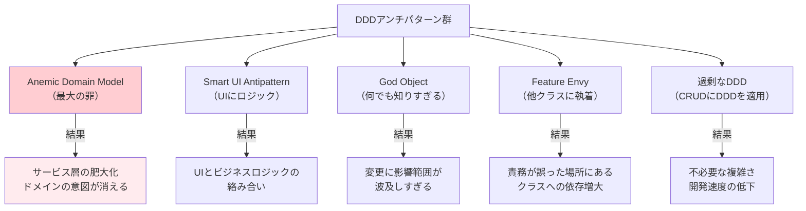

## DDDはトレードオフである

DDDは万能薬ではありません。「これがアンチパターンだ」と知ることは、「これが正しいパターンだ」と知ることと同じくらい重要です。また、DDDを適用すること自体がアンチパターンになりうる場面も存在します。本章では代表的なアンチパターンを解説し、正しい方向を示します。

---

## アンチパターン一覧と影響マップ



---

## 1. Anemic Domain Model（最大のアンチパターン）

Martin Fowlerが命名した「貧血ドメインモデル」は、DDDにおいて最も危険なアンチパターンです。ドメインオブジェクトがデータの入れ物（構造体）でしかなく、ビジネスロジックがサービス層やユースケース層に漏れ出している状態です。

```csharp
// ❌ Before: Anemic Domain Model
public class BankAccount
{
    public Guid Id { get; set; }
    public decimal Balance { get; set; }       // 外部から自由に書き換え可能
    public bool IsLocked { get; set; }         // 誰でも変更できる
    public string OwnerId { get; set; } = "";  // ドメインルールなし
}

// ビジネスロジックがApplicationServiceに散在
public class BankAccountService
{
    public void Withdraw(Guid accountId, decimal amount)
    {
        var account = _repo.FindById(accountId);
        if (account.IsLocked) throw new Exception("Account is locked");    // ルールが外に漏れる
        if (account.Balance < amount) throw new Exception("Insufficient"); // ルールが外に漏れる
        account.Balance -= amount;  // 外から直接変更
        _repo.Save(account);
    }
}

// ✅ After: Rich Domain Model
public class BankAccount
{
    public BankAccountId Id { get; private set; }
    private Money _balance;
    private bool _isLocked;

    public void Withdraw(Money amount)
    {
        if (_isLocked)
            throw new DomainException("ロックされた口座から引き出せません");
        if (_balance < amount)
            throw new DomainException("残高が不足しています");

        _balance = _balance.Subtract(amount);
        RaiseEvent(new MoneyWithdrawnEvent(Id, amount, DateTime.UtcNow));
    }
}
```

---

## 2. Smart UI Antipattern

UIコンポーネントやコントローラにビジネスロジックを書いてしまうパターンです。短期的には開発が速いですが、テストが困難になり、同じロジックが複数の画面に複製されます。

```csharp
// ❌ Before: Smart UI（ControllerにBLが入り込む）
[HttpPost("checkout")]
public IActionResult Checkout(CheckoutRequest request)
{
    if (request.Items.Count == 0) return BadRequest("商品なし");
    var total = request.Items.Sum(i => i.Price * i.Qty);
    if (total > 1_000_000) return BadRequest("上限超過");
    // ... ビジネスルールがControllerに直書き
}

// ✅ After: ControllerはOrchestration、ルールはDomainへ
[HttpPost("checkout")]
public async Task<IActionResult> Checkout(CheckoutRequest request)
{
    var result = await _orderService.PlaceOrder(request.ToCommand());
    return result.IsSuccess ? Ok(result.Value) : BadRequest(result.Error);
}
```

---

## 3. God Object（何でも知りすぎるクラス）

`OrderManager`、`SystemController`、`AppHelper`——このような名前のクラスは God Objectの匂いです。10個以上のメソッド、多数のPrivateフィールド、あらゆるサービスへの依存を持ちます。変更のたびに影響範囲が読めず、テストが困難です。解決策はクラスを責務に従って分割し、それぞれを適切なAggregate・DomainService・ApplicationServiceに振り分けることです。

---

## 4. Feature Envy（他クラスのデータに執着）

```csharp
// ❌ Before: Feature Envy — OrderServiceがCustomerのデータに執着
public class OrderService
{
    public decimal CalculateDiscount(Order order, Customer customer)
    {
        // CustomerのデータをOrderServiceが操作している
        if (customer.PurchaseHistory.Count > 10 && customer.TotalSpent > 100_000m)
            return order.TotalAmount * 0.15m;
        return 0;
    }
}

// ✅ After: 責務をCustomerドメインに移動
public class Customer
{
    public DiscountRate CalculateEligibleDiscount()
    {
        if (_purchaseHistory.Count > 10 && _totalSpent > Money.Of(100_000m, Currency.JPY))
            return DiscountRate.Of(0.15m);
        return DiscountRate.None;
    }
}
```

---

## 5. 過剰なDDD（シンプルなCRUDにDDDを適用）

```csharp
// ❌ 過剰なDDD: お知らせの管理にAggregateを作る必要はない
// （お知らせは作成・表示・削除だけ。ドメインルールが存在しない）
public class Announcement : AggregateRoot  // 不要な複雑さ
{
    public AnnouncementId Id { get; private set; }
    public string Title { get; private set; } = "";
    public string Body { get; private set; } = "";
    // ドメインルールが何もない → ただのCRUD
}

// ✅ シンプルなCRUDには素直なRepositoryパターンで十分
public record CreateAnnouncementRequest(string Title, string Body);
// EntityやAggregateなしで、直接DBに保存するだけで良い
```

---

## Martin Fowlerの視点：貧血ドメインモデルは反パターン

Martin Fowlerは自身のブログで「Anemic Domain Model」を「Domain Driven Design の根本的な違反」と述べています。「なぜなら、オブジェクト指向の核心は"データとふるまいの結合"にあるからだ。データだけを持つオブジェクトはただの構造体であり、2003年以前の手続き型スタイルへの退行にすぎない」と主張しています。

---

> **専門家の視点**
>
> DDDの最大のリスクは「DDDそのもの」ではなく「DDDの過剰適用」です。Eric Evansは著書の中で、DDDが最も価値を発揮するのは「複雑なビジネスロジックを持つコアドメイン」だと明言しています。管理画面のマスタ管理、単純な設定保存、一覧表示——これらにAggregateやDomainEventを持ち込むことは、開発チームを疲弊させるだけです。「このビジネスルールはどれだけ複雑か？」を問い、複雑でなければシンプルに書くことがDDDの精神に沿っています。DDDは思想であり、すべてのクラスにAggregateが必要なわけではありません。

---

## まとめとチェックリスト

DDDを正しく活用するための自己チェックリストです。

- [ ] ドメインクラスにビジネスルールを実装しているか（貧血ドメインモデルを避ける）
- [ ] UIやControllerにビジネスロジックを書いていないか
- [ ] 一つのクラスが10個以上のメソッドを持っていないか（God Object）
- [ ] メソッドが他クラスのデータを多用していないか（Feature Envy）
- [ ] このドメインに本当にDDDの複雑さが必要か（過剰DDD）
- [ ] 複雑さのトレードオフをチームで合意しているか

DDDはトレードオフです。複雑なビジネスロジックを持つコアドメインに集中して適用し、シンプルなCRUDには適切な手を抜く判断力が、プロフェッショナルなDDD実践者の証です。
