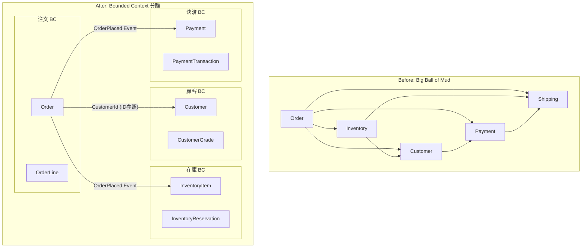
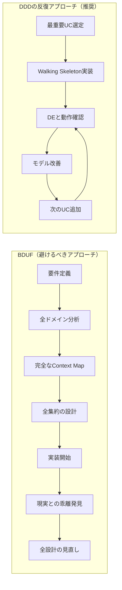
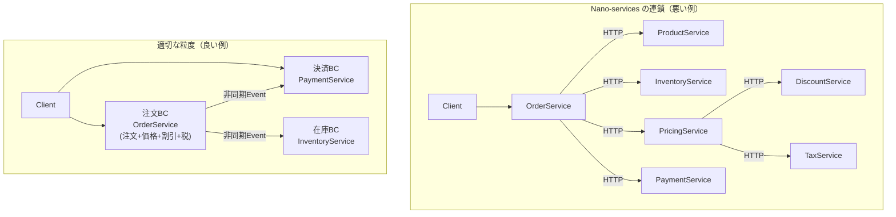
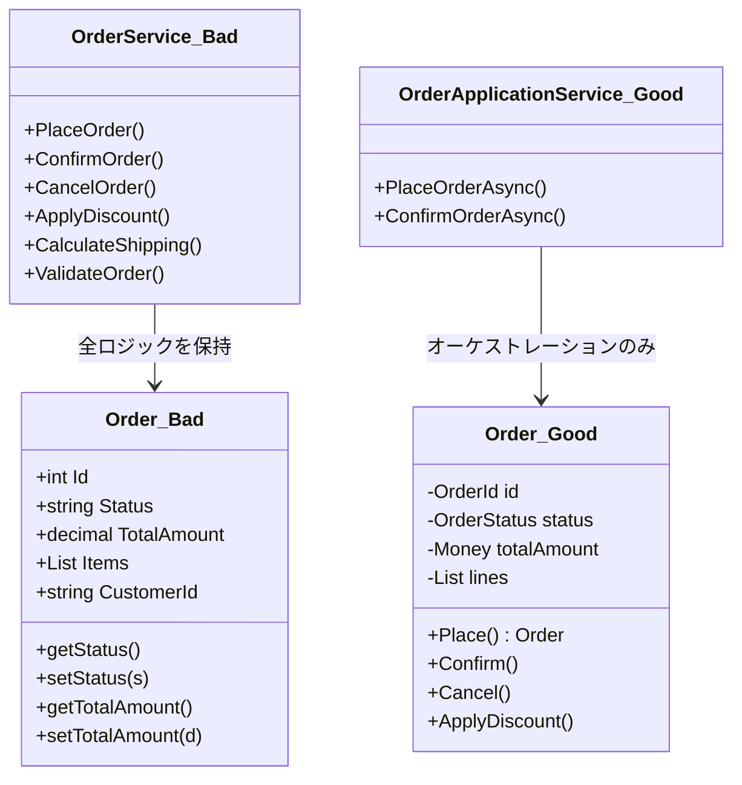

# 第20章: DDDアンチパターン 完全解説

---

## 0. TL;DR

DDDのアンチパターンは「戦略的」「戦術的」「アーキテクチャ」の3カテゴリに分類され、多くは知識不足ではなく「分かっているつもり」の実装ギャップから生まれます。最も危険な組み合わせは「貧血ドメインモデル ＋ 巨大集約 ＋ Bounded Context無視」で、一度定着すると修正コストが指数関数的に増加します。本章のチェックリスト30項目を使ってコードレビューに組み込むことで、設計の劣化を早期に発見できます。

---

## 1. なぜアンチパターンを学ぶか

### 知識と実装の乖離という根本問題

「DDDの本を3冊読んだ」「研修を受けた」「チーム内で勉強会を開いた」——それにもかかわらず、実際のコードが美しくなかったという経験はないでしょうか。DDDに関する書籍や資料は豊富にあります。しかし、それらを読んで理解したとしても、実装がうまくいかないケースは非常に多くあります。

この乖離の根本原因は、DDDが「概念の集合」ではなく「判断基準の集合」だからです。エンティティとバリューオブジェクトの違いを教科書で学ぶことは難しくありません。しかし実際のコードを書く場面で「この`Address`はエンティティか、バリューオブジェクトか」という判断を正確に下せるかどうかは別の話です。

知識として分かっていても実装に落とし込めない理由には、主に以下の3つがあります。

第一に、**既存コードベースの慣性**です。チームがトランザクションスクリプトやAnemic Domain Modelに慣れ親しんでいると、DDDの概念を知っていても、無意識のうちに旧来のパターンで書いてしまいます。「ここはとりあえずServiceに書いておこう」という一文が積み重なって、気づけば全ロジックがServiceクラスに集中しているというのはよくある話です。

第二に、**締め切りと品質のトレードオフ**です。正しい設計を追求したくても、スプリントの締め切りが迫ると「後でリファクタリングする」という先送りが生まれます。この先送りが積み重なると、技術的負債が指数関数的に増加します。

第三に、**フィードバックループの遅さ**です。設計の良し悪しは、書いた直後にはなかなか判断できません。数ヶ月後に機能追加や変更が困難になったときに初めて「あの設計は間違っていた」と気づくことが多いのです。

### アンチパターンを知ることが設計力の証

優れたエンジニアは「正しい答え」を知っているだけでなく、「よくある間違い」を体系的に把握しています。医師が診断を下す際にまず鑑別診断を行うように、エンジニアも設計の問題を診断する「デバッグ型思考」を持つことが重要です。

アンチパターンを学ぶことには以下のメリットがあります。まず、コードレビューの際に具体的な指摘ができるようになります。「なんとなく気持ち悪い」ではなく「これはAnemic Domain Modelです。OrderConfirm()メソッドをOrderServiceではなくOrderエンティティに移動してください」と言える。次に、設計議論で共通言語として使えます。チームメンバーと「これはGOD Aggregateになっていないか?」と話し合えるようになります。さらに、予防的な設計判断ができるようになります。「ここでやりたいことはNano-servicesにつながりやすいパターンだ」と事前に察知できます。

### アンチパターンのカテゴリ分類

本章では、DDDアンチパターンを以下の3カテゴリに分類して解説します。

**戦略的アンチパターン**: Bounded Contextの設計やUbiquitous Languageの確立に関する問題。プロジェクト全体の構造に影響し、修正コストが最も高いカテゴリです。

**戦術的アンチパターン**: エンティティ、集約、リポジトリ、ドメインサービスなど、個々の設計要素に関する問題。戦略的な設計が正しくても、戦術的なアンチパターンが存在するとコードの品質は低下します。

**アーキテクチャアンチパターン**: レイヤー間の依存関係や責務分離に関する問題。これらは往々にして戦術的アンチパターンと連鎖して発生します。

---

## 2. 戦略的アンチパターン

### 2.1 Bounded Context 無視（Big Ball of Mud）

#### 症状

最も深刻な戦略的アンチパターンは、Bounded Contextを設けないことです。この状態のシステムは「Big Ball of Mud（泥の大きな塊）」とも呼ばれます。具体的な症状としては、注文（Order）・顧客（Customer）・在庫（Inventory）・決済（Payment）が同一の名前空間に混在し、それぞれのドメイン概念が互いに強く依存しているという状態です。

例えば、`Order`クラスが`Customer`の会員ランクを直接参照し、在庫の引き当てロジックを内包し、決済処理まで行うようなコードが典型例です。一見「全部一箇所にある」ので分かりやすく見えますが、これは設計の失敗を意味します。

```csharp
// Bad: 全ドメインが混在した巨大クラス
public class Order
{
    public int Id { get; set; }
    public Customer Customer { get; set; }          // 顧客ドメインへの直接依存
    public List<InventoryItem> Items { get; set; }  // 在庫ドメインへの直接依存
    public PaymentInfo Payment { get; set; }         // 決済ドメインへの直接依存
    public decimal TotalAmount { get; set; }

    // 在庫チェックが注文クラスに存在
    public bool CheckInventory()
    {
        foreach (var item in Items)
        {
            if (item.AvailableQuantity < item.OrderedQuantity)
                return false;
        }
        return true;
    }

    // 会員ランクに基づく割引計算が注文クラスに存在
    public decimal CalculateDiscount()
    {
        if (Customer.MemberRank == "Gold")
            return TotalAmount * 0.1m;
        if (Customer.MemberRank == "Platinum")
            return TotalAmount * 0.15m;
        return 0;
    }

    // 決済処理が注文クラスに存在
    public async Task<bool> ProcessPayment(string cardNumber, string cvv)
    {
        Payment = new PaymentInfo { CardNumber = cardNumber, Cvv = cvv };
        return true;
    }
}
```

#### 発生メカニズム

なぜBig Ball of Mudは発生するのでしょうか。多くの場合、プロジェクト初期は「シンプルに始めよう」という意図があります。最初のスプリントでは機能が少なく、モデルが混在していても問題になりません。しかし機能追加が続くにつれ、既存の構造に便乗する形で新しいロジックが追加されていきます。

技術的負債の加速メカニズムは以下の通りです。まず、最初の混在が小さな問題として見過ごされます。次に、その構造を前提に新機能が追加されます。テストを書くとすべての依存が必要になり、テストが書きにくくなります。テストが少ないとリファクタリングが怖くなります。リファクタリングできないので問題が蓄積します。結果として、変更コストが指数関数的に上昇します。



#### Before/After C# コード（完全実装）

```csharp
// Good: 注文 Bounded Context
namespace OrderManagement.Domain
{
    public class Order : AggregateRoot
    {
        public OrderId Id { get; private set; }
        public CustomerId CustomerId { get; private set; }  // ID参照のみ
        public OrderStatus Status { get; private set; }
        private readonly List<OrderLine> _lines = new();
        public IReadOnlyCollection<OrderLine> Lines => _lines.AsReadOnly();
        public Money TotalAmount { get; private set; }

        private Order() { }

        public static Order Place(
            CustomerId customerId,
            IEnumerable<OrderLineRequest> lineRequests)
        {
            var order = new Order
            {
                Id = OrderId.New(),
                CustomerId = customerId,
                Status = OrderStatus.Placed,
                TotalAmount = Money.Zero("JPY")
            };

            foreach (var req in lineRequests)
            {
                order.AddLine(req.ProductId, req.Quantity, req.UnitPrice);
            }

            order.RecordEvent(new OrderPlacedEvent(order.Id, customerId, order.TotalAmount));
            return order;
        }

        private void AddLine(ProductId productId, int quantity, Money unitPrice)
        {
            var line = OrderLine.Create(productId, quantity, unitPrice);
            _lines.Add(line);
            TotalAmount = TotalAmount.Add(line.LineTotal);
        }

        public void Confirm()
        {
            if (Status != OrderStatus.Placed)
                throw new DomainException($"ステータスが{Status}の注文は確定できません。");

            Status = OrderStatus.Confirmed;
            RecordEvent(new OrderConfirmedEvent(Id, CustomerId));
        }
    }
}

// Good: Anti-Corruption Layer (ACL)
namespace OrderManagement.Infrastructure.Acl
{
    public class CustomerDiscountAcl : ICustomerDiscountPolicy
    {
        private readonly ICustomerServiceClient _customerServiceClient;

        public CustomerDiscountAcl(ICustomerServiceClient client)
        {
            _customerServiceClient = client;
        }

        public async Task<DiscountRate> GetDiscountRateAsync(CustomerId customerId)
        {
            // 外部の顧客サービスのモデル（CustomerDto）を
            // 注文コンテキストのモデル（DiscountRate）に変換する
            var customerDto = await _customerServiceClient.GetCustomerAsync(customerId.Value);
            return TranslateToDiscountRate(customerDto.MemberRank);
        }

        private DiscountRate TranslateToDiscountRate(string memberRank) =>
            memberRank switch
            {
                "Gold" => new DiscountRate(0.10m),
                "Platinum" => new DiscountRate(0.15m),
                _ => DiscountRate.None
            };
    }
}
```

#### 修正方法

修正のステップは以下の通りです。まずEvent Stormingを使ってビジネスイベントを洗い出し、自然なBounded Contextの境界を発見します。次にContext Mapを描いて、BCの間の関係（Upstream/Downstream, Partnership, ACL等）を明確にします。最後に、BC間の通信はID参照またはDomain Eventに限定し、直接オブジェクト参照を排除します。

---

### 2.2 あいまいな Ubiquitous Language

#### 症状

「user」「account」「data」「item」「info」「detail」「type」「status」——これらの単語があなたのコードに溢れていませんか？これらは意味が広すぎて、文脈によって全く異なるものを指します。例えば「user」は「顧客」「管理者」「オペレーター」のどれでしょうか？「item」は「注文明細」「在庫品目」「カタログエントリー」のどれでしょうか？

```csharp
// Bad: あいまいな言語で書かれたコード
public class DataManager
{
    public UserInfo GetUser(int id) { /* ... */ }
    public void UpdateUserData(UserInfo info) { /* ... */ }
    public List<ItemDetail> GetItems(int userId) { /* ... */ }
    public bool ProcessItem(ItemDetail item, UserInfo user) { /* ... */ }
    public void SaveData(object data) { /* ... */ }
}
```

このコードを読んでも、ビジネスの何をしているのか全く分かりません。`ProcessItem`は何を処理しているのか？`SaveData`は何を保存するのか？ドメインエキスパートにこのコードを見せても、自分たちのビジネスを表現しているとは到底思えないでしょう。

#### 発生メカニズム

あいまいな言語が生まれる最大の原因は、**技術者とビジネス側の対話不足**です。エンジニアが要件書だけを見てコードを書くと、ビジネスの文脈が失われます。「注文明細」を`OrderLine`と書くべきところを`Item`と書いてしまうのは、ドメインエキスパートとの対話がないからです。

もう一つの原因は、**ERDから始まる設計**です。データベースのテーブル設計から始めると、テーブル名がそのままクラス名になりがちです。`T_USER_MST`から始まった設計は`UserMst`クラスになり、ドメインの意図が完全に失われます。

#### Before/After: ユビキタス言語の適用

```csharp
// Bad: あいまいな用語
public class ItemService
{
    public Item GetItem(int id) { /* ... */ }
    public void UpdateItem(Item item) { /* ... */ }
    public List<Item> GetUserItems(int userId) { /* ... */ }
}

// Good: ユビキタス言語に基づく明確な名称（注文管理コンテキスト）
public class OrderLineService
{
    public OrderLine GetOrderLine(OrderLineId id) { /* ... */ }
    public void UpdateOrderLineQuantity(OrderLineId id, Quantity newQuantity) { /* ... */ }
    public IReadOnlyList<OrderLine> GetOrderLinesForOrder(OrderId orderId) { /* ... */ }
}

// Good: カタログ管理コンテキスト
public class CatalogEntryService
{
    public CatalogEntry GetCatalogEntry(CatalogEntryId id) { /* ... */ }
    public void UpdateCatalogEntryPrice(CatalogEntryId id, Money newPrice) { /* ... */ }
    public IReadOnlyList<CatalogEntry> GetCatalogEntriesForCategory(CategoryId id) { /* ... */ }
}
```

#### 修正方法

Event Stormingワークショップを開催し、ドメインエキスパートと「オレンジ付箋（ドメインイベント）」を貼り出す作業をします。この作業を通じて、ビジネス側が実際に使っている言葉を発見できます。その言葉をそのままコードに反映するのが原則です。

用語集（Glossary）を作成し、以下の形式でチームの共通理解を記録します。

| 用語 | コンテキスト | 定義 | 使ってはいけない同義語 |
|------|------------|------|-------------------|
| 受注 (Order) | 注文管理 | 顧客からの購買意図の確定記録 | 注文書、買い注文 |
| 注文明細 (OrderLine) | 注文管理 | 受注に含まれる商品1品目の記録 | アイテム、品目、Item |
| 顧客 (Customer) | 顧客管理 | 過去に購買実績のある取引先 | ユーザー、User、得意先 |
| 商品 (Product) | カタログ管理 | 販売対象として登録された品目 | 商材、アイテム、品物 |

ドメインエキスパートが「それはうちではXと呼ぶ」と言ったとき、そのXをそのままコードに使う勇気が必要です。慣れ親しんだ「User」を「Customer」に変えるのは抵抗感がありますが、その抵抗を乗り越えることがDDDの第一歩です。

---

### 2.3 事前過設計（BDUF: Big Design Up Front）

#### 症状

「完璧なドメインモデルを設計してから実装を始めよう」「集約の境界が決まるまでコードは書けない」「全てのBounded Contextのコンテキストマップが完成してからスプリントを開始しよう」——このような姿勢がBDUFアンチパターンです。

設計会議が何週間も続き、ホワイトボードにはUML図が何枚も描かれているのに、動くコードが一行も存在しない状態です。ドメインの複雑さに直面すると、人は「もっと考えれば答えが出るはず」という罠にはまりがちです。

BDUF症状の具体的な兆候:

- スプリント1が始まって2週間が経過しているのにコードが0行
- 全てのユースケースのクラス図がある状態で実装に入っていない
- 「この設計で良いか確認が取れないと進められない」という発言が繰り返される
- ドメインエキスパートとの打ち合わせが設計レビュー中心で、動くものを一緒に確認する機会がない

#### DDDの反復的なモデリングとの違い

DDDは「完璧なモデルを最初に設計する」手法ではありません。DDDは「モデルを実装を通じて継続的に発見・改善する」手法です。Eric Evansは「ドメインモデルは生き物であり、理解が深まるにつれて進化する」と述べています。

「Designing vs Learning」の違いを理解することが重要です。BDUFは「Designing（設計する）」モードで、正解が事前に分かるという前提があります。DDDは「Learning（学ぶ）」モードで、実装と対話を通じてドメインを発見するという前提があります。



#### 修正方法: Walking Skeleton + 継続的リファクタリング

Walking Skeletonとは、システムの全レイヤーを貫く最小限の機能実装です。最初はドメインモデルが不完全でも構いません。

```csharp
// Walking Skeleton: 最初は不完全でいい（Week 1）
// 目的は「動くもの」を作ること
public class OrderApplicationService
{
    public async Task<OrderId> PlaceOrderAsync(PlaceOrderCommand command)
    {
        var order = new Order(command.CustomerId, command.Items);
        await _orderRepository.SaveAsync(order);
        return order.Id;
    }
}

// Week 4: ドメインエキスパートとのデモを経て得た知見を反映
// 「在庫確認は注文受付の前に行う業務フローになっている」
public class OrderApplicationService
{
    public async Task<OrderId> PlaceOrderAsync(PlaceOrderCommand command)
    {
        var availabilityCheck = await _inventoryService.CheckAvailabilityAsync(command.Items);
        if (!availabilityCheck.IsAvailable)
            throw new InsufficientInventoryException(availabilityCheck.UnavailableItems);

        var order = Order.Place(command.CustomerId, command.Items, availabilityCheck);
        await _orderRepository.SaveAsync(order);
        return order.Id;
    }
}
```

フェーズ1（Week 1-2）: 最も重要なユースケース1つだけを全レイヤーで貫通させて動かします。フェーズ2（Week 3-4）: 実装と対話から得た知見でモデルを修正します。フェーズ3（Week 5+）: 新しい機能を追加しながら継続的にリファクタリングします。

---

### 2.4 過細粒度サービス（Nano-services）

#### 症状

マイクロサービスアーキテクチャを採用したプロジェクトで、1つのユースケースを完了するために5つ以上のサービス呼び出しが連鎖するようになった状態をNano-servicesといいます。

```
OrderService → ProductService → InventoryService → PricingService
→ DiscountService → TaxService → PaymentService
```

各サービスへの呼び出しがネットワーク越しになるため、レイテンシが積み重なります。7つのサービスそれぞれが99.9%の可用性を持つとしても、連鎖全体の可用性は 0.999の7乗 ≒ 99.3% にまで低下します。

#### 発生メカニズム

Nano-servicesが発生する主な原因は、**Bounded Contextを無視した技術的分割**です。マイクロサービスは「スケーリングの単位」「デプロイの単位」「チームの単位」として分割すべきですが、Nano-servicesは「クラスの単位」「機能の単位」で分割してしまっています。



#### 修正方法

```csharp
// Bad: Nano-services による連鎖（1ユースケースに6回のネットワーク呼び出し）
public class OrderConfirmationOrchestrator
{
    public async Task ConfirmOrderAsync(Guid orderId)
    {
        var order = await _orderClient.GetOrderAsync(orderId);           // HTTP 1
        var products = await _productClient.GetProductsAsync(           // HTTP 2
            order.ProductIds);
        var inventory = await _inventoryClient.CheckAsync(order.ProductIds); // HTTP 3
        var basePrice = await _pricingClient.CalculateAsync(order);    // HTTP 4
        var discount = await _discountClient.GetDiscountAsync(          // HTTP 5
            order.CustomerId);
        var finalPrice = await _taxClient.ApplyTaxAsync(               // HTTP 6
            basePrice - discount);
    }
}

// Good: 注文BC内でまとめて処理（ローカル呼び出し）
public class OrderApplicationService
{
    public async Task ConfirmOrderAsync(OrderId orderId)
    {
        // BC内のローカルリポジトリから取得（ネットワーク不要）
        var order = await _orderRepository.FindByIdAsync(orderId);

        // BC内のドメインサービスで価格計算（ネットワーク不要）
        var pricingPolicy = await _pricingPolicyRepository.GetCurrentPolicyAsync();
        order.Confirm(pricingPolicy);

        await _orderRepository.SaveAsync(order);

        // 在庫BC・決済BCへは非同期イベントで通知（連鎖しない）
        foreach (var domainEvent in order.DomainEvents)
            await _eventBus.PublishAsync(domainEvent);
    }
}
```

---

## 3. 戦術的アンチパターン

### 3.1 Anemic Domain Model（貧血ドメインモデル）

#### Martin Fowlerが命名した最重要アンチパターン

Martin Fowlerが2003年に命名したAnemic Domain Modelは、DDDの世界で最も広く議論されるアンチパターンです。なぜ「最重要」かというと、**発見が困難**で**被害が甚大**だからです。表面上は「オブジェクト指向っぽいコード」に見えるため、気づかないまま運用され続けることが多いのです。

クラス図を見ると、きちんとOrder・Customer・Productというクラスが存在します。しかしそのクラスの中身はgetterとsetterだけで、全てのビジネスロジックがXxxServiceクラスに書かれています。この状態は、オブジェクト指向の恩恵（カプセル化・凝集性・ポリモーフィズム）をほとんど得られていません。手続き型プログラミングをクラスで書いているのと本質的に同じです。



#### 発生メカニズム

Anemic Domain Modelが発生する主な要因は2つあります。第一に、**トランザクションスクリプトの残滓**です。多くのエンジニアが最初に学ぶプログラミングスタイルはトランザクションスクリプト（手順を上から下に書く手続き型）です。このスタイルに慣れると、「データを取ってきて、処理して、保存する」という流れが自然で、データクラスと処理クラスを分けることが「整理されている」と感じられます。第二に、**ORMの使い方の問題**です。EFCoreでエンティティを定義するとき、デフォルトでpublicなプロパティとsetterを持つPOCOクラスを作りがちです。そのまま放置すると、全プロパティがpublicなsetterを持つ「データバッグ」になります。

#### Beforeコード（貧血モデル・約200行）

```csharp
// Bad: 貧血ドメインモデル（全ロジックがServiceにある）
public class Order
{
    public int Id { get; set; }
    public string Status { get; set; }
    public decimal TotalAmount { get; set; }
    public string CustomerId { get; set; }
    public List<OrderItem> Items { get; set; } = new();
    public DateTime CreatedAt { get; set; }
    public string CancellationReason { get; set; }
    public DateTime? CancelledAt { get; set; }
    public decimal DiscountAmount { get; set; }
    public string ShippingAddress { get; set; }
    // データのみ。ビジネスロジックは0行
}

public class OrderItem
{
    public int Id { get; set; }
    public int OrderId { get; set; }
    public string ProductId { get; set; }
    public int Quantity { get; set; }
    public decimal UnitPrice { get; set; }
    public decimal LineTotal { get; set; }
}

// 全ビジネスロジックがServiceに集中（1000行超になりがち）
public class OrderService
{
    private readonly IOrderRepository _orderRepository;
    private readonly IInventoryRepository _inventoryRepository;
    private readonly IEmailService _emailService;

    public async Task<int> PlaceOrderAsync(PlaceOrderRequest request)
    {
        // バリデーションロジックがService内に
        if (request.Items == null || !request.Items.Any())
            throw new ArgumentException("注文明細が空です");

        var order = new Order
        {
            Status = "Placed",
            CustomerId = request.CustomerId,
            CreatedAt = DateTime.UtcNow,
            ShippingAddress = request.ShippingAddress
        };

        decimal total = 0;
        foreach (var itemReq in request.Items)
        {
            // 価格計算ロジックがService内に（Entityに属するはず）
            var lineTotal = itemReq.Quantity * itemReq.UnitPrice;
            order.Items.Add(new OrderItem
            {
                ProductId = itemReq.ProductId,
                Quantity = itemReq.Quantity,
                UnitPrice = itemReq.UnitPrice,
                LineTotal = lineTotal
            });
            total += lineTotal;
        }
        order.TotalAmount = total;

        await _orderRepository.SaveAsync(order);
        return order.Id;
    }

    public async Task ConfirmOrderAsync(int orderId)
    {
        var order = await _orderRepository.FindByIdAsync(orderId);

        // ステータス遷移ロジックがService内に（Entityに属するはず）
        if (order.Status != "Placed")
            throw new InvalidOperationException(
                $"ステータスが{order.Status}の注文は確定できません");

        // 在庫チェックロジックがService内に
        foreach (var item in order.Items)
        {
            var inventory = await _inventoryRepository
                .FindByProductIdAsync(item.ProductId);
            if (inventory.AvailableQuantity < item.Quantity)
                throw new InsufficientInventoryException(item.ProductId);
        }

        order.Status = "Confirmed";  // ステータスを直接書き換え
        await _orderRepository.SaveAsync(order);
        await _emailService.SendOrderConfirmationAsync(order.CustomerId, order.Id);
    }

    public async Task CancelOrderAsync(int orderId, string reason)
    {
        var order = await _orderRepository.FindByIdAsync(orderId);

        // キャンセルロジックがService内に（Entityに属するはず）
        if (order.Status == "Shipped" || order.Status == "Delivered")
            throw new InvalidOperationException("発送済みの注文はキャンセルできません");

        order.Status = "Cancelled";
        order.CancellationReason = reason;
        order.CancelledAt = DateTime.UtcNow;
        await _orderRepository.SaveAsync(order);
    }
}
```

#### Afterコード（リッチモデル・約200行）

```csharp
// Good: リッチドメインモデル（ビジネスロジックがEntityに）
public class Order : AggregateRoot<OrderId>
{
    private readonly List<OrderLine> _lines = new();
    private readonly List<IDomainEvent> _domainEvents = new();

    public OrderId Id { get; private set; }
    public CustomerId CustomerId { get; private set; }
    public OrderStatus Status { get; private set; }
    public Money TotalAmount { get; private set; }
    public ShippingAddress ShippingAddress { get; private set; }
    public CancellationInfo? CancellationInfo { get; private set; }
    public IReadOnlyCollection<OrderLine> Lines => _lines.AsReadOnly();
    public IReadOnlyCollection<IDomainEvent> DomainEvents => _domainEvents.AsReadOnly();

    private Order() { } // EFCore用

    // ファクトリメソッド: 生成ロジックをEntityが持つ
    public static Order Place(
        CustomerId customerId,
        IEnumerable<OrderLineRequest> lineRequests,
        ShippingAddress shippingAddress)
    {
        if (!lineRequests.Any())
            throw new DomainException("注文明細が空の注文は受け付けられません。");

        var order = new Order
        {
            Id = OrderId.New(),
            CustomerId = customerId,
            Status = OrderStatus.Placed,
            ShippingAddress = shippingAddress,
            TotalAmount = Money.Zero("JPY")
        };

        foreach (var req in lineRequests)
            order.AddLine(req.ProductId, req.Quantity, req.UnitPrice);

        order._domainEvents.Add(
            new OrderPlacedEvent(order.Id, customerId, order.TotalAmount));
        return order;
    }

    // ステータス遷移ロジックをEntityが持つ（Tell, Don't Ask）
    public void Confirm()
    {
        if (Status != OrderStatus.Placed)
            throw new DomainException(
                $"ステータスが{Status.DisplayName}の注文は確定できません。");

        Status = OrderStatus.Confirmed;
        _domainEvents.Add(new OrderConfirmedEvent(Id, CustomerId));
    }

    // キャンセルロジックをEntityが持つ
    public void Cancel(CancellationReason reason)
    {
        if (Status == OrderStatus.Shipped || Status == OrderStatus.Delivered)
            throw new DomainException("発送済みまたは配達済みの注文はキャンセルできません。");

        Status = OrderStatus.Cancelled;
        CancellationInfo = new CancellationInfo(reason, DateTime.UtcNow);
        _domainEvents.Add(new OrderCancelledEvent(Id, CustomerId, reason));
    }

    // 割引適用ロジックをEntityが持つ
    public void ApplyDiscount(DiscountRate discountRate)
    {
        if (Status != OrderStatus.Placed)
            throw new DomainException("確定前の注文にのみ割引を適用できます。");

        TotalAmount = TotalAmount.ApplyDiscount(discountRate);
        _domainEvents.Add(new OrderDiscountAppliedEvent(Id, discountRate));
    }

    private void AddLine(ProductId productId, int quantity, Money unitPrice)
    {
        var existing = _lines.FirstOrDefault(l => l.ProductId == productId);
        if (existing != null)
            existing.IncreaseQuantity(quantity);
        else
            _lines.Add(OrderLine.Create(productId, quantity, unitPrice));
        RecalculateTotal();
    }

    private void RecalculateTotal()
    {
        TotalAmount = _lines.Aggregate(
            Money.Zero("JPY"), (sum, line) => sum.Add(line.LineTotal));
    }
}

// Application Serviceはオーケストレーションのみ（薄い層）
public class OrderApplicationService
{
    private readonly IOrderRepository _orderRepository;

    public async Task<OrderId> PlaceOrderAsync(PlaceOrderCommand command)
    {
        var order = Order.Place(
            new CustomerId(command.CustomerId),
            command.Items.Select(i => new OrderLineRequest(
                new ProductId(i.ProductId),
                i.Quantity,
                new Money(i.UnitPrice, "JPY"))),
            new ShippingAddress(command.ShippingAddress));

        await _orderRepository.SaveAsync(order);
        return order.Id;
    }

    public async Task ConfirmOrderAsync(ConfirmOrderCommand command)
    {
        var order = await _orderRepository.FindByIdAsync(new OrderId(command.OrderId));
        order.Confirm();  // ドメインロジックはEntityに委ねる（1行）
        await _orderRepository.SaveAsync(order);
    }
}
```

#### 判定テスト

以下の質問に5つ以上「はい」があれば、Anemic Domain Modelの疑いが強いです。

- クラスにpublicなsetterが10個以上あるか？
- Serviceクラスが500行を超えているか？
- Entityのメソッドがgetterとsetterだけか？
- ステータス遷移ロジックがServiceにあるか？
- 計算ロジック（合計金額・割引額等）がServiceにあるか？
- バリデーションロジックがServiceにあるか？
- Entityのインスタンス化にnewを直接Application Serviceで書いているか？

---

### 3.2 GOD Aggregate（神様集約）

#### 症状

1000行を超えるOrderクラスに、注文・明細・配送・決済・割引・ポイント・クーポンなど全てのロジックが詰め込まれている状態です。Orderが「全てを知っている神様」になっています。コードを変更するたびに予期しない副作用が発生し、テストが複雑化します。

GOD Aggregateは逆説的にも「Anemic Domain Modelを解消しようとした結果」として生まれることがあります。「ロジックをEntityに入れよう」と思ったものの、どこに入れるかを考えずに全てOrderに入れた結果、Order一点集中になります。

#### なぜ発生するか

集約の責務を絞ることは、実際には非常に難しい判断です。「注文と配送先は一緒に管理すべきでは?」「注文と決済情報は同じ集約に入れるべき?」という判断は、経験を積んでも迷うことがあります。「取り敢えず全部Orderに入れておけば整合性が保てる」という短絡的な判断がGOD Aggregateを生みます。

#### Before/After C# コード

```csharp
// Bad: GOD Aggregate（全てがOrderに）
public class Order
{
    public int Id { get; private set; }
    // 注文の基本情報
    public string Status { get; private set; }
    public decimal TotalAmount { get; private set; }
    public List<OrderItem> Items { get; private set; }
    // 配送情報（本来は別集約）
    public string ShippingAddress { get; private set; }
    public string TrackingNumber { get; private set; }
    public DateTime? EstimatedDeliveryDate { get; private set; }
    // 決済情報（本来は別集約）
    public string PaymentMethod { get; private set; }
    public bool IsPaid { get; private set; }
    public DateTime? PaidAt { get; private set; }
    // ポイント情報（本来は別集約）
    public int EarnedPoints { get; private set; }
    public int UsedPoints { get; private set; }
    // クーポン情報（本来は別集約）
    public string CouponCode { get; private set; }
    public decimal CouponDiscountAmount { get; private set; }
    // 1000行のメソッド群が続く...
}

// Good: Vernon の4原則に基づく集約の分割
// 原則1: 小さな集約にする（注文の核心のみ）
public class Order : AggregateRoot<OrderId>
{
    public OrderId Id { get; private set; }
    public CustomerId CustomerId { get; private set; }
    public OrderStatus Status { get; private set; }
    public Money TotalAmount { get; private set; }
    private readonly List<OrderLine> _lines = new();
    public IReadOnlyCollection<OrderLine> Lines => _lines.AsReadOnly();

    public static Order Place(CustomerId customerId, IEnumerable<OrderLineRequest> lines)
    {
        var order = new Order { Id = OrderId.New(), CustomerId = customerId,
            Status = OrderStatus.Placed, TotalAmount = Money.Zero("JPY") };
        foreach (var l in lines) order.AddLine(l.ProductId, l.Quantity, l.UnitPrice);
        order.RecordEvent(new OrderPlacedEvent(order.Id, customerId, order.TotalAmount));
        return order;
    }

    public void Confirm()
    {
        if (Status != OrderStatus.Placed)
            throw new DomainException($"ステータスが{Status}の注文は確定できません。");
        Status = OrderStatus.Confirmed;
        RecordEvent(new OrderConfirmedEvent(Id, CustomerId));
    }
}

// 原則2: ID参照で別集約を参照（配送は独立した集約）
public class Shipment : AggregateRoot<ShipmentId>
{
    public ShipmentId Id { get; private set; }
    public OrderId OrderId { get; private set; }  // OrderへのID参照のみ
    public ShippingAddress Destination { get; private set; }
    public TrackingNumber? TrackingNumber { get; private set; }
    public ShipmentStatus Status { get; private set; }

    public static Shipment CreateForOrder(OrderId orderId, ShippingAddress destination) =>
        new Shipment { Id = ShipmentId.New(), OrderId = orderId,
            Destination = destination, Status = ShipmentStatus.Preparing };

    public void AssignTracking(TrackingNumber trackingNumber)
    {
        if (Status != ShipmentStatus.Preparing)
            throw new DomainException("準備中でない配送に追跡番号を割り当てられません。");
        TrackingNumber = trackingNumber;
        Status = ShipmentStatus.InTransit;
    }
}

// 原則3: 結果整合性を許容する
// OrderConfirmedEvent → Shipmentが非同期で作成される
public class CreateShipmentOnOrderConfirmedHandler
    : IEventHandler<OrderConfirmedEvent>
{
    public async Task HandleAsync(OrderConfirmedEvent @event)
    {
        var shipment = Shipment.CreateForOrder(@event.OrderId, @event.ShippingAddress);
        await _shipmentRepository.SaveAsync(shipment);
    }
}
```

#### Vernon の4原則

1. **小さな集約にする**: 集約は必要最小限のデータと振る舞いだけを持つ。500行を超えたら分割を検討する。
2. **ID参照で他の集約を参照する**: 直接オブジェクト参照ではなくIDで参照する。
3. **結果整合性を使用する**: 異なる集約間はトランザクションを分け、最終的一貫性を許容する。
4. **業務不変条件で境界を決める**: 「一緒に変わらなければならないもの」を同じ集約に入れる。

---

### 3.3 Aggregate をまたぐオブジェクト参照

#### 症状と問題

```csharp
// Bad: 直接オブジェクト参照
public class OrderLine
{
    public Product Product { get; set; }  // Productオブジェクトへの直接参照
    public int Quantity { get; set; }
}

// 問題1: 遅延ロードでN+1問題が発生
var orderLine = await _orderLineRepository.FindByIdAsync(lineId);
var productName = orderLine.Product.Name;       // SQLが発行される
var productPrice = orderLine.Product.CurrentPrice;  // さらにSQL発行

// 問題2: 集約境界を越えてProductを変更できてしまう
orderLine.Product.Price = 100;  // 本来は不可能なはずの操作
```

直接オブジェクト参照には3つの問題があります。まず**ロード戦略の問題**です。次に**集約境界の崩壊**です。OrderLineを通じてProductを変更できてしまいます。最後に**BC境界の侵食**です。注文コンテキストが商品コンテキストの内部構造に依存します。

#### Before/After C# コード

```csharp
// Good: ID参照に変換 + 注文時点のスナップショット保持
public class OrderLine : Entity<OrderLineId>
{
    public OrderLineId Id { get; private set; }
    public ProductId ProductId { get; private set; }  // ID参照のみ
    // 注文時点の商品情報をスナップショットとして保存
    // （商品の価格・名前が後で変わっても注文時の情報を保持できる）
    public ProductName ProductNameSnapshot { get; private set; }
    public Money UnitPriceSnapshot { get; private set; }
    public Quantity Quantity { get; private set; }

    public Money LineTotal => UnitPriceSnapshot.Multiply(Quantity.Value);

    public static OrderLine Create(
        ProductId productId,
        ProductName productName,
        Money unitPrice,
        Quantity quantity) =>
        new OrderLine
        {
            Id = OrderLineId.New(),
            ProductId = productId,
            ProductNameSnapshot = productName,
            UnitPriceSnapshot = unitPrice,
            Quantity = quantity
        };

    public void IncreaseQuantity(int additionalQuantity)
    {
        if (additionalQuantity <= 0)
            throw new DomainException("追加数量は1以上である必要があります。");
        Quantity = new Quantity(Quantity.Value + additionalQuantity);
    }
}

// 最新の商品情報が必要な場合はAPI Composition（ReadSide）
public class OrderQueryService
{
    public async Task<OrderDetailDto> GetOrderDetailAsync(OrderId orderId)
    {
        var order = await _orderRepository.FindByIdAsync(orderId);
        var productIds = order.Lines.Select(l => l.ProductId).Distinct().ToList();

        // 必要な時だけ商品情報を取得（API Composition）
        var products = await _productQueryClient.GetProductsByIdsAsync(productIds);
        var productMap = products.ToDictionary(p => new ProductId(p.Id));

        return new OrderDetailDto
        {
            OrderId = order.Id.Value,
            Lines = order.Lines.Select(line =>
            {
                productMap.TryGetValue(line.ProductId, out var product);
                return new OrderLineDto
                {
                    ProductId = line.ProductId.Value,
                    ProductNameAtOrderTime = line.ProductNameSnapshot.Value,
                    UnitPriceAtOrderTime = line.UnitPriceSnapshot.Amount,
                    CurrentProductImageUrl = product?.ImageUrl,
                    IsProductStillAvailable = product?.IsActive ?? false
                };
            }).ToList()
        };
    }
}
```

---

### 3.4 Repository に Business Logic を書く

#### 症状

```csharp
// Bad: RepositoryにBusiness Logicが混入
public interface IOrderRepository
{
    Task<Order?> FindByIdAsync(OrderId id);
    Task SaveAsync(Order order);

    // 以下はBusiness LogicがRepositoryに混入している
    Task<List<Order>> GetActiveOrdersNotExpiredAndBelongingToVipCustomersAsync();
    Task<decimal> CalculateTotalRevenueForLastMonthAsync();
    Task<List<Order>> GetOrdersEligibleForLoyaltyPointsAsync(CustomerId customerId);
    // Domainロジックを無視したbulk update（ドメインイベントが発行されない）
    Task UpdateOrderStatusBulkAsync(List<OrderId> orderIds, string newStatus);
}
```

#### 修正方法: Specification パターンの完全実装

```csharp
// Specification基底クラス（コンポジットパターン）
public abstract class Specification<T>
{
    public abstract Expression<Func<T, bool>> ToExpression();

    public bool IsSatisfiedBy(T entity) => ToExpression().Compile()(entity);

    public Specification<T> And(Specification<T> other)
        => new AndSpecification<T>(this, other);

    public Specification<T> Or(Specification<T> other)
        => new OrSpecification<T>(this, other);

    public Specification<T> Not()
        => new NotSpecification<T>(this);
}

internal sealed class AndSpecification<T> : Specification<T>
{
    private readonly Specification<T> _left;
    private readonly Specification<T> _right;

    public AndSpecification(Specification<T> left, Specification<T> right)
    {
        _left = left;
        _right = right;
    }

    public override Expression<Func<T, bool>> ToExpression()
    {
        var leftExpr = _left.ToExpression();
        var rightExpr = _right.ToExpression();
        var param = Expression.Parameter(typeof(T));
        var body = Expression.AndAlso(
            Expression.Invoke(leftExpr, param),
            Expression.Invoke(rightExpr, param));
        return Expression.Lambda<Func<T, bool>>(body, param);
    }
}

// 具体的なSpecification（単一責任）
public class ActiveOrderSpecification : Specification<Order>
{
    public override Expression<Func<Order, bool>> ToExpression()
        => order => order.Status != OrderStatus.Cancelled
                 && order.Status != OrderStatus.Delivered;
}

public class RecentOrderSpecification : Specification<Order>
{
    private readonly int _daysBefore;
    public RecentOrderSpecification(int daysBefore = 30) => _daysBefore = daysBefore;

    public override Expression<Func<Order, bool>> ToExpression()
    {
        var cutoff = DateTime.UtcNow.AddDays(-_daysBefore);
        return order => order.CreatedAt >= cutoff;
    }
}

public class HighValueOrderSpecification : Specification<Order>
{
    private readonly Money _threshold;
    public HighValueOrderSpecification(Money threshold) => _threshold = threshold;

    public override Expression<Func<Order, bool>> ToExpression()
        => order => order.TotalAmount.Amount >= _threshold.Amount
                 && order.TotalAmount.Currency == _threshold.Currency;
}

// Repositoryはシンプルに保つ
public interface IOrderRepository
{
    Task<Order?> FindByIdAsync(OrderId id);
    Task<IReadOnlyList<Order>> FindAsync(
        Specification<Order> specification,
        int? skip = null,
        int? take = null);
    Task<int> CountAsync(Specification<Order> specification);
    Task SaveAsync(Order order);
}

// Application ServiceでSpecificationを組み合わせる
public class OrderReportApplicationService
{
    public async Task<IReadOnlyList<Order>> GetHighValueActiveRecentOrdersAsync()
    {
        var spec = new ActiveOrderSpecification()
            .And(new RecentOrderSpecification(30))
            .And(new HighValueOrderSpecification(new Money(100000m, "JPY")));

        return await _orderRepository.FindAsync(spec);
    }
}
```

---

### 3.5 Domain Service の過剰使用

#### 症状と判断基準

```csharp
// Bad: OrderServiceにOrderの振る舞いが集中
public class OrderService  // Domain Serviceとして誤用
{
    // これはOrderエンティティのメソッドであるべき
    public void ConfirmOrder(Order order)
    {
        if (order.Status != "Placed") throw new Exception("確定できないステータスです");
        order.Status = "Confirmed";
    }

    // これもOrderエンティティのメソッドであるべき
    public void ApplyDiscount(Order order, decimal rate)
    {
        order.TotalAmount *= (1 - rate);
    }
}
```

Domain Serviceが正当な場所は「**複数の集約を跨ぐ業務ロジック**」のみです。

```csharp
// Good: Tell, Don't Ask 原則に基づく修正
public class Order : AggregateRoot<OrderId>
{
    // ConfirmはOrderが持つ（単一集約のロジック）
    public void Confirm()
    {
        if (Status != OrderStatus.Placed)
            throw new DomainException($"ステータスが{Status}の注文は確定できません。");
        Status = OrderStatus.Confirmed;
        RecordEvent(new OrderConfirmedEvent(Id, CustomerId));
    }

    // ApplyDiscountもOrderが持つ（単一集約のロジック）
    public void ApplyDiscount(DiscountRate discountRate)
    {
        TotalAmount = TotalAmount.ApplyDiscount(discountRate);
        RecordEvent(new OrderDiscountAppliedEvent(Id, discountRate));
    }
}

// 正当なDomain Service: 注文転送（Order + Customerの2集約を跨ぐ）
public class OrderTransferDomainService
{
    // 複数集約にまたがるロジックはDomain Serviceが正当
    public void TransferOrder(Order order, Customer fromCustomer, Customer toCustomer)
    {
        fromCustomer.RemoveOrderRecord(order.Id);
        order.TransferTo(toCustomer.Id);
        toCustomer.AddOrderRecord(order.Id);
    }
}
```

---

### 3.6 Application Service に Domain Logic を書く

#### 症状

```csharp
// Bad: Application Service にドメインロジックが混入
public class OrderHandler
{
    public async Task Handle(ConfirmOrderCommand command)
    {
        var order = await _orderRepository.FindByIdAsync(new OrderId(command.OrderId));

        // これはドメインロジック — Application Serviceに書くべきではない
        if (order.Status.Value == "Placed")
        {
            // VIP割引計算がHandlerに漏洩（ドメインルール）
            if (order.TotalAmount.Amount > 10000m)
                order.TotalAmount = new Money(order.TotalAmount.Amount * 0.9m, "JPY");

            order.Status = new OrderStatus("Confirmed");
        }

        await _orderRepository.SaveAsync(order);
    }
}
```

このパターンが生まれる理由: 「ドメインの知識が浅く、どこに書くべきか分からない」「テスト省略の誘惑（Handlerのテストだけで済ませたい）」「締め切りプレッシャー（ここに書けば一番早い）」が主な要因です。

#### 修正方法

```csharp
// Good: Domain LogicをEntityに移動
public class Order : AggregateRoot<OrderId>
{
    public void Confirm(IDiscountPolicy discountPolicy)
    {
        if (Status != OrderStatus.Placed)
            throw new DomainException($"ステータスが{Status}の注文は確定できません。");

        // 割引ポリシーに基づく割引計算はEntityが行う
        var discount = discountPolicy.CalculateDiscount(this);
        if (discount > Money.Zero("JPY"))
        {
            TotalAmount = TotalAmount.Subtract(discount);
            RecordEvent(new OrderDiscountAppliedEvent(Id, discount));
        }

        Status = OrderStatus.Confirmed;
        RecordEvent(new OrderConfirmedEvent(Id, CustomerId, TotalAmount));
    }
}

// Application Serviceはオーケストレーションのみ
public class OrderHandler
{
    public async Task Handle(ConfirmOrderCommand command)
    {
        var order = await _orderRepository.FindByIdAsync(new OrderId(command.OrderId));
        // ポリシーの取得はApplication Serviceの役割
        var discountPolicy = await _discountPolicyFactory.GetCurrentPolicyAsync();
        // ロジックの実行はEntityに委ねる（1行）
        order.Confirm(discountPolicy);
        await _orderRepository.SaveAsync(order);
    }
}
```

---

### 3.7 Value Object を Entity にする（逆も然り）

#### 判断基準の再確認

エンティティとバリューオブジェクトの違いを一言で言うと「**同一性（Identity）を持つかどうか**」です。

- **Entity**: IDで識別される。同じ属性を持つ2つのオブジェクトでも、IDが異なれば別物
- **Value Object**: 属性の値で識別される。同じ属性を持つ2つのオブジェクトは同一

判断のコツ: 「これを複製したら別物になるか？」という問いが有効です。¥100という金額を複製しても同じ¥100（Value Object）。顧客IDが1の顧客を複製したら、それは別の顧客（Entity）。

```csharp
// Bad: MoneyをEntityにしてしまった場合
public class Money
{
    public int Id { get; set; }       // IDは不要
    public decimal Amount { get; set; }
    public string Currency { get; set; }
}
// ¥100という金額が2つあっても、異なるIDを持つ「別のもの」になってしまう

// Good: Money は Value Object（不変・値による等価性）
public sealed class Money : IEquatable<Money>
{
    public decimal Amount { get; }
    public string Currency { get; }

    public Money(decimal amount, string currency)
    {
        if (amount < 0)
            throw new DomainException("金額は0以上である必要があります。");
        if (string.IsNullOrWhiteSpace(currency))
            throw new DomainException("通貨コードが不正です。");

        Amount = Math.Round(amount, 2);
        Currency = currency.ToUpperInvariant();
    }

    // 演算はNewオブジェクトを返す（不変性の保証）
    public Money Add(Money other)
    {
        EnsureSameCurrency(other);
        return new Money(Amount + other.Amount, Currency);
    }

    public Money Subtract(Money other)
    {
        EnsureSameCurrency(other);
        if (Amount < other.Amount)
            throw new DomainException("減算結果が負になります。");
        return new Money(Amount - other.Amount, Currency);
    }

    public Money Multiply(int multiplier) => new Money(Amount * multiplier, Currency);

    public Money ApplyDiscount(DiscountRate rate)
        => new Money(Amount * (1 - rate.Value), Currency);

    private void EnsureSameCurrency(Money other)
    {
        if (Currency != other.Currency)
            throw new DomainException(
                $"異なる通貨間の演算はできません: {Currency} と {other.Currency}");
    }

    public bool Equals(Money? other)
    {
        if (other is null) return false;
        return Amount == other.Amount && Currency == other.Currency;
    }

    public override bool Equals(object? obj) => Equals(obj as Money);
    public override int GetHashCode() => HashCode.Combine(Amount, Currency);
    public static bool operator ==(Money? left, Money? right)
        => left?.Equals(right) ?? right is null;
    public static bool operator !=(Money? left, Money? right) => !(left == right);
    public static bool operator >(Money left, Money right) => left.Amount > right.Amount;
    public static bool operator <(Money left, Money right) => left.Amount < right.Amount;

    public static Money Zero(string currency) => new Money(0m, currency);
    public override string ToString() => $"{Amount:N2} {Currency}";
}

// Good: ShippingAddress は Value Object（履歴管理不要な場合）
public sealed record ShippingAddress
{
    public string PostalCode { get; }
    public string Prefecture { get; }
    public string City { get; }
    public string Street { get; }
    public string? Building { get; }

    public ShippingAddress(
        string postalCode, string prefecture, string city,
        string street, string? building = null)
    {
        if (!System.Text.RegularExpressions.Regex.IsMatch(postalCode, @"^\d{3}-\d{4}$"))
            throw new DomainException($"郵便番号の形式が不正です: {postalCode}");
        if (string.IsNullOrWhiteSpace(prefecture))
            throw new DomainException("都道府県を入力してください。");

        PostalCode = postalCode;
        Prefecture = prefecture;
        City = city;
        Street = street;
        Building = building;
    }

    public string FullAddress =>
        $"〒{PostalCode} {Prefecture}{City}{Street}" +
        (Building is not null ? $" {Building}" : "");
}
```

---

### 3.8 Domain Event の過少使用・過剰使用

#### 過少使用の問題

```csharp
// Bad: OrderPlaced後の全副作用がHandlerに散乱
public class PlaceOrderHandler
{
    public async Task Handle(PlaceOrderCommand command)
    {
        var order = Order.Place(command.CustomerId, command.Items, command.Address);
        await _orderRepository.SaveAsync(order);

        // 副作用がHandlerに散乱（関心事の混合）
        await _emailService.SendOrderConfirmationAsync(order.CustomerId);
        await _inventoryService.ReserveItemsAsync(order.Lines);
        await _loyaltyPointService.AddPointsAsync(order.CustomerId, order.TotalAmount);
        await _warehouseNotificationService.NotifyNewOrderAsync(order);
        await _analyticsService.TrackOrderPlacedAsync(order);
        await _crmService.UpdateCustomerLastPurchaseAsync(order.CustomerId);
    }
}
// 問題1: 一つの副作用が失敗すると全体がロールバック
// 問題2: 新しい副作用追加のたびにHandlerを変更（SRP違反）
// 問題3: テストが全依存のモックを必要とする
```

#### 過剰使用の問題

```csharp
// Bad: 細かすぎるEvent（技術的変化をEventにしている）
public class Order
{
    public void UpdateNote(string note)
    {
        _note = note;
        // ビジネス的に意味のない変化をEventにしている
        RecordEvent(new OrderNoteUpdatedEvent(Id, note));
        RecordEvent(new OrderLastModifiedDateUpdatedEvent(Id, DateTime.UtcNow));
        RecordEvent(new OrderVersionIncrementedEvent(Id, ++_version));
    }
}
```

#### 適切な使い方の基準と実装

```csharp
// Good: ビジネス的に重要な出来事のみEventを発行
public class Order : AggregateRoot<OrderId>
{
    public static Order Place(CustomerId customerId, ...)
    {
        var order = new Order { /* ... */ };
        // 「注文が受け付けられた」はビジネス的に重要な出来事
        order.RecordEvent(new OrderPlacedEvent(order.Id, customerId, order.TotalAmount));
        return order;
    }

    public void UpdateDeliveryNote(string note)
    {
        _deliveryNote = note;
        // 配送メモの変更はビジネス的に重要でない → Eventは発行しない
    }
}

// 各ハンドラーが単一責任で副作用を担当
public class SendOrderConfirmationEmailHandler : IEventHandler<OrderPlacedEvent>
{
    public async Task HandleAsync(OrderPlacedEvent @event)
        => await _emailService.SendOrderConfirmationAsync(@event.CustomerId, @event.OrderId);
}

public class ReserveInventoryHandler : IEventHandler<OrderPlacedEvent>
{
    public async Task HandleAsync(OrderPlacedEvent @event)
        => await _inventoryReservationService.ReserveForOrderAsync(@event.OrderId);
}

public class AddLoyaltyPointsHandler : IEventHandler<OrderPlacedEvent>
{
    public async Task HandleAsync(OrderPlacedEvent @event)
        => await _loyaltyService.AddPointsAsync(@event.CustomerId, @event.TotalAmount);
}
```

Eventを発行するかどうかの基準: 「ビジネス的に意味のある出来事（ドメインエキスパートが関心を持つ変化）」のみEventにします。技術的な変化（タイムスタンプ更新・バージョン番号変更等）はEventにしません。「このEventが発行されたとき、他のシステムが何かする必要があるか?」という問いかけも有効です。

---
