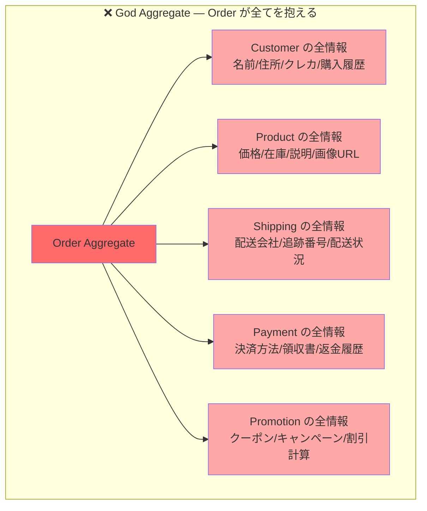
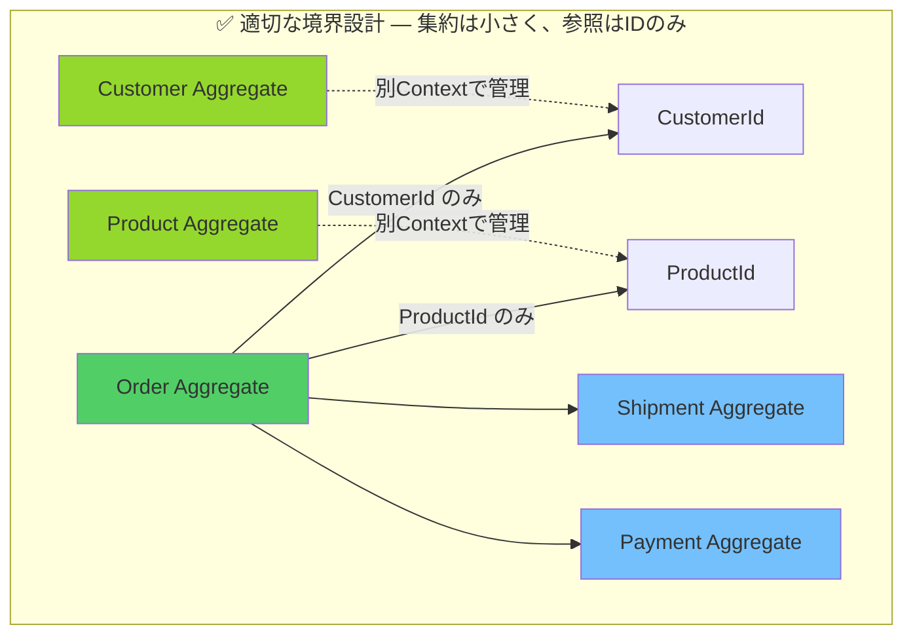
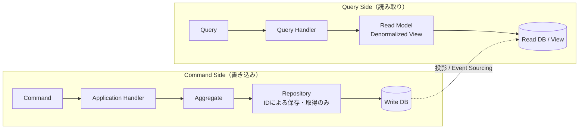
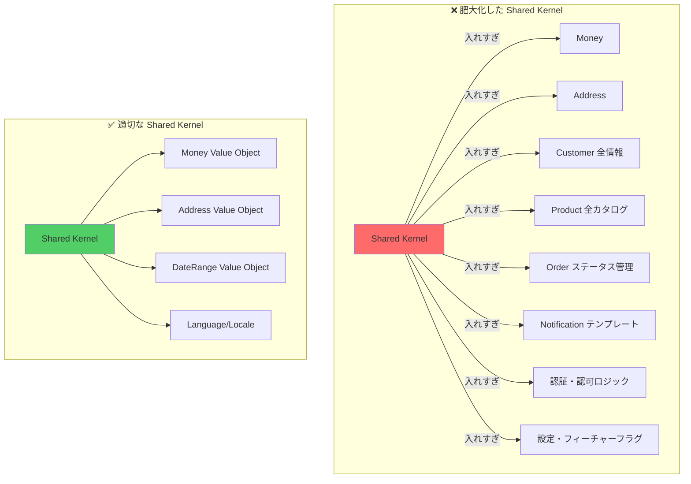
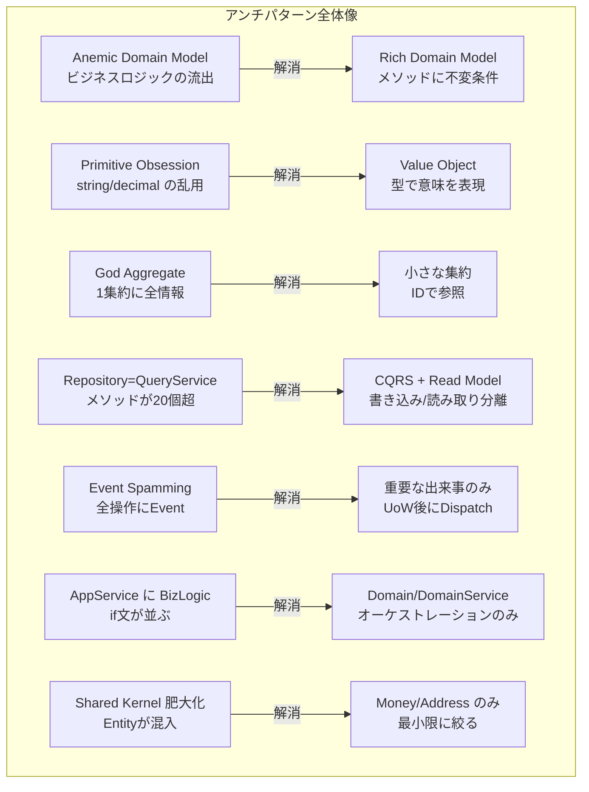

# 第20章　DDDアンチパターン — 避けるべき設計の落とし穴

---

## TL;DR

1. **Anemic Domain Model（貧血ドメインモデル）** は最も蔓延するアンチパターン。エンティティが「データの入れ物」に成り下がり、ビジネスロジックが Application Service や Service クラスに散乱する。
2. **Primitive Obsession（プリミティブ執着）** は見えにくいが致命的。`string email` や `decimal amount` は型システムでドメインルールを表現できず、バグの温床となる。
3. **God Aggregate（神様集約）** はトランザクション境界の設計ミス。1つの集約に過多なデータを持たせると、ロックの競合とパフォーマンス劣化が同時に発生する。
4. **Repository をクエリサービス扱い** すると、リポジトリにクエリメソッドが無制限増殖する。CQRS と Read Model を組み合わせ、書き込み用と読み取り用を分離する。
5. **ビジネスロジックの流出（Application Service / Domain Event への混入）** は、ドメイン層のテスト可能性を破壊し、コードベース全体を脆くする。

---

## はじめに — アンチパターンを学ぶ価値

DDD（Domain-Driven Design）は、Eric Evans の著書『Domain-Driven Design: Tackling Complexity in the Heart of Software』（2003年）によって体系化されたソフトウェア設計哲学です。その後 Vaughn Vernon の『Implementing Domain-Driven Design』や『Domain-Driven Design Distilled』によって実践レベルに落とし込まれました。

しかし、20年以上の歴史を持つ今日でも、DDDを採用したプロジェクトの多くが「名前だけDDD」の状態に陥ります。Entity や Repository というクラス名が付いているのに、実態はトランザクションスクリプトのコードが並ぶ——これがDDDの「形だけ真似た」失敗例の典型です。

アンチパターンを知ることは、正しいパターンを知ることと同じくらい重要です。本章では、現場で繰り返し観察される7つの主要アンチパターンと、その具体的な解消方法をC# .NET 9のコードとともに解説します。

---

## 1. Anemic Domain Model（貧血ドメインモデル）

### 1.1 Martin Fowlerの定義と批判

Martin Fowlerは2003年のブログ記事「AnemicDomainModel」で、このアンチパターンを次のように定義しました。

> 「貧血ドメインモデルとは、ドメインオブジェクトがほとんどすべてのビジネスロジックを持たず、getter/setterのみで構成されているものだ。それはオブジェクト指向の基本原則——データとふるまいを一体として持つ——に反している。」

Fowlerはさらに続けます。「これはアンチパターンであり、根本的なオブジェクト指向設計の違反だ。にもかかわらず、この手法は広く普及している。それは、一見モデルのように見えるからだ——クラスに名前が付けられ、ドメインエンティティのリレーションも存在する。しかし実際にそのオブジェクトで何かしようとすると、すべてのビジネスロジックはServiceクラスの中にしかない。」

### 1.2 症状チェックリスト（8項目）

以下の項目に多く当てはまるほど、貧血ドメインモデルの疑いが濃くなります。

| # | 症状 | 例 |
|---|------|----|
| 1 | エンティティのメソッドがほとんどすべて getter/setter | `order.Status = OrderStatus.Confirmed` |
| 2 | ビジネスルールの検証がService層に集中している | `OrderService.ValidateCanShip(order)` |
| 3 | エンティティのプロパティがすべて `public set` | `public decimal TotalAmount { get; set; }` |
| 4 | ドメインオブジェクトを単体でテストできない（Serviceと一体でしかテストできない） | 単体テストがDBに依存する |
| 5 | 同じビジネスルールが複数のServiceに重複している | 「注文確認できる条件」が3箇所に散在 |
| 6 | Application ServiceのメソッドがSQLのようにステップを並べているだけ | `order.Status = X; order.UpdatedAt = now; ...` |
| 7 | エンティティのフィールドが増えるたびにServiceのロジックも増える | カラム追加のたびにService変更 |
| 8 | 集約の不変条件（invariant）を文書化できない | 「Orderが有効な状態とは何か」が定義不能 |

### 1.3 Before — 貧血ドメインモデルの例

```csharp
// ❌ Before: Order は getter/setter の入れ物に過ぎない
namespace ECommerce.Domain;

public class Order
{
    public Guid Id { get; set; }
    public Guid CustomerId { get; set; }
    public OrderStatus Status { get; set; }
    public decimal TotalAmount { get; set; }
    public List<OrderItem> Items { get; set; } = [];
    public DateTime CreatedAt { get; set; }
    public DateTime? ShippedAt { get; set; }
    public string? CancellationReason { get; set; }
}

public class OrderItem
{
    public Guid Id { get; set; }
    public Guid ProductId { get; set; }
    public int Quantity { get; set; }
    public decimal UnitPrice { get; set; }
}

public enum OrderStatus { Pending, Confirmed, Shipped, Cancelled }
```

```csharp
// ❌ Before: ビジネスロジックが Application Service に漏出している
namespace ECommerce.Application;

public class OrderService(
    IOrderRepository orderRepository,
    IProductRepository productRepository,
    IEventPublisher eventPublisher)
{
    public async Task ConfirmOrderAsync(Guid orderId)
    {
        var order = await orderRepository.FindByIdAsync(orderId)
            ?? throw new NotFoundException(orderId);

        // ビジネスルールが Application Service に散在
        if (order.Status != OrderStatus.Pending)
            throw new InvalidOperationException("保留中の注文のみ確認できます");

        if (order.Items.Count == 0)
            throw new InvalidOperationException("アイテムが空の注文は確認できません");

        if (order.TotalAmount <= 0)
            throw new InvalidOperationException("合計金額が不正です");

        // 在庫チェックのロジックもここに
        foreach (var item in order.Items)
        {
            var product = await productRepository.FindByIdAsync(item.ProductId)
                ?? throw new NotFoundException(item.ProductId);

            if (product.StockQuantity < item.Quantity)
                throw new InvalidOperationException(
                    $"商品 {product.Name} の在庫が不足しています");
        }

        // 状態更新がベタ書き
        order.Status = OrderStatus.Confirmed;

        await orderRepository.SaveAsync(order);
        await eventPublisher.PublishAsync(new OrderConfirmedEvent(order.Id));
    }

    public async Task CancelOrderAsync(Guid orderId, string reason)
    {
        var order = await orderRepository.FindByIdAsync(orderId)
            ?? throw new NotFoundException(orderId);

        // 同じルールチェックが再実装されている
        if (order.Status == OrderStatus.Shipped)
            throw new InvalidOperationException("出荷済みの注文はキャンセルできません");

        if (order.Status == OrderStatus.Cancelled)
            throw new InvalidOperationException("すでにキャンセル済みです");

        order.Status = OrderStatus.Cancelled;
        order.CancellationReason = reason;

        await orderRepository.SaveAsync(order);
    }
}
```

### 1.4 After — ビジネスロジックをドメインに戻す

```csharp
// ✅ After: Order がビジネスロジックを持つリッチドメインモデル
namespace ECommerce.Domain;

public sealed class Order
{
    private readonly List<OrderItem> _items = [];

    // コンストラクタは private — ファクトリメソッド経由で生成を強制
    private Order(Guid id, CustomerId customerId)
    {
        Id = id;
        CustomerId = customerId;
        Status = OrderStatus.Pending;
        CreatedAt = DateTime.UtcNow;
    }

    public Guid Id { get; }
    public CustomerId CustomerId { get; }
    public OrderStatus Status { get; private set; }
    public IReadOnlyList<OrderItem> Items => _items.AsReadOnly();
    public Money TotalAmount => Money.Sum(_items.Select(i => i.SubTotal));
    public DateTime CreatedAt { get; }
    public DateTime? ShippedAt { get; private set; }
    public string? CancellationReason { get; private set; }

    // ドメインイベントはエンティティ自身が発行
    private readonly List<IDomainEvent> _domainEvents = [];
    public IReadOnlyList<IDomainEvent> DomainEvents => _domainEvents.AsReadOnly();

    // ファクトリメソッド — 生成時の不変条件を保証
    public static Order Create(CustomerId customerId)
    {
        ArgumentNullException.ThrowIfNull(customerId);
        return new Order(Guid.NewGuid(), customerId);
    }

    // アイテム追加 — ビジネスルールをメソッドに封じ込める
    public void AddItem(ProductId productId, int quantity, Money unitPrice)
    {
        if (Status != OrderStatus.Pending)
            throw new DomainException("保留中の注文にのみアイテムを追加できます");

        if (quantity <= 0)
            throw new DomainException("数量は1以上である必要があります");

        var existingItem = _items.FirstOrDefault(i => i.ProductId == productId);
        if (existingItem is not null)
        {
            existingItem.IncreaseQuantity(quantity);
        }
        else
        {
            _items.Add(OrderItem.Create(productId, quantity, unitPrice));
        }
    }

    // 確認 — ルールがすべてドメインオブジェクト内に閉じている
    public void Confirm()
    {
        EnsureStatus(OrderStatus.Pending, "保留中の注文のみ確認できます");

        if (_items.Count == 0)
            throw new DomainException("アイテムが空の注文は確認できません");

        if (TotalAmount <= Money.Zero)
            throw new DomainException("合計金額が不正です");

        Status = OrderStatus.Confirmed;
        _domainEvents.Add(new OrderConfirmedEvent(Id, CustomerId, TotalAmount));
    }

    // キャンセル — 不変条件の保護がメソッドに集約
    public void Cancel(string reason)
    {
        if (Status == OrderStatus.Cancelled)
            throw new DomainException("すでにキャンセル済みです");

        EnsureNotStatus(OrderStatus.Shipped, "出荷済みの注文はキャンセルできません");

        Status = OrderStatus.Cancelled;
        CancellationReason = reason;
        _domainEvents.Add(new OrderCancelledEvent(Id, reason));
    }

    public void MarkAsShipped()
    {
        EnsureStatus(OrderStatus.Confirmed, "確認済みの注文のみ出荷できます");
        Status = OrderStatus.Shipped;
        ShippedAt = DateTime.UtcNow;
        _domainEvents.Add(new OrderShippedEvent(Id, ShippedAt.Value));
    }

    public void ClearDomainEvents() => _domainEvents.Clear();

    private void EnsureStatus(OrderStatus expected, string message)
    {
        if (Status != expected) throw new DomainException(message);
    }

    private void EnsureNotStatus(OrderStatus forbidden, string message)
    {
        if (Status == forbidden) throw new DomainException(message);
    }
}
```

```csharp
// ✅ After: Application Service はオーケストレーションのみ
namespace ECommerce.Application;

public class OrderApplicationService(
    IOrderRepository orderRepository,
    IProductRepository productRepository,
    IUnitOfWork unitOfWork)
{
    public async Task ConfirmOrderAsync(ConfirmOrderCommand command)
    {
        var order = await orderRepository.FindByIdAsync(command.OrderId)
            ?? throw new NotFoundException(command.OrderId);

        // 在庫チェックはドメインサービスが担う（在庫はOrderの外にある）
        await stockDomainService.EnsureSufficientStockAsync(order);

        // ビジネスロジックはOrderオブジェクト自身が持つ
        order.Confirm();

        await unitOfWork.CommitAsync(); // ドメインイベントの発行もここで行う
    }
}
```

### 1.5 Transaction Script との違い

「貧血ドメインモデル」と「トランザクションスクリプト」は混同されがちですが、本質的に異なります。

```
トランザクションスクリプト:
  - そもそもドメインオブジェクトを作る意図がない
  - ビジネスロジックをプロシージャ（メソッド）に直書きする
  - シンプルなCRUDに適している
  - Martin Fowlerも「シンプルな問題には良い選択」と述べている

貧血ドメインモデル:
  - DDDを採用しようとして失敗した形
  - ドメインオブジェクト（Entity/Aggregate）は存在するがデータだけ持つ
  - ビジネスロジックがServiceに漏れ出している
  - DDDの恩恵（カプセル化、不変条件の保護、テスタビリティ）を得られない
  - 「最悪の両立」— DDDの複雑さとトランザクションスクリプトの限界を同時に抱える
```

### 1.6 EF Core で起きやすい理由

Entity Framework Core は既定では **public setter** を要求しがちです。これが貧血ドメインモデルを誘発します。

```csharp
// ❌ EF Core の既定的な書き方（貧血モデルへの誘引）
public class Order
{
    public Guid Id { get; set; }           // EFがIDをセットするため
    public OrderStatus Status { get; set; } // EFが状態を復元するため
    public List<OrderItem> Items { get; set; } = []; // ナビゲーションプロパティ
}

// ✅ EF Core でもリッチドメインモデルを保つ — Owned Types + Shadow Properties
public class OrderConfiguration : IEntityTypeConfiguration<Order>
{
    public void Configure(EntityTypeBuilder<Order> builder)
    {
        builder.HasKey(o => o.Id);

        // private setter を持つプロパティはバッキングフィールドで対応
        builder.Property(o => o.Status)
            .HasConversion<string>()
            .HasField("_status"); // private フィールドをバッキングとして使用

        // コレクションのナビゲーションも private フィールド経由
        builder.HasMany(o => o.Items)
            .WithOne()
            .HasForeignKey("OrderId");

        builder.Metadata
            .FindNavigation(nameof(Order.Items))!
            .SetPropertyAccessMode(PropertyAccessMode.Field);
    }
}
```

---

## 2. Primitive Obsession（プリミティブ執着）

### 2.1 string/int/decimal が意味を持てない問題

プリミティブ型（`string`, `int`, `decimal`, `Guid`）は汎用の入れ物です。しかしビジネスドメインでは、「メールアドレスである文字列」と「商品名である文字列」は全く異なる意味を持ちます。型システムでこれを区別しなければ、コンパイラはバグを検出できません。

```
問題: decimal amount は何の金額か？
  - 日本円か？ドルか？
  - 消費税込みか？税抜きか？
  - 負の値を取りうるか？
  - 0は有効か？

プリミティブ型はこれらの疑問に答えられない。
```

### 2.2 バグ事例 — 通貨を間違えて加算

```csharp
// ❌ Before: 通貨の混在バグが型システムで検出できない
public class Cart
{
    public decimal TotalJpy { get; set; }   // 日本円
    public decimal TotalUsd { get; set; }   // 米ドル

    // バグ: 円とドルを足してしまっても型エラーにならない
    public decimal GetTotal() => TotalJpy + TotalUsd; // ¥10,000 + $100 = 10,100 ???
}

// さらに深刻: 引数の順序を間違えてもコンパイルエラーにならない
public void ProcessPayment(decimal amount, string currency, string email, string userId)
{ ... }

// 呼び出し元でミスが起きやすい
ProcessPayment(100.0m, "user@example.com", "USD", "user-001"); // 引数が逆！
```

```csharp
// ❌ Before: バリデーションが呼び出し側に散乱
public class CustomerService
{
    public async Task RegisterAsync(string email, string name)
    {
        // バリデーションがサービスに書かれている
        if (string.IsNullOrWhiteSpace(email))
            throw new ArgumentException("メールアドレスは必須です");

        if (!email.Contains('@'))
            throw new ArgumentException("メールアドレスの形式が不正です");

        if (email.Length > 254)
            throw new ArgumentException("メールアドレスが長すぎます");

        // 同じバリデーションがOrderServiceにも書かれている...
    }
}
```

### 2.3 After — Value Object で型安全性を保証

```csharp
// ✅ After: EmailAddress Value Object
namespace ECommerce.Domain.ValueObjects;

public sealed record EmailAddress
{
    public string Value { get; }

    private EmailAddress(string value) => Value = value;

    public static EmailAddress Create(string value)
    {
        if (string.IsNullOrWhiteSpace(value))
            throw new DomainException("メールアドレスは必須です");

        // RFC 5321 準拠の簡易チェック
        var trimmed = value.Trim().ToLowerInvariant();
        if (!trimmed.Contains('@') || trimmed.Length > 254)
            throw new DomainException($"メールアドレスの形式が不正です: {value}");

        var atIndex = trimmed.IndexOf('@');
        if (atIndex == 0 || atIndex == trimmed.Length - 1)
            throw new DomainException($"メールアドレスの形式が不正です: {value}");

        return new EmailAddress(trimmed);
    }

    public static implicit operator string(EmailAddress email) => email.Value;
    public override string ToString() => Value;
}
```

```csharp
// ✅ After: Money Value Object — 通貨の混在を型で防ぐ
namespace ECommerce.Domain.ValueObjects;

public sealed record Money(decimal Amount, Currency Currency)
{
    public static readonly Money Zero = new(0m, Currency.JPY);

    public static Money Of(decimal amount, Currency currency)
    {
        if (amount < 0)
            throw new DomainException("金額は0以上である必要があります");

        return new Money(amount, currency);
    }

    public Money Add(Money other)
    {
        if (Currency != other.Currency)
            throw new DomainException(
                $"異なる通貨は加算できません: {Currency} vs {other.Currency}");

        return new Money(Amount + other.Amount, Currency);
    }

    public Money Multiply(int quantity)
    {
        if (quantity < 0)
            throw new DomainException("数量は0以上である必要があります");

        return new Money(Amount * quantity, Currency);
    }

    public static Money Sum(IEnumerable<Money> monies)
    {
        var list = monies.ToList();
        if (list.Count == 0) return Zero;

        var currency = list[0].Currency;
        var total = list.Aggregate(0m, (sum, m) =>
        {
            if (m.Currency != currency)
                throw new DomainException("異なる通貨を合算しようとしました");
            return sum + m.Amount;
        });

        return new Money(total, currency);
    }

    public static bool operator >(Money left, Money right)
    {
        EnsureSameCurrency(left, right);
        return left.Amount > right.Amount;
    }

    public static bool operator <=(Money left, Money right)
    {
        EnsureSameCurrency(left, right);
        return left.Amount <= right.Amount;
    }

    private static void EnsureSameCurrency(Money left, Money right)
    {
        if (left.Currency != right.Currency)
            throw new DomainException($"通貨が一致しません: {left.Currency} vs {right.Currency}");
    }

    public override string ToString() => $"{Amount:N0} {Currency}";
}

public enum Currency { JPY, USD, EUR }
```

```csharp
// ✅ After: 型安全になった呼び出し
var email = EmailAddress.Create("user@example.com");
var price = Money.Of(10_000m, Currency.JPY);
var quantity = new Quantity(3); // 負の数量をコンパイル時に防止

// 通貨の混在は型エラー（コンパイルエラー）として検出される
var jpy = Money.Of(10_000m, Currency.JPY);
var usd = Money.Of(100m, Currency.USD);
var wrong = jpy.Add(usd); // ← DomainException（実行時に確実に検出）
```

### 2.4 その他の Value Object 例

```csharp
// ✅ Quantity — 負の値や0を防ぐ
public sealed record Quantity
{
    public int Value { get; }

    public Quantity(int value)
    {
        if (value <= 0)
            throw new DomainException($"数量は1以上である必要があります: {value}");
        Value = value;
    }

    public Quantity Add(Quantity other) => new(Value + other.Value);
    public bool ExceedsStock(int stockLevel) => Value > stockLevel;
    public static implicit operator int(Quantity q) => q.Value;
}

// ✅ OrderId — GuidのラッパーでIDの混在を防ぐ
public readonly record struct OrderId(Guid Value)
{
    public static OrderId NewId() => new(Guid.NewGuid());
    public static OrderId Parse(string s) => new(Guid.Parse(s));
    public override string ToString() => Value.ToString();
}

// ProductIdとOrderIdの混在はコンパイルエラー
// void DoSomething(OrderId orderId) { ... }
// DoSomething(new ProductId(someGuid)); // ← コンパイルエラー ✅
```

---

## 3. God Aggregate（神様集約）

### 3.1 症状と問題





### 3.2 Before — God Aggregate の失敗例

```csharp
// ❌ Before: Order が Customer と Product の全情報を含む
namespace ECommerce.Domain;

public class Order
{
    public Guid Id { get; set; }

    // Customer の全情報を Order に埋め込む — 変更が困難になる
    public Guid CustomerId { get; set; }
    public string CustomerName { get; set; } = "";
    public string CustomerEmail { get; set; } = "";
    public string CustomerPhone { get; set; } = "";
    public string CustomerAddress { get; set; } = "";
    public string CustomerPostalCode { get; set; } = "";
    public string CustomerPrefecture { get; set; } = "";
    public CreditCard CustomerCreditCard { get; set; } = null!;
    public List<OrderHistory> CustomerOrderHistory { get; set; } = [];
    public CustomerTier CustomerTier { get; set; }
    public decimal CustomerLoyaltyPoints { get; set; }

    // Order Items — Product の全情報を含む
    public List<OrderItemWithFullProduct> Items { get; set; } = [];

    // 在庫情報も持つ（在庫変動のたびにOrderが汚染される）
    public Dictionary<Guid, int> ProductStockSnapshot { get; set; } = [];

    // 配送情報も全て
    public string ShippingCarrier { get; set; } = "";
    public string TrackingNumber { get; set; } = "";
    public DateTime? EstimatedDelivery { get; set; }
    public List<ShippingStatusUpdate> ShippingHistory { get; set; } = [];

    // 決済情報も全て
    public string PaymentMethod { get; set; } = "";
    public string PaymentTransactionId { get; set; } = "";
    public List<Refund> Refunds { get; set; } = [];
}

public class OrderItemWithFullProduct
{
    public Guid ProductId { get; set; }
    public string ProductName { get; set; } = "";
    public string ProductDescription { get; set; } = "";
    public string ProductCategory { get; set; } = "";
    public string ProductImageUrl { get; set; } = "";
    public decimal ProductWeight { get; set; }
    public Dictionary<string, string> ProductAttributes { get; set; } = [];
    public int Quantity { get; set; }
    public decimal UnitPrice { get; set; }
}
```

### 3.3 After — 小さな集約と IDによる参照

```csharp
// ✅ After: Order は最小限の情報のみ持ち、他はIDで参照する
namespace ECommerce.Domain.Orders;

public sealed class Order
{
    private readonly List<OrderItem> _items = [];

    private Order(OrderId id, CustomerId customerId, ShippingAddress shippingAddress)
    {
        Id = id;
        CustomerId = customerId;
        // 注文時点の配送先住所はスナップショットとして保持（Customer住所変更に影響されない）
        ShippingAddress = shippingAddress;
        Status = OrderStatus.Pending;
        CreatedAt = DateTime.UtcNow;
    }

    public OrderId Id { get; }
    public CustomerId CustomerId { get; }          // ← IDのみ。Customer全体は含まない
    public ShippingAddress ShippingAddress { get; } // ← 注文時のスナップショット
    public OrderStatus Status { get; private set; }
    public IReadOnlyList<OrderItem> Items => _items.AsReadOnly();
    public Money TotalAmount => Money.Sum(_items.Select(i => i.SubTotal));
    public DateTime CreatedAt { get; }

    public static Order Place(
        CustomerId customerId,
        ShippingAddress shippingAddress)
    {
        return new Order(OrderId.NewId(), customerId, shippingAddress);
    }

    public void AddItem(ProductId productId, int quantity, Money unitPrice)
    {
        if (Status != OrderStatus.Pending)
            throw new DomainException("保留中の注文にのみ追加できます");

        _items.Add(OrderItem.Create(productId, new Quantity(quantity), unitPrice));
    }
    // ...
}

// ✅ OrderItem も ID のみで Product を参照
public sealed class OrderItem
{
    private OrderItem(ProductId productId, Quantity quantity, Money unitPrice)
    {
        Id = Guid.NewGuid();
        ProductId = productId;   // ← Product の ID のみ
        Quantity = quantity;
        UnitPrice = unitPrice;
    }

    public Guid Id { get; }
    public ProductId ProductId { get; }   // IDのみ。Product全体は含まない
    public Quantity Quantity { get; private set; }
    public Money UnitPrice { get; }
    public Money SubTotal => UnitPrice.Multiply(Quantity.Value);

    public static OrderItem Create(ProductId productId, Quantity quantity, Money unitPrice)
        => new(productId, quantity, unitPrice);

    public void IncreaseQuantity(int additionalQuantity)
        => Quantity = Quantity.Add(new Quantity(additionalQuantity));
}
```

### 3.4 パフォーマンスへの影響

God Aggregateは、パフォーマンス上も深刻な問題を引き起こします。

```
ロックの競合（Concurrency Conflict）:
  - 大きな集約は多くのフィールドを含む
  - 異なる操作（注文確認、配送更新、返金処理）が同一集約を変更しようとする
  - 楽観的同時実行制御（RowVersion）のコンフリクト率が激増
  - 悲観的ロックを使えば、スループットが壊滅的に低下する

読み取りパフォーマンス:
  - Order を1件取得するだけで、Customer/Product/Shipping/Payment の全情報をJOIN
  - 画面表示に必要なフィールドは全体の10%未満でも、100%をロードする
  - EF Core の Include() が深くなり、生成SQLが巨大化する
```

```csharp
// ❌ God Aggregate を EF Core で読み込む — パフォーマンス問題
var order = await context.Orders
    .Include(o => o.Customer)
        .ThenInclude(c => c.OrderHistory) // 全履歴をロード
    .Include(o => o.Items)
        .ThenInclude(i => i.Product)
            .ThenInclude(p => p.Category)
            .ThenInclude(p => p.Images) // 商品画像も全ロード
    .Include(o => o.ShippingHistory)    // 全配送履歴をロード
    .Include(o => o.Refunds)            // 全返金履歴をロード
    .FirstOrDefaultAsync(o => o.Id == orderId);
```

---

## 4. Repository をクエリサービス扱いする

### 4.1 メソッド増殖の症状

```csharp
// ❌ Bad Repository — クエリメソッドが無制限に増える
namespace ECommerce.Infrastructure;

public class OrderRepository : IOrderRepository
{
    // 集約の取得（正当なリポジトリの責務）
    public Task<Order?> FindByIdAsync(OrderId id) { ... }

    // ここからがアンチパターン — 画面ごとにメソッドが生える
    public Task<List<Order>> FindByCustomerIdAsync(CustomerId customerId) { ... }
    public Task<List<Order>> FindByStatusAsync(OrderStatus status) { ... }
    public Task<List<Order>> FindByCustomerIdAndStatusAsync(CustomerId customerId, OrderStatus status) { ... }
    public Task<List<Order>> FindByDateRangeAsync(DateTime from, DateTime to) { ... }
    public Task<List<Order>> FindByCustomerIdAndDateRangeAsync(CustomerId customerId, DateTime from, DateTime to) { ... }
    public Task<List<Order>> FindPendingOrdersOlderThanAsync(TimeSpan age) { ... }
    public Task<List<Order>> FindByCustomerAndStatusAndDateRangeAsync(
        CustomerId customerId, OrderStatus status, DateTime from, DateTime to) { ... }
    public Task<decimal> GetTotalRevenueByDateRangeAsync(DateTime from, DateTime to) { ... }
    public Task<int> CountOrdersByStatusAsync(OrderStatus status) { ... }
    public Task<List<Order>> FindTopOrdersByAmountAsync(int top) { ... }
    public Task<List<OrderSummaryDto>> GetOrderSummariesAsync() { ... } // ← DTO が返り始める
    public Task<OrderDashboardData> GetDashboardDataAsync() { ... }      // ← 集計データも入る
    // ... さらに20個
}
```

### 4.2 Specification パターンとの対比

```csharp
// ✅ Better: Specification パターンで条件を組み合わせる
namespace ECommerce.Domain.Orders.Specifications;

public abstract class OrderSpecification
{
    public abstract IQueryable<Order> Apply(IQueryable<Order> query);

    public OrderSpecification And(OrderSpecification other)
        => new AndSpecification(this, other);
}

public sealed class OrderByCustomerSpec(CustomerId customerId) : OrderSpecification
{
    public override IQueryable<Order> Apply(IQueryable<Order> query)
        => query.Where(o => o.CustomerId == customerId);
}

public sealed class OrderByStatusSpec(OrderStatus status) : OrderSpecification
{
    public override IQueryable<Order> Apply(IQueryable<Order> query)
        => query.Where(o => o.Status == status);
}

public sealed class OrderByDateRangeSpec(DateTime from, DateTime to) : OrderSpecification
{
    public override IQueryable<Order> Apply(IQueryable<Order> query)
        => query.Where(o => o.CreatedAt >= from && o.CreatedAt <= to);
}

// 使用例: 組み合わせて柔軟なクエリを実現
var spec = new OrderByCustomerSpec(customerId)
    .And(new OrderByStatusSpec(OrderStatus.Pending))
    .And(new OrderByDateRangeSpec(DateTime.Today.AddDays(-30), DateTime.Today));

var orders = await orderRepository.FindBySpecificationAsync(spec);
```

### 4.3 CQRS / Read Model への誘導



```csharp
// ✅ Best: CQRS — 読み取り用の Query Handler と Read Model を分離
namespace ECommerce.Application.Orders.Queries;

// Read Model — 画面表示用に最適化されたDTO
public sealed record OrderListItemDto(
    Guid Id,
    string CustomerName,
    string Status,
    decimal TotalAmount,
    string Currency,
    DateTime CreatedAt,
    int ItemCount);

// Query — 検索条件を表すオブジェクト
public sealed record GetOrderListQuery(
    Guid? CustomerId,
    string? Status,
    DateTime? FromDate,
    DateTime? ToDate,
    int Page = 1,
    int PageSize = 20);

// Query Handler — リポジトリを使わず、DBに直接クエリ
public sealed class GetOrderListQueryHandler(IDbConnection connection)
{
    public async Task<PagedResult<OrderListItemDto>> HandleAsync(GetOrderListQuery query)
    {
        // Dapper や EF Core の AsNoTracking で最適化されたクエリを実行
        var sql = BuildSql(query);
        var results = await connection.QueryAsync<OrderListItemDto>(sql, query);
        return new PagedResult<OrderListItemDto>(results.ToList(), query.Page, query.PageSize);
    }

    private static string BuildSql(GetOrderListQuery query)
    {
        var conditions = new List<string>();
        if (query.CustomerId.HasValue)
            conditions.Add("o.customer_id = @CustomerId");
        if (!string.IsNullOrEmpty(query.Status))
            conditions.Add("o.status = @Status");
        if (query.FromDate.HasValue)
            conditions.Add("o.created_at >= @FromDate");
        if (query.ToDate.HasValue)
            conditions.Add("o.created_at <= @ToDate");

        var where = conditions.Count > 0
            ? $"WHERE {string.Join(" AND ", conditions)}"
            : "";

        return $"""
            SELECT
                o.id,
                c.name AS customer_name,
                o.status,
                o.total_amount,
                o.currency,
                o.created_at,
                COUNT(oi.id) AS item_count
            FROM orders o
            JOIN customers c ON c.id = o.customer_id
            JOIN order_items oi ON oi.order_id = o.id
            {where}
            GROUP BY o.id, c.name, o.status, o.total_amount, o.currency, o.created_at
            ORDER BY o.created_at DESC
            LIMIT @PageSize OFFSET @Offset
            """;
    }
}
```

---

## 5. Domain Event の乱用・誤用

### 5.1 Event Spamming（すべての操作にEventを付ける）

```csharp
// ❌ Bad: すべての操作にEventを発行する
public sealed class Order
{
    public void UpdateCustomerName(string name)
    {
        CustomerName = name;
        // 名前更新ごとにEventを発行？ほとんどのリスナーが不要
        _events.Add(new CustomerNameUpdatedOnOrderEvent(Id, name));
    }

    public void AddNote(string note)
    {
        Notes.Add(note);
        // メモ追加にEvent？
        _events.Add(new NoteAddedToOrderEvent(Id, note));
    }

    public void UpdateLastModifiedTimestamp()
    {
        LastModified = DateTime.UtcNow;
        // タイムスタンプ更新でEvent？
        _events.Add(new OrderTimestampUpdatedEvent(Id, LastModified));
    }
}
```

**判断基準**: ドメインイベントは「ビジネス的に重要な出来事」のみに絞るべきです。

```
✅ Domain Event にすべきもの:
  - OrderConfirmed（注文が確認された）
  - OrderShipped（注文が出荷された）
  - OrderCancelled（注文がキャンセルされた）
  - PaymentFailed（決済が失敗した）
  - StockDepleted（在庫が枯渇した）

❌ Domain Event にすべきでないもの:
  - OrderLastModifiedTimestampUpdated
  - OrderNoteAdded（ビジネスサイドへの影響がない）
  - OrderViewedByAdmin（読み取り操作）
```

### 5.2 Event の発行タイミングの誤り（Dispatcher の前後問題）

```csharp
// ❌ Bad: Eventをドメインオブジェクト内で即発行する（副作用が制御できない）
public sealed class Order
{
    private readonly IEventPublisher _publisher; // ← ドメインオブジェクトがインフラに依存

    public async Task ConfirmAsync()
    {
        Status = OrderStatus.Confirmed;
        // DBに保存される前にEventが発行される可能性
        // → リスナーがDBを参照すると古いデータを見る
        await _publisher.PublishAsync(new OrderConfirmedEvent(Id));
    }
}
```

```csharp
// ✅ Good: Eventはドメインオブジェクトが蓄積し、UoW CommitAfterでDispatch
public sealed class Order
{
    private readonly List<IDomainEvent> _events = [];

    public void Confirm()
    {
        Status = OrderStatus.Confirmed;
        // Eventを蓄積するだけ — 即発行しない
        _events.Add(new OrderConfirmedEvent(Id, CustomerId, TotalAmount));
    }
}

// UnitOfWork が Commit 後に Event を Dispatch する
public sealed class UnitOfWork(
    AppDbContext context,
    IEventDispatcher eventDispatcher) : IUnitOfWork
{
    public async Task CommitAsync(CancellationToken ct = default)
    {
        // 1. まず全変更をDBに保存（ここでトランザクションが完了）
        await context.SaveChangesAsync(ct);

        // 2. DBへの書き込みが確定してからEventをDispatch
        var aggregates = context.ChangeTracker
            .Entries<IAggregateRoot>()
            .Select(e => e.Entity)
            .Where(a => a.DomainEvents.Any())
            .ToList();

        var events = aggregates.SelectMany(a => a.DomainEvents).ToList();
        aggregates.ForEach(a => a.ClearDomainEvents());

        foreach (var @event in events)
            await eventDispatcher.DispatchAsync(@event, ct);
    }
}
```

### 5.3 Eventに集約の全フィールドを含める

```csharp
// ❌ Bad: Event に全フィールドを含めると、Event が肥大化し変更に弱くなる
public sealed record OrderConfirmedEvent(
    Guid OrderId,
    string CustomerName,      // ← Event Consumer が本当に必要?
    string CustomerEmail,
    string CustomerAddress,
    string CustomerPostalCode,
    List<OrderItemSnapshot> AllItems,  // ← 全アイテムのスナップショット
    decimal TotalAmount,
    string PaymentMethod,
    string ShippingCarrier,
    // ... 30フィールド
    DateTime ConfirmedAt) : IDomainEvent;

// ✅ Good: Event には「何が起きたか」を最小限で表現する
// Consumer が詳細を必要とするなら、Query Side から取得する
public sealed record OrderConfirmedEvent(
    OrderId OrderId,
    CustomerId CustomerId,
    Money TotalAmount,
    DateTime ConfirmedAt) : IDomainEvent;
```

---

## 6. Application Service にビジネスロジックを書く

### 6.1 Application Service の正しい責務

Application Service（UseCase とも呼ばれる）の責務は **オーケストレーション** です。

```
Application Service の正しい責務:
  ✅ リポジトリから集約を取得する
  ✅ ドメインオブジェクトのメソッドを呼び出す（ビジネスルールの実行を委譲）
  ✅ UnitOfWork で変更をコミットする
  ✅ Event の Dispatch（UoW 経由）
  ✅ DTO への変換

Application Service がやってはいけないこと:
  ❌ ビジネスルールの検証（if Status != Confirmed...）
  ❌ 集約の不変条件チェック
  ❌ ドメイン計算（割引計算、税計算）
  ❌ 複雑な条件分岐（ビジネス判断を含むもの）
```

### 6.2 Before — ビジネスロジックが漏れた例

```csharp
// ❌ Before: Application Service にビジネスロジックが混入
namespace ECommerce.Application;

public class OrderApplicationService(
    IOrderRepository orderRepository,
    ICustomerRepository customerRepository)
{
    public async Task ApplyDiscountAsync(Guid orderId, string couponCode)
    {
        var order = await orderRepository.FindByIdAsync(new OrderId(orderId))
            ?? throw new NotFoundException(orderId);

        var customer = await customerRepository.FindByIdAsync(order.CustomerId)
            ?? throw new NotFoundException(order.CustomerId);

        // ❌ 割引計算ロジックが Application Service に書かれている
        decimal discountRate = 0m;

        if (couponCode == "MEMBER10")
            discountRate = 0.10m;
        else if (couponCode == "MEMBER20" && customer.Tier == CustomerTier.Gold)
            discountRate = 0.20m;
        else if (couponCode == "VIP30" && customer.Tier == CustomerTier.Platinum
            && order.TotalAmount.Amount >= 10_000m)
            discountRate = 0.30m;

        if (discountRate == 0m)
            throw new InvalidOperationException("クーポンコードが無効です");

        if (order.Status != OrderStatus.Pending)
            throw new InvalidOperationException("保留中の注文のみ割引を適用できます");

        var discountAmount = order.TotalAmount.Amount * discountRate;
        order.DiscountAmount = discountAmount; // setterで直接変更
        order.FinalAmount = order.TotalAmount.Amount - discountAmount;

        await orderRepository.SaveAsync(order);
    }
}
```

### 6.3 After — ドメイン層に戻す

```csharp
// ✅ After: 割引ロジックをドメインサービスとエンティティに戻す

// ドメインサービス — 複数の集約をまたぐビジネスロジック
namespace ECommerce.Domain.Services;

public sealed class DiscountDomainService
{
    public Discount CalculateDiscount(Order order, Customer customer, CouponCode coupon)
    {
        var eligibleRate = DetermineDiscountRate(customer.Tier, coupon);

        if (eligibleRate == 0m)
            throw new DomainException($"クーポン '{coupon}' は無効またはこのお客様は対象外です");

        if (order.TotalAmount < MinimumOrderAmountForCoupon(coupon))
            throw new DomainException($"このクーポンは¥{MinimumOrderAmountForCoupon(coupon).Amount:N0}以上の注文に適用できます");

        return Discount.Of(eligibleRate, coupon);
    }

    private static decimal DetermineDiscountRate(CustomerTier tier, CouponCode coupon) =>
        (coupon.Value, tier) switch
        {
            ("MEMBER10", _) => 0.10m,
            ("MEMBER20", CustomerTier.Gold) => 0.20m,
            ("MEMBER20", CustomerTier.Platinum) => 0.20m,
            ("VIP30", CustomerTier.Platinum) => 0.30m,
            _ => 0m
        };

    private static Money MinimumOrderAmountForCoupon(CouponCode coupon) =>
        coupon.Value switch
        {
            "VIP30" => Money.Of(10_000m, Currency.JPY),
            _ => Money.Zero
        };
}
```

```csharp
// Order にビジネスロジックを戻す
public sealed class Order
{
    public void ApplyDiscount(Discount discount)
    {
        if (Status != OrderStatus.Pending)
            throw new DomainException("保留中の注文のみ割引を適用できます");

        if (_discount is not null)
            throw new DomainException("割引はすでに適用されています");

        _discount = discount;
        _events.Add(new DiscountAppliedEvent(Id, discount.Rate, discount.CouponCode));
    }

    public Money FinalAmount => _discount is null
        ? TotalAmount
        : TotalAmount.Multiply(1m - _discount.Rate);
}
```

```csharp
// ✅ After: Application Service はオーケストレーションのみ
public sealed class ApplyDiscountCommandHandler(
    IOrderRepository orderRepository,
    ICustomerRepository customerRepository,
    DiscountDomainService discountDomainService,
    IUnitOfWork unitOfWork)
{
    public async Task HandleAsync(ApplyDiscountCommand command)
    {
        var order = await orderRepository.FindByIdAsync(command.OrderId)
            ?? throw new NotFoundException(command.OrderId);

        var customer = await customerRepository.FindByIdAsync(order.CustomerId)
            ?? throw new NotFoundException(order.CustomerId);

        // ドメインサービスに委譲 — Application Service は判断しない
        var discount = discountDomainService.CalculateDiscount(
            order, customer, new CouponCode(command.CouponCode));

        order.ApplyDiscount(discount);

        await unitOfWork.CommitAsync();
    }
}
```

---

## 7. Shared Kernel の過剰使用

### 7.1 「共通化」の名目で肥大化するパターン

Shared Kernel は、複数の Bounded Context が **意図的に共有する** コアの概念です。しかし「共通化」の誘惑により、Shared Kernel があらゆる概念を吸収して肥大化するケースが多発します。



### 7.2 正しい Shared Kernel のスコープ

```csharp
// ✅ Shared Kernel に含めるべきもの — 汎用 Value Object のみ
namespace SharedKernel;

// Money — 複数 Context が通貨計算を必要とする
public sealed record Money(decimal Amount, Currency Currency)
{
    // ... (前述の実装)
}

// Address — 複数 Context が住所を扱う
public sealed record Address(
    string PostalCode,
    string Prefecture,
    string City,
    string Line1,
    string? Line2 = null)
{
    public static Address Create(
        string postalCode, string prefecture, string city, string line1, string? line2 = null)
    {
        if (string.IsNullOrWhiteSpace(postalCode))
            throw new DomainException("郵便番号は必須です");
        if (string.IsNullOrWhiteSpace(prefecture))
            throw new DomainException("都道府県は必須です");
        return new Address(postalCode.Trim(), prefecture.Trim(), city.Trim(), line1.Trim(), line2?.Trim());
    }

    public override string ToString()
        => $"〒{PostalCode} {Prefecture}{City}{Line1}{(Line2 is not null ? $" {Line2}" : "")}";
}

// DateRange — 期間を表す汎用 Value Object
public sealed record DateRange(DateOnly Start, DateOnly End)
{
    public static DateRange Create(DateOnly start, DateOnly end)
    {
        if (end < start)
            throw new DomainException($"終了日({end})は開始日({start})以降でなければなりません");
        return new DateRange(start, end);
    }

    public bool Contains(DateOnly date) => date >= Start && date <= End;
    public bool Overlaps(DateRange other) => Start <= other.End && End >= other.Start;
    public int TotalDays => End.DayNumber - Start.DayNumber + 1;
}
```

```csharp
// ❌ Shared Kernel に含めてはいけないもの

// Customer の全情報 — これは Customer Context の責任
// SharedKernel に Customer を入れると、Customer を参照するすべての Context が
// Customer Context の変更に依存してしまう
namespace SharedKernel; // ← ここに Customer があるとまずい
public class Customer { ... } // ← Shared Kernel に入れてはいけない

// Order ステータスの状態遷移ロジック — Order Context の責任
namespace SharedKernel; // ← ここに OrderStatus の遷移ロジックがあるとまずい
public static class OrderStateMachine { ... } // ← NG

// 認証・認可ロジック — Identity Context の責任
namespace SharedKernel; // ← ここに認証ロジックがあるとまずい
public class AuthorizationService { ... } // ← NG
```

---

## 8. よくある誤り TOP10 一覧表

| # | アンチパターン | 症状 | 解消策 |
|---|--------------|------|--------|
| 1 | Anemic Domain Model | Entityにgetterとsetterしかない | ビジネスメソッドをエンティティに移動 |
| 2 | Primitive Obsession | `string email`, `decimal price` が引数に並ぶ | Value Objectでラップ |
| 3 | God Aggregate | 1つの集約が1,000行を超える | 集約を小さく分割、IDで参照 |
| 4 | Repository がクエリサービス | リポジトリのメソッドが20個を超える | CQRS、Read Modelの分離 |
| 5 | Event Spamming | すべての変更にDomain Eventが発行される | ビジネス的に重要な出来事のみEventに |
| 6 | Application Serviceへのロジック漏出 | Application Serviceにif文が並ぶ | ドメインオブジェクト／ドメインサービスへ移動 |
| 7 | Shared Kernelの肥大化 | Shared KernelにEntity/Serviceが入る | Money/Address/DateRangeのみに絞る |
| 8 | ドメインオブジェクトがインフラに依存 | EntityのコンストラクタにDbContextが入る | 依存を逆転、Infrastructure層に移動 |
| 9 | Bounded Contextを無視したモデル共有 | 全コンテキストが同じUserエンティティを参照 | 各ContextがUser IDのみを持つ |
| 10 | ユビキタス言語の無視 | コードの用語とドメインエキスパートの用語が乖離 | 定期的なEvent Stormingで用語を統一 |

---

## 9. コードレビュー観点（15項目）

DDDを採用したコードのレビューでは、以下の15項目を確認してください。

### 9.1 ドメインモデルの健全性

1. **ビジネスルールの所在**: ビジネス判断を含む条件分岐がApplication ServiceやControllerにないか。`if (order.Status != ...)` がサービス層にあったら要確認。

2. **不変条件の保護**: Entityの状態を変えるメソッドが、事前条件チェックを内包しているか。外部から `entity.Status = X` のように直接setterで状態変更していないか。

3. **コンストラクタとファクトリ**: Entityの生成が `new Entity()` で直接行われていないか。ファクトリメソッドを通じ、生成時の不変条件が保証されているか。

4. **Value Objectの使用**: `string email`, `decimal amount`, `Guid userId` がメソッドシグネチャに並んでいたら、Value Objectに置き換えるべき候補。

5. **集約サイズ**: 1つの集約クラスが500行を超えていたら、集約の分割を検討する。

### 9.2 レイヤー責務の分離

6. **Application Serviceの純粋性**: Application ServiceがDB操作（EF Coreのメソッドへの直接アクセス）を行っていないか。Infrastructure層に委譲されているか。

7. **ドメインのインフラ依存**: DomainエンティティがDbContextやHTTPクライアントなどのインフラを参照していないか。

8. **Repositoryのインターフェース所在**: `IOrderRepository` インターフェースがDomain/Application層に、実装がInfrastructure層に置かれているか。

9. **DTO変換の位置**: Application ServiceがDomain ObjectをDTOに変換しているか（ControllerでEntityを直接シリアライズしていないか）。

### 9.3 Domain Event

10. **Eventの発行タイミング**: Domain EventがドメインオブジェクトのメソッドでListに蓄積され、UnitOfWork Commitの後にDispatchされているか。

11. **Eventの粒度**: EventがビジネスドメインとしてUbiquitous Languageで表現されているか（技術的操作名（`Updated`, `Changed`）になっていないか）。

12. **Eventに含まれる情報**: Eventが必要最小限の情報のみを含んでいるか（集約の全フィールドのスナップショットになっていないか）。

### 9.4 集約の境界

13. **集約間の参照**: 別の集約をナビゲーションプロパティで持っていないか（IDのみで参照しているか）。

14. **トランザクション境界**: 1つのトランザクションで複数の集約を変更していないか（2つ以上の集約を1回のCommitで変更しているなら要検討）。

15. **Shared KernelとBounded Context**: Shared KernelにEntity/Serviceが含まれていないか。各Bounded Contextが適切に隔離されているか。

---

## 10. 演習問題

### 演習1: 貧血ドメインモデルを改善する

**問題**: 以下のコードには複数のアンチパターンが含まれています。何が問題か特定し、改善案を示してください。

```csharp
// 問題のあるコード
public class BankAccount
{
    public Guid Id { get; set; }
    public decimal Balance { get; set; }
    public bool IsActive { get; set; }
    public string AccountNumber { get; set; } = "";
    public string OwnerName { get; set; } = "";
}

public class BankAccountService
{
    public void Deposit(BankAccount account, decimal amount)
    {
        if (!account.IsActive)
            throw new Exception("非アクティブなアカウントです");
        if (amount <= 0)
            throw new Exception("入金額は0より大きい必要があります");

        account.Balance += amount;
    }

    public void Withdraw(BankAccount account, decimal amount)
    {
        if (!account.IsActive)
            throw new Exception("非アクティブなアカウントです");
        if (amount <= 0)
            throw new Exception("出金額は0より大きい必要があります");
        if (account.Balance < amount)
            throw new Exception("残高不足です");

        account.Balance -= amount;
    }

    public void Transfer(BankAccount from, BankAccount to, decimal amount)
    {
        Withdraw(from, amount);
        Deposit(to, amount);
    }
}
```

**解答**:

問題点の列挙:

1. **Anemic Domain Model**: `BankAccount` は getter/setter のみ。`Deposit`/`Withdraw` というビジネスロジックが `BankAccountService` に流出。
2. **Primitive Obsession**: `decimal amount` ——通貨・符号の制約が型で表現されていない。`string accountNumber` ——口座番号の形式検証が型外。
3. **不変条件の保護不足**: `Balance` が `public set` なので外部から `account.Balance = -999999` と書ける。
4. **例外型の問題**: ドメイン例外ではなく `System.Exception` を直接投げている。

```csharp
// ✅ 改善後
namespace Banking.Domain;

public sealed class BankAccount
{
    private Money _balance;

    private BankAccount(AccountNumber number, string ownerName, Money initialBalance)
    {
        Id = Guid.NewGuid();
        Number = number;
        OwnerName = ownerName;
        _balance = initialBalance;
        IsActive = true;
    }

    public Guid Id { get; }
    public AccountNumber Number { get; }
    public string OwnerName { get; }
    public Money Balance => _balance;
    public bool IsActive { get; private set; }

    private readonly List<IDomainEvent> _events = [];
    public IReadOnlyList<IDomainEvent> DomainEvents => _events.AsReadOnly();

    public static BankAccount Open(AccountNumber number, string ownerName, Currency currency)
    {
        if (string.IsNullOrWhiteSpace(ownerName))
            throw new DomainException("口座名義人は必須です");

        return new BankAccount(number, ownerName, Money.Of(0m, currency));
    }

    public void Deposit(Money amount)
    {
        EnsureActive();
        if (amount <= Money.Of(0m, _balance.Currency))
            throw new DomainException("入金額は0より大きい必要があります");

        _balance = _balance.Add(amount);
        _events.Add(new MoneyDepositedEvent(Id, amount, _balance));
    }

    public void Withdraw(Money amount)
    {
        EnsureActive();
        if (amount <= Money.Of(0m, _balance.Currency))
            throw new DomainException("出金額は0より大きい必要があります");
        if (_balance < amount)
            throw new DomainException($"残高が不足しています（残高: {_balance}、要求: {amount}）");

        _balance = _balance.Subtract(amount);
        _events.Add(new MoneyWithdrawnEvent(Id, amount, _balance));
    }

    public void Close()
    {
        EnsureActive();
        if (_balance.Amount > 0)
            throw new DomainException("残高がある口座は閉鎖できません");

        IsActive = false;
        _events.Add(new AccountClosedEvent(Id));
    }

    public void ClearDomainEvents() => _events.Clear();

    private void EnsureActive()
    {
        if (!IsActive)
            throw new DomainException("非アクティブな口座では操作できません");
    }
}

// Value Object
public sealed record AccountNumber
{
    public string Value { get; }

    public AccountNumber(string value)
    {
        if (string.IsNullOrWhiteSpace(value))
            throw new DomainException("口座番号は必須です");

        var normalized = value.Replace("-", "").Trim();
        if (normalized.Length != 7 || !normalized.All(char.IsDigit))
            throw new DomainException("口座番号は7桁の数字である必要があります");

        Value = normalized;
    }

    public override string ToString() => $"{Value[..3]}-{Value[3..]}";
}
```

---

### 演習2: God Aggregate を分割する

**問題**: 以下の `BlogPost` 集約を適切に分割し、境界を再設計してください。

```csharp
// 問題のあるコード — BlogPost が過多な責任を持つ
public class BlogPost
{
    public Guid Id { get; set; }
    public string Title { get; set; } = "";
    public string Content { get; set; } = "";
    public string AuthorName { get; set; } = "";
    public string AuthorEmail { get; set; } = "";
    public string AuthorBio { get; set; } = "";
    public List<Comment> Comments { get; set; } = [];
    public List<Tag> Tags { get; set; } = [];
    public List<Like> Likes { get; set; } = [];
    public List<View> Views { get; set; } = [];  // 全閲覧履歴
    public int ViewCount { get; set; }
    public List<Revision> Revisions { get; set; } = []; // 全編集履歴
    public DateTime PublishedAt { get; set; }
    public bool IsPublished { get; set; }
    public string SeoTitle { get; set; } = "";
    public string SeoDescription { get; set; } = "";
    public string OgImageUrl { get; set; } = "";
}
```

**解答**:

```
集約分割の分析:

BlogPost の中に混在している責任:
1. 記事コンテンツ（Title/Content/PublishedAt）→ BlogPost Aggregate
2. 著者情報（AuthorName/Email/Bio）→ Author は別 Context (Identity Context の概念)
3. コメント（Comments）→ Comment Aggregate（コメントは独立したライフサイクルを持つ）
4. いいね（Likes）→ BlogPost内のカウンターで十分、詳細は分離
5. 閲覧履歴（Views）→ Analytics Context が担う（BookPost には ViewCount のみ）
6. 編集履歴（Revisions）→ BlogPostRevision Aggregate として分離
7. SEO情報（SeoTitle/Description/OgImageUrl）→ BlogPostSeoMetadata として分離も可
```

```csharp
// ✅ 改善後: BlogPost は記事の本質のみを持つ
namespace Blog.Domain.Posts;

public sealed class BlogPost
{
    private readonly List<Tag> _tags = [];

    private BlogPost(BlogPostId id, AuthorId authorId, string title, string content)
    {
        Id = id;
        AuthorId = authorId;
        Title = title;
        Content = content;
        Status = PostStatus.Draft;
        CreatedAt = DateTime.UtcNow;
    }

    public BlogPostId Id { get; }
    public AuthorId AuthorId { get; }           // AuthorはIDのみで参照
    public string Title { get; private set; }
    public string Content { get; private set; }
    public PostStatus Status { get; private set; }
    public IReadOnlyList<Tag> Tags => _tags.AsReadOnly();
    public int LikeCount { get; private set; }  // カウンターのみ持つ
    public int ViewCount { get; private set; }  // カウンターのみ持つ
    public DateTime CreatedAt { get; }
    public DateTime? PublishedAt { get; private set; }
    public SeoMetadata? SeoMetadata { get; private set; }

    public static BlogPost Create(AuthorId authorId, string title, string content)
    {
        if (string.IsNullOrWhiteSpace(title))
            throw new DomainException("タイトルは必須です");
        if (string.IsNullOrWhiteSpace(content))
            throw new DomainException("本文は必須です");

        return new BlogPost(BlogPostId.NewId(), authorId, title, content);
    }

    public void Publish()
    {
        if (Status == PostStatus.Published)
            throw new DomainException("すでに公開済みです");
        if (string.IsNullOrWhiteSpace(Title) || string.IsNullOrWhiteSpace(Content))
            throw new DomainException("タイトルと本文が必要です");

        Status = PostStatus.Published;
        PublishedAt = DateTime.UtcNow;
    }

    public void IncrementLike() => LikeCount++;
    public void IncrementView() => ViewCount++;

    public void SetSeoMetadata(SeoMetadata metadata)
    {
        SeoMetadata = metadata;
    }
}

// コメントは独立した集約
public sealed class Comment
{
    private readonly List<CommentReply> _replies = [];

    private Comment(CommentId id, BlogPostId postId, AuthorId authorId, string body)
    {
        Id = id;
        PostId = postId;   // BlogPost は ID のみで参照
        AuthorId = authorId;
        Body = body;
        CreatedAt = DateTime.UtcNow;
    }

    public CommentId Id { get; }
    public BlogPostId PostId { get; }   // IDのみ
    public AuthorId AuthorId { get; }   // IDのみ
    public string Body { get; private set; }
    public IReadOnlyList<CommentReply> Replies => _replies.AsReadOnly();
    public DateTime CreatedAt { get; }
    public bool IsDeleted { get; private set; }

    public static Comment Post(BlogPostId postId, AuthorId authorId, string body)
    {
        if (string.IsNullOrWhiteSpace(body))
            throw new DomainException("コメント本文は必須です");

        return new Comment(CommentId.NewId(), postId, authorId, body);
    }

    public void Delete()
    {
        if (IsDeleted) throw new DomainException("すでに削除済みです");
        IsDeleted = true;
        Body = "[削除されました]";
    }
}

// SEO メタデータは Value Object
public sealed record SeoMetadata(string Title, string Description, string? OgImageUrl)
{
    public static SeoMetadata Create(string title, string description, string? ogImageUrl = null)
    {
        if (string.IsNullOrWhiteSpace(title))
            throw new DomainException("SEOタイトルは必須です");
        if (description.Length > 160)
            throw new DomainException("SEOディスクリプションは160文字以内である必要があります");

        return new SeoMetadata(title.Trim(), description.Trim(), ogImageUrl?.Trim());
    }
}
```

---

### 演習3: Domain Event の設計を改善する

**問題**: 以下のコードの Domain Event 設計に含まれる問題を3つ指摘し、改善してください。

```csharp
// 問題のあるコード
public class Product
{
    private readonly IEventPublisher _publisher;

    public Product(IEventPublisher publisher) { _publisher = publisher; }

    public Guid Id { get; set; }
    public string Name { get; set; } = "";
    public decimal Price { get; set; }
    public int Stock { get; set; }

    public async Task UpdatePriceAsync(decimal newPrice)
    {
        Price = newPrice;
        await _publisher.PublishAsync(new ProductPriceUpdatedEvent
        {
            ProductId = Id,
            ProductName = Name,
            OldPrice = Price, // バグ: 更新後の価格を OldPrice に使っている
            NewPrice = newPrice,
            Stock = Stock,
            AllRelatedCategories = GetAllCategories(), // 全カテゴリを含める
            Timestamp = DateTime.Now
        });
    }
}
```

**解答**:

問題点:

1. **ドメインオブジェクトがインフラに依存**: `Product` のコンストラクタに `IEventPublisher` が注入されている。ドメインオブジェクトはインフラを知るべきではない。
2. **Eventの即時発行**: `await _publisher.PublishAsync(...)` をメソッド内で直接呼んでいる。DBへの保存が完了する前にEventが発行される可能性がある。
3. **Eventに不要な情報が含まれる**: `AllRelatedCategories` を含めることで、Eventが肥大化し変更に脆くなる。`Stock` も価格変更Eventには不要。
4. **バグ**: `OldPrice = Price` とあるが、この時点では `Price = newPrice` が実行済みなので、OldPriceには新価格が入っている。

```csharp
// ✅ 改善後
namespace ECommerce.Domain.Products;

public sealed class Product
{
    private readonly List<IDomainEvent> _events = [];

    private Product(ProductId id, string name, Money price, int stock)
    {
        Id = id;
        Name = name;
        Price = price;
        Stock = stock;
    }

    public ProductId Id { get; }
    public string Name { get; private set; }
    public Money Price { get; private set; }
    public int Stock { get; private set; }
    public IReadOnlyList<IDomainEvent> DomainEvents => _events.AsReadOnly();

    public static Product Create(string name, Money price, int stock)
    {
        if (string.IsNullOrWhiteSpace(name))
            throw new DomainException("商品名は必須です");

        return new Product(ProductId.NewId(), name, price, stock);
    }

    public void UpdatePrice(Money newPrice)
    {
        if (newPrice <= Money.Of(0m, Price.Currency))
            throw new DomainException("価格は0より大きい必要があります");

        var oldPrice = Price; // 更新前に保存
        Price = newPrice;

        // EventはDomain Objectが蓄積するだけ — 発行はUoWが行う
        _events.Add(new ProductPriceChangedEvent(Id, oldPrice, newPrice));
    }

    public void AdjustStock(int delta)
    {
        var newStock = Stock + delta;
        if (newStock < 0)
            throw new DomainException($"在庫が不足しています（現在: {Stock}、変動: {delta}）");

        Stock = newStock;

        if (newStock == 0)
            _events.Add(new StockDepletedEvent(Id, Name));
    }

    public void ClearDomainEvents() => _events.Clear();
}

// Event は最小限の情報のみ
public sealed record ProductPriceChangedEvent(
    ProductId ProductId,
    Money OldPrice,
    Money NewPrice) : IDomainEvent
{
    public DateTime OccurredAt { get; } = DateTime.UtcNow;
}

// 在庫枯渇はビジネス的に重要な出来事なので別Eventで表現
public sealed record StockDepletedEvent(
    ProductId ProductId,
    string ProductName) : IDomainEvent
{
    public DateTime OccurredAt { get; } = DateTime.UtcNow;
}
```

---

## まとめ

本章では、DDDの現場で繰り返し観察される7つの主要アンチパターンを解説しました。



DDDの目標は「ドメインの複雑さをコードで正確に表現すること」です。アンチパターンはすべて、その目標から逸脱した結果として現れます。本章で紹介した **症状→原因→解消策** のパターンを、日常のコードレビューで活用してください。

次章では、DDDとマイクロサービスアーキテクチャを組み合わせる際の設計指針について解説します。

---

*第20章 終わり*
