# 第 21 章: クラス図で DDD を完全に理解する

## 0. TL;DR

DDD の全パターンをクラス図として描けるようになることが、本章の目標です。「なんとなく理解している」から「設計を図で説明・議論できる」へのジャンプには、正確なクラス図の読み書きが不可欠です。Mermaid 記法を使って、Value Object・Entity・Aggregate・Repository・Domain Service・Hexagonal Architecture・CQRS・Event Sourcing の全パターンをクラス図で表現します。

---

## 1. なぜ DDD にクラス図が必要か

### 1.1 「なんとなく理解している」の罠

DDD を学ぶエンジニアが最初に陥るパターン:

```
本を読む → 「なるほど、Value Object は不変なんだ」
コードを書く → 「とりあえず record にした」
レビューする → 「これ Value Object の使い方合ってる？なんかモヤモヤ」
```

この「モヤモヤ」を解消するのがクラス図です。クラス図を描くことで:

1. **設計の矛盾が見える**: `Order` が `Customer` の全フィールドを持っていたら、クラス図に描いた瞬間に「これは集約の境界がおかしい」と気づく
2. **チームで議論できる**: 「Aggregate Root はどれ？」「この依存方向は正しい？」をコードではなく図で議論できる
3. **レビューが速くなる**: コードレビューの前にクラス図をレビューすれば、設計の問題を早期に発見できる

### 1.2 Mermaid 記法の基礎

本章では Mermaid の `classDiagram` を使います。Zenn では Mermaid がネイティブにレンダリングされます。

**基本記法:**

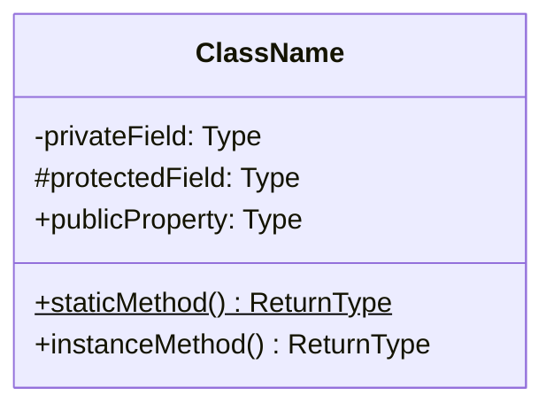

**関係の記法:**

| 記法 | 関係 | 意味 |
|------|------|------|
| `A --> B` | 依存 (Dependency) | A が B を使う |
| `A ..> B` | 依存（点線）| A が B に依存するが弱い |
| `A --o B` | 集約 (Aggregation) | A が B を参照する |
| `A *-- B` | コンポジション (Composition) | A が B を所有する（ライフサイクルが同じ） |
| `A <\|-- B` | 継承 (Inheritance) | B は A のサブクラス |
| `A <\|.. B` | 実装 (Realization) | B は A を実装する |

---

## 2. Value Object のクラス図

### 2.1 基本的な Value Object

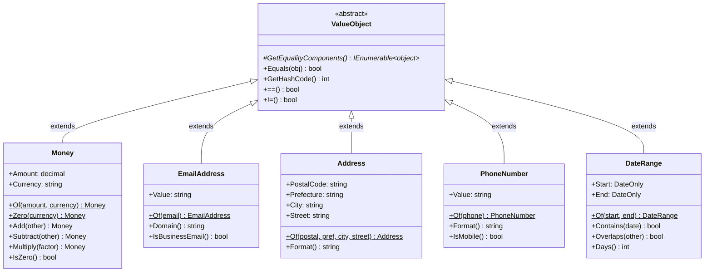

**C# 実装（Value Object 基底クラス）:**

```csharp
namespace SharedKernel;

public abstract class ValueObject
{
    protected abstract IEnumerable<object> GetEqualityComponents();

    public override bool Equals(object? obj)
    {
        if (obj is null || obj.GetType() != GetType()) return false;
        var other = (ValueObject)obj;
        return GetEqualityComponents().SequenceEqual(other.GetEqualityComponents());
    }

    public override int GetHashCode()
        => GetEqualityComponents()
            .Aggregate(1, (hash, obj) => HashCode.Combine(hash, obj.GetHashCode()));

    public static bool operator ==(ValueObject left, ValueObject right)
        => left.Equals(right);

    public static bool operator !=(ValueObject left, ValueObject right)
        => !left.Equals(right);
}

public sealed class Money : ValueObject
{
    public decimal Amount { get; }
    public string Currency { get; }

    private Money(decimal amount, string currency)
    {
        if (amount < 0) throw new DomainException("金額は0以上");
        if (currency.Length != 3) throw new DomainException("通貨コードは3文字（ISO 4217）");
        Amount = amount;
        Currency = currency;
    }

    public static Money Of(decimal amount, string currency) => new(amount, currency);
    public static Money Zero(string currency) => new(0m, currency);
    public Money Add(Money other)
    {
        EnsureSameCurrency(other);
        return new Money(Amount + other.Amount, Currency);
    }
    public Money Multiply(decimal factor) => new(Amount * factor, Currency);
    public bool IsZero => Amount == 0m;

    private void EnsureSameCurrency(Money other)
    {
        if (Currency != other.Currency)
            throw new InvalidOperationException($"通貨不一致: {Currency} vs {other.Currency}");
    }

    protected override IEnumerable<object> GetEqualityComponents()
    {
        yield return Amount;
        yield return Currency;
    }
}
```

### 2.2 Record を使った Value Object（.NET 9）

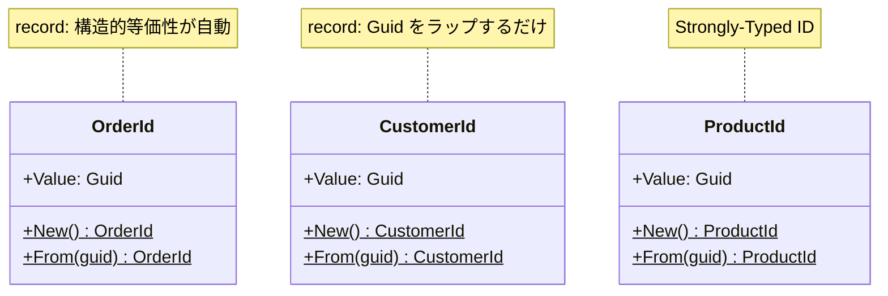

---

## 3. Entity と Aggregate のクラス図

### 3.1 Entity の基底クラス

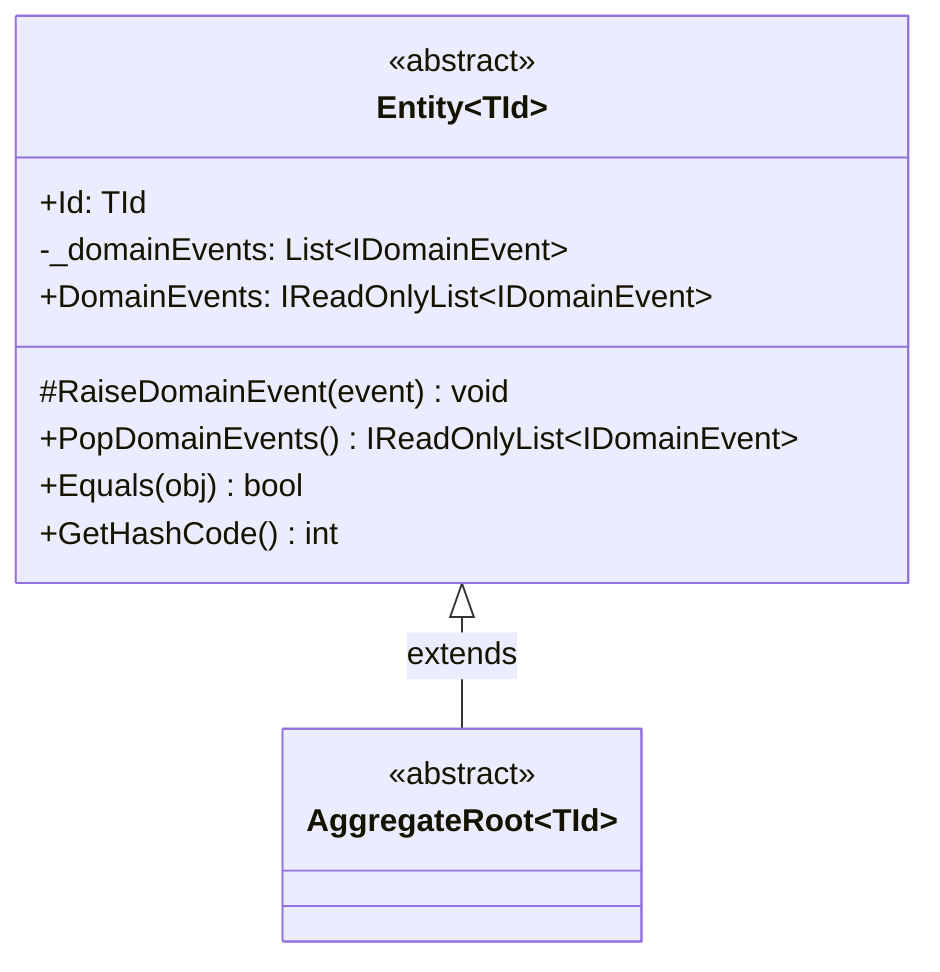

### 3.2 Order Aggregate の完全クラス図

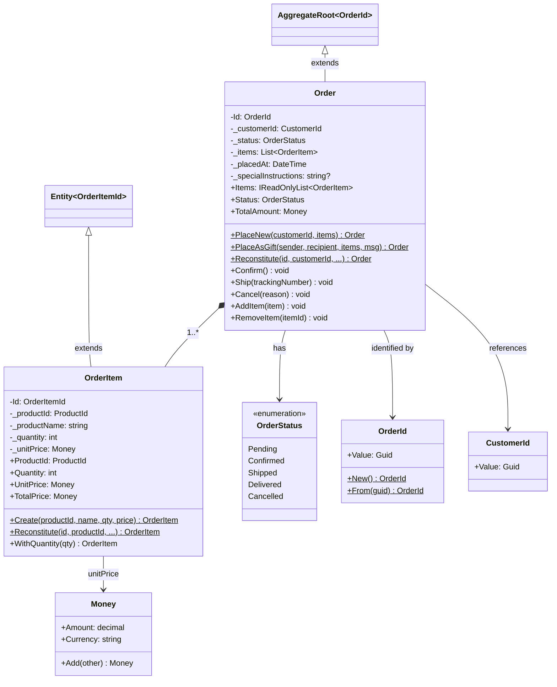

### 3.3 状態遷移を含む図

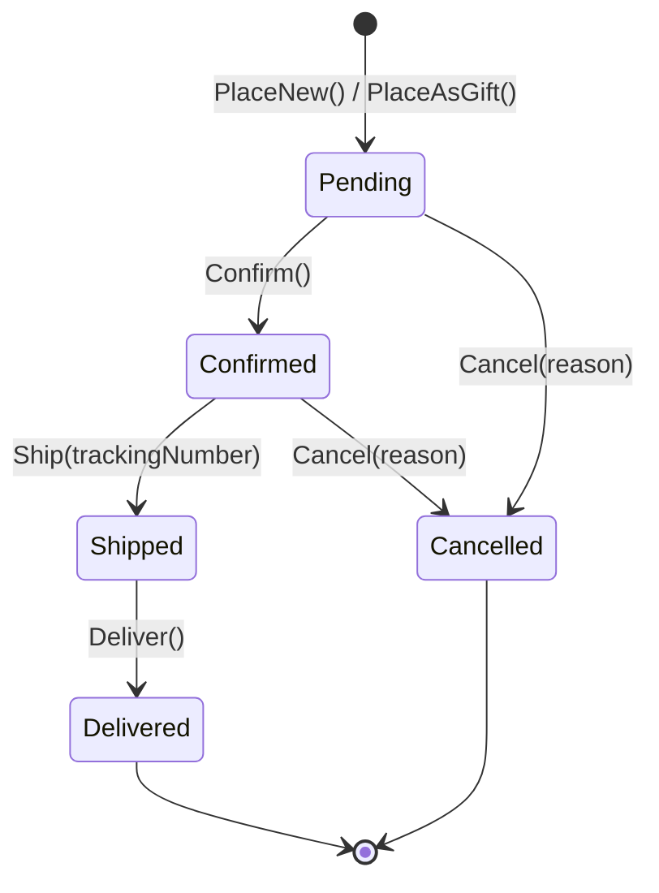

---

## 4. Repository パターンのクラス図

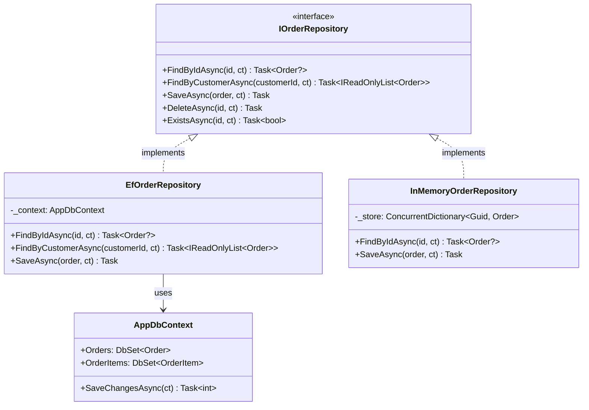

---

## 5. Domain Service と Application Service のクラス図

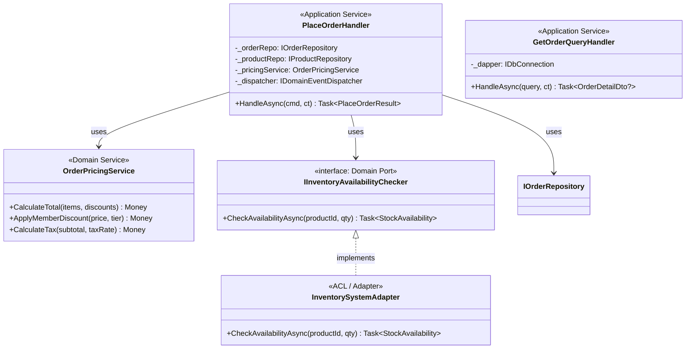

---

## 6. Hexagonal Architecture（ポート＆アダプター）のクラス図

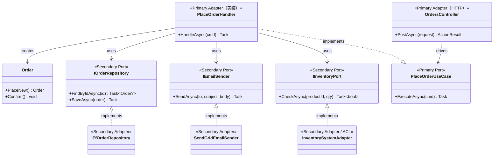

---

## 7. CQRS パターンのクラス図

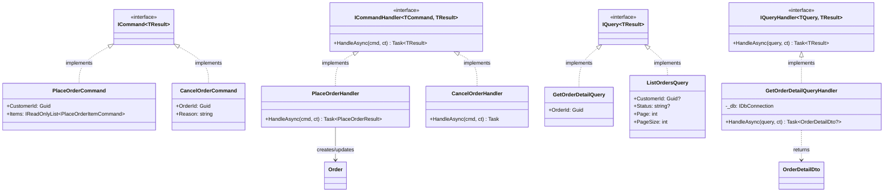

---

## 8. Event Sourcing のクラス図

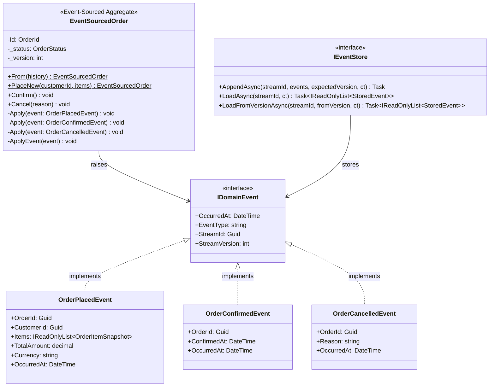

---

## 9. Saga / Process Manager のクラス図

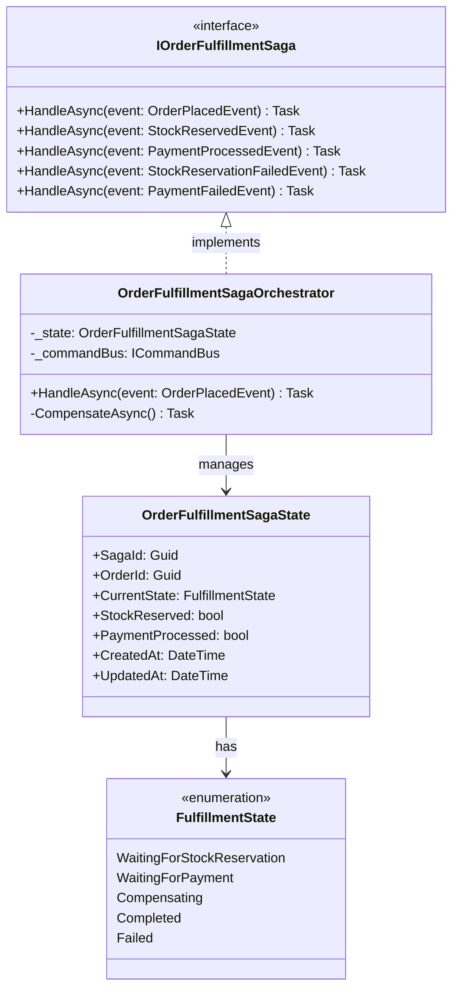

---

## 10. ECサイト全体ドメインモデル

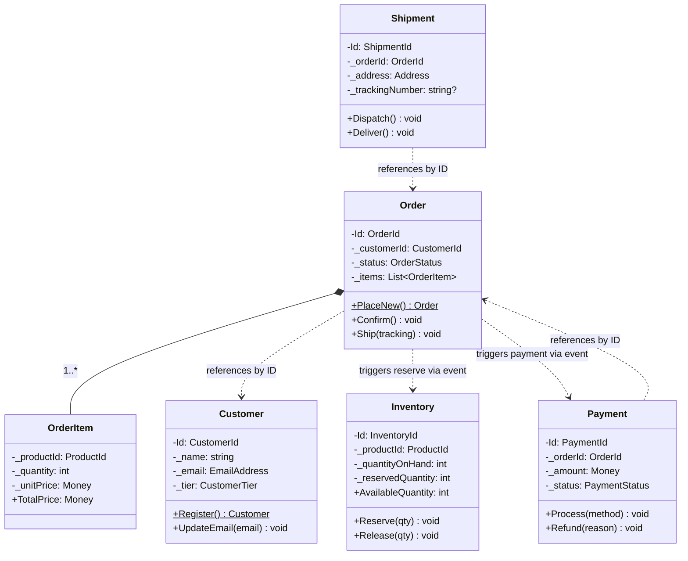

---

## 11. Context Map のクラス図

Context Map はクラス図よりもフロー図（graph）で表現する方が適切です。

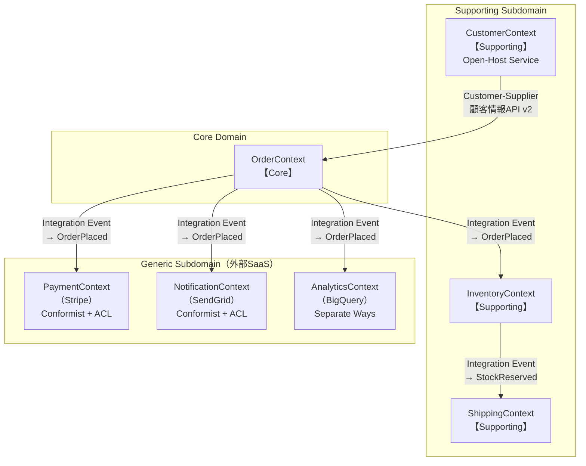

---

## 12. アーキテクト必携: よく使うクラス図パターン集

### 12.1 依存逆転の原則（DIP）

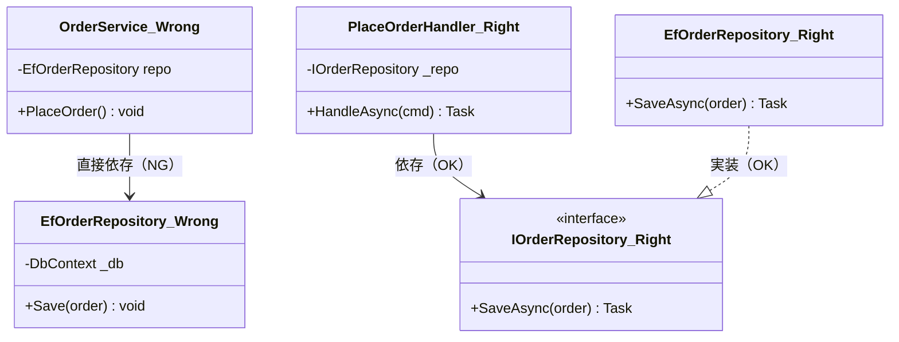

### 12.2 Outbox Pattern

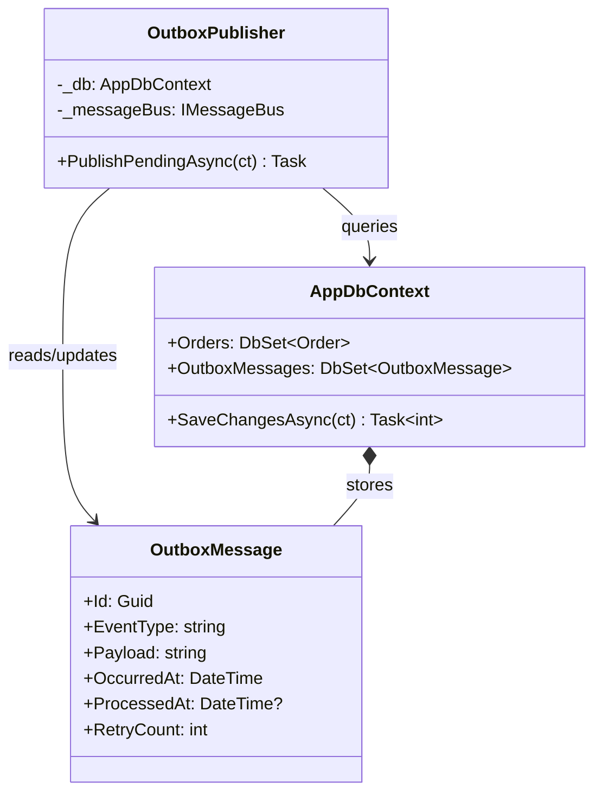

---

## 13. クラス図を描く際のルール

### 13.1 Bounded Context ごとに独立した図を用意する

一枚の図に全コンテキストを詰め込まない。ECサイトであれば:
- `class-diagram-order-context.md`
- `class-diagram-customer-context.md`
- `class-diagram-inventory-context.md`
- `class-diagram-full-system.md`（概要のみ）

### 13.2 クラス図に入れるもの・入れないもの

**入れるもの:**
- ドメインオブジェクト（Entity・Value Object・Aggregate Root）
- Repository の Interface
- Application Service の Interface（使い方の理解に必要な場合）
- 関係（コンポジション・継承・依存）

**入れないもの:**
- 全フィールドの型（概要図では重要なものだけ）
- Implementation の詳細（EF Core の設定など）
- DTO（アプリ詳細すぎる）

### 13.3 レビューチェックリスト

**集約の境界確認:**
- [ ] Aggregate Root が一つだけ存在するか
- [ ] Aggregate 内の子エンティティは Aggregate 経由でのみアクセスされるか
- [ ] 異なる Aggregate 間の参照はIDのみか（オブジェクト参照ではないか）

**依存方向の確認:**
- [ ] Domain Layer から Infrastructure Layer への矢印がないか
- [ ] Infrastructure Layer が Domain Layer の Interface を実装しているか
- [ ] 循環依存がないか

**Value Object の確認:**
- [ ] 不変な概念が Value Object として設計されているか
- [ ] IDフィールドが Value Object でラップされているか（`Guid` の直接使用がないか）

---

## 14. 演習問題

**問1: 医療予約システムのクラス図**

以下のユビキタス言語から、Aggregate・Entity・Value Object を識別し、クラス図を描いてください。

- **患者**（氏名、生年月日、保険証番号）
- **予約**（予約日時、担当医師、診療科、ステータス）
- **診療科**（内科・外科・整形外科など）
- **担当医師**（医師ID、氏名、資格）
- **診療時間枠**（開始時刻、終了時刻、残り予約可能数）

解答のポイント:
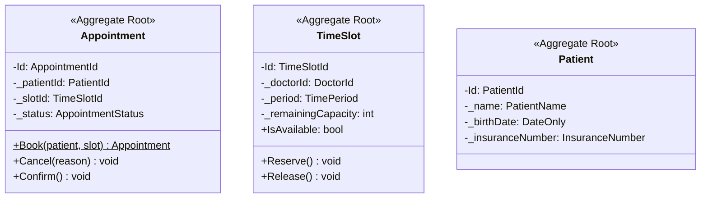

**問2: Event Sourcing のイベントクラス図**

銀行口座（BankAccount）の Event Sourcing 実装について:
- イベント: `AccountOpened`, `MoneyDeposited`, `MoneyWithdrawn`, `AccountClosed`
- 状態: `Balance`, `Status`, `Version`

これらのクラス図を描き、`Apply(event)` メソッドの実装を示してください。

**問3: マイクロサービス間のクラス図**

注文サービスと在庫サービスが Choreography Saga で連携する場合のクラス図を描いてください。

- 注文サービス: `Order` Aggregate、`OrderPlacedEvent` 発行
- 在庫サービス: `Inventory` Aggregate、`StockReservedEvent` / `StockReservationFailedEvent` 発行
- 注文サービスが `StockReservationFailedEvent` を受けた場合: `Order.Cancel()` を呼ぶ

---

## 参考文献と著者の解釈

UML クラス図の表記法は Object Management Group（OMG）が策定した UML 2.5 仕様に基づいています。DDD コンテキストでのクラス図の使い方は、Vaughn Vernon の *Implementing Domain-Driven Design*（2013）が最も詳細に扱っています。

筆者の経験では、クラス図を「完璧に描こうとする」のではなく、「議論のきっかけを作るために描く」という姿勢が重要です。Evans も強調するように、DDD のモデルは会話の中で進化するものです。クラス図は最初から完璧である必要はなく、チームの理解が深まるにつれて更新していきます。

Mermaid を使うことで、コードと設計図を同じリポジトリで管理できます。「コードと図が乖離する」問題を防ぐために、PR のレビューには必ずクラス図の更新も含めることを推奨します。
