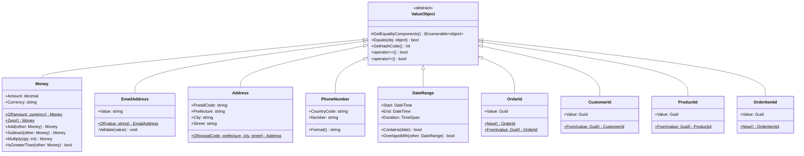
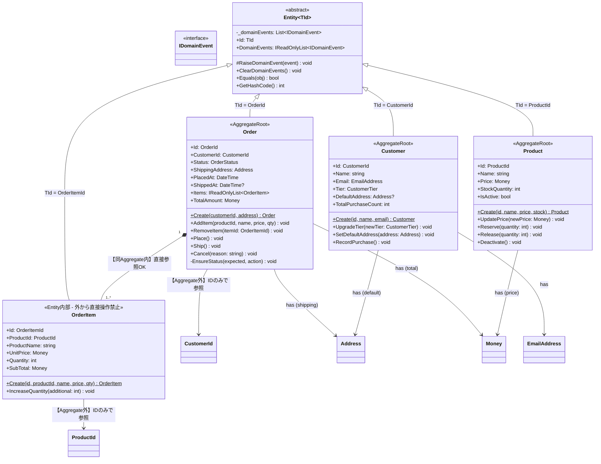
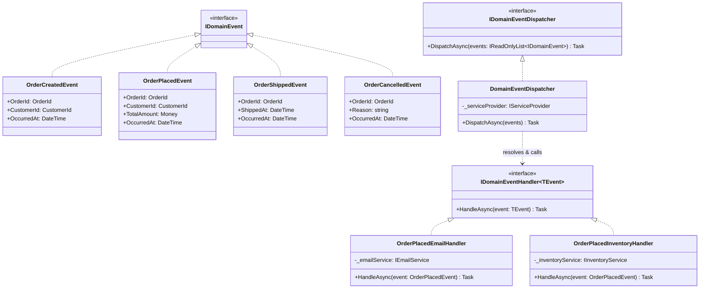
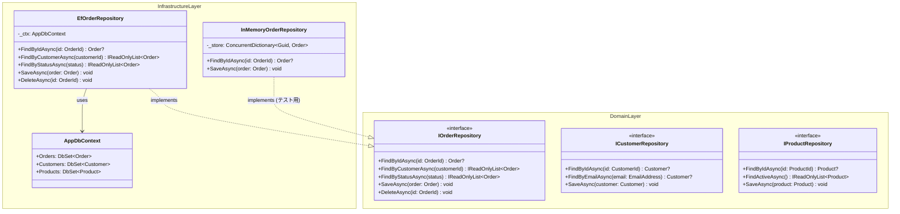
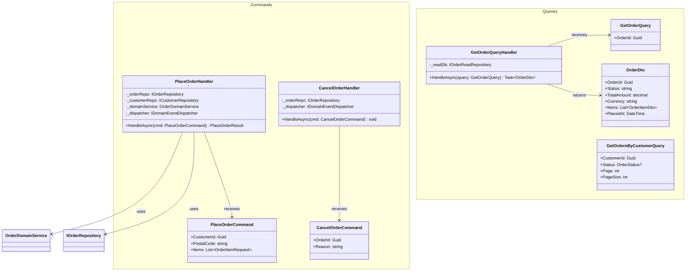
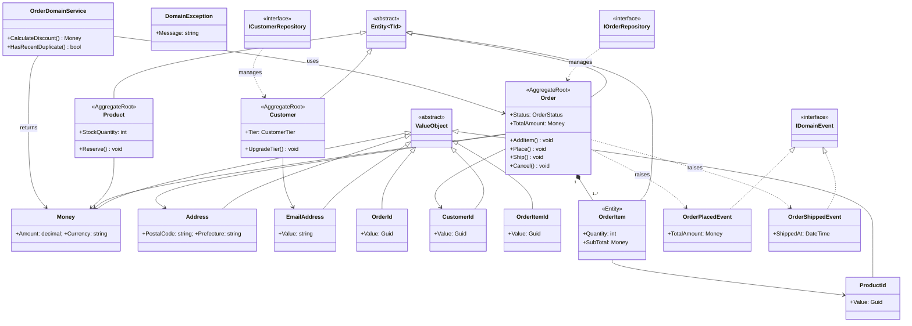
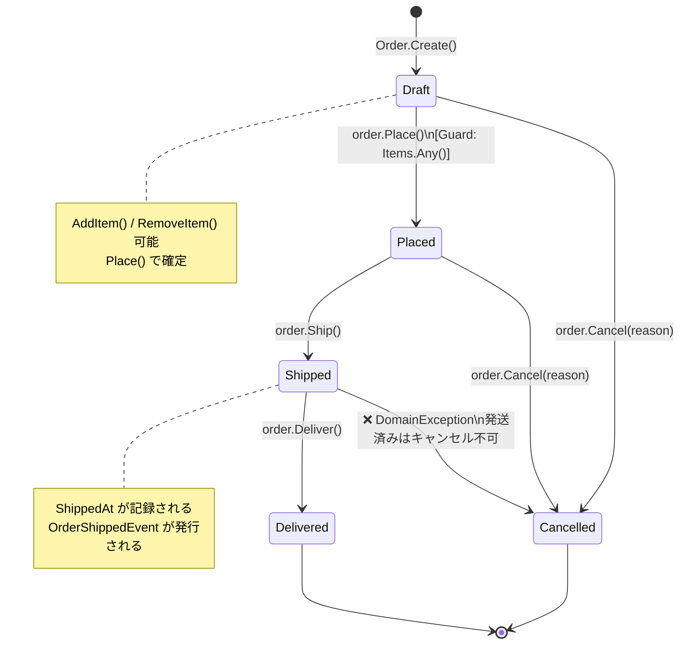

## なぜクラス図が必要か

DDD を「なんとなく理解した気がする」から「設計を人に説明できる」へ進むには、**モデルを視覚化する能力**が不可欠です。

Eric Evans は Blue Book の中で、チームがドメインモデルを共有するために図（UML クラス図）を積極的に使うことを推奨しています。ただし彼はこう警告しています:

> 「図はモデルではない。図はモデルのある側面を可視化したコミュニケーションツールに過ぎない」

つまりクラス図は、コードの前に「チームの共通理解」を作るためのものです。

---

## 1. Value Object 階層

**読み方のポイント:**
- `<<abstract>>` がついたクラスは基底クラス（直接インスタンス化しない）
- `$` マークは static メンバー（ファクトリメソッド）
- 全 Value Object は `ValueObject` を継承する → 等値比較が自動的に正しく動く

---

## 2. Entity 階層と Aggregate 境界

**Aggregate 境界のルール:**
- `*--` (composition): 同一 Aggregate 内 → 直接オブジェクト参照 OK
- `-->` (association): 別 Aggregate → **ID のみで参照**（`CustomerId` を保持し `Customer` オブジェクトを持たない）

---

## 3. Domain Events フロー

---

## 4. Repository パターン (依存逆転の実現)

---

## 5. Application Service と CQRS

---

## 6. 全体システムクラス図 (Domain Layer 完全版)

---

## 7. OrderStatus ステートマシン

---

## クラス図の読み方 早見表

| 記号 | 意味 | DDD での使い方 |
|------|------|-------------|
| `<<abstract>>` | 抽象クラス | `ValueObject`, `Entity<TId>` |
| `<<interface>>` | インターフェース | `IOrderRepository`, `IDomainEvent` |
| `<<AggregateRoot>>` | 集約のルート | `Order`, `Customer`, `Product` |
| `<<Entity>>` | 集約内部の Entity | `OrderItem` |
| `*--` | コンポジション | Aggregate 内部の直接参照 |
| `-->` | 関連 | ID 参照（別 Aggregate） |
| `..|>` | 実装 | `EfRepository ..|> IRepository` |
| `<|--` | 継承 | `Money <|-- ValueObject` |
| `$` | static メンバー | ファクトリメソッド `Order.Create()` |
| `?` | Nullable | `ShippedAt: DateTime?` |
| `~T~` | ジェネリック型 | `Entity<TId>`, `List<Order>` |

---

## まとめ

クラス図は DDD の「設計の会話」を可視化するツールです。コードを書く前に図を描き、ドメイン専門家とレビューすることで、モデルの誤りを早期に発見できます。

重要なのは「正確な UML」よりも「チームが共通理解を得られること」です。Mermaid のような軽量ツールで十分です。書いては議論し、議論しては直す — それが DDD のモデリングです。
