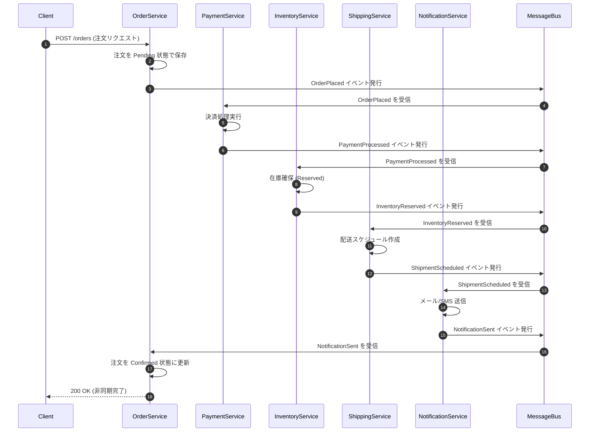
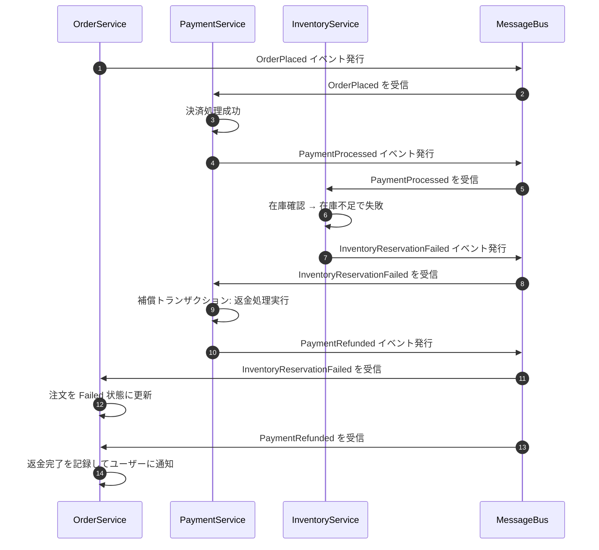
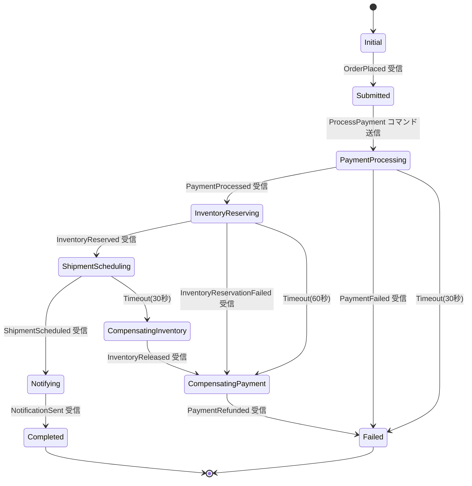

# 第22章 Saga パターンと Process Manager — 分散トランザクションの完全ガイド

---

## 0. TL;DR（3行）

分散マイクロサービスでは 2相コミットが運用上不可能であるため、Saga パターンによる補償トランザクションが唯一の実践的解です。Choreography（コレオグラフィ）は疎結合でシンプルですが可視性が低く、Orchestration（オーケストレーション）は状態が一元管理できる反面、中央集権的になります。Outbox Pattern とべき等性実装を組み合わせて初めて、At-least-once 配信下での安全な Saga が実現できます。

---

## 1. なぜ分散トランザクションが難しいか（理論編）

### 1.1 ACID vs BASE の完全比較

モノリシックアーキテクチャで RDB を使う場合、ACID トランザクションという強力な保証が得られます。しかしマイクロサービスへ移行し、各サービスが独立したデータベースを持つ瞬間、この前提は崩壊します。

**ACID（強整合性モデル）**

| プロパティ | 意味 | 保証の強度 |
|-----------|------|-----------|
| **Atomicity（原子性）** | すべて成功するか、すべて失敗するか | 強 |
| **Consistency（一貫性）** | データは常に有効な状態を維持する | 強 |
| **Isolation（隔離性）** | 並行トランザクションは互いに干渉しない | 強（レベル依存） |
| **Durability（永続性）** | コミット後はクラッシュしても消えない | 強 |

ACID は同一 DB サーバー内でのみ保証されます。PostgreSQL の `BEGIN ... COMMIT` は、同じ接続が同じデータベース・サーバーを対象としている場合にのみ機能します。

**BASE（弱整合性モデル）**

| プロパティ | 意味 |
|-----------|------|
| **Basically Available** | 部分障害があっても応答を返す |
| **Soft State** | 外部入力がなくても状態が変化し得る |
| **Eventual Consistency** | しばらく待てば整合性が取れる |

BASE は「常に整合している」のではなく、「最終的には整合する」という合意です。EC サイトで言えば、「注文ページで在庫あり表示 → 実際の在庫確保は数秒後」という状態が BASE の具体例です。

**アーキテクトとしての判断基準**

マイクロサービスにおいては、ACID を諦めて BASE を受け入れることが設計の大前提です。ただし「最終的整合性」が許容されないビジネス要件（例：銀行の送金）では、アーキテクチャ自体を再検討するか、単一サービス境界内に収める判断が必要です。

### 1.2 2相コミット（2PC）の問題点

分散トランザクションを実現しようとして最初に思いつくのが 2相コミット（Two-Phase Commit, 2PC）です。しかし 2PC は理論的には正しくても、マイクロサービス環境では致命的な問題を抱えています。

**2PC の仕組み**

```
Phase 1（準備フェーズ）:
  コーディネーター → 各参加者: "コミットの準備ができているか？"
  各参加者 → コーディネーター: "準備 OK / 失敗"

Phase 2（コミットフェーズ）:
  全員 OK → コーディネーター → 各参加者: "コミットせよ"
  誰か失敗 → コーディネーター → 各参加者: "ロールバックせよ"
```

**問題1：ブロッキング（Blocking）**

Phase 1 で全参加者が "準備 OK" を返した後、Phase 2 のコミット指示を待っている間、各参加者はリソースをロックしたまま待機します。コーディネーターがクラッシュすると、参加者は永遠にブロックされます。マイクロサービスが 10 個あり、1つのサービスで 2PC を常時使うと、そのサービスの DB 接続が枯渇し、他のリクエストが詰まります。

**問題2：コーディネーター障害（Coordinator Failure）**

```
[実例シナリオ]
OrderService (コーディネーター) が Phase 2 でコミット指示を送った直後にクラッシュ。
  → PaymentService はコミット済み
  → InventoryService はロールバック待ち
  → データは不整合のまま残る
```

コーディネーターが復帰しても、どの参加者がコミット/ロールバックしたかを再確認するためのプロトコル（3PC など）が必要になり、さらに複雑度が増します。

**問題3：デッドロック（Deadlock）**

複数の 2PC トランザクションが同時に実行されると、参加者 A がリソース X をロック、参加者 B がリソース Y をロックした状態で、A が Y を待ち、B が X を待つデッドロックが発生します。これを検出・解消するために複雑なロック管理が必要です。

**問題4：可用性の低下**

CAP 定理（後述）において 2PC は CP（一貫性と分断耐性）を選び、可用性（A）を犠牲にします。Phase 1 で一つでもタイムアウトすると、トランザクション全体が失敗し、ユーザー体験が悪化します。

**結論：2PC はマイクロサービスでは使わない**

Google の Spanner のような専用分散 DB を除いて、汎用マイクロサービスアーキテクチャで 2PC を採用することは推奨されません。

### 1.3 CAP 定理と Saga の関係

CAP 定理は、分散システムでは以下の3つすべてを同時に保証できないと述べています。

- **C（Consistency）**: 全ノードが同時に同じデータを見る
- **A（Availability）**: すべてのリクエストが応答を受け取れる
- **P（Partition Tolerance）**: ネットワーク分断があっても動作する

実際のマイクロサービスでは **P は必須**（ネットワーク障害は必ず起きる）なため、C と A のどちらを優先するかが選択肢になります。

**Saga は AP（可用性 + 分断耐性）モデル**

Saga は C（強整合性）を諦める代わりに、高い可用性を維持します。各サービスは独立してトランザクションをコミットし、失敗時は補償トランザクション（Compensating Transaction）でロールバックします。

```
従来の ACID トランザクション:
  全サービスが成功するまでコミットしない → 強整合性、低可用性

Saga:
  各サービスが独立してコミット → 結果整合性、高可用性
  失敗時は補償で巻き戻し
```

**整合性ウィンドウの概念**

Saga では、注文サービスがコミットしてから在庫サービスがコミットするまでの間、データは「一時的に不整合」です。このウィンドウを最小化することが設計目標の一つです。

### 1.4 分散システムにおける「部分失敗」の本質

分散システムで最も扱いにくいのが「部分失敗」（Partial Failure）です。モノリスではサービス全体が動いているか止まっているかのどちらかですが、分散システムでは：

- **リクエストが届いたが応答が届かない**: サービスは処理済み、クライアントはタイムアウト
- **処理中にサービスがクラッシュ**: ロールバックが不完全
- **ネットワーク遅延で二重送信**: 同じ処理が2回実行される
- **依存サービスが 503**: 上流は成功、下流は失敗

これらを適切に扱うために、Saga はべき等性（Idempotency）、補償トランザクション、タイムアウト処理を組み合わせる必要があります。

---

## 2. Choreography Saga 完全実装

Choreography Saga では、中央のオーケストレーターは存在しません。各サービスがイベントを受信し、処理後に次のイベントを発行することで、全体のフローが自然に進行します。

### 2.1 成功フロー（5サービスをまたぐ注文確定）

以下のフローを実装します：

```
OrderService → PaymentService → InventoryService → ShippingService → NotificationService
```



### 2.2 部分失敗フロー（在庫不足で補償トランザクション実行）



### 2.3 C# .NET 9 完全実装（MassTransit 使用）

#### 2.3.1 ドメインイベント定義

```csharp
// Contracts/Events/OrderEvents.cs
namespace ECommerce.Contracts.Events;

// 注文配置イベント
public record OrderPlaced(
    Guid OrderId,
    Guid CustomerId,
    Guid IdempotencyKey,
    IReadOnlyList<OrderLineItem> LineItems,
    decimal TotalAmount,
    DateTimeOffset PlacedAt);

public record OrderLineItem(
    Guid ProductId,
    string ProductName,
    int Quantity,
    decimal UnitPrice);

// 決済完了イベント
public record PaymentProcessed(
    Guid OrderId,
    Guid PaymentId,
    Guid IdempotencyKey,
    decimal Amount,
    string Currency,
    DateTimeOffset ProcessedAt);

// 決済失敗イベント
public record PaymentFailed(
    Guid OrderId,
    Guid IdempotencyKey,
    string Reason,
    DateTimeOffset FailedAt);

// 在庫確保成功イベント
public record InventoryReserved(
    Guid OrderId,
    Guid ReservationId,
    Guid IdempotencyKey,
    IReadOnlyList<ReservedItem> Items,
    DateTimeOffset ReservedAt);

public record ReservedItem(Guid ProductId, int Quantity);

// 在庫確保失敗イベント
public record InventoryReservationFailed(
    Guid OrderId,
    Guid IdempotencyKey,
    string Reason,
    IReadOnlyList<Guid> OutOfStockProductIds,
    DateTimeOffset FailedAt);

// 配送スケジュールイベント
public record ShipmentScheduled(
    Guid OrderId,
    Guid ShipmentId,
    Guid IdempotencyKey,
    string TrackingNumber,
    DateTimeOffset EstimatedDeliveryAt,
    DateTimeOffset ScheduledAt);

// 通知送信イベント
public record NotificationSent(
    Guid OrderId,
    Guid IdempotencyKey,
    string Channel,
    DateTimeOffset SentAt);

// 補償イベント
public record PaymentRefundRequested(
    Guid OrderId,
    Guid PaymentId,
    Guid IdempotencyKey,
    string Reason);

public record PaymentRefunded(
    Guid OrderId,
    Guid RefundId,
    Guid IdempotencyKey,
    DateTimeOffset RefundedAt);

// 注文完了・失敗通知
public record OrderCompleted(
    Guid OrderId,
    Guid CustomerId,
    string TrackingNumber,
    DateTimeOffset CompletedAt);

public record OrderFailed(
    Guid OrderId,
    string Reason,
    DateTimeOffset FailedAt);
```

#### 2.3.2 べき等性 (Idempotency) の実装 — Inbox パターン

```csharp
// Infrastructure/Idempotency/InboxMessage.cs
namespace ECommerce.Infrastructure.Idempotency;

public sealed class InboxMessage
{
    public Guid Id { get; init; }           // IdempotencyKey
    public string EventType { get; init; } = string.Empty;
    public string Payload { get; init; } = string.Empty;
    public DateTimeOffset ReceivedAt { get; init; }
    public DateTimeOffset? ProcessedAt { get; private set; }
    public bool IsProcessed => ProcessedAt.HasValue;

    public void MarkProcessed()
    {
        ProcessedAt = DateTimeOffset.UtcNow;
    }
}

// インターフェース定義
public interface IHasIdempotencyKey
{
    Guid IdempotencyKey { get; }
}

// Infrastructure/Idempotency/IdempotencyFilter.cs
using MassTransit;
using Microsoft.EntityFrameworkCore;

namespace ECommerce.Infrastructure.Idempotency;

/// <summary>
/// MassTransit のフィルターとして全コンシューマーに適用する Inbox フィルター。
/// 同じ IdempotencyKey を持つメッセージを二重処理から保護します。
/// </summary>
public sealed class IdempotencyFilter<T> : IFilter<ConsumeContext<T>>
    where T : class, IHasIdempotencyKey
{
    private readonly IServiceProvider _serviceProvider;

    public IdempotencyFilter(IServiceProvider serviceProvider)
    {
        _serviceProvider = serviceProvider;
    }

    public async Task Send(ConsumeContext<T> context, IPipe<ConsumeContext<T>> next)
    {
        using var scope = _serviceProvider.CreateScope();
        var db = scope.ServiceProvider.GetRequiredService<ApplicationDbContext>();

        var idempotencyKey = context.Message.IdempotencyKey;
        var eventType = typeof(T).Name;

        // 既に処理済みか確認（排他ロックを取得）
        var existing = await db.InboxMessages
            .FromSqlRaw(
                "SELECT * FROM inbox_messages WHERE id = {0} FOR UPDATE SKIP LOCKED",
                idempotencyKey)
            .FirstOrDefaultAsync(context.CancellationToken);

        if (existing?.IsProcessed == true)
        {
            // 処理済み → スキップ（べき等に処理）
            return;
        }

        if (existing is null)
        {
            // 初回受信 → Inbox に記録
            var inbox = new InboxMessage
            {
                Id = idempotencyKey,
                EventType = eventType,
                Payload = System.Text.Json.JsonSerializer.Serialize(context.Message),
                ReceivedAt = DateTimeOffset.UtcNow,
            };
            db.InboxMessages.Add(inbox);
            await db.SaveChangesAsync(context.CancellationToken);
        }

        // 実際の処理を実行
        await next.Send(context);

        // 処理完了をマーク
        var processed = await db.InboxMessages
            .FindAsync([idempotencyKey], context.CancellationToken);
        processed?.MarkProcessed();
        await db.SaveChangesAsync(context.CancellationToken);
    }

    public void Probe(ProbeContext context)
        => context.CreateScope("idempotency-filter");
}
```

#### 2.3.3 OrderService — 注文コンシューマー

```csharp
// OrderService/Consumers/NotificationSentConsumer.cs
using ECommerce.Contracts.Events;
using MassTransit;

namespace OrderService.Consumers;

public sealed class NotificationSentConsumer : IConsumer<NotificationSent>
{
    private readonly IOrderRepository _orderRepository;
    private readonly ILogger<NotificationSentConsumer> _logger;

    public NotificationSentConsumer(
        IOrderRepository orderRepository,
        ILogger<NotificationSentConsumer> logger)
    {
        _orderRepository = orderRepository;
        _logger = logger;
    }

    public async Task Consume(ConsumeContext<NotificationSent> context)
    {
        var message = context.Message;
        _logger.LogInformation("通知送信完了を受信。OrderId: {OrderId}", message.OrderId);

        var order = await _orderRepository.GetByIdAsync(message.OrderId, context.CancellationToken)
            ?? throw new InvalidOperationException($"注文が見つかりません: {message.OrderId}");

        order.Confirm();
        await _orderRepository.UpdateAsync(order, context.CancellationToken);

        _logger.LogInformation("注文を確定状態に更新しました。OrderId: {OrderId}", message.OrderId);
    }
}

public sealed class InventoryReservationFailedConsumer : IConsumer<InventoryReservationFailed>
{
    private readonly IOrderRepository _orderRepository;
    private readonly ILogger<InventoryReservationFailedConsumer> _logger;

    public InventoryReservationFailedConsumer(
        IOrderRepository orderRepository,
        ILogger<InventoryReservationFailedConsumer> logger)
    {
        _orderRepository = orderRepository;
        _logger = logger;
    }

    public async Task Consume(ConsumeContext<InventoryReservationFailed> context)
    {
        var message = context.Message;
        _logger.LogWarning(
            "在庫確保失敗を受信。OrderId: {OrderId}, 理由: {Reason}",
            message.OrderId, message.Reason);

        var order = await _orderRepository.GetByIdAsync(message.OrderId, context.CancellationToken)
            ?? throw new InvalidOperationException($"注文が見つかりません: {message.OrderId}");

        order.Fail(message.Reason);
        await _orderRepository.UpdateAsync(order, context.CancellationToken);
    }
}
```

#### 2.3.4 PaymentService — 決済コンシューマー

```csharp
// PaymentService/Consumers/OrderPlacedConsumer.cs
using ECommerce.Contracts.Events;
using MassTransit;

namespace PaymentService.Consumers;

public sealed class OrderPlacedConsumer : IConsumer<OrderPlaced>
{
    private readonly IPaymentGateway _paymentGateway;
    private readonly IPaymentRepository _paymentRepository;
    private readonly IPublishEndpoint _publishEndpoint;
    private readonly ILogger<OrderPlacedConsumer> _logger;

    public OrderPlacedConsumer(
        IPaymentGateway paymentGateway,
        IPaymentRepository paymentRepository,
        IPublishEndpoint publishEndpoint,
        ILogger<OrderPlacedConsumer> logger)
    {
        _paymentGateway = paymentGateway;
        _paymentRepository = paymentRepository;
        _publishEndpoint = publishEndpoint;
        _logger = logger;
    }

    public async Task Consume(ConsumeContext<OrderPlaced> context)
    {
        var order = context.Message;
        _logger.LogInformation("注文を受信。決済処理開始。OrderId: {OrderId}", order.OrderId);

        try
        {
            // 決済処理（外部ゲートウェイ呼び出し）
            // IdempotencyKey を外部ゲートウェイにも渡すことで、
            // ゲートウェイ側でも二重課金を防ぐ
            var result = await _paymentGateway.ProcessAsync(new PaymentRequest(
                OrderId: order.OrderId,
                Amount: order.TotalAmount,
                Currency: "JPY",
                CustomerId: order.CustomerId,
                IdempotencyKey: order.IdempotencyKey
            ), context.CancellationToken);

            // 決済レコードを保存
            var payment = new Payment(
                Id: result.PaymentId,
                OrderId: order.OrderId,
                Amount: order.TotalAmount,
                Status: PaymentStatus.Completed);

            await _paymentRepository.SaveAsync(payment, context.CancellationToken);

            // 成功イベントを発行
            await _publishEndpoint.Publish(new PaymentProcessed(
                OrderId: order.OrderId,
                PaymentId: result.PaymentId,
                IdempotencyKey: Guid.NewGuid(),
                Amount: order.TotalAmount,
                Currency: "JPY",
                ProcessedAt: DateTimeOffset.UtcNow
            ), context.CancellationToken);

            _logger.LogInformation("決済完了。PaymentId: {PaymentId}", result.PaymentId);
        }
        catch (PaymentGatewayException ex)
        {
            _logger.LogError(ex, "決済失敗。OrderId: {OrderId}", order.OrderId);

            await _publishEndpoint.Publish(new PaymentFailed(
                OrderId: order.OrderId,
                IdempotencyKey: Guid.NewGuid(),
                Reason: ex.Message,
                FailedAt: DateTimeOffset.UtcNow
            ), context.CancellationToken);
        }
    }
}

// 補償: 在庫不足による返金処理
public sealed class InventoryReservationFailedConsumer : IConsumer<InventoryReservationFailed>
{
    private readonly IPaymentGateway _paymentGateway;
    private readonly IPaymentRepository _paymentRepository;
    private readonly IPublishEndpoint _publishEndpoint;
    private readonly ILogger<InventoryReservationFailedConsumer> _logger;

    public InventoryReservationFailedConsumer(
        IPaymentGateway paymentGateway,
        IPaymentRepository paymentRepository,
        IPublishEndpoint publishEndpoint,
        ILogger<InventoryReservationFailedConsumer> logger)
    {
        _paymentGateway = paymentGateway;
        _paymentRepository = paymentRepository;
        _publishEndpoint = publishEndpoint;
        _logger = logger;
    }

    public async Task Consume(ConsumeContext<InventoryReservationFailed> context)
    {
        var message = context.Message;
        _logger.LogWarning("在庫不足のため返金処理開始。OrderId: {OrderId}", message.OrderId);

        var payment = await _paymentRepository.GetByOrderIdAsync(
            message.OrderId, context.CancellationToken);

        if (payment is null)
        {
            _logger.LogWarning("返金対象の決済が見つかりません。OrderId: {OrderId}", message.OrderId);
            return;
        }

        // 返金実行（IdempotencyKey を渡して二重返金を防ぐ）
        var refundResult = await _paymentGateway.RefundAsync(new RefundRequest(
            PaymentId: payment.Id,
            Amount: payment.Amount,
            Reason: $"在庫不足: {message.Reason}",
            IdempotencyKey: message.IdempotencyKey
        ), context.CancellationToken);

        payment.MarkRefunded(refundResult.RefundId);
        await _paymentRepository.UpdateAsync(payment, context.CancellationToken);

        await _publishEndpoint.Publish(new PaymentRefunded(
            OrderId: message.OrderId,
            RefundId: refundResult.RefundId,
            IdempotencyKey: Guid.NewGuid(),
            RefundedAt: DateTimeOffset.UtcNow
        ), context.CancellationToken);

        _logger.LogInformation("返金完了。RefundId: {RefundId}", refundResult.RefundId);
    }
}
```

#### 2.3.5 InventoryService — 在庫コンシューマー

```csharp
// InventoryService/Consumers/PaymentProcessedConsumer.cs
using ECommerce.Contracts.Events;
using MassTransit;

namespace InventoryService.Consumers;

public sealed class PaymentProcessedConsumer : IConsumer<PaymentProcessed>
{
    private readonly IInventoryRepository _inventoryRepository;
    private readonly IPublishEndpoint _publishEndpoint;
    private readonly ILogger<PaymentProcessedConsumer> _logger;

    public PaymentProcessedConsumer(
        IInventoryRepository inventoryRepository,
        IPublishEndpoint publishEndpoint,
        ILogger<PaymentProcessedConsumer> logger)
    {
        _inventoryRepository = inventoryRepository;
        _publishEndpoint = publishEndpoint;
        _logger = logger;
    }

    public async Task Consume(ConsumeContext<PaymentProcessed> context)
    {
        var payment = context.Message;
        _logger.LogInformation("決済完了受信。在庫確保開始。OrderId: {OrderId}", payment.OrderId);

        // 注文明細を取得（別途 ReadModel から）
        var orderItems = await _inventoryRepository.GetOrderItemsAsync(
            payment.OrderId, context.CancellationToken);

        // 全商品の在庫確認
        var insufficientItems = new List<Guid>();
        foreach (var item in orderItems)
        {
            var available = await _inventoryRepository.GetAvailableStockAsync(
                item.ProductId, context.CancellationToken);

            if (available < item.Quantity)
            {
                insufficientItems.Add(item.ProductId);
            }
        }

        if (insufficientItems.Count > 0)
        {
            _logger.LogWarning(
                "在庫不足。OrderId: {OrderId}, 商品数: {Count}",
                payment.OrderId, insufficientItems.Count);

            await _publishEndpoint.Publish(new InventoryReservationFailed(
                OrderId: payment.OrderId,
                IdempotencyKey: Guid.NewGuid(),
                Reason: "在庫不足",
                OutOfStockProductIds: insufficientItems,
                FailedAt: DateTimeOffset.UtcNow
            ), context.CancellationToken);

            return;
        }

        // 在庫確保（楽観的ロックで競合を防ぐ）
        var reservation = await _inventoryRepository.ReserveAsync(
            payment.OrderId, orderItems, context.CancellationToken);

        await _publishEndpoint.Publish(new InventoryReserved(
            OrderId: payment.OrderId,
            ReservationId: reservation.Id,
            IdempotencyKey: Guid.NewGuid(),
            Items: reservation.Items
                .Select(i => new ReservedItem(i.ProductId, i.Quantity))
                .ToList(),
            ReservedAt: DateTimeOffset.UtcNow
        ), context.CancellationToken);

        _logger.LogInformation("在庫確保完了。ReservationId: {ReservationId}", reservation.Id);
    }
}
```

#### 2.3.6 MassTransit 設定（Program.cs）

```csharp
// OrderService/Program.cs
using MassTransit;
using OrderService.Consumers;

var builder = WebApplication.CreateBuilder(args);

builder.Services.AddMassTransit(x =>
{
    // コンシューマーを登録
    x.AddConsumer<NotificationSentConsumer>();
    x.AddConsumer<InventoryReservationFailedConsumer>();
    x.AddConsumer<PaymentRefundedConsumer>();

    x.UsingRabbitMq((ctx, cfg) =>
    {
        cfg.Host(builder.Configuration.GetConnectionString("RabbitMq"), h =>
        {
            h.Username("guest");
            h.Password("guest");
        });

        cfg.ReceiveEndpoint("order-service", e =>
        {
            // 指数バックオフでリトライ: 1s, 3s, 7s
            e.UseMessageRetry(r => r.Incremental(3,
                initialInterval: TimeSpan.FromSeconds(1),
                intervalIncrement: TimeSpan.FromSeconds(2)));

            // Outbox（コンシューマー内での発行を Outbox 経由にする）
            e.UseInMemoryOutbox(ctx);

            e.ConfigureConsumer<NotificationSentConsumer>(ctx);
            e.ConfigureConsumer<InventoryReservationFailedConsumer>(ctx);
            e.ConfigureConsumer<PaymentRefundedConsumer>(ctx);
        });

        cfg.ConfigureEndpoints(ctx);
    });
});

var app = builder.Build();
app.Run();
```

---

## 3. Orchestration Saga (Process Manager) 完全実装

Orchestration Saga では、中央の Process Manager がフロー全体を制御します。各サービスへのコマンド送信と応答受信を Process Manager が管理し、現在の状態を永続化します。

### 3.1 状態機械（State Machine）としての Process Manager 設計

**全状態と遷移の定義**

| 状態 | 説明 | 前状態 | 次状態（正常） | 次状態（異常） |
|------|------|--------|----------------|----------------|
| `Initial` | Saga 開始前 | — | Submitted | — |
| `Submitted` | 注文受付済み | Initial | PaymentProcessing | — |
| `PaymentProcessing` | 決済処理中 | Submitted | InventoryReserving | Failed |
| `InventoryReserving` | 在庫確保中 | PaymentProcessing | ShipmentScheduling | CompensatingPayment |
| `ShipmentScheduling` | 配送スケジュール作成中 | InventoryReserving | Notifying | CompensatingInventory |
| `Notifying` | 通知送信中 | ShipmentScheduling | Completed | — |
| `Completed` | 全処理完了 | Notifying | — | — |
| `CompensatingPayment` | 決済返金中 | InventoryReserving | Failed | — |
| `CompensatingInventory` | 在庫返却中 | ShipmentScheduling | CompensatingPayment | — |
| `Failed` | 失敗（補償完了） | 各失敗状態 | — | — |



### 3.2 Saga インスタンス（永続化対象）

```csharp
// OrderSaga/OrderSagaInstance.cs
using MassTransit;

namespace OrderSaga;

/// <summary>
/// Saga の状態インスタンス。PostgreSQL に永続化されます。
/// SagaStateMachineInstance を実装することで MassTransit が自動管理します。
/// </summary>
public sealed class OrderSagaInstance : SagaStateMachineInstance
{
    public Guid CorrelationId { get; set; }    // Saga の一意識別子（= OrderId）
    public string CurrentState { get; set; } = null!;

    // ビジネスデータ
    public Guid CustomerId { get; set; }
    public decimal TotalAmount { get; set; }
    public string Currency { get; set; } = "JPY";

    // 各ステップの結果を保存
    public Guid? PaymentId { get; set; }
    public Guid? ReservationId { get; set; }
    public Guid? ShipmentId { get; set; }
    public string? TrackingNumber { get; set; }

    // 失敗情報
    public string? FailureReason { get; set; }

    // タイムアウト管理（MassTransit Schedule のトークン ID）
    public Guid? PaymentTimeoutTokenId { get; set; }
    public Guid? InventoryTimeoutTokenId { get; set; }
    public Guid? ShipmentTimeoutTokenId { get; set; }

    // 再試行カウント
    public int RetryCount { get; set; }

    // タイムスタンプ
    public DateTimeOffset CreatedAt { get; set; }
    public DateTimeOffset UpdatedAt { get; set; }
}

// タイムアウトメッセージ定義
public record PaymentTimeout(Guid OrderId);
public record InventoryTimeout(Guid OrderId);
public record ShipmentTimeout(Guid OrderId);

// コマンド定義
public record ProcessPaymentCommand(Guid OrderId, Guid CustomerId, decimal Amount, string Currency, Guid IdempotencyKey);
public record ReserveInventoryCommand(Guid OrderId, Guid IdempotencyKey);
public record ScheduleShipmentCommand(Guid OrderId, string? Notes, Guid IdempotencyKey);
public record SendOrderConfirmationCommand(Guid OrderId, string TrackingNumber, Guid IdempotencyKey);
public record RefundPaymentCommand(Guid OrderId, Guid PaymentId, string Reason, Guid IdempotencyKey);
public record ReleaseInventoryCommand(Guid OrderId, Guid ReservationId, Guid IdempotencyKey);

// 追加イベント
public record InventoryReleased(Guid OrderId, Guid ReservationId, Guid IdempotencyKey, DateTimeOffset ReleasedAt);
```

### 3.3 Saga ステートマシン完全実装

```csharp
// OrderSaga/OrderStateMachine.cs
using ECommerce.Contracts.Events;
using MassTransit;

namespace OrderSaga;

/// <summary>
/// 注文 Saga のオーケストレーション実装。
/// MassTransitStateMachine を継承することで状態遷移ロジックを宣言的に記述できます。
/// </summary>
public sealed class OrderStateMachine : MassTransitStateMachine<OrderSagaInstance>
{
    // =============================
    // 状態定義
    // =============================
    public State Submitted { get; private set; } = null!;
    public State PaymentProcessing { get; private set; } = null!;
    public State InventoryReserving { get; private set; } = null!;
    public State ShipmentScheduling { get; private set; } = null!;
    public State Notifying { get; private set; } = null!;
    public State Completed { get; private set; } = null!;
    public State CompensatingPayment { get; private set; } = null!;
    public State CompensatingInventory { get; private set; } = null!;
    public State Failed { get; private set; } = null!;

    // =============================
    // イベント定義
    // =============================
    public Event<OrderPlaced> OrderPlaced { get; private set; } = null!;
    public Event<PaymentProcessed> PaymentProcessed { get; private set; } = null!;
    public Event<PaymentFailed> PaymentFailed { get; private set; } = null!;
    public Event<InventoryReserved> InventoryReserved { get; private set; } = null!;
    public Event<InventoryReservationFailed> InventoryReservationFailed { get; private set; } = null!;
    public Event<ShipmentScheduled> ShipmentScheduled { get; private set; } = null!;
    public Event<NotificationSent> NotificationSent { get; private set; } = null!;
    public Event<PaymentRefunded> PaymentRefunded { get; private set; } = null!;
    public Event<InventoryReleased> InventoryReleased { get; private set; } = null!;

    // =============================
    // スケジュール（タイムアウト）定義
    // =============================
    public Schedule<OrderSagaInstance, PaymentTimeout> PaymentTimeoutSchedule { get; private set; } = null!;
    public Schedule<OrderSagaInstance, InventoryTimeout> InventoryTimeoutSchedule { get; private set; } = null!;
    public Schedule<OrderSagaInstance, ShipmentTimeout> ShipmentTimeoutSchedule { get; private set; } = null!;

    public OrderStateMachine()
    {
        // CorrelationId の設定（OrderId を使って Saga を特定）
        Event(() => OrderPlaced, x => x.CorrelateById(m => m.Message.OrderId));
        Event(() => PaymentProcessed, x => x.CorrelateById(m => m.Message.OrderId));
        Event(() => PaymentFailed, x => x.CorrelateById(m => m.Message.OrderId));
        Event(() => InventoryReserved, x => x.CorrelateById(m => m.Message.OrderId));
        Event(() => InventoryReservationFailed, x => x.CorrelateById(m => m.Message.OrderId));
        Event(() => ShipmentScheduled, x => x.CorrelateById(m => m.Message.OrderId));
        Event(() => NotificationSent, x => x.CorrelateById(m => m.Message.OrderId));
        Event(() => PaymentRefunded, x => x.CorrelateById(m => m.Message.OrderId));
        Event(() => InventoryReleased, x => x.CorrelateById(m => m.Message.OrderId));

        // タイムアウトスケジュール設定
        Schedule(
            () => PaymentTimeoutSchedule,
            instance => instance.PaymentTimeoutTokenId,
            s =>
            {
                s.Delay = TimeSpan.FromSeconds(30);
                s.Received = r => r.CorrelateById(m => m.Message.OrderId);
            });

        Schedule(
            () => InventoryTimeoutSchedule,
            instance => instance.InventoryTimeoutTokenId,
            s =>
            {
                s.Delay = TimeSpan.FromSeconds(60);
                s.Received = r => r.CorrelateById(m => m.Message.OrderId);
            });

        Schedule(
            () => ShipmentTimeoutSchedule,
            instance => instance.ShipmentTimeoutTokenId,
            s =>
            {
                s.Delay = TimeSpan.FromSeconds(30);
                s.Received = r => r.CorrelateById(m => m.Message.OrderId);
            });

        // 現在の状態をインスタンスの CurrentState フィールドに保存
        InstanceState(x => x.CurrentState);

        // =============================
        // 初期状態からの遷移
        // =============================
        Initially(
            When(OrderPlaced)
                .Then(InitializeInstance)
                .SendAsync(
                    ctx => new Uri("queue:payment-service"),
                    ctx => ctx.Init<ProcessPaymentCommand>(new ProcessPaymentCommand(
                        OrderId: ctx.Saga.CorrelationId,
                        CustomerId: ctx.Saga.CustomerId,
                        Amount: ctx.Saga.TotalAmount,
                        Currency: ctx.Saga.Currency,
                        IdempotencyKey: Guid.NewGuid())))
                .Schedule(PaymentTimeoutSchedule,
                    ctx => ctx.Init<PaymentTimeout>(new PaymentTimeout(ctx.Saga.CorrelationId)))
                .TransitionTo(PaymentProcessing)
        );

        // =============================
        // PaymentProcessing 状態での遷移
        // =============================
        During(PaymentProcessing,
            When(PaymentProcessed)
                .Then(ctx =>
                {
                    ctx.Saga.PaymentId = ctx.Message.PaymentId;
                    ctx.Saga.UpdatedAt = DateTimeOffset.UtcNow;
                })
                .Unschedule(PaymentTimeoutSchedule)
                .SendAsync(
                    ctx => new Uri("queue:inventory-service"),
                    ctx => ctx.Init<ReserveInventoryCommand>(new ReserveInventoryCommand(
                        OrderId: ctx.Saga.CorrelationId,
                        IdempotencyKey: Guid.NewGuid())))
                .Schedule(InventoryTimeoutSchedule,
                    ctx => ctx.Init<InventoryTimeout>(new InventoryTimeout(ctx.Saga.CorrelationId)))
                .TransitionTo(InventoryReserving),

            When(PaymentFailed)
                .Then(ctx =>
                {
                    ctx.Saga.FailureReason = ctx.Message.Reason;
                    ctx.Saga.UpdatedAt = DateTimeOffset.UtcNow;
                })
                .Unschedule(PaymentTimeoutSchedule)
                .PublishAsync(ctx => ctx.Init<OrderFailed>(new OrderFailed(
                    OrderId: ctx.Saga.CorrelationId,
                    Reason: ctx.Message.Reason,
                    FailedAt: DateTimeOffset.UtcNow)))
                .TransitionTo(Failed)
                .Finalize(),

            When(PaymentTimeoutSchedule.Received)
                .Then(ctx =>
                {
                    ctx.Saga.FailureReason = "決済サービスがタイムアウトしました (30秒)";
                    ctx.Saga.UpdatedAt = DateTimeOffset.UtcNow;
                })
                .PublishAsync(ctx => ctx.Init<OrderFailed>(new OrderFailed(
                    OrderId: ctx.Saga.CorrelationId,
                    Reason: "決済タイムアウト",
                    FailedAt: DateTimeOffset.UtcNow)))
                .TransitionTo(Failed)
                .Finalize()
        );

        // =============================
        // InventoryReserving 状態での遷移
        // =============================
        During(InventoryReserving,
            When(InventoryReserved)
                .Then(ctx =>
                {
                    ctx.Saga.ReservationId = ctx.Message.ReservationId;
                    ctx.Saga.UpdatedAt = DateTimeOffset.UtcNow;
                })
                .Unschedule(InventoryTimeoutSchedule)
                .SendAsync(
                    ctx => new Uri("queue:shipping-service"),
                    ctx => ctx.Init<ScheduleShipmentCommand>(new ScheduleShipmentCommand(
                        OrderId: ctx.Saga.CorrelationId,
                        Notes: null,
                        IdempotencyKey: Guid.NewGuid())))
                .Schedule(ShipmentTimeoutSchedule,
                    ctx => ctx.Init<ShipmentTimeout>(new ShipmentTimeout(ctx.Saga.CorrelationId)))
                .TransitionTo(ShipmentScheduling),

            When(InventoryReservationFailed)
                .Then(ctx =>
                {
                    ctx.Saga.FailureReason = ctx.Message.Reason;
                    ctx.Saga.UpdatedAt = DateTimeOffset.UtcNow;
                })
                .Unschedule(InventoryTimeoutSchedule)
                // 補償：決済を返金する
                .SendAsync(
                    ctx => new Uri("queue:payment-service"),
                    ctx => ctx.Init<RefundPaymentCommand>(new RefundPaymentCommand(
                        OrderId: ctx.Saga.CorrelationId,
                        PaymentId: ctx.Saga.PaymentId!.Value,
                        Reason: ctx.Message.Reason,
                        IdempotencyKey: Guid.NewGuid())))
                .TransitionTo(CompensatingPayment),

            When(InventoryTimeoutSchedule.Received)
                .Then(ctx =>
                {
                    ctx.Saga.FailureReason = "在庫サービスがタイムアウトしました (60秒)";
                    ctx.Saga.UpdatedAt = DateTimeOffset.UtcNow;
                })
                .SendAsync(
                    ctx => new Uri("queue:payment-service"),
                    ctx => ctx.Init<RefundPaymentCommand>(new RefundPaymentCommand(
                        OrderId: ctx.Saga.CorrelationId,
                        PaymentId: ctx.Saga.PaymentId!.Value,
                        Reason: "在庫確保タイムアウト",
                        IdempotencyKey: Guid.NewGuid())))
                .TransitionTo(CompensatingPayment)
        );

        // =============================
        // ShipmentScheduling 状態での遷移
        // =============================
        During(ShipmentScheduling,
            When(ShipmentScheduled)
                .Then(ctx =>
                {
                    ctx.Saga.ShipmentId = ctx.Message.ShipmentId;
                    ctx.Saga.TrackingNumber = ctx.Message.TrackingNumber;
                    ctx.Saga.UpdatedAt = DateTimeOffset.UtcNow;
                })
                .Unschedule(ShipmentTimeoutSchedule)
                .SendAsync(
                    ctx => new Uri("queue:notification-service"),
                    ctx => ctx.Init<SendOrderConfirmationCommand>(new SendOrderConfirmationCommand(
                        OrderId: ctx.Saga.CorrelationId,
                        TrackingNumber: ctx.Saga.TrackingNumber!,
                        IdempotencyKey: Guid.NewGuid())))
                .TransitionTo(Notifying),

            When(ShipmentTimeoutSchedule.Received)
                .Then(ctx =>
                {
                    ctx.Saga.FailureReason = "配送サービスがタイムアウトしました (30秒)";
                    ctx.Saga.UpdatedAt = DateTimeOffset.UtcNow;
                })
                // 補償: 在庫を解放 → 決済を返金（逆順）
                .SendAsync(
                    ctx => new Uri("queue:inventory-service"),
                    ctx => ctx.Init<ReleaseInventoryCommand>(new ReleaseInventoryCommand(
                        OrderId: ctx.Saga.CorrelationId,
                        ReservationId: ctx.Saga.ReservationId!.Value,
                        IdempotencyKey: Guid.NewGuid())))
                .TransitionTo(CompensatingInventory)
        );

        // =============================
        // Notifying 状態での遷移
        // =============================
        During(Notifying,
            When(NotificationSent)
                .Then(ctx => ctx.Saga.UpdatedAt = DateTimeOffset.UtcNow)
                .PublishAsync(ctx => ctx.Init<OrderCompleted>(new OrderCompleted(
                    OrderId: ctx.Saga.CorrelationId,
                    CustomerId: ctx.Saga.CustomerId,
                    TrackingNumber: ctx.Saga.TrackingNumber!,
                    CompletedAt: DateTimeOffset.UtcNow)))
                .TransitionTo(Completed)
                .Finalize()
        );

        // =============================
        // CompensatingInventory 状態での遷移
        // =============================
        During(CompensatingInventory,
            When(InventoryReleased)
                .Then(ctx => ctx.Saga.UpdatedAt = DateTimeOffset.UtcNow)
                .SendAsync(
                    ctx => new Uri("queue:payment-service"),
                    ctx => ctx.Init<RefundPaymentCommand>(new RefundPaymentCommand(
                        OrderId: ctx.Saga.CorrelationId,
                        PaymentId: ctx.Saga.PaymentId!.Value,
                        Reason: ctx.Saga.FailureReason ?? "配送タイムアウト",
                        IdempotencyKey: Guid.NewGuid())))
                .TransitionTo(CompensatingPayment)
        );

        // =============================
        // CompensatingPayment 状態での遷移
        // =============================
        During(CompensatingPayment,
            When(PaymentRefunded)
                .Then(ctx => ctx.Saga.UpdatedAt = DateTimeOffset.UtcNow)
                .PublishAsync(ctx => ctx.Init<OrderFailed>(new OrderFailed(
                    OrderId: ctx.Saga.CorrelationId,
                    Reason: ctx.Saga.FailureReason ?? "不明なエラー",
                    FailedAt: DateTimeOffset.UtcNow)))
                .TransitionTo(Failed)
                .Finalize()
        );

        // 終了状態のインスタンスを DB から削除（完了後のゴミが溜まらないように）
        SetCompletedWhenFinalized();
    }

    private static void InitializeInstance(BehaviorContext<OrderSagaInstance, OrderPlaced> ctx)
    {
        ctx.Saga.CustomerId = ctx.Message.CustomerId;
        ctx.Saga.TotalAmount = ctx.Message.TotalAmount;
        ctx.Saga.CreatedAt = DateTimeOffset.UtcNow;
        ctx.Saga.UpdatedAt = DateTimeOffset.UtcNow;
    }
}
```

### 3.4 Saga 永続化設定（PostgreSQL + EF Core）

```csharp
// OrderSaga/Persistence/OrderSagaDbContext.cs
using Microsoft.EntityFrameworkCore;
using MassTransit.EntityFrameworkCoreIntegration;

namespace OrderSaga.Persistence;

public class OrderSagaDbContext : SagaDbContext
{
    public OrderSagaDbContext(DbContextOptions<OrderSagaDbContext> options) : base(options) { }

    protected override IEnumerable<ISagaClassMap> Configurations
    {
        get { yield return new OrderSagaInstanceMap(); }
    }
}

public sealed class OrderSagaInstanceMap : SagaClassMap<OrderSagaInstance>
{
    protected override void Configure(
        EntityTypeBuilder<OrderSagaInstance> entity,
        ModelBuilder model)
    {
        entity.ToTable("order_saga_instances");

        entity.Property(x => x.CurrentState).HasMaxLength(64).IsRequired();
        entity.Property(x => x.Currency).HasMaxLength(3).IsRequired();
        entity.Property(x => x.FailureReason).HasMaxLength(1024);
        entity.Property(x => x.TrackingNumber).HasMaxLength(256);

        entity.HasIndex(x => x.CurrentState);
        entity.HasIndex(x => x.CreatedAt);
    }
}

// Program.cs での Saga 設定
builder.Services.AddMassTransit(x =>
{
    x.AddSagaStateMachine<OrderStateMachine, OrderSagaInstance>()
        .EntityFrameworkRepository(r =>
        {
            // 楽観的ロックで同時更新を防ぐ
            r.ConcurrencyMode = ConcurrencyMode.Optimistic;
            r.AddDbContext<DbContext, OrderSagaDbContext>((provider, optBuilder) =>
            {
                optBuilder.UseNpgsql(
                    builder.Configuration.GetConnectionString("Postgres"),
                    npgsql => npgsql.MigrationsAssembly(
                        typeof(OrderSagaDbContext).Assembly.FullName));
            });
        });

    x.UsingRabbitMq((ctx, cfg) =>
    {
        cfg.Host(builder.Configuration.GetConnectionString("RabbitMq"));
        cfg.ConfigureEndpoints(ctx);
    });
});
```

---

## 4. Choreography vs Orchestration の選択基準

### 4.1 各アプローチのメリット・デメリット表

| 観点 | Choreography | Orchestration |
|------|-------------|--------------|
| **結合度** | 疎結合（イベントのみ） | 中程度（コマンド送信） |
| **可視性** | 低い（フロー追跡が困難） | 高い（状態が一箇所） |
| **変更容易性** | 低い（参加サービス全体に波及） | 高い（Process Manager のみ変更） |
| **テスト容易性** | 困難（全サービス起動が必要） | 容易（StateMachine 単体テスト可） |
| **デバッグ** | 困難（イベント追跡が必要） | 容易（ログが集中） |
| **スケーラビリティ** | 高い（各サービス独立スケール） | 中程度（PM がボトルネックになりうる） |
| **循環依存リスク** | 高い | 低い |
| **新サービス追加** | 容易（既存サービス無変更） | 中程度（PM の修正が必要） |
| **補償トランザクション管理** | 分散（各サービスが補償ロジックを持つ） | 集中管理（PM が補償を制御） |
| **ビジネスルール変更** | 困難 | 容易 |
| **運用監視** | 困難（分散ログ追跡要） | 容易（状態テーブル参照） |

### 4.2 選択フローチャート

```
Q1: Saga のステップ数は？
  → 3ステップ以下: Choreography（シンプルな方が良い）
  → 4ステップ以上: Q2 へ

Q2: フローの可視性は重要か？（監査・コンプライアンス要件）
  → 重要: Orchestration
  → 重要でない: Q3 へ

Q3: ビジネスルールは頻繁に変わるか？
  → 頻繁に変わる: Orchestration（変更が一箇所で済む）
  → 安定している: Q4 へ

Q4: 参加サービスのチームは独立しているか？
  → 独立している: Choreography（インターフェース契約のみで連携）
  → 同じチームが管理: Orchestration

Q5: 補償トランザクションのロジックは複雑か？
  → 複雑（依存関係あり、順序が重要）: Orchestration
  → シンプル（各サービスが独立して補償可能）: Choreography
```

### 4.3 実際のプロジェクトでの経験則

**Choreography が適している場面**

ドメインイベントが自然な因果関係を持っている場合（「注文完了」→「ポイント付与」など）や、各サービスが独立したチームで開発されており中央管理が困難な場合、またイベントドリブンなリアクティブシステムで柔軟な拡張が必要な場面では Choreography が有効です。

**Orchestration が適している場面**

ビジネスプロセスが明確に定義されており、フローを文書として表現したい場合や、補償ロジックが複雑で順序依存がある場合、タイムアウト管理や再試行ポリシーを一元管理したい場合、システム全体の状態を監視ダッシュボードで可視化したい場合には Orchestration が適しています。

**ハイブリッドアプローチ**

実際の大規模システムでは、純粋な Choreography か Orchestration かではなく、両者を組み合わせることが多いです。例えば「注文ドメイン内は Orchestration で管理し、他ドメインへの通知はイベントとして発行する」という設計が実践的です。

---
