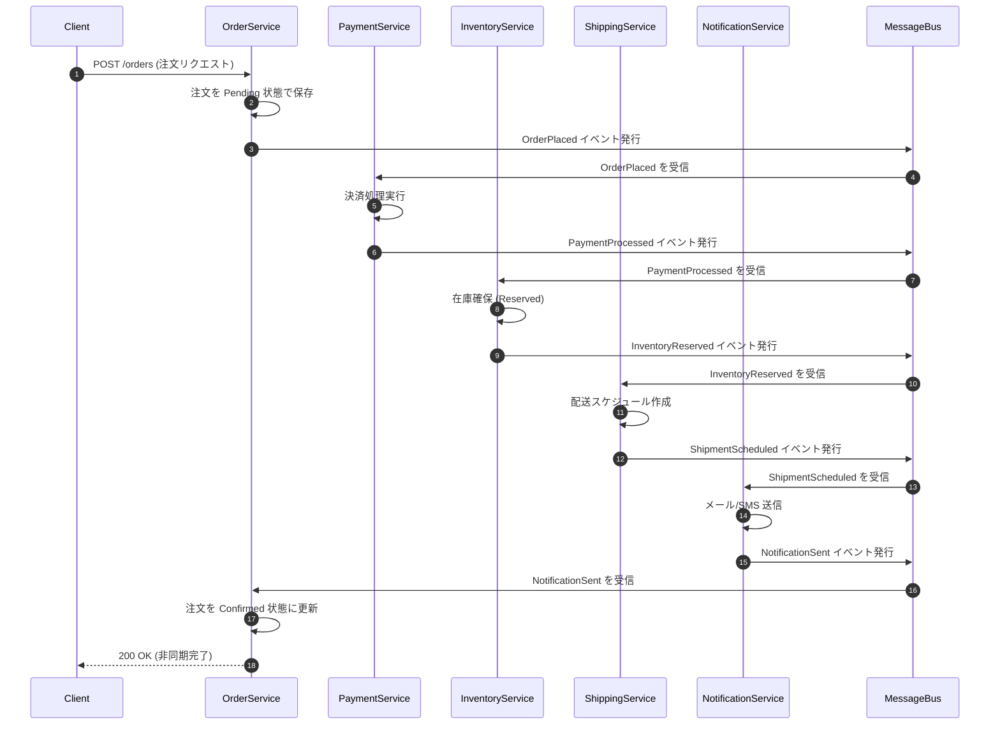
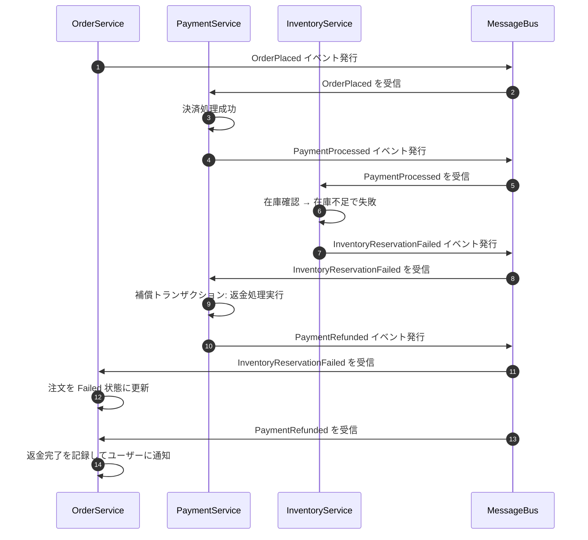
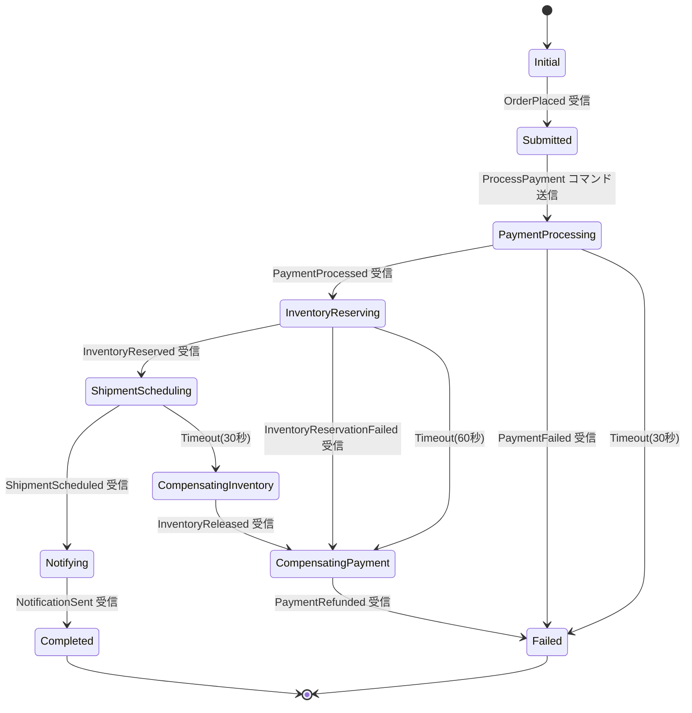

# 第22章 Saga パターンと Process Manager — 分散トランザクションの完全ガイド

---

## 0. TL;DR（3行）

分散マイクロサービスでは 2相コミットが運用上不可能であるため、Saga パターンによる補償トランザクションが唯一の実践的解です。Choreography（コレオグラフィ）は疎結合でシンプルですが可視性が低く、Orchestration（オーケストレーション）は状態が一元管理できる反面、中央集権的になります。Outbox Pattern とべき等性実装を組み合わせて初めて、At-least-once 配信下での安全な Saga が実現できます。

---

## 1. なぜ分散トランザクションが難しいか（理論編）

### 1.1 ACID vs BASE の完全比較

モノリシックアーキテクチャで RDB を使う場合、ACID トランザクションという強力な保証が得られます。しかしマイクロサービスへ移行し、各サービスが独立したデータベースを持つ瞬間、この前提は崩壊します。

**ACID（強整合性モデル）**

| プロパティ | 意味 | 保証の強度 |
|-----------|------|-----------|
| **Atomicity（原子性）** | すべて成功するか、すべて失敗するか | 強 |
| **Consistency（一貫性）** | データは常に有効な状態を維持する | 強 |
| **Isolation（隔離性）** | 並行トランザクションは互いに干渉しない | 強（レベル依存） |
| **Durability（永続性）** | コミット後はクラッシュしても消えない | 強 |

ACID は同一 DB サーバー内でのみ保証されます。PostgreSQL の `BEGIN ... COMMIT` は、同じ接続が同じデータベース・サーバーを対象としている場合にのみ機能します。

**BASE（弱整合性モデル）**

| プロパティ | 意味 |
|-----------|------|
| **Basically Available** | 部分障害があっても応答を返す |
| **Soft State** | 外部入力がなくても状態が変化し得る |
| **Eventual Consistency** | しばらく待てば整合性が取れる |

BASE は「常に整合している」のではなく、「最終的には整合する」という合意です。EC サイトで言えば、「注文ページで在庫あり表示 → 実際の在庫確保は数秒後」という状態が BASE の具体例です。

**アーキテクトとしての判断基準**

マイクロサービスにおいては、ACID を諦めて BASE を受け入れることが設計の大前提です。ただし「最終的整合性」が許容されないビジネス要件（例：銀行の送金）では、アーキテクチャ自体を再検討するか、単一サービス境界内に収める判断が必要です。

### 1.2 2相コミット（2PC）の問題点

分散トランザクションを実現しようとして最初に思いつくのが 2相コミット（Two-Phase Commit, 2PC）です。しかし 2PC は理論的には正しくても、マイクロサービス環境では致命的な問題を抱えています。

**2PC の仕組み**

```
Phase 1（準備フェーズ）:
  コーディネーター → 各参加者: "コミットの準備ができているか？"
  各参加者 → コーディネーター: "準備 OK / 失敗"

Phase 2（コミットフェーズ）:
  全員 OK → コーディネーター → 各参加者: "コミットせよ"
  誰か失敗 → コーディネーター → 各参加者: "ロールバックせよ"
```

**問題1：ブロッキング（Blocking）**

Phase 1 で全参加者が "準備 OK" を返した後、Phase 2 のコミット指示を待っている間、各参加者はリソースをロックしたまま待機します。コーディネーターがクラッシュすると、参加者は永遠にブロックされます。マイクロサービスが 10 個あり、1つのサービスで 2PC を常時使うと、そのサービスの DB 接続が枯渇し、他のリクエストが詰まります。

**問題2：コーディネーター障害（Coordinator Failure）**

```
[実例シナリオ]
OrderService (コーディネーター) が Phase 2 でコミット指示を送った直後にクラッシュ。
  → PaymentService はコミット済み
  → InventoryService はロールバック待ち
  → データは不整合のまま残る
```

コーディネーターが復帰しても、どの参加者がコミット/ロールバックしたかを再確認するためのプロトコル（3PC など）が必要になり、さらに複雑度が増します。

**問題3：デッドロック（Deadlock）**

複数の 2PC トランザクションが同時に実行されると、参加者 A がリソース X をロック、参加者 B がリソース Y をロックした状態で、A が Y を待ち、B が X を待つデッドロックが発生します。これを検出・解消するために複雑なロック管理が必要です。

**問題4：可用性の低下**

CAP 定理（後述）において 2PC は CP（一貫性と分断耐性）を選び、可用性（A）を犠牲にします。Phase 1 で一つでもタイムアウトすると、トランザクション全体が失敗し、ユーザー体験が悪化します。

**結論：2PC はマイクロサービスでは使わない**

Google の Spanner のような専用分散 DB を除いて、汎用マイクロサービスアーキテクチャで 2PC を採用することは推奨されません。

### 1.3 CAP 定理と Saga の関係

CAP 定理は、分散システムでは以下の3つすべてを同時に保証できないと述べています。

- **C（Consistency）**: 全ノードが同時に同じデータを見る
- **A（Availability）**: すべてのリクエストが応答を受け取れる
- **P（Partition Tolerance）**: ネットワーク分断があっても動作する

実際のマイクロサービスでは **P は必須**（ネットワーク障害は必ず起きる）なため、C と A のどちらを優先するかが選択肢になります。

**Saga は AP（可用性 + 分断耐性）モデル**

Saga は C（強整合性）を諦める代わりに、高い可用性を維持します。各サービスは独立してトランザクションをコミットし、失敗時は補償トランザクション（Compensating Transaction）でロールバックします。

```
従来の ACID トランザクション:
  全サービスが成功するまでコミットしない → 強整合性、低可用性

Saga:
  各サービスが独立してコミット → 結果整合性、高可用性
  失敗時は補償で巻き戻し
```

**整合性ウィンドウの概念**

Saga では、注文サービスがコミットしてから在庫サービスがコミットするまでの間、データは「一時的に不整合」です。このウィンドウを最小化することが設計目標の一つです。

### 1.4 分散システムにおける「部分失敗」の本質

分散システムで最も扱いにくいのが「部分失敗」（Partial Failure）です。モノリスではサービス全体が動いているか止まっているかのどちらかですが、分散システムでは：

- **リクエストが届いたが応答が届かない**: サービスは処理済み、クライアントはタイムアウト
- **処理中にサービスがクラッシュ**: ロールバックが不完全
- **ネットワーク遅延で二重送信**: 同じ処理が2回実行される
- **依存サービスが 503**: 上流は成功、下流は失敗

これらを適切に扱うために、Saga はべき等性（Idempotency）、補償トランザクション、タイムアウト処理を組み合わせる必要があります。

---

## 2. Choreography Saga 完全実装

Choreography Saga では、中央のオーケストレーターは存在しません。各サービスがイベントを受信し、処理後に次のイベントを発行することで、全体のフローが自然に進行します。

### 2.1 成功フロー（5サービスをまたぐ注文確定）

以下のフローを実装します：

```
OrderService → PaymentService → InventoryService → ShippingService → NotificationService
```



### 2.2 部分失敗フロー（在庫不足で補償トランザクション実行）



### 2.3 C# .NET 9 完全実装（MassTransit 使用）

#### 2.3.1 ドメインイベント定義

```csharp
// Contracts/Events/OrderEvents.cs
namespace ECommerce.Contracts.Events;

// 注文配置イベント
public record OrderPlaced(
    Guid OrderId,
    Guid CustomerId,
    Guid IdempotencyKey,
    IReadOnlyList<OrderLineItem> LineItems,
    decimal TotalAmount,
    DateTimeOffset PlacedAt);

public record OrderLineItem(
    Guid ProductId,
    string ProductName,
    int Quantity,
    decimal UnitPrice);

// 決済完了イベント
public record PaymentProcessed(
    Guid OrderId,
    Guid PaymentId,
    Guid IdempotencyKey,
    decimal Amount,
    string Currency,
    DateTimeOffset ProcessedAt);

// 決済失敗イベント
public record PaymentFailed(
    Guid OrderId,
    Guid IdempotencyKey,
    string Reason,
    DateTimeOffset FailedAt);

// 在庫確保成功イベント
public record InventoryReserved(
    Guid OrderId,
    Guid ReservationId,
    Guid IdempotencyKey,
    IReadOnlyList<ReservedItem> Items,
    DateTimeOffset ReservedAt);

public record ReservedItem(Guid ProductId, int Quantity);

// 在庫確保失敗イベント
public record InventoryReservationFailed(
    Guid OrderId,
    Guid IdempotencyKey,
    string Reason,
    IReadOnlyList<Guid> OutOfStockProductIds,
    DateTimeOffset FailedAt);

// 配送スケジュールイベント
public record ShipmentScheduled(
    Guid OrderId,
    Guid ShipmentId,
    Guid IdempotencyKey,
    string TrackingNumber,
    DateTimeOffset EstimatedDeliveryAt,
    DateTimeOffset ScheduledAt);

// 通知送信イベント
public record NotificationSent(
    Guid OrderId,
    Guid IdempotencyKey,
    string Channel,
    DateTimeOffset SentAt);

// 補償イベント
public record PaymentRefundRequested(
    Guid OrderId,
    Guid PaymentId,
    Guid IdempotencyKey,
    string Reason);

public record PaymentRefunded(
    Guid OrderId,
    Guid RefundId,
    Guid IdempotencyKey,
    DateTimeOffset RefundedAt);

// 注文完了・失敗通知
public record OrderCompleted(
    Guid OrderId,
    Guid CustomerId,
    string TrackingNumber,
    DateTimeOffset CompletedAt);

public record OrderFailed(
    Guid OrderId,
    string Reason,
    DateTimeOffset FailedAt);
```

#### 2.3.2 べき等性 (Idempotency) の実装 — Inbox パターン

```csharp
// Infrastructure/Idempotency/InboxMessage.cs
namespace ECommerce.Infrastructure.Idempotency;

public sealed class InboxMessage
{
    public Guid Id { get; init; }           // IdempotencyKey
    public string EventType { get; init; } = string.Empty;
    public string Payload { get; init; } = string.Empty;
    public DateTimeOffset ReceivedAt { get; init; }
    public DateTimeOffset? ProcessedAt { get; private set; }
    public bool IsProcessed => ProcessedAt.HasValue;

    public void MarkProcessed()
    {
        ProcessedAt = DateTimeOffset.UtcNow;
    }
}

// インターフェース定義
public interface IHasIdempotencyKey
{
    Guid IdempotencyKey { get; }
}

// Infrastructure/Idempotency/IdempotencyFilter.cs
using MassTransit;
using Microsoft.EntityFrameworkCore;

namespace ECommerce.Infrastructure.Idempotency;

/// <summary>
/// MassTransit のフィルターとして全コンシューマーに適用する Inbox フィルター。
/// 同じ IdempotencyKey を持つメッセージを二重処理から保護します。
/// </summary>
public sealed class IdempotencyFilter<T> : IFilter<ConsumeContext<T>>
    where T : class, IHasIdempotencyKey
{
    private readonly IServiceProvider _serviceProvider;

    public IdempotencyFilter(IServiceProvider serviceProvider)
    {
        _serviceProvider = serviceProvider;
    }

    public async Task Send(ConsumeContext<T> context, IPipe<ConsumeContext<T>> next)
    {
        using var scope = _serviceProvider.CreateScope();
        var db = scope.ServiceProvider.GetRequiredService<ApplicationDbContext>();

        var idempotencyKey = context.Message.IdempotencyKey;
        var eventType = typeof(T).Name;

        // 既に処理済みか確認（排他ロックを取得）
        var existing = await db.InboxMessages
            .FromSqlRaw(
                "SELECT * FROM inbox_messages WHERE id = {0} FOR UPDATE SKIP LOCKED",
                idempotencyKey)
            .FirstOrDefaultAsync(context.CancellationToken);

        if (existing?.IsProcessed == true)
        {
            // 処理済み → スキップ（べき等に処理）
            return;
        }

        if (existing is null)
        {
            // 初回受信 → Inbox に記録
            var inbox = new InboxMessage
            {
                Id = idempotencyKey,
                EventType = eventType,
                Payload = System.Text.Json.JsonSerializer.Serialize(context.Message),
                ReceivedAt = DateTimeOffset.UtcNow,
            };
            db.InboxMessages.Add(inbox);
            await db.SaveChangesAsync(context.CancellationToken);
        }

        // 実際の処理を実行
        await next.Send(context);

        // 処理完了をマーク
        var processed = await db.InboxMessages
            .FindAsync([idempotencyKey], context.CancellationToken);
        processed?.MarkProcessed();
        await db.SaveChangesAsync(context.CancellationToken);
    }

    public void Probe(ProbeContext context)
        => context.CreateScope("idempotency-filter");
}
```

#### 2.3.3 OrderService — 注文コンシューマー

```csharp
// OrderService/Consumers/NotificationSentConsumer.cs
using ECommerce.Contracts.Events;
using MassTransit;

namespace OrderService.Consumers;

public sealed class NotificationSentConsumer : IConsumer<NotificationSent>
{
    private readonly IOrderRepository _orderRepository;
    private readonly ILogger<NotificationSentConsumer> _logger;

    public NotificationSentConsumer(
        IOrderRepository orderRepository,
        ILogger<NotificationSentConsumer> logger)
    {
        _orderRepository = orderRepository;
        _logger = logger;
    }

    public async Task Consume(ConsumeContext<NotificationSent> context)
    {
        var message = context.Message;
        _logger.LogInformation("通知送信完了を受信。OrderId: {OrderId}", message.OrderId);

        var order = await _orderRepository.GetByIdAsync(message.OrderId, context.CancellationToken)
            ?? throw new InvalidOperationException($"注文が見つかりません: {message.OrderId}");

        order.Confirm();
        await _orderRepository.UpdateAsync(order, context.CancellationToken);

        _logger.LogInformation("注文を確定状態に更新しました。OrderId: {OrderId}", message.OrderId);
    }
}

public sealed class InventoryReservationFailedConsumer : IConsumer<InventoryReservationFailed>
{
    private readonly IOrderRepository _orderRepository;
    private readonly ILogger<InventoryReservationFailedConsumer> _logger;

    public InventoryReservationFailedConsumer(
        IOrderRepository orderRepository,
        ILogger<InventoryReservationFailedConsumer> logger)
    {
        _orderRepository = orderRepository;
        _logger = logger;
    }

    public async Task Consume(ConsumeContext<InventoryReservationFailed> context)
    {
        var message = context.Message;
        _logger.LogWarning(
            "在庫確保失敗を受信。OrderId: {OrderId}, 理由: {Reason}",
            message.OrderId, message.Reason);

        var order = await _orderRepository.GetByIdAsync(message.OrderId, context.CancellationToken)
            ?? throw new InvalidOperationException($"注文が見つかりません: {message.OrderId}");

        order.Fail(message.Reason);
        await _orderRepository.UpdateAsync(order, context.CancellationToken);
    }
}
```

#### 2.3.4 PaymentService — 決済コンシューマー

```csharp
// PaymentService/Consumers/OrderPlacedConsumer.cs
using ECommerce.Contracts.Events;
using MassTransit;

namespace PaymentService.Consumers;

public sealed class OrderPlacedConsumer : IConsumer<OrderPlaced>
{
    private readonly IPaymentGateway _paymentGateway;
    private readonly IPaymentRepository _paymentRepository;
    private readonly IPublishEndpoint _publishEndpoint;
    private readonly ILogger<OrderPlacedConsumer> _logger;

    public OrderPlacedConsumer(
        IPaymentGateway paymentGateway,
        IPaymentRepository paymentRepository,
        IPublishEndpoint publishEndpoint,
        ILogger<OrderPlacedConsumer> logger)
    {
        _paymentGateway = paymentGateway;
        _paymentRepository = paymentRepository;
        _publishEndpoint = publishEndpoint;
        _logger = logger;
    }

    public async Task Consume(ConsumeContext<OrderPlaced> context)
    {
        var order = context.Message;
        _logger.LogInformation("注文を受信。決済処理開始。OrderId: {OrderId}", order.OrderId);

        try
        {
            // 決済処理（外部ゲートウェイ呼び出し）
            // IdempotencyKey を外部ゲートウェイにも渡すことで、
            // ゲートウェイ側でも二重課金を防ぐ
            var result = await _paymentGateway.ProcessAsync(new PaymentRequest(
                OrderId: order.OrderId,
                Amount: order.TotalAmount,
                Currency: "JPY",
                CustomerId: order.CustomerId,
                IdempotencyKey: order.IdempotencyKey
            ), context.CancellationToken);

            // 決済レコードを保存
            var payment = new Payment(
                Id: result.PaymentId,
                OrderId: order.OrderId,
                Amount: order.TotalAmount,
                Status: PaymentStatus.Completed);

            await _paymentRepository.SaveAsync(payment, context.CancellationToken);

            // 成功イベントを発行
            await _publishEndpoint.Publish(new PaymentProcessed(
                OrderId: order.OrderId,
                PaymentId: result.PaymentId,
                IdempotencyKey: Guid.NewGuid(),
                Amount: order.TotalAmount,
                Currency: "JPY",
                ProcessedAt: DateTimeOffset.UtcNow
            ), context.CancellationToken);

            _logger.LogInformation("決済完了。PaymentId: {PaymentId}", result.PaymentId);
        }
        catch (PaymentGatewayException ex)
        {
            _logger.LogError(ex, "決済失敗。OrderId: {OrderId}", order.OrderId);

            await _publishEndpoint.Publish(new PaymentFailed(
                OrderId: order.OrderId,
                IdempotencyKey: Guid.NewGuid(),
                Reason: ex.Message,
                FailedAt: DateTimeOffset.UtcNow
            ), context.CancellationToken);
        }
    }
}

// 補償: 在庫不足による返金処理
public sealed class InventoryReservationFailedConsumer : IConsumer<InventoryReservationFailed>
{
    private readonly IPaymentGateway _paymentGateway;
    private readonly IPaymentRepository _paymentRepository;
    private readonly IPublishEndpoint _publishEndpoint;
    private readonly ILogger<InventoryReservationFailedConsumer> _logger;

    public InventoryReservationFailedConsumer(
        IPaymentGateway paymentGateway,
        IPaymentRepository paymentRepository,
        IPublishEndpoint publishEndpoint,
        ILogger<InventoryReservationFailedConsumer> logger)
    {
        _paymentGateway = paymentGateway;
        _paymentRepository = paymentRepository;
        _publishEndpoint = publishEndpoint;
        _logger = logger;
    }

    public async Task Consume(ConsumeContext<InventoryReservationFailed> context)
    {
        var message = context.Message;
        _logger.LogWarning("在庫不足のため返金処理開始。OrderId: {OrderId}", message.OrderId);

        var payment = await _paymentRepository.GetByOrderIdAsync(
            message.OrderId, context.CancellationToken);

        if (payment is null)
        {
            _logger.LogWarning("返金対象の決済が見つかりません。OrderId: {OrderId}", message.OrderId);
            return;
        }

        // 返金実行（IdempotencyKey を渡して二重返金を防ぐ）
        var refundResult = await _paymentGateway.RefundAsync(new RefundRequest(
            PaymentId: payment.Id,
            Amount: payment.Amount,
            Reason: $"在庫不足: {message.Reason}",
            IdempotencyKey: message.IdempotencyKey
        ), context.CancellationToken);

        payment.MarkRefunded(refundResult.RefundId);
        await _paymentRepository.UpdateAsync(payment, context.CancellationToken);

        await _publishEndpoint.Publish(new PaymentRefunded(
            OrderId: message.OrderId,
            RefundId: refundResult.RefundId,
            IdempotencyKey: Guid.NewGuid(),
            RefundedAt: DateTimeOffset.UtcNow
        ), context.CancellationToken);

        _logger.LogInformation("返金完了。RefundId: {RefundId}", refundResult.RefundId);
    }
}
```

#### 2.3.5 InventoryService — 在庫コンシューマー

```csharp
// InventoryService/Consumers/PaymentProcessedConsumer.cs
using ECommerce.Contracts.Events;
using MassTransit;

namespace InventoryService.Consumers;

public sealed class PaymentProcessedConsumer : IConsumer<PaymentProcessed>
{
    private readonly IInventoryRepository _inventoryRepository;
    private readonly IPublishEndpoint _publishEndpoint;
    private readonly ILogger<PaymentProcessedConsumer> _logger;

    public PaymentProcessedConsumer(
        IInventoryRepository inventoryRepository,
        IPublishEndpoint publishEndpoint,
        ILogger<PaymentProcessedConsumer> logger)
    {
        _inventoryRepository = inventoryRepository;
        _publishEndpoint = publishEndpoint;
        _logger = logger;
    }

    public async Task Consume(ConsumeContext<PaymentProcessed> context)
    {
        var payment = context.Message;
        _logger.LogInformation("決済完了受信。在庫確保開始。OrderId: {OrderId}", payment.OrderId);

        // 注文明細を取得（別途 ReadModel から）
        var orderItems = await _inventoryRepository.GetOrderItemsAsync(
            payment.OrderId, context.CancellationToken);

        // 全商品の在庫確認
        var insufficientItems = new List<Guid>();
        foreach (var item in orderItems)
        {
            var available = await _inventoryRepository.GetAvailableStockAsync(
                item.ProductId, context.CancellationToken);

            if (available < item.Quantity)
            {
                insufficientItems.Add(item.ProductId);
            }
        }

        if (insufficientItems.Count > 0)
        {
            _logger.LogWarning(
                "在庫不足。OrderId: {OrderId}, 商品数: {Count}",
                payment.OrderId, insufficientItems.Count);

            await _publishEndpoint.Publish(new InventoryReservationFailed(
                OrderId: payment.OrderId,
                IdempotencyKey: Guid.NewGuid(),
                Reason: "在庫不足",
                OutOfStockProductIds: insufficientItems,
                FailedAt: DateTimeOffset.UtcNow
            ), context.CancellationToken);

            return;
        }

        // 在庫確保（楽観的ロックで競合を防ぐ）
        var reservation = await _inventoryRepository.ReserveAsync(
            payment.OrderId, orderItems, context.CancellationToken);

        await _publishEndpoint.Publish(new InventoryReserved(
            OrderId: payment.OrderId,
            ReservationId: reservation.Id,
            IdempotencyKey: Guid.NewGuid(),
            Items: reservation.Items
                .Select(i => new ReservedItem(i.ProductId, i.Quantity))
                .ToList(),
            ReservedAt: DateTimeOffset.UtcNow
        ), context.CancellationToken);

        _logger.LogInformation("在庫確保完了。ReservationId: {ReservationId}", reservation.Id);
    }
}
```

#### 2.3.6 MassTransit 設定（Program.cs）

```csharp
// OrderService/Program.cs
using MassTransit;
using OrderService.Consumers;

var builder = WebApplication.CreateBuilder(args);

builder.Services.AddMassTransit(x =>
{
    // コンシューマーを登録
    x.AddConsumer<NotificationSentConsumer>();
    x.AddConsumer<InventoryReservationFailedConsumer>();
    x.AddConsumer<PaymentRefundedConsumer>();

    x.UsingRabbitMq((ctx, cfg) =>
    {
        cfg.Host(builder.Configuration.GetConnectionString("RabbitMq"), h =>
        {
            h.Username("guest");
            h.Password("guest");
        });

        cfg.ReceiveEndpoint("order-service", e =>
        {
            // 指数バックオフでリトライ: 1s, 3s, 7s
            e.UseMessageRetry(r => r.Incremental(3,
                initialInterval: TimeSpan.FromSeconds(1),
                intervalIncrement: TimeSpan.FromSeconds(2)));

            // Outbox（コンシューマー内での発行を Outbox 経由にする）
            e.UseInMemoryOutbox(ctx);

            e.ConfigureConsumer<NotificationSentConsumer>(ctx);
            e.ConfigureConsumer<InventoryReservationFailedConsumer>(ctx);
            e.ConfigureConsumer<PaymentRefundedConsumer>(ctx);
        });

        cfg.ConfigureEndpoints(ctx);
    });
});

var app = builder.Build();
app.Run();
```

---

## 3. Orchestration Saga (Process Manager) 完全実装

Orchestration Saga では、中央の Process Manager がフロー全体を制御します。各サービスへのコマンド送信と応答受信を Process Manager が管理し、現在の状態を永続化します。

### 3.1 状態機械（State Machine）としての Process Manager 設計

**全状態と遷移の定義**

| 状態 | 説明 | 前状態 | 次状態（正常） | 次状態（異常） |
|------|------|--------|----------------|----------------|
| `Initial` | Saga 開始前 | — | Submitted | — |
| `Submitted` | 注文受付済み | Initial | PaymentProcessing | — |
| `PaymentProcessing` | 決済処理中 | Submitted | InventoryReserving | Failed |
| `InventoryReserving` | 在庫確保中 | PaymentProcessing | ShipmentScheduling | CompensatingPayment |
| `ShipmentScheduling` | 配送スケジュール作成中 | InventoryReserving | Notifying | CompensatingInventory |
| `Notifying` | 通知送信中 | ShipmentScheduling | Completed | — |
| `Completed` | 全処理完了 | Notifying | — | — |
| `CompensatingPayment` | 決済返金中 | InventoryReserving | Failed | — |
| `CompensatingInventory` | 在庫返却中 | ShipmentScheduling | CompensatingPayment | — |
| `Failed` | 失敗（補償完了） | 各失敗状態 | — | — |



### 3.2 Saga インスタンス（永続化対象）

```csharp
// OrderSaga/OrderSagaInstance.cs
using MassTransit;

namespace OrderSaga;

/// <summary>
/// Saga の状態インスタンス。PostgreSQL に永続化されます。
/// SagaStateMachineInstance を実装することで MassTransit が自動管理します。
/// </summary>
public sealed class OrderSagaInstance : SagaStateMachineInstance
{
    public Guid CorrelationId { get; set; }    // Saga の一意識別子（= OrderId）
    public string CurrentState { get; set; } = null!;

    // ビジネスデータ
    public Guid CustomerId { get; set; }
    public decimal TotalAmount { get; set; }
    public string Currency { get; set; } = "JPY";

    // 各ステップの結果を保存
    public Guid? PaymentId { get; set; }
    public Guid? ReservationId { get; set; }
    public Guid? ShipmentId { get; set; }
    public string? TrackingNumber { get; set; }

    // 失敗情報
    public string? FailureReason { get; set; }

    // タイムアウト管理（MassTransit Schedule のトークン ID）
    public Guid? PaymentTimeoutTokenId { get; set; }
    public Guid? InventoryTimeoutTokenId { get; set; }
    public Guid? ShipmentTimeoutTokenId { get; set; }

    // 再試行カウント
    public int RetryCount { get; set; }

    // タイムスタンプ
    public DateTimeOffset CreatedAt { get; set; }
    public DateTimeOffset UpdatedAt { get; set; }
}

// タイムアウトメッセージ定義
public record PaymentTimeout(Guid OrderId);
public record InventoryTimeout(Guid OrderId);
public record ShipmentTimeout(Guid OrderId);

// コマンド定義
public record ProcessPaymentCommand(Guid OrderId, Guid CustomerId, decimal Amount, string Currency, Guid IdempotencyKey);
public record ReserveInventoryCommand(Guid OrderId, Guid IdempotencyKey);
public record ScheduleShipmentCommand(Guid OrderId, string? Notes, Guid IdempotencyKey);
public record SendOrderConfirmationCommand(Guid OrderId, string TrackingNumber, Guid IdempotencyKey);
public record RefundPaymentCommand(Guid OrderId, Guid PaymentId, string Reason, Guid IdempotencyKey);
public record ReleaseInventoryCommand(Guid OrderId, Guid ReservationId, Guid IdempotencyKey);

// 追加イベント
public record InventoryReleased(Guid OrderId, Guid ReservationId, Guid IdempotencyKey, DateTimeOffset ReleasedAt);
```

### 3.3 Saga ステートマシン完全実装

```csharp
// OrderSaga/OrderStateMachine.cs
using ECommerce.Contracts.Events;
using MassTransit;

namespace OrderSaga;

/// <summary>
/// 注文 Saga のオーケストレーション実装。
/// MassTransitStateMachine を継承することで状態遷移ロジックを宣言的に記述できます。
/// </summary>
public sealed class OrderStateMachine : MassTransitStateMachine<OrderSagaInstance>
{
    // =============================
    // 状態定義
    // =============================
    public State Submitted { get; private set; } = null!;
    public State PaymentProcessing { get; private set; } = null!;
    public State InventoryReserving { get; private set; } = null!;
    public State ShipmentScheduling { get; private set; } = null!;
    public State Notifying { get; private set; } = null!;
    public State Completed { get; private set; } = null!;
    public State CompensatingPayment { get; private set; } = null!;
    public State CompensatingInventory { get; private set; } = null!;
    public State Failed { get; private set; } = null!;

    // =============================
    // イベント定義
    // =============================
    public Event<OrderPlaced> OrderPlaced { get; private set; } = null!;
    public Event<PaymentProcessed> PaymentProcessed { get; private set; } = null!;
    public Event<PaymentFailed> PaymentFailed { get; private set; } = null!;
    public Event<InventoryReserved> InventoryReserved { get; private set; } = null!;
    public Event<InventoryReservationFailed> InventoryReservationFailed { get; private set; } = null!;
    public Event<ShipmentScheduled> ShipmentScheduled { get; private set; } = null!;
    public Event<NotificationSent> NotificationSent { get; private set; } = null!;
    public Event<PaymentRefunded> PaymentRefunded { get; private set; } = null!;
    public Event<InventoryReleased> InventoryReleased { get; private set; } = null!;

    // =============================
    // スケジュール（タイムアウト）定義
    // =============================
    public Schedule<OrderSagaInstance, PaymentTimeout> PaymentTimeoutSchedule { get; private set; } = null!;
    public Schedule<OrderSagaInstance, InventoryTimeout> InventoryTimeoutSchedule { get; private set; } = null!;
    public Schedule<OrderSagaInstance, ShipmentTimeout> ShipmentTimeoutSchedule { get; private set; } = null!;

    public OrderStateMachine()
    {
        // CorrelationId の設定（OrderId を使って Saga を特定）
        Event(() => OrderPlaced, x => x.CorrelateById(m => m.Message.OrderId));
        Event(() => PaymentProcessed, x => x.CorrelateById(m => m.Message.OrderId));
        Event(() => PaymentFailed, x => x.CorrelateById(m => m.Message.OrderId));
        Event(() => InventoryReserved, x => x.CorrelateById(m => m.Message.OrderId));
        Event(() => InventoryReservationFailed, x => x.CorrelateById(m => m.Message.OrderId));
        Event(() => ShipmentScheduled, x => x.CorrelateById(m => m.Message.OrderId));
        Event(() => NotificationSent, x => x.CorrelateById(m => m.Message.OrderId));
        Event(() => PaymentRefunded, x => x.CorrelateById(m => m.Message.OrderId));
        Event(() => InventoryReleased, x => x.CorrelateById(m => m.Message.OrderId));

        // タイムアウトスケジュール設定
        Schedule(
            () => PaymentTimeoutSchedule,
            instance => instance.PaymentTimeoutTokenId,
            s =>
            {
                s.Delay = TimeSpan.FromSeconds(30);
                s.Received = r => r.CorrelateById(m => m.Message.OrderId);
            });

        Schedule(
            () => InventoryTimeoutSchedule,
            instance => instance.InventoryTimeoutTokenId,
            s =>
            {
                s.Delay = TimeSpan.FromSeconds(60);
                s.Received = r => r.CorrelateById(m => m.Message.OrderId);
            });

        Schedule(
            () => ShipmentTimeoutSchedule,
            instance => instance.ShipmentTimeoutTokenId,
            s =>
            {
                s.Delay = TimeSpan.FromSeconds(30);
                s.Received = r => r.CorrelateById(m => m.Message.OrderId);
            });

        // 現在の状態をインスタンスの CurrentState フィールドに保存
        InstanceState(x => x.CurrentState);

        // =============================
        // 初期状態からの遷移
        // =============================
        Initially(
            When(OrderPlaced)
                .Then(InitializeInstance)
                .SendAsync(
                    ctx => new Uri("queue:payment-service"),
                    ctx => ctx.Init<ProcessPaymentCommand>(new ProcessPaymentCommand(
                        OrderId: ctx.Saga.CorrelationId,
                        CustomerId: ctx.Saga.CustomerId,
                        Amount: ctx.Saga.TotalAmount,
                        Currency: ctx.Saga.Currency,
                        IdempotencyKey: Guid.NewGuid())))
                .Schedule(PaymentTimeoutSchedule,
                    ctx => ctx.Init<PaymentTimeout>(new PaymentTimeout(ctx.Saga.CorrelationId)))
                .TransitionTo(PaymentProcessing)
        );

        // =============================
        // PaymentProcessing 状態での遷移
        // =============================
        During(PaymentProcessing,
            When(PaymentProcessed)
                .Then(ctx =>
                {
                    ctx.Saga.PaymentId = ctx.Message.PaymentId;
                    ctx.Saga.UpdatedAt = DateTimeOffset.UtcNow;
                })
                .Unschedule(PaymentTimeoutSchedule)
                .SendAsync(
                    ctx => new Uri("queue:inventory-service"),
                    ctx => ctx.Init<ReserveInventoryCommand>(new ReserveInventoryCommand(
                        OrderId: ctx.Saga.CorrelationId,
                        IdempotencyKey: Guid.NewGuid())))
                .Schedule(InventoryTimeoutSchedule,
                    ctx => ctx.Init<InventoryTimeout>(new InventoryTimeout(ctx.Saga.CorrelationId)))
                .TransitionTo(InventoryReserving),

            When(PaymentFailed)
                .Then(ctx =>
                {
                    ctx.Saga.FailureReason = ctx.Message.Reason;
                    ctx.Saga.UpdatedAt = DateTimeOffset.UtcNow;
                })
                .Unschedule(PaymentTimeoutSchedule)
                .PublishAsync(ctx => ctx.Init<OrderFailed>(new OrderFailed(
                    OrderId: ctx.Saga.CorrelationId,
                    Reason: ctx.Message.Reason,
                    FailedAt: DateTimeOffset.UtcNow)))
                .TransitionTo(Failed)
                .Finalize(),

            When(PaymentTimeoutSchedule.Received)
                .Then(ctx =>
                {
                    ctx.Saga.FailureReason = "決済サービスがタイムアウトしました (30秒)";
                    ctx.Saga.UpdatedAt = DateTimeOffset.UtcNow;
                })
                .PublishAsync(ctx => ctx.Init<OrderFailed>(new OrderFailed(
                    OrderId: ctx.Saga.CorrelationId,
                    Reason: "決済タイムアウト",
                    FailedAt: DateTimeOffset.UtcNow)))
                .TransitionTo(Failed)
                .Finalize()
        );

        // =============================
        // InventoryReserving 状態での遷移
        // =============================
        During(InventoryReserving,
            When(InventoryReserved)
                .Then(ctx =>
                {
                    ctx.Saga.ReservationId = ctx.Message.ReservationId;
                    ctx.Saga.UpdatedAt = DateTimeOffset.UtcNow;
                })
                .Unschedule(InventoryTimeoutSchedule)
                .SendAsync(
                    ctx => new Uri("queue:shipping-service"),
                    ctx => ctx.Init<ScheduleShipmentCommand>(new ScheduleShipmentCommand(
                        OrderId: ctx.Saga.CorrelationId,
                        Notes: null,
                        IdempotencyKey: Guid.NewGuid())))
                .Schedule(ShipmentTimeoutSchedule,
                    ctx => ctx.Init<ShipmentTimeout>(new ShipmentTimeout(ctx.Saga.CorrelationId)))
                .TransitionTo(ShipmentScheduling),

            When(InventoryReservationFailed)
                .Then(ctx =>
                {
                    ctx.Saga.FailureReason = ctx.Message.Reason;
                    ctx.Saga.UpdatedAt = DateTimeOffset.UtcNow;
                })
                .Unschedule(InventoryTimeoutSchedule)
                // 補償：決済を返金する
                .SendAsync(
                    ctx => new Uri("queue:payment-service"),
                    ctx => ctx.Init<RefundPaymentCommand>(new RefundPaymentCommand(
                        OrderId: ctx.Saga.CorrelationId,
                        PaymentId: ctx.Saga.PaymentId!.Value,
                        Reason: ctx.Message.Reason,
                        IdempotencyKey: Guid.NewGuid())))
                .TransitionTo(CompensatingPayment),

            When(InventoryTimeoutSchedule.Received)
                .Then(ctx =>
                {
                    ctx.Saga.FailureReason = "在庫サービスがタイムアウトしました (60秒)";
                    ctx.Saga.UpdatedAt = DateTimeOffset.UtcNow;
                })
                .SendAsync(
                    ctx => new Uri("queue:payment-service"),
                    ctx => ctx.Init<RefundPaymentCommand>(new RefundPaymentCommand(
                        OrderId: ctx.Saga.CorrelationId,
                        PaymentId: ctx.Saga.PaymentId!.Value,
                        Reason: "在庫確保タイムアウト",
                        IdempotencyKey: Guid.NewGuid())))
                .TransitionTo(CompensatingPayment)
        );

        // =============================
        // ShipmentScheduling 状態での遷移
        // =============================
        During(ShipmentScheduling,
            When(ShipmentScheduled)
                .Then(ctx =>
                {
                    ctx.Saga.ShipmentId = ctx.Message.ShipmentId;
                    ctx.Saga.TrackingNumber = ctx.Message.TrackingNumber;
                    ctx.Saga.UpdatedAt = DateTimeOffset.UtcNow;
                })
                .Unschedule(ShipmentTimeoutSchedule)
                .SendAsync(
                    ctx => new Uri("queue:notification-service"),
                    ctx => ctx.Init<SendOrderConfirmationCommand>(new SendOrderConfirmationCommand(
                        OrderId: ctx.Saga.CorrelationId,
                        TrackingNumber: ctx.Saga.TrackingNumber!,
                        IdempotencyKey: Guid.NewGuid())))
                .TransitionTo(Notifying),

            When(ShipmentTimeoutSchedule.Received)
                .Then(ctx =>
                {
                    ctx.Saga.FailureReason = "配送サービスがタイムアウトしました (30秒)";
                    ctx.Saga.UpdatedAt = DateTimeOffset.UtcNow;
                })
                // 補償: 在庫を解放 → 決済を返金（逆順）
                .SendAsync(
                    ctx => new Uri("queue:inventory-service"),
                    ctx => ctx.Init<ReleaseInventoryCommand>(new ReleaseInventoryCommand(
                        OrderId: ctx.Saga.CorrelationId,
                        ReservationId: ctx.Saga.ReservationId!.Value,
                        IdempotencyKey: Guid.NewGuid())))
                .TransitionTo(CompensatingInventory)
        );

        // =============================
        // Notifying 状態での遷移
        // =============================
        During(Notifying,
            When(NotificationSent)
                .Then(ctx => ctx.Saga.UpdatedAt = DateTimeOffset.UtcNow)
                .PublishAsync(ctx => ctx.Init<OrderCompleted>(new OrderCompleted(
                    OrderId: ctx.Saga.CorrelationId,
                    CustomerId: ctx.Saga.CustomerId,
                    TrackingNumber: ctx.Saga.TrackingNumber!,
                    CompletedAt: DateTimeOffset.UtcNow)))
                .TransitionTo(Completed)
                .Finalize()
        );

        // =============================
        // CompensatingInventory 状態での遷移
        // =============================
        During(CompensatingInventory,
            When(InventoryReleased)
                .Then(ctx => ctx.Saga.UpdatedAt = DateTimeOffset.UtcNow)
                .SendAsync(
                    ctx => new Uri("queue:payment-service"),
                    ctx => ctx.Init<RefundPaymentCommand>(new RefundPaymentCommand(
                        OrderId: ctx.Saga.CorrelationId,
                        PaymentId: ctx.Saga.PaymentId!.Value,
                        Reason: ctx.Saga.FailureReason ?? "配送タイムアウト",
                        IdempotencyKey: Guid.NewGuid())))
                .TransitionTo(CompensatingPayment)
        );

        // =============================
        // CompensatingPayment 状態での遷移
        // =============================
        During(CompensatingPayment,
            When(PaymentRefunded)
                .Then(ctx => ctx.Saga.UpdatedAt = DateTimeOffset.UtcNow)
                .PublishAsync(ctx => ctx.Init<OrderFailed>(new OrderFailed(
                    OrderId: ctx.Saga.CorrelationId,
                    Reason: ctx.Saga.FailureReason ?? "不明なエラー",
                    FailedAt: DateTimeOffset.UtcNow)))
                .TransitionTo(Failed)
                .Finalize()
        );

        // 終了状態のインスタンスを DB から削除（完了後のゴミが溜まらないように）
        SetCompletedWhenFinalized();
    }

    private static void InitializeInstance(BehaviorContext<OrderSagaInstance, OrderPlaced> ctx)
    {
        ctx.Saga.CustomerId = ctx.Message.CustomerId;
        ctx.Saga.TotalAmount = ctx.Message.TotalAmount;
        ctx.Saga.CreatedAt = DateTimeOffset.UtcNow;
        ctx.Saga.UpdatedAt = DateTimeOffset.UtcNow;
    }
}
```

### 3.4 Saga 永続化設定（PostgreSQL + EF Core）

```csharp
// OrderSaga/Persistence/OrderSagaDbContext.cs
using Microsoft.EntityFrameworkCore;
using MassTransit.EntityFrameworkCoreIntegration;

namespace OrderSaga.Persistence;

public class OrderSagaDbContext : SagaDbContext
{
    public OrderSagaDbContext(DbContextOptions<OrderSagaDbContext> options) : base(options) { }

    protected override IEnumerable<ISagaClassMap> Configurations
    {
        get { yield return new OrderSagaInstanceMap(); }
    }
}

public sealed class OrderSagaInstanceMap : SagaClassMap<OrderSagaInstance>
{
    protected override void Configure(
        EntityTypeBuilder<OrderSagaInstance> entity,
        ModelBuilder model)
    {
        entity.ToTable("order_saga_instances");

        entity.Property(x => x.CurrentState).HasMaxLength(64).IsRequired();
        entity.Property(x => x.Currency).HasMaxLength(3).IsRequired();
        entity.Property(x => x.FailureReason).HasMaxLength(1024);
        entity.Property(x => x.TrackingNumber).HasMaxLength(256);

        entity.HasIndex(x => x.CurrentState);
        entity.HasIndex(x => x.CreatedAt);
    }
}

// Program.cs での Saga 設定
builder.Services.AddMassTransit(x =>
{
    x.AddSagaStateMachine<OrderStateMachine, OrderSagaInstance>()
        .EntityFrameworkRepository(r =>
        {
            // 楽観的ロックで同時更新を防ぐ
            r.ConcurrencyMode = ConcurrencyMode.Optimistic;
            r.AddDbContext<DbContext, OrderSagaDbContext>((provider, optBuilder) =>
            {
                optBuilder.UseNpgsql(
                    builder.Configuration.GetConnectionString("Postgres"),
                    npgsql => npgsql.MigrationsAssembly(
                        typeof(OrderSagaDbContext).Assembly.FullName));
            });
        });

    x.UsingRabbitMq((ctx, cfg) =>
    {
        cfg.Host(builder.Configuration.GetConnectionString("RabbitMq"));
        cfg.ConfigureEndpoints(ctx);
    });
});
```

---

## 4. Choreography vs Orchestration の選択基準

### 4.1 各アプローチのメリット・デメリット表

| 観点 | Choreography | Orchestration |
|------|-------------|--------------|
| **結合度** | 疎結合（イベントのみ） | 中程度（コマンド送信） |
| **可視性** | 低い（フロー追跡が困難） | 高い（状態が一箇所） |
| **変更容易性** | 低い（参加サービス全体に波及） | 高い（Process Manager のみ変更） |
| **テスト容易性** | 困難（全サービス起動が必要） | 容易（StateMachine 単体テスト可） |
| **デバッグ** | 困難（イベント追跡が必要） | 容易（ログが集中） |
| **スケーラビリティ** | 高い（各サービス独立スケール） | 中程度（PM がボトルネックになりうる） |
| **循環依存リスク** | 高い | 低い |
| **新サービス追加** | 容易（既存サービス無変更） | 中程度（PM の修正が必要） |
| **補償トランザクション管理** | 分散（各サービスが補償ロジックを持つ） | 集中管理（PM が補償を制御） |
| **ビジネスルール変更** | 困難 | 容易 |
| **運用監視** | 困難（分散ログ追跡要） | 容易（状態テーブル参照） |

### 4.2 選択フローチャート

```
Q1: Saga のステップ数は？
  → 3ステップ以下: Choreography（シンプルな方が良い）
  → 4ステップ以上: Q2 へ

Q2: フローの可視性は重要か？（監査・コンプライアンス要件）
  → 重要: Orchestration
  → 重要でない: Q3 へ

Q3: ビジネスルールは頻繁に変わるか？
  → 頻繁に変わる: Orchestration（変更が一箇所で済む）
  → 安定している: Q4 へ

Q4: 参加サービスのチームは独立しているか？
  → 独立している: Choreography（インターフェース契約のみで連携）
  → 同じチームが管理: Orchestration

Q5: 補償トランザクションのロジックは複雑か？
  → 複雑（依存関係あり、順序が重要）: Orchestration
  → シンプル（各サービスが独立して補償可能）: Choreography
```

### 4.3 実際のプロジェクトでの経験則

**Choreography が適している場面**

ドメインイベントが自然な因果関係を持っている場合（「注文完了」→「ポイント付与」など）や、各サービスが独立したチームで開発されており中央管理が困難な場合、またイベントドリブンなリアクティブシステムで柔軟な拡張が必要な場面では Choreography が有効です。

**Orchestration が適している場面**

ビジネスプロセスが明確に定義されており、フローを文書として表現したい場合や、補償ロジックが複雑で順序依存がある場合、タイムアウト管理や再試行ポリシーを一元管理したい場合、システム全体の状態を監視ダッシュボードで可視化したい場合には Orchestration が適しています。

**ハイブリッドアプローチ**

実際の大規模システムでは、純粋な Choreography か Orchestration かではなく、両者を組み合わせることが多いです。例えば「注文ドメイン内は Orchestration で管理し、他ドメインへの通知はイベントとして発行する」という設計が実践的です。

---

## 5. Outbox Pattern（トランザクショナルアウトボックス）

### 5.1 なぜ Outbox Pattern が必要か

Saga の最大の落とし穴は「DB への保存」と「メッセージの発行」の原子性問題です。

**問題のシナリオ**

```csharp
// NG パターン：原子性がない
await db.SaveChangesAsync();         // (1) DB に注文を保存 ← 成功
await bus.Publish(orderPlacedEvent); // (2) イベント発行 ← ここでクラッシュ
// → DB には注文があるが、イベントが届かず後続処理が動かない（幽霊注文）

// 逆パターンも同様に危険
await bus.Publish(orderPlacedEvent); // (1) イベント発行 ← 下流が処理開始
await db.SaveChangesAsync();         // (2) DB 保存 ← ここでクラッシュしてロールバック
// → イベントは届いているが、DB には注文がない
```

**Outbox Pattern の解決策**

DB への書き込みとメッセージのアウトボックスへの記録を同一トランザクションで行い、バックグラウンドで実際のメッセージブローカーへ送信します。これにより「少なくとも一度（At-least-once）」の送信保証が得られます。

### 5.2 C# .NET 9 実装（EF Core + Background Service）

```csharp
// Infrastructure/Outbox/OutboxMessage.cs
namespace ECommerce.Infrastructure.Outbox;

public sealed class OutboxMessage
{
    public Guid Id { get; init; } = Guid.NewGuid();
    public string EventType { get; init; } = string.Empty;
    public string Payload { get; init; } = string.Empty;
    public DateTimeOffset CreatedAt { get; init; } = DateTimeOffset.UtcNow;
    public DateTimeOffset? PublishedAt { get; private set; }
    public int RetryCount { get; private set; }
    public string? LastError { get; private set; }

    public bool IsPublished => PublishedAt.HasValue;

    public void MarkPublished() => PublishedAt = DateTimeOffset.UtcNow;

    public void MarkFailed(string error)
    {
        RetryCount++;
        LastError = error;
    }
}

// Infrastructure/Outbox/IOutboxPublisher.cs
public interface IOutboxPublisher
{
    Task PublishAsync<T>(T @event, CancellationToken ct = default) where T : class;
}

// Infrastructure/Outbox/OutboxPublisher.cs
public sealed class OutboxPublisher : IOutboxPublisher
{
    private readonly ApplicationDbContext _db;

    public OutboxPublisher(ApplicationDbContext db)
    {
        _db = db;
    }

    public async Task PublishAsync<T>(T @event, CancellationToken ct = default)
        where T : class
    {
        // DB のトランザクション内で Outbox テーブルに書き込む
        // 実際の MQ 送信はここでは行わない
        var message = new OutboxMessage
        {
            EventType = typeof(T).AssemblyQualifiedName!,
            Payload = System.Text.Json.JsonSerializer.Serialize(@event),
        };

        _db.OutboxMessages.Add(message);
        // SaveChanges は呼び出し元（業務トランザクション）に任せる
    }
}

// Infrastructure/Outbox/OutboxRelayService.cs
using MassTransit;

namespace ECommerce.Infrastructure.Outbox;

/// <summary>
/// アウトボックスのメッセージを定期的に読み出し、実際の MQ に送信するバックグラウンドサービス。
/// このサービスが再起動しても、未送信メッセージは DB に残っているため失われない。
/// </summary>
public sealed class OutboxRelayService : BackgroundService
{
    private static readonly TimeSpan PollingInterval = TimeSpan.FromMilliseconds(500);
    private const int BatchSize = 100;
    private const int MaxRetryCount = 5;

    private readonly IServiceProvider _serviceProvider;
    private readonly ILogger<OutboxRelayService> _logger;

    public OutboxRelayService(
        IServiceProvider serviceProvider,
        ILogger<OutboxRelayService> logger)
    {
        _serviceProvider = serviceProvider;
        _logger = logger;
    }

    protected override async Task ExecuteAsync(CancellationToken stoppingToken)
    {
        _logger.LogInformation("Outbox Relay Service を開始しました。");

        while (!stoppingToken.IsCancellationRequested)
        {
            try
            {
                await ProcessBatchAsync(stoppingToken);
            }
            catch (OperationCanceledException) when (stoppingToken.IsCancellationRequested)
            {
                break;
            }
            catch (Exception ex)
            {
                _logger.LogError(ex, "Outbox Relay でエラーが発生しました。");
            }

            await Task.Delay(PollingInterval, stoppingToken);
        }

        _logger.LogInformation("Outbox Relay Service を停止しました。");
    }

    internal async Task ProcessBatchAsync(CancellationToken ct)
    {
        using var scope = _serviceProvider.CreateScope();
        var db = scope.ServiceProvider.GetRequiredService<ApplicationDbContext>();
        var publishEndpoint = scope.ServiceProvider.GetRequiredService<IPublishEndpoint>();

        // 未送信かつリトライ上限未達のメッセージを取得
        var messages = await db.OutboxMessages
            .Where(m => m.PublishedAt == null && m.RetryCount < MaxRetryCount)
            .OrderBy(m => m.CreatedAt)
            .Take(BatchSize)
            .ToListAsync(ct);

        if (messages.Count == 0) return;

        _logger.LogDebug("{Count} 件の未送信メッセージを処理します。", messages.Count);

        foreach (var message in messages)
        {
            try
            {
                var eventType = Type.GetType(message.EventType)
                    ?? throw new InvalidOperationException(
                        $"型を解決できません: {message.EventType}");

                var payload = System.Text.Json.JsonSerializer.Deserialize(
                    message.Payload, eventType)
                    ?? throw new InvalidOperationException("デシリアライズ失敗");

                // MassTransit に発行（MessageId に Outbox の Id を使って重複防止）
                await publishEndpoint.Publish(payload, eventType, ctx =>
                {
                    ctx.MessageId = message.Id;
                }, ct);

                message.MarkPublished();
                _logger.LogDebug("メッセージ送信成功。MessageId: {Id}", message.Id);
            }
            catch (Exception ex)
            {
                _logger.LogError(ex, "メッセージ送信失敗。MessageId: {Id}", message.Id);
                message.MarkFailed(ex.Message);
            }
        }

        await db.SaveChangesAsync(ct);
    }
}
```

### 5.3 MassTransit 組み込み Outbox の活用

MassTransit v8 以降では Outbox Pattern が組み込みでサポートされています。EF Core との統合が提供されており、自前実装より安全です。

```csharp
// MassTransit 組み込み Outbox の設定
builder.Services.AddMassTransit(x =>
{
    // Entity Framework による永続化 Outbox
    x.AddEntityFrameworkOutbox<ApplicationDbContext>(o =>
    {
        o.UsePostgres();          // PostgreSQL を使用
        o.UseBusOutbox();         // バスレベルで Outbox を有効化

        // ポーリング設定
        o.QueryDelay = TimeSpan.FromMilliseconds(500);
        o.QueryTimeout = TimeSpan.FromSeconds(30);
        o.QueryBatchSize = 100;
    });

    x.UsingRabbitMq((ctx, cfg) =>
    {
        cfg.Host(builder.Configuration.GetConnectionString("RabbitMq"));
        cfg.ConfigureEndpoints(ctx);
    });
});
```

### 5.4 CDC（Change Data Capture）との比較

| 観点 | Outbox Pattern | CDC（Debezium等） |
|------|--------------|-----------------|
| **実装コスト** | 中程度（コード変更要） | 高（インフラ設定要） |
| **遅延** | 数百ミリ秒（ポーリング依存） | 数十ミリ秒（ログベース） |
| **スキーマ変更への影響** | 影響なし | 要注意（ログ形式が変わる） |
| **操作の透明性** | コードで明示的 | インフラで自動 |
| **採用ツール** | EF Core / Dapper + BackgroundService | Debezium / AWS DMS |
| **適合サービス規模** | 小〜中規模 | 大規模・高スループット |
| **保守性** | アプリチームが管理 | インフラチームが管理 |

---

## 6. Saga のテスト戦略

### 6.1 Choreography Saga のユニットテスト

```csharp
// Tests/PaymentService/OrderPlacedConsumerTests.cs
using ECommerce.Contracts.Events;
using MassTransit.Testing;
using Microsoft.Extensions.DependencyInjection;
using Xunit;

namespace PaymentService.Tests;

public sealed class OrderPlacedConsumerTests : IAsyncDisposable
{
    private readonly ServiceProvider _serviceProvider;
    private readonly ITestHarness _harness;

    public OrderPlacedConsumerTests()
    {
        var services = new ServiceCollection();

        services.AddMassTransitTestHarness(x =>
        {
            x.AddConsumer<OrderPlacedConsumer>();
        });

        // モックの登録
        services.AddScoped<IPaymentGateway, MockPaymentGateway>();
        services.AddScoped<IPaymentRepository, InMemoryPaymentRepository>();

        _serviceProvider = services.BuildServiceProvider();
        _harness = _serviceProvider.GetRequiredService<ITestHarness>();
    }

    [Fact]
    public async Task 決済成功時_PaymentProcessedイベントを発行する()
    {
        // Arrange
        await _harness.Start();

        var orderId = Guid.NewGuid();
        var orderPlaced = new OrderPlaced(
            OrderId: orderId,
            CustomerId: Guid.NewGuid(),
            IdempotencyKey: Guid.NewGuid(),
            LineItems: [new OrderLineItem(Guid.NewGuid(), "商品A", 2, 1000m)],
            TotalAmount: 2000m,
            PlacedAt: DateTimeOffset.UtcNow);

        // Act
        await _harness.Bus.Publish(orderPlaced);

        // Assert: コンシューマーが受信したか確認
        Assert.True(await _harness.Consumed.Any<OrderPlaced>());

        // PaymentProcessed が発行されたか確認
        Assert.True(await _harness.Published.Any<PaymentProcessed>(
            msg => msg.Context.Message.OrderId == orderId));

        // PaymentFailed が発行されていないか確認
        Assert.False(await _harness.Published.Any<PaymentFailed>());
    }

    [Fact]
    public async Task 決済失敗時_PaymentFailedイベントを発行する()
    {
        // Arrange
        await _harness.Start();

        // モックを失敗させる設定
        var gateway = _serviceProvider.GetRequiredService<IPaymentGateway>() as MockPaymentGateway;
        gateway!.SetupFailure("カード限度額超過");

        var orderPlaced = new OrderPlaced(
            OrderId: Guid.NewGuid(),
            CustomerId: Guid.NewGuid(),
            IdempotencyKey: Guid.NewGuid(),
            LineItems: [new OrderLineItem(Guid.NewGuid(), "高額商品", 1, 500000m)],
            TotalAmount: 500000m,
            PlacedAt: DateTimeOffset.UtcNow);

        // Act
        await _harness.Bus.Publish(orderPlaced);

        // Assert
        Assert.True(await _harness.Consumed.Any<OrderPlaced>());
        Assert.True(await _harness.Published.Any<PaymentFailed>());
        Assert.False(await _harness.Published.Any<PaymentProcessed>());
    }

    [Fact]
    public async Task 同じIdempotencyKeyのメッセージを2回受信しても決済は1回だけ実行する()
    {
        // Arrange
        await _harness.Start();
        var idempotencyKey = Guid.NewGuid();
        var orderId = Guid.NewGuid();

        var orderPlaced = new OrderPlaced(
            OrderId: orderId,
            CustomerId: Guid.NewGuid(),
            IdempotencyKey: idempotencyKey,
            LineItems: [new OrderLineItem(Guid.NewGuid(), "商品B", 1, 3000m)],
            TotalAmount: 3000m,
            PlacedAt: DateTimeOffset.UtcNow);

        // Act: 同じメッセージを2回送信（At-least-once delivery のシミュレーション）
        await _harness.Bus.Publish(orderPlaced);
        await _harness.Bus.Publish(orderPlaced);

        await Task.Delay(500);

        // Assert: PaymentProcessed は1回だけ発行されるべき
        var published = _harness.Published
            .Select<PaymentProcessed>()
            .Where(m => m.Context.Message.OrderId == orderId)
            .ToList();

        Assert.Single(published);
    }

    public async ValueTask DisposeAsync()
    {
        await _harness.Stop();
        await _serviceProvider.DisposeAsync();
    }
}
```

### 6.2 Orchestration Saga のステートマシンテスト

```csharp
// Tests/OrderSaga/OrderStateMachineTests.cs
using ECommerce.Contracts.Events;
using MassTransit;
using MassTransit.Testing;
using Microsoft.Extensions.DependencyInjection;
using Xunit;

namespace OrderSaga.Tests;

public sealed class OrderStateMachineTests : IAsyncDisposable
{
    private readonly ServiceProvider _serviceProvider;
    private readonly ITestHarness _harness;

    public OrderStateMachineTests()
    {
        var services = new ServiceCollection();

        services.AddMassTransitTestHarness(x =>
        {
            x.AddSagaStateMachine<OrderStateMachine, OrderSagaInstance>()
                .InMemoryRepository();
        });

        _serviceProvider = services.BuildServiceProvider();
        _harness = _serviceProvider.GetRequiredService<ITestHarness>();
    }

    [Fact]
    public async Task 正常フロー_OrderPlacedからCompletedまで全ステートを遷移する()
    {
        await _harness.Start();

        var orderId = NewId.NextGuid();
        var sagaHarness = _harness
            .GetSagaStateMachineHarness<OrderStateMachine, OrderSagaInstance>();

        // Step 1: 注文配置
        await _harness.Bus.Publish(new OrderPlaced(
            OrderId: orderId,
            CustomerId: Guid.NewGuid(),
            IdempotencyKey: Guid.NewGuid(),
            LineItems: [new OrderLineItem(Guid.NewGuid(), "商品A", 1, 1000m)],
            TotalAmount: 1000m,
            PlacedAt: DateTimeOffset.UtcNow));

        // Saga インスタンスが作成されたか確認
        Assert.True(await sagaHarness.Created.Any(x => x.CorrelationId == orderId));

        // PaymentProcessing 状態になっているか確認
        var instance = sagaHarness.Created.Contains(orderId);
        Assert.Equal("PaymentProcessing", instance?.CurrentState);

        // ProcessPayment コマンドが送信されたか
        Assert.True(await _harness.Sent.Any<ProcessPaymentCommand>(
            m => m.Context.Message.OrderId == orderId));

        // Step 2: 決済完了シミュレート
        await _harness.Bus.Publish(new PaymentProcessed(
            OrderId: orderId,
            PaymentId: Guid.NewGuid(),
            IdempotencyKey: Guid.NewGuid(),
            Amount: 1000m,
            Currency: "JPY",
            ProcessedAt: DateTimeOffset.UtcNow));

        await Task.Delay(200);
        instance = sagaHarness.Sagas.Contains(orderId);
        Assert.Equal("InventoryReserving", instance?.CurrentState);

        // Step 3: 在庫確保完了シミュレート
        await _harness.Bus.Publish(new InventoryReserved(
            OrderId: orderId,
            ReservationId: Guid.NewGuid(),
            IdempotencyKey: Guid.NewGuid(),
            Items: [new ReservedItem(Guid.NewGuid(), 1)],
            ReservedAt: DateTimeOffset.UtcNow));

        await Task.Delay(200);
        instance = sagaHarness.Sagas.Contains(orderId);
        Assert.Equal("ShipmentScheduling", instance?.CurrentState);

        // Step 4: 配送スケジュール完了
        await _harness.Bus.Publish(new ShipmentScheduled(
            OrderId: orderId,
            ShipmentId: Guid.NewGuid(),
            IdempotencyKey: Guid.NewGuid(),
            TrackingNumber: "TRK-12345",
            EstimatedDeliveryAt: DateTimeOffset.UtcNow.AddDays(3),
            ScheduledAt: DateTimeOffset.UtcNow));

        await Task.Delay(200);
        instance = sagaHarness.Sagas.Contains(orderId);
        Assert.Equal("Notifying", instance?.CurrentState);

        // Step 5: 通知送信完了
        await _harness.Bus.Publish(new NotificationSent(
            OrderId: orderId,
            IdempotencyKey: Guid.NewGuid(),
            Channel: "Email",
            SentAt: DateTimeOffset.UtcNow));

        await Task.Delay(200);

        // OrderCompleted イベントが発行された
        Assert.True(await _harness.Published.Any<OrderCompleted>());

        // Finalize により Saga インスタンスが削除されている
        Assert.Null(sagaHarness.Sagas.Contains(orderId));
    }

    [Fact]
    public async Task 在庫不足フロー_補償トランザクションが逆順で実行される()
    {
        await _harness.Start();

        var orderId = NewId.NextGuid();
        var paymentId = Guid.NewGuid();
        var sagaHarness = _harness
            .GetSagaStateMachineHarness<OrderStateMachine, OrderSagaInstance>();

        // 注文 → 決済成功まで進める
        await _harness.Bus.Publish(new OrderPlaced(
            OrderId: orderId,
            CustomerId: Guid.NewGuid(),
            IdempotencyKey: Guid.NewGuid(),
            LineItems: [new OrderLineItem(Guid.NewGuid(), "商品Z", 100, 999m)],
            TotalAmount: 99900m,
            PlacedAt: DateTimeOffset.UtcNow));

        await _harness.Bus.Publish(new PaymentProcessed(
            OrderId: orderId,
            PaymentId: paymentId,
            IdempotencyKey: Guid.NewGuid(),
            Amount: 99900m,
            Currency: "JPY",
            ProcessedAt: DateTimeOffset.UtcNow));

        await Task.Delay(200);

        // 在庫不足イベント
        await _harness.Bus.Publish(new InventoryReservationFailed(
            OrderId: orderId,
            IdempotencyKey: Guid.NewGuid(),
            Reason: "在庫不足: 商品Z",
            OutOfStockProductIds: [Guid.NewGuid()],
            FailedAt: DateTimeOffset.UtcNow));

        await Task.Delay(200);

        // CompensatingPayment 状態に遷移したか確認
        var instance = sagaHarness.Sagas.Contains(orderId);
        Assert.Equal("CompensatingPayment", instance?.CurrentState);

        // 返金コマンドが PaymentService に送信されたか
        Assert.True(await _harness.Sent.Any<RefundPaymentCommand>(
            m => m.Context.Message.OrderId == orderId));

        // 返金完了イベント
        await _harness.Bus.Publish(new PaymentRefunded(
            OrderId: orderId,
            RefundId: Guid.NewGuid(),
            IdempotencyKey: Guid.NewGuid(),
            RefundedAt: DateTimeOffset.UtcNow));

        await Task.Delay(200);

        // OrderFailed イベントが発行された
        Assert.True(await _harness.Published.Any<OrderFailed>(
            m => m.Context.Message.OrderId == orderId));

        // Saga が終了（Finalize）された
        Assert.Null(sagaHarness.Sagas.Contains(orderId));
    }

    public async ValueTask DisposeAsync()
    {
        await _harness.Stop();
        await _serviceProvider.DisposeAsync();
    }
}
```

### 6.3 統合テスト（TestContainers 使用）

```csharp
// Tests/Integration/OrderSagaIntegrationTests.cs
using Testcontainers.PostgreSql;
using Testcontainers.RabbitMq;
using Xunit;

namespace OrderSaga.IntegrationTests;

[Collection("Integration")]
public sealed class OrderSagaIntegrationTests : IAsyncLifetime
{
    private readonly PostgreSqlContainer _postgres = new PostgreSqlBuilder()
        .WithImage("postgres:16-alpine")
        .WithDatabase("order_saga_test")
        .Build();

    private readonly RabbitMqContainer _rabbitmq = new RabbitMqBuilder()
        .WithImage("rabbitmq:3.13-management-alpine")
        .Build();

    private ServiceProvider _serviceProvider = null!;
    private IBusControl _bus = null!;

    public async Task InitializeAsync()
    {
        // コンテナを並行起動
        await Task.WhenAll(_postgres.StartAsync(), _rabbitmq.StartAsync());

        var services = new ServiceCollection();

        services.AddDbContext<OrderSagaDbContext>(opt =>
            opt.UseNpgsql(_postgres.GetConnectionString()));

        services.AddMassTransit(x =>
        {
            x.AddSagaStateMachine<OrderStateMachine, OrderSagaInstance>()
                .EntityFrameworkRepository(r =>
                {
                    r.ConcurrencyMode = ConcurrencyMode.Optimistic;
                    r.AddDbContext<DbContext, OrderSagaDbContext>();
                });

            x.UsingRabbitMq((ctx, cfg) =>
            {
                cfg.Host(_rabbitmq.GetConnectionString());
                cfg.ConfigureEndpoints(ctx);
            });
        });

        _serviceProvider = services.BuildServiceProvider();

        // DB マイグレーション
        using var scope = _serviceProvider.CreateScope();
        var db = scope.ServiceProvider.GetRequiredService<OrderSagaDbContext>();
        await db.Database.MigrateAsync();

        _bus = _serviceProvider.GetRequiredService<IBusControl>();
        await _bus.StartAsync();
    }

    [Fact]
    public async Task エンドツーエンド_Saga状態がPostgresに正しく永続化される()
    {
        var orderId = Guid.NewGuid();

        await _bus.Publish(new OrderPlaced(
            OrderId: orderId,
            CustomerId: Guid.NewGuid(),
            IdempotencyKey: Guid.NewGuid(),
            LineItems: [new OrderLineItem(Guid.NewGuid(), "テスト商品", 1, 2000m)],
            TotalAmount: 2000m,
            PlacedAt: DateTimeOffset.UtcNow));

        // Saga の状態が DB に保存されるまで待機
        await Task.Delay(2000);

        using var scope = _serviceProvider.CreateScope();
        var db = scope.ServiceProvider.GetRequiredService<OrderSagaDbContext>();

        var saga = await db.Set<OrderSagaInstance>()
            .FirstOrDefaultAsync(s => s.CorrelationId == orderId);

        Assert.NotNull(saga);
        // 決済サービスが起動していない想定なので PaymentProcessing 状態で止まっている
        Assert.Equal("PaymentProcessing", saga.CurrentState);
        Assert.Equal(orderId, saga.CorrelationId);
        Assert.Equal(2000m, saga.TotalAmount);
    }

    public async Task DisposeAsync()
    {
        await _bus.StopAsync();
        await (_serviceProvider as IAsyncDisposable)!.DisposeAsync();
        await _postgres.DisposeAsync();
        await _rabbitmq.DisposeAsync();
    }
}
```

---

## 7. よくある設計ミス TOP5

### ミス1: 補償の順序を考慮しない

**問題**: 補償トランザクションを実行する順序が誤っている。

**なぜ起きるか**: フォワードフロー（A→B→C）を設計した後、補償を「A→B→C の各ステップを個別に巻き戻す」と考えてしまい、順序が逆にならない。

**修正方法**: 補償は必ず逆順（C→B→A、Pivot Transaction から逆に遡る）で実行します。Pivot Transaction（物理的出荷など、取り消し不能な操作）を明確に定義し、そこより前のステップのみを補償対象とします。

```csharp
// NG: 補償が逆順になっていない
// フォワード: Payment → Inventory → Shipping → Notification
// 補償（誤）: Payment返金 → Inventory返却 → Shipping取消

// OK: 補償が逆順になっている
// 補償（正）: Notification取消 → Shipping取消 → Inventory返却 → Payment返金
```

### ミス2: べき等性を実装しない

**問題**: メッセージが重複配信されたとき、同じ処理が2回実行される（二重課金、重複在庫確保など）。

**なぜ起きるか**: メッセージブローカーの "At-least-once delivery" 保証を軽視し、「メッセージは必ず1回しか届かない」という誤った前提で設計する。

**修正方法**: 全コンシューマーに IdempotencyKey チェックを実装します（§2.3.2 参照）。外部 API 呼び出し（決済ゲートウェイ等）にも IdempotencyKey を渡します。

### ミス3: タイムアウトを設定しない

**問題**: 下流サービスが応答しない場合、Saga が永遠に待ち続け、リソースを圧迫する。

**なぜ起きるか**: 正常フローのみを設計し、サービス障害ケースを後回しにする。

**修正方法**: MassTransit の `Schedule` を使って全外部呼び出しにタイムアウトを設定し、タイムアウト時の補償フローを定義します（§3.3 参照）。

### ミス4: Saga の状態を永続化しない

**問題**: 開発時に便利なインメモリリポジトリをそのまま本番に使う。再起動するたびに全 Saga 状態が失われ、処理が宙吊りになる。

**なぜ起きるか**: 開発スピードを優先してテスト用設定を流用する。ステージング環境で問題が顕在化しないケースがある。

**修正方法**: 本番環境では必ず PostgreSQL 等の永続ストアを使用します。楽観的ロック（ConcurrencyMode.Optimistic）を設定して同時更新を防ぎます。

### ミス5: メッセージスキーマのバージョニングを考慮しない

**問題**: イベントスキーマを後方互換性なしに変更したとき、RabbitMQ のキューに残っている古いメッセージが処理できなくなる。

**なぜ起きるか**: マイクロサービス間のインターフェース（イベントコントラクト）を「コード」と同じ感覚で変更してしまう。

**修正方法**: イベントスキーマは後方互換性を維持します。フィールド削除や名前変更は禁止とし、新フィールドはオプショナル（デフォルト値あり）で追加します。必要な場合は明示的なバージョニング（`PaymentProcessedV2` など）を採用します。

```csharp
// NG: 後方互換性を破壊する変更
public record PaymentProcessed(Guid OrderId, Guid PayId);   // PaymentId → PayId に変更 NG

// OK: 後方互換性を維持する追加
public record PaymentProcessed(
    Guid OrderId,
    Guid PaymentId,           // 既存フィールドを維持
    decimal Amount,
    string? NewField = null); // 新フィールドはオプショナル
```

---

## 8. コードレビュー観点（10項目）

Saga 実装のコードレビュー時に必ず確認すべき10項目を示します。

**1. べき等性の保証**
全コンシューマーに IdempotencyKey チェックまたは Inbox パターンが実装されているか確認します。特に「決済」「在庫確保」「外部 API 呼び出し」を行う箇所は重点的に確認します。

**2. 補償トランザクションの逆順性**
成功フロー（A→B→C）の補償が逆順（C→B→A）になっているか確認します。Pivot Transaction（物理的操作など取り消し不能な処理）が定義されているかを確認します。

**3. タイムアウト設定の網羅性**
全ての外部サービス呼び出し（非同期コマンド送信を含む）にタイムアウトが設定されているか確認します。タイムアウト発生時の遷移先（補償フロー）が定義されているかを確認します。

**4. Saga インスタンスの永続化設定**
本番環境でインメモリリポジトリが使われていないか確認します。`ConcurrencyMode.Optimistic` が設定されているかを確認します。

**5. デッドレターキュー（DLQ）の設定**
処理失敗メッセージの行き先（Dead Letter Queue）が設定されているか確認します。DLQ に落ちたメッセージを監視・アラートする仕組み（CloudWatch、Datadog 等）があるかを確認します。

**6. メッセージスキーマの後方互換性**
既存フィールドの削除・名前変更が行われていないか確認します。新フィールドはオプショナル（デフォルト値あり）で追加されているかを確認します。

**7. CorrelationId の一意性と正しいマッピング**
Saga の CorrelationId がビジネスキー（OrderId 等）と正しく対応しているか確認します。異なるビジネスエンティティが同じ CorrelationId を使っていないか確認します。

**8. 観測可能性（Observability）**
状態遷移の都度、構造化ログが出力されているか確認します。OpenTelemetry の Trace ID が Saga のライフサイクル全体を通して伝播しているかを確認します。

**9. テストカバレッジの網羅性**
正常フロー・各失敗フロー・タイムアウトフロー・べき等性（重複メッセージ）のテストが揃っているか確認します。補償フローの各ステップもテストされているかを確認します。

**10. リトライポリシーの適切性**
コンシューマーのリトライ回数と待機時間が適切に設定されているか確認します。指数バックオフが設定されており、同じエラーで高頻度リトライ（ホットループ）が起きていないかを確認します。

```csharp
// リトライポリシーの正しい設定例（参考）
cfg.ReceiveEndpoint("payment-service", e =>
{
    // 指数バックオフ: 1s, 3s, 7s, 15s（最大4回）
    e.UseMessageRetry(r => r.Exponential(
        retryLimit: 4,
        minInterval: TimeSpan.FromSeconds(1),
        maxInterval: TimeSpan.FromSeconds(30),
        intervalDelta: TimeSpan.FromSeconds(2)));

    // 最終的に失敗したメッセージは DLQ へ
    e.DiscardSkippedMessages();
});
```

---

## 9. 演習問題（3問、解答付き）

### 問題1: 旅行予約 Saga の設計

**シナリオ**

旅行会社のシステムで、以下の3サービスをまたぐ「旅行パッケージ予約」フローを Orchestration Saga で実装してください。航空券とホテルの仮予約は並行して実行し、両方完了後に決済を行います。どちらかが失敗した場合は成功した方もキャンセルします。

**解答**

このシナリオの設計ポイントは「並行実行の集約」です。Saga インスタンスにフラグを持たせ、両方が完了したタイミングで次のステップに進む実装が鍵となります。

```csharp
public sealed class TravelPackageSagaInstance : SagaStateMachineInstance
{
    public Guid CorrelationId { get; set; }
    public string CurrentState { get; set; } = null!;

    // 並行予約の完了フラグ
    public bool FlightReserved { get; set; }
    public bool HotelReserved { get; set; }
    public Guid? FlightReservationId { get; set; }
    public Guid? HotelReservationId { get; set; }
    public string? FailureReason { get; set; }

    // 両方が完了したか
    public bool BothReserved => FlightReserved && HotelReserved;
}

public sealed class TravelPackageStateMachine : MassTransitStateMachine<TravelPackageSagaInstance>
{
    public State Reserving { get; private set; } = null!;
    public State PaymentProcessing { get; private set; } = null!;
    public State Completed { get; private set; } = null!;
    public State Failed { get; private set; } = null!;

    public Event<TravelPackageRequested> TravelPackageRequested { get; private set; } = null!;
    public Event<FlightReserved> FlightReserved { get; private set; } = null!;
    public Event<FlightReservationFailed> FlightReservationFailed { get; private set; } = null!;
    public Event<HotelReserved> HotelReserved { get; private set; } = null!;
    public Event<HotelReservationFailed> HotelReservationFailed { get; private set; } = null!;
    public Event<PaymentProcessed> PaymentProcessed { get; private set; } = null!;

    public TravelPackageStateMachine()
    {
        InstanceState(x => x.CurrentState);

        Event(() => TravelPackageRequested, x => x.CorrelateById(m => m.Message.PackageId));
        Event(() => FlightReserved, x => x.CorrelateById(m => m.Message.PackageId));
        Event(() => FlightReservationFailed, x => x.CorrelateById(m => m.Message.PackageId));
        Event(() => HotelReserved, x => x.CorrelateById(m => m.Message.PackageId));
        Event(() => HotelReservationFailed, x => x.CorrelateById(m => m.Message.PackageId));
        Event(() => PaymentProcessed, x => x.CorrelateById(m => m.Message.PackageId));

        Initially(
            When(TravelPackageRequested)
                // 航空券とホテルを並行して予約依頼
                .SendAsync(ctx => new Uri("queue:flight-service"),
                    ctx => ctx.Init<ReserveFlightCommand>(
                        new ReserveFlightCommand(ctx.Saga.CorrelationId, Guid.NewGuid())))
                .SendAsync(ctx => new Uri("queue:hotel-service"),
                    ctx => ctx.Init<ReserveHotelCommand>(
                        new ReserveHotelCommand(ctx.Saga.CorrelationId, Guid.NewGuid())))
                .TransitionTo(Reserving)
        );

        During(Reserving,
            When(FlightReserved)
                .Then(ctx =>
                {
                    ctx.Saga.FlightReserved = true;
                    ctx.Saga.FlightReservationId = ctx.Message.ReservationId;
                })
                // 両方完了時のみ決済へ進む
                .If(ctx => ctx.Saga.BothReserved,
                    binder => binder
                        .SendAsync(ctx => new Uri("queue:payment-service"),
                            ctx => ctx.Init<ProcessPaymentCommand>(
                                new ProcessPaymentCommand(ctx.Saga.CorrelationId,
                                    Guid.NewGuid())))
                        .TransitionTo(PaymentProcessing)),

            When(HotelReserved)
                .Then(ctx =>
                {
                    ctx.Saga.HotelReserved = true;
                    ctx.Saga.HotelReservationId = ctx.Message.ReservationId;
                })
                .If(ctx => ctx.Saga.BothReserved,
                    binder => binder
                        .SendAsync(ctx => new Uri("queue:payment-service"),
                            ctx => ctx.Init<ProcessPaymentCommand>(
                                new ProcessPaymentCommand(ctx.Saga.CorrelationId,
                                    Guid.NewGuid())))
                        .TransitionTo(PaymentProcessing)),

            // 航空券失敗 → ホテルが予約済みなら取消
            When(FlightReservationFailed)
                .Then(ctx => ctx.Saga.FailureReason = "航空券予約失敗")
                .If(ctx => ctx.Saga.HotelReserved,
                    binder => binder.SendAsync(
                        ctx => new Uri("queue:hotel-service"),
                        ctx => ctx.Init<CancelHotelCommand>(
                            new CancelHotelCommand(ctx.Saga.CorrelationId,
                                ctx.Saga.HotelReservationId!.Value,
                                Guid.NewGuid()))))
                .TransitionTo(Failed)
                .Finalize(),

            // ホテル失敗 → 航空券が予約済みなら取消
            When(HotelReservationFailed)
                .Then(ctx => ctx.Saga.FailureReason = "ホテル予約失敗")
                .If(ctx => ctx.Saga.FlightReserved,
                    binder => binder.SendAsync(
                        ctx => new Uri("queue:flight-service"),
                        ctx => ctx.Init<CancelFlightCommand>(
                            new CancelFlightCommand(ctx.Saga.CorrelationId,
                                ctx.Saga.FlightReservationId!.Value,
                                Guid.NewGuid()))))
                .TransitionTo(Failed)
                .Finalize()
        );

        During(PaymentProcessing,
            When(PaymentProcessed)
                .PublishAsync(ctx => ctx.Init<TravelPackageBooked>(
                    new TravelPackageBooked(ctx.Saga.CorrelationId, DateTimeOffset.UtcNow)))
                .TransitionTo(Completed)
                .Finalize()
        );

        SetCompletedWhenFinalized();
    }
}
```

---

### 問題2: べき等性テストの実装

**シナリオ**

決済完了コンシューマー（`PaymentProcessedConsumer`）が同じ `IdempotencyKey` を持つメッセージを2回受信しても、データベースへの保存が1回だけになることを xUnit テストで検証してください。

**解答**

```csharp
[Fact]
public async Task 同じIdempotencyKeyのメッセージを2回受信しても1回しか処理しない()
{
    await _harness.Start();

    var idempotencyKey = Guid.NewGuid();
    var orderId = Guid.NewGuid();

    var message = new PaymentProcessed(
        OrderId: orderId,
        PaymentId: Guid.NewGuid(),
        IdempotencyKey: idempotencyKey,  // 同じキーを両方で使用
        Amount: 1000m,
        Currency: "JPY",
        ProcessedAt: DateTimeOffset.UtcNow);

    // 同じメッセージを2回送信（At-least-once delivery のシミュレーション）
    await _harness.Bus.Publish(message);
    await _harness.Bus.Publish(message);

    await Task.Delay(500);

    // コンシューマーは2回受信している（MQ レベルでは重複している）
    var receivedCount = _harness.Consumed
        .Select<PaymentProcessed>()
        .Count(m => m.Context.Message.IdempotencyKey == idempotencyKey);
    Assert.Equal(2, receivedCount);

    // しかし DB には1件しか保存されていない（べき等性の保証）
    using var scope = _serviceProvider.CreateScope();
    var repo = scope.ServiceProvider.GetRequiredService<IPaymentRepository>();
    var payments = await repo.GetByOrderIdAsync(orderId, CancellationToken.None);
    Assert.Single(payments);

    // Inbox テーブルにも1件だけ記録されている
    var db = scope.ServiceProvider.GetRequiredService<ApplicationDbContext>();
    var inboxCount = await db.InboxMessages
        .CountAsync(m => m.Id == idempotencyKey);
    Assert.Equal(1, inboxCount);
}
```

---

### 問題3: Outbox Pattern の原子性テスト

**シナリオ**

注文作成において、DB への保存とイベント発行が原子的であることを確認するテストを設計してください。具体的には「DB へ保存したが MQ への送信前にアプリケーションがクラッシュした場合でも、OutboxRelayService によって再起動後にイベントが確実に発行される」ことを検証してください。

**解答**

```csharp
[Fact]
public async Task DBコミット後クラッシュでもOutboxRelayがイベントを発行する()
{
    var orderId = Guid.NewGuid();

    using var scope = _serviceProvider.CreateScope();
    var db = scope.ServiceProvider.GetRequiredService<ApplicationDbContext>();
    var outboxPublisher = scope.ServiceProvider.GetRequiredService<IOutboxPublisher>();

    // Phase 1: DB + Outbox への書き込みを同一トランザクションで実行
    // （アプリケーションが MQ 送信前にクラッシュする状況をシミュレート）
    using (var tx = await db.Database.BeginTransactionAsync())
    {
        // 注文を DB に保存
        var order = new Order(orderId, Guid.NewGuid(), 2000m);
        db.Orders.Add(order);

        // Outbox にイベントを記録（MQ にはまだ送らない）
        await outboxPublisher.PublishAsync(new OrderPlaced(
            OrderId: orderId,
            CustomerId: order.CustomerId,
            IdempotencyKey: Guid.NewGuid(),
            LineItems: [],
            TotalAmount: order.TotalAmount,
            PlacedAt: DateTimeOffset.UtcNow));

        await db.SaveChangesAsync();
        await tx.CommitAsync();
        // ← ここでアプリケーションがクラッシュした想定
        // MQ にはまだ OrderPlaced が届いていない
    }

    // Phase 2: Relay 実行前は MQ に届いていないことを確認
    var publishedBefore = await _harness.Published
        .Any<OrderPlaced>(m => m.Context.Message.OrderId == orderId);
    Assert.False(publishedBefore, "Relay 実行前は MQ に届いていないはず");

    // Phase 3: OutboxRelayService を手動実行（アプリ再起動後のシミュレーション）
    var relay = _serviceProvider.GetRequiredService<OutboxRelayService>();
    await relay.ProcessBatchAsync(CancellationToken.None);

    // Phase 4: Relay 後は MQ にイベントが届いている
    await Task.Delay(200);
    var publishedAfter = await _harness.Published
        .Any<OrderPlaced>(m => m.Context.Message.OrderId == orderId);
    Assert.True(publishedAfter, "Relay 実行後は MQ に届いているはず");

    // Phase 5: Outbox テーブルがクリーンアップされている
    var unpublishedCount = await db.OutboxMessages
        .CountAsync(m => !m.IsPublished);
    Assert.Equal(0, unpublishedCount);

    // Phase 6: 同じ Relay を再実行しても重複送信されない（べき等性）
    await relay.ProcessBatchAsync(CancellationToken.None);
    await Task.Delay(200);

    var totalPublished = _harness.Published
        .Select<OrderPlaced>()
        .Count(m => m.Context.Message.OrderId == orderId);
    Assert.Equal(1, totalPublished);  // 2回ではなく1回だけ
}
```

---

## 参考文献と著者の解釈

### 主要参考文献

**Richardson, Chris. "Microservices Patterns." Manning Publications, 2018.**

本章の理論的基盤となる書籍です。Saga パターンの Choreography / Orchestration の分類、補償トランザクション、Outbox Pattern の概念は Richardson の体系化に基づいています。特に Chapter 4「Managing transactions with sagas」は Saga 設計の出発点として必読です。著者の解釈として補足すると、Richardson が提唱する「Pivot Transaction」（取り消し不能な境界）の概念は、ビジネス側と協議して境界を明確化してから Saga を設計することが実践では不可欠です。「どこで物理的に取り消しが不可能になるか」という問いを先に決めておかないと、補償フローの設計が後から大きく変わります。

**Hohpe, Gregor and Woolf, Bobby. "Enterprise Integration Patterns." Addison-Wesley Professional, 2003.**

Process Manager パターンの源流となる書籍です。メッセージチャンネル、コリレーション、Scatter-Gather（並行実行の集約）パターンは、Orchestration Saga の設計に直接応用できます。20年以上前のパターンが現代のマイクロサービスでも有効であることは、パターンの本質的な普遍性を示しています。

**Kleppmann, Martin. "Designing Data-Intensive Applications." O'Reilly Media, 2017.**

Chapter 9「Consistency and Consensus」は、CAP 定理・2PC・分散トランザクションの理論を最も正確かつ実践的に解説しています。「なぜ Saga が必要か」を理論から理解するための最良の資料です。

**Vernon, Vaughn. "Implementing Domain-Driven Design." Addison-Wesley Professional, 2013.**

Process Manager のドメインモデルとしての位置づけを詳述しています。「Sagas as Long-Running Processes」の章は、Saga をドメインオブジェクトとして設計する視点を提供します。ビジネスプロセスを状態機械として表現する考え方は、MassTransit の StateMachine API の設計思想と完全に一致しています。

**Young, Greg. "CQRS Documents." 2010.（オンライン）**

Event Sourcing と Saga の組み合わせについて最も早く体系化した文書です。Process Manager の状態を Event Sourcing で管理するアプローチは、完全な監査ログが必要な金融系システムで有効です。

### 著者の解釈・実践的補足

**「Saga は銀の弾丸ではない」**

Saga は分散トランザクションの問題を解決しますが、システムの複雑性を著しく増加させます。単一サービス内で完結できる処理を無理に Saga にする必要はありません。ドメイン境界の設計段階で「この処理は本当に複数サービスにまたがるべきか？」を問い直し、不要なサービス分割を避けることが先決です。

**「まず Choreography から始め、複雑になったら Orchestration へ」**

実プロジェクトの経験から、3ステップ以下なら Choreography から始めることを推奨します。フローが複雑化し（6ステップ超、頻繁なビジネスルール変更、補償ロジックの複雑化）、デバッグが困難になった段階で Orchestration へリファクタリングします。最初から Orchestration を選ぶことは、機能要件が固まる前の段階では過剰設計になりがちです。

**「MassTransit の StateMachine は実践的な Saga 実装の最良選択肢の一つ」**

.NET エコシステムでは MassTransit の StateMachine 実装が本番実績豊富で、EF Core 統合・スケジュール機能・テストハーネスが完備されています。宣言的な状態遷移記述はビジネスアナリストとの設計会話でも使えるほど可読性が高く、状態遷移図（本章 §3.1 の Mermaid 図）との対応も明確です。

**「Outbox Pattern は必ず実装する」**

本番環境で「DB に注文はあるが MQ にイベントがない」または「MQ にイベントがあるが DB に注文がない」というデータ不整合は、必ずある日突然発生します。Outbox Pattern（または MassTransit 組み込み Outbox）は、マイクロサービスを本番運用する上で必須のインフラです。

---

*本章は DDD 完全ガイドシリーズの第22章として、分散トランザクション管理の理論から実装まで包括的に解説しました。Saga パターンは習得に時間がかかりますが、一度身につけると複雑なマイクロサービス設計の多くの課題が解決できます。まず小さなサービスから実装し、失敗と改善を繰り返すことが最善の習得方法です。*
