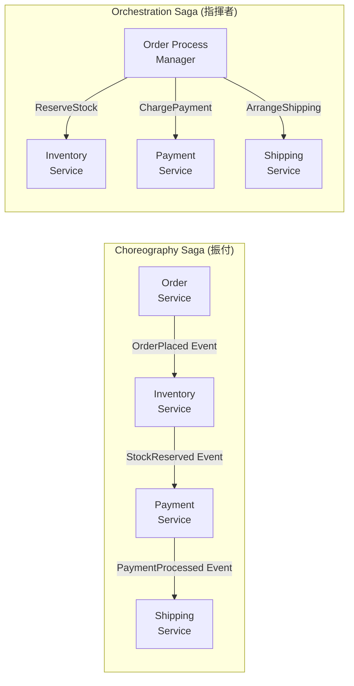

# 第 22 章: Saga / Process Manager — 分散トランザクションを制する

マイクロサービスアーキテクチャで DDD を実践すると、避けられない問題にぶつかります。「注文確定 → 在庫引き当て → 決済 → 発送」という一連の処理を、複数のサービスにまたいで整合性を保ちながら実行するにはどうするか。

これが Saga パターンの出番です。

---

## 22.1 なぜ分散トランザクションが問題か

単一のデータベース内なら、ACID トランザクションで整合性を保証できます。

```csharp
// 単一DBなら簡単
using var tx = db.BeginTransaction();
order.Place();
inventory.Reserve(order.Items);
payment.Charge(order.TotalAmount);
tx.Commit();  // 全部成功 or 全部失敗
```

しかしマイクロサービスでは、OrderService・InventoryService・PaymentService がそれぞれ独自のデータベースを持ちます。`tx.Commit()` は通用しません。

2相コミット（2PC）という解決策がありますが、参加者全員のロックが必要で、ひとつでも応答しなければ全体がブロックします。高可用性が求められる本番システムには不向きです。

**Saga パターンはこの問題を「長期間にわたるローカルトランザクションの連鎖」で解決します。**

---

## 22.2 Saga の 2 種類



| 比較軸 | Choreography | Orchestration |
|--------|-------------|--------------|
| 制御方式 | イベント駆動・自律的 | 中央の Process Manager が指揮 |
| 疎結合度 | 高い | 中程度 |
| 可視性 | 低い（どこにいるか把握しにくい） | 高い（状態が一か所に集約） |
| 適したケース | シンプルな 2〜3 ステップ | 複雑な条件分岐・タイムアウトあり |
| 障害調査 | 難しい | 容易 |

---

## 22.3 Choreography Saga の実装

各サービスがイベントを受信し、処理後に次のイベントを発行します。**補償トランザクション**（Compensating Transaction）で失敗時のロールバックを行います。

```csharp
// OrderService: 注文確定 → OrderPlacedEvent 発行
public sealed class PlaceOrderHandler
{
    private readonly IMessageBus _bus;

    public async Task HandleAsync(PlaceOrderCommand cmd)
    {
        var order = Order.Create(cmd.CustomerId, cmd.ShippingAddress);
        foreach (var item in cmd.Items)
            order.AddItem(item.ProductId, item.Name, item.UnitPrice, item.Quantity);
        order.Place();

        await _orderRepo.SaveAsync(order);

        // Saga の起点: イベントをバスに投げて次のサービスに委ねる
        await _bus.PublishAsync(new OrderPlacedIntegrationEvent(
            order.Id.Value,
            order.Items.Select(i => new ReservationItem(i.ProductId.Value, i.Quantity)).ToList()
        ));
    }
}

// InventoryService: 在庫引き当て → StockReservedEvent or StockReservationFailedEvent
public sealed class OnOrderPlaced
{
    private readonly IInventoryRepository _repo;
    private readonly IMessageBus _bus;

    public async Task HandleAsync(OrderPlacedIntegrationEvent e)
    {
        try
        {
            foreach (var item in e.Items)
                await _repo.ReserveAsync(item.ProductId, item.Quantity);

            await _bus.PublishAsync(new StockReservedEvent(e.OrderId));
        }
        catch (InsufficientStockException)
        {
            // 補償トランザクション: 在庫確保失敗 → 注文をキャンセルさせる
            await _bus.PublishAsync(new StockReservationFailedEvent(e.OrderId, "在庫不足"));
        }
    }
}

// OrderService: 失敗イベントを受けて補償
public sealed class OnStockReservationFailed
{
    private readonly IOrderRepository _repo;

    public async Task HandleAsync(StockReservationFailedEvent e)
    {
        var order = await _repo.FindByIdAsync(OrderId.From(e.OrderId));
        order!.Cancel($"在庫引き当て失敗: {e.Reason}");
        await _repo.SaveAsync(order);
    }
}
```

---

## 22.4 Process Manager（Orchestration Saga）の実装

Process Manager は状態を持つ長期プロセスのコーディネーターです。「どのステップまで進んだか」を永続化し、タイムアウトも管理します。

```csharp
// Process Manager: 注文プロセスの状態を管理
public sealed class OrderProcessManager : Entity<OrderProcessId>
{
    public Guid OrderId { get; private set; }
    public OrderProcessStatus Status { get; private set; }
    public DateTime StartedAt { get; private set; }
    public DateTime? LastUpdatedAt { get; private set; }

    private OrderProcessManager() { }

    public static OrderProcessManager Start(Guid orderId)
    {
        var pm = new OrderProcessManager
        {
            Id = OrderProcessId.New(),
            OrderId = orderId,
            Status = OrderProcessStatus.ReservingStock,
            StartedAt = DateTime.UtcNow
        };
        return pm;
    }

    public ReserveStockCommand OnStarted() =>
        new(OrderId);  // InventoryService へのコマンドを返す

    public ChargePaymentCommand OnStockReserved()
    {
        Status = OrderProcessStatus.ChargingPayment;
        LastUpdatedAt = DateTime.UtcNow;
        return new ChargePaymentCommand(OrderId);  // PaymentService へ
    }

    public ArrangeShippingCommand OnPaymentCharged()
    {
        Status = OrderProcessStatus.ArrangingShipping;
        LastUpdatedAt = DateTime.UtcNow;
        return new ArrangeShippingCommand(OrderId);  // ShippingService へ
    }

    public void OnCompleted()
    {
        Status = OrderProcessStatus.Completed;
        LastUpdatedAt = DateTime.UtcNow;
    }

    public CancelOrderCommand OnFailed(string reason)
    {
        Status = OrderProcessStatus.Failed;
        LastUpdatedAt = DateTime.UtcNow;
        return new CancelOrderCommand(OrderId, reason);  // 補償: 注文キャンセル
    }

    // タイムアウト判定 (30分以上進まなければ失敗)
    public bool IsTimedOut() =>
        Status != OrderProcessStatus.Completed &&
        Status != OrderProcessStatus.Failed &&
        (DateTime.UtcNow - (LastUpdatedAt ?? StartedAt)).TotalMinutes > 30;
}

public enum OrderProcessStatus
{
    ReservingStock,
    ChargingPayment,
    ArrangingShipping,
    Completed,
    Failed
}
```

---

## 22.5 Saga と DDD の関係

**Process Manager は Aggregate か？**

Process Manager は状態を持ち、ビジネスルール（タイムアウト・状態遷移）を守ります。この点で Aggregate に似ています。しかし本質的な違いがあります。

- Aggregate: **データの整合性**を守る
- Process Manager: **プロセスの整合性**を守る

Process Manager は複数の Aggregate の協調を調整する存在であり、特定の Aggregate の内部ではありません。`Entity<OrderProcessId>` として実装し、独自の Repository で永続化するのが適切です。

---

## 参考文献と著者の解釈

Chris Richardson は *Microservices Patterns*（2018）第4章で、Saga パターンを Choreography と Orchestration に分類し、それぞれのトレードオフを詳述しています。筆者の解釈では、ステップが 3 つ以下の単純なフローには Choreography、それ以上の複雑なビジネスプロセスや明確な状態管理が必要な場合には Orchestration（= Process Manager）を選ぶのが実務上の判断基準になります。

Vaughn Vernon は *Implementing Domain-Driven Design*（2013）第8章で、Process Manager を「ドメインの特殊な参加者」として位置づけています。命令を受け取り、それに応じて他の参加者へコマンドを送る「調整者」としての役割が核心です。
