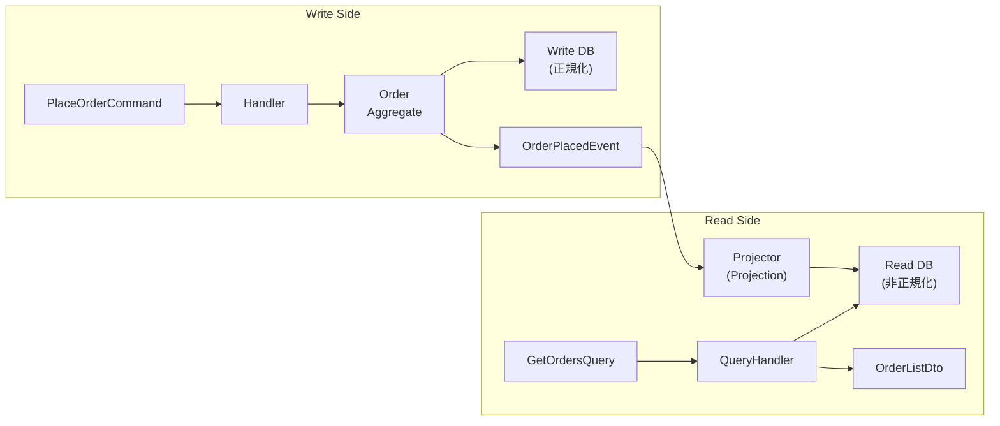

# 第 23 章: Read Model 設計 — CQRS の Query 側を徹底的に作る

第15章で CQRS の概念を扱いましたが、多くの実装ではコマンド側（Write Model）の設計に力を入れる一方、クエリ側（Read Model）が手薄になりがちです。本章では Read Model の設計を徹底的に掘り下げます。

---

## 23.1 Write Model と Read Model はなぜ分けるか

同じモデルで読み書き両方を担おうとすると、必ずどちらかが犠牲になります。

```csharp
// NG: Domain Model を画面表示にそのまま使う
public class OrderController
{
    public async Task<IActionResult> GetOrderList(Guid customerId)
    {
        // Order Aggregate を読み込む
        var orders = await _orderRepo.FindByCustomerAsync(CustomerId.From(customerId));

        // ここで N+1 問題が発生する
        // Order.Items は遅延ロード → 注文ごとに SQL が走る
        // さらに Customer の名前が欲しくて CustomerRepo も呼ぶ
        var customerName = (await _customerRepo.FindByIdAsync(CustomerId.From(customerId)))!.Name;

        return Ok(orders.Select(o => new
        {
            o.Id.Value,
            CustomerName = customerName,
            ItemCount = o.Items.Count,  // N+1
            o.TotalAmount.Amount
        }));
    }
}
```

問題点:
- **N+1 クエリ**: Order ごとに Items を別途ロード
- **不要なドメインロジック**: 画面表示のために Aggregate 全体を復元する
- **キャッシュ困難**: ドメインオブジェクトは状態変化があるため

---

## 23.2 Read Model の設計原則



**3 つの原則:**

1. **UI の形に合わせる**: 画面に必要なデータをそのまま返す。JOIN を Read Model に含める
2. **Domain を経由しない**: `Order` Aggregate を経由せず、直接 DB/Read Store を叩く
3. **非正規化を恐れない**: 読み取り最適化のために冗長データを持つことを許容する

---

## 23.3 Projection の実装

Domain Event を受けて Read Model を更新するのが **Projector** の役割です。

```csharp
// Read Model の DTO (非正規化・UI最適化)
public sealed record OrderSummaryReadModel
{
    public Guid OrderId { get; init; }
    public string CustomerName { get; init; } = string.Empty;
    public string CustomerEmail { get; init; } = string.Empty;
    public string Status { get; init; } = string.Empty;
    public decimal TotalAmount { get; init; }
    public string Currency { get; init; } = string.Empty;
    public int ItemCount { get; init; }
    public DateTime PlacedAt { get; init; }
    public DateTime? ShippedAt { get; init; }
}

// Projector: Domain Event を受けて Read Model を更新
public sealed class OrderSummaryProjector :
    IDomainEventHandler<OrderPlacedEvent>,
    IDomainEventHandler<OrderShippedEvent>,
    IDomainEventHandler<OrderCancelledEvent>
{
    private readonly IReadDbContext _readDb;
    private readonly ICustomerRepository _customerRepo;

    public async Task HandleAsync(OrderPlacedEvent e)
    {
        // Read 用に CustomerName を非正規化して保存
        var customer = await _customerRepo.FindByIdAsync(e.CustomerId);

        var readModel = new OrderSummaryReadModel
        {
            OrderId = e.OrderId.Value,
            CustomerName = customer!.Name,
            CustomerEmail = customer.Email.Value,
            Status = "Placed",
            TotalAmount = e.TotalAmount.Amount,
            Currency = e.TotalAmount.Currency,
            PlacedAt = DateTime.UtcNow
        };

        await _readDb.OrderSummaries.UpsertAsync(readModel);
    }

    public async Task HandleAsync(OrderShippedEvent e)
    {
        await _readDb.OrderSummaries
            .Where(o => o.OrderId == e.OrderId.Value)
            .UpdateAsync(o => o with { Status = "Shipped", ShippedAt = e.ShippedAt });
    }

    public async Task HandleAsync(OrderCancelledEvent e)
    {
        await _readDb.OrderSummaries
            .Where(o => o.OrderId == e.OrderId.Value)
            .UpdateAsync(o => o with { Status = "Cancelled" });
    }
}
```

---

## 23.4 Dapper での Query 実装（Domain を経由しない）

```csharp
// QueryHandler: Dapper で直接 SQL → DTO を返す
public sealed class GetOrderListQueryHandler
{
    private readonly IDbConnection _readConn;

    public GetOrderListQueryHandler(IDbConnection readConn) =>
        _readConn = readConn;

    public async Task<IReadOnlyList<OrderSummaryDto>> HandleAsync(GetOrderListQuery query)
    {
        // Read Model テーブルから直接取得 (Domain Layer を経由しない)
        const string sql = """
            SELECT
                os.OrderId,
                os.CustomerName,
                os.Status,
                os.TotalAmount,
                os.Currency,
                os.ItemCount,
                os.PlacedAt,
                os.ShippedAt
            FROM OrderSummaries os
            WHERE os.CustomerId = @CustomerId
              AND (@Status IS NULL OR os.Status = @Status)
            ORDER BY os.PlacedAt DESC
            LIMIT @PageSize OFFSET @Offset
            """;

        var results = await _readConn.QueryAsync<OrderSummaryDto>(sql, new
        {
            CustomerId = query.CustomerId,
            Status = query.Status?.ToString(),
            PageSize = query.PageSize,
            Offset = (query.Page - 1) * query.PageSize
        });

        return results.ToList();
    }
}

public sealed record GetOrderListQuery(
    Guid CustomerId,
    OrderStatus? Status = null,
    int Page = 1,
    int PageSize = 20
);

public sealed record OrderSummaryDto(
    Guid OrderId,
    string CustomerName,
    string Status,
    decimal TotalAmount,
    string Currency,
    int ItemCount,
    DateTime PlacedAt,
    DateTime? ShippedAt
);
```

---

## 23.5 Read Model の 3 種類と選択基準

| 種類 | 仕組み | 整合性 | パフォーマンス | 適用シーン |
|-----|--------|-------|--------------|-----------|
| **In-Process** | Write DB と同じ DB に Read Model テーブルを作る | 高い（同一トランザクション可） | 中 | 中規模・シンプルな要件 |
| **Separate Read Store** | Redis / Elasticsearch / 別 DB に Read Model を置く | 最終整合性 | 非常に高い | 高負荷・複雑な検索要件 |
| **Materialized View** | DB の Materialized View 機能を使う | DB 依存 | 高い | DB の機能で完結したい場合 |

---

## 23.6 よくある誤り

**NG1: Repository を Read に使う**
```csharp
// Repository は Aggregate 全体を復元する → 遅い・N+1 の元
var orders = await _orderRepo.FindByCustomerAsync(customerId);
// items が遅延ロードされる...
```

**NG2: Domain Object を DTO の代わりに返す**
```csharp
// Domain Layer が Presentation に漏れる
public Task<Order> GetOrderAsync(Guid id) { ... }
// Order は変更メソッドを持つ → UI から呼べてしまう危険
```

**OK: Dapper + DTO で直読み**
```csharp
// Read 専用 → 軽量・高速・依存なし
public Task<OrderSummaryDto> GetOrderAsync(Guid id) { ... }
```

---

## 参考文献と著者の解釈

Vaughn Vernon は *Implementing Domain-Driven Design*（2013）第4章で、CQRS における Read Model の自由度について述べています。「Query 側は DTO を返す単純な SQL クエリで十分。Domain Model の制約を Query 側に持ち込む必要はない」という立場が、筆者の実務経験とも一致します。

Greg Young の CQRS Documents（2010）では、Read Model を「最終整合性のある読み取り専用ビュー」として定義しています。筆者はこれを実装する際、「まず同一 DB の In-Process から始めて、パフォーマンス問題が出たら Separate Read Store に移行する」段階的アプローチを推奨します。最初から Redis を入れる必要はありません。
