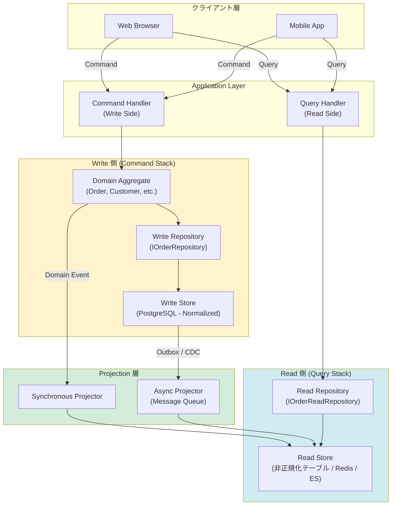
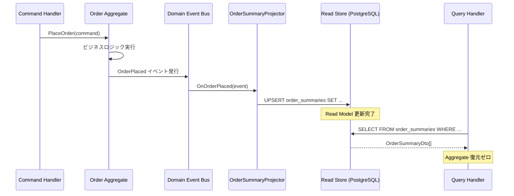
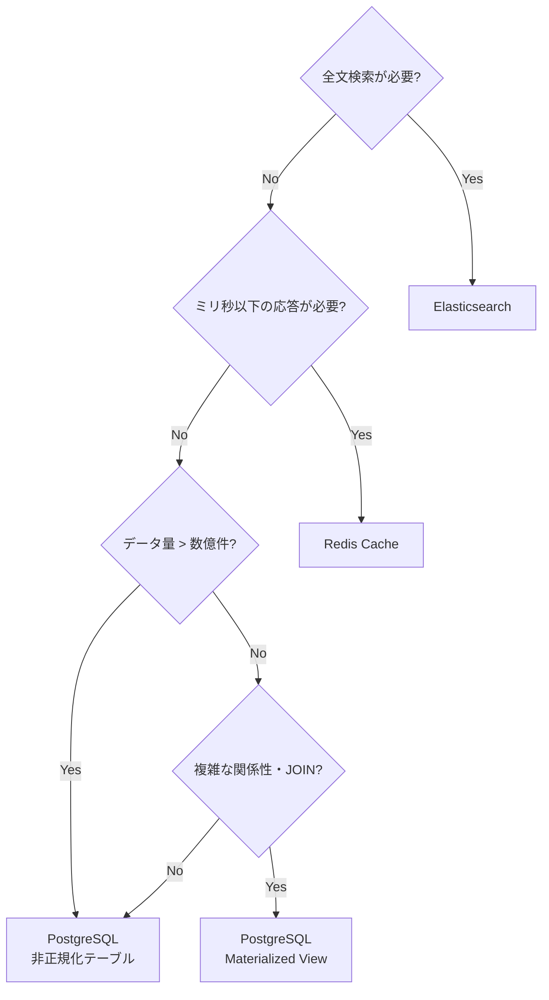
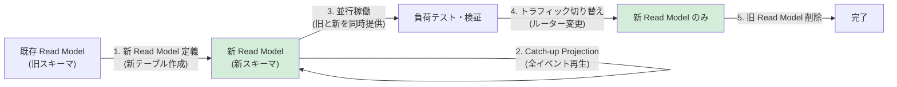

# 第 23 章: Read Model 設計 — CQRS の Query 側を徹底的に作る

---

## 0. TL;DR（3行）

Read Model は「画面のために作るデータ構造」であり、Domain Model とは完全に別物です。Write Model がドメインの整合性を守るために存在するのに対して、Read Model はパフォーマンスと画面要件だけに最適化されます。Projection（投影）がその橋渡しを担い、ドメインイベントを購読して Read Store を自動更新することで、クエリ側はシンプルな SELECT のみで完結します。

---

## 1. なぜ Read Model が必要か

### 1.1 N+1 問題の完全解説（計測付き）

「N+1 問題」は Web アプリケーション開発における最も頻出のパフォーマンス地雷のひとつです。名前の由来は、1 件の親クエリに対して N 件の子クエリが追加で実行されることにあります。受注管理システムを例に、問題の発生メカニズムと計測方法を丁寧に解説します。

**シナリオ**: 顧客の注文一覧画面。1 顧客が平均 50 件の注文を持ち、各注文に平均 5 件の明細がある。

```csharp
// NG パターン: Domain Aggregate をそのまま読み取りに使う
public async Task<IActionResult> GetOrderList(Guid customerId)
{
    // SQL 1発目: SELECT * FROM orders WHERE customer_id = @customerId
    var orders = await _orderRepository.FindByCustomerAsync(CustomerId.From(customerId));

    var result = new List<OrderSummaryDto>();

    foreach (var order in orders)   // ← orders が 50 件あるとする
    {
        // SQL N発目: SELECT * FROM order_items WHERE order_id = @orderId
        // 50回実行される ← これが N+1 の N
        var items = order.Items;    // 遅延ロード

        // さらに Product 名が欲しくて追加クエリ (N×M 問題に発展)
        foreach (var item in items)
        {
            // SELECT * FROM products WHERE id = @productId
            var product = await _productRepository.FindByIdAsync(item.ProductId);
        }

        result.Add(new OrderSummaryDto(/* ... */));
    }

    return Ok(result);
}
```

**実際の SQL 発行数の計算**:

| ステップ | SQL 発行数 | 説明 |
|---------|-----------|------|
| 注文一覧取得 | 1 | SELECT orders |
| 注文明細取得 | 50 | 注文1件につき1回 |
| 商品情報取得 | 250 | 明細5件×注文50件 |
| **合計** | **301** | 1 + 50 + 250 |

これが「N+1（正確には N×M+1）問題」の実態です。注文が 100 件になれば SQL は 601 回、1,000 件になれば 6,001 回に膨れ上がります。

**実際の計測方法（MiniProfiler + Dapper）**:

```csharp
// appsettings.Development.json
{
  "ConnectionStrings": {
    "Default": "..."
  },
  "MiniProfiler": {
    "Enabled": true
  }
}

// Program.cs に追加
builder.Services.AddMiniProfiler(options =>
{
    options.RouteBasePath = "/profiler";
    options.SqlFormatter = new StackExchange.Profiling.SqlFormatters.InlineFormatter();
}).AddEntityFramework();  // または AddDapper()

// ミドルウェア
app.UseMiniProfiler();
```

実際に計測すると、300 件の SQL が順次実行されるため、レイテンシが数百ミリ秒〜数秒になることが珍しくありません。PostgreSQL のラウンドトリップが 1ms だとしても、300回 × 1ms = 300ms のオーバーヘッドが純粋に加算されます。実環境ではネットワーク遅延やコネクションプールの競合も加わります。

**ベンチマーク比較（BenchmarkDotNet）**:

```csharp
[MemoryDiagnoser]
[SimpleJob(RuntimeMoniker.Net90)]
public class ReadModelBenchmarks
{
    private readonly string _connectionString = "...";

    [Benchmark(Baseline = true)]
    public async Task<List<OrderSummaryDto>> WithNPlusOneProblem()
    {
        // Domain Model 経由: SQL 301 回
        // 計測結果例: 1,240ms, 18.4 MB
        /* ... */
    }

    [Benchmark]
    public async Task<List<OrderSummaryDto>> WithReadModel()
    {
        // 専用 Read Model: SQL 1 回
        // 計測結果例: 12ms, 0.8 MB
        /* ... */
    }
}
// | Method               | Mean      | Gen0    | Allocated |
// |----------------------|-----------|---------|-----------|
// | WithNPlusOneProblem  | 1,240.3ms | 2300.00 | 18.4 MB   |
// | WithReadModel        |    12.1ms |   80.00 |  0.8 MB   |
// Read Model は約 103 倍高速、メモリ使用量は約 23 分の 1
```

### 1.2 ドメインモデルをそのまま画面に使う 5 つの問題

Read Model が必要な理由は N+1 だけではありません。ドメインモデルをそのまま画面に使うことには、構造的な問題が 5 つあります。

**問題①: 集約境界とUI要件の不一致**

ドメイン集約は整合性境界として設計されています。`Order` 集約が `Customer` の名前を持たないのは、それが正しいドメイン設計だからです。しかし画面では「注文一覧に顧客名を表示したい」という要件が当然のように来ます。集約を跨ぐ表示要件を、ドメインモデルの変形で解決しようとすると、集約の純粋性が壊れます。

**問題②: ビジネスロジックと表示ロジックの汚染**

`Order.CalculateTotal()` は課税ロジックを含む重要なドメインロジックです。しかし画面に「税抜き価格を赤字で表示する」という要件が来た時、この色情報やフォーマット情報をドメインオブジェクトに持たせてはいけません。ドメインモデルを画面に使うと、表示ロジックがドメイン層に滲み込んできます。

**問題③: 認可・フィルタリングの複雑化**

管理者には全フィールドを、一般ユーザーには一部フィールドのみ表示したい場合、ドメインモデルを共有すると認可ロジックが複雑になります。専用の Read DTO を作ればロールごとに別クラスを定義するだけで済みます。

**問題④: スキーマ変更の影響範囲拡大**

`Order` テーブルに新しいカラムを追加した場合、ドメインモデルを直接返すAPIではそのカラムが自動的に公開されてしまいます（過剰公開問題）。Read Model を挟めば、意図的にマッピングした項目だけが外部に出ます。

**問題⑤: キャッシュ戦略の困難さ**

ドメインオブジェクトは可変状態を持つため、キャッシュが難しいです。値オブジェクトと異なり、エンティティは同一性（identity）で追跡されます。一方、Read Model は不変（immutable）な DTO として設計できるため、Redis 等での積極的なキャッシュが可能になります。

### 1.3 データ駆動 vs モデル駆動の読み取り

「読み取りのために Domain Model を経由すべきか」は、CQRS 導入時の根本的な問いです。

**モデル駆動（Domain Model 経由）**:
- ドメインロジックが読み取り時にも動く（バリデーション等）
- 集約の整合性が保たれる
- しかし、読み取り専用なのにドメインロジックのオーバーヘッドを全て負担する

**データ駆動（SQL 直叩き）**:
- 画面要件に完全に最適化できる
- JOIN、集計、ページングが自由自在
- ドメインロジックが一切動かない（意図的に）

CQRS の核心的な主張は「**読み取り側でドメインモデルを経由する必要はない**」です。クエリとは本質的にデータ取得であり、ドメインルールの適用ではありません。Greg Young（CQRS 提唱者）は「Read side is just a SELECT」と表現しています。

```csharp
// モデル駆動（CQRS 以前の典型）
public class OrderQueryService_ModelDriven
{
    private readonly IOrderRepository _repo;

    public async Task<OrderListDto> GetOrderListAsync(Guid customerId)
    {
        // Domain Layer を通過 → Aggregate 復元コストが発生
        var orders = await _repo.FindByCustomerAsync(CustomerId.From(customerId));
        return orders.Select(o => new OrderListDto(o.Id.Value, o.TotalAmount.Amount)).ToList();
    }
}

// データ駆動（CQRS Query Side）
public class OrderQueryService_DataDriven
{
    private readonly IDbConnection _db;

    public async Task<IReadOnlyList<OrderSummaryDto>> GetOrderListAsync(Guid customerId)
    {
        // Aggregate 復元なし。SQL で直接必要なデータだけ取得
        const string sql = """
            SELECT o.id, o.created_at, c.name as customer_name,
                   COUNT(oi.id) as item_count,
                   SUM(oi.unit_price * oi.quantity) as total_amount
            FROM orders o
            JOIN customers c ON c.id = o.customer_id
            JOIN order_items oi ON oi.order_id = o.id
            WHERE o.customer_id = @customerId
            GROUP BY o.id, o.created_at, c.name
            ORDER BY o.created_at DESC
            """;

        return (await _db.QueryAsync<OrderSummaryDto>(sql, new { customerId })).ToList();
    }
}
```

---

## 2. Read Model の設計原則

### 2.1 画面に最適化された非正規化

Read Model の設計で最も重要な原則は「**非正規化を恐れない**」ことです。RDBMS の教科書では第三正規形（3NF）が美徳とされますが、Read Store は別の評価軸で設計します。

**非正規化 Read Model の例（注文サマリー）**:

```sql
-- Read Store テーブル: order_summaries
-- 複数テーブルのデータを一枚のテーブルに非正規化して持つ
CREATE TABLE order_summaries (
    id              UUID PRIMARY KEY,
    customer_id     UUID NOT NULL,
    customer_name   TEXT NOT NULL,    -- customers テーブルの重複持ち
    customer_email  TEXT NOT NULL,    -- 同上
    status          TEXT NOT NULL,
    item_count      INTEGER NOT NULL,
    total_amount    NUMERIC(12,2) NOT NULL,
    created_at      TIMESTAMPTZ NOT NULL,
    updated_at      TIMESTAMPTZ NOT NULL,
    -- 検索用インデックス
    product_ids     UUID[] NOT NULL,  -- 含まれる商品 ID の配列
    tag_names       TEXT[] NOT NULL   -- 含まれるタグの配列
);

CREATE INDEX idx_order_summaries_customer ON order_summaries(customer_id);
CREATE INDEX idx_order_summaries_status ON order_summaries(status);
CREATE INDEX idx_order_summaries_created ON order_summaries(created_at DESC);
CREATE INDEX idx_order_summaries_products ON order_summaries USING GIN(product_ids);
```

この設計では `customers` の名前がコピーされています。「顧客名が変わったら？」と思うかもしれません。Read Model は**最終整合性**を受け入れます。顧客名変更イベントが発行され、Projection がそれを受けて `order_summaries` を更新します。わずかな遅延はトレードオフとして許容します。

### 2.2 Domain Layer を経由しない

```csharp
// NG: Application Layer → Domain Layer → Infra Layer の経路
public class OrderQueryService_Wrong
{
    private readonly IOrderRepository _repo;  // Domain Layer のインターフェース

    public async Task<OrderSummaryDto> GetAsync(Guid orderId)
    {
        var order = await _repo.FindByIdAsync(OrderId.From(orderId));  // Aggregate 復元
        return MapToDto(order);  // 必要なのは DTO なのに Aggregate を経由
    }
}

// OK: Application Layer → Read Infra Layer（Direct SQL）
public class OrderQueryService_Correct
{
    private readonly IOrderReadRepository _readRepo;  // Read 専用インターフェース

    public async Task<OrderSummaryDto> GetAsync(Guid orderId)
    {
        // Aggregate を復元しない。Read Store から直接取得
        return await _readRepo.GetSummaryAsync(orderId);
    }
}
```

`IOrderReadRepository` は Domain Layer に属しません。これは Application Layer または Infra Layer に属するクエリ専用のインターフェースです。Domain Layer の `IOrderRepository`（Write 側）とは完全に独立しています。

### 2.3 Mermaid 図でアーキテクチャを可視化

**CQRS 全体アーキテクチャ（Command / Query 分離）**:



**Read Model の内部構造（Projection フロー）**:



---

## 3. Projection パターン全 4 種

Projection（投影）とは「Write Store（または Domain Event）の状態変化を Read Store に伝播する仕組み」のことです。4 種のパターンを使い分けます。

### 3.1 Synchronous Projection（同期）

**適用場面**: 強い整合性が求められる場面。コマンドのトランザクション内で Read Model も同時に更新します。

**特徴**:
- Write と Read が同一トランザクション内（または同一 DB への 2 テーブル更新）
- レスポンスが返った時点で Read Model も最新
- 単一障害点（Read Store 更新失敗 → コマンド全体ロールバック）
- Read Store が重い更新処理の場合、コマンドの遅延に直結

```csharp
// Synchronous Projector 実装例
public class OrderSummaryProjector : IProjector
{
    private readonly NpgsqlDataSource _dataSource;

    public OrderSummaryProjector(NpgsqlDataSource dataSource)
    {
        _dataSource = dataSource;
    }

    // Domain Event Handler として登録
    public async Task OnOrderPlacedAsync(
        OrderPlaced @event,
        NpgsqlTransaction? transaction = null)
    {
        const string sql = """
            INSERT INTO order_summaries (
                id, customer_id, customer_name, customer_email,
                status, item_count, total_amount, created_at, updated_at,
                product_ids, tag_names
            ) VALUES (
                @Id, @CustomerId, @CustomerName, @CustomerEmail,
                @Status, @ItemCount, @TotalAmount, @CreatedAt, @UpdatedAt,
                @ProductIds, @TagNames
            )
            ON CONFLICT (id) DO UPDATE SET
                status       = EXCLUDED.status,
                item_count   = EXCLUDED.item_count,
                total_amount = EXCLUDED.total_amount,
                updated_at   = EXCLUDED.updated_at,
                product_ids  = EXCLUDED.product_ids,
                tag_names    = EXCLUDED.tag_names
            """;

        await using var conn = await _dataSource.OpenConnectionAsync();

        // 既存のトランザクションに参加する（同期投影の核心）
        await conn.ExecuteAsync(sql, new
        {
            Id           = @event.OrderId,
            CustomerId   = @event.CustomerId,
            CustomerName = @event.CustomerName,
            CustomerEmail = @event.CustomerEmail,
            Status       = "Placed",
            ItemCount    = @event.Items.Count,
            TotalAmount  = @event.Items.Sum(i => i.UnitPrice * i.Quantity),
            CreatedAt    = @event.OccurredAt,
            UpdatedAt    = @event.OccurredAt,
            ProductIds   = @event.Items.Select(i => i.ProductId).ToArray(),
            TagNames     = Array.Empty<string>()
        }, transaction);
    }

    public async Task OnOrderCancelledAsync(
        OrderCancelled @event,
        NpgsqlTransaction? transaction = null)
    {
        const string sql = """
            UPDATE order_summaries
            SET status = 'Cancelled', updated_at = @UpdatedAt
            WHERE id = @Id
            """;

        await using var conn = await _dataSource.OpenConnectionAsync();
        await conn.ExecuteAsync(sql, new
        {
            Id        = @event.OrderId,
            UpdatedAt = @event.OccurredAt
        }, transaction);
    }
}

// Command Handler との統合
public class PlaceOrderCommandHandler
{
    private readonly IOrderRepository _repo;
    private readonly OrderSummaryProjector _projector;

    public async Task HandleAsync(PlaceOrderCommand cmd)
    {
        await using var conn = await _dataSource.OpenConnectionAsync();
        await using var tx  = await conn.BeginTransactionAsync();

        try
        {
            var order = Order.Place(/* ... */);
            await _repo.SaveAsync(order, tx);

            // 同一トランザクション内で Read Model も更新
            var @event = order.DomainEvents.OfType<OrderPlaced>().Single();
            await _projector.OnOrderPlacedAsync(@event, tx);

            await tx.CommitAsync();
        }
        catch
        {
            await tx.RollbackAsync();
            throw;
        }
    }
}
```

### 3.2 Asynchronous Projection（非同期・Outbox 経由）

**適用場面**: コマンドのレイテンシを最小化したい、Read Store が別サービス・別 DB にある場合。

**特徴**:
- Transactional Outbox パターンを使い、イベントをアトミックに DB に保存
- バックグラウンドで Outbox を読み取り、Read Store を更新
- コマンドのレスポンスが最速（Read Store 更新を待たない）
- Read Model は最終整合性（数百ミリ秒〜数秒の遅延）

```csharp
// Outbox テーブル（Write DB 内）
// CREATE TABLE outbox_events (
//     id            UUID PRIMARY KEY DEFAULT gen_random_uuid(),
//     event_type    TEXT NOT NULL,
//     payload       JSONB NOT NULL,
//     created_at    TIMESTAMPTZ NOT NULL DEFAULT now(),
//     processed_at  TIMESTAMPTZ,
//     retry_count   INTEGER NOT NULL DEFAULT 0
// );

// Outbox への書き込み（Command Handler 内、同一トランザクション）
public class PlaceOrderCommandHandler_WithOutbox
{
    public async Task HandleAsync(PlaceOrderCommand cmd, NpgsqlConnection conn, NpgsqlTransaction tx)
    {
        var order = Order.Place(/* ... */);
        await _repo.SaveAsync(order, tx);

        // Outbox に書き込む（同一 TX → Aggregate 保存と原子的）
        const string outboxSql = """
            INSERT INTO outbox_events (event_type, payload, created_at)
            VALUES (@EventType, @Payload::jsonb, @CreatedAt)
            """;

        foreach (var domainEvent in order.DomainEvents)
        {
            await conn.ExecuteAsync(outboxSql, new
            {
                EventType = domainEvent.GetType().Name,
                Payload   = JsonSerializer.Serialize(domainEvent, domainEvent.GetType()),
                CreatedAt = domainEvent.OccurredAt
            }, tx);
        }

        await tx.CommitAsync();
        // ここで return。Read Store 更新はバックグラウンドに委ねる
    }
}

// Outbox Processor（バックグラウンドサービス）
public class OutboxProcessor : BackgroundService
{
    private readonly NpgsqlDataSource _writeDb;
    private readonly OrderSummaryProjector _projector;
    private readonly ILogger<OutboxProcessor> _logger;

    protected override async Task ExecuteAsync(CancellationToken stoppingToken)
    {
        while (!stoppingToken.IsCancellationRequested)
        {
            await ProcessBatchAsync(stoppingToken);
            await Task.Delay(TimeSpan.FromMilliseconds(200), stoppingToken);
        }
    }

    private async Task ProcessBatchAsync(CancellationToken ct)
    {
        await using var conn = await _writeDb.OpenConnectionAsync(ct);
        await using var tx   = await conn.BeginTransactionAsync(ct);

        // 未処理イベントを先頭から最大 100 件取得（悲観ロック）
        const string selectSql = """
            SELECT id, event_type, payload
            FROM outbox_events
            WHERE processed_at IS NULL AND retry_count < 3
            ORDER BY created_at ASC
            LIMIT 100
            FOR UPDATE SKIP LOCKED
            """;

        var events = (await conn.QueryAsync<OutboxEvent>(selectSql, transaction: tx)).ToList();

        foreach (var outboxEvent in events)
        {
            try
            {
                await DispatchToProjectorAsync(outboxEvent);

                const string markDoneSql = """
                    UPDATE outbox_events SET processed_at = now()
                    WHERE id = @Id
                    """;
                await conn.ExecuteAsync(markDoneSql, new { outboxEvent.Id }, tx);
            }
            catch (Exception ex)
            {
                _logger.LogError(ex, "Projection failed for event {EventId}", outboxEvent.Id);

                const string retryIncrSql = """
                    UPDATE outbox_events SET retry_count = retry_count + 1
                    WHERE id = @Id
                    """;
                await conn.ExecuteAsync(retryIncrSql, new { outboxEvent.Id }, tx);
            }
        }

        await tx.CommitAsync(ct);
    }

    private async Task DispatchToProjectorAsync(OutboxEvent outboxEvent)
    {
        switch (outboxEvent.EventType)
        {
            case nameof(OrderPlaced):
                var placed = JsonSerializer.Deserialize<OrderPlaced>(outboxEvent.Payload)!;
                await _projector.OnOrderPlacedAsync(placed);
                break;

            case nameof(OrderCancelled):
                var cancelled = JsonSerializer.Deserialize<OrderCancelled>(outboxEvent.Payload)!;
                await _projector.OnOrderCancelledAsync(cancelled);
                break;

            default:
                // 未知イベントはスキップ（新イベント追加時の前方互換性）
                break;
        }
    }
}
```

### 3.3 Catch-up Projection（既存イベント全件再生）

**適用場面**: Read Model を新規作成したい場合、Read Model のスキーマを変更したい場合、バグ修正後に Read Store を作り直したい場合。

**特徴**:
- Event Store に保存された全イベントを最初から再生する
- 既存の Read Store を一度クリアして再構築する
- 再生中は古い Read Store を提供し、切り替え時点で Swap する（Blue-Green）
- Event Sourcing と組み合わせることで真の力を発揮

```csharp
// Catch-up Projection の実装
public class CatchUpProjectionRunner
{
    private readonly IEventStore _eventStore;
    private readonly OrderSummaryProjector _projector;
    private readonly NpgsqlDataSource _readDb;
    private readonly ILogger<CatchUpProjectionRunner> _logger;

    public async Task RunAsync(
        string targetTableName = "order_summaries",
        CancellationToken ct = default)
    {
        _logger.LogInformation("Catch-up projection started for {Table}", targetTableName);

        // Step 1: テンポラリテーブルを作成（Blue-Green Swap の準備）
        var tempTableName = $"{targetTableName}_new_{DateTime.UtcNow:yyyyMMddHHmmss}";
        await CreateTempTableAsync(tempTableName, ct);

        // Step 2: 全イベントをページング再生
        var position  = 0L;
        var batchSize = 500;
        var processed = 0;

        while (true)
        {
            var events = await _eventStore.ReadAllAsync(position, batchSize, ct);
            if (events.Count == 0) break;

            foreach (var @event in events)
            {
                await _projector.ApplyToTableAsync(@event, tempTableName, ct);
                processed++;
            }

            position = events[^1].GlobalPosition + 1;
            _logger.LogInformation("Processed {Count} events (position: {Pos})", processed, position);

            await Task.Delay(10, ct); // バックプレッシャー制御
        }

        // Step 3: テーブルをアトミックにスワップ（サービス無停止で切り替え）
        await SwapTablesAsync(targetTableName, tempTableName, ct);

        _logger.LogInformation(
            "Catch-up projection completed. Processed {Count} events.", processed);
    }

    private async Task SwapTablesAsync(string current, string next, CancellationToken ct)
    {
        await using var conn = await _readDb.OpenConnectionAsync(ct);
        await using var tx   = await conn.BeginTransactionAsync(ct);

        // PostgreSQL ではテーブル名変更がほぼ瞬間で完了（メタデータ操作のみ）
        await conn.ExecuteAsync($"""
            ALTER TABLE {current} RENAME TO {current}_old;
            ALTER TABLE {next} RENAME TO {current};
            DROP TABLE {current}_old;
            """, transaction: tx);

        await tx.CommitAsync(ct);
        _logger.LogInformation("Table swap completed: {Next} → {Current}", next, current);
    }

    private async Task CreateTempTableAsync(string tableName, CancellationToken ct)
    {
        await using var conn = await _readDb.OpenConnectionAsync(ct);
        await conn.ExecuteAsync($"""
            CREATE TABLE {tableName} (LIKE order_summaries INCLUDING ALL);
            """);
    }
}
```

### 3.4 Snapshot Projection（集計値のスナップショット）

**適用場面**: 計算コストの高い集計値を事前に保存しておきたい場合。売上集計、ランキング、ダッシュボード数値など。

**特徴**:
- イベント発生の度に毎回集計しない（事前計算）
- 定期バッチ（cronベース）またはイベントトリガーで更新
- リアルタイム性より計算コスト削減を優先
- 「この数値は X 分前の値です」と明示するUI設計が望ましい

```csharp
// Snapshot Read Model テーブル
// CREATE TABLE revenue_snapshots (
//     id            UUID PRIMARY KEY DEFAULT gen_random_uuid(),
//     snapshot_date DATE NOT NULL,
//     period        TEXT NOT NULL,  -- 'daily' | 'monthly' | 'yearly'
//     total_revenue NUMERIC(14,2) NOT NULL,
//     order_count   INTEGER NOT NULL,
//     avg_order_value NUMERIC(10,2) NOT NULL,
//     top_products  JSONB NOT NULL,  -- [{product_id, revenue, count}]
//     computed_at   TIMESTAMPTZ NOT NULL,
//     UNIQUE(snapshot_date, period)
// );

public class RevenueSnapshotProjector
{
    private readonly NpgsqlDataSource _writeDb;   // 元データ（Write Store）
    private readonly NpgsqlDataSource _readDb;    // 保存先（Read Store）

    // 日次スナップショット更新（前日分を対象）
    public async Task UpdateDailySnapshotAsync(DateOnly targetDate, CancellationToken ct = default)
    {
        // Write Store から集計（重い処理だが1日1回）
        const string aggregateSql = """
            SELECT
                COALESCE(SUM(oi.unit_price * oi.quantity), 0) AS total_revenue,
                COUNT(DISTINCT o.id)                          AS order_count,
                COALESCE(AVG(o.total_amount), 0)              AS avg_order_value
            FROM orders o
            JOIN order_items oi ON oi.order_id = o.id
            WHERE o.status = 'Completed'
              AND DATE(o.completed_at) = @TargetDate
            """;

        await using var writeConn = await _writeDb.OpenConnectionAsync(ct);
        var aggregate = await writeConn.QuerySingleAsync<RevenueAggregate>(
            aggregateSql, new { TargetDate = targetDate });

        const string topProductsSql = """
            SELECT
                oi.product_id,
                SUM(oi.unit_price * oi.quantity) AS revenue,
                SUM(oi.quantity)                 AS item_count
            FROM orders o
            JOIN order_items oi ON oi.order_id = o.id
            WHERE o.status = 'Completed'
              AND DATE(o.completed_at) = @TargetDate
            GROUP BY oi.product_id
            ORDER BY revenue DESC
            LIMIT 10
            """;

        var topProducts = (await writeConn.QueryAsync<TopProductRow>(
            topProductsSql, new { TargetDate = targetDate })).ToList();

        // Read Store に Upsert
        const string upsertSql = """
            INSERT INTO revenue_snapshots
                (snapshot_date, period, total_revenue, order_count, avg_order_value, top_products, computed_at)
            VALUES
                (@SnapshotDate, 'daily', @TotalRevenue, @OrderCount, @AvgOrderValue, @TopProducts::jsonb, now())
            ON CONFLICT (snapshot_date, period) DO UPDATE SET
                total_revenue   = EXCLUDED.total_revenue,
                order_count     = EXCLUDED.order_count,
                avg_order_value = EXCLUDED.avg_order_value,
                top_products    = EXCLUDED.top_products,
                computed_at     = EXCLUDED.computed_at
            """;

        await using var readConn = await _readDb.OpenConnectionAsync(ct);
        await readConn.ExecuteAsync(upsertSql, new
        {
            SnapshotDate  = targetDate,
            aggregate.TotalRevenue,
            aggregate.OrderCount,
            aggregate.AvgOrderValue,
            TopProducts   = JsonSerializer.Serialize(topProducts)
        });
    }
}
```

---

## 4. Read Model Store の選択

### 4.1 選択基準マトリクス

| 要件 | PostgreSQL (正規化) | PostgreSQL (非正規化) | Redis | Elasticsearch |
|------|--------------------|-----------------------|-------|---------------|
| 複雑な関係性クエリ | ◎ | △ | × | △ |
| 全文検索 | △ | △ | × | ◎ |
| 集計・分析 | ○ | ◎ | × | ○ |
| サブミリ秒レスポンス | × | △ | ◎ | △ |
| セッション単位データ | × | × | ◎ | × |
| スキーマ柔軟性 | × | △ | ◎ | ◎ |
| データ量（大規模） | ○ | ○ | △ | ◎ |
| トランザクション | ◎ | ◎ | × | × |
| 運用コスト | ○ | ○ | ○ | △ |

**判断フローチャート**:



### 4.2 PostgreSQL Materialized View（C# 実装）

Materialized View は PostgreSQL が管理する「クエリ結果の物理コピー」です。定期的に `REFRESH MATERIALIZED VIEW` を実行することで最新状態に保ちます。

```sql
-- Materialized View の定義
CREATE MATERIALIZED VIEW mv_order_summaries AS
SELECT
    o.id,
    o.customer_id,
    c.name        AS customer_name,
    c.email       AS customer_email,
    o.status,
    COUNT(oi.id)  AS item_count,
    SUM(oi.unit_price * oi.quantity) AS total_amount,
    o.created_at,
    o.updated_at,
    ARRAY_AGG(DISTINCT oi.product_id) AS product_ids
FROM orders o
JOIN customers c ON c.id = o.customer_id
JOIN order_items oi ON oi.order_id = o.id
GROUP BY o.id, o.customer_id, c.name, c.email, o.status, o.created_at, o.updated_at
WITH DATA;  -- 定義と同時にデータも生成

-- 並行リフレッシュ（ロック最小化）← CONCURRENTLY は UNIQUE INDEX が必要
CREATE UNIQUE INDEX idx_mv_order_summaries_id ON mv_order_summaries(id);

-- リフレッシュ（ロックなしで実行可能）
REFRESH MATERIALIZED VIEW CONCURRENTLY mv_order_summaries;
```

```csharp
// C# からのリフレッシュ制御
public class MaterializedViewRefresher : BackgroundService
{
    private readonly NpgsqlDataSource _db;
    private readonly ILogger<MaterializedViewRefresher> _logger;

    protected override async Task ExecuteAsync(CancellationToken stoppingToken)
    {
        // 5分ごとにリフレッシュ
        using var timer = new PeriodicTimer(TimeSpan.FromMinutes(5));

        while (await timer.WaitForNextTickAsync(stoppingToken))
        {
            await RefreshAsync(stoppingToken);
        }
    }

    public async Task RefreshAsync(CancellationToken ct = default)
    {
        var sw = Stopwatch.StartNew();
        await using var conn = await _db.OpenConnectionAsync(ct);

        try
        {
            // CONCURRENTLY: 読み取りをブロックせずリフレッシュ
            await conn.ExecuteAsync(
                "REFRESH MATERIALIZED VIEW CONCURRENTLY mv_order_summaries");

            _logger.LogInformation(
                "Materialized view refreshed in {Elapsed}ms", sw.ElapsedMilliseconds);
        }
        catch (Exception ex)
        {
            _logger.LogError(ex, "Failed to refresh materialized view");
        }
    }
}

// クエリの実装
public class OrderQueryRepository
{
    private readonly NpgsqlDataSource _db;

    public async Task<PagedResult<OrderSummaryDto>> GetOrderSummariesAsync(
        OrderSummaryQuery query, CancellationToken ct = default)
    {
        await using var conn = await _db.OpenConnectionAsync(ct);

        // Materialized View から直接 SELECT（非常に高速）
        const string sql = """
            SELECT id, customer_id, customer_name, status,
                   item_count, total_amount, created_at
            FROM mv_order_summaries
            WHERE (@CustomerId IS NULL OR customer_id = @CustomerId)
              AND (@Status IS NULL OR status = @Status)
            ORDER BY created_at DESC
            LIMIT @PageSize OFFSET @Offset
            """;

        var rows = await conn.QueryAsync<OrderSummaryDto>(sql, new
        {
            CustomerId = query.CustomerId,
            Status     = query.Status,
            PageSize   = query.PageSize,
            Offset     = (query.Page - 1) * query.PageSize
        });

        return new PagedResult<OrderSummaryDto>(rows.ToList(), /* count= */ 0);
    }
}
```

### 4.3 Redis キャッシュ（C# 実装）

```csharp
// Redis を使った Read Model キャッシュ
public class CachedOrderQueryRepository : IOrderQueryRepository
{
    private readonly IOrderQueryRepository _inner;   // 実際のDBアクセス
    private readonly IConnectionMultiplexer _redis;
    private readonly ILogger<CachedOrderQueryRepository> _logger;
    private static readonly TimeSpan _ttl = TimeSpan.FromMinutes(10);

    public async Task<OrderSummaryDto?> GetByIdAsync(Guid orderId, CancellationToken ct = default)
    {
        var db  = _redis.GetDatabase();
        var key = $"order_summary:{orderId}";

        // Cache Hit
        var cached = await db.StringGetAsync(key);
        if (cached.HasValue)
        {
            _logger.LogDebug("Cache HIT for order {OrderId}", orderId);
            return JsonSerializer.Deserialize<OrderSummaryDto>(cached.ToString());
        }

        // Cache Miss → DB から取得
        _logger.LogDebug("Cache MISS for order {OrderId}", orderId);
        var dto = await _inner.GetByIdAsync(orderId, ct);

        if (dto is not null)
        {
            // キャッシュに保存
            await db.StringSetAsync(key, JsonSerializer.Serialize(dto), _ttl);
        }

        return dto;
    }

    // Projection が Read Model を更新した時にキャッシュを無効化
    public async Task InvalidateCacheAsync(Guid orderId)
    {
        var db  = _redis.GetDatabase();
        var key = $"order_summary:{orderId}";
        await db.KeyDeleteAsync(key);
        _logger.LogInformation("Cache invalidated for order {OrderId}", orderId);
    }
}

// IServiceCollection 登録（Decorator パターン）
services.AddScoped<IOrderQueryRepository, OrderQueryRepository>();
services.Decorate<IOrderQueryRepository, CachedOrderQueryRepository>();
```

### 4.4 Elasticsearch（全文検索、C# 実装）

```csharp
// Elasticsearch 用 Read Model Document
public record OrderSearchDocument
{
    public string Id           { get; init; } = "";
    public string CustomerName { get; init; } = "";
    public string Status       { get; init; } = "";
    public decimal TotalAmount { get; init; }
    public DateTime CreatedAt  { get; init; }
    public List<string> ProductNames { get; init; } = new();
    public List<string> Tags         { get; init; } = new();
    public string Notes              { get; init; } = "";  // 自由記述（全文検索対象）
}

// Elasticsearch Projector
public class OrderSearchProjector
{
    private readonly ElasticsearchClient _esClient;
    private const string IndexName = "orders";

    public async Task OnOrderPlacedAsync(OrderPlaced @event)
    {
        var doc = new OrderSearchDocument
        {
            Id           = @event.OrderId.ToString(),
            CustomerName = @event.CustomerName,
            Status       = "Placed",
            TotalAmount  = @event.Items.Sum(i => i.UnitPrice * i.Quantity),
            CreatedAt    = @event.OccurredAt,
            ProductNames = @event.Items.Select(i => i.ProductName).ToList(),
            Tags         = @event.Tags,
            Notes        = @event.Notes ?? ""
        };

        var response = await _esClient.IndexAsync(doc, idx => idx
            .Index(IndexName)
            .Id(doc.Id));

        if (!response.IsSuccess())
        {
            throw new InvalidOperationException(
                $"ES index failed: {response.ElasticsearchServerError?.Error.Reason}");
        }
    }

    // 全文検索クエリ
    public async Task<List<OrderSearchDocument>> SearchAsync(string keyword, int page, int size)
    {
        var response = await _esClient.SearchAsync<OrderSearchDocument>(s => s
            .Index(IndexName)
            .From((page - 1) * size)
            .Size(size)
            .Query(q => q
                .MultiMatch(mm => mm
                    .Fields(f => f
                        .Field(d => d.CustomerName, boost: 2.0)
                        .Field(d => d.ProductNames, boost: 1.5)
                        .Field(d => d.Notes))
                    .Query(keyword)
                    .Type(TextQueryType.BestFields)
                    .Fuzziness(new Fuzziness("AUTO")))));

        return response.Documents.ToList();
    }
}
```

---

## 5. Dapper での Query 実装（完全版）

### 5.1 基盤クラスと接続管理

```csharp
// Query Repository の基底クラス
public abstract class DapperQueryRepositoryBase
{
    protected readonly NpgsqlDataSource DataSource;
    protected readonly ILogger Logger;

    protected DapperQueryRepositoryBase(NpgsqlDataSource dataSource, ILogger logger)
    {
        DataSource = dataSource;
        Logger     = logger;
    }

    protected async Task<T?> QuerySingleOrDefaultAsync<T>(
        string sql,
        object? param = null,
        CancellationToken ct = default)
    {
        await using var conn = await DataSource.OpenConnectionAsync(ct);
        return await conn.QuerySingleOrDefaultAsync<T>(sql, param);
    }

    protected async Task<IReadOnlyList<T>> QueryAsync<T>(
        string sql,
        object? param = null,
        CancellationToken ct = default)
    {
        await using var conn = await DataSource.OpenConnectionAsync(ct);
        return (await conn.QueryAsync<T>(sql, param)).ToList();
    }

    protected async Task<PagedResult<T>> QueryPagedAsync<T>(
        string dataSql,
        string countSql,
        object param,
        CancellationToken ct = default)
    {
        await using var conn = await DataSource.OpenConnectionAsync(ct);

        // 並列実行でページデータと総件数を同時取得
        var dataTask  = conn.QueryAsync<T>(dataSql, param);
        var countTask = conn.QuerySingleAsync<int>(countSql, param);

        await Task.WhenAll(dataTask, countTask);

        return new PagedResult<T>(
            Items:      (await dataTask).ToList(),
            TotalCount: await countTask);
    }
}
```

### 5.2 ページング・ソート・複合フィルタ・集計クエリ

```csharp
public class OrderQueryRepository : DapperQueryRepositoryBase, IOrderQueryRepository
{
    public OrderQueryRepository(NpgsqlDataSource dataSource, ILogger<OrderQueryRepository> logger)
        : base(dataSource, logger) { }

    // ページング + ソート + 複合フィルタ
    public async Task<PagedResult<OrderSummaryDto>> SearchAsync(
        OrderSearchQuery query,
        CancellationToken ct = default)
    {
        // ホワイトリスト方式でソートカラムを検証（SQLインジェクション対策）
        var allowedSortColumns = new HashSet<string>
        {
            "created_at", "total_amount", "item_count", "customer_name"
        };

        var sortColumn = allowedSortColumns.Contains(query.SortBy)
            ? query.SortBy
            : "created_at";

        var sortDirection = query.SortDesc ? "DESC" : "ASC";

        // 動的 WHERE 句の構築（Dapper DynamicParameters を使用）
        var conditions = new List<string> { "1 = 1" };
        var parameters = new DynamicParameters();

        if (query.CustomerId.HasValue)
        {
            conditions.Add("os.customer_id = @CustomerId");
            parameters.Add("CustomerId", query.CustomerId.Value);
        }

        if (!string.IsNullOrWhiteSpace(query.Status))
        {
            conditions.Add("os.status = @Status");
            parameters.Add("Status", query.Status);
        }

        if (query.MinAmount.HasValue)
        {
            conditions.Add("os.total_amount >= @MinAmount");
            parameters.Add("MinAmount", query.MinAmount.Value);
        }

        if (query.MaxAmount.HasValue)
        {
            conditions.Add("os.total_amount <= @MaxAmount");
            parameters.Add("MaxAmount", query.MaxAmount.Value);
        }

        if (query.FromDate.HasValue)
        {
            conditions.Add("os.created_at >= @FromDate");
            parameters.Add("FromDate", query.FromDate.Value);
        }

        if (query.ToDate.HasValue)
        {
            conditions.Add("os.created_at < @ToDate");
            parameters.Add("ToDate", query.ToDate.Value);
        }

        if (query.ProductIds is { Count: > 0 })
        {
            // 配列のオーバーラップ演算子（&& = 任意の要素が含まれる）
            conditions.Add("os.product_ids && @ProductIds");
            parameters.Add("ProductIds", query.ProductIds.ToArray());
        }

        var whereClause = string.Join(" AND ", conditions);

        // ページネーション用パラメータ
        parameters.Add("PageSize", query.PageSize);
        parameters.Add("Offset",   (query.Page - 1) * query.PageSize);

        // データクエリ（ソート・ページング適用）
        // ※ sortColumn と sortDirection は ホワイトリスト検証済みのため文字列補間 OK
        var dataSql = $"""
            SELECT
                os.id,
                os.customer_id,
                os.customer_name,
                os.customer_email,
                os.status,
                os.item_count,
                os.total_amount,
                os.created_at,
                os.updated_at
            FROM order_summaries os
            WHERE {whereClause}
            ORDER BY os.{sortColumn} {sortDirection}
            LIMIT @PageSize OFFSET @Offset
            """;

        // カウントクエリ（ソート・ページング なし）
        var countSql = $"""
            SELECT COUNT(*)
            FROM order_summaries os
            WHERE {whereClause}
            """;

        return await QueryPagedAsync<OrderSummaryDto>(dataSql, countSql, parameters, ct);
    }

    // N+1 を避ける JOIN の書き方（Order + Items を一発で取得）
    public async Task<OrderDetailDto?> GetDetailAsync(Guid orderId, CancellationToken ct = default)
    {
        // 1クエリで Order と OrderItems を結合取得
        // Dapper の Multi-Mapping を使い、C# 側でグルーピングする
        const string sql = """
            SELECT
                o.id,
                o.customer_id,
                o.customer_name,
                o.customer_email,
                o.status,
                o.total_amount,
                o.created_at,
                -- OrderItem fields（別名でコンフリクト回避）
                oi.id         AS item_id,
                oi.product_id,
                oi.product_name,
                oi.unit_price,
                oi.quantity,
                oi.subtotal
            FROM order_summaries o
            LEFT JOIN order_item_summaries oi ON oi.order_id = o.id
            WHERE o.id = @OrderId
            ORDER BY oi.sort_order
            """;

        await using var conn = await DataSource.OpenConnectionAsync(ct);

        OrderDetailDto? result = null;

        await conn.QueryAsync<OrderDetailDto, OrderItemDto, OrderDetailDto>(
            sql,
            (order, item) =>
            {
                // 初回: order 本体をセット
                result ??= order with { Items = new List<OrderItemDto>() };

                // item が null でなければ追加（LEFT JOIN の空結果対応）
                if (item?.ItemId != Guid.Empty)
                {
                    ((List<OrderItemDto>)result.Items).Add(item!);
                }

                return result;
            },
            new { OrderId = orderId },
            splitOn: "item_id");

        return result;
    }

    // 集計クエリ（ダッシュボード用）
    public async Task<OrderAggregateDto> GetAggregateAsync(
        DateOnly from, DateOnly to, CancellationToken ct = default)
    {
        const string sql = """
            SELECT
                COUNT(*)                                AS total_orders,
                COALESCE(SUM(total_amount), 0)         AS total_revenue,
                COALESCE(AVG(total_amount), 0)         AS avg_order_value,
                COALESCE(MAX(total_amount), 0)         AS max_order_value,
                COUNT(*) FILTER (WHERE status = 'Completed')  AS completed_count,
                COUNT(*) FILTER (WHERE status = 'Cancelled')  AS cancelled_count,
                COUNT(DISTINCT customer_id)            AS unique_customers
            FROM order_summaries
            WHERE created_at >= @From AND created_at < @To
            """;

        return await QuerySingleOrDefaultAsync<OrderAggregateDto>(sql, new
        {
            From = from.ToDateTime(TimeOnly.MinValue, DateTimeKind.Utc),
            To   = to.AddDays(1).ToDateTime(TimeOnly.MinValue, DateTimeKind.Utc)
        }, ct) ?? new OrderAggregateDto();
    }

    // 日次時系列集計（グラフ用）
    public async Task<IReadOnlyList<DailyRevenueDto>> GetDailyRevenueAsync(
        DateOnly from, DateOnly to, CancellationToken ct = default)
    {
        const string sql = """
            WITH date_series AS (
                SELECT generate_series(@From::date, @To::date, '1 day'::interval)::date AS dt
            )
            SELECT
                ds.dt                                         AS date,
                COALESCE(COUNT(os.id), 0)                    AS order_count,
                COALESCE(SUM(os.total_amount), 0)            AS revenue
            FROM date_series ds
            LEFT JOIN order_summaries os
                ON DATE(os.created_at) = ds.dt
                AND os.status = 'Completed'
            GROUP BY ds.dt
            ORDER BY ds.dt
            """;

        return await QueryAsync<DailyRevenueDto>(sql, new { From = from, To = to }, ct);
    }

    // 全文検索（PostgreSQL の tsvector を使う場合）
    public async Task<IReadOnlyList<OrderSummaryDto>> FullTextSearchAsync(
        string keyword, int limit = 20, CancellationToken ct = default)
    {
        // SQLインジェクション対策: to_tsquery はパラメータで渡す
        // plainto_tsquery は任意文字列を安全に変換する関数
        const string sql = """
            SELECT id, customer_name, status, total_amount, created_at
            FROM order_summaries
            WHERE search_vector @@ plainto_tsquery('japanese', @Keyword)
            ORDER BY ts_rank(search_vector, plainto_tsquery('japanese', @Keyword)) DESC
            LIMIT @Limit
            """;

        return await QueryAsync<OrderSummaryDto>(sql, new { Keyword = keyword, Limit = limit }, ct);
    }
}
```

### 5.3 SQL インジェクション対策の完全チェックリスト

```csharp
// NG 例 — 文字列連結でパラメータを組み立てる
var badSql = $"SELECT * FROM orders WHERE status = '{query.Status}'";
// → status = 'Placed'; DROP TABLE orders; -- が通ってしまう

// OK 例 — Dapper パラメータを常に使う
var goodSql = "SELECT * FROM orders WHERE status = @Status";
await conn.QueryAsync(goodSql, new { query.Status });

// NG 例 — ソートカラムをそのまま補間
var badSort = $"ORDER BY {query.SortBy} {query.SortDirection}";

// OK 例 — ホワイトリスト検証後に補間
var allowedColumns   = new HashSet<string> { "created_at", "total_amount" };
var allowedDirections = new HashSet<string> { "ASC", "DESC" };
var col = allowedColumns.Contains(query.SortBy)   ? query.SortBy       : "created_at";
var dir = allowedDirections.Contains(query.Dir)   ? query.Dir           : "DESC";
var goodSort = $"ORDER BY {col} {dir}";  // 補間対象がホワイトリスト検証済み

// NG 例 — IN 句を手動構築
var ids  = new[] { id1, id2, id3 };
var badIn = $"WHERE id IN ({string.Join(",", ids)})";  // UUIDでも文字操作は危険

// OK 例 — Dapper の配列パラメータを使う
await conn.QueryAsync("WHERE id = ANY(@Ids)", new { Ids = ids });
```

---

## 6. Read Model の整合性戦略

### 6.1 即時整合性 vs 最終整合性

| 項目 | 即時整合性 | 最終整合性 |
|------|-----------|-----------|
| 実装パターン | Synchronous Projection | Async Projection (Outbox) |
| コマンドのレイテンシ | 遅い（Read Store 更新分の追加時間） | 速い（Read Store 更新は別スレッド） |
| データの鮮度 | コマンド完了と同時に最新 | 数百ms〜数秒の遅延 |
| 障害時の挙動 | Read Store 更新失敗 → コマンド全体ロールバック | コマンドは成功。Projection は後でリトライ |
| 適用場面 | 金融取引、在庫管理など整合性が最優先 | SNS、ECの一覧画面など多少の遅延が許容される |

**使い分けの原則**: 「ユーザーが今書いたものを、すぐに読み返す」操作は即時整合性を使いましょう。「一覧ページのサマリーを表示する」操作は最終整合性で十分です。

### 6.2 クライアントに「更新されていない可能性」を伝える

最終整合性の世界では、クライアントに「このデータは最新ではないかもしれない」という情報を伝えることが重要です。

```csharp
// Read Model に computed_at を持たせる
public record OrderSummaryDto
{
    public Guid     Id          { get; init; }
    public string   Status      { get; init; } = "";
    public decimal  TotalAmount { get; init; }
    public DateTime CreatedAt   { get; init; }
    public DateTime ComputedAt  { get; init; }  // この Read Model が最後に更新された時刻
}

// API レスポンスに staleness 情報を付与
public record PagedOrderSummaryResponse(
    IReadOnlyList<OrderSummaryDto> Items,
    int TotalCount,
    DateTime ProjectionLagThreshold,  // この時刻以降のデータは最新でない可能性
    bool IsStale);                     // 遅延が閾値超えているか

// Controller での staleness 判定
[HttpGet("orders")]
public async Task<IActionResult> GetOrders([FromQuery] OrderSearchQuery query)
{
    var result = await _queryService.SearchAsync(query);

    var threshold      = DateTime.UtcNow - TimeSpan.FromSeconds(30);
    var oldestComputed = result.Items.MinBy(i => i.ComputedAt)?.ComputedAt ?? DateTime.UtcNow;
    var isStale        = oldestComputed < threshold;

    return Ok(new PagedOrderSummaryResponse(
        Items:                   result.Items,
        TotalCount:              result.TotalCount,
        ProjectionLagThreshold:  threshold,
        IsStale:                 isStale));
}
```

### 6.3 WebSocket / Server-Sent Events との組み合わせ

```csharp
// Server-Sent Events でリアルタイム更新通知
[HttpGet("orders/stream")]
public async Task StreamOrderUpdates(
    [FromQuery] Guid customerId,
    CancellationToken ct)
{
    Response.Headers["Content-Type"]  = "text/event-stream";
    Response.Headers["Cache-Control"] = "no-cache";
    Response.Headers["Connection"]    = "keep-alive";

    // Projection 完了イベントを購読
    await foreach (var update in _projectionEventChannel.ReadAsync(customerId, ct))
    {
        var json  = JsonSerializer.Serialize(update);
        var data  = $"data: {json}\n\n";
        var bytes = Encoding.UTF8.GetBytes(data);

        await Response.Body.WriteAsync(bytes, ct);
        await Response.Body.FlushAsync(ct);
    }
}

// Projector から更新通知を発行
public class OrderSummaryProjector
{
    private readonly Channel<OrderUpdateNotification> _channel;

    public async Task OnOrderPlacedAsync(OrderPlaced @event)
    {
        // Read Store を更新
        await UpdateReadStoreAsync(@event);

        // SSE クライアントに通知
        await _channel.Writer.WriteAsync(new OrderUpdateNotification(
            CustomerId: @event.CustomerId,
            OrderId:    @event.OrderId,
            EventType:  "OrderPlaced"));
    }
}
```

---

## 7. Projection のテスト戦略

### 7.1 Unit テスト（Projector の単体テスト）

```csharp
// OrderSummaryProjector の単体テスト
public class OrderSummaryProjectorTests
{
    // テスト用インメモリ Read Store
    private readonly Dictionary<Guid, OrderSummaryReadModel> _store = new();
    private readonly OrderSummaryProjector _projector;

    public OrderSummaryProjectorTests()
    {
        _projector = new OrderSummaryProjector(new FakeOrderSummaryStore(_store));
    }

    [Fact]
    public async Task OnOrderPlaced_ShouldInsertSummaryIntoStore()
    {
        // Arrange
        var @event = new OrderPlaced(
            OrderId:      Guid.NewGuid(),
            CustomerId:   Guid.NewGuid(),
            CustomerName: "山田太郎",
            Items: new[]
            {
                new OrderItemData(ProductId: Guid.NewGuid(), ProductName: "商品A",
                                  UnitPrice: 1000m, Quantity: 2)
            },
            OccurredAt: DateTime.UtcNow);

        // Act
        await _projector.OnOrderPlacedAsync(@event);

        // Assert
        _store.Should().ContainKey(@event.OrderId);

        var summary = _store[@event.OrderId];
        summary.CustomerName.Should().Be("山田太郎");
        summary.Status.Should().Be("Placed");
        summary.ItemCount.Should().Be(1);
        summary.TotalAmount.Should().Be(2000m);  // 1000 × 2
    }

    [Fact]
    public async Task OnOrderCancelled_ShouldUpdateStatusToCancelled()
    {
        // Arrange — まず注文を作る
        var orderId = Guid.NewGuid();
        _store[orderId] = new OrderSummaryReadModel { Id = orderId, Status = "Placed" };

        var @event = new OrderCancelled(
            OrderId:    orderId,
            Reason:     "在庫切れ",
            OccurredAt: DateTime.UtcNow);

        // Act
        await _projector.OnOrderCancelledAsync(@event);

        // Assert
        _store[orderId].Status.Should().Be("Cancelled");
    }
}
```

### 7.2 統合テスト（DB 込み）

```csharp
// Testcontainers を使った実 PostgreSQL テスト
public class OrderQueryRepositoryIntegrationTests : IAsyncLifetime
{
    private PostgreSqlContainer _postgres = null!;
    private NpgsqlDataSource   _dataSource = null!;

    public async Task InitializeAsync()
    {
        _postgres = new PostgreSqlBuilder()
            .WithImage("postgres:16-alpine")
            .Build();

        await _postgres.StartAsync();

        _dataSource = NpgsqlDataSource.Create(_postgres.GetConnectionString());

        // マイグレーション実行
        await MigrationRunner.RunAsync(_dataSource);
    }

    public async Task DisposeAsync()
    {
        await _dataSource.DisposeAsync();
        await _postgres.DisposeAsync();
    }

    [Fact]
    public async Task SearchAsync_WithStatusFilter_ReturnsOnlyMatchingOrders()
    {
        // Arrange — Read Store に直接データを挿入
        await using var conn = await _dataSource.OpenConnectionAsync();

        await conn.ExecuteAsync("""
            INSERT INTO order_summaries
                (id, customer_id, customer_name, customer_email, status,
                 item_count, total_amount, created_at, updated_at, product_ids, tag_names)
            VALUES
                (gen_random_uuid(), gen_random_uuid(), '顧客A', 'a@test.com', 'Placed',
                 2, 3000, now(), now(), '{}', '{}'),
                (gen_random_uuid(), gen_random_uuid(), '顧客B', 'b@test.com', 'Cancelled',
                 1, 1500, now(), now(), '{}', '{}')
            """);

        var repo  = new OrderQueryRepository(_dataSource, NullLogger<OrderQueryRepository>.Instance);
        var query = new OrderSearchQuery { Status = "Placed", Page = 1, PageSize = 10 };

        // Act
        var result = await repo.SearchAsync(query);

        // Assert
        result.Items.Should().HaveCount(1);
        result.Items[0].CustomerName.Should().Be("顧客A");
        result.TotalCount.Should().Be(1);
    }
}
```

### 7.3 べき等性テスト

Projection は同じイベントが複数回来ても同じ結果になる（べき等性）必要があります。

```csharp
[Fact]
public async Task Projection_IsIdempotent_WhenSameEventAppliedTwice()
{
    // Arrange
    var @event = CreateOrderPlacedEvent();
    var repo   = new OrderQueryRepository(_dataSource, NullLogger<OrderQueryRepository>.Instance);

    // Act — 同じイベントを2回投影
    await _projector.OnOrderPlacedAsync(@event);
    await _projector.OnOrderPlacedAsync(@event);  // 2回目

    // Assert — 2件ではなく1件だけ存在する（UPSERT の検証）
    await using var conn = await _dataSource.OpenConnectionAsync();
    var count = await conn.QuerySingleAsync<int>(
        "SELECT COUNT(*) FROM order_summaries WHERE id = @Id",
        new { Id = @event.OrderId });

    count.Should().Be(1, "同じイベントを2回投影しても1件だけ存在すること（べき等性）");
}
```

---

## 8. よくある設計ミス TOP8（Before/After）

**ミス①: Read Repository が Domain Repository を継承している**

```csharp
// Before: Read 側が Write 側のインターフェースを継承
public interface IOrderQueryRepository : IOrderRepository { /* ... */ }

// After: 完全に独立したインターフェース
public interface IOrderQueryRepository
{
    Task<OrderSummaryDto?> GetByIdAsync(Guid id, CancellationToken ct = default);
    Task<PagedResult<OrderSummaryDto>> SearchAsync(OrderSearchQuery query, CancellationToken ct = default);
}
```

**ミス②: Read Model が Domain Model を内包している**

```csharp
// Before: Read DTO が Value Object を参照している
public record OrderSummaryDto(OrderId Id, Money TotalAmount, /* ... */);

// After: プリミティブ型だけを持つ
public record OrderSummaryDto(Guid Id, decimal TotalAmount, /* ... */);
```

**ミス③: Projection でドメインロジックを再実行している**

```csharp
// Before: Projection 内で Aggregate を再構築
public async Task OnOrderPlacedAsync(OrderPlaced @event)
{
    var order = await _orderRepo.FindByIdAsync(@event.OrderId);  // NG
    var total = order.CalculateTotal();  // ドメインロジックを再実行
    // ...
}

// After: イベントペイロードに含まれる値をそのまま使う
public async Task OnOrderPlacedAsync(OrderPlaced @event)
{
    // イベント生成時点で確定した値を直接使う
    await UpdateReadStoreAsync(@event.OrderId, @event.TotalAmount);
}
```

**ミス④: すべての Read Model に即時整合性を要求している**

レビューコメント・SNS のいいね数などに即時整合性を要求すると、コマンド全体が遅くなります。UIの特性に合わせて最終整合性を選択しましょう。

**ミス⑤: Read Model のカラム数が多すぎる（God Read Model）**

1 枚の Read Model テーブルに全画面のカラムを詰め込まない。画面単位・ユースケース単位で Read Model を分けましょう。

**ミス⑥: Projection の失敗をサイレントに無視している**

```csharp
// Before: 例外を握りつぶす
try { await _projector.OnOrderPlacedAsync(@event); }
catch { /* 無視 */ }  // Read Model が古くなっても気づかない

// After: 構造化ログ + アラート + Dead Letter Queue
try { await _projector.OnOrderPlacedAsync(@event); }
catch (Exception ex)
{
    _logger.LogError(ex, "Projection failed for {EventType} {EventId}",
        @event.GetType().Name, @event.OrderId);
    await _deadLetterQueue.EnqueueAsync(@event);  // 後でリトライ
    throw;  // またはアラート発報
}
```

**ミス⑦: N+1 は解消したが M+1 を作り込んでいる**

`Order` 一覧を 1 クエリで取れるようになったが、各 `Order` の `Customer` 情報を別クエリで取っている。JOIN を使うか、Read Model に `customer_name` を非正規化して持たせましょう。

**ミス⑧: Read Model のマイグレーションを忘れている**

Read Model は「いつでも再構築できる」ので、マイグレーションが必要ないと勘違いしがちです。Catch-up Projection を使って再構築するとしても、DB マイグレーションスクリプト（テーブル定義変更）は必要です。

---

## 9. コードレビュー観点チェックリスト

レビュー時に確認すべき項目を網羅したチェックリストです。

```markdown
## Read Model コードレビューチェックリスト

### 設計の独立性
- [ ] Read Repository が IOrderRepository（Write 側）を継承していない
- [ ] Read DTO が Domain Value Object（OrderId, Money 等）を参照していない
- [ ] Query Handler が Domain Repository を呼び出していない
- [ ] Read 専用クラスに Command・Save・Update 等のメソッドが存在しない

### Projection の正確性
- [ ] UPSERT（ON CONFLICT DO UPDATE）を使いべき等性を保証している
- [ ] Projection 失敗時のリトライ・DLQ が実装されている
- [ ] イベントペイロード内の値だけを使い、追加の DB 参照をしていない

### SQL インジェクション対策
- [ ] 動的に組み立てる文字列（ソートカラム等）はホワイトリスト検証済み
- [ ] ユーザー入力は Dapper パラメータ（@Param）経由で渡している
- [ ] IN 句は ANY(@Ids) を使っている

### パフォーマンス
- [ ] 全ての WHERE 句カラムにインデックスがある（または EXPLAIN ANALYZE で確認済み）
- [ ] ページングは LIMIT/OFFSET を使っている（巨大テーブルではカーソル方式を検討）
- [ ] COUNT(*) クエリとデータクエリが並列実行されている
- [ ] N+1 になる箇所がない（JOIN または Read Model 非正規化で解消済み）

### テスト
- [ ] Projector の Unit テストが存在する（べき等性テスト含む）
- [ ] DB 込みの統合テストが存在する（Testcontainers 推奨）
- [ ] 異常系（イベント欠損・重複）のテストが存在する

### 整合性の明示
- [ ] 最終整合性を採用している箇所にコメントで理由が記述されている
- [ ] computed_at カラムが存在し、クライアントが staleness を判断できる
```

---

## 10. アーキテクトの視点

### 10.1 どの Read Store から始めるか

新規プロジェクトで CQRS + Read Model を導入する際の推奨順序です。

1. **まず PostgreSQL の非正規化テーブルで始める**
   - 複雑な新技術スタックなし（Redis/ES は後から追加可能）
   - Synchronous Projection で即時整合性から入る
   - Write DB と Read DB は同じ DB サーバーでも可（最初は分けなくていい）

2. **ボトルネックが見えてから Redis を追加**
   - APM（Application Performance Monitoring）で「同じ ID が何度もクエリされる」パターンを確認してからキャッシュを追加
   - キャッシュ無効化のロジックが複雑になるため、最初から入れない

3. **全文検索要件が出てきたら Elasticsearch を導入**
   - `ILIKE` や `tsvector` で対応できるうちは PostgreSQL で十分
   - 日本語形態素解析が必要になった時点で ES を検討

### 10.2 パフォーマンス計測の方法

```bash
# PostgreSQL の実行計画確認（必須ツール）
EXPLAIN (ANALYZE, BUFFERS, FORMAT TEXT)
SELECT * FROM order_summaries WHERE customer_id = 'xxx' ORDER BY created_at DESC LIMIT 20;

# 重要な指標
# - Actual Rows vs. Estimated Rows: 差が大きければ統計情報が古い (VACUUM ANALYZE)
# - Seq Scan vs. Index Scan: 大テーブルで Seq Scan はインデックス不足
# - Shared Hit Buffers: キャッシュヒット率の確認
```

```csharp
// BenchmarkDotNet でクエリ速度の継続的計測
[MemoryDiagnoser]
[SimpleJob(RuntimeMoniker.Net90, iterationCount: 100)]
public class QueryBenchmarks
{
    [Benchmark]
    public Task<PagedResult<OrderSummaryDto>> SearchWithDapper()
        => _repo.SearchAsync(new OrderSearchQuery { Page = 1, PageSize = 20 });

    [Benchmark]
    public Task<PagedResult<OrderSummaryDto>> SearchWithMaterializedView()
        => _mvRepo.SearchAsync(new OrderSearchQuery { Page = 1, PageSize = 20 });
}
```

### 10.3 Read Model のリファクタリング

Read Model は「いつでも捨てて再構築できる」という性質があります。これはリファクタリングの自由度が非常に高いことを意味します。

**安全なリファクタリング手順**:



この手順により、サービス停止なしで Read Model のスキーマを変更できます。Write Model（Domain Layer）への影響はゼロです。

---

## 11. 演習問題（3問、解答付き）

### 問題 1: N+1 問題の特定と解消

次のコードの問題点を指摘し、Read Model を使った解決策を示してください。

```csharp
// 問題のあるコード
public async Task<List<InvoiceDto>> GetInvoicesByCompanyAsync(Guid companyId)
{
    var invoices = await _invoiceRepo.FindByCompanyAsync(CompanyId.From(companyId));
    return invoices.Select(inv => new InvoiceDto(
        inv.Id.Value,
        inv.Customer.Name,     // Customer は別集約 → N+1
        inv.Lines.Sum(l => l.Amount),  // Lines は遅延ロード → N+1
        inv.Status.ToString()
    )).ToList();
}
```

**解答**:

```csharp
// Read Model テーブル（非正規化）
// CREATE TABLE invoice_summaries (
//     id            UUID PRIMARY KEY,
//     company_id    UUID NOT NULL,
//     customer_name TEXT NOT NULL,    -- Customer 集約のデータを非正規化
//     total_amount  NUMERIC(12,2) NOT NULL,  -- Lines の集計値を事前計算
//     status        TEXT NOT NULL,
//     issued_at     TIMESTAMPTZ NOT NULL
// );

public async Task<List<InvoiceDto>> GetInvoicesByCompanyAsync(Guid companyId)
{
    // 1クエリで全データを取得（N+1 ゼロ）
    const string sql = """
        SELECT id, customer_name, total_amount, status, issued_at
        FROM invoice_summaries
        WHERE company_id = @CompanyId
        ORDER BY issued_at DESC
        """;

    await using var conn = await _dataSource.OpenConnectionAsync();
    return (await conn.QueryAsync<InvoiceDto>(sql, new { CompanyId = companyId })).ToList();
}
```

### 問題 2: Projection のべき等性確保

`CustomerNameChanged` イベントが来た時に、`order_summaries.customer_name` を更新する Projector を実装してください。ただし、イベントが重複して届いても正しく動作すること。

**解答**:

```csharp
public async Task OnCustomerNameChangedAsync(CustomerNameChanged @event)
{
    // UPDATE は自然べき等 — 同じ値で何度更新しても結果は同じ
    const string sql = """
        UPDATE order_summaries
        SET customer_name = @NewName,
            updated_at    = @OccurredAt
        WHERE customer_id = @CustomerId
          AND updated_at <= @OccurredAt   -- 古いイベントで上書きしない
        """;

    await using var conn = await _dataSource.OpenConnectionAsync();
    var affected = await conn.ExecuteAsync(sql, new
    {
        CustomerId  = @event.CustomerId,
        NewName     = @event.NewName,
        OccurredAt  = @event.OccurredAt
    });

    _logger.LogInformation(
        "CustomerNameChanged applied to {Count} order_summaries for customer {Id}",
        affected, @event.CustomerId);
}
// ポイント: AND updated_at <= @OccurredAt により、
// 「古いイベントが後から届いた場合」に上書きしない（イベントの順序逆転対策）
```

### 問題 3: Catch-up Projection のテスト

新しく `order_search_index`（全文検索用 Read Model）を追加しました。全ての既存注文データを再投影した後、特定の商品名で検索できることを確認する統合テストを書いてください。

**解答**:

```csharp
[Fact]
public async Task CatchUpProjection_ShouldIndexAllExistingOrders_AndEnableSearch()
{
    // Arrange — イベントストアに既存イベントを準備
    var event1 = new OrderPlaced(
        OrderId: Guid.NewGuid(), CustomerName: "田中さん",
        Items: new[] { new OrderItemData(ProductName: "ノートPC", /* ... */) },
        OccurredAt: DateTime.UtcNow.AddDays(-10));

    var event2 = new OrderPlaced(
        OrderId: Guid.NewGuid(), CustomerName: "鈴木さん",
        Items: new[] { new OrderItemData(ProductName: "マウス", /* ... */) },
        OccurredAt: DateTime.UtcNow.AddDays(-5));

    await _eventStore.AppendAsync(event1);
    await _eventStore.AppendAsync(event2);

    // Act — Catch-up Projection 実行
    var runner = new CatchUpProjectionRunner(_eventStore, _projector, _readDb, _logger);
    await runner.RunAsync("order_search_index");

    // Assert — 商品名で検索できること
    var repo          = new OrderSearchRepository(_readDb, _logger);
    var pcResults     = await repo.SearchByProductNameAsync("ノートPC");
    var mouseResults  = await repo.SearchByProductNameAsync("マウス");
    var emptyResults  = await repo.SearchByProductNameAsync("スマートフォン");

    pcResults.Should().HaveCount(1);
    pcResults[0].CustomerName.Should().Be("田中さん");

    mouseResults.Should().HaveCount(1);
    mouseResults[0].CustomerName.Should().Be("鈴木さん");

    emptyResults.Should().BeEmpty();
}
```

---

## 参考文献と著者の解釈

### 一次文献

- **Greg Young (2010)** — "CQRS Documents" — CQRS の原典。「Read side is just a SELECT」という主張はここから来ています。著者の解釈: Young は CQRS をアーキテクチャパターンとしてではなく、シンプルな「コマンドとクエリの分離」原則として提示しました。過度な技術スタックを積み上げることへの警告として読むべきです。

- **Vaughn Vernon (2013)** — "Implementing Domain-Driven Design" — Chapter 4 で Read Model について詳述。著者の解釈: Vernon の Read Model は「薄いレイヤー」として位置づけられています。Read Repository に複雑なビジネスロジックを持たせることは、Vernon が意図した設計から外れます。

- **Martin Fowler (2011)** — "CQRS" (martinfowler.com/bliki/CQRS.html) — 「CQRS は適切な文脈でのみ有効なパターン」と警告。著者の解釈: 全プロジェクトに CQRS を適用すべきではありません。複雑な読み取り要件（多様な集計・高頻度クエリ）がある場合にのみ投資対効果が合います。

- **Udi Dahan (2009)** — "Clarified CQRS" — Query Service パターンの定義。著者の解釈: Dahan は Query Service が「ドメイン層を完全にバイパスする」べきと主張しました。本章の「Domain Layer を経由しない」原則はここに由来します。

### 推奨読書

- **Microsoft Azure Architecture Center** — "CQRS Pattern" — 実装ガイドラインとして有用。特に Projection のリトライパターンは本書の実装とほぼ一致しています。
- **Event Store Documentation** — "Projections" — Catch-up Subscription と Projection の実装詳細。
- **PostgreSQL Documentation** — "Materialized Views" — CONCURRENTLY オプションの制約（UNIQUE INDEX 必須等）は公式ドキュメントで確認してください。

### 著者の見解

Read Model 設計で最も見落とされがちなのは「**Projection は本番コードである**」という認識です。多くのチームが Projection を「おまけ」扱いし、テストを書かず、エラーハンドリングも手薄にします。しかし Projection が正しく動かなければ、Read Store は腐敗し、ユーザーに誤ったデータが表示され続けます。

本章の実装例で UPSERT（`ON CONFLICT DO UPDATE`）を一貫して使い、べき等性テストを義務付けているのはこの認識から来ています。Projection は「書き捨て ETL スクリプト」ではなく、Domain Layer と同等のテスト・保守コストを払う価値があるコードです。

また、「Read Model はいつでも再構築できる」という特性は**設計の自由度**として積極的に活用すべきです。Write Model の変更が Read Model に波及することを恐れて Read Model 設計を硬直させるのは本末転倒です。Catch-up Projection による再構築を前提とした設計思想が、長期的な保守コストを下げる最大の要因です。

---

*第 24 章: Anti-Corruption Layer — レガシーシステムとの境界設計 →*
