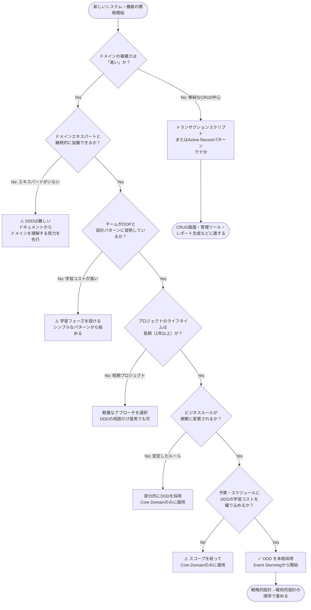
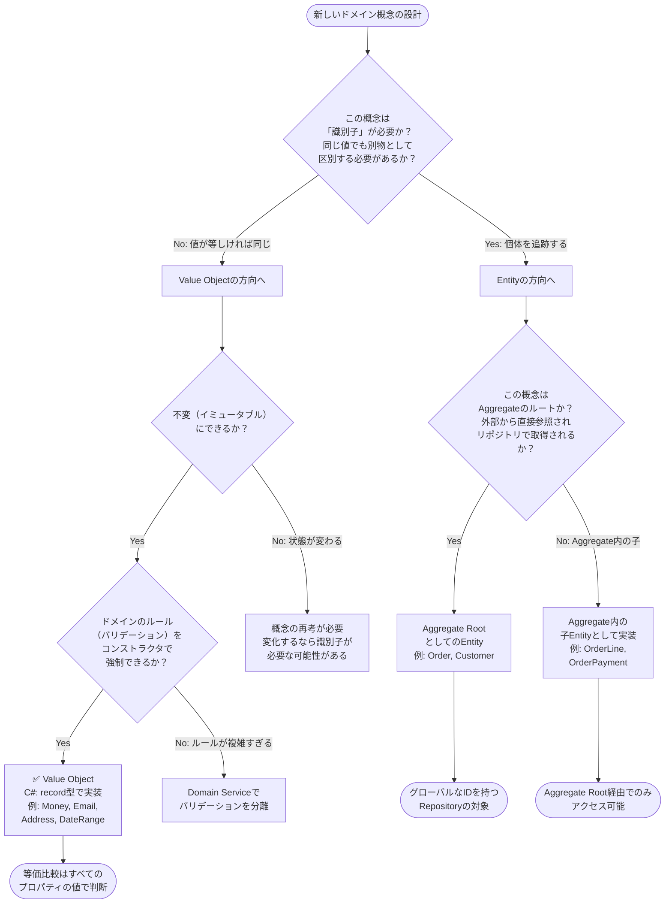
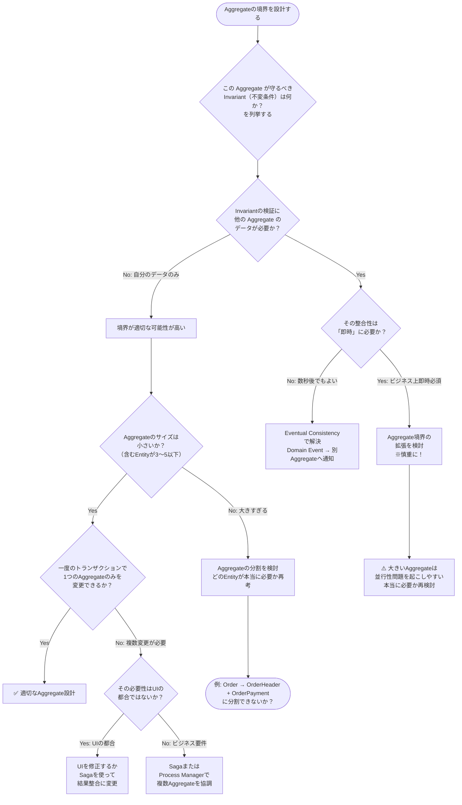
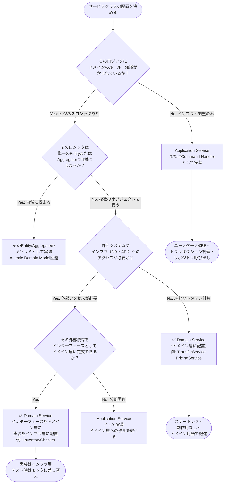
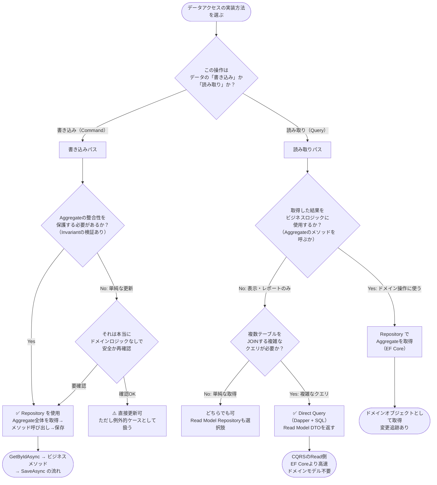
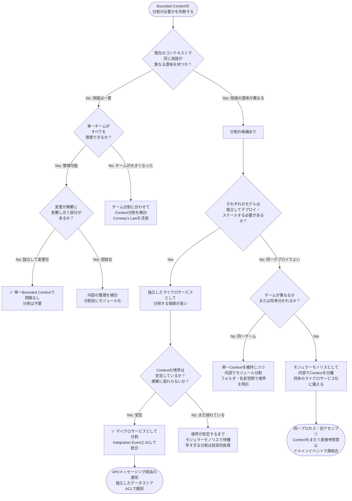

# 付録 C: DDD 総合判断フローチャート

本付録では、DDD を実践する際に繰り返し直面する設計の判断ポイントを、フローチャートと説明文で整理します。「どこで DDD を使うか」から「個々のオブジェクトをどう設計するか」まで、6 つの判断フローを提供します。

---

## C.1 DDD を使うかどうかの判断フロー

### フローチャート

### 判断ポイントの説明

DDD はすべてのシステムに適用すべき「銀の弾丸」ではありません。最初の判断軸は「ドメインの複雑さ」です。ドメインの複雑さとは、ビジネスルールの量・変更頻度・例外ケースの多さによって測られます。例えば、単純な商品マスタの CRUD 画面は DDD の恩恵を受けにくく、むしろオーバーエンジニアリングになります。一方、保険の引受審査・金融商品の価格計算・物流の配送ルート最適化などは、ルールが複雑で変化するため DDD が力を発揮します。

重要なのは「ドメインエキスパートとの協働可能性」です。DDD は開発者だけで実践できる手法ではなく、ビジネスの専門家との継続的な対話が前提です。エキスパートが協働できない場合、Ubiquitous Language の確立もモデルの検証もできません。

また「チームの習熟度」と「プロジェクト期間」も重要です。DDD の学習コスト（Value Object・Aggregate 設計・Event Storming の実践など）は 3〜6 ヶ月単位の投資です。短期プロジェクトではその回収が困難なため、軽量なアプローチを選ぶことが合理的です。

「すべてに DDD を適用する必要はない」という認識も大切です。Eric Evans 自身が Core Domain 以外への過剰適用を戒めています。まず Core Domain を特定し、そこにのみ DDD のパワーを集中させるアプローチが成功率を高めます。

---

## C.2 Value Object vs Entity の判断フロー

### フローチャート

### 判断ポイントの説明

Value Object と Entity の判断は「同一性をどう定義するか」という哲学的な問いです。最初に問うべきは「この 2 つのインスタンスが同じかどうかを、どうやって判断するか？」です。

「1000 円」という金額は、どの 1000 円でも同じです。誰の財布にある 1000 円かを追跡する必要はありません。これが Value Object の特性です。一方「顧客 ID: C001 の田中さん」は、名前が「山田さん」に変わっても同じ顧客として追跡する必要があります。これが Entity の特性です。

Value Object は不変性が必須です。一度作られた Value Object は変更されず、値を変えたい場合は新しい Value Object を作成します（例：`money.Add(new Money(500, "JPY"))` は `money` を変えず新しい `Money` を返す）。この不変性により、副作用のない安全なオブジェクトが実現します。

C# の `record` 型は Value Object に最適です。`record Money(decimal Amount, string Currency)` と定義するだけで、値ベースの等価比較（`==` 演算子で両フィールドを比較）が自動的に実装されます。

Entity を設計する際は「Aggregate Root かどうか」のさらなる判断が必要です。Repository の対象となり外部から直接取得されるものは Aggregate Root、Aggregate の内部にのみ存在するものは子 Entity です。子 Entity は Aggregate Root を経由してのみアクセスできます。

---

## C.3 Aggregate 境界の決定フロー

### フローチャート

### 判断ポイントの説明

Aggregate の境界設計は DDD 実践において最も難しい判断の一つです。Vaughn Vernon は「できる限り小さな Aggregate を設計し、必要な場合のみ拡張せよ」と述べています。

最初のステップは「Invariant の列挙」です。例えば Order Aggregate なら「注文アイテムの合計金額は正でなければならない」「確定済み注文のアイテムは変更できない」などです。これらの Invariant を保護するために最低限必要なエンティティ・値オブジェクトの集合が Aggregate の境界候補となります。

次の重要な問いは「整合性は即時に必要か」です。多くの場合、ビジネスルールが「即時整合性が必須」に見えても、実際には数秒〜数分のずれが許容されます。例えば「注文後に在庫を減らす」は、即時である必要はなく Eventual Consistency で十分です（在庫引き当ての失敗を後処理で対応）。この判断を誤り、多くのエンティティを一つの Aggregate に詰め込むと、トランザクション競合・パフォーマンス低下・テストの複雑化などの問題が起きます。

「一つのトランザクションで一つの Aggregate のみを変更する」原則は、特に現場で抵抗を受けやすい指針です。しかし、この原則を守ることで、システムの並行性が格段に向上します。複数の Aggregate を変更したい場合は、Saga や Domain Event を使って非同期に処理します。

---

## C.4 Domain Service vs Application Service の判断フロー

### フローチャート

### 判断ポイントの説明

Domain Service と Application Service の混乱は DDD 実践でよく起こる問題です。両者の最大の違いは「ドメインロジックを持つかどうか」です。

Application Service（MediatR では Command Handler）はユースケースの調整役です。「リポジトリから Aggregate を取得する」「Aggregate のメソッドを呼ぶ」「変更を保存する」「Domain Event を発行する」という手順を管理しますが、自らビジネスの判断を下しません。Application Service が「もし〇〇なら△△する」という条件分岐を多数持ち始めたら、ドメインロジックが漏れ出しているサインです。

Domain Service はドメイン知識を持ちますが、特定のエンティティや値オブジェクトに自然に属さないロジックを担当します。典型例は「送金サービス（TransferService）」です。送金は「Source Account」と「Destination Account」の 2 つの Aggregate にまたがる操作であり、どちらか一方のメソッドとして実装するのは不自然です。こういった「複数のドメインオブジェクトを使ったドメインルールの適用」が Domain Service の出番です。

Domain Service が外部システム（在庫確認 API など）に依存する場合は、インターフェースをドメイン層に定義し（`IInventoryChecker`）、実装をインフラ層に置くことで依存性を逆転させます。これにより Domain Service のユニットテストでモックが利用できます。

「このロジックはどこに置くべきか」と迷った際のチェックリスト：(1) エンティティのメソッドにできないか？→まずここを検討 (2) 複数のドメインオブジェクトを使うか？→Domain Service (3) ビジネスルールなしに手順を調整するだけか？→Application Service

---

## C.5 Repository vs Direct Query の判断フロー

### フローチャート

### 判断ポイントの説明

Repository を使うかどうかの判断は、CQRS の文脈で「Write 側か Read 側か」という問いに帰着します。

Write 側（Command 処理）では、原則として Repository を通じて Aggregate を取得します。理由は、Repository が Unit of Work（変更追跡）を通じて Aggregate の変更を自動的に検出し、保存時に整合性のある状態で永続化するためです。直接 SQL で UPDATE することは Aggregate の Invariant チェックを回避するリスクがあります（例：直接 ORDER 行を UPDATE すると、在庫との整合性チェックが実行されない）。

Read 側（Query 処理）では、多くの場合 Repository を使う必要がありません。Read 用のクエリは複数テーブルの JOIN・集計・ページング等を含むことが多く、Aggregate の形にデシリアライズしてから DTO に変換するのは無駄なコストです。Dapper を使った直接 SQL で Read Model DTO を返すアプローチが効率的です。

ただし例外もあります。ページネーションやフィルタリングが不要で、1 件の Aggregate を取得して表示するだけなら、EF Core の AsNoTracking() を使った Repository 経由でも十分なパフォーマンスが得られます。「パフォーマンスの問題が発生してから最適化する」というアプローチも合理的です。

EF Core と Dapper を共存させる設計（EF Core は Write 側・Dapper は Read 側）は多くの DDD プロジェクトで採用されており、実績のあるアプローチです。両方が同じ接続文字列とトランザクションを使えるよう、`IDbConnection` を `DbContext` から取得する形で統合します。

---

## C.6 Bounded Context の分割判断フロー

### フローチャート

### 判断ポイントの説明

Bounded Context の分割は「いつ・どう分けるか」が問題です。分割が早すぎると境界の設定ミスにより後の修正コストが膨大になり、遅すぎるとモデルが肥大化して一貫性を失います。

最初に問うべきは「同じ用語が異なる意味を持つか」です。例えば「顧客（Customer）」という概念が、Sales Context では「見込み顧客・見積相手」を意味し、Shipping Context では「配送先の住所持ち主」を意味するなら、明確な分割のサインです。同じ「Customer」クラスに両方の属性を詰め込もうとすると、どちらの関心も上手く表現できない中途半端なモデルになります。

チームの構造は Bounded Context の分割に直結します（Conway's Law）。「マイクロサービス化したい」という技術的な要望の前に「チームが分かれているか」を確認します。同一チームが管理するなら、技術的には単一 Bounded Context（または内部分割したモジュラーモノリス）で十分なことが多いです。

「分割するが、マイクロサービスにするかどうか」は別の判断です。まずはモジュラーモノリスとして同一プロセス内で Bounded Context を分離し、境界が安定してから独立したサービスに切り出すアプローチが、近年多く推奨されています。マイクロサービス化による運用コスト（独立したデプロイ・ネットワーク障害対応・分散トレーシングなど）を理解した上で意思決定します。

モジュラーモノリスの実装では、Context をまたぐ直接参照（別 Context のクラスを直接 `new`、または `using` で参照する）を禁止し、Domain Event またはメッセージングで疎結合を維持します。C# プロジェクトでは、各 Bounded Context を別アセンブリ（プロジェクト）として定義し、コンパイル時に境界違反を検出できるようにするアプローチが効果的です。

---

## C.7 フローチャートの使い方ガイド

### 設計判断フローを実務に活かす方法

本付録のフローチャートは、設計判断の「正解を自動的に導くツール」ではなく、「見落としがちな判断軸を提示するチェックリスト」として活用してください。

**Event Storming との組み合わせ**

Event Storming でドメインの全体像を把握した後、以下の順序でフローチャートを参照することを推奨します。

1. **C.1**（DDD 採用判断）→ 対象ドメインに DDD を適用するかを決める
2. **C.6**（Bounded Context 分割）→ コンテキストマップを作成する
3. **C.3**（Aggregate 境界）→ 各コンテキスト内の Aggregate を設計する
4. **C.2**（Value Object vs Entity）→ 個々のドメインオブジェクトを設計する
5. **C.4**（Domain Service vs Application Service）→ サービス層を設計する
6. **C.5**（Repository vs Direct Query）→ データアクセス層を設計する

**レビューでの活用**

プルリクエストのレビューで「この設計判断は正しいか」を議論する際、フローチャートを参照することで客観的な判断軸を共有できます。「なぜ Entity にしたのか」「なぜ Aggregate を分割しなかったのか」という問いに対して、フローを辿ることで根拠を明示できます。

**段階的な適用**

DDD を初めて適用するチームでは、最初からすべてのパターンを使おうとせず、以下の優先順位で段階的に導入することを推奨します。

- **フェーズ 1**: Value Object・Entity・Aggregate・Repository（C.2・C.3・C.5 を参照）
- **フェーズ 2**: Domain Event・Application Service・Domain Service（C.4 を参照）
- **フェーズ 3**: Bounded Context 分割・CQRS・Outbox Pattern（C.6 を参照）
- **フェーズ 4**: Event Sourcing・Saga・Process Manager（十分な経験を積んだ後）

各フェーズの移行タイミングは、「現在の実装に限界を感じた時」が最良です。技術的な完璧さを先取りするのではなく、ビジネスの問題解決を優先することが DDD 実践の本質です。

---

*本付録のフローチャートは Mermaid 形式で記述されています。GitHub・GitLab・Notion・VS Code（Markdown Preview Mermaid Support 拡張）などでレンダリングできます。チームのドキュメントとして共有する際はそのままコピーしてご利用ください。*
