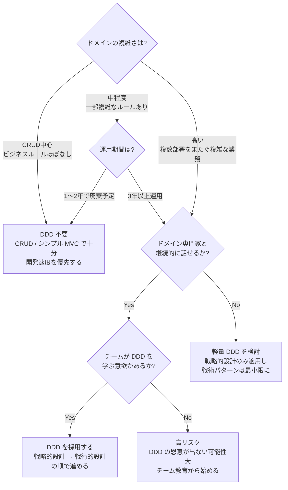
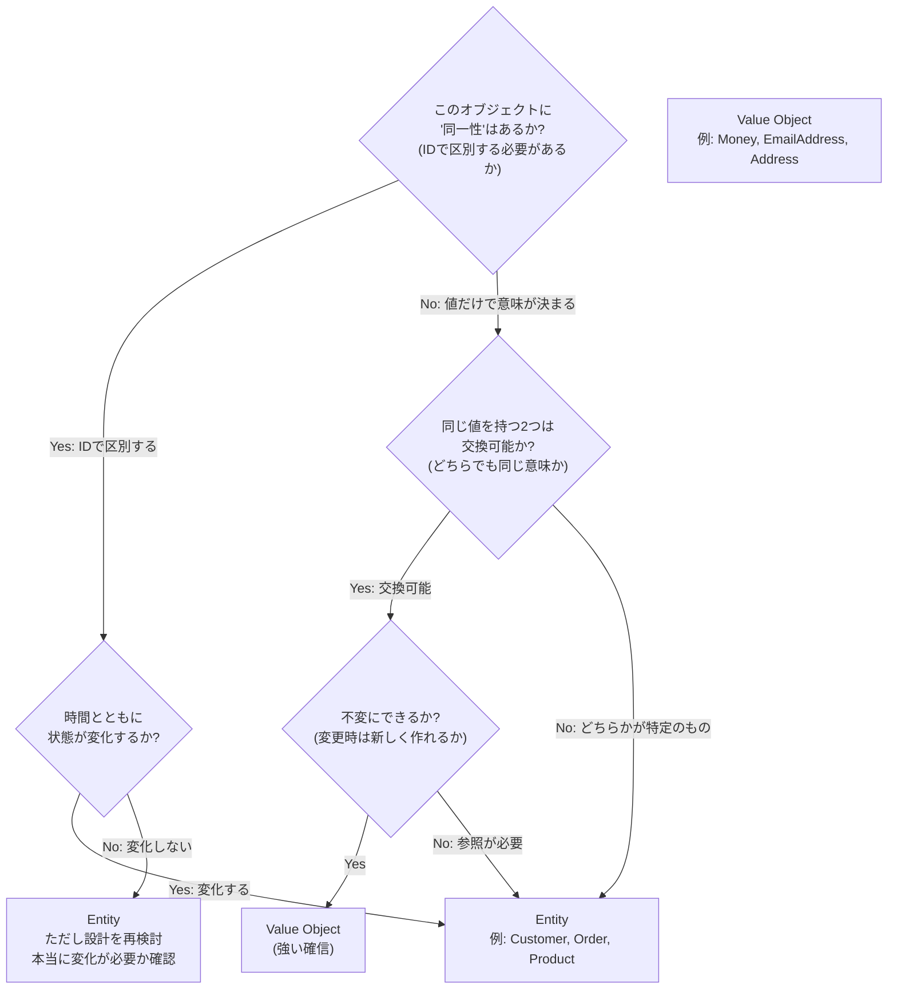
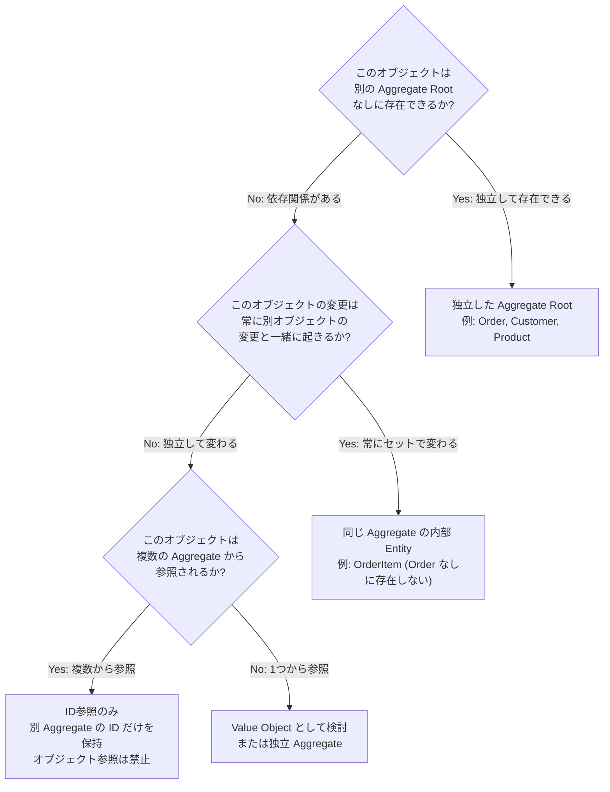
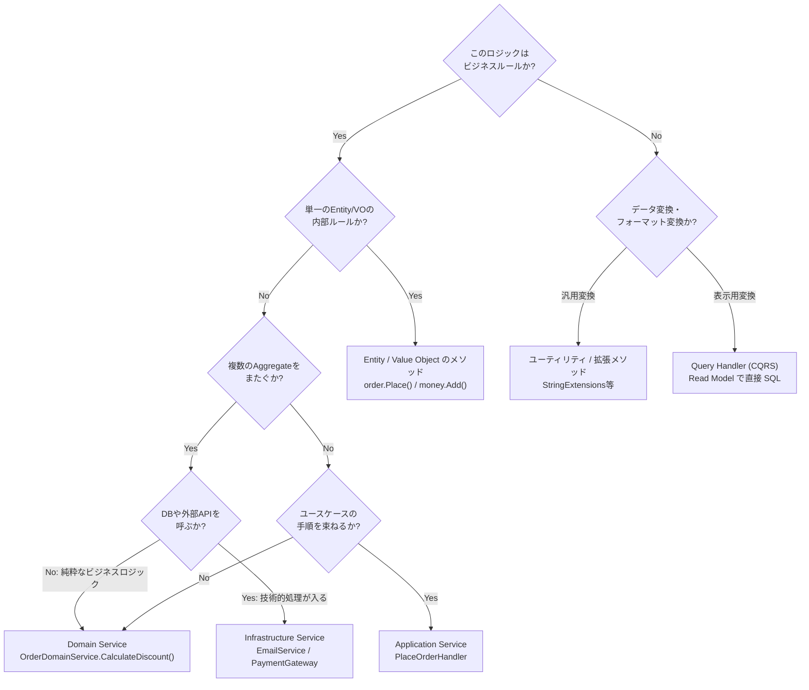
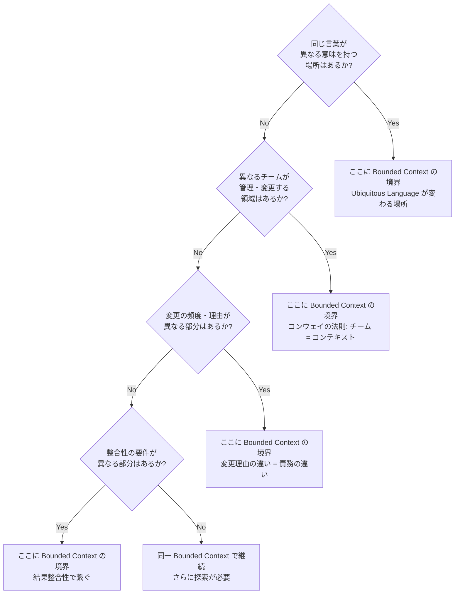
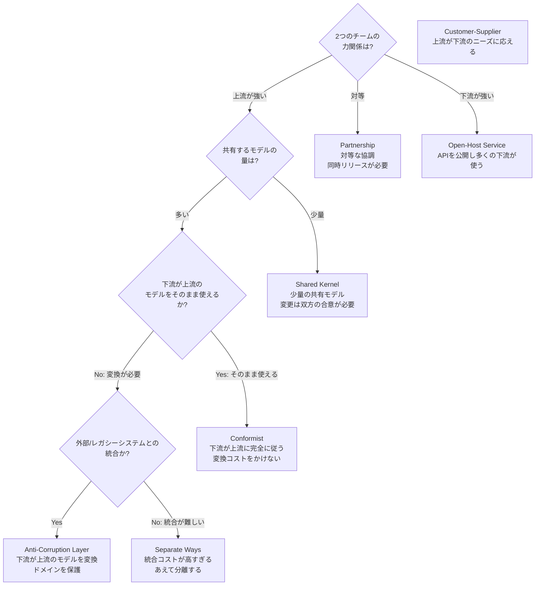

# 付録 C: DDD 総合判断フローチャート

「このロジックはどこに書けばいいか」「これは Entity か Value Object か」——DDD を実践する中で繰り返し直面する判断を、1枚のフローチャートで整理します。

---

## フローチャート1: DDD を使うべきか

---

## フローチャート2: Entity か Value Object か

---

## フローチャート3: どの Aggregate に含めるか

---

## フローチャート4: ロジックをどこに書くか

---

## フローチャート5: Bounded Context の境界をどこに引くか

---

## フローチャート6: Context Map の統合パターン選択

---

## 全パターン早見表（1枚まとめ）

| 判断 | 条件 | 答え |
|------|------|------|
| **DDD を使うか** | CRUD中心 | 不要 |
| | 複雑なドメイン + 長期運用 | 使う |
| **Entity vs VO** | ID で区別 + 状態変化あり | Entity |
| | 値で意味が決まる + 不変 | Value Object |
| **Aggregate の大きさ** | 常に一緒に変わる | 同一Aggregate |
| | 独立して変わる | 別Aggregate + ID参照 |
| **ロジックの配置** | 単体のルール | Entity/VO |
| | 複数Aggregate + 純粋ロジック | Domain Service |
| | 外部IO | Infrastructure Service |
| | ユースケースの手順 | Application Service |
| **境界の場所** | 同じ言葉が違う意味を持つ場所 | Bounded Context 境界 |
| **Context Map** | 対等な協調 | Partnership |
| | 上流強い + 少量共有 | Shared Kernel |
| | レガシー統合 | Anti-Corruption Layer |
