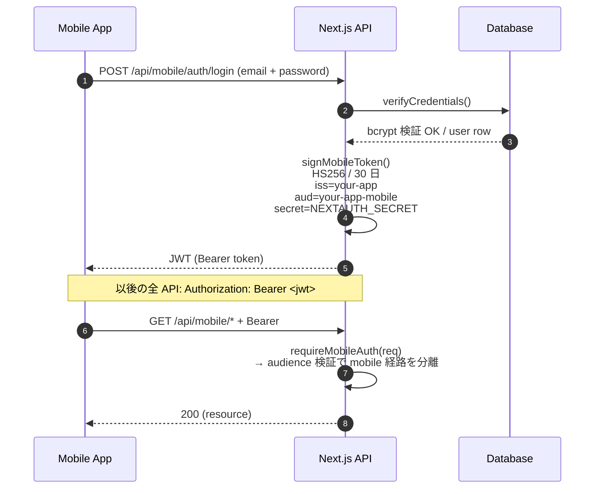

Web 側で NextAuth (Auth.js) を回している場合、mobile を生やす時に最も悩むのが「session 共有をどうするか」だ。本章のゴールは次の判断と設計を共有すること:

- なぜ NextAuth の Cookie session を mobile に直接持ち込まないか
- なぜ「自前 JWT エンドポイント `/api/mobile/auth/*`」を別途切るのが正解か
- どうやって `NEXTAUTH_SECRET` を共有しながら issuer / audience で用途を分離するか

## 結論 (先に書く)



mobile から Bearer JWT を渡し、API 側で `audience` を見て Web と mobile の経路を意図的に分けるのがコアアイデア。

ポイントは 3 つ:

1. **NextAuth Cookie は使わない** (mobile から扱いにくい、CSRF / SameSite で破綻する)
2. **でも `NEXTAUTH_SECRET` は再利用する** (鍵管理を増やさない)
3. **issuer / audience で「Web NextAuth JWT」と「Mobile 自前 JWT」を区別** (将来トークン仕様を分岐させやすい)

## なぜ Cookie を持ち込まないか

選択肢を比べると分かる。

| 方式 | 実装難度 | 課題 |
|---|---|---|
| Cookie + `credentials: "include"` | 低 | iOS の WebView 系で SameSite 競合、Safari の Cookie 削除挙動が読みにくい、CSRF 対策が増える |
| Bearer JWT | 中 | 自分でトークン管理 (refresh / rotation) を書く必要がある |
| OAuth2 (PKCE) フル実装 | 高 | サードパーティ IdP 必須、初期段階だと過剰 |

「自前 SaaS で email/password と Google ログインだけ」なら **Bearer JWT が最小コストで一番安定**。

## サーバ側: `/api/mobile/auth/login`

Next.js Route Handler の最小サンプル。

```ts
// app/api/mobile/auth/login/route.ts
import { NextRequest, NextResponse } from "next/server";
import { SignJWT } from "jose";
import { z } from "zod";
import { verifyCredentials } from "@/lib/auth-server";

const Body = z.object({
  email: z.string().email(),
  password: z.string().min(8),
});

const secret = new TextEncoder().encode(process.env.NEXTAUTH_SECRET!);

export async function POST(req: NextRequest) {
  const parsed = Body.safeParse(await req.json());
  if (!parsed.success) {
    return NextResponse.json({ error: "invalid_body" }, { status: 400 });
  }
  const user = await verifyCredentials(parsed.data.email, parsed.data.password);
  if (!user) {
    return NextResponse.json({ error: "invalid_credentials" }, { status: 401 });
  }

  const token = await new SignJWT({ sub: user.id, email: user.email })
    .setProtectedHeader({ alg: "HS256" })
    .setIssuer("your-app")
    .setAudience("your-app-mobile")
    .setExpirationTime("30d")
    .setIssuedAt()
    .sign(secret);

  return NextResponse.json({ token, user });
}
```

検証側はこう:

```ts
// lib/mobile-auth.ts
import { jwtVerify } from "jose";

const secret = new TextEncoder().encode(process.env.NEXTAUTH_SECRET!);

export async function requireMobileAuth(req: Request): Promise<{ sub: string }> {
  const auth = req.headers.get("authorization") ?? "";
  const token = auth.replace(/^Bearer\s+/i, "");
  if (!token) throw new Response("unauthorized", { status: 401 });
  const { payload } = await jwtVerify(token, secret, {
    issuer: "your-app",
    audience: "your-app-mobile",  // ← Web NextAuth と区別
  });
  return { sub: String(payload.sub) };
}
```

設計理由: NextAuth (Auth.js) の JWT はデフォルトで `aud` claim を発行しないため、`audience` を **両方で明示** して mobile / Web の経路を意図的に区別する。将来 token 仕様を分岐させやすくする保険でもある。

サンプルでは認証直後の最小ハンドラだけを示しているが、**プロダクション運用では `revoked_at` / `password_changed_at` を user テーブルに持って、`requireMobileAuth` で照会するのが必須** だ。本書はその一行を `// TODO` として残している。

## クライアント側 (mobile)

```ts
// lib/api.ts
import { getToken } from "@/lib/auth-storage";

const BASE_URL = process.env.EXPO_PUBLIC_API_BASE_URL!;

export async function apiFetch<T>(path: string, init?: RequestInit): Promise<T> {
  const token = await getToken();
  const res = await fetch(`${BASE_URL}${path}`, {
    ...init,
    headers: {
      "Content-Type": "application/json",
      ...(token ? { Authorization: `Bearer ${token}` } : {}),
      ...(init?.headers ?? {}),
    },
  });
  if (!res.ok) throw new Error(`${res.status}`);
  return (await res.json()) as T;
}
```

トークン保存先 (SecureStore / localStorage) の抽象化は次章で扱う。

## Google ログインだけ別経路で考える

`expo-auth-session/providers/google` を使うと、Google が発行した ID Token (JWT) が手に入る。これをサーバの `/api/mobile/auth/google` に POST し、サーバ側で `google-auth-library` の `OAuth2Client.verifyIdToken()` で検証 → 自前 JWT を発行、という流れがクリーン。

```ts
// app/api/mobile/auth/google/route.ts (抜粋)
import { OAuth2Client } from "google-auth-library";

const client = new OAuth2Client(process.env.GOOGLE_CLIENT_ID);

export async function POST(req: Request) {
  const { idToken } = await req.json();
  const ticket = await client.verifyIdToken({
    idToken,
    audience: process.env.GOOGLE_CLIENT_ID,
  });
  const payload = ticket.getPayload();
  // payload.sub / payload.email を使って自前 user を upsert
  // 以後は email/password と同じく自前 JWT を発行
}
```

## 落とし穴

1. **`NEXTAUTH_SECRET` は HS256 推奨の 256 bit (32 byte) 以上を使う**。短い鍵でも `jose` は警告のみで署名/検証は通ってしまうため、誤った安全感を持ちやすい。`openssl rand -base64 48` で再生成して `.env` に置く運用を推奨
2. **token 有効期限を 30 日に伸ばすなら、退会時の即時無効化が必要**。サーバ側に `revoked_at` カラムを持って `requireMobileAuth` で照会する設計を最初から組んでおく
3. **Google Sign In は Expo Go では動かない**。Dev Client または EAS Build した dev build が要る

## 次の章

第 5 章では SecureStore (native) と localStorage (Web プレビュー) を抽象化する storage 層を書く。
