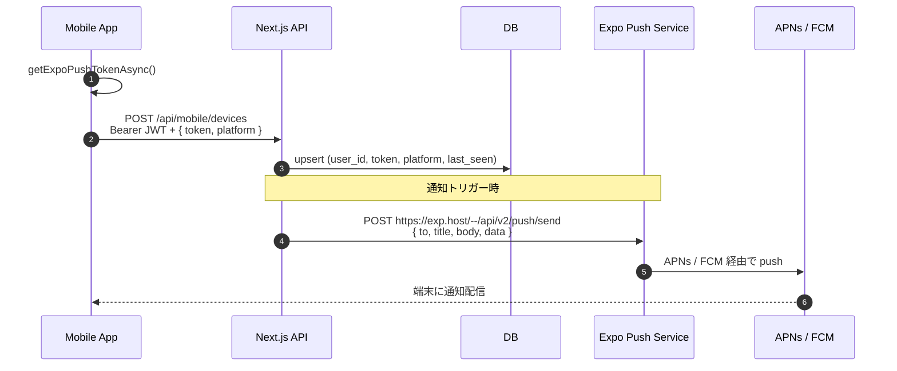

Push 通知は「アプリが完成してから入れる機能」ではなく、**最初に通しておかないとユーザーリテンション設計が破綻する**機能だ。本章では expo-notifications を使って、

- デバイストークンを取得する
- サーバに保存する (`/api/mobile/devices`)
- サーバから expo の Push API を叩いて通知を送る

までを最小手数で配線する。

## 全体像



Expo Push Service が APNs / FCM の鍵管理を肩代わりしてくれる。これが Expo を採用する最大の実利のひとつ。

## クライアント: トークン取得

```ts
// lib/push.ts
import * as Notifications from "expo-notifications";
import * as Device from "expo-device";
import { Platform } from "react-native";
import Constants from "expo-constants";

// expo-notifications 0.28+ (Expo SDK 51+) の return shape。
// SDK 50 以下は `shouldShowAlert` のみで、shouldShowBanner / shouldShowList は無視される。
Notifications.setNotificationHandler({
  handleNotification: async () => ({
    shouldPlaySound: true,
    shouldSetBadge: false,
    shouldShowBanner: true,
    shouldShowList: true,
  }),
});

export async function registerForPushAsync(): Promise<string | null> {
  if (!Device.isDevice) return null; // シミュレータでは取得不能
  const { status: existing } = await Notifications.getPermissionsAsync();
  let final = existing;
  if (existing !== "granted") {
    const { status } = await Notifications.requestPermissionsAsync();
    final = status;
  }
  if (final !== "granted") return null;

  if (Platform.OS === "android") {
    await Notifications.setNotificationChannelAsync("default", {
      name: "default",
      importance: Notifications.AndroidImportance.MAX,
    });
  }

  const projectId = Constants.expoConfig?.extra?.eas?.projectId
    ?? Constants.easConfig?.projectId;
  const { data } = await Notifications.getExpoPushTokenAsync({ projectId });
  return data; // ExponentPushToken[xxxxxxxx...]
}
```

## サーバへの登録

```tsx
// app/(app)/_layout.tsx の useEffect 内
import { registerForPushAsync } from "@/lib/push";
import { apiFetch } from "@/lib/api";

useEffect(() => {
  if (status !== "authenticated") return;
  (async () => {
    const token = await registerForPushAsync();
    if (!token) return;
    await apiFetch("/api/mobile/devices", {
      method: "POST",
      body: JSON.stringify({ token, platform: Platform.OS }),
    });
  })();
}, [status]);
```

サーバ側:

```ts
// app/api/mobile/devices/route.ts
import { NextRequest, NextResponse } from "next/server";
import { requireMobileAuth } from "@/lib/mobile-auth";
import { upsertDevice } from "@/src/common/devices";
import { z } from "zod";

const Body = z.object({
  token: z.string().startsWith("ExponentPushToken["),
  platform: z.enum(["ios", "android"]),
});

export async function POST(req: NextRequest) {
  const { sub: userId } = await requireMobileAuth(req);
  const parsed = Body.safeParse(await req.json());
  if (!parsed.success) {
    return NextResponse.json({ error: "invalid_body" }, { status: 400 });
  }
  await upsertDevice({ userId, ...parsed.data });
  return NextResponse.json({ ok: true });
}
```

`upsertDevice` は `(user_id, token)` 複合 unique で upsert。同じユーザーが iPhone + iPad を持っている場合、`token` ごとに row が増える。

## 通知を実際に送る

```ts
// lib/server/push.ts
type PushPayload = {
  to: string;
  title: string;
  body: string;
  data?: Record<string, unknown>;
};

export async function sendExpoPush(payloads: PushPayload[]): Promise<void> {
  const chunks: PushPayload[][] = [];
  for (let i = 0; i < payloads.length; i += 100) {
    chunks.push(payloads.slice(i, i + 100));
  }
  for (const chunk of chunks) {
    const res = await fetch("https://exp.host/--/api/v2/push/send", {
      method: "POST",
      headers: {
        "Content-Type": "application/json",
        "Accept-Encoding": "gzip, deflate",
      },
      body: JSON.stringify(chunk),
    });
    if (!res.ok) {
      console.error("push_send_failed", res.status, await res.text());
    }
    // 注意: response の data.status === "error" + details.error === "DeviceNotRegistered"
    //       の場合は DB から該当 token を削除する処理を入れる
  }
}
```

## ディープリンク (通知タップ → 特定画面)

```ts
// app/_layout.tsx
import { useEffect } from "react";
import * as Notifications from "expo-notifications";
import { router } from "expo-router";

useEffect(() => {
  const sub = Notifications.addNotificationResponseReceivedListener((response) => {
    const path = response.notification.request.content.data?.path;
    if (typeof path === "string") {
      router.push(path);
    }
  });
  return () => sub.remove();
}, []);
```

サーバ側ペイロードは:

```ts
sendExpoPush([{
  to: device.token,
  title: "新しいメッセージ",
  body: "Sakaki さんが投稿しました",
  data: { path: `/chat/${chatId}` },
}]);
```

これで通知タップ → 該当チャット画面に直接飛べる。

## 落とし穴

1. **Expo Go では `getExpoPushTokenAsync` が動かない**バージョンがある。Dev Client または EAS Build した dev build が必要
2. **iOS の Background fetch から通知を受ける場合は `Info.plist` に capability が要る**。Expo Plugin で自動付与されるが、`app.json` の `ios.entitlements` を素手でいじると壊れる
3. **DeviceNotRegistered エラーは「ユーザーが通知を切った / アプリ削除した」を意味する**。リトライせず即 DB から token を消す
4. **通知のレートリミット**: 1 ユーザーあたり 1 日 100 通までを目安に。それ以上は Push の OFF 化を招く

## 次の章

第 8 章では EAS Build で iOS / Android のストア配布までを 4 つのプロファイルに分けて扱う。
