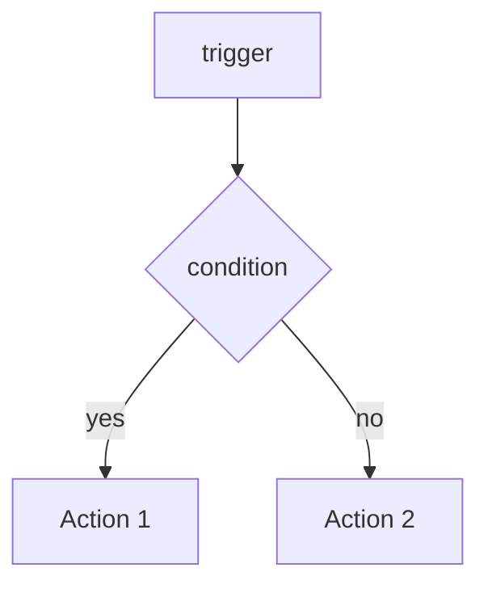

# Voice / トーン辞書

draft 生成時に必ず参照する。**逸脱した draft は reroll**。

## 一人称

- `私` を default。「筆者」「自分」は使わない。
- カジュアルさが必要な締めは `自分` 可。

## 敬体

- 全文 **敬体 (です・ます調)**。
- ただし箇条書き内は体言止め可 (見出し含む)。

## 絵文字

- **本文中の絵文字は禁止**。
- frontmatter `emoji` のみ Zenn 仕様で使用。
- 例外: 章末 `---` 区切りの後の「次の記事」誘導の矢印 `→` は OK。

## コード断片

- 動かない擬似コードは禁止。`// ...` での省略は最小。
- 言語は明示 (`typescript`, `bash`, `yaml`)。
- TypeScript は **strict + any 禁止** で書く (CLAUDE.md C-005/C-006 と一致)。

## 専門用語の前置き

- Anthropic / Claude / Agent SDK / RAG / LLM-as-Judge は前置き不要。
- ただし「13 部署 director」「Decision Genealogy」「Context Engine」「Event Bus」など**社内造語**は初回登場時に 1 行で説明。

## 構造

```
1. 結論 (3 行以内)         — まず何が言えるかを最初に
2. なぜこの記事を書くか (200 字)
3. 本論 (見出し 3-5 段)
4. 落とし穴 / 失敗談       — 必ず 1 セクション入れる
5. 次の記事への誘導
```

## 品質バー (Mandatory — 1 つでも欠けたら reroll)

> ⚠️ 「言っているだけで具体性が無い」記事は AI 量産の薄っぺらい記事として認識される。以下を**最低ライン**として必ず満たすこと。

| 要素 | 最低数 | 例 |
|---|---:|---|
| **Mermaid 図** | **1+** | flowchart / sequenceDiagram / stateDiagram。ASCII 図ではなく必ず ` ```mermaid ` ブロックで書く |
| **実コード断片** | **2+** | TypeScript / Bash / JSON 各 10-30 行、動く / 実 repo にあるものを引用 |
| **file:line 引用** | **3+** | `pipeline-kit/ops/run-orchestrator.sh:415` のように実 path:line で根拠を示す |
| **実測の数字** | **3+** | "884 TS/TSX ファイル"、"Cloud Run revision 64"、"35 分ハング" のような concrete data |
| **Before / After 比較** | **1+** | 失敗談セクションで「壊れたコード」→「直したコード」の対比を必ず示す |

### Mermaid 推奨パターン

| 記事タイプ | 推奨図 |
|---|---|
| アーキテクチャ概観 | `flowchart TB` (Layer 図) |
| 1 日 / 1 リクエストのフロー | `sequenceDiagram` |
| Agent の状態遷移 | `stateDiagram-v2` |
| 部署 / 機構の関係 | `flowchart LR` (左→右の DAG) |
| 時系列 (Phase 移行) | `gantt` |

例:



### 引用の書き方

実コードを貼る場合は **必ず file:line を冒頭で示す**:

```typescript
// pipeline-kit/agents/prompts/_shared/project-namespace-protocol.md:42-58
export type Project = {
  id: string;
  stage: "ideation" | "mvp" | "pmf" | "frozen";
  ...
};
```

「私はこう書いている」だけでは不十分。**「どこに置いてあるか」を示すと読者は repo を覗きに来る** = 連載全体の流入になる。

### 数字の出典

数字を出す場合、出典 / 確認方法を 1 行で添える:

```
TS/TSX ファイル数: 884 (`find App/ -name "*.ts*" | wc -l` 実測)
Komyu Cloud Run revision: 64 (`gcloud run revisions list` で確認)
```

捏造は禁則。確証ない数字は出さない。

## 禁則

- ❌ 「いかがでしたか?」「以上です」「最後までお読みいただきありがとうございました」 — Zenn では即離脱
- ❌ 自慢 / マウント — 「私が作った最強の」「他社にはない」
- ❌ 数字の捏造 — 確証ない数値は出さない (フォロワー / MRR / ユーザ数)
- ❌ 無料 SaaS / OSS の dis — トーン悪化
- ❌ 「個人開発で〜」を冒頭で繰り返す — 1 記事 1 回まで

## 推奨

- ✅ **失敗談を最初に出す** — pnpm v10 force-legacy-deploy 罠 / Worktree isolation バグ等
- ✅ **数字は実測のみ** — 「Komyu の Cloud Run revision 64」「TS/TSX 884 ファイル」
- ✅ **コードの「捨てた版」も載せる** — Before / After で説得力
- ✅ **ADR / Decision-Id で根拠を示す** — 「DEC-20260505-06」のように

## SEO 最低限

- title: 32 字以内 (Zenn の OGP 切れ防止)
- topics: 3-5 個 (`ai`, `claude`, `anthropic`, `nextjs`, `typescript`, `agentsdk` 等)
- 1 記事 4,000-7,000 字目安 (Zenn の読了率最大ゾーン)

## トピック × ハッシュタグ (X)

| 記事カテゴリ | X ハッシュタグ |
|---|---|
| Claude Code 拡張 | `#ClaudeCode` `#AnthropicAPI` |
| Multi-Agent | `#AIエージェント` `#LLM` |
| RAG | `#RAG` `#LLM` |
| Vision | `#ClaudeVision` `#OCR` |
| AI Ops | `#AI駆動開発` `#1人会社` |

複数該当時は **2 つまで**。多すぎると逆効果。
